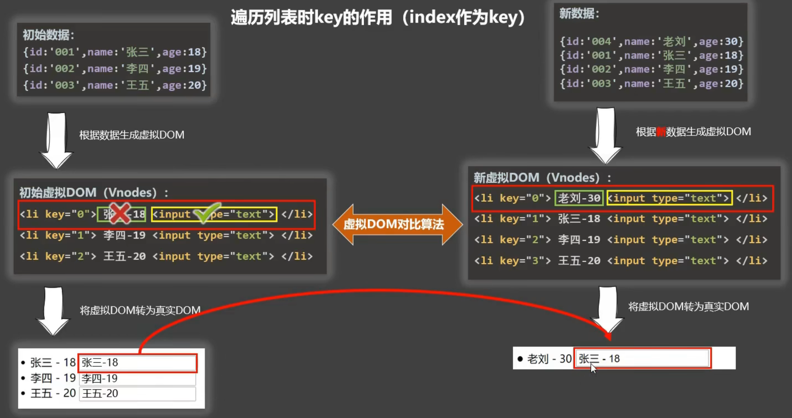

# Vue

---

---

---

## vue核心

---

---

### 一、概述

---

#### (一) Vue 是什么

- 一套用于**构建用户界面**的**渐进式** JavaScript 框架

  > 渐近式：Vue 可以**自底向上**逐层的应用
  >
  > 简单应用只需要一个轻量小巧的核心库
  >
  > 复杂应用可以引入各式各样的 vue 插件

#### (二) Vue 的特点

- :star:采用**组件化**模式，提高代码<u>复用</u>率，让代码更好<u>维护</u>

  > 一个`.vue`文件就是一个组件，其中可以写三大前端语言

- :star:**声明式**编码，无需直接操作 DOM，提高开发效率

  > 命令式编码：
  >
  > ```js
  > let htmlStr = '';
  > persons.forEach(p => htmlStr += `<li>${p.id}-${p.name}</li>`);
  > let list = document.getElementById('list');
  > list.innerHTML = htmlStr;
  > ```
  >
  > 声明式编码：
  >
  > ```vue
  > <ul id='list'>
  >     <li v-for="p in persons">
  >     	{{p.id}}-{{p.name}}
  >     </li>
  > </ul>
  > ```

- 使用**虚拟 DOM** + 优秀的 **Diff 算法**，尽量复用 DOM 结点

  > 

#### (三) Hello World

```vue
<div id="root">
    <h1>Hello {{name}}</h1>
</div>
<script type="text/javascript">
    Vue.config.productionTip = false;
    new Vue({
        el:'#root',//建立实例与容器之间的关系，值通常为css选择器字符串
        data:{//存储数据，供el所指定的容器使用，值暂时写成一个对象（讲组件之后可能写成函数）
            name:'hitsz'
        }
    });
</script>
```

> - 想让 Vue 工作，就需要创建一个 Vue 实例，且要传入一个**配置对象**
>
>   > 一般来说，<u>一个 Vue 实例对应一个容器</u>
>   >
>   > > 不过一个 Vue 实例可以有多个手下，分管不同的属性
>   > >
>   > > （**组件化**）
>
> - 容器中的代码依然符合 HTML 规范，只不过混入了 Vue 语法
>
>   > `{{xxx}}`中要写 <u>js 表达式</u>，且其中的内容可以自动读取到 data 中的属性
>
> - 容器中的代码称为 Vue 模板
>
>   > 先有容器，再有 Vue 实例，然后解析，根据语法操作数据，更新容器

---

### 二、模板语法

---

#### (一) 插值语法

- 功能：用于**解析标签体内容**
- 写法：`{{xxx}}`，`xxx`是 JS 表达式，可以直接读取到`data`中的所有属性

#### (二) 指令语法

- 功能：用于**解析标签**

  > 包括：标签属性、标签体内容、绑定事件 ......

> 举例：
>
> `v-bind:href="xxx"`，或简写为`:href="xxx"`
>
> `xxx`中同样要写表达式，可以直接读取到`data`中的属性
>
> > 如果`data`中属性太多，可以考虑分级，<u>将某些属性封装成一个对象</u>

> 备注：Vue 中有很多指令，且形式都是`v-???`

---

### 三、数据绑定

---

#### (一) 单向数据绑定

- `v-bind`
- 数据只能从`data`流向页面

#### (二) 双向数据绑定

- `v-model`
- 数据不仅能从`data`流向页面，还可以从页面流向`data`

> - 双向绑定一般都应用在表单类元素上（如 input、select 等）
> - :star:`v-model:value`可以简写为`v-model`，因为`v-model`默认就会收集`value`属性

> Vue 实例的简单应用
>
> - 程序员用到的属性都是以`$`开头的
>
> - `el`的第二种写法：挂载
>
>   ```js
>   const v = new Vue({
>       //el: '#root',
>       data: {
>           value: 'hitsz'
>       }
>   })
>   v.$mount('#root');//mount：挂载
>   ```
>
> - `data`的第二种写法：函数式
>
>   ```js
>   const v = new Vue({
>       //el: '#root',
>       //data: function () {
>       data() {
>           console.log(this);//Vue实例对象
>           return {
>               value: 'hitsz'
>           };
>       }
>   })
>   v.$mount('#root');
>   ```
>
>   > 注意，不要写成箭头函数，否则`this`指向不是 Vue 实例，而是 Window

---

### 四、MVVM

---

#### (一) 概念

- M：Model

  > 对应 data 中的数据

- V：View

  > 模板

- VM：View Model

  > Vue 实例对象

#### (二) 图示


> 补充：
>
> - 其实`data`中的属性最后都会封装到 Vue 实例中
> - vm 中的所有属性，以及 Vue 原型对象上的所有属性，在 Vue 模板中都可以直接使用

---

### 五、数据代理

---

#### (零) Object.defineProperty 回顾

- 使用`descriptor`来控制属性是否可以：

  - 被**枚举**：`enumrable`
  - 被**修改**：`writable`
  - 被**删除**：`configurable`

  > 注意，它们的默认值都是`false`

- :star:**动态**绑定`descriptor`中的`value`属性：使用<u>`getter`和`setter`</u>

  - 放弃`value`属性配置

  - 配置`getter`和`setter`

    ```js
    let number = 18;
    let person = {
        name: '张三',
        sex: '男'
    }
    Object.defineProperty(person, 'age', {
        get() {
            return number;
        },
        set(value) {
            number = value;
        }
    });
    ```

#### (一) 概述

- 数据代理：通过一个对象代理另一个对象中的**属性的操作**

#### (二) 数据代理原理

1. `new` Vue 实例时**传入的对象**叫做`options`

2. **Vue 实例**叫做`vm`

   > 创建 Vue 实例时，有类似于`vm._data = options.data`的操作，但本质是数据劫持，`_data`和`data`<u>不完全相同</u>，这是为了<u>让页面自动更新</u>

   > 到这一步时，模板中其实已经可以读取到这个`_data`了

3. Vue 底层又将`_data`中的数据用`vm`对象代理了

   > 这样就不用写`_data.`了

#### (三) 图示


#### (四) 总结

- vm 对象代理 data 对象中属性的操作，可以更加方便的操作 data 中的数据
- 基本原理：
  - 通过`Object.defineProperty`方法把`data`对象中的属性添加到`vm`上
  - 为每一个`vm`上的属性都添加<u>`setter`和`getter`</u>

---

### 六、事件处理

---

#### (一) 事件的基本使用

- 使用`v-on:xxx`或者`@xxx`绑定事件，其中`xxx`是事件名
- 事件的回调需要配置在<u>`methods`对象</u>中，最终会在`vm`对象上
- `methods`中配置的函数，都是被 Vue 管理的函数，其中的`this`要指向`vm`或组件实例对象
- 函数名后不带括号，只能传`event`；为了传参，要使用如下例子中的方法

```js
<body>
<div id="root">
    <h2>欢迎来到{{school}}学习</h2>
<!--<button v-on:click="showInfo">查看校训</button>-->
    <button @click="showInfo1">查看校训(无参)</button>
    <button @click="showInfo2($event, 66)">查看校训2(传参)</button>
</div>
</body>
<script type="text/javascript">
const vm = new Vue({
    el: '#root',
    data:{
        school: 'hitsz',
    },
    methods:{//写到methods中就不会数据代理了
        showInfo1(event) {//不能写箭头函数，不然this就不是vm了
            console.log(event);
            console.log(event.target);
            console.log(this === vm);//true
        },
        showInfo2(event, number) {
            console.log(event);
            console.log(event.target);
            console.log(number);
        }
    }
});
</script>
```

> 当回调函数很简单时，也可以简写，直接将语句写到标签内
>
> ```html
> <button @click="回调函数语句;"></button>
> ```
>
> 当然，模板只会去`vm`中寻找内容，找不到直接报错

#### (二) 事件修饰符

> 用法：`@事件名.修饰符="函数名"`

- :star:`prevent`：阻止默认事件行为

- :star:`stop`：阻止事件冒泡

- :star:`once`：事件只触发一次

- `capture`：使用事件的捕获模式（也就是在捕获阶段执行回调）

- `self`：只有`event.target`是<u>当前操作的元素</u>时才触发事件

  > 比如冒泡时，`event.target`就<u>一直是最里层的目标</u>，但触发的是<u>不同元素的事件</u>
  >
  > 所以用`self`也可以阻止冒泡

- `passive`：让事件的**默认行为**立即执行，不会等待回调函数执行结束

  > 正常情况下，要等**回调函数全部执行结束**，事件的默认行为才会结束

  > 举例：
  >
  > `scroll`和`wheel`的区别：
  >
  > - `scroll`是滚动条的移动
  > - `wheel`是鼠标自身滚轮的滚动
  >
  > 使用事件`@wheel.passive`时，就会先让<u>默认事件：滚动条向下移动</u>执行，才会执行 wheel 回调函数中的内容

> 事件修饰符可以<u>链式拼接</u>，有先后<u>顺序</u>

#### (三) 键盘事件

- Vue 常用按键**别名**

  - 回车：`enter`

  - 退格和删除：`delete`

  - 退出：`esc`

  - 空格：`space`

  - 换行：`tab`

    > 但注意，Tab 键本身就有<u>移走焦点</u>的功能，所以 Tab 就不适合 key up，但可以用key down

  - 上、下、左、右：`up`、`down`、`left`、`right`

  >用法举例：
  >
  >```js
  ><body>
  >    <div id="root">
  >        <!--<input type="text" placeholder="按下回车提示输入" @keyup="showInfo">-->
  >    <input type="text" placeholder="按下回车提示输入" @keyup.enter="showInfo">
  >     </div>
  ></body>
  ><script type="text/javascript">
  >    const vm = new Vue({
  >        el: '#root',
  >        methods:{
  >            showInfo(event) {
  >                //if(event.keyCode !== 13) return;
  >                console.log(event.target.value);
  >            },
  >        }
  >    });
  ></script>
  >```
  >
  >也就是说<u>只有对应按键</u>才能触发事件，也算做<u>一种**修饰**</u>

- 对于 Vue 未提供别名的按键，可以使用按键原始的 **key 值**去绑定，但注意要转换为kebab-case（短横线命名）

  > 比如 CapsLock 要转换为 caps-lock

  > 也可以通过 `键盘事件.keyCode`的方式，但已经不推荐了

- 系统修饰键（用法特殊）

  - 包括：`ctrl`、`alt`、`shift`、`meta`

    > 也是别名

  - 配合 keyup 使用：按下修饰键的同时，再按下其他按键，随后释放其他键，事件才能被触发

  - 配合 keydown 使用：按下直接触发

- `Vue.config.keyCodes.自定义键名 = 键码`，可以定制别名 

- 键盘相关修饰符也可以<u>链式拼接</u>

---

### 七、计算属性与监视

---

#### (一) 为什么要这样

- Vue 推荐在**模板**中使用<u>简短的表达式</u>，不推荐在模板中进行各种运算
- 如果使用在插值中使用函数，就没有**缓存**机制，会重复无意义的调用

#### (二) 什么是计算属性

- 要用的属性不存在，需要通过已有的属性计算得来

> 原理 ：底层借助了 Object.defineProperty 提供的 getter 和 setter

####  (三) 计算属性的使用

- 指定`options`的`computed`属性，`computed`的属性值也应是对象
- 这个<u>对象内部的属性名</u>就是**计算属性名**，属性值又是一个对象，其中有<u>`getter`和`setter`</u>

```html
<body>
<div id="root">
    family name: <input type="text" v-model="familyName"><br>
    first name: <input type="text" v-model="firstName"><br>
    <!--full name: <span>{{familyName.slice(0, 3)}} {{firstName}}</span><br>-->
    <!--full name: <span>{{fullName()}}</span>--><!--只要data中数据有变，就会重新解析模板-->
    full name: <span>{{fullName}}</span>
</div>
</body>
<script type="text/javascript">
    const vm = new Vue({
        el: '#root',
        data: {
            familyName: 'Zhang',
            firstName: 'San',
        },
        /*methods: {
          fullName() {
              return this.familyName + " " + this.firstName;
          }
        }*/
        computed: {
            fullName: {
                //可以缓存，防止无意义的多次调用
                //什么时候调用？1.初次 2.依赖数据改变
                get(){
                    return this.familyName + ' ' + this.firstName;
                },
                //set只有在需要修改的时候才会用到
                //什么时候
                set(value) {
                    let str = value + '';
                    const arr = str.split(' ');
                    this.familyName = arr[0];
                    this.firstName = arr[1];
                }
            }
        }
    })
</script>
```

> :star:计算属性的简写：将属性名与`getter`融合
>
> （在不使用`setter`的情况下才可以）
>
> ```html
> <body>
> <div id="root">
>  family name: <input type="text" v-model="familyName"><br>
>  first name: <input type="text" v-model="firstName"><br>
>  full name: <span>{{fullName}}</span><!--这儿不要加()-->
> </div>
> </body>
> <script type="text/javascript">
>  const vm = new Vue({
>      el: '#root',
>      data: {
>          familyName: 'Zhang',
>          firstName: 'San',
>      },
>      computed: {
>          fullName() {
>                  return this.familyName + ' ' + this.firstName;
>              }
>          }
>      }
>  })
> </script>
> ```

#### (四) 计算属性的特点

- `getter`只在以下两种情况执行

  - **第一次**读取时
  - 依赖的数据发生**改变**时

- 原理：<u>`getter`的返回值</u>会给到**计算属性**名，<u>直接存储在`vm`中</u>，可以直接读取

  > 注意，计算属性<u>不在`vm._data`中</u>

- 优势：与`methods`实现相比，内部有**缓存**机制，效率高，调用方便

> ps：如果计算属性的值会被**直接**修改（而不是通过<u>修改依赖属性</u>而修改），需要提供`setter`去响应修改，并且要去<u>修改依赖属性值</u>（当然这种情况很少）

#### (五) 监视属性

> 可以监视**普通属性**和**计算属性**

- 在`options`中设置监视
  - 设置`wacth`属性，属性值是一个配置对象
  - 配置对象中有`handler(newValue, oldValue)`方法，属性值改变后会执行回调
  - 配置对象中有`immediate`属性，设置为`true`时可以让`handler`在初始化后执行一次
- 通过`vm`设置监视
  - `vm.$watch('属性名', 配置对象{...})`

> 举例：
>
> ```js
> <body>
> <div id="root">
>  <h2>today is {{weather}}</h2>
>  <button @click="isHot = !isHot">change whether</butt
> </div>
> </body>
> <script type="text/javascript">
>  const vm = new Vue({
>      el: '#root',
>      data: {
>          isHot: true
>      },
>      computed: {
>          weather() {
>              return this.isHot ? '炎热' : '凉爽';
>          }
>      },
>      methods: {
>          /*changeWeather() {
>              this.isHot = !this.isHot;
>          }*/
>      },
>      /*watch: {
>          isHot: {
>              immediate:true,//初始化时让handler执行一次
>              handler(newValue, oldValue) {
>                  console.log(newValue, oldValue);
>              }
>          }
>      }*/
>  });
>  vm.$watch('isHot', {
>      immediate: true,
>      handler(newValue, oldValue) {
>          console.log(newValue, oldValue);
>      }
>  });
> </script>
> ```

> :star:关于深度监视：
>
> - 如果监视的属性是一个对象，那么使用一般的监视时，如果对象内部的数据发生变化，`handler`不会执行，因为**地址**没有改变
>
> - 让`watch`监测到深度改变：<u>配置对象中`deep: true`</u>
>
>   > Vue 提供的`watch`默认是不可以监测到对象内部值改变的

> :star:监视的简写：将属性名与`handler`融合 / 将对象与`handler`融合
>
> （当然这是在不需要其他属性为**默认值**的情况下才可以用）
>
> ```js
> watch: {
>  /*isHot: {
>      deep:true,//开启深度监视
>      immediate:true,//初始化时让handler执行一次
>      handler(newValue, oldValue) {
>          console.log(newValue, oldValue);
>      }
>  }*/
>  isHot(newValue, oldValue) {
>      console.log(newValue, oldValue);
>  }
> }
> ```
>
> ```js
> /*vm.$watch('isHot', {
>  immediate: true,
>  deep: true,
>  handler(newValue, oldValue) {
>      console.log(newValue, oldValue);
>  }
> });*/
> vm.$watch('isHot', function (newValue, oldValue) {
>  console.log(newValue, oldValue);
> })
> ```

> 其实 Vue 内部也有对`data`的**默认监视**，当监视到`data`改变时立刻**更新** DOM 结点

#### (六) computed 与 watch

- computerd 能完成的，watch 一定能完成，反之不然

- 两个重要小原则：

  - 被 <u>Vue 管理的函数</u>最好写成**普通函数**而不是箭头函数

  - 不被 Vue 管理的函数，最好写成**箭头函数**，这样`this`才指向`vm`

    > 比如：定时器的回调、ajax 的回调、Promise 的回调

---

### 八、class与style绑定

---

#### (一) 绑定 class

- **字符串**写法：适用于样式的**类名不确定**，需要动态指定（一般是只有**一个类名**）

  ```html
  <body>
  <div id="root">
      <div class="basic" :class="mood" @click="changeMood">{{name}}</div>
  </div>
  </body>
  <script type="text/javascript">
      new Vue({
          el: '#root',
          data: {
              name: 'hitsz',
              mood: 'normal'
          },
          methods: {
              changeMood() {
                  const arr = ['happy', 'sad', 'normal'];
                  let index = Math.floor(Math.random()*arr.length);
                  this.mood = arr[index];
              }
          }
      });
  </script>
  ```

- **数组**写法：适用于要绑定的**样式个数不确定**，**名字也不确定**

  ```html
  <body>
  <div id="root">
      <div class="basic" :class="classArr">{{name}}</div>
  </div>
  </body>
  <script type="text/javascript">
      new Vue({
          el: '#root',
          data: {
              name: 'hitsz',
              mood: 'normal',
              classArr: ['c9', 'c2', 'c1']
          },
          methods: {
              ...
          }
      });
  </script>
  ```

- **对象**写法：适用于要绑定的**样式个数确定**、**名字确定**，但**动态决定要不要用**

  ```html
  <body>
  <div id="root">
      <div class="basic" :class="classObj" >{{name}}</div>
  </div>
  </body>
  <script type="text/javascript">
      new Vue({
          el: '#root',
          data: {
              name: 'hitsz',
              mood: 'normal',
              classArr: ['c9', 'c2', 'c1'],
              classObj: {
                  c9: false,
                  c2: true
              }
          },
          methods: {
              ...
          }
      });
  </script>
  ```

#### (二) 绑定 style

> 大多数情况下都用**对象**写法，也可以用数组写法，但很少用

```html
<body>
<div id="root">
    <div class="basic" :style="styleObj">{{name}}</div>
</div>
</body>
<script type="text/javascript">
    new Vue({
        el: '#root',
        data: {
            name: 'hitsz',
            mood: 'normal',
            styleObj: {
                fontSize: '40px', //font-size在vue中写成fontSize
                backgroundColor: 'orange'
            }
        },
        methods: {
            ...
        }
    });
</script>
```

---

### 九、条件渲染

---

#### (一) v-if

- 写法
  - `v-if="表达式"`
  - `v-else-if="表达式"`
  - `v-else="表达式"`
- 适用于
  - **切换频率较低**的场景
- 特点
  - 不展示的 DOM 元素直接移除
- 注意
  - `v-if`可以与`v-else-if`和`v-else`一起使用，但要求结构不能被打断
  - 可以与`template`标签结合，同时渲染`template`中的元素

#### (二) v-show

- 写法

  - `v-show="表达式"`

- 适用于

  - **切换频率较高**的场景

- 特点

  - 不展示的 DOM 元素未被移除，仅仅是使用样式被隐藏

    > style 中的 display 指定为 none

> ps: 使用`v-if`时，元素可能无法获取到；使用`v-show`时，元素一定可以获取到

> 举例：
>
> ```html
> <body>
> <div id="root">
>     <!--使用v-show做条件渲染，底层是style display:none-->
>     <!--<div v-show="false">欢迎来到{{name}}</div>-->
>     <!--使用v-if，直接删除或添加结点-->
>     <!--<div v-if="false">欢迎来到{{name}}</div>-->
>     <h2>当前n的值是：{{n}}</h2>
>     <button @click="n++">点击n+1</button>
>     <div v-show="n===1">hitsz is c9</div>
>     <div v-show="n===3">hitsz is c2</div>
>     <div v-show="n===2">hitsz is c1</div>
>     <div v-if="n===1">hitsz is c9</div>
>     <!--不能被打断，甚至会报错-->
>     <!--<div>@</div>-->
>     <div v-else-if="n===3">hitsz is c2</div>
>     <div v-else-if="n===2">hitsz is c1</div>
>     <div v-else>hitsz is ???</div>
>     <!--template只能与v-if一起用-->
>     <template v-if="n === 1">
>         <h2>hello</h2>
>         <h2>hit</h2>
>         <h2>c9</h2>
>     </template>
> </div>
> </body>
> <script type="text/javascript">
>     new Vue({
>         el: '#root',
>         data: {
>             n: 0
>         }
>     });
> </script>
> ```

---

### 十、列表渲染

---

#### (一) v-for

- 用于展示列表数据

- 语法

  ```js
  v-for="(item, index) in xxx" :key="yyy"
  ```

  > (item, index) 是两个形参，分别代表元素和下标；
  >
  > 可以直接用插值（最好加上小括号）

  > 标签 key 属性是每个被遍历的结点的**标识**，最好写上，动态绑定，**不能重复**

- 可遍历

  - 数组

    ```html
    <h2>人员列表（遍历数组）</h2>
    <ul>
    	<li v-for="(p,index) of persons" :key="index">
    		{{p.name}}-{{p.age}}
    	</li>
    </ul>
    ```

    ```js
    data:{
    	persons:[
    		{id:'001',name:'张三',age:18},
    		{id:'002',name:'李四',age:19},
    		{id:'003',name:'王五',age:20},
    		{id:'004',name:'赵六',age:17}
    	]
    }
    ```

  - 对象

    ```html
    <h2>汽车信息（遍历对象）</h2>
    <ul>
    				<!--(value, key)-->
    	<li v-for="(value,k) of car" :key="k">
    		{{k}}-{{value}}
    	</li>
    </ul>
    ```

    ```js
    new Vue({
    	el:'#root',
    	data:{
    		car:{
    			name:'奥迪A8',
    			price:'70万',
    			color:'黑色'
    		}
    	}
    })
    ```

  - 字符串（用的很少）

    ```html
    <h2>测试遍历字符串（用得少）</h2>
    <ul>
    	<li v-for="(char,index) of str" :key="index">
    		{{char}}-{{index}}
    	</li>
    </ul>
    ```

    ```js
    new Vue({
    	el:'#root',
    	data:{
    		str:'hello'
    	}
    })
    ```

  - 指定次数（用的很少）

    ```html
    <h2>测试遍历指定次数（用得少）</h2>
    <ul>
    				<!--number从1开始，index从0开始-->
    	<li v-for="(number,index) of 5" :key="index">
    		{{index}}-{{number}}
    	</li>
    </ul>
    ```

#### (二) key 的原理

- *问题引入与分析*

  - 用数组`index`作`key`

    

    

    > 用 index 作为 key 可能会引发的问题：
    >
    > - 若对数据进行<u>逆序添加、逆序删除</u>等**<u>破坏顺序</u>**操作
    >   - 会产生**没有必要的**真实DOM更新 ==> 界面效果没问题, 但**效率低**
    > - 如果结构中还包含**输入类的DOM**
    >   - 会产生**错误DOM更新** ==> **界面有问题**

  - 用数据唯一标识作`key`

    

    

    > 用`id`作`key`可以充分利用 Vue 的 **Diff 算法**

- *虚拟 DOM 中 key 的作用*

  - key 是**<u>虚拟DOM对象的标识</u>**。当**数据发生变化**时，Vue会根据<u>新数据</u>生成<u>新的虚拟DOM</u>, 随后Vue进行<u>新虚拟DOM</u>与<u>旧虚拟DOM</u>的差异比较

    > key 是虚拟 DOM 用的，和真实 DOM 无关

  - 比较规则是：

    - <u>旧虚拟DOM</u>中找到了与<u>新虚拟DOM</u>**相同的key**
      - 若虚拟DOM中<u>有没变的内容</u>, **直接使用之前的**真实DOM
      - 若虚拟DOM中<u>有改变了的内容</u>, 则**生成新的**真实DOM，随后**替换**掉页面中之前的真实 DOM
    - 旧虚拟DOM中**未找到**与新虚拟DOM**相同的key**
      - **创建新的**真实DOM，随后渲染到到页面

- *开发中如何选择 key*

  - 最好使用每条数据的<u>唯一标识</u>作为 key, 比如id、手机号、身份证号、学号等唯一值
  - 如果不存在对数据的**逆序添加**、**逆序删除**等<u>破坏顺序操作</u>，仅用于渲染列表用于**展示**，使用 index 作为 key 是没有问题的

#### (三) 列表过滤与排序

1. 收集过滤/排序的**依据**

2. 判断是否需要**<u>新属性</u>**存储过滤/排序后的**结果**

   > 就是能不能**直接改**原数据，不能改的话，就要**新增**一个属性

3. 选择`watch`和`computed`

   > 当 watch 和 computed 都可以实现时，用 computed 更好
   >
   > > 比如，如果需要**一上来就有值**，对于 watch 来说，还需要加一个 **immediate**，但<u>对于 computed 来说，就直接有值了</u>

4. 理清`watch`或`computer`的逻辑，正确得到新值

> 举例：
>
> ```html
> <body>
> <div id="root">
>     <h2>人员列表</h2>
>     <input type="text" placeholder="请输入名字" v-model="keyWord"><!--1. 收集用户输入-->
>     <ul>
>         <!--6. 这里也要用过滤后的数组-->
>         <li v-for="(p,index) of filPersons" :key="p.id">
>             {{p.name}}-{{p.age}}-{{p.sex}}
>         </li>
>     </ul>
> </div>
> </body>
> <script type="text/javascript">
>     Vue.config.productionTip = false
>    /* new Vue({
>         el: '#root',
>         data: {
>             keyWord: '',
>             persons: [
>                 {id: '001', name: '马冬梅', age: 19, sex: '女'},
>                 {id: '002', name: '周冬雨', age: 20, sex: '女'},
>                 {id: '003', name: '周杰伦', age: 21, sex: '男'},
>                 {id: '004', name: '温兆伦', age: 22, sex: '男'}
>             ],
>             filPersons: []/!*5. 过滤之后的存放到这里，不影响原数组*!/
>         },
>         //用watch实现
>         watch: {
>             //7. 这样不能满足需求，一上来没东西
>             /!*keyWord(val) {/!*2. 先可简单的写，功能实现不了再扩展*!/
>                 /!*4. 原数组被修改了，不要这样*!/
>                 this.filPerons = this.persons.filter((p) => {/!*3. filter不影响原数组*!/
>                     return (p.name.indexOf(val) !== -1);
>                 })
>             }*!/
>             keyWord: {
>                 //8. 立即执行一次，就可以让它一上来就有值
>                 immediate: true,
>                 handler(val) {
>                     this.filPersons = this.persons.filter((p) => {
>                         return (p.name.indexOf(val) !== -1);
>                     });
>                 },
>             }
>         }
>     })*/
>     //9.watch能实现的，用computed或许也可以实现;这里要用到的filPersons，其实就是用keyWord计算出来的;当watch和computed都可以实现时，用computed更好
>     new Vue({
>         el:'#root',
>         data:{
>             keyWord:'',
>             persons:[
>                 {id:'001',name:'马冬梅',age:19,sex:'女'},
>                 {id:'002',name:'周冬雨',age:20,sex:'女'},
>                 {id:'003',name:'周杰伦',age:21,sex:'男'},
>                 {id:'004',name:'温兆伦',age:22,sex:'男'}
>             ]
>         },
>         computed:{
>             filPersons(){
>                 return this.persons.filter((p)=>{
>                     //10.这里收不到newValue了，需要直接拿到this.keyWord (newValue = this.keyWord)
>                     return p.name.indexOf(this.keyWord) !== -1;
>                 });
>             }
>         }
>     })
> </script>
> ```

#### (四) :star:侦听的原理

- Vue **侦听对象**的原理（不单指`watch`，而是指 Vue 所有的默认侦听）

  - 先有`options.data`

  - Vue 底层创建了一个可以监视`options.data`的实例对象

    > 使用的是`Object.defineProperty`的原理，**劫持**数据；
    >
    > :star:其中的==***setter***==就可以去**重新解析模板**，响应给 DOM 结点，实现**侦听**:star:

    > Vue 底层监视了不只一层，会**递归**的监视对象内部的嵌套对象与数组
    >
    > ==vue会监视data中所有层次的数据==

    > 这其中就有**数据劫持**

  - 将**监视对象**赋值给`vm._data`

  - 再用`vm`代理`vm._data`

    > 所以说，`_data`体现的是**数据侦听**（劫持），`vm`中的属性体现的是**数据代理**

- :star:Vue.set 与 vm.$set 的使用 / **增加**对象内部**响应式属性**

  - 向`vm_data`中的某一个**对象追加属性**，并能提供**响应式**功能

  - `Vue.set(vm.target, key, val)`

  - `vm.$set(vm.target, key, val)`

    > 注意，其中都有数据代理，`vm.target`代理了`vm._data.target`

    > 但`target`不能是`vm._data`，这也是局限之一；
    >
    > :star:`Vue.set()`和`vm.$set()`不能给`vm`或`vm`的根数据对象添加属性:star:

- Vue **侦听数组**的原理

  - 写成数组后，**数组中的元素**就没有`setter`和`getter`，无法这样监视

    > 所以用`arr[index] = xxx;`的方式去修改，无法被 Vue 侦听
    >
    > 除非<u>直接用`Vue.set(vm.arr, index, newVal)`</u>

  - 想要被 Vue 监听到，就要调用能**影响到原数组**的相关**方法**

    > 这就是 Vue **规定**的，是一种**包装**技术，
    >
    > 将相关方法包装了，不再是 Array.prototype 中的方法了

    > 数组中的元素如果是一个对象，是可以被 Vue 自动设置响应式的，
    >
    > 也就是`vm.arr[index].obj = xxx;`是可以的

    > <u>:star:push、pop、shift、unshift、splice、sort、reverse</u>都是可以的
    >
    > Vue.set() 或 vm.$set() 也行
    >
    > > 对于 filter、concat、slice 这种非变更方法，可以用新数组替换原数组

  - 数组中数据修改被侦听到后，重新解析模板，进而更新页面

> 在 Vue 中，一旦被侦听的数据发生改变，就会重新解析整个模板

---

### 十一、:star:收集表单数据

---

- <input type="text"/>
  - 则v-model收集的是value值，**用户输入**的就是value值
  
- <input type="radio"/>
  - 则v-model收集的是value值，且<u>要给标签配置value值</u>
  
- <input type="checkbox"/>
  - 没有配置input的value属性，那么收集的就是**checked**（勾选 or 未勾选，是布尔值）
  
    > checkbox 中的 v-model 比较特殊，默认收集 checked，而不收集 value
  
  - 配置input的***value***属性:
    - v-model的初始值是非数组，那么收集的就是checked（勾选 or 未勾选，是布尔值）
    - <u>v-model的初始值是**数组**</u>，那么收集的就是**<u>value组成的数组</u>**

> :star:备注：v-model的三个修饰符
>
> - lazy：**失去焦点**再收集数据
> - number：输入字符串转为有效的**数字**
> - trim：输入首尾**空格**过滤

---

### 十二、过滤器

---

> 在 Vue3 中已经移除

```
定义：对要显示的数据进行特定格式化后再显示（适用于一些简单逻辑的处理）。
语法：
      1.注册过滤器：Vue.filter(name,callback) 或 new Vue{filters:{}}
      2.使用过滤器：{{ xxx | 过滤器名}}  或  v-bind:属性 = "xxx | 过滤器名"
备注：
      1.过滤器也可以接收额外参数、多个过滤器也可以串联
      2.并没有改变原本的数据, 是产生新的对应的数据
```

```html
<body>
	<div id="root">
		<h2>显示格式化后的时间</h2>
		<!-- 计算属性实现 -->
		<h3>现在是：{{fmtTime}}</h3>
		<!-- methods实现 -->
		<h3>现在是：{{getFmtTime()}}</h3>
		<!-- 过滤器实现 (使用默认值)-->
		<h3>现在是：{{time | timeFormater}}</h3>
		<!-- 过滤器实现（传参） -->
		<h3>现在是：{{time | timeFormater('YYYY_MM_DD') | mySlice}}</h3>
		<!--过滤器串联，按顺过滤，上一个过滤器的返回值是下一个过滤器的第一个参数-->
		<!--v-bind中也可以使用过滤器-->
		<h3 :x="msg | mySlice">尚硅谷</h3>
	</div>
	<div id="root2">
		<h2>{{msg | mySlice}}</h2>
	</div>
</body>
<script type="text/javascript">
	Vue.config.productionTip = false
	//全局过滤器
	Vue.filter('mySlice',function(value){
		return value.slice(0,4)
	})
	
	new Vue({
		el:'#root',
		data:{
			time:1621561377603, //时间戳
			msg:'你好，尚硅谷'
		},
		computed: {
			fmtTime(){
				return dayjs(this.time).format('YYYY年MM月DD日 HH:mm:ss')
			}
		},
		methods: {
			getFmtTime(){
				return dayjs(this.time).format('YYYY年MM月DD日 HH:mm:ss')
			}
		},
		//局部过滤器
		filters:{
			timeFormater(value,str='YYYY年MM月DD日 HH:mm:ss'){
				// console.log('@',value)
				return dayjs(value).format(str)
			}
		}
	})
	new Vue({
		el:'#root2',
		data:{
			msg:'hello,atguigu!'
		}
	})
</script>
```

---

### 十三、指令深入

---

> 上文中介绍过的指令：
>
> - v-bind	: 单向绑定解析表达式, 可简写为 :xxx
> - v-model	: 双向数据绑定
> - v-for  	: 遍历数组/对象/字符串
> - v-on   	: 绑定事件监听, 可简写为@
> - v-if 	 	: 条件渲染（动态控制节点是否存存在）
> - v-else 	: 条件渲染（动态控制节点是否存存在）
> - v-show 	: 条件渲染 (动态控制节点是否展示)

#### (一) v-text 与 v-html

- *v-text 作用*
  - 向其所在的节点中渲染**文本**内容
- *v-text 与插值语法的区别*
  - v-text会**替换**掉节点中的内容，{{xx}}则不会

- *v-html 作用*
  - 向指定节点中**渲染**包含html结构的内容。
- *v-html 与插值语法的区别*
  - v-html会替换掉节点中所有的内容，{{xx}}则不会。
  - v-html可以识别html结构。
- *严重注意：v-html有安全性问题*
  - 在网站上**动态渲染任意HTML是**非常危险的，容易导致XSS攻击。
  - 一定要在**可信的内容**上使用v-html，永**不要用在用户提交的内容**上！

#### (二) v-cloak

> 处理 **JS 阻塞**导致的页面闪现

- 本质是一个**特殊属性**，Vue实例创建完毕并接管容器后，会删掉v-cloak属性。
- 使用css配合v-cloak可以解决网速慢时页面展示出{{xxx}}的问题。

> 举例：
>
> ```html
> <head>
> 	<meta charset="UTF-8" />
> 	<title>v-cloak指令</title>
> 	<style>
> 		[v-cloak]{
> 			display:none;
> 		}
> 	</style>
> </head>
> <body>
> 	<div id="root">
> 		<h2 v-cloak>{{name}}</h2>
> 	</div>
> 	<script type="text/javascript" src="http://localhost:8080/resource/5s/vue.js"></script>
> </body>
> ```

#### (三) v-once

- v-once所在节点在**初次动态渲染**后，就视为**静态**内容了
- 以后数据的改变**不会引起v-once所在结构的更新**，可以用于**优化性能**

#### (四) v-pre

- **跳过**其所在节点的**编译**过程
- 可利用它跳过：没有使用**指令**语法、没有使用**插值**语法的节点，会**加快编译**

#### (五) 自定义指令

> 自定义指令时就需要亲自**操作 DOM 元素**了，指令相关函数中的 this 也都变成 Window

- `options.directives`对象，在其中指定属性（或函数）

  > 属性值可以是**函数**，也可以是一个**对象**，看指令的复杂情况选择，
  >
  > 属性名（或函数名）不需要加`v-`

- 如果使用函数，第一个参数是**真实元素**（真实DOM），第二个参数是DOM结点中**绑定的信息**，可以在函数体内直接操作 DOM 结点

  > 函数什么时候会调用？
  >
  > - 指令与元素**成功绑定**时（一上来）
  >
  >   > 但并不是**放到页面上**时。
  >   >
  >   > 所以对于一些需要**在放置到页面上后**立即执行的语句，
  >   >
  >   > 就不能放在这个函数体中。
  >   >
  >   > 这就需要写成一个对象了
  >
  > - 指令所在模板被**重新解析**时

- 如果属性值写成一个对象，就需要提供三个函数，<u>**bind**、**inserted**、**update**</u>，都能够收到上面说的两个参数

  > 函数名不能变；
  >
  > bind 与 update 的函数体往往是相同的，所以上面的函数写法其实是一种**简写**

> 上述两种方式都有全局的写法
>
> ```js
> Vue.directive(指令名,配置对象)
> Vue.directive(指令名,回调函数)
> ```

> 举例：
>
> ```html
> <body>
> 	<div id="root">
> 		<h2>{{name}}</h2>
> 		<h2>当前的n值是：<span v-text="n"></span> </h2>
> 									<!--不要写成bigNumber，会报错-->
> 		<!-- <h2>放大10倍后的n值是：<span v-big-number="n"></span> </h2> -->
> 		<h2>放大10倍后的n值是：<span v-big="n"></span> </h2>
> 		<button @click="n++">点我n+1</button>
> 		<hr/>
> 		<input type="text" v-fbind:value="n">
> 	</div>
> </body>
> <script type="text/javascript">
> 	Vue.config.productionTip = false
> 	//定义全局指令
> 	/* Vue.directive('fbind',{
> 		//指令与元素成功绑定时（一上来）
> 		bind(element,binding){
> 			element.value = binding.value
> 		},
> 		//指令所在元素被插入页面时
> 		inserted(element,binding){
> 			element.focus()
> 		},
> 		//指令所在的模板被重新解析时
> 		update(element,binding){
> 			element.value = binding.value
> 		}
> 	}) */
> 	new Vue({
> 		el:'#root',
> 		data:{
> 			name:'尚硅谷',
> 			n:1
> 		},
> 		directives:{
> 			//big函数何时会被调用？1.指令与元素成功绑定时（一上来）。2.指令所在的模板被重新解析时。
> 			/*函数名中有`-`，只能用字符串包围了*/
> 			/* 'big-number'(element,binding){
> 				// console.log('big')
> 				element.innerText = binding.value * 10
> 			}, */
> 			big(element,binding){
> 				console.log('big',this) //注意此处的this是window
> 				// console.log('big')
> 				element.innerText = binding.value * 10
> 			},
> 			fbind:{
> 				//指令与元素成功绑定时（一上来）
> 				bind(element,binding){
> 					element.value = binding.value
> 				},
> 				//指令所在元素被插入页面时
> 				inserted(element,binding){
> 					element.focus()
> 				},
> 				//指令所在的模板被重新解析时
> 				update(element,binding){
> 					element.value = binding.value
> 				}
> 			}
> 		}
> 	})
> 	
> </script>
> ```

---

### 十四、生命周期

---

#### (一) 生命周期的概述

- 生命周期又名：生命周期**回调函数**、生命周期函数、生命周期**钩子**
- 是什么：Vue在**关键时刻**帮我们**调用**的一些特殊名称的函数
- 生命周期函数的名字不可更改，但函数的具体内容是程序员根据需求编写的
- 生命周期函数中的 this 指向是 **vm** 或 **组件实例对象**

#### (二) 生命周期图


> - **挂载流程**中的一些点
>
>   - 要 create 的就是**数据监测**和**数据代理**
>
>   - 也可以通过 template 属性指定**模板**，属性值是一个字符串
>
>     > 但 template 字符串中**只能有一个根元素**，一般用 div 作为 component root，这个根元素 div 会直接替换HTML代码中的div
>
>   - outerHTML 包括 rootDiv
>
>   - vm.$el 留存了虚拟DOM转换为**真实DOM**后的值
>
>   - ***mounted*** 是比较重要的
>
> - **更新流程**中的一些点
>
>   - beforeUpdate 时，**页面**和**数据**尚未保持同步
>
> - **销毁流程**中的一些点
>
>   - vm.$destroy 会解绑指令与 Vue 自定义的事件监听器，并触发接下来的钩子
>   - beforeDestroy 中会进行一些与 mounted 相对应的操作（收尾操作），这个时候 data、methods、指令等等都可用，但是对数据的修改不会触发 update

#### (三) 总结

- 常用的生命周期钩子
  - ***mounted***: 发送ajax请求、启动定时器、绑定自定义事件、订阅消息等**初始化操作**
  - ***beforeDestroy***: 清除定时器、解绑自定义事件、取消订阅消息等**收尾工作**
- 关于销毁Vue实例
  - 销毁后借助Vue开发者工具看不到任何信息
  - 销毁后自定义事件会失效，但**原生DOM事件**依然有效
  - 一般不会在beforeDestroy**操作数据**，因为即便操作数据，也不会再触发**更新**流程了

---

---

## vue组件化编程

---

---

### 一、概述

---

#### (一) 开发模式对比

- *传统的前端开发模式*

  

- *组件方式开发模式*

  

#### (二) 对组件的理解

- *组件的定义*
  - 实现应用中**局部**功能**代码**和**资源**的<u>集合</u>
  - 组件是**可复用**的 Vue **实例**

---

### 二、非单文件组件

---

#### (一) 概念问题

- 非单文件组件：一个文件中包含多个**组件**
- 单文件组件：一个文件就是一个**组件**

#### (二) :star:在 Vue 中使用组件

1. *定义组件（创建组件）*

   - 使用 <u>`Vue.extend(options)`</u> 创建

     > 一个简写方式：
     >
     > `const school = Vue.extend(options);` 
     >
     > 可简写为：`const school = options;`

   - 其中 `options` 和`new Vue(options)` 时传入的那个`options`几乎一样
     但也有点**区别**：

     - `el `不要写

       > 最终所有的组件都要经过一个**vm的管理**，
       >
       > 由**vm中的el决定**服务哪个**容器**

     - `data`必须写成**函数**

       > 避免组件被**复用**时，数据存在**引用**关系
       >
       > > **引用**关系会导致，一个用组件的改数据了，更一个用**相同组件**的数据也跟着变了。
       > >
       > > 所以要写成函数，每次使用组件都是一个**新的对象**

   - 配置组件中的**结构**

     - 可以使用`template`属性配置模板，属性值可以是**模板字符串**

       > 注意，**组件模板**字符串结构需要有一个 **div** 包裹，
       >
       > 或者说，**template属性中只能一个根元素**，不然报错
       >
       > （不同于vm的template，这里的div会出现在真实DOM中，没谁可替换的）

       > 目前只是单文件写法

2. *注册组件*

   - 局部注册： new Vue 的时候传入 ***components*** 选项

     - 属性名为**<u>注册</u>后<u>使用</u>时的名**，属性值为**刚定义的组件**

       > 同名可以简写

   - 全局注册：`Vue.component('组件名',组件)`

   > 关于组件名：
   >
   > - 一个单词组成：
   >   - 第一种写法(首字母小写)：school
   >   - 第二种写法(**首字母大写**)：School
   > - 多个单词组成：
   >   - 第一种写法<u>(kebab-case</u>命名)：my-school
   >   - 第二种写法(<u>CamelCase</u>命名)：MySchool (需要**<u>Vue脚手架</u>**支持)
   > - 备注：
   >   - 组件名尽可能**回避HTML**中已有的元素名称，例如：h2、H2都不行
   >   - 可以使用**name配置项**指定组件在**开发者工具**中呈现的名字

3. *使用组件（写组件标签）*

   > 关于标签写法：
   >
   > - 第一种写法：<school></school>
   > - 第二种写法：<school/>
   > - 备注：不用使用**脚手架**时，<school/>会导致后续组件不能渲染

#### (三) 组件的嵌套

1. 定义**子组件**和**父组件**

   > 注意：**子组件**要在**父组件**之前**定义**

2. 注册**子组件**

   - 将**子组件**注册在**父组件**里面

3. 在**父组件**中使用**子组件**

   - **子组件的标签**可以用在**父组件的结构**中

> :star:标准化开发的一个点：
>
> 在 Vue 中，通常会定义一个 **app 组件**，
>
> **管理**其他顶层父组件（不直接管理嵌套的子组件）；
>
> vm 再直接管理 **app 组件**，并在`template`中写好<u>一个`app`标签</u>
>
> > template 中也**只能写一个根标签元素**，会直接替换HTML代码中的div

#### (四) VueComponent

- 组件**本质**是一个名为<u>**VueComponent**</u>的**构造函数**，这个构造函数不是程序员定义的，是**Vue.extend**生成的

  > 程序员只需要写类似<school/>或<school></school>的标签
  >
  > Vue解析时会帮我们创建school组件的**实例对象**，
  >
  > 即Vue帮我们执行的：`new VueComponent(options)`

  > :star:特别注意：
  >
  > 每次调用**Vue.extend**，返回的都是一个<u>全新的**VueComponent**</u>！！！！

- 关于**this**指向：

  - **组件配置**中：

    - **data**函数、**methods**中的函数、watch**中的**函数、**computed**中的函数它们的**this**均是<u>**VueComponent**实例对象</u>

    > VueComponent 的实例对象中也有同样的**数据侦听**和**数据代理**

    > **VueComponent构造函数构造出来**的**实例对象**，以后简称**vc**（也可称之为：**组件实例对象**）
    >
    > > 注意，vc 不是 Vue.extend 的返回值

  - **new Vue(options)配置**中：

    - **data**函数、**methods**中的函数、**watch**中的函数、**computed**中的函数它们的this均**是**<u>Vue实例对象</u>

- 关于vm 和 vn 的理解

  - `vm.$children` 和 `vc.$children`
    - 属性值是一个数组，存放了子组件实例对象
  - 区别
    - el、data
    - vc 要受 vm 管理
    - ...

- :star:一个重要的内置关系

  - `VueComponent.prototype.__proto__ === Vue.prototype`

    > 注意，`VueComponent`是构造函数**原本的名字**，但在被`Vue.extend()`方法返回时，已经被**新的名字**接收了，就像下面这样：
    >
    > ```js
    > let funn = function fun(){};
    > //let obj = new fun();//Uncaught ReferenceError: fun is not defined
    > let obj = new funn();
    > console.dir(funn);//ƒ fun()
    > ```

  - 图解：

    

  - 好处：让组件实例对象（vc）可以访问到 **Vue原型上的属性、方法**

---

### 三、:star:单文件组件

---

#### (一) 普通组件与三个标签

- `<template></template>`：组件的**结构**

  > **模板**中只能有**一个根元素标签**，所以最好用一个 **div** 包裹所有结构

- `<script></script>`：组件**交互**相关代码

- `<style></style>`：组件的**样式**

> 单文件组件举例：
>
> ```vue
> <template>
>   <div class="demo">
>     <h2>学校名称：{{ name }}</h2>
>     <h2>学校地址：{{ address }}</h2>
>     <button @click="showName">点我提示学校名</button>
>   </div>
> </template>
> <script>
> export default {//Vue.extend可以省略
>   name: 'School',//最好起个名字
>   data() {
>     return {
>       name: '尚硅谷',
>       address: '北京昌平'
>     }
>   },
>   methods: {
>     showName() {
>       alert(this.name)
>     }
>   },
> }
> </script>
> <style>
> .demo {
>   background-color: orange;
> }
> </style>
> ```

#### (二) App.vue

- **三个标签**都可以写

- 必须有的特殊操作：

  - **引入组件**（import）

  - **注册组件**（component）

  - 外层的div，用于包裹其他组件

    > 这个 div 是每个组件都要有的

> 举例：
>
> ```vue
> <template>
> 	<div>
> 		<School></School>
> 		<Student></Student>
> 	</div>
> </template>
> <script>
> 	//引入组件
> 	import School from './School.vue'
> 	import Student from './Student.vue'
> 	export default {
> 		name:'App',
> 		components:{
> 			School,
> 			Student
> 		}
> 	}
> </script>

#### (三) main.js

- **引入** App.vue
- 创建 Vue 的**实例对象**
- **注册** App 组件
- 指明为哪个**容器**服务（el）
- 写好**模板**（当然在index.html 的 div 中写也行）

> 举例：
>
> ```js
> import App from './App.vue'
> new Vue({
> 	el:'#root',
> 	template:`<App></App>`,
> 	components:{App},
> })

#### (四) index.html

- 准备一个容器
- 引入相关文件（脚手架中不需要）

> 举例：
>
> ```vue
> <html>
> 	<head>
> 		<meta charset="UTF-8" />
> 		<title>练习一下单文件组件的语法</title>
> 	</head>
> 	<body>
> 		<!-- 准备一个容器 -->
> 		<div id="root"></div>
>          <!--下面的main.js要用到vue.js-->
> 		<script type="text/javascript" src="../js/vue.js"></script>
>          <!--html是按顺序执行的，main.js当然要放下面，不然找不到div-->
> 		<script type="text/javascript" src="./main.js"></script>
> 	</body>
> </html>
> ```

> 当然，现在还没用**脚手架**，浏览器又不支持 ES6 的模块化语法，所以目前无法运行

---

---

## 使用vue脚手架

---

---

### 一、概述

---

#### (一) 什么是脚手架

- Vue 脚手架是 Vue 官方提供的标准化开发工具（开发平台）
- Vue CLI ：***Vue Command Line Interface***

#### (二) 基本使用

1. （仅第一次使用）全局安装 @vue/cli
2. 使用 `vue create 项目名` 命令创建脚手架
   - 项目名要回避一些著名项目
   - babel 是用来 ES6 $\Rightarrow$ ES5 的
   - eslint 是用来语法检查的
3. 进入项目根目录，使用`npm run serve`命令运行服务
4. 访问 URL ，HelloWorld

#### (三) 脚手架项目结构

- .gitignore

  - git忽略文件

- babel.config.js

  - 翻译相关，不用程序员手动配置

- package.json

  - script 属性中有一些值得注意的命令：
    - serve：开启服务
    - build：**编译** Vue 项目
    - lint：全盘语法检查（没啥用）

    ```json
    "scripts": {
      "dev": "vue-cli-service serve",  //n
      "build:prod": "vue-cli-service build",
      "build:stage": "vue-cli-service build --mode staging",
      "lint": "eslint --ext .js,.vue src"
    },
    ```

- package-lock.json

  - 包版本控制文件

- :star:**src目录**

  - main.js

    - npm run serve 命令执行后，立刻运行这个文件

      > 脚手架配置好的

    - 整个项目的**入口文件**

    - 引入了 Vue、App（所有组件的祖先组件）

    - 关闭 Vue 的生产提示

    - 创建 Vue 实例对象

    > 举例：
    >
    > ```js
    > import Vue from 'vue' <!--会直接去node_modules下寻找-->
    > import App from './App.vue'
    > Vue.config.productionTip = false
    > new Vue({
    >   //render函数完成了这个功能：将App组件放入容器中
    >   render: h => h(App),
    > }).$mount('#app')//怎么找到的app容器？脚手架配置好的 
    > ```

  - App.vue

  - assets 目录

  - components 目录

- public目录

  - index.html

    > 举例：
    >
    > ```html
    > <!DOCTYPE html>
    > <html lang="">
    > <head>
    >     <meta charset="utf-8">
    >     <!-- 针对IE浏览器的一个特殊配置，含义是让IE浏览器以最高的渲染级别渲染页面 -->
    >     <meta http-equiv="X-UA-Compatible" content="IE=edge">
    >     <!-- 开启移动端的理想视口 -->
    >     <meta name="viewport" content="width=device-width,initial-scale=1.0">
    >     <!-- 配置页签图标 -->
    >     <link rel="icon" href="<%= BASE_URL %>favicon.ico"><!--BASE_URL代表public根目录-->
    >     <!-- 引入第三方样式 -->
    >     <link rel="stylesheet" href="<%= BASE_URL %>css/bootstrap.css">
    >     <!-- 配置网页标题 -->
    >     <title>硅谷系统</title>
    > </head>
    > <body>
    > <!-- 当浏览器不支持js时noscript中的元素就会被渲染 -->
    > <noscript>
    >     <strong>We're sorry but <%= htmlWebpackPlugin.options.title %> doesn't work properly without JavaScript enabled.
    >         Please enable it to continue.</strong>
    > </noscript>
    > <!-- 容器 -->
    > <div id="app"></div>
    > <!-- built files will be auto injected -->
    > </body>
    > </html>
    > ```

---

### 二、脚手架开发相关技术

---

#### (一) render配置项

- 如果在脚手架环境中不使用render，还按照之前的方式会报错

  >根本原因是`import Vue from 'vue'`引入的是不完整的vue，缺少编译的vue
  >
  >> vue包中有规定，如果用ES6模块语法引入，引入的就是：
  >>
  >> ```json
  >> "module": "dist/vue.runtime.esm.js"
  >> ```
  >>
  >> 这就是残缺了**模板解析器**的vue，运行时vue，用ES6Module引入的vue
  >
  >> vue包的样子：
  >>
  >> 
  >>
  >> > dist包下有各种vue，完整的、残缺的

- options中的 render 属性，属性值为一个函数，可以叫做render函数

  - render函数要正常执行，必须有一个返回值

  - 有一个参数，createElement，是一个函数，可以在其中传入**标签名**和其中的**文本**，然后作为render函数的返回值

    > 这个函数就是用来给**残缺版的vue**解析模板的

    > render函数的简写流程：
    >
    > ```js
    > new Vue({
    >     ...
    >     render:function(createElement) {
    >         return createElement('标签/组件', '标签中的文本');
    >     }
    >     ...
    > })
    > ```
    >
    > ```js
    > //不写外面的Vue了
    > //ES6函数简写
    > render(createElement) {
    >     return createElement('标签/组件', '标签中的文本');
    > }
    > ```
    >
    > ```js
    > //没有用到this，所以可以写成箭头函数（当然，冒号还得写回来）
    > //只有一个参数，可以省略括号
    > //只有一条返回语句，可以简写
    > render:createElement => createElement('标签'/组件, '标签中的文本')
    > ```
    >
    > ```js
    > //createElement太长了，可以写短一点
    > //在Vue实例中往往直接使用App组件
    > render:h => h(App)//注意，别写成'App'，App是组件变量，不是html标签名
    > ```

> 注意，Vue 组件中的template标签是可以用的，因为脚手架中引入了 vue-template-compiler

> 关于不同版本的Vue：
>
> ```
> 1.vue.js与vue.runtime.xxx.js的区别：
>       (1).vue.js是完整版的Vue，包含：核心功能+模板解析器。
>       (2).vue.runtime.xxx.js是运行版的Vue，只包含：核心功能；没有模板解析器。
>       
> 2.因为vue.runtime.xxx.js没有模板解析器，所以不能使用template配置项，需要使用
>    render函数接收到的createElement函数去指定具体内容。
> ```

> 在Vue CLI官网的配置参考中可以找到脚手架可配置的一些选项，现用现配
>
> > 写一个vue.config.js文件，在其中使用commonjs的模块化语法去暴露配置，就可以**修改默认配置**了

#### (二) ref属性

- 相当于HTML中的id属性，同样的指定方式

- 获取**标签元素**/**<u>组件对象</u>**方式：`vc.$refs.ref属性值`

  > 如果给<u>组件标签</u>指定的是id，并且通过`document.getElementById(id属性值)`，那么拿到的是template中的根标签

#### (三) props配置项

- 动态配置**组件数据**的方式，**<u>复用组件时</u>**可以动态配置**组件中的数据内容**

- 在组件中：使用**<u>props属性</u>**，属性值会成为<u>vc中的**数据**</u>

  ```js
  export default {
    name: "Student",
    date() {
      return {
        msg: 'hitsz',
        myAge:this.age//最好不要直接修改接收到的，可以用这种方式修改
      }
    },
    props:['name', 'age'],//简单声明接收
    props:{//接收并限制数据类型
    	name:String,
      age:Number
    },
    props:{//接收的同时进行类型限制+默认值指定+必要性限制
      name:{
        type:String,
        required:true //必须的
      },
      age:{
        type:Number,
        default:99 //默认值
      }
    }
  }
  ```

  > - 三种接收数据的方式
  >
  > - 接收数据并想**对数据进行处理**，就要<u>复制一份</u>，因为props是**只读**的
  >
  >   >并不是深度只读，也就是说对象内部的数据可以改，但不建议这样

- 在引用组件的标签中：指定**同名属性**和**属性值**

  ```html
  <Student name="zhagnsan" :age="80"/>
  ```

  > 如果属性名前面加一个`:`，就代表动态绑定，字符串中的内容会当做JS表达式，也就是变成了数字18，而不是字符串"18"

  > 不要与关键字冲突

#### (四) mixin混入

- 混入的意思就是两个组件可以**共同引入一个相同的部分**，比如某个函数

- “混合”通常是一个**<u>js文件</u>**，需要暴露一个对象，这个对象就相当于`options`

- :star:局部混入：在组件中，**<u>引入</u>**这个js文件，并指定`options`中的<u>`minxins`属性</u>，属性值是数组，数组中的元素就是<u>“混合对象”的引用名</u>

  > 就相当于两个`options`混合到一起，**<u>以组件中的为主</u>**，但<u>生命周期钩子</u>同时生效

- 全局混入：在main.js中引入混合js文件，并使用`Vue.mixin(混入名)`方法

#### (五) 插件

- 插件以js文件的形式存在，在这个js文件可以**暴露一个对象**，这个对象要有**<u>install方法</u>**

  > 这个install方法有参数，第一个是<u>Vue构造函数</u>，第二个之后的参数是<u>插件使用者传递的数据</u>

  > 这个install方法中可以做很多事，比如：
  >
  > ```js
  > 对象.install = function (Vue, options) {
  >     // 1. 添加全局过滤器
  >     Vue.filter(....)
  > 
  >     // 2. 添加全局指令
  >     Vue.directive(....)
  > 
  >     // 3. 配置全局混入(合)
  >     Vue.mixin(....)
  > 
  >     // 4. 添加实例方法
  >     Vue.prototype.$myMethod = function () {...}
  >     Vue.prototype.$myProperty = xxxx
  > }
  > ```

- 在<u>main.js文件</u>中，使用<u>`Vue.use(插件文件名)`方法</u>，就会自动执行**install方法**中的所有内容

  > 当然需要先`import`

#### (六) scope样式

- 作用：让样式选择器只在局部生效，防止冲突。
- 写法：`<style scoped>`

> 但一般来说不会在App.vue中使用，因为App.vue中的style往往是所有组件都要用的

---

### 三、TodoList案例

---

#### (一) 组件化编码流程(通用)

1. 实现**<u>静态组件</u>**：**抽取**组件，使用组件实现**静态**
2. 展示**动态**组件
   1. 数据的**类型**、**名称**是什么？
   2. 数据**保存**在哪个组件
3. 交互——从绑定事件开始

#### (二) 搭建组件结构

- 抽取组件

  - 按**功能**拆分组件
  -  **可重复**的统一成组件

- 创建**组件文件**，根据组件之间的关系**引入**

- 在App.vue中加入**静态页面和样式**，**拆**到组件中去

  > 拆走后在原地加一个**组件标签**

#### (三) 展示动态数据

-  在组件中找**动态的数据**，选择合适的存储**数据类型**

  > 思考这个数据有没有关联性很强的其他数据，如果有，建议**封装成对象**

-  数据最先在哪个组件中**呈现动态效果**，就可以保存在哪个组件里

  > 其中可能涉及到传数据，需要用到props；
  >
  > 一般来说是直接传一个**对象**过去，封装

  > 一个组件在用：放在自身
  >
  > :star:一些组件在用：放在共同父组件上（**状态提升**）

-  :star:解决**数据传递**问题的初级写法：通过App组件传递数组

   -  父传子：在标签中写属性，***props***
   -  子传父：父给子传一个<u>可以操作数据的**函数**</u>，也是***props***

-  关于DOM中数据的问题

   -  通过event.target拿到DOM依然算是操作DOM结点
   -  但大部分直接操作DOM的操作都可以通过**<u>绑定DOM的属性或事件</u>**解决

-  需要**计算**的数据要想到**<u>计算属性</u>**

-  双向绑定的`v-model`

-  如果要添加属性，记得使用响应式，`vc.$set`

   > 在使用方法前，最好**先判断**一下对象<u>有没有相关属性</u>


---

### 四、:star:其他技术

---

#### (一) webStorage

> 存储内容大小一般支持5MB左右

- `localStorage`

  - `Window`对象上的属性

  - `localStorage.setItem('key', 'value')`方法：**存储**键值对

    > 向浏览器**本地**存储键值对;(关闭浏览器后还存在，除非清除**缓存**)
    >
    > 参数必须是`String`类型，对象会调用`toString()`; 
    >
    > > 所以建议对象使用`JSON.stringify(obj)`方法

  - `localStorage.getItem('key')`方法：**获取**值

    > 如果键不存在，就会返回`null`

  - `localStorage.removeItem('key')`方法：**移除**键值对

  - `localStorage.clearItem()`方法：**清空**键值对

- `sessionStorage`

  - `Window`对象上的属性
  - 四个方法都一样
  - **浏览器关闭**，数据就会消失

> **存储**数据的时机往往与**<u>监视属性</u>**有关，同时也要注意：
>
> - 给监视属性合适的**初始值**
> - 是否需要深度监视

#### (二) :star:组件自定义事件

> 适用于==**子组件给父组件传递数据**==
>
> > **回调**函数绑定在**父组件**中

- *绑定自定义事件*

  - 方式一：

    ```html
    <组件 v-on:自定义事件="回调函数"/>
    <组件 v-on:自定义事件.once="回调函数"/><!--只触发一次-->
    ```

    > 实际上是绑定到<u>组件实例对象</u>vc上了

  - 方式二：

    ```js
    //父组件.vue
    <子组件 ref="引用"/>
    ...
    mounted() {
        this.$refs.引用.$on('自定义事件', 回调函数)
        this.$refs.引用.$once('自定义事件', 回调函数)//只触发一次
    }
    ```

    > 这种方式更**灵活**，而且也可以把回调函数以**箭头函数**的形式传入
    >
    > > 如果不写成箭头函数，`this`就是**子组件对象**

  - （其实是给组件绑定**原生事件**）方式三

    ```html
    <组件 v-on:原生事件.native="回调函数"/>
    ```

    > 原生事件回调函数中的`this`就是组件中那个**唯一的根元素**，因为有native，已经变成最原始的HTML标签了，与vue无关

- *触发自定义事件*

  - 给哪个**组件绑定**的，就让哪个组件触发

    > 比如可以在组件.vue中用一个按钮，在这个按钮的回调中触发自定义事件

  - 在组件内部：`this.$emit('自定义事件', 参数1, 参数2, ...)`

    > 这个参数不要在组件标签中写，
    >
    > 因为是**子组件触发**的事件，**子组件传的参数**；
    >
    > 直接在**回调函数的定义**中使用参数即可，
    >
    > 这就相当于<u>子组件给父组件传递参数</u>了
    >
    > ```js
    > methods: {
    >     回调函数(参数1, 参数2, ...) {
    >        ...
    >     }
    > }
    > ```
    >
    > > 参数过多可以用对象封装，也可以用**数组扩展运算符**接收
    > >
    > > ```js
    > > 回调函数(param1, ...params) {...}
    > > ```
    >
    > > 在<u>`methods`中</u>回调函数的`this`一定是组件本身

- *解绑自定义事件*

  - 给哪个**组件绑定**的，就让哪个组件解绑
  - 在组件内部解绑一个事件：`this.$off('自定义事件')`
  - 在组件内部解绑多个事件：`this.$off(['自定义事件1', '自定义事件2', ...])`
  - 在组件内部解绑所有事件：`this.$off()`

  > 注：如果组件被销毁(vc.$destroy)了，自定义事件就不奏效了
  >
  > > 但JS原生事件不受影响

#### (三) :star:全局事件总线

> 这其实是一种经验之谈，并不是框架主动提供的API；
>
> 本质上是<u>所有组件</u>向<u>同一个对象</u>身上**<u>绑定事件</u>**，然后留下<u>回调函数</u>，其他任何组件触发事件后，就可以通过<u>回调函数</u>携带数据给绑定事件的组件；
>
> 这“同一个对象”可以选择放到<u>==Vue.prototype身上==</u>；
>
> 最终选择的是**vm**这个对象

- 事件总线对象的要求

  - 可以被**所有组件**获取
  - 有<u>`$on`、`$emit`、`$off`</u>方法

- ==**安装全局事件总线**==

  ```js
  new Vue({
    render: h => h(App),
    beforeCreate() {
      Vue.prototype.$bus = this
    }
  }).$mount('#app')
  ```

  > ***Global Event Bus***

- 绑定时间：**<u>挂载</u>**

- 在组件**销毁**前<u>解绑</u>相关事件

  ```js
  beforeDestroy() {
      this.$bus.$off('事件')
  }
  ```

- 应用场景

  - **父子**之间其实不太合适，因为可以使用：
    - 组件自定义事件
    - props(传递函数)
  - **非父子关系**可以使用

#### (四) 消息订阅与发布

> 借助库pubsub.js；
>
> `import pubsub from 'pubsub-js'`

- 订阅消息

  - 重点：消息名

  - 在mounted中订阅消息，在beforeDestroy中取消订阅

    ```js
    mounted() {
        this.pubId = pubsub.subscribe('消息', (msgName, params) {...})
    }
    beforeDestroy() {
        pubsub.unsubscribe(this.pubId)
    }
    ```

    > 注：回调函数收到的第一个参数是消息名

- 发布消息

  - 重点：消息内容

  - 在某个方法中发布消息

    ```js
    someMethod() {
        pubsub.publish('消息', param1, param2, ...)
    }
    ```


#### (五) :star:$nextTick

- vm/vc身上的对象，<u>`this.$nextTick(callbackFunction)`</u>

- 传入的回调函数会在**DOM更新**结束后执行

  > 在方法中调用的效果就是，等这个方法都执行结束了，DOM更新完了，再执行回调

- 当改变数据后，要**基于更新后的DOM进行某些操作**

#### (六) 过渡与动画

> Vue底层是在更新DOM元素时，添加合适的**样式类名**

##### 1、动画

- 首先还是要自定会写**CSS3动画**的

- 用`<transition>`包围相关标签元素

  - `.v-enter-active`：指定进入时播放的动画
  - `.v-leave-active`：指定离开时播放的动画

  > 标签可以指定`name`属性，属性值替换选择器类名中的`v`；
  >
  > 可以添加一个`appear`属性，一上来就播放动画；
  >
  > transition不会出现在真实DOM节点中

##### 2、过渡

- Vue提供的三种类名选择器（以进入举例，离开enter换成leave即可）

  - `.v-enter`：进入的起点时（的样式）
  - `.v-enter-to`：进入的终点时（的样式）
  - `.v-enter-active`：进入的过程中

  > 当然还要给动画相关的标签元素配置CSS样式中的`transition`属性
  >
  > ```css
  > transition: 0.5s linear
  > ```
  >
  > 如果不想破坏原有样式中的内容，还可以<u>写在`.v-enter-active`选择器</u>中

  > 进入的起点与离开的终点往往是相同的：
  >
  > ```css
  > .v-enter,.v-leave-to {
  >     transform: translateX(-100%);
  > }
  > .v-enter-active,.v-leave-active {
  >     transition: 0.5s linear;
  > }
  > .v-enter-to,.v-leave {
  >     transform: translateX(0);
  > }
  > ```

- 如果想让多个元素共同使用一个动画效果，可以用`<transition-group>`标签，并给内部的所有标签指定`key`属性

> :star:第三方动画库：***Animate.css***（<u>npmjs.com</u>上搜索）
>
> 安装
>
> ```shell
> npm install animate.css --save
> ```
>
> 引入
>
> ```js
> import 'animate.css'
> ```
>
> 指定name属性
>
> ```html
> <transition name="animate__animated animate__bounce">
> </transition>
> ```
>
> 通过配置相关“class”指定动画（去官方文档中寻找）
>
> ```html
> <transition name="animate__animated animate__bounce" 
>             enter-active-class="animate__swing"
>             leave-active-class="animate__backOutUp">
> </transition>
> ```
>
> 
>
> 
>
> 


---

---

## vue中的ajax

---

---

### 一、配置代理

---

#### (一) 配置axios

- `npm i axios`
- `import axios from 'axios'`

#### (二) 通过代理服务器发送跨域请求

> 默认的跨域请求会被浏览器拦截（但服务器会返回数据的）

$\Rarr$代理服务器

- 代理服务器与**前端服务器**的**端口号**保持一致

- 代理服务器可以顺利地与**后端服务器**交换数据

  > 服务器与服务器之间不需要Ajax，直接用HTTP就可以，同源策略不生效

$\Rarr$:star:开启代理服务器，方式一

- vue.config.js

  ```js
  module.exports = {
      devServer: {
          proxy: 'http://localhost:后端服务器端口号'
      }
  }
  ```

- axios请求配置中，请求路径写前端服务器的端口号

> 注：
>
> - 如果**前端服务器**下本来就有相应的资源，就不会被代理了
> - 这种方式也无法配置**多个代理**

$\Rarr$:star:开启代理服务器，方式二

```js
module.exports = {
  devServer: {
    proxy: {
      '/请求前缀': {
        target: '代理目标URL写到端口号',
         pathRewrite:{'^/请求前缀':''},
        ws: true,//用于支持websocked
        changeOrigin: true//是否伪装成和后端服务器端口号相同，控制请求头中的host值
      },
    }
  }
}
```

> 第一个属性名是**请求前缀**；
>
> `ws`和`changeOrigin`属性可以省略，默认为`true`

> 请求资源时必须加上前缀，不能与后端同名

---

### 二、github搜索用户案例

---

#### (一) 引入静态页面和样式

- 在App.vue中，`import`形式的导入比较严格

  > 放在 assets/css/xxx.css 中

- 在index.html中通过link标签引入

  > 放在 public/css/xxx.css 中

#### (二) 实现案例

- List组件多效果

  - 通过多**数据变量**存储
  - 每种要展示的状态放在一个div中
  - 传递**一个组件**状态相关的**多个参数**时，最好用**对象**封装

  > 技巧：字面量合并数据
  >
  > ```java
  > this.info = {...this.info, ...dataObj}
  > ```
  >
  > > 这种方法还不会影响对象原有的数据**顺序**

---

### 三、vue-resource

---

#### (一) 准备工作

- `npm i vue-resource`
- `import vueResource from 'vue-resource'`
- `Vue.use(vueResource)`

#### (二) 使用

> 加入插件后，vc实例身上就会多一个***$http*属性**

- 把`axios`替换成`this.$http`可以了，其他都不变

  > 但目前不如axios好用

---

### 四、插槽

---

#### (一) 默认插槽

- 将组件标签写成**一对**，中间放入一些元素

- 在组件.vue中使用<u>`<slot>`标签</u>，使用时就会被组件标签中的内容替换

  > 还可以指定未传入时的默认值：`<slot>默认值</slot>`

> 相当于在组件中**挖了个坑**

> 插槽中的实际内容会在定义时**解析**，当然最终也会出现在组件中，所以这两个位置都可以控制插槽内元素的样式

#### (二) 具名插槽

> 组件中可以使用**多个插槽**，这个时候就需要有**名字**加以区分了

- slot标签中的<u>`name`属性</u>

- 组件标签内元素的<u>`slot`属性</u>，指定放入哪个插槽中

- 可以向同一个插槽中加入多个元素，不会覆盖

- 可以结合template标签使用，包裹想放在同一插槽中的元素

  ```xml
  <template v-slot:插槽名>
  	...
  </template>
  ```

  > 不用加引号

#### (三) 作用域插槽

- 在组件.vue中，在<u>slot标签</u>中使用`v-bind`绑定要传的数据

  > 这个数据，是插槽**定义**者传给插槽**使用**者的

- 在向插槽传入元素的**组件标签**中，使用<u>template标签</u>包裹要放到插槽中的元素，并且指定<u>scope属性</u>和属性值，属性值可以当作数据**变量名**，是个**对象**，内部封装了数据

> 插槽总结：
>
> - **父组件**给**子组件**传递<u>HTML结构</u>

---

---

## vuex

---

---

### 一、概述

---

#### (一) vuex是什么

- 专门在 Vue 中实现**集中式**状态 (**数据**) 管理的一个 Vue **插件**

  > 与集中式相对的是分布式；
  >
  > 状态就是数据的意思；
  >
  > 插件，使用Vue.use的方式；

- 对Vue应用中多个组件的**共享状态**进行集中式的管理 (读/写)

- 也是一种**组件间通信**方式

  > 适用于任意组件间的通信

#### (二) vuex共享数据


> 可以与**全局事件总线**共用

#### (三) 应用场景

- 多个组件**依赖**于<u>同一状态</u>
- 来自不同组件的行为需要**变更**<u>同一状态</u>

#### (四) Vuex工作原理


> ***Actions***、***Mutations***、***State***的数据类型都是一个**对象**；
>
> Actions的主要作用是结合**Ajax请求**；
>
> vuex也允许直接调用commit；
>
> Actions、Mutations、State需要一个***store*统一管理**，API都是store提供的

---

### 二、Vuex基本使用

---

#### (一) 搭建环境

> 注：vue2中，要用vuex3；vue3中，要用vuex4

1. `npm i vuex@3`

2. 在src下创建***store*目录**，在目录下创建***index.js***，创建Vuex中最核心的***store***

   ```js
   //引入vue
   import Vue from 'vue'
   //引入vuex
   import Vuex from 'vuex'
   //应用vuex
   Vue.use(Vuex)
   //响应组件中的动作
   const actions = {}
   //操作数据
   const mutations = {}
   //存储数据
   const state = {}
   //创建并导出store
   export default new Vuex.Store({
       //属性简写
       actions,
       mutations,
       state
   })
   

3. 在main.js中：`import store from "./store"`

   > 注：[vuex] must call Vue.use(Vuex) before creating a store instance，
   >
   > 所以要在index.js中Vue.use

4. 在vm身上添加***store*配置项**

   > **引入vuex**了之后才可以这样添加，不然vm身上还是没有

   > vm和vc身上都会多一个`$store`

#### (二) 配置状态和行为

- 在<u>***state***对象</u>中添加**属性**，代表共享数据

- 在<u>***actions***对象</u>中添加**函数**，进行相关操作，调用`commit`方法

  > 这个函数有两个参数，**<u>*(context, value)*</u>**，
  >
  > 第一个是上下文对象，
  >
  > 第二个是**组件**<u>调用`dispatch('函数名', params)`时</u>传递的参数
  >
  > 上下文中有`commit`方法和`dispatch`方法，有`state`对象；

  > 相当于在actions对象中添加**切面功能**，
  >
  > 而且通过上下文对象的`dispatch`方法继续调用其他的actions

- 在<u>***mutation***对象</u>中添加**函数**，进行相关操作

  > mutation对象中的函数名一般都大写，与actions区分

  > 这个函数有两个参数，***<u>(state, value)</u>***，
  >
  > state中的属性都有***getter***和***setter***，对数据进行**监测**

- 在组件中通过`vc.$store.state.xxx`访问共享数据，
  通过`vc.$store.dispatch('函数名', params)`调用<u>Actions中的函数</u>

  > 如果不需要切面功能，也可以直接调用`commit`

#### (三) getters配置项

- getters是store的一个配置项，也是一个**对象**

- 对象中可以写**函数**，<u>返回一个值</u>，相当于***<u>计算属性</u>***

  > 这个函数有一个参数`state`

- 在组件中通过`vc.$state.getter.函数名`获取值

---

### 三、Vuex进阶使用

---

#### (一) mapState与mapGetters

> 在使用数据的时候，每次都要用`vc.$store.state.xxx`，太麻烦 ......
>
> 可以使用==计算属性==起个“别名”，但还是需要自己手写重复代码 ......
>
> 所以可以==借助mapState与mapGetters生成计算属性==

1. 引入：`import {mapState, mapGetters} from 'vuex'`

2. 在计算属性中使用，**对象写法**，用`...`扩展运算符

   - `state`中的数据：`...mapState({计算属性名:'state中的属性名', xxx})`

     > 简化的数组写法：（前提是计算属性名与state属性名一致）
     >
     > `...mapState(['state中的属性名', 'xxx'])`

   - `getter`中的数据：同理

#### (二) mapActions与mapMutations

> methods中也有很多重复的代码，可以同理优化

1. 引入：`import {mapActions, mapMutations} from 'vuex'`

2. 在`methods`中使用，**对象写法**，用`...`扩展运算符

   - `...mapActions({方法名: 'actions中的方法名', xxx}),`

     > 方法传值问题：要在调用方法时在**小括号中传入参数**
     >
     > (不明确写的话就会把`event`传过去)

     > 数组写法：`...mapActions(['actions中的方法名', xxx]),`
     >
     > (前提是同名)

   - mapMutations同理

#### (三) vuex模块化编码

> 共享的数据也是分门别类的，共享也可以有**模块化**

- 在***index.js***中额外声明**对象**，存放<u>actions、mutations、state、getters四个属性</u>

- 这个对象整体传入到 `new Vuex.Store({modules:{对象名, xxx}})`的modules属性中

- **在组件中使用数据**的时候需要用：

  ```js
  vc.$store.state.对象名.数据
  ```

  > 结合`mapState`：
  >
  > ```js
  > ...mapState('命名空间', ['state中的数据名', 'xxx'])
  > ```
  >
  > > 在组件中使用命名空间时，要求对象中开启这个**命名空间**，即`namespaced`属性指定为`true`；如果不开启命名空间，就是全局的，使用时不用带着命名空间前缀
  >
  > > 有**多个命名空间时**，`mapState`也可以写多个
  >
  > 这样在组件中使用的时候就不用带着`vc.$store.state.对象名`了
  >
  > > 注：如果只在`mapState`中引入命名空间，而不指定数据，则使用时需要`命名空间.数据`
  >
  > 其他3个`mapXxx`的使用也同理

- **在组件中使用dispatch和commit**时：

  ```js
  vc.$store.dispatch('命名空间/函数名', params)
  vc.$store.commit('命名空间/函数名', params)
  ```

- **在组件中使用getter**时：

  ```js
  $store.getters["命名空间/计算属性名"]
  ```

> 注意：要理解==vuex模块化的结构==，$state中有模块名，getter、dispatch、commit则需要使用命名空间

> 不同的共享模块可以分文件编写，然后都在index.js中引入

---

---

## vue-router

---

---

### 一、概述

---

#### (一) 路由和路由器


> 多个**路由**要有一个**路由器**管理

#### (二) SPA应用

- ***Single Page web Application***

- 单页面应用：**导航**区 + **展示**区

  > 只有一个 index.html

- 点击页面中的导航链接不会**全局刷新**页面，只会做页面的**局部更新**

- 数据需要通过 <u>***Ajax*** 请求</u>获取

> 用高校管理系统举例：
>
> 
>
> key 对应路径，value 对应组件

#### (三) vue-router

- Vue 的一个插件库，专门用来实现 SPA 应用
- 路由的理解：
  - 一个路由就是一组映射关系
  - key 为**路径**，value 为 ***function*** 或 ***component***
- 路由分类
  - 后端路由
    - 理解：value 是 ***function***, 用于处理客户端提交的请求
    - 工作过程：服务器接收到一个请求时, 根据请求路径找到**匹配的函数**来处理请求, 返回**响应数据**
  - 前端路由
    - 理解：value 是 ***component***，用于展示页面内容。
    - 工作过程：当浏览器的路径改变时, 对应的**组件**就会**显示**

---

### 二、基本路由与嵌套路由

---

#### (一) 基本路由

1. npm i vue-router@3

2. 在 main.js 中引入：`import VueRouter from 'vue-router'`

3. 在 main.js 中应用：`Vue.use(VueRouter)`

   > 在 vm 的 配置项 options 中可以指定属性 ***router***

4. 创建 src/router 目录，新建 index.js

   > 用于创建整个应用的**路由器**

5. 在 index.js 中：(举例)

   ```js
   import VueRouter from "vue-router"
   import About from "@/components/About";
   import Home from "@/components/Home";
   export default new VueRouter({
       routes:[
           {
               path: '/about',
               component: About
           },
           {
               path: '/about',
               component: Home
           }
       ]
   })
   ```

6. 在 main.js 中引入路由器：`import router from './router'`

7. 给 vm 增加<u>配置项 ***router***</u>

8. 在 App.vue 中，使用 <u>***router-link*** 标签</u>，实现==路由切换==

   > 举例：
   >
   > ```html
   > <router-link class="list-group-item"
   >              active-class="active"
   >              to="/about">
   >     About
   > </router-link>
   > <router-link class="list-group-item" 
   >              active-class="active"
   >              to="/home">
   >     Home
   > </router-link>
   > ```
   >
   > - 与 **a 标签**的使用类似，注意`to`属性的格式
   > - active-class 属性：指定**激活时的样式**

9. 在 App.vue 中，使用 <u>***router-view*** 标签</u>，指定相关**组件呈现位置**

   > 如果根本没有 router-link 标签，则会去渲染`/`

> :star:路由组件与一般组件
>
> - 路由组件通常存放在<u>```pages```文件夹</u>，一般组件通常存放在<u>```components```文件夹</u>
>
> - 通过切换，“隐藏”了的路由组件，默认是被==销毁==掉的，需要的时候再去==挂载==。
>
> - 每个组件都有自己的<u>```$route```属性</u>，里面存储着自己的**路由信息**
>
>   > 整个应用只有一个 ***router***，可以通过组件的<u>```$route```属性</u>获取到。

#### (二) 嵌套路由

- 一个路由中又有多个“页面”，**子路由**

- 子路由配置举例：***childern***

  ```js
  routes:[
  	{
  		path:'/about',
  		component:About,
  	},
  	{
  		path:'/home',
  		component:Home,
  		children:[ //通过children配置子级路由
  			{
  				path:'news', //此处一定不要写：/news
  				component:News
  			},
  			{
  				path:'message',//此处一定不要写：/message
  				component:Message
  			}
  		]
  	}
  ]
  ```

  > 注意，子路由的`path`属性不用写`/`

- 使用的方法同理，但要注意子路由的<u>`to`属性</u>要加上**父路由**

  ```js
  <router-link to="/home/news">News</router-link>
  ```

---

### 三、路由传参

---

#### (一) 路由的query参数

- 就是`?key=value&key=value`形式的参数

- 拼接在 route-link 标签的 <u>to 属性</u>路由之后

  > 举例：
  >
  > to 的字符串写法：`v-bind`、模板字符串
  >
  > ```html
  > <router-link :to="`/home/message/detail?id=${m.id}&title=${m.title}`">
  >             {{ m.title }}
  > </router-link>&nbsp;&nbsp;
  > ```
  >
  > to 的对象写法：path 属性、query 属性
  >
  > ```html
  > <router-link
  >              :to="{
  >                       path:'/home/message/detail',
  >                       query:{
  >                           id:m.id,
  >                           title:m.title
  >                       }
  >                   }">
  >     {{ m.title }}
  > </router-link>&nbsp;&nbsp;
  > 

- *接收方式*：在路由组件中，`this.$route.query.key`

#### (二) 命名路由

- 可以给路由配置 ***name* 属性**，属性值就当成路由名

- 在 router-link 标签的 <u>to 属性</u>中，如果用**对象写法**，可以用 <u>***name*** 属性替代 path 属性</u>

  > - 必须用对象写法
  > - 路由路径长的时候比较方便

#### (三) 路由的params参数

> 举例：path 中的<u>占位符</u>

1. 配置路由，声明接收params参数

   ```js
   {
   	path:'/home',
   	component:Home,
   	children:[
   		{
   			path:'news',
   			component:News
   		},
   		{
   			component:Message,
   			children:[
   				{
   					name:'xiangqing',
   					path:'detail/:id/:title', //使用占位符声明接收params参数
   					component:Detail
   				}
   			]
   		}
   	]
   }
   ```

2. 传递参数

   ```vue
   <!-- 跳转并携带params参数，to的字符串写法 -->
   <router-link :to="/home/message/detail/666/你好">跳转</router-link>
   				
   <!-- 跳转并携带params参数，to的对象写法 -->
   <router-link 
   	:to="{
   		name:'xiangqing',
   		params:{
   		   id:666,
              title:'你好'
   		}
   	}"
   >跳转</router-link>
   ```

   > 特别注意：
   >
   > 路由携带params参数时，若使用to的对象写法，
   >
   > 则不能使用path配置项，==必须使用name配置==！

3. 接收参数：

   ```js
   $route.params.id
   $route.params.title
   ```

#### (四) 路由的props配置

- 作用：让路由组件**更方便**地收到**参数**

  > 最强大的传参方式

- 路由的 ==props 属性==举例：

  ```js
  {
  	name:'xiangqing',
  	path:'detail/:id',
  	component:Detail,
  
  	//第一种写法：props值为对象，该对象中所有的key-value的组合最终都会通过props传给Detail组件
  	// props:{a:900}
  
  	//第二种写法：props值为布尔值，布尔值为true，则把路由收到的所有params参数通过props传给Detail组件
  	// props:true
  	
  	//第三种写法：props值为函数，该函数返回的对象中每一组key-value都会通过props传给Detail组件
  	props(route){
  		return {
  			id:route.query.id,
  			title:route.query.title
  		}
  	}
  }
  ```

  > 解构赋值与连续解构赋值：
  >
  > ```js
  > {
  >     name: 'detail',
  >     path: 'detail',
  >     component: Detail,
  >     props({query: {id, title}}) {
  >         return {id, title}
  >     }
  > }

- 在路由组件中也需要用 ==props 属性==去接收，用法同一般组件

---

### 四、路由进阶技术

---

#### (一) 编程式路由

> :star:```<router-link>```的replace属性
>
> - 作用：控制路由跳转时操作**浏览器历史记录**的模式
>
> - 浏览器的历史记录有两种写入方式：
>
>   - 分别为```push```和```replace```，
>
>   - ```push```是追加历史记录，```replace```是**替换**当前记录
>
>     > `push`的可以回溯，`replace`的无法回溯；
>     >
>     > 路由跳转时候默认为```push```
>
> - 如何开启```replace```模式：
>   ```<router-link replace .......>News</router-link>```

> router-link 标签的局限性：
>
> - 只能留下 a 标签，可能破坏布局
>
> - 不够灵活
>
>   > 比如不能延时跳转

- 利用`this.$router`**路由器**(原型对象上的方法)

- 以某种模式跳转：路由器的<u>`push `方法</u>和<u>`replace`方法</u>

  > 方法传入一个**配置对象**，与 **to 的对象写法**完全相同

- 后退与前进：路由器的<u>`back `方法</u>和<u>`forward`方法</u>

  > 还有一个需要参数的`go`方法，传入整数，可以多步前进或后退

#### (二) 缓存路由组件

> 当路由组件切换走后，会直接被**销毁**；
>
> 有时这并不符合实际需求(比如需要保留输入框中的内容)

- 找到路由组件==展示==的位置

- 给这个 router-view 添加 ***keep-alive* 标签**包裹

  > ***include* 属性**指定要缓存的**路由==组件名==**，也可以写成数组的形式(`v-bind`)
  >
  > 如果不指定 include 属性就全部缓存

1. ```vue
   <keep-alive include="News"> 
       <router-view></router-view>
   </keep-alive>
   ```

#### (三) 两个新的生命周期钩子

1. 作用：**路由组件**所独有的两个钩子，用于捕获路由组件的**激活状态**。
2. 具体名字：
   1. ```activated```路由组件被**激活**时触发。
   2. ```deactivated```路由组件**失活**时触发。

#### (四) 路由守卫

> 路由中的**权限**问题

- 作用：对路由进行权限控制
- 分类：全局守卫、独享守卫、组件内守卫

$\Rarr$*全局守卫*

1. 在 ***index.js*** 中接收到**路由器对象**

2. 使用路由器对象的<u>`beforeEach(()=>{})`方法</u>和<u>`afterEach(()=>{})`方法</u>

   > 路由切换前、后执行回调(前置路由守卫和后置路由守卫)；
   >
   > 前置路由守卫有三个参数：`to, from, next`，后置路由守卫没有`next`
   >
   > `to`和`from`就是路由切换的配置对象

3. 在前置路由守卫**回调函数**中调用<u>`next()`方法</u>可以让路由继续向下切换

   > :star:前置路由实现权限验证：
   >
   > 加入权限标识：在路由<u>元信息`meta`</u>中配置自定义属性，比如 isAuto
   >
   > :star:后置路由实现标题切换：
   >
   > 同样可以在路由的`meta`中配置自定义属性，比如 title
   >
   > 然后借助`document.title`设置页面标题

$\Rarr$*独享守卫*

1. 在 ***index.js*** 的**路由配置对象**中增加属性

2. 配置<u>`beforeEnter`属性</u>，属性值是**函数**

   > 独享守卫没有后置的；
   >
   > 这样不配置`meta`也可以实现权限校验，但还是推荐配置上

$\Rarr$*组件内路由守卫*

1. 在 ***Xxx.vue*** 的**组件配置对象**中增加属性

2. 配置<u>`beforeRouteEnter`</u>和<u>`beforeRouteLeave`</u>属性，属性值是**函数**

   > 在通过**路由规则**进入/离开**组件**时被调用；
   >
   > 都有`to, from, next`，在进入和离开时都可以进行一些校验
   >
   > > 注意：后置是后置，离开是离开

#### (五) 路由器的两种工作模式

- 对于一个url来说，什么是hash值？—— **#及其后面的内容**就是hash值。

- hash值不会包含在 HTTP 请求中，即：<u>hash值不会带给服务器</u>。

$\Rarr$hash模式：

- 地址中永远带着#号，不美观 。
- 若以后将地址通过第三方手机app分享，若app校验严格，则地址会被标记为**不合法**。
- **兼容性**较好。

$\Rarr$history模式：

> 设置方式：`VueRouter` 对象的 `mode` 属性设置为 `'history'`

- 地址干净，美观 。

- 兼容性和hash模式相比略差。

- 应用部署上线时需要**后端**人员支持，解决刷新页面服务端***404***的问题。

  > 不同的后端语言有不同的解决方式；用 nginx 也可以解决

> :star:项目上线:star:
>
> 流程：
>
> 1. 打包：生成 .html .css .js
>
> 2. 命令：`npm run build`
>
>    > 会生成一个 dist 文件夹
>
> 3. 部署：......

---

---

## Vue UI组件库

---

---

### 一、移动端

---

#### (一) Vant

https://youzan.github.io/vant

#### (二) Cube UI 

https://didi.github.io/cube-ui

#### (三) Mint UI

 http://mint-ui.github.io

---

### 二、PC端

---

#### (一) Element UI 

https://element.eleme.cn

三句话，成为 CV 工程师

```js
import ElementUI from 'element-ui';
import 'element-ui/lib/theme-chalk/index.css';
Vue.use(ElementUI);
```

> 当然需要提前`npm i element-ui `

>:star:当然最好还是按需引入
>
>1. `npm install babel-plugin-component -D`
>
>   > `-D`表示开发依赖
>
>2. 在 babel.config.js 文件中添加
>
>   ```js
>   {
>     "presets": [["@babel/preset-env", { "modules": false }]],
>     "plugins": [
>       [
>         "component",
>         {
>           "libraryName": "element-ui",
>           "styleLibraryName": "theme-chalk"
>         }
>       ]
>     ]
>   }
>   ```
>
>3. 在 main.js 中引入并全局注册
>
>   ```js
>   import Vue from 'vue';
>   import { Button, Select } from 'element-ui';
>   import App from './App.vue';
>   
>   Vue.component(Button.name, Button);
>   Vue.component(Select.name, Select);
>   /* 或写为
>    * Vue.use(Button)
>    * Vue.use(Select)
>    */
>   ```
>
>   > 样式会自动分析，不必手动引入

#### (二) IView UI 

https://www.iviewui.com

