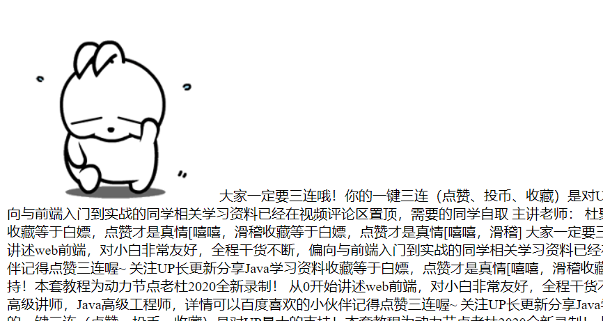
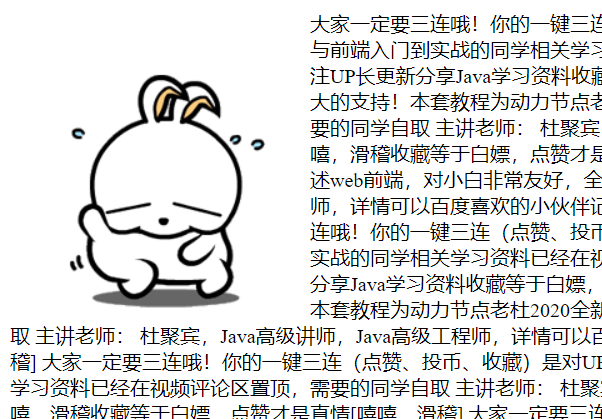

<center><font size="7" face="黑体">CSS学习</font></center>

# 一. 概述

***

## 1. 什么是CSS

- *CasCading Style Sheet*

- **层叠样式表语言**

  > CSS是HTML的**化妆品**，用来修饰HTML

  > 网页实际上是一个**多层**结构，通过 CSS 可以分别为网页的每一个层来设置**样式**；
  >
  > 当然，我们能看到的只是网页中<u>最上面的那一层</u>

***

## 2. 在HTML中嵌入CSS样式的方法

- :star:**内联定义**
- :star:**定义内部样式块对象**
- :star:**链入外部样式表文件**

***

# 二. HTML中嵌入CSS样式

***

## 1. 内联定义

- 语法：指定标签的`style`**属性**

  ```html
  <标签 style="样式名: 样式值;样式名: 样式值;..."></标签>
  ```

- 学会**查文档**

- 代码示例

  ```html
  <div id="div1" style="background-color: #CCFFCC; 
                        width: 300px; 
                        height: 300px;
                        position: absolute;
                        top: 100px;
                        left: 100px;
                        border-style: double;
                        border-color: red;
                        border-width: 50px;"></div>
  ```

> 这种方式不推荐使用，开发时绝对别用


***

## 2. :star:定义内部样式块对象/==CSS选择器==

### (1)基本用法

- 在***head*标签**中使用***style*标签**，定义样式块对象

- 语法格式

  ```html
  <head>
      ...
      <style type="text/css">
          选择器 {
              样式名: 样式值
              样式名: 样式值
              样式名: 样式值
              ...
          }
  		...
      </style>
      ...
  </head>
  <body>
      ...
  </body>
  ```

### (2):star:==:star:CSS选择器、声明块==

- ==**标签**选择器==

  > 作用于所有同名标签

  ```html
  <style type="text/css">
      /* 
      CSS的注释
      */
      div {
          background-color: aqua;
          width: 100px;
          height: 100px;
          border-color: red;
          border-style: solid;
          border-width: 10px;
      }</style>
  ```

- ==***id*** 选择器==

  > `#id名`

  ```html
  <style type="text/css">
      #username {
          width: 400px;
          height: 30px;
          border-color: black;
          border-style: solid;
          border-width: 2px;
      }</style>
  ```

  ```html
  <body>
      <input type="text" id="username"/>
  </body>
  ```

- ==***class*** 选择器==

  > 每个标签都有***class*属性**，可以去指定属性值，*class*属性值相同的是同一类，也可以为一个元素写多个*class*，需要用空格隔开

  > `.class名`

  ```html
  <style type="text/css">
      .student {
          font-size: 12px;
          color: #FF0000;
      }</style>
  ```

  ```html
  <body>
      <span class="student">文本内容span</span>
      <p class="student">文本内容段落p</p>
  </body>
  ```

- 通配选择器

  ```css
  * {
      ...
  }
  ```

- 复合选择器

  - ==**交集**选择器==

    ```css
    标签名.类名选择器选择器选择器选择器 {
        ...
    }
    ```

    > 选择器之间直接连着写
    >
    > 交集选择器中如果有标签名，<u>必须以标签名开头</u>

  - ==**并集**选择器==

    ```css
    选择器1, 选择器2, 选择器3 {
        ...
    }
    ```

    > 几种选择器都可以混合使用

- 关系选择器

  - ==**子元素**选择器==

    ```css
    父元素选择器 > 子元素选择器 {
        ...
    }
    ```

    > 可以链式写`>`

  - ==**后代元素**选择器==

    ```css
    元素选择器 后代元素选择器 {
        ...
    }
    ```

  - ==**兄弟元素**选择器==

    ```css
    元素选择器 + 下一个兄弟元素选择器 {
        ...
    }
    元素选择器 ~ 接下来所有兄弟元素选择器 {
        ...
    }
    ```

    > `+`只有紧挨着的下一个才可以被选择到，如果紧挨着的下一个不符合条件，就放弃选择
    >
    > `~`可以选择所有符合条件的兄弟

  > 可以混合其他选择器使用

- ==**属性**选择器==

  ```css
  元素选择器[属性名] {
      ...
  }
  元素选择器[属性名=属性值] {
      ...
  }
  元素选择器[属性名^=属性值] {/*属性值开头*/
      ...
  }
  元素选择器[属性名$=属性值] {/*属性值结尾*/
      ...
  }
  元素选择器[属性名*=属性值] {/*属性值有就行*/
      ...
  }
  ```

### (3)伪类

- 伪类用来描述一个元素的**特殊状态**

  > 比如：第一个元素、被点击的元素、鼠标移入的元素

- 伪类使用`:`开头

- 伪类常与**选择器**结合

  ```css
  /*用ul和li举例*/
  ul > li:first-child {/*只选择ul的第一个子元素*/
      ...
  }
  ul > li:last-child {/*只选择ul的最后一个子元素*/
      ...
  }
  ul > li:nth-child(...) {/*只选择ul的第n个子元素*/
      ...
  }
  ```

  > `nth`有一些特殊值
  >
  > - n 表示选中从 0 开始的所有元素
  > - 2n / even 表示选中偶数位置的元素
  > - 2n+1 / odd 表示选中奇数位置的元素

  > 注意：这些伪类都是根据**所有子元素**进行排序的，即使某个元素的类型不符合标准，也算作计数，除非用下面的方法：
  >
  > ```css
  > /*用ul和li举例*/
  > ul > li:first-of-type {/*只选择ul的第一个同类型子元素*/
  >     ...
  > }
  > ul > li:last-of-type {/*只选择ul的最后一个同类型子元素*/
  >     ...
  > }
  > ul > li:nth-of-type(...) {/*只选择ul的第n个同类型子元素*/
  >     ...
  > }
  > ```

  ```css
  ul > li:not(:first-of-type) {/*只不选择ul的第一个同类型子元素*/
      ...
  }
  ```

  ```css
  /*只适用于a*/
  a:link {/*选择正常的链接（没访问过的）*/
      ...
  }
  a:visited {/*选择访问过的链接*/
      .../*由于隐私的原因，visited这个伪类只能修改链接的颜色*/
  }
  ```

  ```css
  /*用a举例，所有元素都可以*/
  a:hover {/*鼠标移入的状态*/
      
  }
  a:active {/*鼠标移入的状态*/
      
  }
  ```

### (4)伪元素

- 表示页面中一些**特殊位置**的元素

- 使用`::`

- 与**选择器**结合

  ```css
  p::first-letter {/*选中首字母*/
      font-size: 50px;
  }
  p::fisrt-line {/*选中第一行*/
      ...
  }
  p::selection {/*选择光标选中的*/
      
  }
  ```

  ```css
  /*用div举例*/
  div::before {/*选中元素的最开头*/
      content: '...';/*必须结合content属性使用*/
  }
  div::after {/*选中元素的末尾*/
      content: '...;'
  }
  /*content中的内容在网页中无法选中*/
  ```

  > ==:star:`before`和`after`伪元素很常用:star:==

> ps: 选择器的权重
>
> - 内样样式 > id 选择器 > 类和伪类选择器 > 元素选择器
>
> - 选择器混合使用时，权重要相加计算
>
>   > 越具体，优先级越高
>
> - 优先级相同，下面覆盖上面
>
> - **通配**选择器权重最低，但也能覆盖**继承**的
>
> - `!important`可以在某一个样式后面添加，获得**最高**优先级，<u>谁也改不了</u>
>
>   > 慎用，这个连 JS 都改不了

***

## 3. :star:链入外部样式表文件:star:

> :star:这种方式**最常用**，实现网页对样式的复用，开发中最推荐，可以使用到浏览器的缓存机制

- .css文件

  - 在项目中新建一个*css目录*
  - 文件内语法与[定义内部样式块对象](##2. 定义内部样式块对象)相同

  > 代码示例

  ```css
  #div1 {
  	background-color: #FF0000;
  	width: 100px;
  	height: 100px;
  }
  .myinput {
  	border: solid 1px blue;
  }
  input {
  	border: solid 5px red;
  }
  ```

  > 关于选择器优先级：
  >
  > id > 类 > 标签

- **链入*html*文件**

  > 代码示例：使用<link/>独目标签
  
  ```html
  <head>
      <meta charset="utf-8">
      <title>链入外部样式表文件</title>
      <link rel="stylesheet" type="text/css" href="css/1.css"/>
  </head>
  ```

***

# 三. 常用样式

## 0. 继承

- 为一个元素设置样式后，其后代也会继承这个样式

- 可以<u>**统一后代元素的样式**</u>，方便开发

- 但也不是所有样式都会被继承

  > 比如背景相关，布局相关的样式
  >
  > 可以在文档中查询

## 1. 隐藏样式

> 代码示例：***display***属性指定为*none*

```html
<style type="text/css">
    #citiesOfChina {
        display: none;
    }</style>
```

> *display*指定为*<u>block</u>*就会显示出来

***

## 2. 文本装饰样式

> 代码示例：设置***text-decoration***属性

```css
#baidu {
text-decoration: underline;
/* text-decoration: overline; */
/* text-decoration: line-through; */
/* text-decoration: blink; */
}
#baidu2 {
text-decoration: none;
}
```

```html
<a id="baidu2" href="http://www.baidu.com">百度</a>
```

> text-decoration指定为none可以<u>取消超链接的下划线</u>

***

## 3. 列表样式

> 代码示例：设置***list-style-type***属性的值；与列表的**type属性**类似，值更多

```css
ul {
	list-style-type: lower-roman;
}
```

> 指定为none可以去掉标号样式

***

## 4. 设置鼠标悬停效果

> 代码示例：使用***hover***并指定属性值

```css
span:hover {
color: red;
font-size: 20px;
}
input:hover {
border-color: black;
border-width: 7px;
}
```

> hover前的冒号两边**不能有空格**

## 5. 内边距和外边距

> 代码示例：***margin***和***padding***的设置

```css
#div1 {
width: 300px;
height: 300px;
background-color: #00FFFF;
border: solid 5px red;
padding-left: 20px;
}
#div2 {
width: 100px;
height: 100px;
background-color: black;
border: solid 5px red;
margin-top: 10px;
}
```

- `padding`指的是“**内补丁**”，`margin`指的是“**外补丁**”
- :star:补丁的意思是，在里面或外面“**补了一块**”，这一块是其他控件“**不能侵占**”的，就一直跟着当前控件走；如果是“**在里面补丁**”，会使**控件大小直接变大**

***

## 6. 图片浮动

> 代码示例：在*style*中指定*img*的***float***属性值

```css
<style type="text/css">
img {
    float: left;
}
</style>
```

- 图片**不浮动**的话就会被当成一个**文本**

  

- **浮动**就会被“**包围**”

  

***

## 7. 定位样式

> 代码示例：指定***position***属性值为***absolute***，然后指定***top***与***left***的值

```css
#div1 {
    position: absolute;
    top: 200px;
    left: 100px;
}
```

- 可以理解成**坐标**

***

## 8. 光标样式

> 代码示例：指定***cursor***属性值；可以与*[hover](##4. 设置鼠标悬停效果)*结合使用

```css
#baidu:hover {
    cursor: not-allowed;
    text-decoration: underline;
    color: white;
}
```

> 指定cursor后不结合hover也有同样的效果
>
> ```css
> #baidu {
>     cursor: pointer;
> }
> ```
>
> - `cursor`自带**悬停**限制
> - 注：`hand`有兼容问题，尽量用`p`


