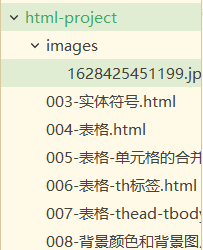
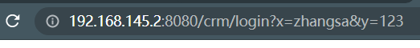

# 一. 概述

***

---

## 1. 什么是HTML

- *Hyper Text Markup Language*

- **超文本标记语言**

  > 超文本：流媒体、声音、视频、图片等
  
  > 标记语言：由大量**标签**组成
  >
  > - <标签> ： 开始标签
  > - </标签> ： 结束标签
  
- 严格意义上只能是一种**规范**，**标签**语言，不能称为<u>编程语言</u>（HTML中没有变量、数据类型、控制语句...）

- HTML 是专门用来==负责**网页结构**==的语言，在使用时应==重点关注标签的**语义**==，而不是样式

***

## 2. 怎么开发和运行

- 新建一个***.html***或者***.hml***文件，用记事本就能开发

- 在浏览器上运行，**不需要编译**

  > 五大主流浏览器：
  
  > IE：微软的
  >
  > FireFox：火狐
  >
  > Chrome：谷歌
  >
  > Opera：欧朋
  >
  > Safari：MAC OS 专用
  
- 前端程序员主要使用三个浏览器

  - IE、FF、Chrome
  - 在不同的浏览器上运行，以便发现<u>兼容问题</u>

***

## 3. B/S结构系统

- B：Browser
- S：Server

***

## 4. 第一个HTML页面

```html
<!--这是HTML的注释信息-->
<!--这儿是根-->
<html>
	<!--这儿是头-->
	<head>
		<!--标题栏-->
		<title>my first html page</title>
	</head>
	<!--网页体-->
	<body>
		<!--这里的内容会显示到网页上-->
		这是我的第一个HTML页面
	</body>
</html>
```

***

# 二、基本标签

***

## (一)块元素

### 1. 段落标记

```html
<p>这是一个段落</p><p>这又是一个段落</p>
```

> 段落结束后是会**换行**的
>
> ==:star:像这样会独占行的标签称为**块元素**，主要用于网页布局==

> <u>p标签内不允许再放其他块元素</u>

### 2. 标题字与标题分组

```html
<h1>一级标题</h1>
<h2>二级标题</h2>
<h3>三级标题</h3>
<h4>四级标题</h4>
<h5>五级标题</h5>
<h6>六级标题</h6>
```

> 标题都是**块元素**

```html
<!--设置标题组-->
<hgroup>
	<h1>xxx</h1>
    <h2>xxx</h2>
</hgroup> 
```

### 3. 换行标记

> *Blank Row*

> **独目标记**

```html
<!--独目标记-->
hello<br> world!
```

### 4. 水平线

> *Horizontal Route*

> **独目标记**加**属性名和属性值**

```html
<hr>
<!--color是属性名，red是属性值-->
<hr color="red">
<!--字符串也可以用单引号-->
<hr color='blue'>
<!--不用引号也行-->
<hr color=green>
<!--不区分大小写-->
<HR>
```

> HTML<u>语法很松散</u>

### 6. 预留格式

```html
<pre>
for(int i = 0; i < 100; i++) {
System.out.println("i = " + i);
}
</pre>
```

- 在***HTML*上源码**是什么格式，到网页上就是什么格式

  > 不然的话，比如，<u>回车是没有效果的</u>

### 7. :star:布局标签

```html
<header>网页头部</header>
<main>网页主体部分，只能有一个</main>
<footer>网页底部</footer>
```

```html
<nav>网页导航</nav>
<aside>和主体相关的其他内容</aside>
<article>一个独立的文章</article>
```

```html
<sesion>一个独立的区块</sesion>
```

```html
<div>万物皆可div</div>
<span>这是个行内元素，和div差不多常用</span>
```

> 再次强调，这些都是**语义化标签**，没有样式

***

## (二)行内元素

### 1. 粗体字

```html
<b>粗体字</b>
```

```html
<strong>强调重点</strong>
```

> ==:star:这种不会导致换行的标签称为**行内元素**，主要用于设置效果==
>
> <u>一般情况下是**在块元素内放行内元素**</u>

### 2. 斜体字

```html
<i>斜体字</i>
```

```html
<em>阅读重点</em>
```

> 行内元素

### 3. 下划线与删除字

```html
<ins>插入字</ins>
<del>删除字</del>
```

### 4. 引用

```html
<blockquote>长引用，块元素</blockquote><!--渲染结果是换行加缩进-->
<q>短引用，行内元素</q>
```

### 5. 右上角加字

> 代码示例

```html
10<sup>2</sup>
```

### 6. 右下角加字

> 代码示例

```html
m<sub>2</sub>
```

### 7. font标签

> 代码示例：非独目标签加**属性名和属性值**

```html
<font color="red" size="12">hello world!</font>
```

## (三)其他标签

### 1. meta标签

- meta 主要用于指定网页中的一些**元数据**

  > 可以写<u>多个 meta 标签</u>

  > 元数据<u>不是给用户看的</u>

- 常见属性

  - charset 字符集

  - name 指定数据名称，content 指定数据内容

    > 数据名称 name 为`keywords`，表示这是网站的**关键字**；
    >
    > content 存放**关键字**的内容，可以同时指定<u>多个关键字</u>，用**逗号**隔开

    > name="discription" 代表对网站的描述

  - `http-equiv="refresh" content="...;url=..."`

    > 页面重定向，第一个`...`是停留秒数

  > ps：title 标签中的内容就是搜索引擎搜索结果超链接中的文本

***

# 三、实体符号

***

> 在 HTML 中书写<u>特殊的符号</u>，就需要用到**实体**（有点像<u>转义字符</u>的作用）
>
> 这些实体可以在 W3School 文档中查询 

## 1. 解释几个标签

- 表示文该页面是HTML5页面：H5

  ```html
  <!DOCTYPE html>
  ```

  > 通常出现在整个文件第一行

- 告诉浏览器采用哪一种**字符编码方式**打开该页面

  ```html
  <head>
      <meta charset="utf-8">
      <title>xxx</title>
  </head>
  ```
  
  > 这个编码方式要和**文件的编码方式**相同，不然会出现乱码
  
  > *windows*操作系统默认使用*GBK*的方式打开html文件（因为我们的windows操作系统是简体中文环境）
  
  > 程序员工作区中文件的编码一般是***UTF-8***，因为***unicode***更通用

***

## 2. 空格

```html
&nbsp;
```

> Non-Breaking SPace

> **多个空格键**生成的空格会被浏览器解析为**一个空格**

***

## 3. 小于号

```html
&lt;
```

> Less-Than

***

## 4. 大于号

```html
&gt;
```

> Greater-Than

***

# 四、表格

***

## 1. 基本框架

> 代码示例：*<tr>*表示行，*<td>*表示一个单元格

```html
<table>
    <!--第一行-->
    <tr>
        <!--第一行的第一个单元格-->
        <td>1</td>
        <td>2</td>
        <td>3</td>
    </tr>
    <tr>
        <td>1</td>
        <td>2</td>
        <td>3</td>
    </tr>
    <tr>
        <td>1</td>
        <td>2</td>
        <td>3</td>
    </tr>
</table>
```

***

## 2. 设置边框宽度

> 代码示例：***border*属性**

```html
<table border="1px">
    <!--...-->
</table>
```

> ***1px***表示**1像素**

***

## 3. 设置表格宽高

1. **像素**方式

   > 代码示例

   ```html
   <table width="300px" height="200px">
       <!--...-->
   </table>
   ```

2. **百分比**方式

   > 代码示例

   ```html
   <table width="50%" height="200px">
       <!--...-->
   </table>
   ```
   
   > 百分比是指<u>占整个页面的百分比</u>，**<u>常用在`width`属性上</u>**

***

## 4. 设置对齐方式

> 代码示例：**表格**、**行**、**单元格**的对齐方式都可以设置

```html
<table align="center">
<!--表格整体在页面中（某一大行上）居中-->
    <tr align="center">
    <!--让整个一行的元素都在各自的格子中水平居中-->
    	<td align="center"></td>
        <!--单元格内的元素水平居中（和row的align效果一样，但优先级更高）-->
    </tr>
</table>
```

> 注：数据在单元格中<u>竖直</u>方向是<u>自动居中</u>的

***

## 5. 行列的合并

> 代码示例：使用到***colspan***和***rowspan***属性，**属性值**表示**合并的行/列数**
>
> 相应的属性都是写在**<td>标签**中的

```html
<table width="50%" border="1px">
    <tr>
        <td>1</td>
        <td colspan="2">xy</td>
        <!-- <td>y</td> -->
    </tr>
    <tr>
        <td>1</td>
        <td>1</td>
        <td rowspan="2">KINGford</td>
    </tr>
    <tr>
        <td>1</td>
        <td>1</td>
        <!-- <td>ford</td> -->
    </tr>
</table>
```

***

## 6. th标签

> 代码示例：*<th>*标签可以自动**加粗**并**居中**，可以用来直接代替*<td>*标签

```html
<th>员工编号</th>
<th>员工姓名</th>
<th>员工薪资</th>
```

***

## 7. thead、tfoot、tbody

- 可以把表格**分成三份**，可以直接套在<tr>外面，也是布局标签

> 代码示例

```html
<table border="1px" width="50%">
    <thead>
        <tr>
            <th>员工编号</th>
            <th>员工姓名</th>
            <th>员工薪资</th>
        </tr>
    </thead>
    <tbody>
        <tr>
            <td>7369</td>
            <td>SMITH</td>
            <td>800.0</td>
        </tr>
        <tr>
            <td>7370</td>
            <td>KING</td>
            <td>8000.0</td>
        </tr>
    </tbody>
    <tfoot>
        <tr>
            <td>x</td>
            <td>y</td>
            <td>z</td>
        </tr>
    </tfoot>
```

***

# 五. 背景颜色和背景图片

***

> 代码示例：在**<body>标签**中加**属性**

```html
<body bgcolor="red">
</body>
```

```html
<body background=images/xxx.jpeg>
</body>
```

> 注：要在项目工程下建立文件夹存放图片



***

# 六. 图片

***

## (一)图片标签的使用

> 关注**属性**

```html

```

- 只设置宽度时会**自动缩放**图片，<u>不必手动设置高度</u>

- title指定**鼠标悬停**时显示的文字

  > 对于其他很多标签也适用

- alt指定**图片加载失败**时的提示信息

- 属于**行内元素**；替换标签，意思是会被`src`中的内容替换内部

## (二)图片格式

- jpeg(jpg)

  - 支持的颜色比较丰富，不支持透明效果，不支持动图
  - 一般用来显示照片

- gif

  - 支持的着色比较少，支持简单透明，支持动图
  - 适合颜色单一的图片、动图

- :star:png

  - 支持的颜色丰富，支持复杂透明，不支持动图
  - 适合颜色丰富，复杂透明的图片（专为网页而生）

- webp

  - 谷歌新推出的专门用于网页中图片的格式，具备其他图片格式的**所有优点**，而且压缩好，占用内存少

    > 颜色丰富，支持透明，支持动图

  - 缺点：**兼容性**不好

> 关于 base64：
>
> 可以将图片使用 base64 进行编码，将图片转换为字符，可以直接放在标签中的`src`属性里
>
> 一般都是需要**和网页一起加载的图片**要用

***

# 七. 超链接

***

## 1. 文本超链接

1. **网络**链接

> 代码示例：是在<a>标签中指定`href`属性

```html
<a href="http://www.baidu.com">百度</a>
```

> *Hypertext REFerence*

2. **本地**链接

> 代码示例：是在<a>标签中指定`href`属性

```html
<a href="004-表格.html">本地的表格</a>
```

3. 特点
   - 鼠标悬停变**小手**
   - 自动添加**下划线**

***

## 2. 图片超链接

> 代码示例：是用<u>**指定了`href`属性的<a>标签**</u>包裹**独目标签**

```html
<a href="https://map.baidu.com">
    
</a>
```

***

## 3. target属性

1. 代码示例

   ```html
   <a href="http://www.baidu.com" target="_self">百度（当前窗口打开）</a>
   <a href="http://www.baidu.com" target="_blank">百度（新窗口打开）</a>
   <a href="http://www.baidu.com">百度（默认是当前窗口打开）</a>
   ```

2. **属性值**解释

   - _blank : 新窗口
   - _self : 当前窗口（**默认**）
   - _parent : 当前窗口的父窗口
   - _top : 当前窗口的顶级窗口

   > 代码示例：关于**内部窗口**
   
   ```html
   <iframe src="http://www.baidu.com"></iframe>
   ```

***

## 4. 补充内容

- HTML是哪个组织制定的标准

  > *W3C(World Wide Web Consortium)* /世界万维网联盟组织
  
  > 有不同的版本(HTML4.0、HTML5.0、...)
  
  > *Tim Berners-Lee* 万维网之父
  
  > HTTP协议也是W3C制定的，是**浏览器**和**web服务器**传消息的协议
  
- B/S架构的原理

  1. 用户在浏览器**地址栏上输入URL**
  2. *request:* 通过浏览器向服务器发送请求（回车、超链接...）
  3. *response:* 服务器给浏览器**响应一段代码**
  4. 浏览器对HTML代码进行**展示**

- 浏览器向服务器发送请求的两种方式

  - 在**地址栏输入URL**

  - **点击超链接**（傻瓜式操作）

    > **原理是相同的**

***

# 八. 列表

***

## 1. 有充列表和无序列表框架

> 代码示例：以无序列表为例，有序列表只需**把<ul>换成<ol>**

```html
<ul>
    <li>中国
        <ul>
            <li>北京
                <ul>
                    <li>东城区</li>
                    <li>西城区</li>
                    <li>海淀区</li>
                    <li>朝阳区</li>
                </ul>
            </li>
            <li>上海</li>
            <li>天津</li>
            <li>重庆</li>
        </ul>
    </li>
    <li>日本</li>
    <li>美国</li>
    <li>俄国</li>
</ul>
```

> 其中<ul>用的最多
>
> 这些标签都是**块元素**，可以互相嵌套

> 可以用于在网页中与导航栏

***

## 2. 列表的type属性

- 有序列表

  > type可指定*circle, square, disc*

- 无序列表

  > type可指定*A, a, I, i, 1*

---

## 3. 定义列表框架

```html
<dl>
    <dt>要被下定义的东西</dt>
    <dd>定义内容</dd>
    <dd>定义内容</dd>
    <dd>定义内容</dd>
    <dd>定义内容</dd>
    <dd>定义内容</dd>
</dl>
```

> 有下拉菜单感觉，dd 中的内容会有缩进

***

# 九. 表单

## 1. 表单的作用

- 发送请求并且**携带数据**给服务器
- <u>表单</u>与<u>超链接</u>都可以<u>向服务器发送请求</u>，但**表单可以携带数据**

## 2. 标签基本框架

> 代码示例：***action***就相当于超链接的*href*属性，指定<u>要向哪里发送数据</u>

```html
<form action="http://www.baidu.com">
    <input type="submit"/>
</form>
```

## 3. 提交按钮

> 代码示例：type必须是***submit***，且必须放到***form*里面**；value可以指定**按钮文本**

````html
<input type="submit" value="百度"/>
````

## 4. 模拟登录界面

> 代码示例：都是独目的

```html
<form action="http://192.168.145.2:8080/crm/login">
    用户名：<input type="text" name="x"/>
    <br>
    密码：<input type="password" name="y"/>
    <br>
    <input type="submit" value="登录"/>
</form>
```

- 注意type要对应上；提交按钮type属性值是*submit*

- ==指定了***name*属性**的*input*标签，才会向服务器**提交数据**==

- 有用户输入的input，**不必指定value属性**；指定了就是文本框中有<u>默认值</u>

  > :star:**提交格式**为：
  >
  > ==***URL?name=value&name=value&name=value...***==
  >
  > （类似`Map.Entry<K, V>`的`key=value`）
  
  > 这是W3C指定的
  
  > 会在地址栏中显示
  >
  > 例如：
  >
  > 

***

## 5. 模拟用户注册界面

> 代码示例：<input/>都是独目标签，<select>、<option>和<textarea>都是成对的

```html
<form action="http://localhost:80/crm/register" >
    <!-- 啥都不填就是空串 -->
    用户名 <input type="text" name="username" />
    <br>
    密码 <input type="password" name="userpwd" />
    <br>
    性别 
    <input type="radio" name="sex" value="1" checked/>男
    <input type="radio" name="sex" value="0" />女
    <br>	
    兴趣
    <input type="checkbox" name="hobby" value="smoke" checked />抽烟
    <input type="checkbox" name="hobby" value="drink"/>喝酒
    <input type="checkbox" name="hobby" value="perm"/>烫头
    <br>
    学历
    <select name="qualification">
        <option value="senior">高中</option>
        <option value="junior">专科</option>
        <option value="regular" selected>本科</option>
        <option value="master">硕士</option>
    </select>
    <br>
    简介
    <textarea rows="10" cols="60" name="description"></textarea>
    <br>
    <input type="submit" value="注册"/>
    <br>
    <input type="reset" value="清空" />
</form>
```

- 单选按钮
  - *input*标签，*type*指定为***radio***
  
  - 同一组单选按钮***name*属性值**要一致，不然的话就都能选上了
  
  - 需要<u>指定*value*属性</u>的
  
    > 但这个<u>value不会显示出来</u>的，会显示出来的是后面写在HTML文件中的内容
    >
    > （下面的复选框和下拉列表也同理）
    >
    > （也就是说这个value只在提交的时候会写在`name=value`里）
  
  - 加上*checked*就会默认选中，如果没有被选中的，就不会提交
- 复选框
  - *input*标签，*type*指定为***checkbox***
  - ***name*属性值**也要一致
  - checked同理，如果没有被选中的，就不会提交
- 下拉列表
  - ***select***标签，记得指定***name*属性**
  - ***option***标签标记列表项
    - 可指定<u>*value*属性</u>
    - 可添加*selected*，类似*checked*
- 文本域
  - ***textarea***标签，同样别忘了指定***name***
  - 有属性*rows*和*cols*，指定行数和列数
- 重置按钮
  - *input*标签，*type*属性指定为***reset***
  - 要放到<u>表单里面</u>才能正常重置表单的内容

***

## 6. 下拉列表多选

> 代码示例

```html
<select name="province" size="3" multiple >
    <option value ="hebei">河北省</option>
    <!---->
</select>
```

- *size*属性指定**显示数目**
- 添加***multiple***后即可按住***Ctrl***多选

***

## 7. file控件

> 代码示例

```html
<form action="http://www.baidu.com" >
    文件：<input type="file">
    <br>
    <input type="submit" value="文件上传"/>
</form>
```

- *input*的*type*属性指定为***file***，是一个点击后可以**选择文件**的按钮

- 不需要指定*name*属性了

  > 后台的`Java`程序通过IO流的方式接收文件

***

## 8. 隐藏域

> 代码示例

```html
<form action="http://127.0.0.1:8080/crm/save" >
    <input type="hidden" name="usercode" value="11111" />
    <input type="submit" value="提交"/>
</form>
```

- input的type属性指定为***hidden***，表示隐藏域
- 不会在页面上显示，但还是**可以提交**

## 9. readonly和disabled

> 代码示例

```html
<form action="http://127.0.0.1:8080/crm/save" >
    机构代码 <input type="text" name="orgcode" value="1111" readonly/>
    <br>
    用户代码 <input type="text" name="usercode" value="2222" disabled/>
    <br>
    <input type="submit" value="提交"/>
</form>
```


- *readonly*
  - input标签中添加***readonly***
  - 页面上内容**只读**，但**可以提交**
- *disabled*
  - input标签中添加***disabled***
  - 页面上内容**只读**，而且**不能提交**

***

## 10. maxlength属性

> 代码示例

```html
<input type="text" maxlength="3"/>
```

- 在input标签中指定***maxlength***属性，即规定文本框中**最多容纳多少字符**

***

# 十. id属性

***

## 1. 概述

- 在HTML中**任何一个节点**上，都有id属性
- 在同一个网页中，id属性是**不能重复**的；id代表了这个节点，是这个节点的“身份证号”

***

## 2. 作用

- 在*javascript*中对html的节点进行**操作**的时候，可以通过id属性方便地**获取**到该节点对象
- 可以用树描述一个HTML文档(**DOM树**)

---

# 十一. 内联框架

---

## (一) 概述

- 向当前页面中引入一个其他页面
- 是**块元素**

## (二) 使用方法

```html
<iframe src="url" frameborder="0" width="800px	" height="600px"></iframe>
```

> `frameborder`只有`0`和`1`两种值，指定为`0`就没有边框，缺省有边框

---

# 十二. 音视频

---

## (一)音频

```html
<audio src="URL/URI" controls autoplay loop></audio>
```

>不加`controls`就不允许**用户控制播放**
>
>`autoplay`用来设置**自动播放**，但大部分浏览器不支持
>
>`loop`用来设置**循环播放**
>
>（这些属性不需要给值）

```html
<audio controls>
    对不起，你的浏览器不支持播放音频
    <source src="URL/URI.mp3">
    <source src="URL/URI.ogg">
</audio>
```

> 可以通过 source 标签指定源文件，可以解决兼容问题；
>
> 多个 source 标签只会生效一个，可以解决音频格式问题

```html
<embed src="URL/URI" type="audio/mp3" width="200px" height="100px">
```

> embed 这种东西不适合单独用，太缺德了

```html
<audio controls>
    <source src="URL/URI.mp3">
    <source src="URL/URI.ogg">
    <embed src="URL/URI" type="audio/mp3" width="200px" height="100px">
</audio>
```

> 最终兼容解决方案

## (二)视频

```html
<video controls>
    <source src="URL/URI.webm">
    <source src="URL/URI.mp4">
    <embed src="URL/URI" type="video/mp4" width="200px" height="500px">
</video>
```

> 使用方式类似

> ps:
>
> 很多视频网站支持直接复制视频代码，一般是`iframe`的形式，可以用来直接插入到页面


