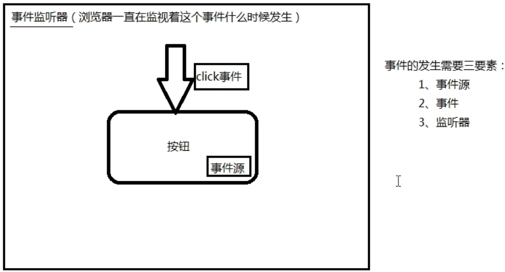
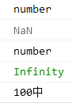
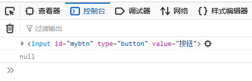
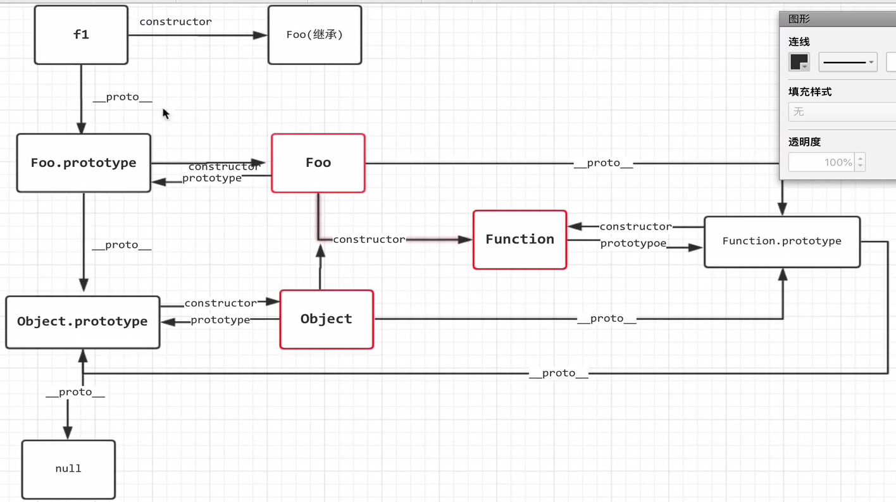
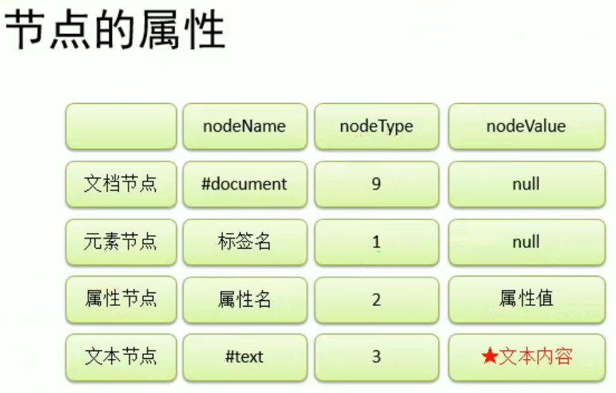

# 一. 概述

---

***

## 1. 简介

- 一种**脚本语言**（**解释型语言**），目标程序以**普通文本**的形式保存
- 浏览器打开就**直接解释执行**了

***

## 2. JavaScript与Java

- JavaScript运行在**浏览器**当中，浏览器中有执行JS代码的**内核**

- Java运行在JVM中

- Java语言是SUN公司开发的，JavaScript这个名字是SUN公司起的名字

  > 某种程度上，JavaScript搭上了Java的顺风车

***

## 3. JavaScript与JScript

- JavaScript是**网景公司**开发的，JavaScript之父是**布兰登艾奇**
- JavaScript的前身是LiveScript；网景公司曾与SUN公司合作，SUN公司把名字改了
- 网景公司为了占领浏览器市场，开发了为***Navigator***（网景公司开发的浏览器：**领航者浏览器**）<u>量身定做</u>的JavaScript（<u>其他浏览器不支持</u>）
- 微软也组建团队开发了JScript（<u>专门用于IE</u>），与网景公司抗衡

***

## 4. 编程语言

- JavaScript也是一门**编程语言**
- 用来操作HTML页面中的**节点**，让网页产生**动态效果**

***

## 5. JavaScript三部分

- ==***ECMAScript***==
  
  - :star:ECMAScript是**ECMA制定的262标准**
  
  - JavaScript和JScript都遵守这个标准
  
    > ECMA是<u>劝架的</u>
  
  - ECMAScript是JavaScript的**核心语法**
  
- ==***DOM***==
  
  - ***Document Object Model***
  - 通过JavaScript对HTML中的**dom节点**进行操作
  - DOM规范也是**W3C制定的**
  
- BOM
  - ***Browser Object Model***
  - 对**浏览器本身**进行操作
  - BOM<u>缺少规范</u>（因为浏览器有许多不同的厂家制造），一般只有一个**默认的行业规范**

***

---

# 二. 嵌入JS代码

---

***

## 1. 行间事件

- JavaScript是一种**事件驱动型**的编程语言

  > 在**某个事件发生**的时候去执行某段代码

  > 事件举例：
  >
  > 鼠标单击事件click
  >
  > 鼠标经过事件mouseover

- JavaScript中任何一个事件都有对应的**事件句柄**；所有**事件句柄**都是以标签的**属性**形式存在

  > 代码示例：**行间事件**的形式就是**写在标签中**

  ```html
  <input type="button" value="hello" onclick="鼠标单击后就会执行"/>
  ```

  > :star:浏览器打开时，会将代码onclick后面的代码**注册**给onclick事件句柄
  >
  > 只是**注册**，不是**执行**

  > onclick后面的代码会被**事件监听器**调用

- **事件三要素**

  

  > 示例中，
  >
  > 按钮就是**事件源**，
  >
  > 单击就是**事件**，
  >
  > 可以将浏览器理解为**事件监听器**

- 使用JS代码弹窗

  > 代码示例：JS当中有一个内置的BOM对象：***window***

  ```html
  <input type="button" value="hello" onclick="window.alert('hello world!');"/>
  ```

  > "window.alert('hello world!');"
  >
  > 分析：
  >
  > JS中的字符串可以使用**单引号**括起来，也可以用双引号（当然这样外部就不能用双引了）
  >
  > 可以用**分号**结尾，也可以不用
  >
  > ***'window.'***也可以省略

***

## 2. 脚本块

- 脚本块的**位置没有限制**，可以出现**多个**，所有代码以**自上而下**的顺序执行

  > 与其他`HTML`代码也是**同步执行**的，如果卡在了`JavaScript`脚本块的某个位置，那下面的`HTML`控件也<u>加载不出来</u>

- 代码示例

  ```html
  <script type="text/javascript">
      alert("hello world");
      alert("hello Bell");
      alert("hello Stupid");
  </script>
  ```

***

## 3. 引入独立的JS文件

- 在项目工程目录下新建**js目录**，在js目录下创建**js文件**，并写入代码

- 引入了js文件的**script块**<u>不会再执行</u>内部的js代码

  > 也就是说方法3与方法2不共存

- 代码示例：`script`成对标签，指定`type`和`src`

  ```html
  <script type="text/javascript" src="../js/1.js"></script>
  <script type="text/javascript" src="../js/1.js">
      alert("hello world!!!");/*不会执行*/
  </script>
  ```

***

---

# 三. 基础语法

---

***

## 1. 标识符和关键字

- 总体上与Java类似

- 代码示例

  ```html
  <script type="text/javascript">
      for(var i = 0; i < 10; i++) {
          alert("i = " + i);
      }
  </script>
  ```
  
  > :star:注意:star:
  >
  > 这个`var i`其实属于**全局作用域**下的变量

***

## 2. 变量

- 复习Java的变量特点

  > Java是**强类型语言**；有编译阶段，属于**编译型语言**

  > Java语言在**编译阶段**确定变量的类型，也就是在<u>程序运行前</u>，变量的类型就**确定**了，并且**不会再改变**

- 关于JS中的变量

  - 声明与赋值

    ```javascript
    var i;
    i = 100;
    ```

    ```javascript
    var a, b, c = 300;
    //c赋值300；a和b没有手动赋值，系统会赋默认值undefined
    a = undefined;
    b = undefined;
    //JS中undefined是个具体的值，不是字符串
    ```

- JS是一种**弱类型语言**，没有编译阶段，浏览器直接打开解释执行

  > 在JS中声明变量时不需要指定数据类型，运行过程中赋什么值就是什么类型，并且变量的**数据类型是可变的**

  ```javascript
  var i;
  i = 100;
  i = false;
  i = 3.14;
  i = new Object();
  //这都没问题
  ```

***

## 3. 函数

### (1)函数定义语法格式

> function 函数名(形式参数列表){
>
> ​	函数体
>
> }

```javascript
function sum(a, b) {
    return a + b;
}
```

```javascript
sum = function(a, b) {
    return a + b;
}
```

> 不需要指定**返回值类型**，也不需要说明**参数类型**

### (2)函数调用

> 可以传**任意个数**的参数，少了就***undefined***，多了**不要**

```javascript
sum();
sum(true);
sum(1, false);
sum(3.14, "hahaha", sum);
sum(sum);
```

> 还可以使用`函数名.call()`的语法调用函数，传入的参数可以改变`this`

```js
sum.call();//默认是window
sum.call(obj);
```

$\Rightarrow$关于JS的调试：

- :star:首选：alert()**插入调试**

- 采用浏览器自带调试插件：F12

  > 其中比较重要的面板:

  > **控制台**
  >
  > **查看器**
  >
  > **网络**

### (3)优先级

> JS中函数声明的优先级比较高，打开网页时，所有**函数先进行声明**（也先于其他HTML标签）

```javascript
sayHello();
function sayHello(){
    alert("hello world!");
}
```

> 这样是可以运行的，但是，不能使用**赋值**的方式，因为这样只会提前声明一个函数名，没有实现体，是`undefined`

### (4)函数重复定义

> JS中<u>没有“函数重载”</u>，后定义的函数会**覆盖**之前的同名函数

```javascript
function test1(a, b) {
    alert("test1(a, b)");
}
function test1() {
    alert("test1()");
}
test1(1, 2);//调的是test1()，test1(a, b)已经消失了
```

> 所以在JS中**定义函数要小心**，防止把之前写过的函数干没了

### (5)函数的arguments

- 每个函数定义时的函数体内部都有一个 ***arguments***，封装了函数**实参**

  > 即使不定义<u>形参</u>，也可以通过 arguments 使用<u>传入的实参</u>

- arguments 是一个**类数组对象**，有**数组的访问方式**和 **length 属性**

- arguments 有 callee 属性

  > callee 代表<u>当前正在执行的函数对象</u>

***

## 4. ==变量与作用域==

>关于 JS 对象的问题，详见 [JS对象](#五. JS对象)

### (1)==概念与特性==

- **全局作用域**、全局变量

  > 全局作用域就是**直接**被 script 标签包围的代码区
  >
  > 全局变量是在**函数体之外**声明的变量
  >
  > > 变量的声明提前：（与函数的声明提前类似）
  > >
  > > ```js
  > > //var a;其实有个这个，在代码执行之前就声明了
  > > console.log(a);//undefined
  > > var a = 123;//a = 123;其实是这个，前面声明过了

  > 在<u>浏览器**打开**</u>的时候分配空间，直到<u>浏览器**关闭**</u>才销毁

  > :star:在全局作用域中有一个<u>全局对象`window`</u>，代表浏览器窗口
  >
  > - 在全局作用域中创建的**变量**（或**函数**），都会作为`window`对象的**属性**（或**方法**）保存

  > :star:注意:star:
  >
  > ```js
  > for(var i = 0; i < arr.length; i++) {...}
  > ```
  >
  > > 其中的`i`是全局作用域下的变量
  >
  > ```js
  > for(let i = 0; i < arr.length; i++) {...}
  > ```
  >
  > > 这个`i`才是块级作用域下的变量
  >
  > 这其中会有回调函数和`this`相关的坑，详见 ES6 新特性

- **函数作用域**、局部变量

  > 函数作用域是函数执行时的作用域，**函数体内部**的作用域

  > 局部变量在**函数体当中**声明的变量
  >
  > > 函数作用域中也有变量的声明提前：（函数也一样可以，套娃呗）
  > >
  > > ```js
  > > function func() {
  > >     //var a;其实有个这个，在代码执行之前就声明了
  > >     console.log(a);//undefined
  > >     var a = 123;//a = 123;其实是这个，前面声明过了
  > > }
  
  > 局部变量在<u>函数被**调用**</u>时才分配空间，<u>函数**执行结束**</u>就释放其内存

### (2)作用域限制

- 函数体内**局部变量覆盖**同名全局变量（**形参**也相当于函数中的局部变量）

  > 本质上是==向**上级作用域**中寻找==，上级不一定是全局，可以还是个函数作用域

  > 当然，可以通过`window`来定位到全局

- 函数体内部可以访问已经声明的全局变量

  >本质上是==向**上级作用域**中寻找==
  
- 函数体外部无法访问函数体内部的局部变量

  ```javascript
  Uncaught ReferenceError: i is not defined
  ```

### (3)诡异的语法

> 在JS中，如果一个变量声明时**不使用var关键字**（当然不能连**等号**都不用吧），那么无论这个变量是在哪里声明的，都会成为**全局变量**

```javascript
function doSome() {
    email = "zhangsan@123.com";//这种语法声明时，必须手动赋值
    age;//这样是不行的，等号都没有，太水了
}
doSome();//如果不调用doSome，函数不会执行，变量也不可能声明
alert("email = " + email);
```

> 其实是因为，在函数体作用域中，变量声明如果不写`var`，就会默认添加一个`window.`

***

## 5. 数据类型

### 	(1). 概述

- ES6之前的6种数据类型

  **Undefined**

  **Null**

  **Number**

  **Boolean**

  **String**

  **Object**

  > 前5个属于**原始数据类型**（基本数据类型）
  >
  > object属于**引用数据类型**

- 在ES6之后引入了两个新的类型

  **Symbol**

  **BigInt**

***

### 	(2). typeof运算符

- 动态获取变量的数据类型

- 语法格式

  ```javascript
  typeof 变量名
  ```

- 运算结果是以下6个字符串之一（全部小写）

  ***"undefined"***

  ***"number"***

  ***"string"***

  ***"boolean"***

  ***"object"***

  ***"function"***

  > 在JS中判断字符串是否相等要用"=="

  ```javascript
  var v = null;
  console.log(typeof v);//"object"
  //但null这个值是基本数据类型,只是运算符的结果是"object"
  
  console.log(typeof sum);//"function"
  ```
  
  > `typeof`**运算符的结果**和**数据类型**不是一回事

***

### 	(3). Undefined类型

> undefined也可以手动赋值

```javascript
var k = undefined;
console.log(k);
console.log(typeof k);
```


> 也就是说，`typeof`返回的是一个字符串

***

### 	(4). Null类型

> 要注意的就是，Null属于**原始类型**，但typeof的**运算结果是"object"**

```javascript
var i = null;
console.log(typeof i);
console.log(typeof null);
```


***

### 	(5). Number类型

- *Number*类型属于**原始类型**

- **整数**、**浮点数**都属于Number类型

  > 在JS中，10 / 3 的结果是3.3333333333333335，而不是整数3

- *NaN*

  - Not a Number（不是一个数字）
  - NaN**属于Number类型**
  - 当一个运算表达式的结果**应当是一个数字**，却因为某种原因无法得出数字时，运算式的结果就会是 ***NaN***

- *Infinity*

  - 无穷也属于Number类型，`Infinity`是一个值

  ```javascript
  var k = NaN;
  console.log(typeof k);
  var result = 100 / "中";
  console.log(result);
  var v = Infinity;
  console.log(typeof v);
  var retValue = 100 / 0;
  console.log(retValue);
  var x = 100 + "中";//可以字符串拼接
  console.log(x);
  ```

  

- :star:*相关函数*:star:

  - ==***isNaN()***==

    - 会先**尝试**将参数**转换成一个数字**，如果能转换，结果就是false，否则就是true

    - 可以转换的

      - Boolean类型
      - **字面值为数字**的String类型
  
      ```javascript
      function sum(x, y) {
          console.log(typeof x);
          console.log(typeof y);
          console.log(isNaN(x));
          console.log(isNaN(y));
          if(isNaN(x) || isNaN(y)) {
              alert("sorry!");
          } else {
              alert(x + y);
          }
      }
      ```
  
      ```html
      <input type="button" value="sum" onclick="sum(true, 100)"/>
      <input type="button" value="sum2" onclick="sum('中国', 100)"/>
      <input type="button" value="sum3" onclick="sum('123', 100)"/>
      ```

      

      > 从这个例子中也可以看出，Number类型与Boolean类型进行算术运算时，会直接将`true`转换为`1`，`false`转换为`0`

  - ==***Number()***==

    - 可以将**非数字**转换为数字

    - 实在转换不了就会返回***NaN***
  
      ```javascript
      console.log(Number("123") + 1);//124
      console.log(Number("中国"));//NaN
      ```

  - ==***parseInt()***==

    - 将字符串转换成数字，且**只取整数位**，不四舍五入

    - 实质上是**在非数字字符之前截断**字符串（如果以**非数字字符开头**，结果就是NaN）

      ```javascript
      var s1 = "1234中456国";
      console.log(parseInt(s1));//1234
      var s2 = "***250";
      console.log(parseInt(s2));//NaN
      ```
      

  - ==***Math.ceil()***==
  
    - Math工具类中的函数 ，用来**向上取整**
  
    - 可以传数字和**字符串**，但字符串必须能**完全**转换成数字，否则返回*NaN*
  
      ```javascript
      console.log(Math.ceil(123.456));//124
      console.log(Math.ceil(123.000));//123
      console.log(Math.ceil(123.0000000001));//124
      console.log(Math.ceil("456.123"));//457
      console.log(Math.ceil("456中123"));//NaN
      ```
  

***

### 	(6). Boolean类型

- 原始类型

- 只有两个值：*true*, *false*

- 相关函数：==***Boolean()***==

  - 只要**“有东西”**，且没有“否定”的意思，结果就是true

    ```javascript
    console.log(Boolean(1));
    console.log(Boolean(0));//false
    console.log(Boolean("中国"));
    console.log(Boolean(""));//false
    console.log(Boolean(NaN));//fasle，不是一个数字，有否定的意思
    console.log(Boolean(Infinity));
    console.log(Boolean(null));//false
    console.log(Boolean(new Object()));
    console.log(Boolean(undefined));//fasle
    ```

  - ==JS中会**隐式调用**Boolean函数==[不需要程序员手动调用]

    ```javascript
    var username = "zhangsan";
    if(username) console.log("welcome, " + username);
    else console.log("sorry");
    ```

    > 这不代表if后的小括号里直接加了字符串，而是**先隐式调用**了Boolean()函数
    >
    > 数字也是同样的道理
    >
    > （这种语法在Java中就行不通）

***

### 	(7). String类型

- **原始类型（基本数据类型）**

- 创建**字符串**

  - 以原始类型创建

    ```javascript
    var s = "字符串";
    console.log(typeof s);//string
    ```

  - 以引用数据类型创建

    ```javascript
    var s = new String("字符串");
    console.log(typeof s);//object
    ```

  > ***String*类型**和**字符串**不是一回事

  > 不管是原始类型(String类型)的字符串，还是Object类型的字符串，**属性**和**方法**都通用

- :star:常用属性和方法

  - ==***length*属性**==

    $\rightarrow$获取字符串**长度**

  - ==***charAt()***==

    $\rightarrow$获取指定**下标位置的字符**

  - ==***concat()***==

    $\rightarrow$**连接**字符串

  - ==***indexOf()***==

    $\rightarrow$获取某个子字符串在当前字符串中**第一次出现处**的**索引**

  - ==***lastIndexOf()***==

    $\rightarrow$获取某个子字符串在当前字符串中**最后一次出现处**的**索引**

  - ==***replace()***==

    $\rightarrow$替换（只能替换第一个）

    ```javascript
    console.log("1980-10-11".replace("-", "/"));
    // 1980/10-11
    ```

  - ==***split()***==

    $\rightarrow$按**给定字符**拆分字符串成一个**字符串数组**

    ```javascript
    var arr = "1980-11-12".split("-");
    for(var i = 0; i < arr.length; i++) {
        console.log(arr[i]);//1980 11 12
    }
    ```

  - ==***substr()与substring()***==

    $\rightarrow$截取字符串

    ```javascript
    //只有一个参数时没区别,都是从当前下标截取到最后
    console.log("abcdef".substr(2));//cdef
    console.log("abcdef".substring(2));//cdef
    //substr(startIndex, length)
    //substring(startIndex, endIndex),但不包括endIndex
    console.log("abcdef".substr(2, 3));//cde
    console.log("abcdef".substring(2, 3));//c
    ```

  - ==***toLowerCase()/toUpperCase()***==

    $\rightarrow$大小写转换

***

### 	(8). ==Object类型==

- 概述

  - ***Object*类**是JS中内置的一个类，可以看作是**所有对象的基类**；
  - JS中默认定义的类型，无特殊说明的话，就是继承Object

- :star:常用属性和方法

  - ==***prototype*属性**==：指向类的**原型对象**，所有实例共享，存放**公共属性和方法**

    > 使用`类名.prototype.扩展名`的方式去调用，可以给类的<u>原型对象</u>**动态扩展**属性和方法
    >
    > 一个比较典型的应用是修改<u>原型对象</u>中的`toString`方法

    ```javascript
    //给Object类型的原型对象扩展一个doSome()方法
    Object.prototype.doSome = function() {
    	console.log("测试prototype!");
    }
    o.doSome();
    //给Object类型的原型对象扩展一个username属性
    Object.prototype.username = "zhangsan";
    console.log(o.username);
    ```

    > :star:对于`new`出来的对象，都有一个隐含的属性`__proto__`，指向构造函数的原型对象，与`类名.prototype`指向相同

  - 其他属性和方法

    - ***constructor*属性**
    - ***toLocaleString***方法，***toString***方法，***valueOf***方法

- ==:star:**自定义类**:star:==

  - 方法一：

    ```javascript
    function 类名(形式参数列表){
        this.属性名 = 参数; 
        //注意都要加this
        this.方法名 = function() {/*方法体*/}
    }
    ```
    
  - 方法二：

    ```javascript
    类名 = function (形式参数列表){
        this.属性名 = 参数;
        //注意都要加this
        this.方法名 = function() {/*方法体*/}
    }
    ```
    
    > 其实这可以理解成在定义一个**构造函数**，但每次调用，其中的方法也会再创建一次，所以可以把方法写在**全局作用域**，然后在构造函数里写**方法名**
    >
    > > :star::star:但这样又有可能**污染全局作用域的命名空间**，
    > >
    > > 所以最佳解决方案是：
    > >
    > > ==向类的**原型对象**中添加属性和方法==
    > >
    > > ```js
    > > 类名.prototype.扩展方法名 = function(...) {...};
    > > ```
    > >
    > > > 如果实例本身没有对应的属性和方法，就会去原型对象中寻找
    
    > 一个"function"是函数还是类，关键看**怎么调用**
    >
    > 没有使用new，就是普通函数
    >
    > 使用了**new**，就相当于<u>**构造函数**</u>，是一个类（这会导致浏览器在**堆**内存中开辟一个新对象）

- new对象、访问属性、调用方法、扩展方法

  ```javascript
  function Emp(empno, ename, sal) {
      this.empno = empno;
      this.ename = ename;
      this.sal = sal;
  
      this.work = function() {
          console.log(this.ename + " is working!!!");
      }
  }
  var e = new Emp();
  e.work();
  var e2 = new Emp(111);
  e2.work();
  var e3 = new Emp(2222, "King");
  e3.work();
  var e4 = new Emp(3333, "Smith", 800);
  e4.work();
  Emp.prototype.getSal = function() {
      return this.sal;
  }
  console.log(e4.getSal());
  //访问属性的另外一种方法：引用["属性名"]
  console.log("e4.empno = " + e4["empno"]);
  console.log("e4.ename = " + e4["ename"]);
  console.log("e4.sal = " + e4["sal"]);
  var str = "empno";
  console.log("e3.empno = " + e3[str]);//e3.empno = 2222
  var str2 = new String("empno");
  console.log("e2.empno = " + e2[str2]);//e2.empno = 111
  ```

  > :star:访问属性的另外一种方法：`引用[字符串形式的属性名]`

***

### 	(9). \=\=与\=\=\=

- 等同运算符

  \=\= ：只比较**值**是否相等（引用的**地址值**也是值）

  > 有点像Java中的equals()方法，但又不完全是

  ```javascript
  var str3 = new String("stringstring");
  var str4 = new String("stringstring");
  var str5 = "stringstring";
  console.log(str3 == str4);//false
  console.log(str3 == str5);//true
  console.log(str4 == str5);//true
  ```

  ```js
  var strNum = new String(2);
  var strNum2 = new String("2");
  var num = 2;
  console.log(2 == strNum);//true
  console.log(2 == strNum2);//true
  console.log(num == strNum);//true
  console.log(num == strNum2);//true
  console.log(2 == "2");//true
  console.log(num == "2");//true
  ```

- 全等运算符

  \=\=\= ：既比较**值**是否相等，又比较**数据类型**是否相同

  ```javascript
  console.log(true == 1);//true
  console.log(true === 1);//false
  ```

- ==***null、NaN、undefined***==

  - 类型互不相同
  - null与undefined是等同关系

  ```javascript
  console.log(typeof null);//object
  console.log(typeof NaN);//number
  console.log(typeof undefined);//undefined
  console.log(null == NaN);//false
  console.log(null == undefined);//true
  console.log(undefined == NaN);//false
  console.log(null === NaN);//false
  console.log(null === undefined);//false
  console.log(undefined === NaN);//false
  ```

***

## 6. void运算符

- 语法格式：

  ​	void(表达式)

  > 执行表达式，但不返回任何结果
  >
  > 即使原本有结果，经过void运算之后也没了

- 应用举例：

  > 保留**超链接样式**，点击后**执行一段JS代码**，但页面**不跳转**

  ```html
  <a href="" onclick="alert('利用onclick执行了JS代码')">要求：保留超链接样式，点击后执行一段JS代码，但页面不跳转</a>
  <!--只有指定了href属性后，才有超链接样式；指定为空会跳转到当前页面-->
  ```

  > 关于事件句柄属性值中的"***javascript:***"

  ```html
  <input type="button" value="button" onclick="javascript:alert('hello world')" />
  <!--一般情况下这个"javascript:"可以省略-->
  ```

  ```html
  <a href="javascript:void(0)" onclick="alert('执行了JS代码')">...</a>
  <!--这里的"javascript:"就不能省略了，省略就会被当成路径了-->
  ```

  > 添加了***javascript:void(0)***之后，原本双引号中的<u>空字符</u>也没了，就把href的**链接地址废弃**掉了

  > 这样鼠标悬停在超链接上时可以在左下角看到"javascript:void(0)"

***

## 7. 特殊的控制语句

- ### for...in语句

  - JS中的数组

    ```javascript
    var arr = [true, 24, "abc", 65, 76, 3.14];
    for(var i = 0; i < arr.length; i++) {
        console.log(arr[i]);
    }
    ```

    > 注意声明方式；有length属性

  - 取<u>数组下标</u>

    ```javascript
    for(var index in arr) {
        console.log(arr[index])
    }
    ```

  - 取**对象的属性名**（以***String***的类型）

    ```javascript
    Employee = function(empno, ename) {
        this.empno = empno;
        this.ename = ename;
    }
    var e = new Employee(7369, "SMITH");
    //console.log(e.empno + "," + e.ename);
    //console.log(e["empno"] + "," + e["ename"]);
    for(var property in e) {
        console.log(property);
        console.log(typeof property);//string
        console.log(e[property]);
    }
    ```

    

- ### with语句

  > 应用举例：<u>省略对象名</u>

  ```javascript
  var x = new Employee(7369, "SMITH");
  with(x) {
      console.log(empno + "," + ename);
  }
  ```

***

---

# 四. 事件

---

***

## 1. 常用事件

> 任何一个事件都有对应的<u>事件句柄</u>（在事件名称前**添加一个on**即可）

### 	(1). 焦点相关

- ==***blur*失去焦点事件**==
- ==***focus*获取焦点事件**==

```HTML
测试失去焦点事件<input type="text" onblur="console.log('失去焦点了')"/>
测试获取焦点事件<input type="text" onfocus="console.log('获取焦点了')"/>
```

> 可以在<u>输入框失去焦点时</u>对里面的内容进行检查

### 	(2). 鼠标点击相关

- ==***click*鼠标单击事件**==
- ==***dblclick*鼠标双击事件**==

```html
测试click事件：<input type="button" value="click事件" onclick="console.log('单击')"/>
测试dblclick事件：<input type="button" value="dblclick事件" ondblclick="console.log('双击')"/>
```

### (3). 鼠标相关

- ==***mousedown*鼠标按下事件**==
- ==***mouseover*鼠标经过**==
- ==***mousemove*鼠标移动**==
- ==***mouseout*鼠标离开**==
- ==***mouseup*鼠标弹起**==

```HTML
<div id="mouseDiv" onmouseover="console.log('鼠标经过了')"
     onmousedown="console.log('鼠标按下了')"
     onmouseout="console.log('鼠标离开了')"
     onmouseup="console.log('鼠标弹起了')"
     onmousemove="console.log('鼠标移动了')"></div>
<br>
```

> mousemove：移动一下就会触发，一直移动就会一直触发

### (4). 键盘相关

- ==***keydown*键盘按下事件**==
- ==***keyup*键盘弹起事件**==

```html
<input type="text" onkeydown="console.log('keydown...')" />
<input type="text" onkeyup="console.log('keyup...')" />
```

> keydown：按一下就会触发，按住不松手就会连续触发

### (5). 表单相关

- ==***submit*表单提交事件**==
- ==***reset*表单重置事件**==

```html
<form onsubmit="console.log('表单提交了')" onreset="console.log('表单重置了')">
    <input type="submit" value="提交"/>
    <input type="reset" value="重置" />
</form>
```

> submit会刷新界面，console.log的信息也许会保留

### (6). 其他

- ==***select*文本被选定事件**==

  ```html
  <textarea rows="10" cols="30" onselect="console.log('文本被选中了')"></textarea>
  <input type="text" onselect="console.log('文本被选中了')"/>
  ```

  > 选中后**松开鼠标**才会触发事件

- ==***change*下拉列表选中项改变，或文体框内容改变事件**==

  ```html
  <select onchange="console.log('选项被修改')">
      <option value ="">--请选择您的学历--</option>
      <option value ="gz">高中</option>
      <option value ="zk">专科</option>
  </select>
  ```

  > 两次选择同一个选项并不会触发

- ==***load*页面加载完毕事件**==

  ```html
  <body onload="console.log('页面加载完毕了')">
      <!--...-->
  </body>
  ```

  > load事件不是在页面加载过程中触发的，而是在页面中<u>所有元素全部加载完毕</u>才触发的
  >
  > load写在***body*标签**当中

***

## 2. 注册事件

### (1)注册事件的第一种方式：==直接使用事件句柄属性==

> 在**标签**中使用事件句柄，在事件句柄后编写JS代码，也就是<u>行间事件</u>法

> 当对应事件发生之后，“注册”在事件句柄当中的这个代码被**监听器**调用

```html
<script type="text/javascript">
    function sayHello() {
        console.log("hello jack!");
    }
</script>
<input type="button" onclick="sayHello()"/>
<!--类似sayHello的这种函数称为回调函数，callback function-->
```

> **回调函数**只是会在页面打开时**注册**（事件的**绑定**），而<u>不会在页面打开时执行</u>
>
> <u>程序员不负责调用</u>，而是==**监听器负责调用回调函数**==

### (2)在HTML中怎==根据id获取节点==

- 两个内置的隐含的对象
  - ***document***

    > 代表**整个HTML文档**
    >
    > 是**DOM**的<u>顶级对象</u>

  - ***window***

    > 代表**整个浏览器窗口**
    >
    > 是**BOM**的<u>顶级对象</u>

- :star:先**获取节点**

  > ==使用***document*对象**的***getElementById*方法**==

  ```javascript
  var mybtnElt = document.getElementById("mybtn");
  console.log(mybtnElt);//自动调用toString方法
  alert(mybtnElt);//[object HTMLInputElement]
  console.log(document.getElementById("mybt"));//null
  alert(document.getElementById("mybt"));//null
  ```

  

- :star:**访问属性**

  > 节点中有什么属性就可以“点”什么，还可以**更改**属性值

  ```javascript
  mybtnElt.type = "checkbox";
  alert("wait !!!");
  mybtnElt.type = "text";
  alert("wait again !!!");
  mybtnElt.value = "button";
  ```

### (3)注册事件的第二种方式：==通过id访问属性==

> 利用的是“有什么‘点’什么”这个特性，可以直接==将函数作为属性值==，赋值给==事件句柄属性==，<u>不用再写字符串了</u>

```html
<input type="button" id="hellobtn" value="hello" onclick=""/>
<script type="text/javascript">
    function sum() {
        console.log("sum function is invoked !");
    }
    var hellobtnElt = document.getElementById("hellobtn");
    hellobtnElt.onclick = sum;//将sum绑定到onclick上，完成事件的注册
    //同样也是在click发生后，监听器调用sum
</script>
```

> 当然，这个`onclick`属性<u>不在标签中写出来也行</u>，只不过写出来可读性强一些

> 也可以使用**匿名函数**，也就是直接把**函数体**赋值给**对象的属性**了

```javascript
hellobtnElt.onclick = function() {
    console.log("我是一个匿名回调函数");
}
```

> 还可以使用元素的`addEventListener`方法
>
> ```js
> let elem = getElementById('elem');
> elem.addEventListener('click', function() {
>    ... 
> });
> ```
>
> 注意第一个参数是**事件名**，不加`on`

### （2）绑定事件的第三种方式：==addEventListener==

- `元素名.addEventListener(eventString, callBackFunction, catch)`

  > - 第一个参数是字符串，不要加`on`
  > - 第二个参数就是回调函数（方法）
  > - 第三个参数表示，是否在<u>捕获阶段</u>执行回调函数，一般都给`false`，或者<u>缺省</u>

  > 这种方式绑定事件，执行回调函数（方法）时的调用者还是该元素，也就是其中的`this`指向绑定事件的对象

- 这种方式的优点是，可以给<u>**一个**事件</u>绑定<u>**多个**回调函数</u>，事件发生时，<u>回调函数依次执行</u>

  > 多个回调函数的执行顺序就是<u>绑定顺序</u>

- IE8 不支持，但提供了

  `元素名.attachEvent(eventHandleString, callBackFunction)`来代替

  > 第一个参数需要加`on`

  > <u>后绑定，先执行</u>

  > 回调**函数**由`window`调用，也就是`this`指向`window`，可以使用`call(caller)`
  >
  > ```js
  > obj.attachEvent(eventHandleString, function() {
  > 	callBackFunction.call(obj); 
  > });

***

## 3. :star:==在页面加载完毕时注册事件==

- 问题引入：`HTML`和`JavaScript`代码是自上而下的顺序执行的（除了函数的声明）

  ```html
  <body>
      <script type="text/javascript">
          var btnElt = document.getElementById("btn");
          console.log(btnElt);
          btnElt.onclick = function() {//这样做是有问题的
              console.log("按钮被点击，匿名函数被执行");
          }
      </script>
      <input type="button" id="btn" value="hello" onclick=""/>
  </body>
  ```

- 初步解决

  > 利用onload方法的**执行时机**

  ```html
  <body onload="pageLoad()">
      <script type="text/javascript">
          function pageLoad() {//给上面的代码套了一层函数
              var btnElt = document.getElementById("btn");
              console.log(btnElt);
              btnElt.onclick = function() {
                  console.log("按钮被点击，匿名函数被执行");
              }
          }
      </script>
      <input type="button" id="btn" value="hello" onclick=""/>
  </body>
  ```

  > 但<u>onload属性中的函数调用</u>依然很“土”，把调用函数的代码写双引号字符串里了，挻“土”的，关键就是能不能**换个地方处理`onload()`**

- 正确处理onload事件句柄

  ```html
  <body>
      <script type="text/javascript">
          function myfun() {
              console.log("myfun execute !");
          }
          window.onload = myfun;
          //将回调函数myfun注册到load事件上
      </script>
  </body>
  <!--页面加载完毕后，load事件发生，监听器负责调用回调函数myfun-->
  ```

  > :star:在JS中，***window***对象也有onload，这里最重要的就是引入==*`window.onload`*==，可以==将**回调函数**注册到***load*事件**上==

  > 可以直接使用匿名回调函数

  ```html
  <!-- <body onload="myfun()"> -->
  <body>
      <script type="text/javascript">
          window.onload = function myfun() {
              console.log("myfun execute !");
          };console.log("test semicolon");
      </script>
  </body>
  ```

  > 注意，严格来说，那里应该有个分号

- ==:star::star::star::star::star:常用的格局:star::star::star::star::star:==

  ```html
  <body>
      <script type="text/javascript">
          window.onload = function() {
              var btn1Elt = document.getElementById("btn1");
              btn1Elt.onclick = function() {
                  console.log("button_one has been clicked");
              }
              var btn2Elt = document.getElementById("btn2");
              btn2Elt.onclick = function() {
                  console.log("button_two has been clicked");
              }
          }
      </script>
      <input type="button" id="btn1" value="button_one" />
      <input type="button" id="btn2" value="button_two" />
  </body>
  ```
  
  > 能够实现“在页面`load`时注册事件”的几个重要因素：
  >
  > - `onload`事件句柄
  > - `window`对象有`onload`属性
  > - 通过`id`获取对象后可以访问并修改其属性
  > - 可以直接将函数作为属性值赋值给事件句柄属性，不需要借助字符串的形式了

***

## 4. 事件冒泡与传播

### (1)概念

- **事件冒泡**

  - **事件向上传导**，当<u>后代元素的事件</u>被触发时，其<u>祖先元素的相同事件</u>也会被触发

- 传播

  - 捕获阶段$\Rightarrow$目标阶段$\Rightarrow$冒泡阶段

    > 图解：
    >
    > 

### (2)取消冒泡

> 注：大部分情况下冒泡都是有意义的

- `event.cancelBubble`设置为`true`

### (3):star:事件委派

- 将事件统一绑定给**元素的共同祖先**，当后代元素的事件触发时，就会自动**冒泡**到社会元素，更加统一

  > 可以减少事件绑定次数，代码复用，提高程序性能

- 使用时的注意事项

  - 由于所有子元素都可以冒泡，要判断是<u>谁冒泡上来的</u>

    > 用`this`不行，调用时`this`指向的是<u>绑定事件的父元素</u>

    > 可以使用`event.target`，指向的是**触发事件的对象**

---

## 5. :star:事件案例

### （1）==事件对象==、捕捉键值案例

- 监听器在调用**回调函数**（写在事件句柄里面的）时都会传入一个**参数**，表示当前发生的**事件对象**

  > 我们在书写回调函数时如果不写参数，就不会**接收**到上面说的“**事件对象**”
  >
  > 需要使用到事件对象的时候就写上参数

- 所有键盘**事件对象**都有***keyCode***属性，可以通过这个属性获取**键值**

  > 举例：
  >
  > 回车键的键值是13
  >
  > ESC键的键值是27

- 举例：捕捉回车和ESC的键值

  ```javascript
  window.onload = function() {
      document.getElementById("username").onkeydown = function(event) {
          //console.log("keydown...");
          if(event.keyCode == 13) {
              console.log("identifying...");
          } else if(event.keyCode == 27) {
              console.log("escaping...");
          }
      }
  }
  ```
  
  > 这里的重点是，==接收了`event`这个事件对象==，并且访问了其==`keyCode`属性==

> :star:补充：关于事件对象`event`
>
> - `event.preventDefault()`可以阻止默认行为
> - `event.stopPropagation()`阻止事件冒泡

### （2）:star:div跟随鼠标移动

> 以下这个`event`一般来说是出现在鼠标相关事件中的形式参数，对于 IE8 来说，需要用`window.event`
>
> ```js
> event = event || window.event;
> ```
>
> > 可以使用这种方式编写**兼容性**代码

- `event.clientX`和`event.clientY`：鼠标相对于**当前可见的窗口**的坐标

  > 如果有滚动条，那随着滚动条的滚动，<u>可见窗口的原点</u>也会发生<u>变化</u>

- `event.pageX`和`event.pageY`：鼠标相对于**整个页面**的坐标

  > IE8 不支持

> 注意，这些属性值都是纯数值，没有单位`px`

```js
<head>
<style type="text/css">
    #box1 {
        width: 100px;
        height: 100px;
        background-color: #bfa;
        position: absolute;
    }
</style>
<script type="text/javascript">
    window.addEventListener("load", () => {
        let box1 = document.getElementById("box1");
    	//注意这里是document的
        document.addEventListener("mousemove", (event) => {
            event = event || window.event;
            /*这样不行*/
            //box1.style.left = event.clientX + "px";
            //box1.style.top = event.clientY + "px";
            /*这样行*/
            // box1.style.left = event.pageX + "px";
            // box1.style.top = event.pageY + "px";
            box1.style.left = (event.clientX + document.documentElement.scrollLeft) + "px";
            box1.style.top = (event.clientY + document.documentElement.scrollTop) + "px";
        })
    });
</script>
</head>
<body style="height: 1000px; width: 3000px;">
	<div id="box1"></div>
</body>
```

***

---

# 五. JS对象

---

***

## (一) 内置对象

---

### 1. ==Array对象==

#### （1）创建数组

- 方式一：以<u>原始数据类型的形式</u>创建（字面量）

  ```javascript
  var a = [];//长度为0的数组对象
  var a2 = [true, 3.14, 1, "abcd"];
  console.log(typeof a2);//object
  ```

- 方式二：以<u>引用数据类型的形式</u>创建

  ```javascript
  var arr1 = new Array();//创建长度为0的数组
  console.log(arr1.length);//0
  var arr2 = new Array(16);//创建长度为16的数组
  console.log(arr2.length);//16
  var arr3 = new Array(1, true, 3.14, "abc");//创建有指定值的数组
  console.log(arr3.length);//4
  ```

> 还是`var a = [];`这种方法最常用

```javascript
var a2 = [true, 3.14, 1, "abcd"];
console.log(a2[1000]);//undefined
console.log(a2.length);//4
a2[100] = 1234;//自动扩容了
console.log(a2[100]);//1234
console.log(a2.length);//101
console.log(a2[99]);//undefined
console.log(a2[-100]);//undefined
console.log(a2.length);//101
```

> JS中**没有数组越界**这一说

#### （2）常用方法

- `push(...)：`添加元素到数组**末尾**，返回值是数组**新长度**

  > 可以一次添加**多个元素**

- `pop()`：删除并返回数组**末尾**的元素

  > push与pop和**栈**类似

- `unshift(...)`：添加一个或多个元素到数组**头**，返回值是数组**新长度**

- `shift()`：删除并返回数组**第一个**元素

- `forEach(function(item, index, arrSelf){...})`：遍历数组

  >item：数组中每个元素
  >
  >index：元素下标
  >
  >arrSelf：数组本身
  >
  >用到哪个参数就写上哪个参数（当然后面的写了前面的也必须写上）

  > 建议传入匿名回调函数，不要污染全局匿名空间

- `slice(start, end)`：从`start`到`end-1`截取**子数组**

  > 会将子数组封装到**新数组**返回，不会影响**原数组**

  > 第二个参数可以省略，代表从`start`截取到末尾
  >
  > 也可以传负值，代表从后向前数，`-1`是倒数第一个

- :star:`splice(start, num, ...newElem)`：从`start`开始删除`num`个元素，返回被删除的**子数组**；如果传递了第三个参数，就会从`start`开始用`...newElem`插入

  > 会对**原数组**产生影响；后面元素可以自动补位
  >
  > 如果`num`为 0 ，就相当于从`start`开始

  > :star:举例：数组去重
  >
  > ```js
  > function arrDeSim(arr) {
  >     for(var i = 0; i < arr.length - 1; i++) {
  >         for(var j = i + 1; j < arr.length; j++) {
  >             if(arr[i] == arr[j]) {
  >                 arr.splice(j, 1);
  >                 j--;//后面补位，需要重新检测当前位置
  >             }
  >         }
  >     }
  > }
  > ```

- `concat(...arrObj)`：将多个数组（或元素）**合并**成一个新数组并**返回**

  > 不会影响到<u>调用</u>和<u>实参</u>数组

- `reverse()`：**翻转**数组

- `join(connector)`：将数组中的元素用<u>传入的参数</u>连接成**字符串**

  > 无参时会用逗号连接

  ```javascript
  var str = array.join("$");
  console.log(str);//1$abc$true$3.14
  console.log(array.join());//1,abc,true,3.14
  var i = 100;
  console.log(array.join(i));//1100abc100true1003.14
  ```

- `sort()`：将数组中的元素（无论什么类型）当成<u>字符串</u>，按照 ***Unicode*** 排序

  > 可以指定排序规则：`sort(function(a, b){...})`，
  >
  > 回调函数返回值大于 0 就会换位置，`return a-b;`就是升序

- `filter(function(item, index, arrSelf) {...})`：**过滤**原数组，返回新数组

  > 返回**Boolean 类型**的值，true 表示**保留该元素**，false 表示**过滤该元素**

- `some(callback)`：检查数组中的是否有元素通过测试，找到一个通过的即结束

- `every(callback)`：检查数组中的是否有元素没通过测试，找到一个没通过的即结束

- `map(callback)：`用为每个**元素**<u>调用函数的**结果**</u>创建**新数组**

- `indexOf(elem)`：返回元素第一次出现的位置

> 详见 W3School 文档

### 2. Date对象

#### （1）创建对象

```javascript
var time = new Date();
console.log(time);
//Date Tue Oct 05 2021 22:49:06 GMT+0800 (中国标准时间)
```

#### （2）常用方法

- 获取**年月日**

  ```javascript
  var year0 = time.getYear();//获取的是“当前年份减去1900”，过时了
  var year = time.getFullYear();
  var month = time.getMonth();//0-11表示1-12
  var day0 = time.getDay();//获取的是星期
  var day = time.getDate();//获取一个月份中的第几天
  console.log(year + "年" + (month + 1) + "月" + day + "日");//2021年10月5日
  ```

- 获取**时分秒**

  ```javascript
  var hour = time.getHours();
  var minute = time.getMinutes();
  var second = time.getSeconds();
  var millisecond = time.getMilliseconds();
  console.log("hour = " + hour 
              + ", minute = " + minute 
              + ", second = " + second 
              + ", millisecond = " + millisecond);
  //hour = 22, minute = 56, second = 34, millisecond = 42
  ```

- :star:获取自"1970年1月1日 00:00:00 000"到系统当前时间的**总毫秒数**

  ```javascript
  console.log(new Date().getTime());//1633446365436
  ```

  > **这个方法很重要**

### 3. ==Object对象==

#### (1) instanceof 运算符

- `a instanceof b`判断 a 是否是 b 的一个实例

> 可以用于防止将**构造函数**当成<u>普通函数</u>调用
>
> ```js
> function Dog(name) {
>     if(!(this instanceof Dog)) {
> 		return new Dog(name);
>     }
>     this.name = name;
> }

#### (2) constructor 属性

- 每个对象创建时都会自动拥有一个**构造函数属性**`constructor`

  > 本质上是**原型对象**中的属性

- 这个属性与**构造函数的引用**指向相同

#### (4) Object 的静态方法

- `Object.keys(obj)`

  - 返回数组，存放对象所有**可遍历**的**属性名**（属性名其实也是**键值**）

    > **可遍历**也叫做**可枚举**；
    >
    > 这个方法和`for...in`能遍历到的`key`相同，比较常用

    > ps：数组对象<u>可枚举的键</u>就是下标

- `Object.getOwnPropertyNames(obj)`

  - 返回数组，存放对象所有的**属性名**（包括**不可枚举**的）

    > ps：对于数组来说，就是<u>可枚举的所有下标</u>加上<u>不可枚举的长度</u>

- `Object.getPrototypeOf(obj)`

  - 返回该对象的原型对象

    ```js
    obj instanceof Obj//true
    Object.getPrototypeOf(obj) === Obj.prototype //true
    Object.getPrototypeOf({}) === Object.prototype //true
    Object.getPrototypeOf(Object.prototype) === null //true
    function func() {}
    Object.getPrototypeof(func) === Function.prototype //true

- `Object.setPrototypeOf(obj, objProto)`

  - 将`objProto`作为`obj`的原型对象

- `Object.create(obj)`

  - 通过一个实例对象作为原型对象，生成另一个实例对象

- :star:`Object.getOwnPropertyDescriptor(obj, propertyName)`

  - 获得一个对象的**属性描述对象**

    > 关于属性描述对象：
    >
    > ```js
    > {
    >     value:xxx,//属性值
    >     writable:xxx,//可写性，属性值是否可以被修改
    >     enumerable:xxx,//可枚举性，是否可以被遍历到
    >     configurable:xxx,//可配置性，属性描述对象本身是否可以被修改
    >     __proto__:Object
    > }
    > ```

  - 不能用于继承的属性，只能获取对象本身的属性

- :star:`Object.defineProperty(obj, propertyName, descriptor)`

  - 通过属性描述对象，给一个对象**定义一个属性**
  - 会返回被修改后的`obj`

- :star:`Object.defineProperties(obj, {propertyName:descriptor})`

  - 通过属性描述对象，给一个对象**定义多个属性**

    > :star:关于属性描述对象中的`get`和`set`函数
    >
    > `descriptor`中可以定义一个<u>取值函数`get`</u>，用来<u>代替`value`</u>属性，`get`返回什么，通过对象访问该属性时就得到什么；
    >
    > 并且，使用了取值函数`get`的属性一定是**不可写**的；
    >
    > `set`也同理去分析

  > :star:关于`enumrable`可遍历性
  >
  > 如果`enumrable`设置为`false`，则：
  >
  > - `for...in`
  > - `Object.keys()`
  > - `JSON.stringify()`
  >
  > 都无法获取到该属性
  >
  > > 注意，`for...in`和`Object.keys()`都可以遍历到<u>继承来的属性</u>，但`JSON.stringify`获取不到

  > :star:关于`configurable`可配置性
  >
  > - 指的是`descriptor`**本身**能不能被配置
  >
  > - 一般来说，用`Object.defineProperty`方法再次定义同一个属性，可以实现`descriptor`对象的**覆盖**，除非第一次`configurable`为`false`
  >
  > - 但可以允许`writable`由`true`改为`false`
  >
  > - 只要`writable`和`configurable`有一个为`true`，就可以通过`define`修改属性值`value`
  >
  >   > 当然`writable`为`false`时，不能用`=`赋值
  >
  > - `configurable`配置为`false`时，属性不能被删除

#### (3) Object.prototype 的实例方法

> 这里的方法也是<u>所有对象都有的方法</u>

- `valueOf()`：返回当前对象的**值**，默认情况返回本身

  > 在`console.log`方法中的对象就会默认调用`valueOf()`方法

- `toString()`：将对象转换成**字符串形式**，返回值是 String 类型

  > Array、String、Function、Date 都重写了这个方法

- `toLocaleString()`：将对象转换成**字符串形式**，返回值是 String 类型

  > 这个返回值与<u>用户所在地域</u>有关，最明显的体现就是 Date

- `isPrototyeOf(obj)`：判断该对象是否是另一个对象的原型

- `hasOwnProperty(propertyNameStr)`：判断该对象是否有该属性，<u>继承来的不算</u>

- `propertyIsEnumerable(propertyNameStr)`：判断该对象的该属性是否**可枚举**

  > 可枚举就是能遍历到；
  >
  > 继承来的属性不行，会返回`false`


---

## (二) 自定义对象

---

### 1、对象基本操作

```js
Object obj = new Object();
//先new一个Object类型对象，然后再进行下面的操作
```

- *相关语法*

  - 添加属性 / 方法

    ```js
    obj.属性名 = 属性值;
    obj.方法名 = function(...) {...};
    ```

  - 访问属性

    ```js
    obj.属性名
    ```

    ```js
    obj["属性名"] //这种方式更加灵活，因为可以直接传入变量
    ```

  - 调用方法

    ```js
    obj.方法名(...);
    ```

    ```js
    obj["方法名"](...);
    ```

  - **枚举**属性和方法名

    ```js
    for (elem in obj) {...} //typeof elem is string
    ```

    > 对于数组对象来说，`elem`就是下标

  - 删除属性

    ```js
    delete obj.属性名;
    ```

- *属性名和属性值*

  - 没有严格规范，甚至可以是保留字

  - 如果是特殊的属性名，不能`.`，可以用`[""]`访问

    > `.`、`[]`、`new`的优先级是最高的

  - 属性值可以是任何数据类型

  - :star:`in`运算符：**检查**对象中是否含有**指定的属性或方法**，返回 Boolean 类型

    ```js
    "属性名或方法名" in 对象名
    ```

    > :star:也可以使用对象的`hasOwnProperty(string)`方法来判断

    > 注意，在原型对象中的属性和方法无法被`hasOwnProperty`检测到，但可以被`in`检测到
    >
    > > 其实原型对象本身也有原型，`hasOwnProperty`这个方法就在**原型的原型**里，实例本身没有就会向原型里找，原型里没有就会去原型的原型里找，==原型最顶端就是 ***Object.prototype***==，所以说这个方法其实是 Object 中的

    > 注意：变量找不到会报错，对象的属性或方法找不到会返回`undefined`而不报错，所以`对象名.属性名或方法名`的方式总不会引起错误

### 2、对象字面量

- 语法

  ```js
  var 对象名 = {
      属性名1: 属性值1,
      属性名1: 属性值1,
      方法名1: function(...) {...},
      方法名2: function(...) {...}
  };
  ```

  > 属性名可以加**引号**，也可以不加引号（写特殊符号的时候需要加引号）

  > 这种方式可以与`new`的方式结合操作**属性**和**方法**
  >
  > ```js
  > var obj = {};
  > obj.property = value;
  > obj.method = function(){}
  > ```

> 关于作用域问题，详见[变量与作用域](#4. 变量与作用域)

### 3、this

- 解析器在<u>调用函数时</u>会向函数内部传递一个隐含参数 this

- this 指向的是<u>函数执行</u>的**上下文对象**

  > 根据函数**调用方式**的不同，上下文对象也会发生改变，
  >
  > 简单理解就是，<u>谁调的，this 就是谁</u>
  >
  > > 要么是 window 执行全局**函数**，要么是某个对象调用**方法**（`onxxx`<u>句柄方法</u>也算）

### 4、函数对象的方法

- `funObj.call()`：执行函数

  > `funObj.call(this, ...args)`：
  >
  > 传入的第一个参数可以是一个对象，这个对象就会成为**调用者**，优先级高于`.`前的对象
  >
  > 可以直接传递实参

- `funObj.apply()`：执行函数

  >`funObj.apply(this, arrObj)`：
  >
  >传入的第一个参数可以是一个对象，这个对象就会成为**调用者**，优先级高于`.`前的对象
  >
  >需要将实参封装到一个数组里再传递

### 5、==原型链==

- **<u>:star:实例对象:star:</u>**的`constructor`属性

  - 每个对象都有这个属性，是从**原型对象**中**继承**来的
  - 这个属性的属性值就是**构造函数引用**（类名），就是构造函数

  > 构造函数实例化对象的**局限性**：
  >
  > 如果构造函数中指定了<u>**方法**</u>，那么在用构造函数创建多个对象时，**相同的方法**也会创建**多次**；对于所有对象的**<u>公共属性</u>**，也是一样的道理
  >
  > > 所以，可以用**原型对象**解决这个问题，可以在原型对象中定义**<u>公共属性</u>**和**<u>方法</u>**

  > :star:注意，**原型对象**也有`constructor`属性，区别于**普通的实例对象**，这个属性不是继承的，就是**本身**的，用于构造自己的子类。
  >
  > 所以，想让**普通实例对象**成为原型对象，就需要**重写**自己的`constructor`
  >
  > > 原型对象默认是 **Object 类型**的对象（用<u>**构造函数 Object**</u> 创建出来的），除非：
  > >
  > > - 有**多层继承关系**，修改了原型对象
  > > - :star:说的是`Object.prototype`，这是“上帝”，没人能构造它
  >
  > > 一般来说，不会让手动让**构造函数**对象成为原型

- **<u>:star:构造函数:star:</u>**特有的`prototype`属性

  - 每个**构造函数**都有这个属性，就是本身的，不是继承的，指向**实例**对象的**原型**对象

    > 这个属性和**实例对象**的`__proto__`属性一致

    > ==注意，**只有构造函数（有这个属性**，<u>原型对象和普通实例对象都是**没有**的</u>==

  - **构造函数**也是一种<u>特殊的**对象**</u>，也有自己的`__proto__`属性，代表了它自己的继承关系，与它构造出来的实例对象没关系

- **<u>:star:构造函数:star:</u>**的`constructor`属性

  - **构造函数**也是一种<u>特殊的**对象**</u>，也有自己的 `constructor`属性，也是**继承**来的

    > 在绝大多数情况下，构造函数的`constructor`就是 <u>***Function*** 构造函数</u>，这是继承来的，继承自 `Function.prototype`

> :star:理解性的超级大总结:star:
>
> - 所谓继承关系，只发生在**实例对象**和**原型对象**身上，它们之间有一个“沟通桥梁”，叫做**构造函数对象**，是原型对象“找来搭桥的”
>
>   > 这个“桥梁”，是以**<u>原型对象的属性</u>**的形式存在的，属性名是 constructor，
>   >
>   > 普通实例对象也继承了这个属性名和属性值；
>   >
>   > 同时，实例对象还可以通过 **\_\_proto\_\_ 隐式原型属性**找到自己的原型对象
>
> - **构造函数对象**作为“桥梁”，有一个 **prototype 显示原型属性**，可以找到“叫自己来搭桥的”**原型对象**
>
>   > 这样，**原型对象**与**构造函数对象**就有了双向联系，构造函数对象的名字就可以称为**类名**
>
> - 当然，**实例对象**也可以被继承，也需要找一个**构造函数**来搭桥，也就是说，需要修改自己的 constructor 属性，并让**构造函数**的 prototype 属性指向自己

> 原型链图：
>
> 

---

## (三) BOM与DOM对象

---

> 下面就是

***

---

# 六. BOM与DOM

---

***

## 1. BOM和DOM的区别与联系

- BOM: *Browser Object Model*

  > **浏览器对象模型**

  > 通过<u>BOM的对象和方法</u>可以完成对**浏览器窗口**的操作
  >
  > > 例如：前进，后退，<u>修改地址栏上的地址</u>
  >
  > BOM的**顶级内置对象**是***window***

- DOM: *Document Object Model*

  > **文档对象模型**

  > 通过<u>DOM的对象和方法</u>可以完成**网页中元素的增删改**，让网页产生**动态效果**
  >
  > DOM的**顶级内置对象**是***document***

- 包含关系

  > DOM是浏览器（BOM）中的网页
  >
  > ***BOM***是**包含*DOM***的（从下面的`window.document`就能看出来$DOM\in BOM$）

  ```javascript
  console.log(window.document);
  //一样的
  console.log(document);
  var divObj = window.document.getElementById("div1");
  //这里的window.是可以省略的
  ```

  

***

## 2.:star: ==DOM编程案例==

### （）==查询DOM对象==

- 根据 ***id*** 获取：`document.getElementById()`

- 根据 ***name* 属性**获取：`document.getElementsByName()`

- 根据**标签名**获取：`document.getElementsByTagName()`

- 根据 ***class* 属性** 获取：`document.getElementsByClassName()`

  > IE8 及以下不支持该方法

- 根据 ***CSS* 选择器**查询元素结点：`document.querySelector()`

  > 但如果满足条件的有多个，该方法只会查询到<u>第一个元素</u>

- 根据 ***CSS* 选择器**查询所有元素结点：`document.querySelectorAll()`

> 注：`Elements`和`All`的返回的都是**类数组对象**，没有数组封装的方法，但有`length`属性，有`[index]`的访问方式

> :star:补充：`document`中<u>自带的常用属性</u>
>
> - `document.body`：<body>
>
> - `document.documentElement`：<html>根标签
>
> - `document.all`：页面中所有的**标签元素结点**
>
>   > `getElementsByTagName`中传入`*`作为参数也可以获取所有<u>标签元素结点</u>

### （）==增删改DOM对象==

- 创建**标签元素**结点：`document.createElement(TagName)`

- 创建（元素结点中的）**文本**结点：`document.createTextNode(Text)`

- 向父结点中**添加**子结点：`父元素.appendChild(childNode)`

- 向父结点中某个子结点前**添加**子结点：`父元素.appendChild(newChild, oldChild)`

  > 这种添加的操作也可以通过`innerHTML`属性`+=`来实现，一般来说，对于**文本结点**，都用这种方式设置，而对于**标签元素结点**，还是用`create`和`append`

- **替换**父结点中的子结点：`父元素.replace(newChild, oldChild)`

- **删除**父结点中的子结点：`父元素.remove(oldChild)`

  > 要删除一个指定的结点，可以这样：`结点.parentNode.removeChild(结点)`

### （）:star:==访问元素属性==

- `元素.属性名`

  > 例如：`元素.id`、`元素.name`、`元素.value`

- 读取`class`属性需要用`元素.className`，其他的都如上

> DOM结点公共属性总结：
>
> 
>
> > 同时也要注意**结点的分类**

### （）用==innerHTML、innerText属性==来操作div和span

> `innerHTML`和 `innerText`是`DOM`对象的**属性**，
>
> 通过它们可以设置`DOM`**对象内部的内容**（当然，对于自结束标签，这个属性没意义）
>
> 但两者**不能同时生效**，后面的会**覆盖**前面的

- ***innerHTML***
  - innerHTML属性会将后面的字符串当做一段**HTML代码**<u>解释并执行</u>
  - 最后将**执行结果**放到div/span中
- ***innerText***

  - innerText属性会将后面的字符串当做**普通文本**，不会解释并执行
  - 最后将**这段文本**放到div/span中


```html
<style type="text/css">
    #div1 {
        background-color: burlywood;
        border: 1px solid red;
        width: 400px;
        height: 50px;
    }
    #span1 {
        background-color: red;
    }
    /*span的大小会随着span中内容多少变化而变化，所以不必在这里设置宽高*/
    /*设置了也没多大用*/
</style>
```

```html
<script type="text/javascript">
    window.onload = function() {
        document.getElementById("btn").onclick = function() {
            var divElt = document.getElementById("div1");
            divElt.innerHTML = "<font color='red'>用户名不能为空！</font>";
            divElt.innerText = "<font color='red'>用户名不能为空！</font>";
        }
        document.getElementById("btn").ondblclick = function() {
            var span1 = document.getElementById("span1");
            span1.innerHTML = "<a href='http://www.baidu.com'>百度</a>";
            span1.innerText = "<a href='http://www.baidu.com'>百度</a>";
        }
    }
</script>
<input type="button" id="btn" value="设置div（单击）/span（双击）中的内容" />
<div id="div1"></div>
<span id="span1"></span>
```

### （）复选框全选和取消全选

- `document.getElementsByName()`：返回带有指定名称的对象**数组**
- `checkbox`对象的`checked`属性： **设置**或**返回**`checkbox`是否被选中

```html
<script type="text/javascript">
	window.onload = function() {
		var firstChkElt = document.getElementById("firstChk");
		firstChkElt.onclick = function() {
			var aihaos = document.getElementsByName("aihao");
			for(var i = 0; i < aihaos.length; i++) {
				aihaos[i].checked = firstChkElt.checked;
			}
		}
        for(var i = 0; i < aihaos.length; i++) {
			aihaos[i].onclick = function() {
			var count = 0;
			for(var i = 0; i < aihaos.length; i++) {
				if(aihaos[i].checked) count++;
			}
		    firstChkElt.checked = (count == aihaos.length);
	}
}
	}
</script>
<input type="checkbox" id="firstChk"/>
<br>
<input type="checkbox" name="aihao" value="smoke" />抽烟
<br>
<input type="checkbox" name="aihao" value="drink" />喝酒
<br>
<input type="checkbox" name="aihao" value="firehire" />烫头
```

> 注意，`onclick`方法执行时，复选框的<u>状态已经被改变了一次</u>，这个改变是**晚于`click`事件**，**先于`click`的代码执行**的

### （）获取下拉列表选项中的value

> 获取`value`是为了**在数据库中查询**

- `select`对象的`value`属性
- 引用`this`

```html
<script type="text/javascript">
	window.onload = function() {
		document.getElementById("province").onchange = function() {
			console.log(this.value);
		}
	}
</script>
<select id="province">
	<option value="">--请选择省份--</option>
	<option value ="001">河北省</option>
	<option value ="002">河南省</option>
	<option value ="003">山东省</option>
	<option value ="004">山西省</option>
</select>
```

### （）==获取元素的子结点、父结点、兄弟结点==

- `元素名.getElement(s)By...`系列：在当前结点的**后代**中查询**标签元素**

  > 比如查询<ul>下的所有<li>

- `元素名.childNodes`：当前结点的**所有子结点**

  > 这里的"子结点"，比`getElement(s)By...`的<u>范围广</u>，包括当前结点下的不带标签的**文本结点**，甚至包括换行符带来的<u>空白</u>
  >
  > （但 IE8 以下不会把文本结点当成子结点）

- `元素名.children`：当前结点的**所有子标签元素**

  > 相比于`childNodes`，<u>不包括文本结点</u>了，只包括**标签元素**

- `元素名.firstChild`和`元素名.lastChild`：当前结点的第一个/最后一个**子结点**

  > 注意，这里的子结点也包括**文本结点**

- `元素名.firstElementChild`和`元素名.lastElementChild`：当前结点的第一个/最后一个**子标签元素**

  > 同理，不包括纯文本结点，但 IE8 及以下不支持

- `元素名.parentNode`：当前结点的**父结点**

- `元素名.previousSibling`和`元素名.nextSibling`：当前结点的上一个/下一个**兄弟结点**

- `元素名.previousElementSibling`和`元素名.nextElementSibling`：当前结点的上一个/下一个**兄弟标签元素**

  > IE8 及以下不支持

### （）显示网页时钟

- `Date`对象的`toLocaleString()`方法
- `window.setInterval()`，传入**间隔执行函数的签名**和**间隔执行的毫秒数**，**每隔一段时间执行对应函数一次**；有一个**返回值**可以传递`window.clearInterval()`方法，从而**取消周期性执行**
- `window.clearInterval()`：传入**正在间隔执行的函数**，**终止**函数的间隔执行

```js
<script type="text/javascript">
	window.onload = function() {
		document.getElementById("displayTimeBtn").onclick = function() {
			ret = window.setInterval("displayTime()", 1000);
		}
		document.getElementById("stopTimeBtn").onclick = function() {
			window.clearInterval(ret);
		}
	}
	function displayTime() {
		var nowTime = new Date();
		document.getElementById("timediv").innerHTML = nowTime.toLocaleString();
	}
</script>
<input type="button" id="displayTimeBtn" value="显示系统当前时间" />
<input type="button" id="stopTimeBtn" value="时间停止" />
<div id="timediv"></div>
```

> 与之相似的有`setTimeout(code, millisec)`方法，是**延迟执行一次**

### （）:star:动态显示table的tbody:star:

- `window.eval`函数
-  JSON 对象
- `tbody`对象的`InnerHTML`属性

```html
<script type="text/javascript">
    var fromJava = "{\"total\":3, \"students\":[{\"name\":\"张三\", \"age\":20}, {\"name\":\"李四\", \"age\":19}, {\"name\":\"王五\", \"age\":18}]}";
    window.onload = function() {
        document.getElementById("displaybtn").onclick = function() {
            window.eval("var json = " + fromJava);
            document.getElementById("totalSpan").innerText = json.total;
            var html = "";
            for(var i = 0; i < json.students.length; i++) {
                html += "<tr>";
                html += "<td>" + (i + 1) + "</td>";
                html += "<td>" + json.students[i].name + "</td>";
                html += "<td>" + json.students[i].age + "</td>";
                html += "</tr>";
            }
            document.getElementById("stutbody").innerHTML = html;
        }
    }
</script>

<input type="button" value="查看学生信息列表" id="displaybtn"/>
<table border="1px" width="40%">
    <tr>
        <th>序号</th>
        <th>学生姓名</th>
        <th>学生年龄</th>
    </tr>
    <tbody id="stutbody">
    </tbody>
</table>
总记录条数：<span id="totalSpan">0</span>条
```

### （）==表单验证==

- 正则表达式：`[]`中写的是可以出现的字符，用`-`表示范围

- `form`对象的`submit()`方法可以**提交**表单

  > 不一定非要用`submit`类型的`input`

- `input`对象的`focus()`方法和`blur()`方法，触发**获取**焦点和**失去**焦点**事件**

  > 注意，要先获取焦点才能失去焦点

  > 这也是**通过 JS 代码触发事件**的一种方式，比如也可以调用`input`对象的`click()`方法触发单击事件

```html
<script type="text/javascript">
    /*
		验证要求：
			(1)用户名不能为空
			(2)用户名必须在6-14位之间
			(3)用户名只能由数字和字母组成，不能含有其他符号
			(4)有密码和确认密码
			(5)在失去焦点时验证，再次获得焦点后清空错误提示信息
			(6)错误提示信息统一在span标签中提示，字体12号，红色
			(7)表单所有项均合法才能提交
	*/
    window.onload = function() {
        var usernameElt = document.getElementById("username");
        var nameErrorSpan = document.getElementById("nameError");
        usernameElt.onblur = function() {
            var username = usernameElt.value;
            username = username.trim();
            if(username == "") {
                nameErrorSpan.innerText = "用户名不能为空";
            } else if(username.length < 6 || username.length > 14) {
                nameErrorSpan.innerText = "用户名长度必须在[6-14]之间";
            } else {
                var regExp = /^[a-zA-Z0-9]+$/;
                if(!regExp.test(username)) {
                    nameErrorSpan.innerText = "用户名只能由字母和数字组成";
                }
            }
        }
        usernameElt.onfocus = function() {
            nameErrorSpan.innerText = "";
        }
        var pwdErrorSpan = document.getElementById("pwdError");
        document.getElementById("comfirmpwd").onblur = function() {
            if(document.getElementById("userpwd").value != document.getElementById("comfirmpwd").value) {
                pwdErrorSpan.innerText = "密码不一致";
            }
        }
        document.getElementById("comfirmpwd").onfocus = function() {
            pwdErrorSpan.innerText = "";
        }

        document.getElementById("regbtn").onclick = function() {
            usernameElt.focus();
            usernameElt.blur();
            document.getElementById("comfirmpwd").focus();
            document.getElementById("comfirmpwd").blur();
            if(nameErrorSpan.innerText == "" && pwdErrorSpan.innerText == "") {					   
                var formObj = document.getElementById("userForm");
                formObj.submit();
            }
        }
    }
</script>
<form action="http://localhost:8080/oa/save" id="userForm">
    用户名<input type="text" name="username" id="username" /><span id="nameError"></span>
    <br>
    密码<input type="password" name="userpwd" id="userpwd"/>
    <br>
    确认密码<input type="password" id="comfirmpwd"/><span id="pwdError"></span>
    <br>
    <!-- <input type="submit" value="注册"/> -->
    <input type="button" id="regbtn" value="注册" />
</form>
```

### （）使用==DOM操作CSS==样式

- 修改**内联**样式值：`元素.sytle.样式名 = 样式值;`

  > 如果样式名中有`-`，则去掉，并改成**驼峰命名**法

  > 这种方式是内联样式，优先级较高（除非样式选择器中使用了`!important`）

- 读取**内联**样式值：`元素.sytle.样式名` / `元素.sytle["样式名"]`

  > 但如果没有指定内联样式，是不能读取到**样式表**（**选择器**）中的样式的

- （只有 IE8 支持）获取**当前**样式值：`元素.currentStyle.样式名`（<u>只读</u>）

  > **内联**和**样式表**中的都可以获取，如果实在没有指定，获取的就是**默认值**
  >
  > （比如，`width`没有指定就会铺满网页，但默认值是`auto`）

- 获取**当前**样式值：`window.getComputedStyle(元素, null)["样式名"]`（<u>只读</u>）

  > 第二个参数是伪元素，传入`null`即可

  > **内联**和**样式表**中的都可以获取，如果实在没有指定，获取的就是**真实值**
  >
  > （比如，`width`没有指定，铺满网页时，依然可以获取真实值）

  > 获取当前样式的**兼容**代码：
  >
  > ```js
  > /**
  > * 获取当前元素的指定样式值
  > **/
  > function getStyle(elem, name) {
  >     return window.getComputedStyle? getComputedStyle(elem, null)[name]: elem.cuurentStyle[name];
  > }
  > ```

### （）:star:滚动条到底启用表单项

- （只读）`clientWidth`和`clientHeight`样式：样式值是**可见**宽度和高度

  > 返回值不带`px`，可以直接计算；
  >
  > 可见：包括内容 + **外补丁**（普通的不包括补丁）

  > 注：这个属性<u>不能在样式表中指定值</u>了，也不需要加`.style`

- （只读）`offsetWidth`和`offsetHeight`样式：样式值是**整体**宽度和高度

  > 比`client`多了**边框**，返回值也不带`px`

- （只读）`offsetParent`样式：获取离当前元素最近的开启了**定位**的**祖先元素**

  > 最终会返回`body`

- （只读）`offsetLeft`和`offsetTop`：获取相对于`offsetParent`的**相对偏移量**

- （只读）`scrollWidth`和`scrollHeight`：获取当前元素的**整个<u>可滚动</u>区域**的宽度和高度

- （只读）`scrollLeft`和`scrollTop`：获取<u>当前元素的</u>水平/垂直滚动条**滚动的距离**

  > **滚动条到头**公式：
  >
  > `scrollHeight-scrollTop==clientHeight`
  >
  > `scrollWidth-scollLeft==clientWidth`

- `onscroll`事件句柄：会在元素中的滚动条**滚动**时触发

- **表单项**标签的`disabled`属性：属性值也指定为`disabled`则控件**不可用**

```javascript
<head>
<style type="text/css">
    #info {
        width: 120px;
        height: 200px;
        background-color: #bfa;
        overflow: auto;
    }
</style>
<script type="text/javascript">
    window.onload = () => {
    document.getElementById("info").addEventListener("scroll", () => {
        if (info.clientHeight === info.scrollHeight - info.scrollTop) {
            var arr = [...document.getElementsByTagName("input")].forEach(elem => elem.disabled = "");
        }
    });
}
</script>
</head>
<body>
    <p id="info">
    我好帅我好帅我好帅我好帅我好帅我好帅我好帅我好帅我好帅
    我好帅我好帅我好帅我好帅我好帅我好帅我好帅我好帅我好帅
    我好帅我好帅我好帅我好帅我好帅我好帅我好帅我好帅我好帅
    我好帅我好帅我好帅我好帅我好帅我好帅我好帅我好帅我好帅
    </p>
是否同意<input type="checkbox" disabled="disabled"/><br>
<input type="button" value="确实帅" disabled="disabled"/>
</body>
```

---

## 3. BOM编程案例

### （1）窗口的开启和关闭

- `window.open()`方法

  - 传入`String`类型的 URL

    > 方法执行后会**新建窗口**并访问对应的 URL
    >
    > 这个 URL 还可以是<u>当前目录下</u>的其他 HTML 文件

  - 传入`String`类型的 URL 和 ***target***

    > 第二个参数和 HTML 超链接的 target 属性很类似，只是在这里，默认情况不同了
    >
    > - _blank : 新窗口（**默认**）
    > - _self : 当前窗口
    > - _parent : 当前窗口的父窗口
    > - _top : 当前窗口的顶级窗口

  > 和超链接效果差不多，都会**给服务器发送请求**

- `window.close()`方法

```html
<input type="button" value="开启百度(默认在新窗口)" onclick="window.open('http://www.baidu.com')" />
<input type="button" value="开启百度(在当前窗口)" onclick="window.open('http://www.baidu.com', '_self')" />
<input type="button" value="开启百度(在新窗口)" onclick="window.open('http://www.baidu.com', '_blank')" />
<input type="button" value="开启百度(在父窗口)" onclick="window.open('http://www.baidu.com', '_parent')" />
<input type="button" value="开启百度(在顶级窗口)" onclick="window.open('http://www.baidu.com', '_top')" />
<input type="button" value="打开当前目录下的文件(默认在新窗口)" onclick="window.open('002.html')" />
```

```html
002窗口
<input type="button" value="关闭窗口" onclick="window.close()"/>
```

### （2）弹出消息框和确认框

- `window.alert()`方法：弹出**消息框**

- `window.confirm()`方法：弹出**确认框**，有 Boolean 类型**返回值**

  > 比如**删除数据前**一定要**提示用户**是否真的要删除

### （3）将当前窗口设置成顶级窗口

> 应用场景举例：
>
> <u>用户长时间未操作</u>，需要重新登录时，要显示<u>登录页面</u>
>
> 默认情况下，登录页面会出现在**当前窗口**，但这样不太合适
>
> 应该将这个登录页面设置成**顶级窗口**

- `window.top`：当前浏览器窗口的**顶级**窗口
- `window.self`：**自己**这个窗口
- `window.top.location`：当前浏览器窗口的**顶级**窗口的**地址**
- `window.self.location`：：**自己**这个窗口的**地址**

```html
<iframe src="005.html" width="500px" height="500px"></iframe>
```

```html
<script type="text/javascript">
	function setTop() {
		if(window.top != window.self) {
			window.top.location = window.self.location;
		}
	}
</script>
005页面
<input type="button" value="将当前窗口设置成顶级窗口" onclick="setTop()"/>
```

### （4）根据历史记录后退和前进

- `window.history.back()`：根据历史记录后退到上一个页面
- `window.history.go(-1)`：根据历史记录后退到上一个页面
- `window.history.go(1)`：根据<u>历史记录</u>**前进**到下一个页面

```html
<a href="007.html">007页面</a>
<input type="button" value="前进" onclick="window.history.go(1)"/>
```

```html
007页面
<input type="button" value="后退" onclick="window.history.back()"/>
<input type="button" value="向后走一步" onclick="window.history.go(-1)"/>
```

### （5）通过JS代码跳转页面

> :star:跳转页面的多种方式（本质上都是**向服务器发送请求**）
>
> - 在浏览器**地址栏**上写 URL
> - 点击**超链接**
> - 提交**表单**
> - `window.open(url, target)`
> - **JS 代码**

- `window.location.href`
- `window.location`
- `document.location.href`
- `document.location`

```html
<script type="text/javascript">
	function goBaidu() {
		//window.location.href = "http://www.baidu.com";
		//window.location = "http://www.baidu.com";
		//document.location.href = "http://www.baidu.com";
		document.location = "http://www.baidu.com";
	}
</script>
<input type="button" value="百度" onclick="goBaidu()" />
```

---

---

# 七. JSON

---

---

## 1. eval函数

- *作用*：将**字符串**当作 **JavaScript 代码**解释并执行

---

## 2. JSON对象

### （1）JSON概述

- JSON：***JavaScript Object Notation***

- JavaScript 标记对象，是一种<u>轻量级</u>的**数据交换格式**

  > 轻量级：JSON **体积小**，**解析方便**，但<u>表示的数据可能很多</u>
  >
  > 数据交换：<u>不同语言</u>之间进行的**数据通信**
  >
  > > 例如，C 语言和 Java 语言之间交换数据、JavaScript 与 Java 语言之间交换数据

	> 在 JavaScript 中，json 是以对象的形式存在的

>- :star:值得一提的是，***xml*** 也是一种很标准的<u>数据交换格式</u>，是国际上通用的
>
>- xml 与 json 相比来说，xml 的**语法更严格**，**体积大**，**解析难度高**
>
>  > 用**浏览器**可以打开 xml 文件，如果 xml 文件中有<u>语法错误</u>，浏览器打开时会出现异常（并<u>报错</u>）
>
>  > 一般和钱有关系的项目，严谨的系统都会采用 XML 进行数据交换
>
>> xml 举例：
>>
>> ```xml
>> <?xml version="1.0" encoding="gbk"?>
>> <students>
>> 	<student>
>> 		<name>zhangsan</name>
>> 		<age>20</age>
>> 	</student>
>> 	<student>
>> 		<name>lisi</name>
>> 		<age>21</age>
>> 	</student>
>> 	<student>
>> 		<name>wangwu</name>
>> 		<age>22</age>
>> 	</student>
>> </students>
>> ```
>>
>> > 例如，通过 <u>C 语言</u>查询数据库，得到了关于 student 的信息，然后通过字符串写成 **xml 文件的格式**，就可以用 <u>Java 语言</u>解析 xml 文件，得到相同的数据信息
>> >
>> > （<u>通过 json 进行数据交换也是同样的道理</u>）

### （2）创建JSON对象

- #### *语法格式*

  ```json
  var jsonObj = {
      "属性名" : 属性值,
      "属性名" : 属性值,
      ...
      "属性名" : 属性值
  }
  ```

  > 属性名一定是**字符串类型**，但属性值可以是**任意类型**，可以是个数组，还可以是一个 json 对象
  >
  > ```json
  > var user = {
  > 	"username" : "zhangsan",
  > 	"password" : "123",
  > 	"email" : "zhangsan@123.com",
  > 	"address" : {"city" : "深圳", "street" : "保安"}
  > }
  > ```

  > 有点像 <u>Map 集合</u>

### （3）访问JSON对象属性

- #### *方式一*

  ```json
  对象名.属性名
  ```

- #### *方式二*

  ```json
  对象名["属性名"]
  ```

> 所以说 json 很容易解析，直接当成属性，用`.`就可以

---

## 3. JSON用于交换数据

### （1）交换流程

1. Java JDBC 查询到数据，将数据拼接成 **json 字符串**
2. JavaScript 接收到 json 格式的字符串，将其转换成 **json 对象**

### （2）通过eval函数解析

- Java 传来的是字符串形式的 json 对象写法
- 而 eval 函数又可以将字符串当成 JS 代码解释并执行

```javascript
var fromJavaJSON = "{\"name\":\"zhangsan\", \"age\":20}";
window.eval("var stu = " + fromJavaJSON);
console.log(stu.name + ", " + stu.age);
```

---

# 八. 正则表达式

---

## 1. 概述

### （1）什么是正则表达式，有什么用

- 一些特殊符号组成的表达式，每个特殊符号都有其特殊含义

- 通常用于**字符串格式匹配**

  > 比如<u>邮箱地址是否合法</u>的判断，就可以利用正则表达式进行匹配

> 想使用正则表达式时，直接复制别人写好的，不要自己写，肯定不严谨

### （2）常见正则表达式符号

- 匹配字符
    - `.`：匹配<u>除换行符以外</u>的**任意字符**

    - `\w`：匹配**字母**或**数字**或**下划线**或**汉字**

      > `\W`：匹配任意不是**字母**或**数字**或**下划线**或**汉字**的字符

    - `\s`：匹配任意的**空白符**

      > `\S`：匹配任意不是**空白符**的字符

    - `\d`：匹配**数字**

      > `\D`：匹配任意非**数字**的字符

    - `\b`：匹配**单词的开始或结束**

      > `\B`：匹配不是**单词开始或结束**的字符

    - `^`：匹配**字符串的开始**

      > `[^x]`：匹配**除 x 以外**的任意字符
      >
      > `[^aeiou]`：匹配**除了 aeiou** 这几个字母之外的任意字符

    - `$`：匹配**字符串的结束**

- 匹配前面字符的出现次数

    - `*`：重复**零**次或**更多**次
    - `+`：重复**一**次或**更多**次
    - `?`：重复**零**次或**一**次
    - `{n}`：重复 **n** 次
    - `{n, }`：重复 **n** 次或**更多**次
    - `{n, m}`：重复 **n 到 m** 次


---

## 2. JS中的正则表达式对象

### （1）创建正则表达式对象

- #### *方式一*

  ```js
  var regExp = /正则表达式/标记;
  ```

  > 直接量语法

- #### *方式二*

  ```js
  var regExp = new RegExp("正则表达式", "标记");
  ```

  > 使用内置类 RegExp 类

> 标记是<u>可选项</u>，可选的值有：
>
> - `g`：global ，**全局**
> - `i`：ignore case ，忽略**大小写**
> - `gi` ：全局扫描，且忽略大小写
>
> ```js
> console.log("1920-6-1".replace(/-/, "/"));// 1920/6-1
> console.log("1920-6-1".replace(/-/g, "/"));// 1920/6/1
> ```

### （2）正则表达式对象常用方法

- `test(String)`方法：验证字符串是否匹配正则表达式

```html
<script type="text/javascript">
	console.log("1920-6-1".replace(/-/, "/"));
	console.log("1920-6-1".replace(/-/g, "/"));
	
	function checkEmail() {
		var email = document.getElementById("email").value;
		var emailRegExp = /^\w+([-+.]\w+)*@\w+([-.]\w+)*\.\w+([-.]\w+)*$/;
		var ok = emailRegExp.test(email);
		if (ok) {
			alert("邮箱地址合法");
		} else {
			alert("邮箱地址不合法");
		}
	}
</script>
邮箱地址<input type="text" id="email" />
<input type="button" value="验证邮箱地址" onclick="checkEmail()"/>
```


