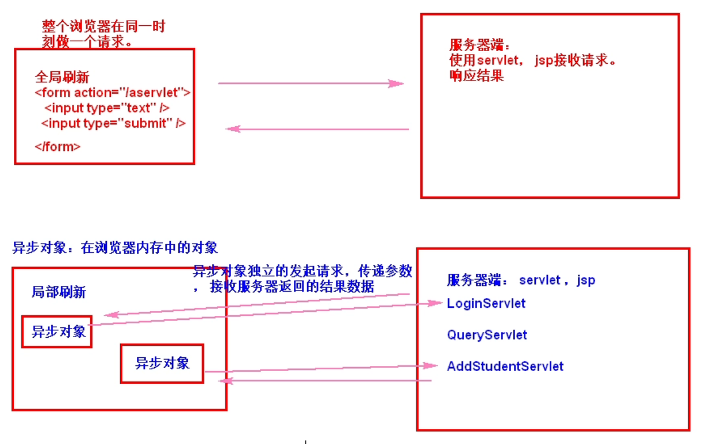
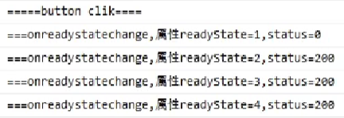

# JSON_AJAX

---

---

---

## JSON

---

---

### 一、概述

---

- ***JavaScript Object Notation***
- 一种<u>轻量级</u>的**数据交换格式**
- 易于人的阅读和编写，也易于<u>机器的解析和生成</u>
- JSON 采用**完全独立于语言**的文本格式，<u>很多语言都对 JSON 提供了支持</u>

---

### 二、JSON在JavaScript中的使用

---

#### (一) JSON 定义语法

```js
var jsonObj = {
    "key1":value1,
    "key2":value2,
    ...
}
```

> json 由**键值对**组成，由**大括号**包围，每个键由**引号**包围，键和值之间用**冒号**分隔，多组键值对之间用**逗号**分隔

> 值可以是<u>任何合法数据类型</u>，甚至可以是一个 json、json 数组

> typeof(jsonObj) 的结果是 object

#### (二) json 的访问

- json 本质可以是一个**对象**，其中的 key 可以理解为**属性**，value 就是**属性值**

```js
jsonObj.key;
jsonObj["key"];
```

#### (三) json 常用方法

> json 有<u>两种存在形式</u>
>
> - **对象**形式：json 对象
>
>   > 处理其中数据时使用
>
> - **字符串**形式：json 字符串
>
>   > 传递数据时使用

- `JSON.stringify(json对象)`：将 json 对象转换为 json 字符串

  > 其实就是转化成了<u>定义时的语法格式字符串</u>，所以用 eval 函数也可以再当成 JS 代码执行

- `JSON.parse(json字符串)`：将 json 字符串转换为 json 字符串

---

### 三、JSON在Java中的使用

---

> 在 Java 中使用 JSON 需要提前**导入 jar 包**，可以放到 WEB-INF/lib 目录下，然后 Add as Library...
>
> 这里使用 <u>gson</u> 举例

#### (一) javaBean 和 json 互转

1. 创建一个 **Gson 对象**

   ```java
   Gson gson = new Gson();
   ```

2. 调用 Gson 对象的<u>`toJson`方法</u>，传入实体类，可以将其转化成 **json 格式的字符串**

   ```java
   public String toJson(Object src) {...}
   ```

   > 结果是和 JS 中的 JSON.stringify 一样的，都是 **json 格式的字符串**
   >
   > （其实 <u>IDEA 自动生成的 toString</u> 方法的结果也很有点 json 格式的字符串的意思）

3. 调用 Gson 对象的<u>`fromJson`方法</u>，传入 **json 格式的字符串**和**目标实体类**

   ```java
   public <T> T fromJson(String json, Class<T> classOfT) throws JsonSyntaxException {...}
   ```

#### (二) List 和 json 互转

1. 创建一个 Gson 对象

2. 调用 Gson 对象的<u>`toJson`方法</u>，传入 List 对象，可以将其转化成代表 **json 数组**的字符串

   > 注意，仍然是和实体类一样的**同一个方法**，返回值仍然是**字符串**，只不过是 <u>json 数组格式</u>的，用`[]`括起来的若干个 json 字符串，用`,`隔开

   > 前端处理数据时就当成 json 数组解析即可
   >
   > 举例：
   >
   > ```js
   > /*
   > 	class User{int id;String name;}
   > 	[{"id":250,"name":"wo"},{"id":985,"name":"C2"}]
   > */
   > var jsonObj = JSON.parse(xhr.responseText);
   > document.getElementById("myInput").value = jsonObj[1].id;
   > document.getElementById("myDiv").innerHTML = jsonObj[0].name;
   > ```

3. 调用 Gson 对象的<u>`fromJson`方法</u>，传入 **json 格式的字符串**和 **Type** 对象

   ```java
   public <T> T fromJson(String json, Type typeOfT) throws JsonSyntaxException {...}
   ```

   > 注意这个是重载版本的了，需要借助一个反射类，<u>`TypeToken`</u>
   >
   > 用法举例：
   >
   > - 写一个类继承`TypeToken`，<u>详细</u>指定泛型
   >
   >   ```java
   >   import com.google.gson.reflect.TypeToken;
   >   import java.util.List;
   >   public class UserListType extends TypeToken<List<User>> {
   >   }
   >   ```
   >
   > - `new`一个该类对象，调用`getType()`方法，返回值就可以作为方法参数
   >
   >   ```java
   >   gson.fromJson(listJsonStr, new UserListType().getType());
   >   ```

#### (三) Map 和 json 互转

1. 创建一个 Gson 对象

2. 调用 Gson 对象的<u>`toJson`方法</u>，传入 Map对象，可以将其根据 Map 的结构转化成一个 json 字符串

   > 注意，方法还是一样，但这次字符串的形式<u>不是数组</u>，**key 对应 key**，**value 对应 value**
   >
   > 如果 key 是引用数据类型（建议不要这样），会调用 toString 变成字符串
   >
   > 如果 value 是引用数据类型（这样可以），会嵌套成一个 **json 对象**

   > 举例：
   >
   > ```js
   > /*
   > 	class User{int id;String name;}
   > 	Map<Integer, User>
   > 	{"211":{"id":250,"name":"C2"},"985":{"id":666,"name":"C9"}}
   > */
   > var jsonObj = JSON.parse(xhr.responseText);
   > document.getElementById("myInput").value = jsonObj["211"].id;
   > document.getElementById("myDiv").innerHTML = jsonObj["211"].name;
   > ```

3. 调用 Gson 对象的<u>`fromJson`方法</u>，传入 **json 格式的字符串**和 **Type** 对象

   > 和 List 的操作类似

   > 当然，也是可以使用匿名内部类的
   >
   > ```java
   > Map<Integer, User> map = gson.fromJson(mapJsonStr, 
   > 			new TypeToken<Map<Integer, User>>(){}.getType() );
   > ```

---

---

## AJAX

---

---

### 一、全局刷新和局部刷新

---

#### (一)全局刷新

- 用户发起请求后，**跳转视图**，整个页面发生变化

  > form 和 href 都属于全局刷新

- 缺点：

  - 传递数据量大，占用网络带宽
  - 浏览器要**重新渲染整个页面**

#### (二)局部刷新

- 发起请求、获取数据后，对当前页面的**部分视图**进行更新
- 特点：
  - 数据量小，在网络中传输速度快
  - 部分更新，浏览器<u>不必全部重新渲染</u>
  - 在一个页面可以进行<u>多个局部刷新</u>

---

### 二、异步请求对象与AJAX介绍

---

#### (一)概述

- 在**局部刷新**中，使用**异步请求对象**，在<u>浏览器内部</u>发起请求，获取数据

  > 画图理解：
  >
  > 

- 异步对象是在<u>浏览器内部</u>的一种 **JavaScript 对象**

  > <u>各大浏览器</u>都能支持异步对象的使用

#### (二) XMLHttpRequest 介绍

- 创建语法：

  ```js
  var xhr = new XMLHttpRequest();
  ```

- 使用异步对象进行局部刷新，需要用到的技术：

  - JavaScript：创建 XMLHttpRequest 对象，调用其属性和方法
  - DOM：处理 DOM 结点，更新数据
  - CSS：处理视图、更新、美化
  - Servlet：服务商技术
  - 数据格式：JSON、XML

  > 以上这些技术的综合使用，就叫做 ***AJAX***

#### (三) AJAX 介绍

- ***Asynchronous JavaScript and XML***（异步的 JavaScript 和 XML）

- AJAX 是一种无需重新加载整个网页的情况下，<u>部分更新页面内容</u>的**方法**

  > AJAX 不是编程语言，它是多种技术的综合使用
  >
  > AJAX 的核心是 ***JavaScript*** 和 ***XML***（现在 ***JSON*** 可以代替 XML）

- 如何理解异步？

  - 在发送一个请求时，可以同时处理其他请求

---

### 三、:star:XMLHttpRequest的使用

---

#### (一)常用方法

- open 方法：配置请求

  ```js
  xhr.open("请求方式", "/项目名/资源路径", 是否异步);
  ```

- send 方法：使用异步对象发送请求

  ```js
  xhr.send();
  ```

- getAllResponseHeaders 方法：获取所有的响应头

#### (二)常用属性

- readyState 属性：指示当前请求的状态

  - 0：表示**刚创建**异步请求对象
  - 1：表示已经执行完 open 方法**配置了请求**
  - 2：表示已经执行完 send 方法**发送了请求**
  - 3：表示异步对象已经**从服务器接收到了数据**
  - 4：表示异步对象已经在内部**处理完了数据**

- status 属性：表示网络的状态，与 **HTTP 状态码**对应

  - 200：请求成功
  - 404：前端指定的资源路径找不到
  - 500：后端服务器内部代码有错误

- statusText：状态字符串

- response：响应体

- responseText 属性：表示服务器端返回的**数据**

  ```js
  var data = xhr.responseText;
  ```

#### (三)使用步骤

1. **创建**异步对象

   ```js
   var xhr = new XMLHttpRequest();
   ```

2. 给异步对象**绑定事件**

   ```js
   xhr.onreadystatechange = function() {...}
   ```

3. 在绑定事件中，根据 <u>readyState 和 status 的值</u>做请求的**处理**

   - readyState 为 4 的状态是比较重要的，其他数值的处理意义不大

   ```js
   if (xhr.readyState == 4 && xhr.status == 200) {
       var data = xhr.responseText;
       ...//更新DOM对象...
   }
   ```

   > 其实状态码在$[200,300)$之间都应该算成功

   >属性值变化举例：
   >
   >

4. 初始化请求的参数，执行 open 函数

   ```js
   xhr.open("请求方式", "/项目名/资源路径", 是否异步);
   ```

   > 第三个参数缺省为`true`

5. 发送请求，执行 send 函数

---

### 四、AJAX案例

---

#### (一)局部刷新计算 bmi

- 从服务器端接收到的只是**数据**，并非页面布局，<u>并非视图</u>

- send 函数就可以使 Servlet 对象的相关方法执行

- responseText 属性就可以获取到 Servlet 响应结果

  > :star:可以获取 ***response.print*** 中的内容

- 为了能向 Servlet 传递数据，可以用 GET 请求，将数据附在 URI 后面

#### (二)接收 json 格式数据

---

### 五、异步请求和同步请求

---

#### (一)怎么发送

- open 函数的第三个参数，<u>true 为异步</u>，<u>false 为同步</u>

#### (二)有什么区别

- open 函数中指定异步，send 函数发送请求之后**立刻向下执行**，**不必等待响应**

  > 响应都交给 <u>onreadystatechange 事件句柄</u>处理

- open 函数中指定同步，send 函数发送请求之后，要**等待服务器响应**，才能继续向下执行


