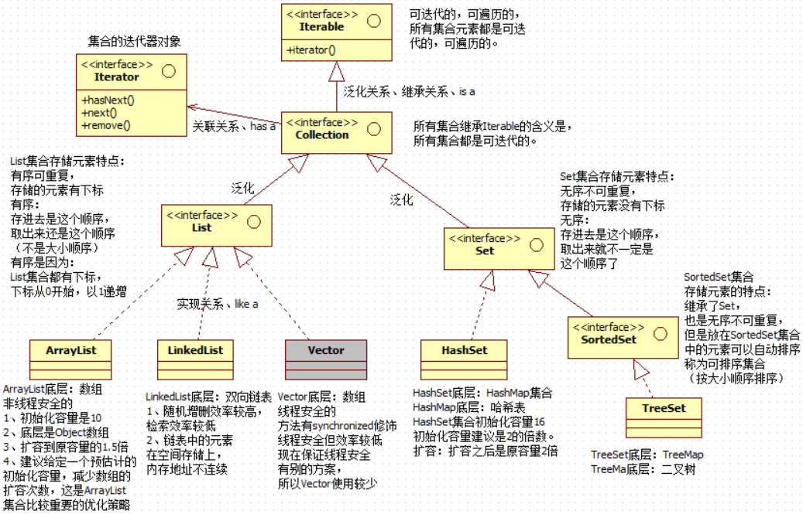
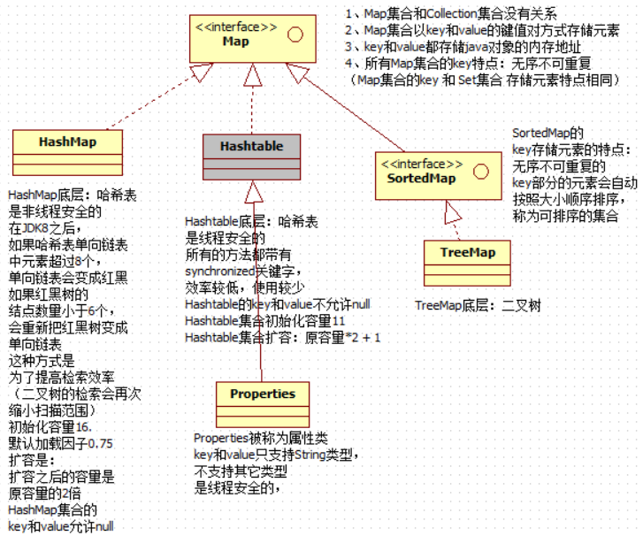

# JavaSE (下)

---

---

---

## 集合

---

---

### 一、集合概述

---

#### （一）什么是集合

- 集合是一个容器/载体，可以容纳**某种类型的数据**
- 集合本身也是一种**引用数据类型**
- 所有的集合类和集合接口都在`java.util`包下

#### （二）集合中存什么

- 集合中存储的是**引用**

- 集合不能直接存储基本数据类型

  > 可以<u>自动装箱</u>后再存储

#### （三）集合的特点

- `Java`中每个不同的<u>集合</u>，底层都是用不同的**数据结构**去<u>实现</u>的

  > 常见集合底层数据结构：
  >
  > 数组、链表、二叉树、哈希表 ...

- `Java`中的集合都是可以**迭代**的

#### （四）集合的分类

> 按存储元素的方式进行分类

- **单个**方式存储元素
  - 这一类集合的超级父接口是`java.util.Collection`
  - 有**迭代器**，帮助访问元素
  - **键值对**方式存储元素
  - 这一类集合的超级父接口是`java.util.Map`
  - 没有迭代器，主要通过`key`取出`value`

---

### 二、集合继承结构

---

#### （一）Collection继承结构



#### （二）Map继承结构



> 注：由于`xxxSet`底层实际上是`xxxMap`的`key`部分，所以不会单独展开讲解`Set`

---

### 三、泛型机制

---

#### （一）概述

- `JDK5`之后的机制

- 主要在**编译期**发挥作用，给**编译器**一个参考，<u>在运行时意义不大</u>

  > 把类型的明确工作推迟到**<u>创建对象</u>**或**<u>调用方法</u>**的时候；
  >
  > 把数据类型当作参数传递；
  >
  > 注 ：泛型只能是==引用数据类型==

- 指定集合中存储的数据类型，使**类型更统一**

  > 这样做的优点是：
  >
  > :star:集合中元素的类型统一，==**迭代器返回的数据类型统一的**==，**<u>不用向下转型</u>**了
  >
  > 这样做的缺点是：
  >
  > 导致集合中存储的元素缺乏多样性
  >
  > （但在大多数需求中，集合中的元素类型都是统一的，所以<u>泛型机制应用广泛</u>）

  > 当然，在调用**子类特有方法**时，该向下转型还是要向下转型

#### （二）泛型类&泛型接口

- *定义类*：紧跟在<u>类名后面</u>加`<泛型标识符>`，代表这个类支持泛型

  > 在应用时会将<u>标识符</u>替换成相应的类型
  >
  > 标识符一般使用`E`(Element) 或`T`(Type)

  > 如果写了泛型标识符却不用，那么泛型默认变成`Object`类

- *创建对象*：

  ```java
  集合接口名<泛型> 引用名 = new 集合类名<泛型>(...)
  ```

  > 自动类型推断：（`JDK8`之后）
  >
  > 集合类名后尖括号中的泛型可以省略，称为“<u>钻石表达式</u>”

  > **集合接口**名与**迭代器接口**名后面的泛型**不能再省略**了

  > 可以同时定义多个泛型，在`<>`中用`,`隔开，例如：`<E, T>`

- *子类*：

  - 定义子类时可以确定父类泛型

    ```java
    public class SubClass extends SuperClass<Entity> {}
    ```

  - 也可以不确定

    ```java
    public class SubClass<T> extends SuperClass<T> {}
    ```


#### （三）泛型方法

- *语法*

  ```java
  [修饰符列表] <T> 返回值类型 方法名(形式参数列表) {
      方法体
  }
  ```

  > 返回值、形参列表和方法体中都可以使用这个泛型

  > 注意，泛型方法与所在类是否是泛型类无关，
  >
  > 且方法可以是<u>静态</u>的，因为泛型是在**调用方法**时确定的，而不是**实例化**时

- *确定泛型*

  - 在调用方法时，程序会根据<u>调用</u>**自动推导泛型**

    > 所以如果使用泛型方法，方法的**参数**中一般就会有泛型；
    >
    > 也可以通过返回值确定，就是很奇怪，需要保证必须能转型成功

#### （四）通配符

- 在指定泛型（给泛型赋值）时，尖括号中可以使用`?`

- 相当于是所有泛型的“祖先”

  > 当然集合接收元素的时候还是需要使用`Obejct`引用，也就是允许**读**；
  >
  > > 比如`get`方法
  >
  > 但是，不允许写，比如`List<?>`不能调用`add`添加对象（除非是`null`）

#### （五）泛型上下限

> 泛型之间就没有向上/向下转型的概念了
>
> > 比如`List<Object>`和`List<String>`是两个**并列的类**

- 泛型限定：在使用泛型时要求泛型具有某种**继承关系**，并不是任何类型

  > 理解这个知识点时，一定要记住，==泛型是引用==

- 语法（**使用**泛型时，也就是给泛型赋值时）

  - 泛型上限：泛型必须是某个类或者其**子类**

    ```java
    <? extends Entity>
    ```

    > 读取数据时可以用<u>`Entity`或者其父类</u>接收，子类不行；
    >
    > 写入时也不能写子类，因为实际存的**引用**可以更小
  
  - 泛型下限：泛型必须是某个类或者其**父类**
  
    ```java
    <? super Entity>
    ```
    
    > 读取数据时只能用`Object`接收；
    >
    > 写入时可以写子类，因为至少父类这个**引用**足够接收它

> 注：
>
> 在**定义泛型**时如果要指定<u>上限</u>，就要把`?`替换成`T`、`E`等标识了；
>
> 但是，在定义泛型时不能指定<u>下限</u>，这样没有意义，
>
> > 无法知道具体类的父类是哪一个，也没办法使用其父类相关属性和方法，和直接把泛型写成这个类没区别

>***foreach***
>
>- ##### *概述*
>
>  - `JDK5`新特性，增强`for`
>  - 很方便地**迭代集合或数组**
>  - 缺点：在循环内无法使用下标
>
>- ##### *用法*
>
>  - 语法：`for(类型名 变量名 : 集合或数组名)`
>
>  - 需要集合实现`iterable`接口

---

### 四、Collection相关

---

#### （一）:star:Collection常用方法

- ##### *针对元素*

  - `add(E)`：添加元素（可以自动装箱）

    ```java
    boolean add(E e);
    ```

  - `contains(Object)`：判断集合中是否包含某个元素

    ```java
    boolean contains(Object o);
    ```

    > :star:`contains`方法深入：
    >
    > 底层调用了`equals`方法，`equals`方法返回为`true`，就代表包含这个元素
    >
    > 所以，==**:star2:存放在集合中的元素类型一定要重写`equals`方法**:star2:==

  - `remove(Object)`：删除集合中某个元素

    ```java
    boolean remove(Object o);
    ```

    > :star:`remove`方法深入：
    >
    > 底层也调用了`equals`方法，`equals`方法返回为`true`，就会删除	这个元素

- ##### *针对集合整体*

  - `size()`：返回集合中元素个数

    ```java
    int size();
    ```

  - `clear()`：清空集合

    ```java
    void clear();
    ```

  - `isEmpty()`：判断集合是否为空

    ```java
    boolean isEmpty();
    ```

  - `toArray()`：将集合转换成数组

    ```java
    Object[] toArray();
    ```

#### （二）==Iretator迭代器==

> 以下讲解的迭代方式是`Collection`相关类**通用**的方式，但`Map`相关类不能用

1. ##### *获取迭代器*

   - `iterator()`：获取该集合对应的迭代器

     ```java
     Iterator<E> iterator();
     ```

2. ##### *通过迭代器遍历集合*

   - `hasNext()`：是否还有元素可以迭代

     ```java
     boolean hasNext();
     ```

   - `next()`：迭代器先**前进**，再**返回指向的元素**

     ```java
     E next();
     ```

   > 常见用法/模板：
   >
   > ```java
   > Collection c = new ...;
   > Iterator it = c.iterator();
   > while (it.hasNext()) {
   >  Object obj = it.next();
   >  ...
   > }
   > ```

> :star:迭代器深入：
>
> - *给集合拍快照*
>
>   - ==集合结构发生改变后，迭代器必须重新获取==
>   - 反过来说，在迭代过程中，不能随意更改集合结构
>   - 否则，如果调用`next`方法，会出现异常`ConcurrentModificationException`
>
> - *迭代器的`remove`方法*
>
>   - 源代码
>
>     ```java
>     default void remove() {
>         throw new UnsupportedOperationException("remove");
>     }
>     ```
>
>   - 作用描述：删除**迭代器指向**的**当前**元素  /  移除迭代器<u>返回的最后一个元素</u>
>
>   - 迭代器的`remove`方法可以<u>同时删除</u>**“快照”**和**原集合**中的元素

#### （三）:star:List

- ##### *存储特点*

  - **有序**，**可重复**

    >存进去是这个顺序，取出来还是这个顺序
    >（不是大小顺序）

  - **有下标**

    > 下标从0开始，以1递增

- *`List`子接口特有方法*

  - `add(int, E)`：向指定<u>下标</u>处**添加**元素

    ```java
    void add(int index, E element);
    ```

    > 类似于数组的**随机添加**，<u>平均效率低</u>，所以<u>用得不多</u>
    >
    > 常用的还是`add(E)`**向数组末尾添加元素**，<u>效率高</u>

  - `get(int)`：**获取**指定<u>下标</u>处的元素

    ```java
    E get(int index);
    ```

    > 从这里就可以引出`List`<u>特有的迭代方式</u>：**下标遍历**

  - `indexOf(Object)`和`lastIndexOf(Object)`：获取元素第一次/最后一次出现处的<u>索引</u>

    ```java
    int indexOf(Object o);
    ```

  - `remove(int)`：删除指定<u>下标</u>位置处的元素

    ```java
    E remove(int index);
    ```

  - `set(int , Object)`：**修改**指定<u>下标</u>处的元素

    ```java
    E set(int index, E element);
    ```

#### （四）ArrayList

- ##### *存储特点*

  - 底层是`Object`类型**数组**

  - 初始化默认容量是10

    > 容量的意思不是当前元素个数(size)，而是指当前<u>在底层开辟的数组长度</u>

    > 如果调用**无参构造**，在<u>添加元素之前</u>，底层数组的<u>长度先是0</u>，添加第一个元素后，底层数组立刻<u>扩容为10</u>
    >
    > 如果调用**有参构造**传入`initialCapacity`，底层会直接开辟一个对应长度的数组

  - 扩容：容量增长量为**原容量大小右移一位**，即扩容为原先的1.5倍

    > 扩容效率较低，建议**预估计初始化容量**，减少扩容次数

  - 在实际应用中<u>使用较多</u>，因为**<u>检索效率高</u>**

    > 实际需求中**检索比较多**，而且添加元素大多数也是<u>向数组末尾添加</u>，效率不低

  - 非线程安全

- ##### *`ArrayList`子类特有方法*

  - 构造方法

    - 无参构造

      ```java
      public ArrayList() {
          this.elementData = DEFAULTCAPACITY_EMPTY_ELEMENTDATA;
      }
      ```

      ```java
      private static final Object[] DEFAULTCAPACITY_EMPTY_ELEMENTDATA = {};
      ```

    - 有参构造(int)

      ```java
      public ArrayList(int initialCapacity) {...}
      ```

    - 有参构造(Collection)

      ```java
      public ArrayList(Collection<? extends E> c) {...}
      ```

  - 其他常用方法都是`List`接口中的

#### （五）LinkedList

- *存储特点*

  - 底层是一个**双向链表**

    > 也是**有下标**的，`List`子实现类都有
    >
    > 但链表中的元素在空间存储上，**地址是不连续的**

  - **随机增删效率高**，**检索效率低**

    > 不能通过数学表达式计算元素的内存地址
    >
    > 每一次查找都要从头结点开始遍历

  - 没有“初始化容量”这个概念

- ##### *静态内部类*

  - `Node`：链表结点

    ```java
    private static class Node<E> {
        E item;
        Node<E> next;
        Node<E> prev;
    
        Node(Node<E> prev, E element, Node<E> next) {
            this.item = element;
            this.next = next;
            this.prev = prev;
        }
    }
    ```

- ##### *实例变量*

  - `size`：链表长度

    ```java
    transient int size = 0;
    ```

  - `first`/`last`：头/尾指针

    ```java
    transient Node<E> first;
    transient Node<E> last;
    ```

- ##### *方法*

  - 构造方法

    - 无参构造

      ```java
      public LinkedList() {
      }
      ```

    - 有参构造(Collection)

      ```java
      public LinkedList(Collection<? extends E> c) {
          this();
          addAll(c);
      }
      ```

    > 注：和`ArrayList`不同，`LinkedList`没有`Capacity`的构造方法

  - 实例方法

    - `add(E)`：**尾插法**向链表中添加元素

  - 其他常用方法都是`List`接口中的

#### （六）Vector

- ##### *存储特点*

  - 底层是`Object`类型**数组**

  - 初始化默认容量是10

  - 扩容：扩容成**原容量的二倍**

  - 方法有`synchronized`关键字修饰，线程同步

    > 线程安全，但效率低，现在已经有更高效的办法保证线程安全了，
    >
    > 所以`Vector`使用较少

- ##### *方法*

  - 


---

### 五、Map相关

---

> 前言：
>
> - `Map`以**键值对**的形式存储数据，其中==`key`是主导==，`value`是附属
>
>   > 当然，存的都是**引用**，都是<u>内存地址</u>
>
> - `Set`本质上就是用`Map`的`key`部分进行存储的

#### （一）:star:Map常用方法

- ##### *针对键值对*

  - `put(K, V)`：添加键值对

    ```java
    V put(K key, V value);
    ```

  - `get(Object)`：通过`key`获取`value`

    ```java
    V get(Object key);
    ```

  - `containsKey(Object)` / `containsValue(Object)`：是否包括`key`/ `value`

    ```java
    boolean containsKey(Object key);
    boolean containsValue(Object value);
    ```

    > 底层同样是调用了`eqauls`方法

  - `remove(Object)`：通过`key`删除键值对

    ```java
    V remove(Object key);
    ```

  - `getOrDefault(Object, V)`：根据`key`获取`value`，如果<u>判断</u>不存在`key`，则返回**默认值**

    ```java
    V getOrDefault(Object key, V defaultValue);
    ```

- *针对集合整体*

  - `clear()`：清空

    ```java
    void clear();
    ```

  - `isEmpty()`：判断元素个数是否为0

    ```java
    boolean isEmpty();
    ```

  - `size()`：获取键值对个数

    ```java
    int size();
    ```

  - `keySet()`：以`Set`的形式获取所有`key`

    ```java
    Set<K> keySet();
    ```

  - `values()`：以`Collection`的形式获取所有`value`

    ```java
    Collection<V> values();
    ```

  - `entrySet()`：将`Map`转化为`Set`

    ```java
    Set<Map.Entry<K, V>> entrySet();
    ```

    > - `Map.Entry`是`Map`的内部接口
    >
    >   ```java
    >   interface Entry<K, V> {...}
    >   ```
    >
    >   > `HashMap`中的静态内部类`HashMap.Node<K, V>`实现了这个接口
    >
    > - 将`key`和`value`融合成一体，重写了`toString()`方法为`key=value`
    >
    > - 这个方法用于遍历时效率更高

#### （二）==Map的遍历==

- *方式一*：获取所有`key`，通过`key`获取`value`

  - 重点通过`keySet()`方法，获取`Set`集合

  - 然后再用**<u>迭代器</u>**进行迭代，也可以用`foreach`遍历


  > 举例
  >
  > ```java
  > Map<Integer, String> map = new HashMap<>();
  > ...
  > Set<Integer> keys = map.keySet();
  > Iterator<Integer> it = keys.iterator();
  > while (it.hasNext()) {
  >  Integer key = it.next();
  >  String value = map.get(key);
  >  System.out.println(key + "=" + value);
  > }
  > ```

- 方式二：直接将`Map`转化为`Set`，再通过其中的元素获取`key`和`vaule`

  - 重点通过`entrySet()`方法进行转化

  - 还要利用`HashSet.Node`的`getKey()`和`getValue()`方法


  > 举例
  >
  > ```java
  > Map<Integer, String> map = new HashMap<>();
  > ...
  > Set<Map.Entry<Integer, String>> set = map.entrySet();
  > Iterator<Map.Entry<Integer, String>> it = set.iterator();
  > while (it.hasNext()) {
  >  Map.Entry<Integer, String> node = it.next();
  >  Integer key = node.getKey();
  >  String value = node.getValue();
  >  System.out.println(key + "=" + value);
  > }
  > ```

  > 这种方式的**效率更高**，适合<u>大数据量</u>

#### （三）:star:HashMap

- ##### *存储特点*

  - `HashMap`集合底层是**哈希表数据结构**

    > 哈希表可以理解为**数组**和**链表**的<u>结合体</u>，发挥它们各自的优点
    >
    > 增删在链表上完成，查询只需要部分扫描

  - 底层是一个`Node`**数组**，数组中每个元素都是一个**链表的头结点**

    > - `Node`数组
    >
    >   ```java
    >   transient Node<K,V>[] table;
    >   ```
    >
    > - 静态内部类`Node`
    >
    >   ```java
    >   static class Node<K,V> implements Map.Entry<K,V> {
    >       final int hash;
    >       final K key;
    >       V value;
    >       Node<K,V> next;
    >   }
    >   ```
    >
    > > `hash`值是`key`的`hashCode()`方法的执行结果，`hash`值可以通过哈希算法转换成数组的下标

  - `key`**无序**，**不可重复**

    > 无序：不一定会挂到哪个链表上
    >
    > 不可重复：`equals`方法保证`key`不可重复

    > `HashMap`的`key`和`value`都允许为`null`，
    >
    > 但值为`null`的`key`只能有一个，而且可以通过值为`null`的`key`去获取`value`

  - <u>默认初始化容量</u>是**16**，<u>默认装载因子</u>是**0.75**；扩容会扩容到**原容量的2倍**

    > 当底层数组的元素个数达到75%容量时，数组会**扩容**

    > 初始化容量必须是$2^x$，这是为了**散列均匀**，提高效率

    > 在`JDK8`之后，
    >
    > 当**单向链表**元素大于等于8个时，会变成红黑树
    >
    > 当红黑树元素小于等于6个时，会变回单向链表
    >
    > 这是为了提高检索效率

- ##### *:star:重要方法实现原理*

  - `put(K, V)`

    ```java
    public V put(K key, V value) {...}
    ```

    > 实现原理：
    >
    > 1. 将`key`和`value`封装到`Node`对象当中
    > 2. 调用`key`的`hashCode()`方法得到`hash`值，通过哈希算法将`hash`值转换成数组下标
    > 3. 如果下标位置没有元素，就直接加入`Node`数组中
    > 4. 如果下标位置已有元素，就用`key`的`equals(K)`方法与链表上每一个结点的`key`比较。如果都返回`false`，就直接添加的链表的末尾（`JDK8`之后）；如果遇到了一个返回`true`的，会将原`value`覆盖

  - `get(Object)`

    ```java
    public V get(Object key) {...}
    ```

    > 实现原理：
    >
    > 1. 调用`key`的`hashCode()`方法得到`hash`值，通过哈希算法将`hash`值转换成数组下标
    > 2. 如果下标位置没有元素，就直接返回`null`
    > 3. 如果下标位置已有元素，就用`key`的`equals(K)`方法与链表上每一个结点的`key`比较。如果都返回`false`，就返回`null`；如果遇到了一个返回`true`的，`value`覆盖

  > 所以，==`K key`的`equals(K)`方法和`hashCode()`方法要**同时重写**==
  >
  > 并且，==如果`equals(K)`方法返回`true`，`hashCode()`方法的返回值必须**相同**==
  >
  > 但是，不必自己研究怎么重写，直接用IDEA工具==将两个方法**同时生成**==
  >
  > 举例：（只有一个实例变量`name`）
  >
  > ```java
  > @Override
  > public boolean equals(Object o) {
  >  if (this == o) return true;
  >  if (o == null || getClass() != o.getClass()) return false;
  >  Student student = (Student) o;
  >  return Objects.equals(name, student.name);
  > }
  > @Override
  > public int hashCode() {
  >  return Objects.hash(name);
  > }
  > ```

#### （四）Hashtable

- ##### *存储特点*

  - 底层也是哈希表数据结构
  - <u>默认初始化容量</u>是**11**，<u>默认装载因子</u>是**0.75**；扩容会扩容到**原容量$\times$2 + 1**
  - `key`和`value`都不能是`null`

- 方法

  - 有`synchronized`修饰，线程安全，但效率低

    > 现在保证线程安全已经有其他方案了

#### （五）Properties

- ##### *存储特点*

  - 被称为**属性类对象**，是`Hashtable`的子类
  - ==`key`和`value`都必须是`String`类型==

- ##### :star:*常用方法*

  - `setProperties(String, String)`

    ```java
    public synchronized Object setProperty(String key, String value) {...}
    ```

  - `getProperties(String)`

    ```java
    public String getProperty(String key) {...}
    ```

#### （六）TreeMap

- ##### *存储特点*

  - 底层是**二叉树**
  - **无序不可重复**，但可以**自动对`key`部分排序**（**可排序集合**）

- ##### *排序的比较问题*

  - 泛型类实现`java.lang.Comparable`接口

    - 一个类如果没有实现`Comparable`接口，<u>没有指定比较规则</u>，却将其作为`TreeMap`的`key`部分，会异常

      > 调用`put(K, V)`方法会出现`ClassCasException`，
      >
      > 没有实现`java.lang.Comparable`接口

    - :star:用法：`implements Comparable<泛型>`，然后实现接口中的`compareTo(T)`方法

      ```java
      public int compareTo(T o);
      ```

      > 在实现的方法体中书写比较的逻辑即可
      >
      > 升序：`this - o`
      >
      > 降序：`o - this`
      >
      > （`this`代表当前对象，`o`代表传入的引用）
      >
      > 多个成分参与比较时，一个一个比

  - 在创建`TreeMap`时使用比较器`java.util.Comparator`

    - **有参构造，传入<u>比较器实现类</u>**

      ```java
      public TreeMap(Comparator<? super K> comparator) {
          this.comparator = comparator;
      }
      ```

    - :star:用法：可以结合匿名内部类

      ```java
      new TreeMap(new Comparator<T>() {
          public int compare(T o1, T o2) {...}
      })
      ```

  > `Comparable`和`Comparator`怎么选择？
  >
  > 如果**比较规则不会改变**，可以选择实现`Comparable`接口
  >
  > 如果**比较规则有多个**，建议使用`Comparator`比较器，比较符合<u>面向接口编程</u>的思想


---

### 六、Collecctions集合工具类

---

- `synchronizedList(List<T>)`：将`List`集合变成线程安全的

  ```java
  public static <T> List<T> synchronizedList(List<T> list) {...}
  ```

- `sort(List<T>)`和`sort(List<T>, Comparator<? super T>)`：对`List`集合进行排序

  ```java
  public static <T extends Comparable<? super T>> void sort(List<T> list) {...}
  public static <T> void sort(List<T> list, Comparator<? super T> c) {...}
  ```

  > 同样要求<u>泛型类实现了`Comparable`接口</u>或<u>传入比较器</u>

- `reverse(List<T>)`：反转`Lis`

  ```java
  public static void reverse(List<?> list) {...}
  ```

  

  


---

---

## IO流

---

---

### 一、概述

---

#### （一）IO流有什么用

- 通过IO流对硬盘进行读写

#### （二）分类

- ##### *按流的方向*

  - 输入(Input)流：读(Read)
  - 输出(Output)流：写(Write)

  > 以内存为参照物

- ##### *按读取数据的方式*

  - 字节流

    - 一次读取**1个字节**，或者说是**8个二进制位**
    - <u>什么类型的文件都能读</u>

  - 字符流

    - 一次读取**一个字符**

    - **专门**/只能 读取**文本文件**

      > 就是为了**方便文本文件的读写**而存在的

      > word文档.doc或.docx不算普通文本文件

#### （三）四大家族

- `java.io.InputStream`家族：**字节**输入流
- `java.io.OutputStream`家族：**字节**输出流
- `java.io.Reader`家族：**字符**输入流
- `java.io.Writer`家族：**字符**输出流

> 这四大家族的首领都是`abstract class`

> 区分家族成员（子类），可以看**结尾**：`XxxStream`都是字节流，`Xxxer`都是字符流

#### （四）流的共性 

- **所有流**都`implements Closeable`

  - 流是内存和硬盘之间的一个“<u>管道</u>”，用完之后一定要**关闭**，不然会一直**占用资源**

  - `close()`方法

    ```java
    public void close() throws IOException;
    ```

- 所有**输出流**都`implements Flushable`

  - 输出流在**输出结束后**，一定要`flush()`，将剩余的数据强行输出（<u>清空“管道”</u>）

  - `flush()`方法

    ```java
    void flush() throws IOException;
    ```

---

### 二、:star:文件流

---

#### （一）FileInputStream

- ##### *概述*

  - **文件字节输入流**，**任何类型**的文件都可以读
  - 以**字节**的方式，完成读的操作（硬盘$\rightarrow$内存）

- ##### *使用方法*

  1. 创建流

     - 有参构造：传入`String`，代表文件路径

       ```java
       public FileInputStream(String name) throws FileNotFoundException {...}
       ```

       > 传入的`String name`是文件路径，注意要用转义字符`\\`
       >
       > （当然写成`/`也行）
       >
       > IDEA的**默认当前路径**是**工程Project的根**

       > 需要处理一个**编译时异常**，同时为了在`finally`中**及时关闭流**，需要将流的声明写在`try...catch...`外边，举例：
       >
       > ```java
       > FileInputStream fis = null;
       > try {
       >  fis = new FileInputStream("D:\\Java\\JDBC\\JDBCTest02.java");
       >  ...
       > } catch (FileNotFoundException e) {
       >  e.printStackTrace();
       > } finally {
       >  if (fis != null) {
       >      try {
       >          fis.close();
       >      } catch (IOException e) {
       >          e.printStackTrace();
       >      }
       >  }
       > }
       > ```

  2. 读

     - `read()`：向后读取**一个字节**

       ```java
       public int read() throws IOException {...}
       ```

       > 返回值是读到的这个字节本身（转换成十进制）
       >
       > 如果已经读到**末尾**了，再向后读就会一直返回`-1`

       > 会抛出异常，建议**细粒度**处理，`Add 'catch' claues(s)`，在同一个`try`后添加一个`catch(IOException e)`子句
       >
       > ```java
       > try {
       >  fis = new FileInputStream("D:\\Java\\JDBC\\temp.txt");
       >  int readData = fis.read();
       > } catch (FileNotFoundException e) {
       >  e.printStackTrace();
       > } catch (IOException e) {
       >  e.printStackTrace();
       > } finally {...}
       > ```

       > 改进：使用**循环**的方式读取**单个字节**
       >
       > ```java
       > fis = new FileInputStream("D:\\Java\\JDBC\\temp.txt");
       > int readData = 0;
       > while((readData = fis.read()) != -1) {
       >  System.out.println(readData);
       > }
       > ```

       > 当然，一次只读取一个字节的方式，内存和硬盘的交互太频繁

     - :star:`read(byte[])`：向后读取最多**数组长度**个字节到数组中

       ```java
       public int read(byte b[]) throws IOException {...}
       ```

       > **返回值**是读到的**字节数量**
       >
       > 如果一开始不是末尾但**读到末尾**了，读了几个**有效字节**就返回几
       >
       > 如果**一开始就是末尾**，直接返回`-1`

       > :star:与`String`的`byte数组`系列构造方法联合，读多少个转多少个
       >
       > ```java
       > public String(byte bytes[], int offset, int length) {...}
       > ```
       >
       > 举例：
       >
       > ```java
       > fis = new FileInputStream("tempfile");
       > byte[] b = new byte[4];
       > int readCount = 0;
       > while ((readCount = fis.read(b)) != -1) {
       >  System.out.println(new String(b, 0, readCount));
       > }
       > ```

  3. 关闭流

     - 用<u>`close()`方法</u>，在<u>`finally`子句</u>中关闭流即可
     - 需要**判空**和**处理异常**

     ```java
     finally {
         if (fis != null) {
             try {
                 fis.close();
             } catch (IOException e) {
                 e.printStackTrace();
             }
         }
     }
     ```

  > ==`FileInputStream`终极常用模板==
  >
  > ```java
  > FileInputStream fis = null;
  > try {
  >  fis = new FileInputStream("文件路径");
  >  byte[] bytes = new byte[4];//这个数组长度是可以换的
  >  int readCount = 0;
  >  while((readCount = fis.read(bytes)) != -1) {
  >      System.out.print(new String(bytes, 0, readCount));
  >  }
  > } catch (FileNotFoundException e) {
  >  e.printStackTrace();
  > } catch (IOException e) {
  >  e.printStackTrace();
  > } finally {
  >  if (fis != null) {
  >      try {
  >          fis.close();
  >      } catch (IOException e) {
  >          e.printStackTrace();
  >      }
  >  }
  > }
  > ```
  >
  > 

- ##### *其他常用方法*

  - `available()`：返回流对应文件中**剩余的有效字节数量**

    ```java
    public int available() throws IOException {...}
    ```

    > 用处：
    >
    > 提前知晓文件字节数，从而直接创建对应大小的字节数组，不必循环了
    >
    > （但不适合大文件，因为`byte数组`不能太大）
    >
    > 举例：
    >
    > ```java
    > byte[] bytes = new byte[fis.available()];
    > fis.read(bytes);
    > ```

  - `skip(long)`：**跳过**几个字节不读

    ```java
    public long skip(long n) throws IOException {...}
    ```

#### （二）FileOutputStream

- ##### *概述*

  - **文件字节输出流**，负责写，从内存到硬盘

- ##### *使用方法*

  1. 创建流

     - 单参构造：传入`String`，代表文件路径

       ```java
       public FileOutputStream(String name) throws FileNotFoundException {...}
       ```

       > 如果路径指定的文件不存在，就会**新建**一个文件
       >
       > 如果路径指定的文件存在，就会将原文件**清空**，然后重新写入
       >
       > （所以要谨慎使用）

     - 双参构造：传入`String`和`boolean`，代表文件路径和是否**追加**

       ```java
       public FileOutputStream(File file, boolean append) throws FileNotFoundException {...}
       ```

       > `append`为`ture`就代表在原文件末尾**追加**，**不会清空**原文件内容

     > 一样的架子，但要注意最后需要**刷新流**
     >
     > ```java
     > FileOutputStream fos = null;
     > try {
     >  fos = new FileOutputStream("myfile");
     >  ...
     >  fos.flush();
     > } catch (FileNotFoundException e) {
     >  e.printStackTrace();
     > } catch (IOException e) {
     >  e.printStackTrace();
     > } finally {
     >  try {
     >      if(fos != null) fos.close();
     >  } catch (IOException e) {
     >      e.printStackTrace();
     >  }
     > }
     > ```

  2. 写

     - `write(byte[])`：向输出流对应的文件中写数据，将`byte`数组中的内容**全部写出**

       ```java
       public void write(byte b[]) throws IOException {...}
       ```

     - `write(byte[], int, int)`：向输出流对应的文件中写数据，将`byte`数组中的部分内容写出

       ```java
       public void write(byte b[], int off, int len) throws IOException {...}
       ```

     > :star:与`String`类的`getBytes()`方法联合，向文件中**写入指定字符串**
     >
     > ```java
     > public byte[] getBytes() {...}
     > ```

  3. 刷新

     - 利用`flush()`方法，在`try`子句的最后面刷新流
     - 需要处理异常`IOException`

     ```java
     try {
         fos = new FileOutputStream("myfile");
         ...
         fos.flush();
     } catch (FileNotFoundException e) {
         e.printStackTrace();
     } catch (IOException e) {
         e.printStackTrace();
     } finally {...}
     ```

  4. 关闭流

     - 相似的原理和方法，不再赘述

> :star:==使用字节输入输出流进行文件复制==:star:
>
> > 本质上是通过内存，边读边写
>
> 模板：
>
> ```java
> FileInputStream fis = null;
> FileOutputStream fos = null;
> try {
>     fis = new FileInputStream("拷贝源");
>     fos = new FileOutputStream("拷贝目标");
>     byte[] bytes = new byte[1024 * 1024];//1MB
>     int readCount = 0;
>     while ((readCount = fis.read(bytes)) != -1) {
>         fos.write(bytes, 0, readCount);
>     }
>     fos.flush();
> } catch (FileNotFoundException e) {
>     e.printStackTrace();
> } catch (IOException e) {
>     e.printStackTrace();
> } finally {
>     if (fis != null) {
>         try {
>             fis.close();
>         } catch (IOException e) {
>             e.printStackTrace();
>         }
>     }
>     if (fos != null) {
>         try {
>             fos.close();
>         } catch (IOException e) {
>             e.printStackTrace();
>         }
>     }
> }
> ```
>
> 注意流关闭时必须**分开**`try`，否则一个关出异常了，另一个就关不了了

> 至此，两个最基本的流`FileInputStream`和`FileOutputStream`已经讲解完，接下来的流都有类似的套路，只讲解**有区别的部分**，相似的部分不再赘述

#### （三）FileReader

- ##### *概述*

  - **文件字符输入流**，只能读取文本文件
  - 读取**文本文件**时比较方便快捷

- ##### *使用方法*

  1. 创建流

  2. 读

     - `read(char[])`：向后读取最多**数组长度**个**字符**到数组中

       ```java
       public int read(char cbuf[]) throws IOException {...}
       ```

       > 同样可以结合`String`的`char数组`系列构造方法
       >
       > ```java
       > public String(char value[], int offset, int count) {...}
       > ```

  3. 关闭流

- ##### *其他常用方法*

  - `skip(long)`

#### （四）FileWriter

- ##### *概述*

  - **文件字符输出流**

- ##### *使用方法*

  1. 创建流

  2. 写

     - `write(char[])`

       ```java
       public void write(char cbuf[]) throws IOException {...}
       ```

       > 这是抽象类`Writer`中的实例方法

     - `write(char[], int, int)`

       ```java
       public void write(char cbuf[], int off, int len) throws IOException {...}
       ```

       > 这是`OutputStreamWriter`类中的方法，
       >
       > `OutputStreamWriter extends Writer`，实现了其中的抽象方法

     - :star:`write(String)`：向文件中直接写入**字符串**

       ```java
       public void write(String str) throws IOException {...}
       ```

       > 这是抽象类`Writer`中的实例方法

  3. 刷新流

  4. 关闭流

> :star:==使用字符输入输出流进行文本文件的复制==:star:
>
> ```java
> FileReader in = null;
> FileWriter out = null;
> try {
>  in = new FileReader("拷贝源");
>  out = new FileWriter("拷贝目标");
>  char[] chars = new char[512 * 1024];//1MB
>  int readCount = 0;
>  while ((readCount = in.read(chars)) != -1) {
>      out.write(chars, 0, readCount);
>  }
>  out.flush();
> } catch (FileNotFoundException e) {
>  e.printStackTrace();
> } catch (IOException e) {
>  e.printStackTrace();
> } finally {
>  if (out != null) {
>      try {
>          out.close();
>      } catch (IOException e) {
>          e.printStackTrace();
>      }
>  }
>  if (in != null) {
>      try {
>          in.close();
>      } catch (IOException e) {
>          e.printStackTrace();
>      }
>  }
> }
> ```

---

### 三、缓冲流

---

> 什么是缓冲？之前在<u>文件专属流</u>中用到的`byte数组`和`char数组`就属于一种**缓冲**

#### （一）BufferedReader

- ##### *概述*

  - 带有**缓冲区**的字符输入流
  - 使用起来**更方便**，但不一定更快

- ##### *使用方法*

  1. 创建流

     - 有参构造：`BufferedReader(Reader)`

       ```java
       public BufferedReader(Reader in) {...}
       ```

       > `Reader`是`abstract class`，无法实例化，需要借助它的一个子类,
       >
       > 不妨就使用`FileReader`

       > :star:==节点流与包装流==
       >
       > 节点流：被传入构造方法中的流
       >
       > 包装流：构造方法需要另一个流才能创建对象的流
       >
       > ```java
       > FileReader reader = null;
       > BufferedReader br = null;
       > try {
       >  reader = new FileReader("文件路径");//节点流
       >  ...
       >  br = new BufferedReader(reader);//包装流
       > } catch (...) {
       > 	...
       > } finally {
       >  if (br != null) {
       >      try {
       >          br.close();
       >      } catch (IOException e) {
       >          e.printStackTrace();
       >      }
       >  }
       > }
       > ```
       >
       > > 注：关闭时**只关闭包装流**即可

       > :star:转换+包装
       >
       > ```java
       > BufferedReader br = new BufferedReader(new InputStreamReader(new FileInputStream("文件路径")));
       > ```
       >
       > > 中间的那个转换流既可以看作包装流，也可以看作节点流
       >
       > 关闭的时候也只关闭最外层就行

  2. 读

     - :star:`readLine()`：读取一个**文件行**

       ```java
       public String readLine() throws IOException {...}
       ```

       > :star:**到达文件末尾时会返回**`null`

       > :star:注意，方法本身返回的字符串中**不带有`\n`换行符**

       > :star:结合`String`类和`while`循环：
       >
       > ```java
       > reader = new FileReader("文件路径");
       > br = new BufferedReader(reader);
       > String s = null;
       > while ((s = br.readLine()) != null) {
       >  System.out.println(s);//println而不是print
       > }
       > ```

  3. 关闭流

     - 只关闭**包装流**即可

       > 分析源码可知，节点流会在关闭包装流的方法中关闭

#### （二）BufferedWriter

- ##### *概述*

  - 带有**缓冲**的**字符输出流**

- ##### *使用方法*

  1. 创建流

     - 还是需要**包装**，也可以**转换+包装**

       ```java
       BufferedWriter out = new BufferedWriter(new FileWriter("文件路径", true));
       ```

       ```java
       BufferedWriter out = new BufferedWriter(new OutputStreamWriter(new FileOutputStream("文件路径", true)));
       ```

  2. 写

     - 没什么太大区别，也可以直接**写字符串**

       ```java
       public void write(String str) throws IOException {...}
       ```

       > 还是抽象类`Writer`中的那个实例方法

  3. 刷新流

  4. 关闭流

#### （三）BufferedInputStream

#### （四）BufferedOutputStream

---

### 四、转换流

---

> 用于将**字节流**转换成**字符流**
>
> （不能反过来转）

#### （一）InputStreamReader

- 利用构造方法进行**输入流的类型转换**

  ```java
  public InputStreamReader(InputStream in) {...}
  ```

  > 这样就将一个**字节输入流**转换成了一个**字符输入流**

#### （二）OutputStreamWriter

- 利用构造方法进行**输出流的类型转换**

  ```java
  public OutputStreamWriter(OutputStream out) {...}
  ```

  > 这样就将一个**字节输出流**转换成了一个**字符输出流**

---

### 五、数据流

---

#### （一）DataOutputStream

- *概述*

  - **数据字节输出流**

  - 可以将**数据**连同**数据类型**一并写入文件

    > 这种文件就<u>不是普通文本文件</u>了

- ##### *使用方法*

  1. 创建流

     - 有参构造：`DataOutputStream(OutputStream)`

       ```java
       public DataOutputStream(OutputStream out) {...}
       ```

       > `OutputStream`是抽象类；不妨传入其子类`FileOutputStream`

  2. 写

     - `writeXxx(xxx)`把**单个数据**以及其**数据类型**一并写入文件中

       ```java
       public final void writeByte(int v) throws IOException {...}
       public final void writeShort(int v) throws IOException {...}
       public final void writeChar(int v) throws IOException {...}
       public final void writeChar(int v) throws IOException {...}
       public final void writeLong(long v) throws IOException {...}
       public final void writeFloat(float v) throws IOException {...}
       public final void writeDouble(double v) throws IOException {...}
       public final void writeBoolean(boolean v) throws IOException {...}
       ```

  3. 刷新流

  4. 关闭流

#### （二）DataInputStream

- ##### *概述*

  - **数据字节输入流**

  - 只有`DataInputStream`才能读取`DataOutputStream`写的数据

    > 而且，是按什么<u>顺序</u>写的，就要按什么顺序读，即**顺序要一致**

- ##### *使用方法*

  1. 创建流

     - 一样要**包装**

  2. 读

     - `readXxx(xxx)`把**单个数据**按照其**数据类型**读出来

       ```java
       public final byte readByte() throws IOException {...}
       public final short readShort() throws IOException {...}
       public final char readChar() throws IOException {...}
       public final int readInt() throws IOException {...}
       public final long readLong() throws IOException {...}
       public final float readFloat() throws IOException {...}
       public final double readDouble() throws IOException {...}
       public final boolean readBoolean() throws IOException {...}
       ```

  3. 关闭流

> :star:数据流可以用于**文件加密**

---

### 六、标准输出流

---

#### （一）PrintStream

- ##### *概述*

  - 标准的**字节输出流**，默认输出到**控制台**

    > `System.out`就是`PrintStream`类型的对象

    ```java
    public static final PrintStream out = null;
    ```

- ##### *使用方法*

  1. 创建流

     - `PrintStream(FileOutputStream)`

       ```java
       public PrintStream(OutputStream out) {...}
       ```

       > 可以传入一个`FileOutputStream`进行包装

  2. 输出

     - `print`系列方法

  3. 不需要手动关闭这类流

> :star:关于`System.out`：
>
> - 改变其**输出方向**：`System.setOut(PrintStream)`
>
>   ```java
>   public static void setOut(PrintStream out) {...}
>   ```
>
>   > 改变`System.out`的输出方向至`PrintStream`所指方向
>
> - `System.out`**不需要手动**`close()`**关闭**
>
>   > 相当于直接<u>“白嫖”</u>`System`的流`out`

> :star:标准输出流应用：日志工具
>
> ```java
> public class Logger {
>  public static void log(String msg) {
>      try {
>          PrintStream out = new PrintStream(new FileOutputStream("log.txt", true));
>          System.setOut(out);
>          SimpleDateFormat sdf = new SimpleDateFormat("yyyy-MM-dd HH:mm:ss SSS");
>          System.out.println(sdf.format(new Date()) + ": " + msg);
>      } catch (FileNotFoundException e) {
>          e.printStackTrace();
>      }
>  }
> }
> 
> ```

#### （二）PrintWriter

---

### 七、对象流

---

#### （一）序列化与反序列化的概念

- 序列化：将内存中的`Java`对象<u>拆分</u>、<u>编号</u>，**保存到硬盘中**的过程

  > Serialize，序列化，拆分对象

- 反序列化：将硬盘上的对象数据**恢复到内存中**

  > Deserialize，反序列化，组装对象

#### （二）序列化的实现

1. 创建流

   - 包装流

     ```java
     public ObjectOutputStream(OutputStream out) throws IOException {...}
     ```

2. 序列化对象

   - `writeObject(Object)`

     ```java
     public final void writeObject(Object obj) throws IOException {...}
     ```

     > 支持序列化：`implements Serializable`
     >
     > - 参与序列化和反序列化的对象，必须实现这个接口，否则会出异常：`java.io.NotSerializableException`
     >
     > - `java.io.Serializable`是一个标志性接口
     >
     >   > 空的
     >   >
     >   > ```java
     >   > public interface Serializable {
     >   > }
     >   > ```
     >
     >   > 作用：
     >   >
     >   > 给`JVM`参考，`JVM`会为该类自动生成一个**序列化版本号**

     > :star:如果不希望某个属性参与序列化，可以用`transient`关键字修饰

     > **序列化多个对象**时，要借助**集合**，直接传入装有多个对象的集合就好

3. 刷新流

4. 关闭流

#### （三）反序列化的实现

1. 创建流

   - 包装流

     ```java
     public ObjectOutputStream(OutputStream out) throws IOException {...}
     ```

2. 反序列化对象

   - `readObject(Object)`

     ```java
     pupublic final Object readObject() throws IOException, ClassNotFoundException {...}
     ```

     > 反序列化时，对于`transient`修饰的属性，会赋默认值

     > **反序列化多个对象**时，要将返回的`Object`向下转型为**集合类**

3. 关闭流

#### （四）序列化版本号

- ##### *`Java`对类的区分*

  - **类名**不同，类不同

  - **类名**相同但**序列化版本号**不同，类不同

    > :star:重要机制：（序列化版本号的**好处**）
    >
    > 就算两个类的<u>完整类名一模一样</u>，如果它们都`implements Serializable`，那么`JVM`还是可以**区分**它们

- ##### *作用*

  - 区分**类名相同**、**数据不同**的两个类

  > :star:重要机制：（序列化版本号的**缺陷**）
  >
  > 默认情况下，序列化后的类被修改后，会重新编译并生成一个新的版本号，`JVM`会认为其是一个不同的类，如果再强行**反序列化**，会出现**异常**：`java.io.InvalidClassException`

- ##### *重要应用*

  - ==一个类如果`implements Serializable`，建议给该类提供一个**固定不变的序列化版本号**==

    > 这样以来，**类修改之后**，再**反序列化**，就不会抛异常了

    > :star:怎么提供？
    >
    > “私有常量”的形式
    >
    > ```java
    > private static final long serialVersionUID = 1L;
    > ```

---

### 八、File类

---

#### （一）概述

- `File`是**文件**和**目录**<u>路径名</u>的<u>抽象表示形式</u>

  > 一个`File`对象可能代表文件，也可能代表目录

- `File`不是流，不能只通过`File`进行文件的读写

  > `File`对象可以用于**流的创建**

#### （二）常用方法

- ##### *构造方法*

  - `File(String)`

    ```java
    public File(String pathname) {...}
    ```

    > 传入一个**文件**或**目录**的<u>路径名</u>，存在或不存在均可

- ##### *实例方法*

  - `exists()`：判断文件或路径**是否存在**

    ```java
    public boolean exists() {...}
    ```

  - `createNewFile()`：以**文件**形式创建

    ```java
    public boolean createNewFile() throws IOException {...}
    ```

    > 返回`true`代表原先不存在该路径或文件，并成功**创建文件**
    >
    > 返回`false`代表**创建失败**

    > 常与`exists()`方法搭配使用

  - `mkdir()` / `mkdirs()`：以**目录** / **多重目录**形式创建

    ```java
    public boolean mkdir() {...}
    public boolean mkdirs() {...}
    ```

    > 返回`true`代表原先不存在该路径或文件，并成功**创建目录**
    >
    > 返回`false`代表**创建失败**

    > 误用`mkdir()`创建多重路径时，什么都建不出来

    > 常与`exists()`方法搭配使用

  - `getParent()` / `getParentFile()`：以`String` / `File`类型获取**父路径**

    ```java
    public String getParent() {...}
    public File getParentFile() {...}
    ```

  - `getAbsolutePath()` / `getAbsoluteFile()`：以`String` / `File`类型获取**绝对路径**

    ```java
    public String getAbsolutePath() {...}
    public File getAbsoluteFile() {...}
    ```

  - `getName()`：获取文件或目录名

    ```java
    public String getName() {...}
    ```

    > 返回的是不带目录前缀的文件或目录名

    > 就算这个`File`对象代表的文件或目录<u>并不存在</u>，也会返回这个名字

  - `isDirectory()` / `isFile()`：判断是否是一个**目录** / **文件**

    ```java
    public boolean isDirectory() {...}
    public boolean isFile() {...}
    ```

  - `lastModified()`：获取文件或目录的上一次修改时间

    ```java
    public long lastModified() {...}
    ```

    > 返回的是从1970年到当前时间的**总毫秒数**

  - `length()`：获取文件或目录的大小（**字节数**）

    ```java
    public long length() {...}
    ```

  - `listFiles()`：获取当前目录下所有子文件或目录

    ```java
    public File[] listFiles() {...}
    ```

    > 如果调用这个方法的`File`对象代表的是文件，则直接返回`null`

> :star:重要案例：==拷贝目录==

---

### 九、IO与Properties

---

#### （一）为什么要这么用

- 经常变化的信息，最好不要写在`.java`文件中，否则要经常**重新编译**，效率低
- 经常变化的信息可以写在**配置文件**中，程序可以**动态读取**，不需要重新编译

#### （二）用法

1. 创建**流**

2. 创建`Properties`**集合**

3. 通过**流**加载**属性配置文件**中的数据到**集合**中

   - `Properies`对象的`load(Reader/InputStream)`方法：

     ```java
     public synchronized void load(Reader reader) throws IOException {...}
     public synchronized void load(InputStream inStream) throws IOException {...}
     ```

4. 通过`key`获取`value`

   - `getProperty(String)`

     ```java
     public String getProperty(String key) {...}
     ```

   - 也可以通过`setProperty(String, String)`方法修改`Properties`对象中的数据，不过<u>影响不到配置文件</u>

     ```java
     public synchronized Object setProperty(String key, String value) {...}
     ```

5. 关闭流

#### （三）属性配置文件

- :star:每一行都是`key=value`的形式

  > 在加载的时候也是，等号左边作为`Map`集合的`key`部分，右边作用`Map`集合的`value`部分

  > 也可以用`:`替换`=`，但不建议

  > 如果下面的`key`**重复**了，上面的`value`也会被下面的`value`**覆盖**

- `java`规范中有要求，建议属性配置文件以*`.properties`***结尾**

  > 但也不是必须的

- `#`是注释

- 文件中最好**不要有多余的空格**

  > 在**框架**里不行

---

---

## 线程

---

---

### 一、概述

---

#### （一）什么是进程，什么是线程？

- **进程**是一个**程序**
- **线程**是一个进程中的**执行单元** / **执行场景**
- 一个**进程**可以启用多个**线程**

> **两个进程之间**独立不共享

> 一个进程的**两个线程之间**，共享**堆区**和**方法区**，**栈区**独立（<u>一个线程一个栈</u>）
>
> > 所以当`main`**方法执行结束**后，整个程序可能还没结束，因为只是主线程结束了，**主栈**空了，可能还有**其他线程其他栈**在工作

#### （二）多线程机制的意义

- **提高程序的处理效率**

---

### 二、实现线程

---

#### （一）方式一

1. 编写一个类，直接**继承**`java.lang.Thread`，**重写`run()`方法**

   > 注：
   >
   > `Thread`不是抽象类，就是基本的类，然后`implements Runnable`
   >
   > `Thread`类中的`run()`方法肯定也不是抽象方法
   >
   > ```java
   > @Override
   > public void run() {
   > if (target != null) {
   >   target.run();
   > }
   > }
   > ```

   > 所以<u>线程类一般都是程序员自己编写的</u>，不像集合、异常那样`JDK`中提供了好多现成的

2. `new`一个分支**线程对象**

3. 调用线程对象的`start()`**方法**，**启动线程**

   ```java
   public synchronized void start() {...}
   ```

   > 这是`Thread`中的方法，<u>不需要重写</u>

   > 这个方法会**开启一个新的栈空间**，并**启动线程**
   >
   > （然后这个方法就<u>结束了</u>）（这个方法<u>并不属于分支线程中</u>的方法）

4. 启动成功的线程**自动调用`run()`方法**

   > `run()`方法也在分支栈的底部，其地位和`main()`方法差不多

   > 手动调用线程对象的`run()`方法只不过是**在同一个线程**下执行该对象的该方法，**不会新建栈**，更**不会启动线程**
   >
   > （这就是单线程）

#### （二）方式二

1. 编写一个类，**实现**`java.lang.Runnable`接口，**实现`run()`方法**

   > 注意，这里编写的类只是一个**可运行的类**，**并不是一个线程**

2. 利用`Thread`类的构造方法，传入`Runnable`类型引用，创建线程对象

   ```java
   public Thread(Runnable target) {...}
   ```

   > 当然，步骤1和步骤2可以用**匿名内部类**的方式直接完成

3. `start()`

4. `run()`

> :star:两种方式比较来说，方式二更好
>
> 因为方式二是**面向接口编程**
>
> 如果采用方式一的话，这个类就无法再去继承其他类了（`Java`中只允许单继承）

#### （三）方式三

> 这个方式是`JDK8`新特性
>
> 这种方式实现的线程，可以**获取线程的返回值**
>
> 但<u>效率较低</u>

1. `new`一个`FutureTask`对象，构造方法中传入`Callable`接口实现类对象

   ```java
   public FutureTask(Callable<V> callable) {...}
   ```

   > `Callable`是一个接口，可以指定泛型
   >
   > ```java
   > @FunctionalInterface
   > public interface Callable<V> {
   >  V call() throws Exception;
   > }
   > ```
   >
   > `call()`方法的地位相当于`run()`方法，但它**有返回值**

   > 如果还传入`Runnable`类型的参数，就还是**没有返回值**

2. `new`一个`Thread`对象，构造方法中传入`FutrueTask`对象

   ```java
   public Thread(Runnable target) {...}
   ```

3. 通过`FutureTask`对象的`get()`方法获取**线程返回值**

   ```java
   public V get() throws InterruptedException, ExecutionException {...}
   ```

   > 这个`get()`方法会导致**当前线程**阻塞，直到任务对应的线程对象的`call()`方法执行**结束**得到返回值
   >
   > 这就是这个方法<u>效率低</u>的地方，会<u>使当前线程受阻</u>

---

### 三、线程的生命周期

---


> 线程在**就绪状态**和**运行状态**之间频繁转换

---

### 四、线程相关方法

---

#### （一）获取对象

- `Thread.currentThread()`：获取**当前线程**

  ```java
  public static native Thread currentThread();
  ```

  > 这个**方法出现在哪个线程中**，返回的就是哪个线程对象

#### （二）名字

- `getName()`：获取**线程对象**的名字

  ```java
  public final String getName() {...}
  ```

  > 主线程的名字就叫`main`
  >
  > 其他分支线程的默认名字是`Thread-x`(x=0, 1, 2, ...)，按线程对象的**出生顺序**命名

- `setName(String)`：修改**线程对象**的名字

  ```java
  public final synchronized void setName(String name) {...}
  ```

#### （三）休眠

- `Thread.sleep()`：让**当前线程**进入休眠状态

  ```java
  public static native void sleep(long millis) throws InterruptedException;
  ```

  > 参数是休眠的时长，单位为**毫秒**

  > 这个方法**出现在哪个线程中**，哪个线程就会休眠
  >
  > 使当前线程放弃占有的CPU时间片，进入“阻塞状态”

  > :star:这个方法结合循环，可以让程序**每隔一段时间**执行一次代码

  > 如果用`引用.`去调用这个**静态方法**极易<u>造成混淆</u>

#### （四）唤醒

- `interrupt()`：唤醒处于休眠状态的**线程对象**

  ```java
  public void interrupt() {...}
  ```

  > 本质上是利用了**异常机制**，使该**引用**指向的**线程**中的`sleep()`方法立刻**抛出异常**

#### （五）终止

- `stop()`：强行终止**线程对象**的执行

  ```java
  @Deprecated(since="1.2")
  public final void stop() {...}
  ```

  > 这个方法有可能导致**数据丢失**

- *合理终止线程的方式*

  ```java
  boolean run = true;
  @Override
  public void run() {
      for (int i = 0; i < 10; i++) {//这里要有一个循环
          if(run){
              //run...
              try {
                  Thread.sleep(1000);//这个睡眠不是必要的
              } catch (InterruptedException e) {
                  e.printStackTrace();
              }
          }else{
              //save....
              //终止当前线程
              return;
          }
      }
  }
  ```

  > 打一个`boolean`标记，通过修改标记控制线程的结束

---

### 五、线程的调度

---

#### （一）常见调度模型

- ##### *抢占式*

  - 哪个线程的**优先级**高，抢到CPU时间片的**概率**就高

    > 当然，并不是说优先级高就一定<u>先执行</u>

  > `Java`采用的就是这个模型

- ##### *均分式*

  - 平均分配CPU时间片

  > 有些编程语言是这样调度的

#### （二）相关方法

- `getPriority()`：获取**线程对象**的优先级

  ```java
  public final int getPriority() {...}
  ```

  > 默认优先级是5，最低优先级是1，最高优先级是10
  >
  > `Thread`类中有相关常量
  >
  > ```java
  > public static final int MIN_PRIORITY = 1;
  > public static final int NORM_PRIORITY = 5;
  > public static final int MAX_PRIORITY = 10;
  > ```

- `setPriority`：设置**线程对象**的优先级

  ```java
  public final void setPriority(int newPriority) {...}
  ```

- `Thread.yield()`：使**当前线程**让位

  ```java
  public static native void yield();
  ```

  > 注意，`yield`不是阻塞，是让**当前线程**从“<u>运行状态</u>”回到“<u>就绪状态</u>”
  >
  > （所以让位之后是可能再抢到的）

- `join()`：使**当前线程**阻塞，**引用**指向的**线程对象**开始运行，即**合并**到当前线程中

  ```java
  public final void join() throws InterruptedException {...}
  ```

  > `join`方法**出现在哪个线程中**，哪个线程就会进入“阻塞状态”，然后**引用**指向的**线程对象**开始执行，直到执行结束，才能解除阻塞
  >
  > （这个方法只和这两个线程有关，<u>不会影响到其他线程</u>）

---

### 六、线程安全

---

#### （一）什么时候要考虑线程安全问题

- 数据在**多线程并发**的环境
- 有**共享**的数据，且共享的数据有**修改**行为

> :star:重点：==**多线程**==、==**修改共享数据**==
>
> > **局部变量**和**常量**不会有线程安全问题
> >
> > <u>成员变量</u>中的**实例变量**和**非常量的静态变量**可能有线程安全问题
> >
> > > 多线程不共享**栈区**，但共享**堆区**和**方法区**
> > >
> > > <u>局部变量</u>在**栈区**，
> > >
> > > <u>实例变量</u>在**堆区**，
> > >
> > > <u>非常量的静态变量</u>在**方法区**，
> > >
> > > 常量不会被修改
> >
> > > 由此可知，举个例子，对于`StringBuffer`和`StringBuilder`的选择，
> > >
> > > 如果是局部变量，没有线程安全问题，建议使用`StringBuilder`，效率高
> > >
> > > 如果是成员变量，有线程安全问题，可以使用`StringBuffer`

> 线程安全问题不仅会发生在 JVM 中，还可以发生在**数据库**中
>
> 数据库中的线程安全问题有两种解决方案：
>
> - 在 Java 程序中解决
> - 使用**行级锁**（又名<u>悲观锁</u>）
> - 提高**事务隔离级别**（比如，提高到<u>串行化级别</u>，最安全）
> - 使用**乐观锁**

> 一个线程不安全的**例子**：
>
> ```java
> public class Account {
>      private String actno;
>      private double balance;
>      public Account(String actno, double balance) {
>            this.actno = actno;
>            this.balance = balance;
>      }
>      public String getActno() {
>            return actno;
>      }
>      public double getBalance() {
>            return balance;
>      }
>      public void setBalance(double balance) {
>            this.balance = balance;
>      }
>      public void withdraw(double money) {
>            double before = getBalance();
>            double after = before - money;
>            /*try {
>          Thread.sleep(1000);
>      } catch (InterruptedException e) {
>          e.printStackTrace();
>      }*/ //模拟网络延迟，这样必然会出问题
>            setBalance(after);
>      }
> }
> ```
>
> ```java
> public class AccountThread extends Thread{
>      private Account act;
>      public AccountThread(Account act) {
>            this.act = act;
>      }
>      @Override
>      public void run() {
>            act.withdraw(5000);
>            System.out.println(act.getActno() + "取款5000.0成功，余额为：" + act.getBalance());
>      }
> }
> ```
>
> ```java
> public class Test {
>      public static void main(String[] args) {
>            Account act = new Account("act-001", 10000.0);
>            Thread t1 = new AccountThread(act);
>            Thread t2 = new AccountThread(act);
>            t1.start();
>            t2.start();
>      }
> }
> ```
>
> > 这个例子，可能余额都是0.0，也可能余额都是-10000.0，这都是线程不安全导致的

#### （二）synchronized关键字与线程安全问题

> 保证**线程安全**的**根本思路**就是**线程排队执行**（<u>不能并发</u>），也就是==**线程同步机制**==
>
> > 这样会<u>牺牲一部分效率</u>，但**线程安全**还是最重要的
>
> > **异步**编程模型：多线程并发，谁也不等谁；<u>效率较高</u>
> >
> > **同步**编程模型：线程排队执行，发生了**等待关系**；<u>效率较低</u>

- ##### *对代码块使用`synchronized`*

  - **线程同步代码块**

    ```java
    synchronized (共享对象) {
        ...//排队代码块
    }
    ```

    > **共享对象**是**<u>需要排队的线程</u>**的共享的对象，<u>不需要排队的线程</u>最好不要遇到同一个共享对象
    >
    > （同步代码块的共享数据必须是一个**对象引用**）
    >
    > > :star:什么类型的对象可以成为共享对象？根本条件是——**只有一个**
    > >
    > > - **常量池中的对象**一定可以成为共享对象
    > >
    > >   > 但这样可能会导致<u>所有线程都同步</u>了，因为常量池中的对象本来就只有一个
    > >   >
    > >   > 最好是<u>随着线程对象的改变，共享对象可以不变，也可以改变</u>
    > >
    > > - **成员引用变量**可以成为共享对象
    > >
    > >   > 实例引用变量在**堆**中，静态引用变量在**方法区**中，并不一定每个线程都有一份
    > >
    > >   > 注意，`null`不行，会有`NullPointerException`
    > >
    > > - **局部变量**一定不能成为共享对象
    > >
    > >   > 一个**线程栈**里有一份，不可能共享
    > >
    > > > 最常用的共享对象还是`this`

    > 举例：这样线程就会**排队执行**，很安全
    >
    > ```java
    > public void withdraw(double money) {
    >  synchronized (this) {
    >      double before = getBalance();
    >      double after = before - money;
    >      try {
    >          Thread.sleep(1000);
    >      } catch (InterruptedException e) {
    >          e.printStackTrace();
    >      }
    >      setBalance(after);
    >  }
    > }
    > ```

    > :star:==对象锁==:star:
    >
    > - `Java`中**每个对象**都有一把**对象锁**
    > - 工作原理：
    >   - 线程遇到`synchronized`，就会**放弃**占有的CPU**时间片**，开始**抢锁**
    >   - 先来的抢到锁了就会**上锁**，并且去执行相关代码，**执行结束了才会解锁**
    >   - 没抢到锁的只能一直**排队等待**
    >
    > > 注意：如果线程运行时没有遇到`synchronized`，<u>根本就不会去找锁</u>，就算这个对象锁被抢走了，也不会影响执行

- ##### *对实例方法使用`synchronized`*

  - 锁的一定是`this`，不可能是其他对象了

  - 同步了整个方法体，可能<u>扩大同步范围</u>，<u>降低执行效率</u>

  - 优点：**代码简洁**

    > 所以如果刚好<u>同步的是整个方法体</u>且<u>可以锁`this`</u>，就建议使用这种方式

    > 举例：
    >
    > ```java
    > public synchronized void withdraw(double money) {
    >  //synchronized (this) {
    >  double before = getBalance();
    >  double after = before - money;
    >  try {
    >      Thread.sleep(1000);
    >  } catch (InterruptedException e) {
    >      e.printStackTrace();
    >  }
    >  setBalance(after);
    >  //}
    > }
    > ```

- ##### *对静态方法使用`synchronized`*

  - 共享的是整个类，使用的是“**类锁**”

    > 其他方式都无法使用到“类锁”，**一个类的类锁一定只有一把**


#### （三）死锁

- ##### *表现形式*

  - **不报错**也**不出异常**，**程序僵持**

    > 所以死锁很难调试

- ##### *代码示例*

  ```java
  public class DeadLock {
      public static void main(String[] args) {
          Object o1 = new Object();
          Object o2 = new Object();
          MyThread t1 = new MyThread(o1, o2);
          MyThread t2 = new MyThread(o2, o1);
          t1.start();
          t2.start();
      }
  }
  class MyThread extends Thread{
      Object o1;
      Object o2;
      public MyThread(Object o1, Object o2) {
          this.o1 = o1;
          this.o2 = o2;
      }
      @Override
      public void run() {
          synchronized (o1) {
              try {
                  Thread.sleep(1000);
              } catch (InterruptedException e) {
                  e.printStackTrace();
              }
              synchronized (o2) {
              }
          }
      }
  }
  ```

  > 这警告我们，最好不要嵌套使用`synchronized`

#### （四）线程安全问题的总体解决思路

> 注意，不是一上来就`synchronized`，因为这样会使系统的**用户吞吐量降低**，效率低，用户体验差

1. 首选方案：尽量使用**局部变量**代替**成员变量**
2. 次选方案：如果必须使用**成员变量**，可以考虑**创建多个对象**，对象不共享，就没有数据安全问题了
3. 最后方案：如果必须使用**成员变量**，且**不能创建多个对象**，就只能借助`synchronized`关键字，使用**线程同步机制**了

---

### 七、守护线程

---

#### （一）概述

- `Java`中线程分为两大类：

  - 用户线程

    > 比如主线程`main`

  - 守护线程（后台线程）

    > 最具有代表性的守护线程：**垃圾回收线程**

- 守护线程的**特点**：

  - 一般来说，守护线程是一个**死循环**
  - 所有的用户线程一旦结束，守护线程**自动结束**

#### （二）怎么用

1. 编写一个**线程类**，一般来说这个类中要有一个**死循环**，去执行某项任务

2. 在线程<u>启动之前</u>，利用`setDaemon(boolean)`方法，将其**设置为守护线程**

   ```java
   public final void setDaemon(boolean on) {...}
   ```

   > 借助**线程引用**，调用该方法，传入`true`，这个线程就变成了守护线程

   > 设置成为守护线程后，就算线程中有<u>死循环</u>，当<u>所有用户线程都结束</u>后，**守护线程也会自动终止**

---

### 八、定时器

---

#### （一）概述

- ##### *作用*

  - **间隔特定的时间，执行特定的程序**

- ##### *应用场景举例*

  - 银行每周要进行银行账户的总账操作
  - 每天进行数据的备份操作

#### （二）实现方式

- ##### *方式一：`Thread.sleep()`*

  - 在**循环**中使用`Thread.sleep()`方法，**设置睡眠时间**，到某个时间点醒来，执行任务

    > 这种方式是最原始的定时器（比较low）

- ##### *方式二：`java.util.Timer`*

  - 这个`Java`类库中的**定时器**可以直接拿来用

  > 不过，这种方式在目前的开发中也很少用，因为现在有很多**高级框架**都是**支持定时任务**的，当然框架的低层也是`Timer`

- ##### *方式三：`SprintTask`框架*

  - 这是目前实际开发中，<u>使用较多</u>的方式 
  - 这个框架只要进行简单的<u>配置</u>，就可以完成定时器的任务

#### （三）Timer使用方法

1. 创建定时器对象

   - 无参构造

     ```java
     public Timer() {...}
     ```

   - 有参构造：`Timer(boolean)`

     ```java
     public Timer(boolean isDaemon) {...}
     ```

     > 以守护线程的方式创建对象

2. 委派任务

   - `schedule(TimerTask, Date, long)`

     ```java
     public void schedule(TimerTask task, Date firstTime, long period) {...}
     ```

     > `task`：**定时任务**
     >
     > `firstTime`：**任务第一次执行时间**
     >
     > `period`：**间隔时间**

     > `TimerTask`是一个**抽象类**，需要写一个类**继承**之并**实现其抽象方法**`run()`
     >
     > ```java
     > public abstract void run();
     > ```
     >
     > `run()`的实现体即为**定时任务**
     >
     > > 当然也可以使用匿名内部类的方式

   > 使用举例：
   >
   > ```java
   > Timer timer = new Timer();
   > SimpleDateFormat sdf = new SimpleDateFormat("yyyy-MM-dd HH:mm:ss");
   > Date firstTime = sdf.parse("2020-03-14 09:34:30");
   > timer.schedule(new TimerTask(){
   >  @Override
   >  public void run() {
   > 		SimpleDateFormat sdf = new SimpleDateFormat("yyyy-MM-dd HH:mm:ss"
   > 		String strTime = sdf.format(new Date());
   > 		System.out.println(strTime + ":成功完成了一次数据备份！");
   >  }
   > } , firstTime, 1000 * 10);
   > ```

---

### 九、生产者与消费者模式

---

#### （一）wait与notify

- ##### *概述*

  - `wait`与`notify`方法<u>不是线程对象的专属方法</u>，而是所有`java`对象都有的方法，是==`Object`类中的方法==

- ##### *作用*

  - `wait()`：让**在该对象上活动的线程**进入**等待状态**，直到被**唤醒**

    ```java
    public final void wait() throws InterruptedException {...}
    ```

    > 这个方法会使当前线程**释放占有的对象锁**，被唤醒之后还要<u>重新抢锁</u>，才能继续执行（继续执行是**接着`wait()`方法的后面**执行）

  - `notify()`：**唤醒在该对象上等待的线程**

    ```java
    public final native void notify();
    ```

    > 这个方法不会使当前线程**释放占有的对象锁**，也就是就算其他线程被唤醒了，暂时也抢不到锁，因为**锁还在当前线程上**

    > 还有一个相关的方法`notifyAll()`：**唤醒在该对象上等待的所有线程**
    >
    > ```java
    > public final native void notifyAll();
    > ```

#### （二）生产者与消费者模式

- ##### *概述*

  - 这种模式专门为了解决<u>某种特定的需求</u>

  - 一个**线程**负责**生产**，另一个**线程**负责**消费**，并且要达到**生产和消费均衡**

  -  有一个**多线程共享**的**仓库**，负责**调用**`wait`与`notify`**方法**

     > :star:形象理解：
     >
     > 生产出来的和消费所需的是一种东西，都存放在这个仓库里

  - :star:`wait`与`notify`方法要建立在`synchronized`**线程同步**的基础上:star:

    > 因为要**多线程**同时操作**仓库**，所以会有**线程安全问题**

- ##### *实现生产者与消费者模式*

  > 下面用两个例子演示

  ```java
  public class ProducerAndConsumer {
      public static void main(String[] args) {
          List list = new ArrayList();
          Thread t1 = new Thread(new Producer(list));
          Thread t2 = new Thread(new Consumer(list));
          t1.setName("Producer Thread");
          t2.setName("Consumer Thread");
          t1.start();
          t2.start();
      }
  }
  class Producer implements Runnable {
      private List list;
  
      public Producer(List list) {
          this.list = list;
      }
      @Override
      public void run() {
          while (true) {
              synchronized (list) {
                  if (list.size() == 1) {//为了均衡，这种情况下生产者不应该抢到锁
                      try {
                          list.wait();//所以要让出去
                      } catch (InterruptedException e) {
                          e.printStackTrace();
                      }
                  }
                  //这种情况属于正常的可生产的情况
                  Object obj = new Object();
                  list.add(obj);
                  System.out.println(Thread.currentThread().getName() + "--->" + obj);
                  //消费完了必须去通知一下可能在等待的消费者
                  list.notify();
              }
          }
      }
  }
  class Consumer implements Runnable {
      private List list;
      public Consumer(List list) {
          this.list = list;
      }
      @Override
      public void run() {
          while (true) {
              synchronized (list) {
                  if (list.size() == 0) {//为了均衡，这种情况下消费者不应该抢到锁
                      try {
                          list.wait();//所以要让出去
                      } catch (InterruptedException e) {
                          e.printStackTrace();
                      }
                  }
                  //这种情况属于正常的可消费的情况
                  Object obj = list.remove(0);
                  System.out.println(Thread.currentThread().getName() + "--->" + obj);
                  //消费完了必须去通知一下可能在等待的生产者
                  list.notify();
              }
          }
      }
  }
  ```

  ```java
  /*
  1、使用生产者和消费者模式实现，交替输出：
  	假设只有两个线程，输出以下结果：
  		t1-->1
  		t2-->2
  		t1-->3
  		t2-->4
  		t1-->5
  		t2-->6
  		....
  		要求：必须交替，并且t1线程负责输出奇数。t2线程负责输出偶数。
  		两个线程共享一个数字，每个线程执行时都要对这个数字进行：++
  */
  public class Num {
      int i;
  }
  synchronized(num){
      if(num是奇数){
          num.wait();
      }
      // 输出偶数
      // notifyAll()
  }
  synchronized(num){
      if(num是偶数){
          num.wait();
      }
      // 输出奇数
      // notifyAll();
  }
  ```

---

---

## 反射

---

---

### 一、概述

---

#### （一）反射机制作用

- 可以通过反射机制读写**字节码文件**

  > 可以操作代码片段

- **让程序变得更加灵活**

#### （二）相关类

- `java.lang.Class`：代表**字节码文件**
- `java.lang.reflect.Method`：代表字节码文件中的**方法字节码**
- `java.lang.reflect.Constructor`：代表字节码文件中的**构造方法字节码**
- `java.lang.reflect.Field`：代表字节码文件中的**属性字节码**

#### （三）内存图


---

### 二、Class类

---

#### （一）获取Class对象

- ##### *方式一*

  - :star:`Class.forName(String)`

    ```java
    public static Class<?> forName(String className)
                throws ClassNotFoundException {...}
    ```

    > 参数是一个类的**完整类名**（必须带有**包名**，`java.lang.`也不能省略）

    > 有**编译时异常**需要处理

    > `Class.forName(String)`会使类装载到`JVM`中，即会导致**类加载**，进而让类的**静态代码块执行**
    >
    > 所以，如果只是希望**一个类的静态代码块执行**，而不执行其他代码，可以利用这个方法

- ##### *方式二*

  - `Object`类中的实例方法`getClass()`

    ```java
    @HotSpotIntrinsicCandidate
    public final native Class<?> getClass();
    ```

    > `java`中任何一个对象都有这个方法，直接用**对象引用调用这个方法**，返回值就是这个类的<u>类型代表</u>

- ##### *方式三*

  - `class`属性

    > 举例：
    >
    > ```java
    > Class z = String.class; // z代表String类型
    > Class k = Date.class; // k代表Date类型
    > Class f = int.class; // f代表int类型
    > Class e = double.class; // e代表double类型
    > ```

#### （二）Class类常用方法

- ##### *针对类整体*

  - `Class.forName(String)`

  - `newInstance()`：通过`class`**对象**创建其代表**类的对象**

    ```java
    public T newInstance()
            throws InstantiationException, IllegalAccessException
        {...}
    ```

    > 底层实际上**调用**了代表**类的无参构造方法**
    >
    > > 所以要使用这个方法，必须保证**类的无参构造方法**是存在的，否则会出现`InstantiationException`

    > 与`new`创建对象相比，这个方法**更灵活**
    >
    > 可以结合配置文件与`properties`使用，读配置文件并创建对象
    >
    > 不必修改`Java`源代码，就可以创建不同的对象
    >
    > 符合***OCP*原则**

  - `getName()` / `getSimpleName()`：获取类的**完整类名** / **简类名**

    ```java
    public String getName() {...}
    public String getSimpleName() {...}
    ```

  - :star:`getSuperClass()`：获取**父类**代表

    ```java
    public native Class<? super T> getSuperclass();
    ```

  - :star:`getInterfaces()`：获取**接口**代表

    ```java
    public Class<?>[] getInterfaces() {...}
    ```

- ##### *针对类内部*

  - `getFields()`：获取类中所有**公开的属性**代表

    ```java
    public Field[] getFields() throws SecurityException {...}
    ```

    > 只能获取`public`修饰的属性代表

  - `getDeclaredFields()`：获取类中**所有的属性**代表

    ```java
    public Field[] getDeclaredFields() throws SecurityException {...}
    ```

  - `getModifires()`

    ```java
    public native int getModifiers();
    ```

    >还要结合`Modifier.toString(int)`方法
    >
    >```java
    >public static String toString(int mod) {...}
    >```
    >
    >这个方法会根据代表值，以`String`的形式返回**修饰符列表**，修饰符之间用**空格**隔开；如果是<u>默认修饰符</u>，会返回一个**空格**

  - :star:`getDeclaredField(String)`：获取类的**特定属性**

    ```java
    public Field getDeclaredField(String name)
            throws NoSuchFieldException, SecurityException {...}
    ```

  - `getDeclaredMethods()`：获取类的**所有方法**代表

    ```java
    public Method[] getDeclaredMethods() throws SecurityException {...}
    ```

  - `getDeclaredMethod(String, Class<?>...)`：获取类的**特定方法**代表

    ```java
    @CallerSensitive
    public Method getDeclaredMethod(String name, Class<?>... parameterTypes)
        throws NoSuchMethodException, SecurityException {...}
    ```

    > `Java`中方法是可以***overload***的，所以既需要**方法名**，又需要**形式参数列表**

  - `getDeclaredConstructors()`：获取类的**所有构造方法**代表

    ```java
    @CallerSensitive
    public Constructor<?>[] getDeclaredConstructors() throws SecurityException {...}
    ```

  - `getDeclaredConstructor(Class<?>...)`：获取类的**特定构造方法**代表

    ```java
    @CallerSensitive
    public Constructor<T> getDeclaredConstructor(Class<?>... parameterTypes)
        throws NoSuchMethodException, SecurityException
    {...}
    ```

#### （三）Class类的应用

> :star:==**通过反射机制实例化对象**==:star:

1. 读取**配置文件**中的类名

   - 可以使用比较基础的***IO*流**的方式读取，并**加载到*`properties`*对象**中

     > 详见：`IO`与`Properties`([链接](#九、IO与Properties))

   - 利用**当前线程**的**类加载器**对象，获取**类路径中的配置文件**的**输入流**，然后加载到`properties`对象中：

     `Thread.currentThread().getContextClassLoader().getResourceAsStream(String)`

     ```java
     @CallerSensitive
     public ClassLoader getContextClassLoader() {...}
     ```

     > 这是**线程对象的方法**，可以获取当前线程的**类加载器对象**；
     >
     > 想获取类加载器对象，也可以通过**字节码对象**的`getClassLoader()`方法

     ```java
     public InputStream getResourceAsStream(String name) {...}
     ```

     >这个方法的参数是**以类的根路径为起点**的路径，所以要求文件**必须在类路径里**

     > :star:补充：==类路径==
     >
     > - 凡是在`src`路径下的都是在类路径下的，**`src`是类的根路径**
     >
     > - 通过**类路径**获取**绝对路径**
     >
     >   `Thread.currentThread().getContextClassLoader().getResource(String).getPath()`
     >
     >   ```java
     >   public URL getResource(String name) {...}
     >   ```
     >
     >   > 这是**类加载器对象的方法**，当前线程的类加载器会默认从**类的根路径**下加载资源
     >
     >   > 这个方法的参数是**以类的根路径为起点**的路径，所以要求文件**必须在类路径里**
     >
     >   ```java
     >   public String getPath() {...}
     >   ```
     >
     >   > 这是**`URL`对象的方法**，返回**绝对路径**

   - 利用**资源绑定器**绑定**类路径下的配置文件**，获得**绑定器对象**，然后再获取**类名**

     `ResourceBundle.getBundle(String).getString(String)`

     ```java
     public static final ResourceBundle getBundle(String baseName) {...}
     ```

     > 这个方法的参数是**以类的根路径为起点**的路径，所以要求文件**必须在类路径里**，但是要注意，千万**不能写扩展名**，==不能加`.properties`==

     ```java
     public final String getString(String key) {...}
     ```

     > 这个参数`key`就可以理解成`Map`集合那样的`key`

2. 利用`Class.forName(String)`方法，获取`Class`对象

3. 利用`Class`对象的`newInstance()`方法，创建对象

> :star:补充：==类加载器==:star:
>
> - *什么是类加载器*
>
>   - 专门负责加载类的命令/工具
>
>     > ***ClassLoader***
>
> - *`JDK`中自带的3个类加载器*
>
>   - 启动类加载器：专门加载`rt.jar`中的类
>
>     > `jdk1.8.0_101\jre\lib\rt.jar`
>     >
>     > `rt.jar`中都是`JDK`最核心的类库
>
>   - 扩展类加载器：专门加载`ext\*.jar`中的类
>
>     >`jdk1.8.0_101\jre\lib\ext\*.jar`
>
>   - 应用类加载器：专门加载`classpath`中的类
>
>     >`classpath`是一个环境变量
>
> - *加载过程*
>
>   1. 首先通过**<u>启动类加载器</u>**加载
>   2. 如果通过**启动类加载器**加载不到，会继续通过**<u>扩展类加载器</u>**进行加载
>   3. 如果通过**扩展类加载器**还加载不到，那么最后会通过**<u>应用类加载器</u>**进行加载
>
> - *双亲委派机制*
>
>   - 优先从**启动类加载器**中加载，称为“父”
>
>     > 这是为了**保证类加载的安全**
>     >
>     > 否则<u>同名类</u>可能被“<u>植入</u>”
>
>   - “父”无法加载到，再从**扩展类加载器**中加载，称为“母”
>
>   - 双亲委派后如果都加载不到，才会考虑从**应用类加载器**中加载

----

### 三、Field类

---

#### （一）获取Field对象

- ##### *方式一*

  - `Class`对象的`getFields()`方法

- ##### *方式二*

  - `Class`对象的`getField()`方法

#### （二）Field类常用方法

- `getName()`：获取**属性名**

  ```java
  public String getName() {...}
  ```

- `getType()`：获取**属性类型**代表

  ```java
  public Class<?> getType() {...}
  ```

- `getModifiers()`：获取属性前**修饰符列表**的代表值

  ```java
  public int getModifiers() {...}
  ```

  > 还要结合`Modifier.toString(int)`方法
  >
  > ```java
  > public static String toString(int mod) {...}
  > ```
  >
  > 这个方法会根据代表值，以`String`的形式返回**修饰符列表**，修饰符之间用**空格**隔开；如果是<u>默认修饰符</u>，会返回一个**空格**

- :star:`set(Object, Object)`：通过属性代表，**给对象的属性赋值**

  ```java
  public void set(Object obj, Object value)
      throws IllegalArgumentException, IllegalAccessException {...}
  ```

  > 三要素：对象、属性、值

- :star:`get(Object)`：通过属性代表，**获取对象的属性值**

  ```java
  public Object get(Object obj)
          throws IllegalArgumentException, IllegalAccessException {...}
  ```

- :star:`setAccessible(boolean)`：打破私有属性的封装

  ```java
  @Override
  @CallerSensitive
  public void setAccessible(boolean flag) {...}
  ```

  > 这也是反射机制的缺点

#### （三）Filed类的应用

- ##### *反编译类的属性*

  1. 通过`Class.forName(String)`方法获取类的`Class`对象
  2. 通过`Class`对象的`getDeclaredFields()`方法获取所有**属性**代表
  3. 借助`StringBuilder`进行**字符串拼接**，使用**循环**
  4. 通过循环中`Field`对象的`getModifiers()`方法和`Modifier.toString(int)`方法获取**修饰符列表**
  5. 通过循环中`Field`对象的`getType()`方法和`getSimpleName()`方法获取属性**类型**的简类名
  6. 通过循环中`Field`对象的`getName()`方法获取**属性名**

- :star:*读写`Java`对象的属性*:star:

  1. 通过`Class.forName(String)`方法获取类的`Class`对象

  2. 通过`Class`对象的`newInstance()`方法**创建对象**

  3. 通过`Class`对象的`getDeclaredField(String)`方法获取**特定属性**代表

     > 对于私有属性需要**打破封装**

  4. 通过`Field`对象的`get()`方法**获取属性值**

  5. 通过`Field`对象的`set(Object, Object)`方法**修改属性值**

---

### 四、Method类

---

> 可变长度参数：
>
> - 语法：`数据类型... 参数名`
>
> - 必须出现在形式参数列表的**最后一个位置**，且只能有一个
>
> - 参数的个数可以是**0个到可数无穷多个**
>
>   > 可以把这个参数看成<u>特殊的**数组**参数</u>，
>   >
>   > 也可以<u>传一个数组</u>，但没必要再这样做了

#### （一）获取Method对象

- 通过`Class`对象的`getDeclaredMethods()`方法
- 通过`Class`对象的`getDeclaredMethod()`方法

#### （二）Method类常用方法

- `getName()`：获取**方法名**

  ```java
  @Override
  public String getName() {...}
  ```

- `getReturnType()`：获取方法**返回值类型**代表

  ```java
  public Class<?> getReturnType() {...}
  ```

- `getModifires()`：获取方法**修饰符列表**的代表值

  ```java
  @Override
  public int getModifiers() {...}
  ```

  > 当然也要结合`Modefier.toString(int)`方法使用

- `getParameterTypes()`：获取方法的**形式参数列表**类型代表

  ```java
  @Override
  public Class<?>[] getParameterTypes() {...}
  ```

- :star:`invoke`：通过方法代表，**调用方法**

  ```java
  @CallerSensitive
  @ForceInline // to ensure Reflection.getCallerClass optimization
  @HotSpotIntrinsicCandidate
  public Object invoke(Object obj, Object... args)
      throws IllegalAccessException, IllegalArgumentException,
         InvocationTargetException
  {...}
  ```

  > 调用方法四要素：
  >
  > 对象、方法名、实际参数、返回值

#### （三）Method类应用

- *反编译类的方法签名*
  1. 通过`Class.forName(String)`方法获取类的`Class`对象
  2. 通过`Class`对象的`getDeclaredMethods()`方法获取所有**方法**代表
  3. 借助`StringBuilder`进行**字符串拼接**，使用**循环**
  4. 通过循环中`Method`对象的`getModifiers()`方法和`Modifier.toString(int)`方法获取方法的**修饰符列表**
  5. 通过循环中`Method`对象的`getReturnType()`方法和`getSimpleName()`方法获取**返回值类型**的简类名
  6. 通过循环中`Method`对象的`getName()`方法获取**方法名**
  7. 通过循环中`Method`对象的`getParameterTypes()`方法和`getSimpleName()`方法获取**形式参数列表**类型的简类名
- :star:*调用`Java`对象的方法*
  1. 通过`Class.forName(String)`方法获取类的`Class`对象
  2. 通过`Class`对象的`newInstance()`方法**创建对象**
  3. 通过`Class`对象的`getDeclaredMethod(String)`方法获取**特定方法**代表
  4. 通过`Method`对象的`invoke(Object, Object...)`方法**调用方法**

---

### 五、Constructor类

---

#### （一）获取Constructor对象

- 通过`Class`对象的`getDeclaredConstructors()`方法
- 通过`Class`对象的`getDeclaredConstructor()`方法

#### （二）Constructor类常用方法

- `getModifiers()`

  ```java
  public int getModifiers() {...}
  ```

- `getParameterTypes()`

  ```java
  public Class<?>[] getParameterTypes() {...}
  ```

- `newInstance(String)`：通过构造方法代表，**实例化对象**

  ```java
  public T newInstance(Object ... initargs)
      throws InstantiationException, IllegalAccessException,
             IllegalArgumentException, InvocationTargetException
  {...}
  ```

  > 这个方法相比于`Class`对象的`newInstance()`方法，可以传入参数，即可以**调用有参构造方法**

#### （三）Constructor类应用

- ##### *反编译类的构造方法*

- :star:*实例化`Java`对象*

  1. 通过`Class.forName(String)`方法获取类的`Class`对象
  2. 通过`Class`对象的`getDeclaredMethod(String)`方法获取**特定构造方法**代表
  3. 通过`Constructor`对象的`newInstance(Object...)`方法**实例化对象**

---

---

## 注解

---

---

### 一、概述

---

#### （一）注解是什么

- ***Annotation***
- **引用数据类型**，编译之后生成`xxx.class`文件

#### （二）注解怎么用

- ##### *自定义注解语法*

  ```java
  [修饰符列表] @interface 注解类型名{
      
  }
  ```

- ##### *使用方法*

  - 使用时语法：`@注解类型名`

  - 可以出现在**类**上、**属性**上、**方法**上、**变量**上等...

    > 注解还可以出现在**注解类型**上

---

### 二、JDK内置注解

---

#### （一）Override注解

- 源代码

  ```java
  @Target(ElementType.METHOD)
  @Retention(RetentionPolicy.SOURCE)
  public @interface Override {
  }
  ```

  > 表示一个方法声明打算**重写**超类中的另一个方法声明

  > 有`@Target`元注解，

- **只能注解方法**，如果这个方法不是<u>重写父类的方法</u>，编译器会**报错**

  > 所以可以用来<u>防止写错方法名</u>

- 这个注解是<u>给编译器参考的</u>，和运行阶段无关

#### （二）Deprecated注解

- 源代码

  ```java
  @Documented
  @Retention(RetentionPolicy.RUNTIME)
  @Target(value={CONSTRUCTOR, FIELD, LOCAL_VARIABLE, METHOD, PACKAGE, MODULE, PARAMETER, TYPE})
  public @interface Deprecated {
      String since() default "";
      boolean forRemoval() default false;
  }
  ```

  > 不鼓励程序员使用这样的元素，通常是因为它**很危险**或存在**更好的选择**

- 这个注解保存在`.class`文件中，可以被**反射**

- 使用已过时的元素会弹出`Warning`

  > `Warning`出现在提示信息`Messages`中

---

### 三、元注解

---

#### （一）概念

- 用来<u>标注注解类型</u>的注解，称为**元注解**

#### （二）常见元注解

- ##### *`@Target`*

  - 源代码

    ```java
    @Documented
    @Retention(RetentionPolicy.RUNTIME)
    @Target(ElementType.ANNOTATION_TYPE)
    public @interface Target {
        /**
         * Returns an array of the kinds of elements an annotation type
         * can be applied to.
         * @return an array of the kinds of elements an annotation type
         * can be applied to
         */
        ElementType[] value();
    }
    ```

  - 用来标注<u>被标注的注解</u>可以出现在哪些位置上

  - 可以搭配的参数及含义：

    ```java
    @Target(ElementType.PARAMETER)
    @Target(ElementType.LOCAL_VARAIABLE)
    @Target(ElementType.FIELD)
    @Target(ElementType.METHOD)
    @Target(ElementType.Constructor)
    @Target(ElementType.Type)
    @Target(ElementType.ANNOTATION_TYPE)
    ```

- ##### *`@Retention`*

  - 源代码

    ```java
    @Documented
    @Retention(RetentionPolicy.RUNTIME)
    @Target(ElementType.ANNOTATION_TYPE)
    public @interface Retention {
        /**
         * Returns the retention policy.
         * @return the retention policy
         */
        RetentionPolicy value();
    }
    ```

  - 用来标注<u>被标注的注解</u>最终保存在哪里

  - 可以搭配的参数及含义：

    ```java
    @Retention(RetentionPolicy.SOURCE)//只被保留在Java源文件中
    @Retention(RetentionPolicy.CLASS)//被保存在.class文件中
    @Retention(RetentionPolicy.RUNTIME)//被保存在.class文件中，并且可以被反射机制所读取
    ```


---

### 四、注解中的属性

---

#### （一）定义语法

```java
public @interface 注解名 {
    类型 属性名() default 默认值;
    ...
}
```

> 属性的类型可以是：`byte, short, int, long, float, double, boolean, char, String, Class, Enum`以及它们的数组类型

> `defalut 默认值`可以指定也可以不指定

#### （二）使用时的语法

- 如果一个注解中有**属性**，那么在使用该注解时，必须**给属性赋值**

  > 如果**指定了默认值**，那么在使用时，就**可以不手动赋值**了
  >
  > > 不用考虑顺序问题，因为赋值时必须写上`属性名`

- **赋值**语法

  ```java
  @注解名(属性名=属性值, 属性名=属性值, ...)
  ```

  > 注：
  >
  > - 如果**属性名**是`value`，并且**只有这一个属性**，可以省略`属性名`和`=`
  > - 如果数组属性值中<u>只有一个元素</u>，可以省略大括号

---

### 五、反射注解

---

#### （一）反射类上的注解

- 判断**类**上是否存在某个**注解**：`Class`对象的方法`isAnnotationPresent(Class<? extends Annotation)`

  ```java
  @Override
  public boolean isAnnotationPresent(Class<? extends Annotation> annotationClass) {...}
  ```

  > 直接传入`注解类名.class`即可

  > 只有`Retention`注解属性值指定为`RetentionPolicy.RUNTIME`的注解才可以被反射机制读取到

- 获取**类**的**注解对象**：`Class`对象的方法`getAnnotation(Class<A>)`

  ```java
  public <A extends Annotation> A getAnnotation(Class<A> annotationClass) {...}
  ```

- 获取**注解对象**的**属性值**：注解对象的方法`属性名()`

  > 定义注解中的属性时，语法格式很像<u>定义方法</u>，获取**属性值**时就可以像方法这样“**调用**”

#### （二）反射方法上的注解

1. 获取`Class`对象

2. 获取特定方法代表`Method`对象

3. 判断**方法**上是否存在某个**注解**：`Method`对象的`isAnnotationPresent(Class<? extends Annotation>)`

   ```java
   @Override
   public boolean isAnnotationPresent(Class<? extends Annotation> annotationClass) {...}
   ```

4. 获取**方法**的**注解对象**：`Method`对象的`getAnnotation(Class<T>)`方法

   ```java
   public <T extends Annotation> T getAnnotation(Class<T> annotationClass) {...}
   ```

5. 获取**注解对象**的**属性值**
