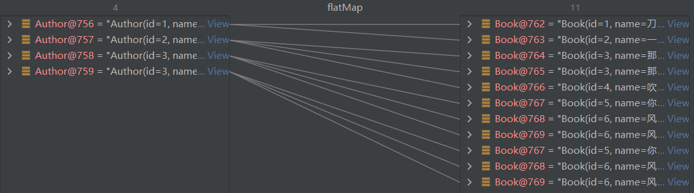
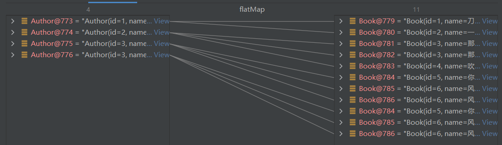
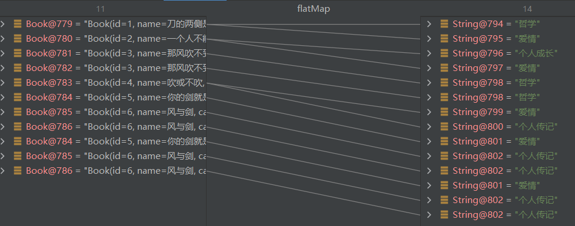
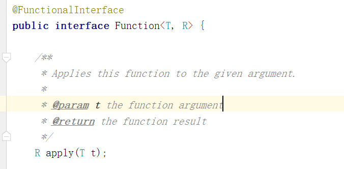
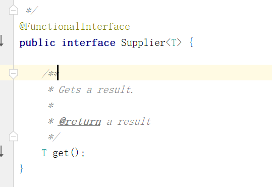

# 函数式编程-Stream流

---

## 1. 概述

### 1.1 为什么学？

- 能够看懂公司里的代码

- **大数据量**下处理集合效率高

  > **并行流**

- 代码**可读性**高

- 消灭**嵌套地狱**

~~~~java
//查询未成年作家的评分在70以上的书籍 由于洋流影响所以作家和书籍可能出现重复，需要进行去重
List<Book> bookList = new ArrayList<>();
Set<Book> uniqueBookValues = new HashSet<>();
Set<Author> uniqueAuthorValues = new HashSet<>();
for (Author author : authors) {
    if (uniqueAuthorValues.add(author)) {
        if (author.getAge() < 18) {
            List<Book> books = author.getBooks();
            for (Book book : books) {
                if (book.getScore() > 70) {
                    if (uniqueBookValues.add(book)) {
                        bookList.add(book);
                    }
                }
            }
        }
    }
}
System.out.println(bookList);
~~~~

~~~~java
List<Book> collect = authors.stream()
    .distinct()
    .filter(author -> author.getAge() < 18)
    .map(author -> author.getBooks())
    .flatMap(Collection::stream)
    .filter(book -> book.getScore() > 70)
    .distinct()
    .collect(Collectors.toList());
System.out.println(collect);
~~~~

### 1.2 函数式编程思想

#### 1.2.1 概念

- 面向对象思想需要关注<u>用什么对象完成什么事情</u>。
- 而函数式编程思想就类似于我们数学中的函数。它主要关注的是<u>**对数据进行了什么操作**</u>。

#### 1.2.2 优点

* 代码简洁，开发快速
* 接近自然语言，易于理解
* 易于【**<u>并发编程</u>**】

---

## 2. Lambda表达式

### 2.1 概述

- *Lambda*是JDK8中一个**语法糖**。

- 他可以对某些**匿名内部类**的写法进行简化。

  > 所以Lambda表达式也可以说成是创建对象的一种方式，它本质上和new运算符相同 

- 它是**函数式编程思想**的一个重要体现。

  > 让我们**不用关注是什么对象**。而是更关注我们==对数据进行了什么操作==。

### 2.2 核心原则

- 可推导则可省略

### 2. 3 基本格式

~~~~java
(参数列表)->{代码}
~~~~

#### 例一

我们在创建线程并启动时可以使用**匿名内部类**的写法：

~~~~java
new Thread(new Runnable() {
    @Override
    public void run() {
        System.out.println("你知道吗 我比你想象的 更想在你身边");
    }
}).start();
~~~~

可以使用Lambda的格式对其进行修改。修改后如下：

~~~~java
new Thread(()->{
    System.out.println("你知道吗 我比你想象的 更想在你身边");
}).start();
~~~~

#### 例二

现有方法定义如下，其中IntBinaryOperator是一个接口。先使用匿名内部类的写法调用该方法。

~~~~java
public static int calculateNum(IntBinaryOperator operator){
    int a = 10;
    int b = 20;
    return operator.applyAsInt(a, b);
}

public static void main(String[] args) {
    int i = calculateNum(new IntBinaryOperator() {
        @Override
        public int applyAsInt(int left, int right) {
            return left + right;
        }
    });
    System.out.println(i);
}
~~~~

Lambda写法：

~~~~java
    public static void main(String[] args) {
        int i = calculateNum((int left, int right)->{
            return left + right;
        });
        System.out.println(i);
    }
~~~~

#### 例三

现有方法定义如下，其中IntPredicate是一个接口。先使用匿名内部类的写法调用该方法。

~~~~java
public static void printNum(IntPredicate predicate){
    int[] arr = {1,2,3,4,5,6,7,8,9,10};
    for (int i : arr) {
        if(predicate.test(i)){
            System.out.println(i);
        }
    }
}
public static void main(String[] args) {
    printNum(new IntPredicate() {
        @Override
        public boolean test(int value) {
            return value%2==0;
        }
    });
}
~~~~

Lambda写法：

~~~~java
public static void main(String[] args) {
    printNum((int value)-> {
        return value%2==0;
    });
}
public static void printNum(IntPredicate predicate){
    int[] arr = {1,2,3,4,5,6,7,8,9,10};
    for (int i : arr) {
        if(predicate.test(i)){
            System.out.println(i);
        }
    }
}
~~~~

#### 例四：

现有方法定义如下，其中Function是一个接口。先使用匿名内部类的写法调用该方法。

~~~~java
public static <R> R typeConver(Function<String,R> function){
    String str = "1235";
    R result = function.apply(str);
    return result;
}
public static void main(String[] args) {
    Integer result = typeConver(new Function<String, Integer>() {
        @Override
        public Integer apply(String s) {
            return Integer.valueOf(s);
        }
    });
    System.out.println(result);
}
~~~~

Lambda写法：

~~~~java
Integer result = typeConver((String s)->{
    return Integer.valueOf(s);
});
System.out.println(result);
~~~~

#### 例五：

现有方法定义如下，其中IntConsumer是一个接口。先使用匿名内部类的写法调用该方法。

~~~~java
public static void foreachArr(IntConsumer consumer){
    int[] arr = {1,2,3,4,5,6,7,8,9,10};
    for (int i : arr) {
        consumer.accept(i);
    }
}
public static void main(String[] args) {
    foreachArr(new IntConsumer() {
        @Override
        public void accept(int value) {
            System.out.println(value);
        }
    });
}
~~~~

Lambda写法：

~~~~java
public static void main(String[] args) {
    foreachArr((int value)->{
        System.out.println(value);
    });
}
~~~~

### 2.4 省略规则

* **参数类型**可以省略
* <u>方法体只有一句代码</u>时**大括号**、***return***、唯一一句代码的**分号**可以省略
* <u>方法只有一个参数</u>时**小括号**可以省略

---

## 3. Stream流

### 3.1 概述

- Java8的***Stream***使用的是==函数式编程模式==

- 如同它的名字一样，它可以被用来对集合或数组进行<u>链状流式的操作</u>

  > 可以更方便的让我们对**集合**或**数组**操作。

### 3.2 案例数据准备

~~~~xml
<dependencies>
    <dependency>
        <groupId>org.projectlombok</groupId>
        <artifactId>lombok</artifactId>
        <version>1.18.16</version>
    </dependency>
</dependencies>
~~~~

~~~~java
@Data
@NoArgsConstructor
@AllArgsConstructor
@EqualsAndHashCode//用于后期的去重使用
public class Author {
    //id
    private Long id;
    //姓名
    private String name;
    //年龄
    private Integer age;
    //简介
    private String intro;
    //作品
    private List<Book> books;
}
~~~~

~~~~java
@Data
@AllArgsConstructor
@NoArgsConstructor
@EqualsAndHashCode//用于后期的去重使用
public class Book {
    //id
    private Long id;
    //书名
    private String name;

    //分类
    private String category;

    //评分
    private Integer score;

    //简介
    private String intro;

}
~~~~

~~~~java
private static List<Author> getAuthors() {
    //数据初始化
    Author author = new Author(1L,"蒙多",33,"一个从菜刀中明悟哲理的祖安人",null);
    Author author2 = new Author(2L,"亚拉索",15,"狂风也追逐不上他的思考速度",null);
    Author author3 = new Author(3L,"易",14,"是这个世界在限制他的思维",null);
    Author author4 = new Author(3L,"易",14,"是这个世界在限制他的思维",null);

    //书籍列表
    List<Book> books1 = new ArrayList<>();
    List<Book> books2 = new ArrayList<>();
    List<Book> books3 = new ArrayList<>();

    books1.add(new Book(1L,"刀的两侧是光明与黑暗","哲学,爱情",88,"用一把刀划分了爱恨"));
    books1.add(new Book(2L,"一个人不能死在同一把刀下","个人成长,爱情",99,"讲述如何从失败中明悟真理"));

    books2.add(new Book(3L,"那风吹不到的地方","哲学",85,"带你用思维去领略世界的尽头"));
    books2.add(new Book(3L,"那风吹不到的地方","哲学",85,"带你用思维去领略世界的尽头"));
    books2.add(new Book(4L,"吹或不吹","爱情,个人传记",56,"一个哲学家的恋爱观注定很难把他所在的时代理解"));

    books3.add(new Book(5L,"你的剑就是我的剑","爱情",56,"无法想象一个武者能对他的伴侣这么的宽容"));
    books3.add(new Book(6L,"风与剑","个人传记",100,"两个哲学家灵魂和肉体的碰撞会激起怎么样的火花呢？"));
    books3.add(new Book(6L,"风与剑","个人传记",100,"两个哲学家灵魂和肉体的碰撞会激起怎么样的火花呢？"));

    author.setBooks(books1);
    author2.setBooks(books2);
    author3.setBooks(books3);
    author4.setBooks(books3);

    List<Author> authorList = new ArrayList<>(Arrays.asList(author,author2,author3,author4));
    return authorList;
}
~~~~

### 3.3 快速入门

#### 3.3.1 需求

- 我们可以调用getAuthors方法获取到作家的集合。现在需要打印所有年龄小于18的作家的名字，并且要注意去重。

#### 3.3.2 实现

~~~~java
//打印所有年龄小于18的作家的名字，并且要注意去重
List<Author> authors = getAuthors();
authors.
    stream()//把集合转换成流
    .distinct()//先去除重复的作家
    .filter(author -> author.getAge()<18)//筛选年龄小于18的
    .forEach(author -> System.out.println(author.getName()));//遍历打印名字
~~~~

### 3.4 常用操作

#### 3.4.1 创建流

> `java.util.Stream`是`JDK8`提供的接口，有很多方法；
>
> 流中元素的类型就是`Stream<T>`

**单列集合**： <u>`集合对象.stream()`</u>

~~~~java
List<Author> authors = getAuthors();
Stream<Author> stream = authors.stream();
~~~~

> 注意，如果用`Stream.of`，会把整个集合当作泛型

**数组**：<u>`Arrays.stream(数组) `</u>

~~~~JAVA
Integer[] arr = {1,2,3,4,5};
Stream<Integer> stream = Arrays.stream(arr);
Stream<Integer> stream2 = Stream.of(arr);
~~~~

>注意，如果用`Stream.of`，会把整个数组当作泛型

**双列集合**：<u>转换成单列集合</u>后再创建

~~~~java
Map<String,Integer> map = new HashMap<>();
map.put("蜡笔小新",19);
map.put("黑子",17);
map.put("日向翔阳",16);
Stream<Map.Entry<String, Integer>> stream = map.entrySet().stream();
~~~~

#### 3.4.2 中间操作

> 中间操作能执行的前提是：要有**<u>终结</u>操作**的调用

##### $\Rarr$ filter

- 可以对**流中的元素**进行条件==过滤==，符合过滤条件的才能继续留在流中。

  > 方法**泛型**由流中的元素确定；
  >
  > 符合过滤条件：返回`true`

> 与之对应的是<u>`Predicate<T>`接口</u>
>
> ```java
> boolean test(T t);
> ```

例如：打印所有姓名长度大于1的作家的姓名

~~~~java
List<Author> authors = getAuthors();
authors.stream()
    .filter(author -> author.getName().length()>1)
    .forEach(author -> System.out.println(author.getName()));
~~~~

##### $\Rarr$ map

- 可以把对<u>流中的元素</u>进行==计算或转换==。

> 与之对应的是<u>`Function<T, R>`接口</u>，泛型`R`代表期望转换成的类型；
>
> ```java
> R apply(T t);
> ```

例如：打印所有作家的姓名

~~~~java
List<Author> authors = getAuthors();
authors
    .stream()
    .map(author -> author.getName())
    .forEach(name->System.out.println(name));
~~~~

~~~~java
// 打印所有作家的姓名
List<Author> authors = getAuthors();

// authors.stream()
//         .map(author -> author.getName())
//         .forEach(s -> System.out.println(s));

authors.stream()
    .map(author -> author.getAge())
    .map(age->age+10)
    .forEach(age-> System.out.println(age));
~~~~

##### $\Rarr$ distinct

- 可以**去除流中的重复元素**。

例如：

​	打印所有作家的姓名，并且要求其中不能有重复元素。

~~~~java
List<Author> authors = getAuthors();
authors.stream()
    .distinct()
    .forEach(author -> System.out.println(author.getName()));
~~~~

> **注意：distinct方法是依赖Object的==equals方法==来判断是否是相同对象的。所以需要注意重写equals方法。**

##### $\Rarr$ sorted

- 可以对流中的元素进行**排序**。

> 与之对应的是`Comparator<T>`接口；

> 注：
>
> Comparator 是比较器
>
> 相当于是从集合的**外部视角**对其进行比较，（第三人称视角）
>
> 接口方法有**两个参数**；
>
> Comparable 是可比较的，
>
> 相当于是从集合的**内部视角**对其进行比较，（第一人称视角）
>
> 接口方法只有**一个参数**

例如：

​	对流中的元素按照年龄进行降序排序，并且要求不能有重复的元素。

~~~~java
List<Author> authors = getAuthors();
// 对流中的元素按照年龄进行降序排序，并且要求不能有重复的元素。
authors.stream()
    .distinct()
    .sorted()
    .forEach(author -> System.out.println(author.getAge()));
~~~~

~~~~java
List<Author> authors = getAuthors();
// 对流中的元素按照年龄进行降序排序，并且要求不能有重复的元素。
authors.stream()
    .distinct()
    .sorted((o1, o2) -> o2.getAge()-o1.getAge())
    .forEach(author -> System.out.println(author.getAge()));
~~~~

> **注意：如果调用空参的sorted()方法，需要流中的元素是<u>实现了Comparable</u>。**

##### $\Rarr$ limit	

- 可以设置流的**<u>最大长度</u>**，超出的部分将被**抛弃**。

例如：

​	对流中的元素按照年龄进行降序排序，并且要求不能有重复的元素,然后打印其中年龄最大的两个作家的姓名。

~~~~java
List<Author> authors = getAuthors();
authors.stream()
    .distinct()
    .sorted()
    .limit(2)
    .forEach(author -> System.out.println(author.getName()));
~~~~

##### $\Rarr$ skip

- **跳过**流中的前n个元素，返回剩下的元素

例如：

​	打印除了年龄最大的作家外的其他作家，要求不能有重复元素，并且按照年龄降序排序。

~~~~java
// 打印除了年龄最大的作家外的其他作家，要求不能有重复元素，并且按照年龄降序排序。
List<Author> authors = getAuthors();
authors.stream()
    .distinct()
    .sorted()
    .skip(1)
    .forEach(author -> System.out.println(author.getName()));
~~~~

##### $\Rarr$ flatMap

> map只能把**一个对象**转换成**<u>另一个</u>对象**来作为流中的元素。

- flatMap可以把**一个对象**转换成**<u>多个</u>对象**作为流中的元素。

  > 相当于把流元素又变成一个流了，然后这个流的流元素**地位上升**，成为原来流的元素，
  >
  > 就是**展开了一个流**（**一对多**的关系）
  >
  > （如果只使用`map`，二级流元素无法上升，还是作为一个整体，没有被展开）

> 与之相关的接口是：
>
> ```java
> <R> Stream<R> flatMap(Function<? super T, ? extends Stream<? extends R>> mapper);
> ```
>
> ```java
> public interface Function<T, R> {
>     R apply(T t);
> }
> ```

例一：

​	打印所有书籍的名字。要求对重复的元素进行去重。

~~~~java
// 打印所有书籍的名字。要求对重复的元素进行去重。
List<Author> authors = getAuthors();

authors.stream()
    .flatMap(author -> author.getBooks().stream())
    .distinct()
    .forEach(book -> System.out.println(book.getName()));
~~~~

> 

例二：

​	打印现有数据的所有分类。要求对分类进行去重。不能出现这种格式：哲学,爱情

~~~~java
// 打印现有数据的所有分类。要求对分类进行去重。不能出现这种格式：哲学,爱情     爱情
List<Author> authors = getAuthors();
authors.stream()
    .flatMap(author -> author.getBooks().stream())
    .distinct()
    .flatMap(book -> Arrays.stream(book.getCategory().split(",")))
    .distinct()
    .forEach(category-> System.out.println(category));
~~~~

> 
>
> 

#### 3.4.3 终结操作

##### $\Rarr$ forEach

- 对流中的元素进行**遍历操作**，
  我们通过传入的参数去指定对遍历到的元素**进行什么具体操作**。

> 对应的接口是`Consumer<T>`，接口抽象方法为`void accept(T t)`

> 这个终结操作无返回值

例子：

​	输出所有作家的名字

~~~~java
// 输出所有作家的名字
List<Author> authors = getAuthors();
authors.stream()
    .map(author -> author.getName())
    .distinct()
    .forEach(name-> System.out.println(name));
~~~~

##### $\Rarr$ count

- 可以用来获取当前**流中元素的个数**。

> 这个终结操作的返回值类型是`Long`

例子：

​	打印这些作家的所出书籍的数目，注意删除重复元素。

~~~~java
// 打印这些作家的所出书籍的数目，注意删除重复元素。
List<Author> authors = getAuthors();
long count = authors.stream()
    .flatMap(author -> author.getBooks().stream())
    .distinct()
    .count();
System.out.println(count);
~~~~

##### $\Rarr$ max&min

- 可以用来或者流中的**最值**。

> 对应的接口是：`Comparator<? super T>`；
>
> 实际上最好直接返回“`o1 - o2`”，不然逻辑上很可能有矛盾

> 这个终结操作的返回值类型是`Optional<T>`，后面会讲；
>
> 所以`max`/`min`之后不能继续链状流式编程了

例子：

​	分别获取这些作家的所出书籍的最高分和最低分并打印。

~~~~java
// 分别获取这些作家的所出书籍的最高分和最低分并打印。
// Stream<Author>  -> Stream<Book> ->Stream<Integer>  ->求值
List<Author> authors = getAuthors();
Optional<Integer> max = authors.stream()
    .flatMap(author -> author.getBooks().stream())
    .map(book -> book.getScore())
    .max((score1, score2) -> score1 - score2);

Optional<Integer> min = authors.stream()
    .flatMap(author -> author.getBooks().stream())
    .map(book -> book.getScore())
    .min((score1, score2) -> score1 - score2);
System.out.println(max.get());
System.out.println(min.get());
~~~~

##### $\Rarr$ collect

- 把当前流转换成一个**集合**。

> 对应的接口是`Collector<? super T, A, R>`；
>
> 但我们一般直接传入<u>`Collectors`工具类的静态方法</u>的返回值，
>
> 例如`Collectors.toList()`、`Collectors.toSet()`、
>
> ```java
> public static <T, K, U>
>     Collector<T, ?, Map<K,U>> toMap(
>     Function<? super T, ? extends K> keyMapper,                           
>     Function<? super T, ? extends U> valueMapper) {...}
> ```
>
> > 和`map`操作用到的接口相同

例子：

​	获取一个存放所有作者名字的List集合。

~~~~java
// 获取一个存放所有作者名字的List集合。
List<Author> authors = getAuthors();
List<String> nameList = authors.stream()
    .map(author -> author.getName())
    .collect(Collectors.toList());
System.out.println(nameList);
~~~~

​	获取一个所有书名的Set集合。

~~~~java
// 获取一个所有书名的Set集合。
List<Author> authors = getAuthors();
Set<Book> books = authors.stream()
    .flatMap(author -> author.getBooks().stream())
    .collect(Collectors.toSet());
System.out.println(books);
~~~~

​	获取一个Map集合，map的key为作者名，value为`List<Book>`

~~~~java
// 获取一个Map集合，map的key为作者名，value为List<Book>
List<Author> authors = getAuthors();
Map<String, List<Book>> map = authors.stream()
    .distinct()
    .collect(Collectors.toMap(author -> author.getName(), author -> author.getBooks()));
System.out.println(map);
~~~~

##### $\Rarr$ 查找

>对应的接口是`Predicate<? super T>`，与`filter`相同

###### $\rarr$ anyMatch

- 可以用来判断是否有任意**符合匹配条件**的元素，结果为boolean类型。

  > 有任意一个符合的就会返回`true`

例子：

​	判断是否有年龄在29以上的作家

~~~~java
// 判断是否有年龄在29以上的作家
List<Author> authors = getAuthors();
boolean flag = authors.stream()
    .anyMatch(author -> author.getAge() > 29);
System.out.println(flag);
~~~~

###### $\rarr$ allMatch

- 可以用来判断是否**都符合匹配条件**，结果为boolean类型。

  > 如果都符合结果为true，否则结果为false。

例子：

​	判断是否所有的作家都是成年人

~~~~java
// 判断是否所有的作家都是成年人
List<Author> authors = getAuthors();
boolean flag = authors.stream()
    .allMatch(author -> author.getAge() >= 18);
System.out.println(flag);
~~~~

###### $\rarr$ noneMatch

- 可以判断流中的元素是否**都不符合匹配条件**。

  > 如果都不符合结果为true，否则结果为false

例子：

​	判断作家是否都没有超过100岁的。

~~~~java
// 判断作家是否都没有超过100岁的。
List<Author> authors = getAuthors();
boolean b = authors.stream()
    .noneMatch(author -> author.getAge() > 100);
System.out.println(b);
~~~~

##### $\Rarr$ 匹配

> 方法返回值类型是`Optional<T>`

###### $\rarr$ findAny

- 获取流中的**任意一个元素**。

  > 该方法没有办法保证获取的一定是流中的第一个元素。（比较鸡肋的一个方法）

例子：

​	获取任意一个年龄大于18的作家，如果存在就输出他的名字

~~~~java
// 获取任意一个年龄大于18的作家，如果存在就输出他的名字
List<Author> authors = getAuthors();
Optional<Author> optionalAuthor = authors.stream()
    .filter(author -> author.getAge()>18)
    .findAny();
optionalAuthor.ifPresent(author -> System.out.println(author.getName()));
~~~~

> `ifPresent`：如果optional中有数据，就进行消费，没有就不消费

###### $\rarr$ findFirst

- 获取流中的**<u>第一个元素</u>**。

例子：

​	获取一个年龄最小的作家，并输出他的姓名。

~~~~java
//        获取一个年龄最小的作家，并输出他的姓名。
        List<Author> authors = getAuthors();
        Optional<Author> first = authors.stream()
                .sorted((o1, o2) -> o1.getAge() - o2.getAge())
                .findFirst();

        first.ifPresent(author -> System.out.println(author.getName()));
~~~~

##### $\Rarr$ reduce归并

> 其实有一个==迭代==的思想，只不过每次迭代中其他变量（流元素）会发生变化

- 对流中的数据按照你**指定的计算方式**计算出**一个结果**。（**==缩减==**操作）

  > 其实是缩减成只剩一个值了；
  >
  > 经常与`map`结合，称为`map reduce 模式`

- *reduce*的作用是把*stream*中的元素给组合起来，我们可以传入一个**初始值**，它会按照我们的计算方式依次拿**流中的元素**和**初始化值**进行计算，**<u>计算结果</u>**再和后面的元素计算。

> *reduce*两个参数的重载形式内部的计算方式如下：
>
> ```java
> T result = identity;// 初始值
> for (T element : this stream) //迭代
> 	result = accumulator.apply(result, element)
> return result;
> ```
>
> ```java
> // 源代码方法定义：
> T reduce(T identity, BinaryOperator<T> accumulator);
> ```
>
> > 所以返回值类型其实是由`identity`类型决定的，流中的元素只不过是参与一次运算
>
> ```java
> // 接口源代码：
> @FunctionalInterface
> public interface BinaryOperator<T> extends BiFunction<T,T,T> {...}
> @FunctionalInterface
> public interface BiFunction<T, U, R> {
>     R apply(T t, U u);
>     ...
> }
> ```
>
> > 在这里，`apply`方法的第一个参数代表**<u>初始值/上一次的计算结果</u>**
> > 第二个参数代表本次遍历到的**<u>流元素</u>**
>
> 其中***identity***就是我们可以通过方法参数传入的**初始值**，*accumulator*的***apply*具体进行什么计算**也是我们通过方法参数来确定的。
>

例子：

​	使用*reduce*求所有作者年龄的和

~~~~java
// 使用reduce求所有作者年龄的和
List<Author> authors = getAuthors();
Integer sum = authors.stream()
    .distinct()
    .map(author -> author.getAge())
    .reduce(0, (result, element) -> result + element);
System.out.println(sum);
~~~~

​	使用*reduce*求所有作者中年龄的最大值

~~~~java
// 使用reduce求所有作者中年龄的最大值
List<Author> authors = getAuthors();
Integer max = authors.stream()
    .map(author -> author.getAge())
    .reduce(Integer.MIN_VALUE, (result, element) -> result < element ? element : result);

System.out.println(max);
~~~~

​	使用*reduce*求所有作者中年龄的最小值

~~~~java
// 使用reduce求所有作者中年龄的最小值
List<Author> authors = getAuthors();
Integer min = authors.stream()
    .map(author -> author.getAge())
    .reduce(Integer.MAX_VALUE, (result, element) -> result > element ? element : result);
System.out.println(min);
~~~~

>其实`min`与`max`底层调用了`reduce`

- $\Rarr$ ***reduce*一个参数**的重载形式内部的计算

  > 内部原理模拟：
  >
  > ```java
  > boolean foundAny = false; //是否已经从流中拿到了一个元素
  > T result = null;
  > for (T element : this stream) {
  >     if (!foundAny) {
  >         foundAny = true;
  >         result = element;
  >     }
  >     else result = accumulator.apply(result, element);
  > }
  > // 有拿到过元素才返回result，不然是empty
  > return foundAny? Optional.of(result): Optional.empty();
  > ```
  >
  > 其实就是<u>将**第一个流元素**作为**初始化值**</u>，相当于双参的`reduce`第一个参数不用传了
  >
  > 但是，它的<u>返回值类型变成了`Optional`</u>，而不再是初始化值指定的类型

如果用一个参数的重载方法去求最小值代码如下：

~~~~java
// 使用reduce求所有作者中年龄的最小值
List<Author> authors = getAuthors();
Optional<Integer> minOptional = authors.stream()
    .map(author -> author.getAge())
    .reduce((result, element) -> result > element ? element : result);
minOptional.ifPresent(age-> System.out.println(age));
~~~~

### 3.5 注意事项

- <u>惰性求值</u>

  > 如果没有**终结操作**，没有中间操作是不会得到**执行**的

- 流是**一次性**的

  > 一旦一个流对象经过**一个终结操作**后。这个流就不能再被使用

- 不会影响**原数据**

  > 我们在流中可以多数据做很多处理。但是正常情况下是不会影响原来集合中的元素的。这往往也是我们期望的

## 4. Optional

### 4.1 概述

> 我们在编写代码的时候出现最多的就是**空指针异常**。
>
> 所以在很多情况下我们需要做各种**非空的判断**。
>
> 例如：
>
> ```java
> Author author = getAuthor();
> if(author!=null){
>     System.out.println(author.getName());
> }
> ```
>
> 尤其是对象中的属性还是一个对象的情况下。这种判断会更多。	
>
> 而过多的判断语句会让我们的代码显得臃肿不堪。

- 在*JDK8*中引入了*Optional*

  > 养成使用*Optional*的习惯后你可以写出更优雅的代码来避免空指针异常。

- 并且在很多函数式编程相关的API中也都用到了*Optional*

  > 如果不会使用*Optional*也会对函数式编程的学习造成影响。

### 4.2 使用

#### 4.2.1 创建对象

- *Optional*就好像是**==包装==类**，可以把我们的具体数据封装*Optional*对象内部
- 然后我们去使用*Optional*中封装好的方法操作封装进去的数据，
  就可以非常优雅的避免**空指针异常**。

> 我们一般使用`Optional`的<u>**静态方法**`ofNullable`</u>来把数据封装成一个`Optional`对象。无论传入的参数是否为null都不会出现问题。

~~~~java
Author author = getAuthor();
Optional<Author> authorOptional = Optional.ofNullable(author);
~~~~

> 你可能会觉得还要加一行代码来封装数据比较麻烦。但是如果<u>改造下`getAuthor`方法</u>，让其的返回值就是封装好的`Optional`的话，我们在使用时就会方便很多。

> 而且在实际开发中我们的数据很多是从**数据库**获取的。
>
> *Mybatis*从3.5版本可以也已经支持*Optional*了。
>
> 我们可以直接把*dao*方法的返回值类型定义成*Optional*类型，
>
> *MyBastis*会自己把数据封装成*Optional*对象返回。
>
> 封装的过程也不需要我们自己操作。

- 如果你**确定一个对象不是空**的,

  则可以使用*Optional*的<u>静态方法`of`</u>来把数据封装成*Optional*对象。

~~~~java
Author author = new Author();
Optional<Author> authorOptional = Optional.of(author);
~~~~

> `ofNullable`底层也是调用了`of`方法
>
> ```java
> public static <T> Optional<T> ofNullable(T value) {
>     return value == null ? empty() : of(value);
> }
> ```

> 但是一定要注意，如果使用of的时候传入的参数必须不为null。
>
> （尝试下传入null会出现什么结果：`NullPointerException`）

- 如果一个方法的返回值类型是*Optional*类型。而如果我们经判断发现某次计算得到的返回值为*null*，这个时候就需要<u>把*null*封装成*Optional*对象</u>返回。
  这时则可以使用*Optional*的<u>静态方法`empty`</u>来进行封装。

~~~~java
Optional.empty()
~~~~

> 所以最后你觉得哪种方式会更方便呢？当然是`Optional.ofNullable`

#### 4.2.2 安全消费值

- 我们获取到一个*Optional*对象后肯定需要对其中的数据进行使用。
  这时候我们可以使用其<u>`ifPresent`方法</u>来**消费**其中的值。

> 这个方法会判断其内封装的数据是否为空，不为空时才会执行具体的消费代码。
>
> 这样使用起来就更加安全了。

> 方法定义：
>
> ```java
> public void ifPresent(Consumer<? super T> consumer) {
>     if (value != null)
>         consumer.accept(value);
> }
> ```
>
> ```java
> @FunctionalInterface
> public interface Consumer<T> {
>     void accept(T t);
>     ...
> }
> ```

例如,以下写法就优雅的避免了空指针异常。

~~~~java
Optional<Author> authorOptional = Optional.ofNullable(getAuthor());
authorOptional.ifPresent(author -> System.out.println(author.getName()));
~~~~

#### 4.2.3 获取值

- 如果我们想获取值自己进行处理可以使用get方法获取，但是不推荐。

  > 因为当*Optional*内部的**数据为空**的时候会出现**异常**。

> 注意，`Optional`有很多其他相关类型，比如`OptionalInt`，但它们之间没有直接继承关系
>
> > 比如`OptionalInt`就没有`get`方法，需要用`getAsInt`

#### 4.2.4 安全获取值

> 如果我们期望安全的获取值。我们不推荐使用`get`方法，
>
> 而是使用*Optional*提供的以下方法。

* `orElseGet`

  - 获取数据并且设置**数据为空时**的<u>默认值</u>。
  - 如果数据不为空就能获取到该数据。
  - 如果为空则根据你传入的参数来创建对象作为默认值返回。
  
  ~~~~java
  Optional<Author> authorOptional = Optional.ofNullable(getAuthor());
  Author author1 = authorOptional.orElseGet(() -> new Author());
  ~~~~
  
  > 源代码：
  >
  > ```java
  > public T orElseGet(Supplier<? extends T> other) {
  >     return value != null ? value : other.get();
  > }
  > ```
  >
  > ```java
  > @FunctionalInterface
  > public interface Supplier<T> {
  >     T get();
  > }
  > ```

* `orElseThrow`

  - 获取数据，如果数据不为空就能获取到该数据。
  - 如果为空则根据你传入的参数来**创建异常并抛出**。
  
  ~~~~java
  Optional<Author> authorOptional = Optional.ofNullable(getAuthor());
  try {
      Author author = authorOptional.orElseThrow((Supplier<Throwable>) () -> new RuntimeException("author为空"));
      System.out.println(author.getName());
  } catch (Throwable throwable) {
      throwable.printStackTrace();
  }
  ~~~~
  
  > 源代码：
  >
  > ```java
  > public <X extends Throwable> T orElseThrow(
  >     Supplier<? extends X> exceptionSupplier) throws X {
  >     if (value != null) {
  >         return value;
  >     } else {
  >         throw exceptionSupplier.get();
  >     }
  > }
  > ```

#### 4.2.5 过滤

- 我们可以使用filter方法对数据进行过滤。

- 如果原本是有数据的，但是不符合判断，也会变成一个无数据的*Optional*对象。

  > “无数据的*Optional*对象”指的就是`Optional.empty()`

~~~~java
Optional<Author> authorOptional = Optional.ofNullable(getAuthor());
authorOptional.filter(author -> author.getAge()>100).ifPresent(author -> System.out.println(author.getName()));
~~~~

> 方法定义源码：
>
> ```java
> public Optional<T> filter(Predicate<? super T> predicate) {
>     Objects.requireNonNull(predicate);
>     if (!isPresent())
>         return this;
>     else
>         return predicate.test(value) ? this : empty();
> }
> ```
>
> 返回值类型还是一个`Optional<T>`，可以链式调用

#### 4.2.6 判断

- 我们可以使用`isPresent`方法进行是否存在数据的判断。

  - 如果为空返回值为`false`,
  - 如果不为空返回值为`true`。

  > 但是这种方式并不能体现*Optional*的好处，**更推荐使用`ifPresent`方法**。

~~~~java
Optional<Author> authorOptional = Optional.ofNullable(getAuthor());
if (authorOptional.isPresent()) {
    System.out.println(authorOptional.get().getName());
}
~~~~

#### 4.2.7 数据转换

- *Optional*还提供了`map`可以让我们的**对数据进行转换**，

- 并且转换得到的数据也还是被*Optional*包装好的，保证了我们的使用安全。

  > 可以链式调用

例如我们想获取作家的书籍集合：

~~~~java
private static void testMap() {
    Optional<Author> authorOptional = getAuthorOptional();
    Optional<List<Book>> optionalBooks = authorOptional.map(author -> author.getBooks());
    optionalBooks.ifPresent(books -> System.out.println(books));
}
~~~~

> 总结：
>
> - `ofNullable`创建
> - `ifPresent`消费
> - `orElseGet`获取
> - `filter`过滤
> - `map`转换

## 5. 函数式接口

### 5.1 概述

- **只有一个抽象方法**的接口我们称之为函数接口。

> JDK的函数式接口都加上了`@FunctionalInterface`注解进行标识。
>
> 但是无论是否加上该注解只要接口中只有一个抽象方法，都是函数式接口。
>
> > 类似`@Override`的作用

### 5.2 常见函数式接口	

- `Consumer<T>`==消费==接口

  - 根据其中抽象方法的参数列表和返回值类型知道，
    我们可以在方法中<u>对传入的参数进行消费</u>。

  

- `Function<T,R>`==计算/转换==接口

  - 根据其中抽象方法的参数列表和返回值类型知道，
    我们可以在方法中<u>对传入的参数计算或转换</u>，把结果返回

  

- `Predicate`==判断==接口

  - 根据其中抽象方法的参数列表和返回值类型知道，
    我们可以在方法中<u>对传入的参数条件判断</u>，返回判断结果

  

- `Supplier`==生产==型接口

  - 根据其中抽象方法的参数列表和返回值类型知道，
    我们可以<u>在方法中创建对象</u>，把创建好的对象返回



### 5.3 常用的默认方法

> 以下*3*个都是<u>`Predicate`接口的`default`方法</u>，所以需要`Predicate`实现类去调用；
>
> 所以，如果要结合`Lambda`表达式去写，就需要把表达式整个强转成`Predicate<T>`
>
> ```java
> authors.stream()
>     .filter(   ( (Predicate<Author>) author -> author.getAge() > 17 )
>             .and(author -> author.getAge() < 100)   )
>     .forEach(System.out::println);
> ```
>
> 一般是用于自定义函数式编程相关方法

- `and`


> 我们在使用`Predicate`接口时候可能需要进行<u>判断条件的拼接</u>。
>
> 而`and`方法相当于是使用`&&`来拼接两个判断条件，相当于**短路与**

例如：

打印作家中年龄大于17并且姓名的长度大于1的作家。

~~~~java
List<Author> authors = getAuthors();
Stream<Author> authorStream = authors.stream();
authorStream.filter(new Predicate<Author>() {
    @Override
    public boolean test(Author author) {
        return author.getAge()>17;
    }
}.and(new Predicate<Author>() {
    @Override
    public boolean test(Author author) {
        return author.getName().length()>1;
    }
})).forEach(author -> System.out.println(author));
~~~~

- `or`


> 我们在使用`Predicate`接口时候可能需要进行<u>判断条件的拼接</u>。
>
> 而`or`方法相当于是使用||`来`拼接两个判断条件，相当于短路或

例如：

打印作家中年龄大于17或者姓名的长度小于2的作家。

~~~~java
// 打印作家中年龄大于17或者姓名的长度小于2的作家。
List<Author> authors = getAuthors();
authors.stream()
    .filter(new Predicate<Author>() {
        @Override
        public boolean test(Author author) {
            return author.getAge()>17;
        }
    }.or(new Predicate<Author>() {
        @Override
        public boolean test(Author author) {
            return author.getName().length()<2;
        }
    })).forEach(author -> System.out.println(author.getName()));
~~~~

- `negate`

> `Predicate`接口中的方法。
>
> `negate`方法相当于是在判断添加前面加了个`!`，表示取反

例如：

打印作家中年龄不大于17的作家。

~~~~java
// 打印作家中年龄不大于17的作家。
List<Author> authors = getAuthors();
authors.stream()
    .filter(new Predicate<Author>() {
        @Override
        public boolean test(Author author) {
            return author.getAge()>17;
        }
    }.negate()).forEach(author -> System.out.println(author.getAge()));
~~~~

## 6. 方法引用

> 我们在使用*lambda*时，
>
> 如果方法体中**<u>只有一个方法的调用</u>**的话（包括**构造方法**），
>
> 我们可以用方法引用进一步简化代码。

### 6.1 推荐用法

- 我们在使用lambda时不需要考虑什么时候用方法引用，用哪种方法引用，方法引用的格式是什么。我们只需要在写完*lambda*后，发现方法体只有一行代码，并且是方法的调用时，使用快捷键尝试是否能够转换成方法引用即可。

- 当我们方法引用使用的多了慢慢的也可以直接写出方法引用。

### 6.2 基本格式

```java
类名或者对象名::方法名
```

### 6.3 语法详解(了解)

#### 6.3.1 引用类的静态方法

##### 格式

~~~~java
类名::方法名
~~~~

##### 使用前提

- 如果我们在重写方法的时候，方法体中**只有一行代码**，
- 并且这行代码是**调用了某个类的静态方法**，
- 并且我们把要重写的**抽象方法中所有的参数都<u>按照顺序传入</u>了这个静态方法中**，
- 这个时候我们就可以引用类的静态方法。

例如：

如下代码就可以用方法引用进行简化

~~~~java
List<Author> authors = getAuthors();
Stream<Author> authorStream = authors.stream();
authorStream.map(author -> author.getAge())
    .map(age->String.valueOf(age));
~~~~

注意，如果我们所重写的方法是**没有参数**的，
调用的方法也是没有参数的也相当于符合以上规则。

优化后如下：

~~~~java
List<Author> authors = getAuthors();
Stream<Author> authorStream = authors.stream();
authorStream.map(author -> author.getAge())
    .map(String::valueOf);
~~~~

#### 6.3.2 引用对象的实例方法

##### 格式

~~~~java
对象名::方法名
~~~~

##### 使用前提

- 如果我们在重写方法的时候，方法体中**只有一行代码**，

- 并且这行代码是**调用了<u>某个对象</u>的成员方法**，

  > 这个对象是在外部提前创建好的

- 并且我们把要重写的**抽象方法中所有的参数都<u>按照顺序</u>传入了这个成员方法中**，

- 这个时候我们就可以引用对象的实例方法

例如：

~~~~java
List<Author> authors = getAuthors();
Stream<Author> authorStream = authors.stream();
StringBuilder sb = new StringBuilder();
authorStream.map(author -> author.getName())
    .forEach(name->sb.append(name));
~~~~

优化后：

~~~~java
List<Author> authors = getAuthors();

Stream<Author> authorStream = authors.stream();
StringBuilder sb = new StringBuilder();
authorStream.map(author -> author.getName())
    .forEach(sb::append);
~~~~

#### 6.3.4 引用类的实例方法

##### 格式

~~~~java
类名::方法名
~~~~

##### 使用前提

- 如果我们在重写方法的时候，方法体中**只有一行代码**，

- 并且这行代码是**调用了<u>第一个参数的成员方法</u>**，

  > 相当于是接口方法的**第一个参数对象在调用实例方法**

- 并且我们把要
  **重写的抽象方法中<u>剩余的所有的参数都按照顺序</u>传入了这个成员方法中**，

- 这个时候我们就可以引用类的实例方法。

例如：

```java
interface UseString{
    String use(String str,int start,int length);
}
public static String subAuthorName(String str, UseString useString){
    int start = 0;
    int length = 1;
    return useString.use(str,start,length);
}
public static void main(String[] args) {
    subAuthorName("三更草堂", new UseString() {
        @Override
        public String use(String str, int start, int length) {
            return str.substring(start,length);
        }
    });

}
```

优化后如下：

~~~~java
public static void main(String[] args) {
    subAuthorName("三更草堂", String::substring);
}
~~~~

#### 6.3.5 构造器引用

> 如果方法体中的一行代码是**构造器**的话就可以使用构造器引用。

##### 格式

~~~~java
类名::new
~~~~

##### 使用前提

- 如果我们在重写方法的时候，方法体中**只有一行代码**，
- 并且这行代码是**调用了某个类的构造方法**，
- 并且我们把**要重写的抽象方法中的所有的参数都按照顺序传入了这个构造方法中**，
- 这个时候我们就可以引用构造器。

例如：

~~~~java
List<Author> authors = getAuthors();
authors.stream()
    .map(author -> author.getName())
    .map(name->new StringBuilder(name))
    .map(sb->sb.append("-三更").toString())
    .forEach(str-> System.out.println(str));
~~~~

优化后：

~~~~java
List<Author> authors = getAuthors();
authors.stream()
    .map(author -> author.getName())
    .map(StringBuilder::new)
    .map(sb->sb.append("-三更").toString())
    .forEach(str-> System.out.println(str));
~~~~

> 注：有的时候需要在方法引用前加上接口类型强转，以确定使用哪个构造器，例如：
>
> ```java
> executorService = new ScheduledThreadPoolExecutor(1, (ThreadFactory) Thread::new);
> ```

## 7. 高级用法

### 基本数据类型优化

- 我们之前用到的很多*Stream*的方法由于都使用了**泛型**。
  所以涉及到的参数和返回值都是引**用数据类型**。

> 即使我们操作的是整数小数，但是实际用的都是他们的包装类。
>
> *JDK5*中引入的自动装箱和自动拆箱，
> 让我们在使用对应的包装类时就好像使用基本数据类型一样方便。
>
> 但是你一定要知道装箱和拆箱肯定是要消耗时间的。
>
> 虽然这个时间消耗很下小，
> 但是在大量的数据不断的重复装箱拆箱的时候，你就不能无视这个**时间损耗**了。

- 所以为了让我们能够对这部分的时间消耗进行优化，
  *Stream*还提供了很多**专门针对基本数据类型的方法**。

  > 例如：`mapToInt,mapToLong,mapToDouble,flatMapToInt,flatMapToDouble`等。

~~~~java
private static void test27() {
    List<Author> authors = getAuthors();
    authors.stream()
        .map(author -> author.getAge())
        .map(age -> age + 10)
        .filter(age->age>18)
        .map(age->age+2)
        .forEach(System.out::println);
    authors.stream()
        .mapToInt(author -> author.getAge())
        .map(age -> age + 10)
        .filter(age->age>18)
        .map(age->age+2)
        .forEach(System.out::println);
}
~~~~

### 并行流

- 当流中有大量元素时，我们可以使用并行流去提高操作的效率。

- 其实并行流就是把任务分配给多个线程去完全。

  > 如果我们自己去用代码实现的话其实会非常的复杂，
  > 并且要求你对并发编程有足够的理解和认识。
  >
  > 如果我们使用Stream的话，
  > 我们只需要修改**<u>一个方法的调用</u>**就可以使用并行流来帮我们实现，从而提高效率。

- `parallel`方法可以把串行流转换成并行流。

~~~~java
private static void test28() {
    Stream<Integer> stream = Stream.of(1, 2, 3, 4, 5, 6, 7, 8, 9, 10);
    Integer sum = stream.parallel()
        .peek(new Consumer<Integer>() {
            @Override
            public void accept(Integer num) {
                System.out.println(num+Thread.currentThread().getName());
            }
        })
        .filter(num -> num > 5)
        .reduce((result, ele) -> result + ele)
        .get();
    System.out.println(sum);
}
~~~~

> 这里的`peek`是*Stream*提供的用于调试的方法，
> 相当于在中间操作中“消费”流元素，但不会影响其他操作

- 也可以通过`parallelStream`直接获取并行流对象。

  > 相当于是替换了`stream`方法

~~~~java
List<Author> authors = getAuthors();
authors.parallelStream()
    .map(author -> author.getAge())
    .map(age -> age + 10)
    .filter(age->age>18)
    .map(age->age+2)
    .forEach(System.out::println);
~~~~


