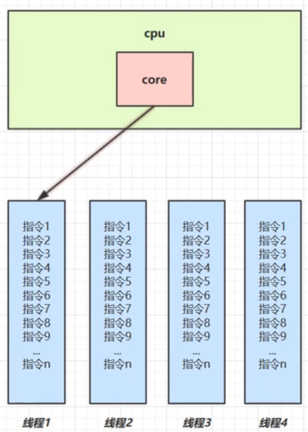
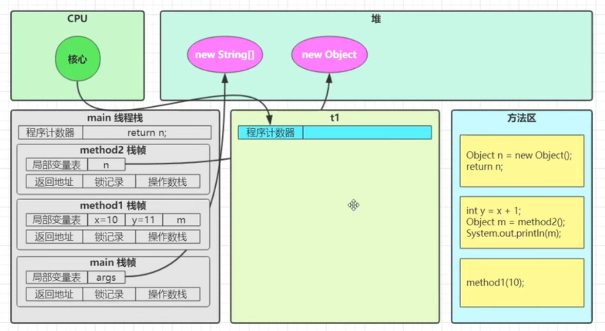
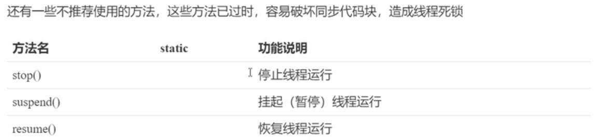
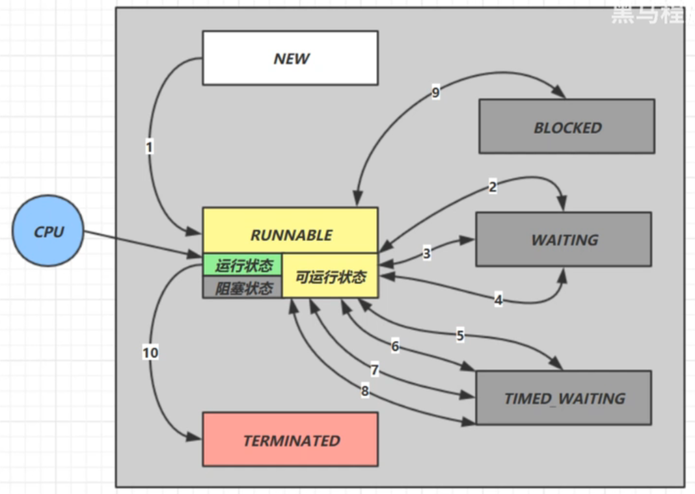
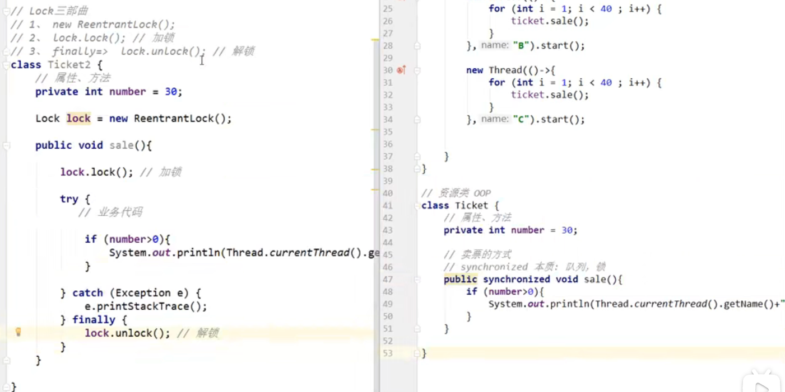

# 并发编程与JUC

---

---

## 1. 进程与线程

---

### 1.1 进程与线程

> 可以通过任务管理器查看进程数和线程数

#### 1.1.1 进程

放到内存中运行的程序

> 操作系统进行资源调度的基本单位

#### 1.1.2 线程

进程中的一个执行单元、执行场景，一个**==指令流==**

> 一个进程中至少有一个线程

> Java中一定有的两个线程：main主线程，GC守护线程

> Java实现线程的三种方式：Thread、Runnable、Callable；
>
> 但Java自己没有资格直接开启线程，只能去调用原生方法

#### 1.1.3 进程与线程对比

进程基本上**相互==独立==**的，而线程存在于进程内，是进程的一个子集；

进程拥有共享的资源，如内存空间等，供**其内部的线程==共享==**；

**进程间==通信==**较为复杂：

- 同一台计算机的进程通信称为 IPC（Inter-process communication）
- 不同计算机之间的进程通信，需要通过网络，并遵守共同的协议，例如 HTTP

线程通信相对简单，因为它们<u>共享进程内的内存</u>，一个例子是多个线程可以访问同一个共享变量；

线程更**==轻量==**，线程上下文**切换**成本一般上要比进程上下文切换低；

----

### 1.2 并发与并行

#### 1.2.1 并发

> 多线程会共享同一资源

同一时刻，多个线程的指令流交替执行，由操作系统的**任务调度器**完成



> 单核CPU本质上都是并发而已；windows最小时间片一般为15ms

> **快速交替的串行**，解决排队执行的低效问题；微观串行，宏观并行；

#### 1.2.2 并行

同一时刻，多线程的**指令流**可以真正同时执行


> 多核CPU才能做到真正的并行；
>
> 当然如果太忙了，多核CPU也需要并发机制的，所以并发与并行常常同时存在

> 查看CPU核的方式：
>
> - 我的电脑$\rarr$管理$\rarr$设备管理器$\rarr$处理器
> - `Runtime.getRuntime().availableProcessors()`

为什么要并发？充分利用CPU的资源，提高效率

> Rob Pike的描述：
>
> - 并发（***concurrent***）是同一时间应对（*dealing with*）多件事情的能力
> - 并行（***parallel***）是同一时间动手做（*doing*）多件事情的能力

-----

### 1.3 线程应用

> 同步与异步：
>
> 以**调用**者角度来讲，如果
>
> - 需要**<u>等待结果返回</u>**，才能继续运行就是**同步**
>
> - **<u>不需要等待结果返回</u>**，就能继续运行就是**异步**
>
>   > 利用**多线程**就可以实现**异步**

#### 1.3.1 并发与并行中的异步调用

多线程可以让方法执行变为异步的

> 即不要巴巴干等着；
>
> 比如说读取磁盘文件时，假设读取操作花费了 5 秒钟，如果没有线程调度机制，这 5 秒 cpu 什么都做不了，其它代码都得暂停...

应用举例：

- 比如在项目中，视频文件需要转换格式等操作比较费时，这时开一个新线程处理视频转换，避免阻塞主线程

- tomcat的<u>异步servlet</u>也是类似的目的，让**用户线程**处理耗时较长的操作，避免阻塞 tomcat 的**工作线程**

  > 提高tomcat**吞吐量**

- ui 程序中，开线程进行其他操作，避免<u>阻塞 ui 线程</u>

#### 1.3.2 并行提高效率

**单核** cpu 下，<u>多线程不能实际提高程序运行效率</u>，只是为了能够在不同的任务之间**切换**，不同线程轮流使用cpu ，不至于一个线程总占用 cpu，别的线程没法干活

**多核** cpu 可以并行跑多个线程，但能否提高程序运行效率还是要分情况的有些任务，经过精心设计，将任务拆分，并行执行，当然可以提高程序的运行效率。但不是所有计算任务都能拆分（参考后文的【阿姆达尔定律】）也不是所有任务都需要拆分，任务的目的如果不同，谈拆分和效率没啥意义

IO 操作不占用 cpu，只是我们一般拷贝文件使用的是【阻塞 IO】，这时相当于线程虽然不用 cpu，但需要一直等待 IO 结束，没能充分利用线程。所以才有后面的【非阻塞 IO】和【异步 IO】优化

----

---

## 2. Java线程

---

### 2.1 线程运行

#### 2.1.1 查看和杀死进程线程

- Windows：

  - 任务管理器，PID找到进程编号
  - 控制台中，tasklist 查看进程，taskkill杀死进程
  - jps 查看Java进程

- Linux：

  - ps 列举正在运行的**进程**的运行信息

    > ps -fe | grep java

  - jps 查看Java进程

  - top 命令，实时查看进程 

    > top -H -p PID，查看PID进程编号下的所有**线程**

  - jstack PID 查看更详细的Java线程信息

- Java

  - jconsole图形化界面，连接一个Java进程

#### 2.1.2 线程运行原理

Java Virtual Machine Stacks（Java虚拟机栈）

JVM中的**栈内存**就是给**线程**用的

每个栈都有<u>多个栈帧frame</u>，对应每次调用的方法，当然同一时刻只能有一个活动着的**栈帧**


#### 2.1.3 线程的上下文切换

Thread Context Switch

发生场景：

- CPU时间片用完
- 需要进行垃圾回收
- 有更高优先级的线程
- 线程自己调用sleep、yield、wait、join、park，或者遇到synchronized、lock

context switch发生时，是由**操作系统**保存当前线程的运行状态；Java中也有对应的程序计数器，记录JVM下一条指令的执行地址

频繁Context Switch会影响性能，要保存的东西也有很多

> 所以线程数也不是越多越好



----

### 2.2 线程API

#### 2.2.1 打断标记 

:star:关于**打断标记**

通过`线程引用.isInterrupted()`方法可以获取**打断标记**，`true`表示被打断，

而调用`线程引用.interrupt()`就会使打断标记变成`true`，

> 所以没有sleep、wait、join的情况下，也可以去打断一个线程，这个线程可以在其内部循环调用`isInterrupted`，当变成`true`的时候就知道有人想打断它，然后可以做一些**善后工作**

> 在有sleep、wait、join时，如果是处于WAITING或TIMED_WAITING状态下被调用`interrupt()`打断，会抛出异常，继续在catch后运行，但是，<u>这个打断标记会在内部被重置为`false`</u>
>
> > 毕竟又重新开始运行了
>
> > 但<u>对于park来说，不会重置为`false`</u>，所以或许需要使用`Thread.interrupted()`方法

>`Thread.interrupted()`可以获取当前线程的打断标记，但获取后<u>一定会重置打断标记为`false`</u>

> **两阶段**终止模式：
>
> 

#### 2.2.2 可读性sleep

TimeUnit.时间单位枚举.sleep(时间数值)

#### 2.2.3 过时方法



#### 2.2.4 join新理解

join其实就是一种**同步**，等待另一个线程的执行，这种同步也可以是**限时**的（*timeout*）

#### 2.2.5 守护线程实例

Tomcat中的Acceptor和Poller线程都是守护线程，Tomcat接收到shutdown后，这两个线程就会强行终止


----

### 2.3 线程状态

#### 2.3.1 线程六种状态

> 看源码：java.lang.Thread中的内部**枚举类**
>
> ```java
> public enum State {
>      NEW,
>      RUNNABLE,
>      BLOCKED,
>      WAITING,
>      TIMED_WAITING,
>      TERMINATED;
>  }
> ```

- 新生：`NEW`

  >Thread state for a thread which has not yet started.

- 运行：`RUNNABLE`

  > 可以去抢CPU时间片执行了，但可能由于抢不到而等着

- 阻塞：`BLOCKED`

  > 排队等锁的状态，也就是进入了**锁池**

- 等待：`WAITING`

  > wait、join、LockSupport.park会导致进入该状态（with no timeout）
  >
  > 是在等待其他线程做出某种操作，才会继续，比如notify、执行完了(join的terminata了)

  > wait实际上会进入**等待池**，notify之后会<u>再次进入**锁池**</u>，抢到锁之后接着上一次wait的地方执行；notify是随机唤醒一个，notifyAll是唤醒所有

- 超时等待：`TIMED_WAITING`

  > 导致进入该状态：
  >
  > - Thread.sleep
  >
  >   > sleep本来就必须有参数
  >
  > - wait with timeout
  >
  > - join with timeout
  >
  > - LockSupport.parkNanos
  >
  > - LockSupport.parkUntil
  >
  > 超时了就会抛出异常，从而结束等待

- 终止：`TERMINATED`

> :star:wait与sleep的区别：
>
> - 哪来的：来自不同的类
>
>   - obj.wait()
>
>   - Thread.sleep()
>
>     > 一般不会直接写这个方法，而是借助`java.util.concurrent.TimeUnit`枚举类
>     >
>     > ```java
>     > TimeUnit.时间单位枚举常量.sleep(timeout)
>     > ```
>
> - 在哪用：应用范围
>
>   - wait：在同步代码块中调用才有意义
>   - sleep：任何位置都有可能
>
> - 是否释放锁
>
>   - wait会释放已占有的锁
>   - sleep抱着锁睡觉，不会释放已占有的锁
>
> - 唤醒方式
>
>   - wait：notify、超时(设置了timeout)、interrupt
>   - sleep：超时(是必须传timeout参数)、interrupt

#### 2.3.2 线程五种状态

> 这五种状态是从操作系统的角度来讲的

- 初始状态：刚new，还没start

- 可运行状态：已经start了，可以被CPU调度，但还没获得时间片

  > 理解成就绪状态也行

- 运行状态：获得CPU时间片

  > 与可运行状态互相转换

- 阻塞状态：比如执行一些阻塞API的操作，比如IO

  > 被**唤醒**后会进行可运行状态；
  >
  > 注意，这种阻塞在JAVA中会认为是RUNNABLE，而Java中的BLOCKED、WAITING、TIMED_WAITING在操作系统的角度还是在**可运行**和运行之间切换，只是不会分配时间片

- 终止状态



----

### 2.4 线程在开发中的使用

#### 2.4.1 概述

**资源**是资源，**线程**是线程，<u>线程可以操作资源</u>

> 资源就是指一个类/对象的属性和方法，最好不要让一个资源`implements Runnable`或者`extends Thread`， 这样<u>耦合度高</u>，不符合合成复用原则。最好去使用一个新的<u>局部匿名内部类</u>，在run方法中使用资源（依赖关系）
>
> ```java
> Object o = new Object();
> class MyInnerClass implements Runnable {
> @Override
> public void run() {
> System.out.println(o + "localInnerClass");
> }
> }
> new Thread(new MyInnerClass()).start();
> new Thread(() -> System.out.println(o + "anonymousInnerClass")).start();
> ```
>
> 在语言等级level 8之下，这样写会报错，因为必须要求o是final的，这是为防止o在线程执行前被修改，从而导致错误；
>
> 但在level 8 中，如果o初始化之后没有被修改过，可以直接这样写，但一旦在某个地方被修改了（就算这个修改一定发生在线程run之前），就会报错

#### 2.4.2 并发与并行中的异步调用

多线程可以让方法执行变为异步的

> 即不要巴巴干等着；
>
> 比如说读取磁盘文件时，假设读取操作花费了 5 秒钟，如果没有线程调度机制，这 5 秒 cpu 什么都做不了，其它代码都得暂停...

应用举例：

- 比如在项目中，视频文件需要转换格式等操作比较费时，这时开一个新线程处理视频转换，避免阻塞主线程

- tomcat的<u>异步servlet</u>也是类似的目的，让**用户线程**处理耗时较长的操作，避免阻塞 tomcat 的**工作线程**

  > 提高tomcat**吞吐量**

- ui 程序中，开线程进行其他操作，避免<u>阻塞 ui 线程</u>

#### 2.4.3 并行提高效率

**单核** cpu 下，<u>多线程不能实际提高程序运行效率</u>，只是为了能够在不同的任务之间**切换**，不同线程轮流使用cpu ，不至于一个线程总占用 cpu，别的线程没法干活

**多核** cpu 可以并行跑多个线程，但能否提高程序运行效率还是要分情况的有些任务，经过精心设计，将任务拆分，并行执行，当然可以提高程序的运行效率。但不是所有计算任务都能拆分（参考后文的【阿姆达尔定律】）也不是所有任务都需要拆分，任务的目的如果不同，谈拆分和效率没啥意义

IO 操作不占用 cpu，只是我们一般拷贝文件使用的是【阻塞 IO】，这时相当于线程虽然不用 cpu，但需要一直等待 IO 结束，没能充分利用线程。所以才有后面的【非阻塞 IO】和【异步 IO】优化

> 这也是一种统筹规划

---

---

## 4. 共享模型之管程


---

---

## 3. JUC

---

### 3.1 什么是JUC

#### 3.1.1 JDK中的JUC

java.util.concurrent

java.util.concurrent.atomic

java.util.concurrent.locks

java.util.function

> 其实就是一个**工具包**，<u>一个分类</u>中的东西
>
> > 包就是为了防止<u>同名冲突</u>问题，利用包对类进行管理，分门别类

#### 3.1.2 曾经见过的JUC

java.util.concurrent.Callable

java.util.concurrent.locks.Lock

---

### 3.2 Lock

#### 3.2.1 synchronized

同步，对象锁和类(Class)锁

#### 3.2.2 Lock接口

两个核心**方法**：

- lock
- unlock

常用**实现类**：

- 可重入类：ReentrantLock

  > 最常用

- 读锁：ReadLock

- 写锁：WriteLock

> 读锁和写锁是分别是静态内部类

#### 3.2.3 ReentrantLock

什么是**可重入**锁？

- 获取了这个锁之后，在接下来的代码块中，如果还需要这个锁，还可以继续获取

  > 不会自己被自己挡住

- 防止同一个锁嵌套时造成的死锁问题

  > 当然，不同类型锁的交叉嵌套还是可能导致死锁

> `synchronized`就是可重入锁

`ReentrantLock`重载的构造方法可以创建不同的两种锁

- 公平锁：`FairSync()`

  > 线程之间讲究先来后到，需要排队拿锁
  >
  > > 按照<u>**申请**锁</u>的顺序来，形成一个**队列**

  > 优点：所有线程<u>总会得到资源</u>，不会饿死在队列中
  >
  > 缺点：吞吐量下降，其他线程都被阻塞，<u>CPU唤醒阻塞线程也需要开销</u>

- 非公平锁：`NonFairSync()`

  > （等待释放锁时）可以插队，后来的线程可能先拿到（被释放的）锁
  >
  > > `synchroinzed`就是这样
  >
  > 后来的线程会尝试直接去抢锁，抢到了就直接执行，没抢到在去队列中排队
  >
  > > 如果上一个线程刚好释放了，就可能直接插队抢到锁

  > 优点：==减少<u>CPU唤醒线程</u>的开销==，提高吞吐量
  >
  > > ==提高CPU性能始终是核心==，这才是宗旨
  >
  > 缺点：某一线程可能长时间获取不到锁，导致饿死

使用锁的步骤：

1. `new ReentranLock()`
2. 上锁：`lock.lock()`
3. 在`finally`中解锁：`lock.unlock()`

> 

其他操作：

- 可**打断**地等待锁：`lock.lockInterruptibly()`

  > 会抛出`InterruptedException`，也就是可以被其他线程拿着引用去`interrupt`，然后直接会从**阻塞队列**中出来，进入`catch`运行了

  > 可以打断的锁，就不那么容易产生**死锁**了

- **锁超时**/尝试获取锁：`lock.tryLock(timeout, TimeUnit)`

  > 重要的是有一个**返回值**，判断在`timeout`内是否获得了锁，没获得就返回`false`
  >
  > > 有`timeout`的重载会抛出`InterruptedException`，也是可以打断的；
  > >
  > > 没有`timeout`的也不会抛出异常，那就是立刻尝试获得锁，不行就直接`false`

  > 防止无限制等待，避免死锁

#### 3.2.4 synchronized与Lock

- `synchronized`是关键字

- `synchronized`会自动释放锁；Lock需要手动unlock，不然就会**死锁**

  > 自动挡和手动挡

- 在阻塞队列中，Lock可以被打断或超时，可以判断是否获取了锁，不容易出现死锁，但`synchronized`不行

- Lock可以自由设置公平锁和非公平锁

- `synchronized`适合锁少量同步代码块，Lock适合锁大量同步代码

#### 3.2.5 生产者与消费者模式

`synchronized`版本的实现：

- 资源类

  

- <u>一个生产者和一个消费者</u>时，没有问题

- 但多个生产者和多个消费者，这样用if写就会出现问题：虚假唤醒

- 解决虚假唤醒：将if修改成while

  >因为可能有其他生产者或者消费者**替你完成了任务**，如果最好用while，可以再判断一次，如果是if的话，接着往下执行，一定不会再判断了

JUC版的：

---

### 3.3 Condition

#### 3.3.1 概述

- java.util.concurrent.locks中的一员
- 替代Object中的监视器方法

#### 3.3.2 使用

1. 通过`Lock`对象创建`Condition`对象
2. 调用`Condition`对象的`await()`方法和`signal()`方法

#### 3.3.3 优势

> 首先，原始的功能肯定都有，但这还不够

- condition可以有多个，从而可以精准通知要唤醒的线程

  >创建多个condition，调用不同的condition，实现唤醒不同的线程

----

### 3.4 集合类不安全

> 总体上来讲，每个方法是原子的，不会被其他方法破坏，但两个不同的方法之间就不一定了
>
> > 可能会使用**细粒度**的锁

#### 3.4.1 CopyOnWriteArrayList

- *java.util.ConcurrentModificationException*

  ```java
  final void checkForComodification() {
    if (modCount != expectedModCount)
      throw new ConcurrentModificationException();
  }
  ```

  > ArrayList中的内部类`private class Itr implements Iterator<E> {...}`中的方法

  > `modCount`代表集合的**真实修改次数**；
  >
  > `expectedModCount`是迭代器期望的修改次数，是迭代器内部类自己的**成员变量**，只有在进行地**迭代器相关增删改操作**时，才会修改到这个值；
  >
  > 而有些对集合的操作，<u>只修改了`modCount`，未修改`expectedModCount`</u>；
  >
  > > 比如`集合对象.remove()`方法
  >
  > 有时在如下的多线程并发环境下，在<u>打印集合时</u>底层会用到iterator，然而其他线程可能通过add修改了`modCount`，导致调用迭代器`next()`时检查出现不一致
  >
  > ```java
  > List<Integer> list = new ArrayList<>();
  > for (int i = 0; i < 20; i++) {
  >   new Thread(() -> {
  >     list.add(new Random().nextInt());
  >     System.out.println(list);
  >   }).start();
  > }
  > ```

- 解决方案：

  - 使用`Vector`代替`ArrayList`

    > 但实际上Vector是早于ArrayList开发的

  - `Collections.synchronizedList(List)`

  - :star:使用`CopyOnWriteArrayList`代替

    ```java
    private transient volatile Object[] array;
    ```

    > 写入时复制，***COW***，一种优化策略，**读写分离**；
    >
    > 写的时候并不是直接写，而是**复制**出来，写，再set回去

    >`CopyOnWriteArrayList`相比于`Vector`，
    >
    >**修改**时：
    >
    >- 在方法中==使用Lock==，而不是用`synchronized`，并且在setArray前会先copy、<u>修改好copy的数组，再**统一设置回去**</u>；`Vector`是copy扩容之后就<u>立刻设置回去，然后**再修改**</u>。
    >
    >**读取**时：
    >
    >- `Vector`直接用`synchronized`修饰；而`CopyOnWriteArrayList`==并没有上锁==，所以在添加数据期间，也可以去读取，但只不过读到的是旧数据而已
    >
    >>所以说，它只能保证数据**最终一致性**，不能保证数据的**实时一致性**
    >>
    >>> **高并发**与**一致性**本来就有些矛盾
    
    > 对于**迭代器**相关操作，首先会给迭代器一个`snapshot`，允许迭代器去遍历（==不上锁==），但<u>不允许迭代器去**增删改**元素</u>，会有`UnsupportedOperationException`
    
    > 总结：
    >
    > `CopyOnWriteArrayList`，写操作加锁，读操作不加锁，适用于：
    >
    > - 高并发
    >
    >   > 比`ArrayList`好
    >
    > - **读**操作较写操作多
    >
    >   > 比`Vector`好
    >
    >   > 但如果在高并发下，并且**写操作更多**时，`CopyOnWriteArrayList`效率就会下降，因为它每次写都是<u>只扩容一个大小</u>，引发频繁的垃圾回收行为；
    >   >
    >   > > Vector的扩容是根据创建对象时的`capacityIncrement`来的（默认是0，也就是扩容**两倍**）
    >   > >
    >   > > ```java
    >   > > int newCapacity = oldCapacity + ((capacityIncrement > 0) ?
    >   > >                                  capacityIncrement :oldCapacity);
    >   > > ```
    >
    > 具体应用场景：==缓存==

#### 3.4.2 CopyOnWriteArraySet

同样的问题，解决方案：

- `Collections.synchronizedSet(Set)`
- :star:使用`CopyOnWriteArraySet`代替

#### 3.4.3 ConcurrentHashMap

> 关于HashMap的默认使用情况：
>
> ```java
> Map<K, V> map = new HashMap<>(1 << 4, 0.75f);
> ```

还是一样的问题，底层也有：

```java
if (modCount != expectedModCount)
  throw new ConcurrentModificationException();
```

解决方法：

- Hashtable

- `Collections.synchronizedMap(Map)`

- :star:使用`ConcurrentHashMap`代替

  > `computeIfAbsent(K, Function)`，如果K key不存在，


