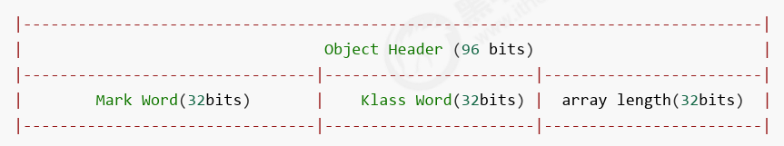
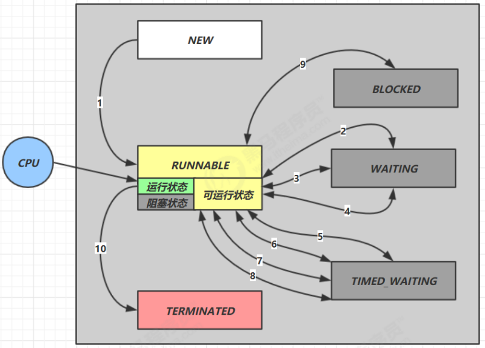

# 并发编程与JUC

---

---

## 1. 进程与线程

---

### 1.1 进程与线程

> 可以通过任务管理器查看进程数和线程数

#### 1.1.1 进程

放到内存中运行的程序

> 操作系统进行资源调度的基本单位

#### 1.1.2 线程

进程中的一个执行单元、执行场景，一个**==指令流==**

> 一个进程中至少有一个线程

> Java中一定有的两个线程：main主线程，GC守护线程

> Java实现线程的三种方式：Thread、Runnable、Callable；
>
> 但Java自己没有资格直接开启线程，只能去调用原生方法

#### 1.1.3 进程与线程对比

进程之间基本上**相互==独立==**的，而线程存在于进程内，是进程的一个子集；

进程拥有资源，如内存空间等，供**其内部的线程==共享==**；

**进程间==通信==**较为复杂：

- 同一台计算机的进程通信称为 IPC（Inter-process communication）
- 不同计算机之间的进程通信，需要通过网络，并遵守共同的协议，例如 HTTP

线程通信相对简单，因为它们<u>共享进程内的内存</u>，一个例子是多个线程可以访问同一个共享变量；

线程更**==轻量==**，线程上下文**切换**成本一般上要比进程上下文切换低；

----

### 1.2 并发与并行

#### 1.2.1 并发

> 多线程会共享同一资源

同一时刻，多个线程的指令流交替执行，由操作系统的**任务调度器**完成


> 单核CPU本质上都是并发而已；windows最小时间片一般为15ms

> **快速交替的串行**，解决排队执行的低效问题；微观串行，宏观并行；

#### 1.2.2 并行

同一时刻，多线程的**指令流**可以真正同时执行


> 多核CPU才能做到真正的并行；
>
> 当然如果太忙了，多核CPU也需要并发机制的，所以并发与并行常常同时存在

> 查看CPU核的方式：
>
> - 我的电脑$\rarr$管理$\rarr$设备管理器$\rarr$处理器
> - `Runtime.getRuntime().availableProcessors()`

为什么要并发？充分利用CPU的资源，提高效率

> Rob Pike的描述：
>
> - 并发（***concurrent***）是同一时间应对（*dealing with*）多件事情的能力
> - 并行（***parallel***）是同一时间动手做（*doing*）多件事情的能力

-----

### 1.3 线程应用

> 同步与异步：
>
> 以**调用**者角度来讲，如果
>
> - 需要**<u>等待结果返回</u>**，才能继续运行就是**同步**
>
> - **<u>不需要等待结果返回</u>**，就能继续运行就是**异步**
>
>   > 利用**多线程**就可以实现**异步**

#### 1.3.1 并发与并行中的异步调用

多线程可以让方法执行变为异步的

> 即不要巴巴干等着；
>
> 比如说读取磁盘文件时，假设读取操作花费了 5 秒钟，如果没有线程调度机制，这 5 秒 cpu 什么都做不了，其它代码都得暂停...

应用举例：

- 比如在项目中，视频文件需要转换格式等操作比较费时，这时开一个新线程处理视频转换，避免阻塞主线程

- tomcat的<u>异步servlet</u>也是类似的目的，让**用户线程**处理耗时较长的操作，避免阻塞 tomcat 的**工作线程**

  > 提高tomcat**吞吐量**

- ui 程序中，开线程进行其他操作，避免<u>阻塞 ui 线程</u>

#### 1.3.2 并行提高效率

**单核** cpu 下，<u>多线程不能实际提高程序运行效率</u>，只是为了能够在不同的任务之间**切换**，不同线程轮流使用cpu ，不至于一个线程总占用 cpu，别的线程没法干活

**多核** cpu 可以并行跑多个线程，但能否提高程序运行效率还是要分情况的有些任务，经过精心设计，将任务拆分，并行执行，当然可以提高程序的运行效率。但不是所有计算任务都能拆分（参考后文的【阿姆达尔定律】）也不是所有任务都需要拆分，任务的目的如果不同，谈拆分和效率没啥意义

IO 操作不占用 cpu，只是我们一般拷贝文件使用的是【阻塞 IO】，这时相当于线程虽然不用 cpu，但需要一直等待 IO 结束，没能充分利用线程。所以才有后面的【非阻塞 IO】和【异步 IO】优化

----

---

## 2. Java线程

---

### 2.1 线程运行

#### 2.1.1 查看和杀死进程线程

- Windows：

  - 任务管理器，PID找到进程编号
  - 控制台中，tasklist 查看进程，taskkill杀死进程
  - jps 查看Java进程

- Linux：

  - ps 列举正在运行的**进程**的运行信息

    > ps -fe | grep java

  - jps 查看Java进程

  - top 命令，实时查看进程 

    > top -H -p PID，查看PID进程编号下的所有**线程**

  - jstack PID 查看更详细的Java线程信息

- Java

  - jconsole图形化界面，连接一个Java进程

#### 2.1.2 线程运行原理

Java Virtual Machine Stacks（Java虚拟机栈）

JVM中的**栈内存**就是给**线程**用的

每个栈都有<u>多个栈帧frame</u>，对应每次调用方法时所占的内存，
当然同一时刻只能有一个活动着的**栈帧**


#### 2.1.3 线程的上下文切换

***Thread Context Switch***

发生场景：

- CPU时间片用完
- 需要进行垃圾回收
- 有更高优先级的线程
- 线程自己调用sleep、yield、wait、join、park，或者遇到synchronized、lock

context switch发生时，是由**操作系统**保存当前线程的运行状态；
Java中也有对应的程序计数器，记录JVM下一条指令的执行地址

频繁Context Switch会**影响性能**，<u>要保存的东西</u>也有很多

> 所以线程数也不是越多越好


----

### 2.2 线程API

#### 2.2.1 打断标记 

:star:关于**打断标记**

通过`线程引用.isInterrupted()`方法可以获取**打断标记**，`true`表示被打断，

而调用`线程引用.interrupt()`就会使打断标记变成`true`，

> 所以没有sleep、wait、join的情况下，也可以去打断一个线程，这个线程可以在其内部循环调用`isInterrupted`，当变成`true`的时候就知道有人想打断它，然后可以做一些**善后工作**

> 在有sleep、wait、join时，如果是处于WAITING或TIMED_WAITING状态下被调用`interrupt()`打断，会抛出异常，继续在catch后运行，但是，<u>这个打断标记会在内部被重置为`false`</u>
>
> > 毕竟又重新开始运行了
>
> > 但<u>对于park来说，不会重置为`false`</u>，所以或许需要使用`Thread.interrupted()`方法

>`Thread.interrupted()`可以获取当前线程的打断标记，但获取后<u>一定会重置打断标记为`false`</u>

> **两阶段**终止模式：
>
> 

#### 2.2.2 可读性sleep

TimeUnit.时间单位枚举.sleep(时间数值)

#### 2.2.3 过时方法


#### 2.2.4 join新理解

join其实就是一种**同步**，等待另一个线程的执行，这种同步也可以是**限时**的

> 可以传入*timeout*参数

#### 2.2.5 守护线程实例

Tomcat中的Acceptor和Poller线程都是守护线程，Tomcat接收到shutdown后，这两个线程就会强行终止


----

### 2.3 线程状态

#### 2.3.1 线程六种状态

> 看源码：java.lang.Thread中的内部**枚举类**
>
> ```java
> public enum State {
>      NEW,
>      RUNNABLE,
>      BLOCKED,
>      WAITING,
>      TIMED_WAITING,
>      TERMINATED;
>  }
> ```

- 新生：`NEW`

  >Thread state for a thread which has not yet started.

- 运行：`RUNNABLE`

  > 可以去抢CPU时间片执行了，但可能由于抢不到而等着

- 阻塞：`BLOCKED`

  > 排队等锁的状态，也就是进入了**锁池**

- 等待：`WAITING`

  > wait、join、LockSupport.park会导致进入该状态（with no timeout）
  >
  > 是在等待其他线程做出某种操作，才会继续，比如notify、执行完了(join的terminata了)

  > wait实际上会进入**等待池**，notify之后会<u>再次进入**锁池**</u>，抢到锁之后接着上一次wait的地方执行；notify是随机唤醒一个，notifyAll是唤醒所有

- 超时等待：`TIMED_WAITING`

  > 导致进入该状态：
  >
  > - Thread.sleep
  >
  >   > sleep本来就必须有参数
  >
  > - wait with timeout
  >
  > - join with timeout
  >
  > - LockSupport.parkNanos
  >
  > - LockSupport.parkUntil
  >
  > 超时了就会抛出异常，从而结束等待

- 终止：`TERMINATED`

> :star:wait与sleep的区别：
>
> - 哪来的：来自不同的类
>
>   - obj.wait()
>
>   - Thread.sleep()
>
>     > 一般不会直接写这个方法，而是借助`java.util.concurrent.TimeUnit`枚举类
>     >
>     > ```java
>     > TimeUnit.时间单位枚举常量.sleep(timeout)
>     > ```
>
> - 在哪用：应用范围
>
>   - wait：在同步代码块中调用才有意义
>   - sleep：任何位置都有可能
>
> - 是否释放锁
>
>   - wait会释放已占有的锁
>   - sleep抱着锁睡觉，不会释放已占有的锁
>
> - 唤醒方式
>
>   - wait：notify、超时(设置了timeout)、interrupt
>   - sleep：超时(是必须传timeout参数)、interrupt

#### 2.3.2 线程五种状态

> 这五种状态是从操作系统的角度来讲的

- 初始状态：刚new，还没start

- 可运行状态：已经start了，可以被CPU调度，但还没获得时间片

  > 理解成就绪状态也行

- 运行状态：获得CPU时间片

  > 与可运行状态互相转换

- 阻塞状态：比如执行一些阻塞API的操作，比如IO

  > 被**唤醒**后会进行可运行状态；
  >
  > 注意，这种阻塞在JAVA中会认为是RUNNABLE，而Java中的BLOCKED、WAITING、TIMED_WAITING在操作系统的角度还是在**可运行**和运行之间切换，只是不会分配时间片

- 终止状态


----

### 2.4 线程在开发中的使用

#### 2.4.1 概述

**资源**是资源，**线程**是线程，<u>线程可以操作资源</u>

> 资源就是指一个类/对象的属性和方法，最好不要让一个资源`implements Runnable`或者`extends Thread`， 这样<u>耦合度高</u>，不符合合成复用原则。最好去使用一个新的<u>局部匿名内部类</u>，在run方法中使用资源（依赖关系）
>
> ```java
> Object o = new Object();
> class MyInnerClass implements Runnable {
> @Override
> public void run() {
> System.out.println(o + "localInnerClass");
> }
> }
> new Thread(new MyInnerClass()).start();
> new Thread(() -> System.out.println(o + "anonymousInnerClass")).start();
> ```
>
> 在语言等级level 8之下，这样写会报错，因为必须要求o是final的，这是为防止o在线程执行前被修改，从而导致错误；
>
> 但在level 8 中，如果o初始化之后没有被修改过，可以直接这样写，但一旦在某个地方被修改了（就算这个修改一定发生在线程run之前），就会报错

#### 2.4.2 并发与并行中的异步调用

多线程可以让方法执行变为异步的

> 即不要巴巴干等着；
>
> 比如说读取磁盘文件时，假设读取操作花费了 5 秒钟，如果没有线程调度机制，这 5 秒 cpu 什么都做不了，其它代码都得暂停...

应用举例：

- 比如在项目中，视频文件需要转换格式等操作比较费时，这时开一个新线程处理视频转换，避免阻塞主线程

- tomcat的<u>异步servlet</u>也是类似的目的，让**用户线程**处理耗时较长的操作，避免阻塞 tomcat 的**工作线程**

  > 提高tomcat**吞吐量**

- ui 程序中，开线程进行其他操作，避免<u>阻塞 ui 线程</u>

#### 2.4.3 并行提高效率

**单核** cpu 下，<u>多线程不能实际提高程序运行效率</u>，只是为了能够在不同的任务之间**切换**，不同线程轮流使用cpu ，不至于一个线程总占用 cpu，别的线程没法干活

**多核** cpu 可以并行跑多个线程，但能否提高程序运行效率还是要分情况的有些任务，经过精心设计，将任务拆分，并行执行，当然可以提高程序的运行效率。但不是所有计算任务都能拆分（参考后文的【阿姆达尔定律】）也不是所有任务都需要拆分，任务的目的如果不同，谈拆分和效率没啥意义

IO 操作不占用 cpu，只是我们一般拷贝文件使用的是【阻塞 IO】，这时相当于线程虽然不用 cpu，但需要一直等待 IO 结束，没能充分利用线程。所以才有后面的【非阻塞 IO】和【异步 IO】优化

> 这也是一种统筹规划

---

---

## 4. 共享模型之管程

---

### 4.1 共享问题

#### 4.4.1 问题引入

```java
static int counter = 0;
 
public static void main(String[] args) throws InterruptedException {
    Thread t1 = new Thread(() -> {
        for (int i = 0; i < 5000; i++) {
            counter++;
        }
    }, "t1");
 
    Thread t2 = new Thread(() -> {
        for (int i = 0; i < 5000; i++) {
            counter--;
        }
    }, "t2");
 
    t1.start();
    t2.start();
    t1.join();
    t2.join();
    log.debug("{}",counter);
}
```

#### 4.4.2 问题分析

需要从**字节码**的角度来分析：

以上的结果可能是正数、负数、零。为什么呢？
因为 Java 中对静态变量的自增，自减并不是原子操作，要彻底理解，必须从字节码来进行分析

例如对于 i++ 而言（i 为静态变量），实际会产生如下的 JVM 字节码指令：

 ```java
 getstatic     i  // 获取静态变量i的值
 iconst_1         // 准备常量1
 iadd             // 自增
 putstatic     i  // 将修改后的值存入静态变量i
 ```

而对应 i-- 也是类似：

 ```java
 getstatic     i  // 获取静态变量i的值
 iconst_1         // 准备常量1
 isub             // 自减
 putstatic     i  // 将修改后的值存入静态变量i
 ```

而 Java 的内存模型如下，完成静态变量的自增、自减需要在主存和工作内存中进行数据交换：

（以出现负数的情况为例）


#### 4.4.3 临界区

> ***Critical Section***

- 根源：多线程并发环境下，对共享数据进行修改

  > 底层的指令出现混乱**交错**

- 一段代码块内如果存在对==共享资源==的**多线程**<u>读写</u>操作， 这段代码块就称之为**临界区**

  > 例子中的`counter++`和`couter--`各自就是一个临界区，`for`不算

#### 4.4.4 竞态条件

> ***Race Condition***

多个线程在**临界区**内执行，由于代码的<u>执行序列不同</u>而导致结果无法预测，称之为发生了**竞态条件**

> ==**线程上下文切换**时，会出现**指令交错**现象==

---

### 4.2 synchronized

> 为了避免临界区的竞态条件发生，有多种手段可以达到目的。
>
> - 阻塞式的解决方案：`synchronized`，`Lock`
> - 非阻塞式的解决方案：**原子变量**

synchronized，即俗称的【**对象锁**】，它采用==互斥==的方式让同一时刻至多只有一个线程能持有【对象锁】，其它线程再想获取这个【对象锁】时就会**阻塞**住。

这样就能保证拥有锁的线程可以安全的执行临界区内的代码，不用担心<u>线程上下文切换</u>。

> :star:关于**互斥**和**同步**的区分：
> 虽然 java 中**互斥**和**同步**都可以采用`synchronized`关键字来完成，但它们还是有区别的：
>
> - 互斥是保证同一时刻<u>只能有一个线程执行**临界区**代码</u>
>
>   > 也就是避免**静态条件**
>
> - 同步是由于线程执行的先后**顺序**不同，需要一个线程<u>等待其它线程运行到某个点</u>

建议将**锁对象**和**资源**绑定，而不是把`synchronized`写在线程的run里面，这样更符合**面向对象**思想


>`synchronized`实际是用**对象锁**保证了<u>临界区内代码的**原子性**</u>，临界区内的代码对外是不可分割的，不会被线程切换所打断。

---

### 4.3 线程安全分析

#### 4.3.1 成员变量和静态变量

- 如果它们**没有共享**，则线程安全
- 如果它们被**共享**了，根据它们的状态是否能够改变，又分两种情况
  - 如果只有**读**操作，则线程安全
  - 如果有读**写**操作，则这段代码是**临界区**，需要考虑**线程安全**

#### 4.3.2 局部变量

- 局部变量<u>本身的值</u>是线程安全的

  > 举例：局部变量`int i`
  >
  > 

- 但局部变量**引用的对象**则未必

  - 如果该对象没有逃离<u>方法的作用范围</u>，它是线程安全的
  - 如果该对象逃离<u>方法的作用范围</u>，需要考虑线程安全

> 举例：
>
> ```java
> class ThreadSafe {
>     public void method1(int loopNumber) {
>         ArrayList<String> list = new ArrayList<>();
>         for (int i = 0; i < loopNumber; i++) {
>             method2(list);
>             method3(list);
>         }
>     }
> 
>     public void method2(ArrayList<String> list) {
>         list.add("1");
>     }
> 
>     public void method3(ArrayList<String> list) {
>         list.remove(0);
>     }
> }
> 
> class ThreadSafeSubClass extends ThreadSafe{
>     @Override
>     public void method3(ArrayList<String> list) {
>         new Thread(() -> {
>             list.remove(0);
>         }).start();
>     }
> }
> 
> class Test {
>     static final int THREAD_NUMBER = 1;
>     static final int LOOP_NUMBER = 200;
>     public static void main(String[] args) {
>         ThreadSafe test = new ThreadSafeSubClass();
>         for (int i = 0; i < THREAD_NUMBER; i++) {
>             new Thread(() -> {
>                 test.method1(LOOP_NUMBER);
>             }, "Thread" + i).start();
>         }
>     }
> }
> ```
>
> 引发问题的本质：<u>在方法内部创建一个**新的线程**，持有**局部变量引用**</u>，
> ==**局部变量**被暴露给了其他**线程**==
>
> > 怎么出的问题？
> >
> > `add`中有`size++`，`remove`中有`--size`，自增和自减指令都不是原子性的，可以继续拆分（上文中有分析字节码），在另一个线程remove时，可能已经进入下一次循环的add了，这时`--size`获取值的时候`size++`还没执行完，而`--size`在设置值的时候`size++`已经执行完了，这就导致最终`size`的值被`remove`方法错误地设置了，下次再`remove`的时候就会出错
>
> > 这里也说明了方法私有化的好处：只要把`ThreadSafe`的`method3`改成`private`，其他不用动，就不会再出现问题了（也可以再使用一个`final`，更安全）
> >
> > > 把父类的`method3`私有化之后，这样直接使用子类引用会不会引发问题？
> > >
> > > ```java
> > > ThreadSafeSubClass test = new ThreadSafeSubClass();
> > > for (int i = 0; i < THREAD_NUMBER; i++) {
> > >   new Thread(() -> {
> > >     test.method1(LOOP_NUMBER);
> > >   }, "Thread" + i).start();
> > > }
> > > ```
> > >
> > > 难道这样就会去调用子类的`method3`了吗？别忘了，在父类的`method1`中，对`method3(list)`的调用虽然是`this.method3(list)`，但这个方法地址已经被静态到父类的`method3`中了，而子类又没能对其进行覆盖，所以调的还是这个方法

#### 4.3.3 常见线程安全类

- String
- StringBuffer
- Integer等包装类
- Random
- Vector
- Hashtable
- ***java.util.concurrent***包下的类

这里说它们是线程安全的是指，多个线程调用它们同一个实例的某个方法时，是线程安全的。

- 它们的**每个方法**是==原子==的
- 但注意它们**多个方法的组合**不是原子的，见后面分析

==将线程安全类的方法进行**组合**==，就可能导致不安全，例如：

```java
Hashtable table = new Hashtable();
// 线程1，线程2
if( table.get("key") == null) {
    table.put("key", value);
}
```


*关于不可变类线程安全性：*

String、Integer 等都是不可变类，因为其内部的状态不可以改变，因此它们的方法都是线程安全的

> 线程安全问题举例：
>
> ```java
> @Aspect
> @Component
> public class MyAspect {
>     // 是否安全？不安全
>   	// 怎么解决？可以使用环绕通过，将start设置成局部变量
>     private long start = 0L;
>     
>     @Before("execution(* *(..))")
>     public void before() {
>         start = System.nanoTime();
>     }
>     
>     @After("execution(* *(..))")
>     public void after() {
>         long end = System.nanoTime();
>         System.out.println("cost time:" + (end-start));
>     }
> }
> ```
>
> ```java
> public class MyServlet extends HttpServlet {
>     // 是否安全？是。因为没修改
>     private UserService userService = new UserServiceImpl();
>     
>     public void doGet(HttpServletRequest request, HttpServletResponse response) {
>         userService.update(...);
>     }
> }
>  
> public class UserServiceImpl implements UserService {
>     // 是否安全？是。虽然这是个成员变量，但这个成员变量是无状态的，不可能有修改操作
>     private UserDao userDao = new UserDaoImpl();
>     
>     public void update() {
>         userDao.update();
>     }
> }
>  
> public class UserDaoImpl implements UserDao { 
>     public void update() {
>         String sql = "update user set password = ? where username = ?";
>         // 是否安全？当然安全，根本没有成员变量
>         try (Connection conn = DriverManager.getConnection("","","")){
>             // ...
>         } catch (Exception e) {
>             // ...
>         }
>     }
> }
> ```
>
> ```java
> public abstract class Test {
>   public void bar() {
>     // 是否安全？不安全
>     SimpleDateFormat sdf = new SimpleDateFormat("yyyy-MM-dd HH:mm:ss");
>     foo(sdf);
>   }
> 	//其中foo的行为是不确定的，可能导致不安全的发生，被称之为外星方法
>   public abstract foo(SimpleDateFormat sdf);
>   public static void main(String[] args) {
>     new Test().bar();
>   }
> }
> public void foo(SimpleDateFormat sdf) {
>   String dateStr = "1999-10-11 00:00:00";
>   for (int i = 0; i < 20; i++) {
>     new Thread(() -> {
>       try {
>         sdf.parse(dateStr);
>       } catch (ParseException e) {
>         e.printStackTrace();
>       }
>     }).start();
>   }
> }
> ```
>
> > 现在明白为啥`String`类要设置成`final`了吗？
> >
> > 若不这样，则子类可能**覆盖**掉父类的方法，从而在覆盖方法中进行一些线程不安全的操作，破坏了原本方法的**安全性**

---

### 4.4 Monitor

#### 4.4.1 Java对象头

普通对象：

```java
|--------------------------------------------------------------|
|                     Object Header (64 bits)                  |
|------------------------------------|-------------------------|
|        Mark Word (32 bits)         |    Klass Word (32 bits) |
|------------------------------------|-------------------------|
```

数组对象：



其中MarkWord结构为：


> 64位虚拟机MarkWord：
>
> 

#### 4.4.2 Monitor工作原理

> Monitor：监视器/管程

每个Java对象都可以关联一个Monitor对象，如果使用`synchronized`给对象上锁(重量级)之后，该对象头的MarkWord中就设置了指向<u>Monitor对象的指针</u>

> MarkWord中原本的数据会存在Monitor中，在退出时会重置


> Owner就是锁的持有者，EntryList可以理解成**阻塞队列**，其中的线程是BLOCKED状态

从字节码角度理解：

```java
static final Object lock = new Object();
static int counter = 0;
 
public static void main(String[] args) {
    synchronized (lock) {
        counter++;
    }
}
```

```java
public static void main(java.lang.String[]);
    descriptor: ([Ljava/lang/String;)V
    flags: ACC_PUBLIC, ACC_STATIC
Code:
      stack=2, locals=3, args_size=1
         0: getstatic     #2   // <- lock引用 （synchronized开始）
         3: dup
         4: astore_1           // lock引用 -> slot 1
         5: monitorenter       // 将 lock对象 MarkWord 置为 Monitor 指针
         6: getstatic     #3   // <- i
         9: iconst_1           // 准备常数 1
        10: iadd               // +1
        11: putstatic     #3   // -> i
        14: aload_1            // <- lock引用
        15: monitorexit        // 将 lock对象 MarkWord 重置, 唤醒 EntryList
        16: goto          24
        19: astore_2           // e -> slot 2 
        20: aload_1            // <- lock引用
        21: monitorexit        // 将 lock对象 MarkWord 重置, 唤醒 EntryList
        22: aload_2            // <- slot 2 (e)
        23: athrow             // throw e
        24: return
      Exception table:
         from    to  target type
             6    16    19   any
            19    22    19   any
      LineNumberTable:
        line 8: 0
        line 9: 6
        line 10: 14
        line 11: 24
      LocalVariableTable:
        Start  Length  Slot  Name   Signature
            0      25     0  args   [Ljava/lang/String;
      StackMapTable: number_of_entries = 2
        frame_type = 255 /* full_frame */
          offset_delta = 19
          locals = [ class "[Ljava/lang/String;", class java/lang/Object ]
          stack = [ class java/lang/Throwable ]
        frame_type = 250 /* chop */
          offset_delta = 4
```

> 出现异常了也可以正常解锁

----

### 4.5 synchronized进阶原理

> `synchronized`最初的工作原理是让每个对象关联一个Monitor，
> 但Monitor是操作系统提供的，使用时成本较高（**重量级锁**）；
>
> 而后进行了优化，不只可以使用Monitor，还可以使用**轻量级锁**、**偏向锁**

#### 4.5.1 经量级锁与锁膨胀

> 轻量级锁的使用场景：
> 如果一个对象虽然有多线程要加锁，
> 但加锁的时间是错开的（也就是没有竞争），那么可以使用轻量级锁来优化。

- 轻量级锁对使用者是<u>透明</u>的，即语法仍然是`synchronized`

  > 这时充当“锁”的其实是<u>属性于线程自己的==锁记录(lock record)==</u>（的地址）

- 假设有两个方法同步块，利用同一个对象加锁:

  ```java
  static final Object obj = new Object();
  public static void method1() {
      synchronized( obj ) {
          // 同步块 A
          method2();
      }
  }
  public static void method2() {
      synchronized( obj ) {
          // 同步块 B
      }
  }
  ```

  - 创建锁记录（Lock Record）对象：
    每个**线程**的<u>栈帧</u>都会包含一个**<u>锁记录</u>**的结构，内部可以存储锁定对象的 Mark Word

    

  - 让锁记录中 Object reference 指向锁对象，并尝试用 cas 替换 Object 的 Mark Word，将 Mark Word 的值存入锁记录

    

    - 如果 <u>cas 替换成功</u>，则让对象头存储锁记录地址和状态 00 ，
      表示由该线程给对象加锁，这时图示如下

      

      > cas交换操作是原子操作，不会被打断，后面会具体解释什么是CAS

    - 如果 <u>cas 失败</u>（也就是发现该对象的状态是 00），有两种情况

      - 如果是<u>其它线程</u>已经持有了该 Object 的**轻量级锁**，这时表明有竞争，进入**锁膨胀**过程

        > 锁膨胀是什么？
        >
        > 当Thread-1进行轻量级加锁时，Thread-0已经对该对象加了**轻量级锁**
        >
        > 
        >
        > 这时Thread-1<u>加轻量级锁失败</u>，进入**锁膨胀**流程：
        >
        > - 为Object对象申请<u>Monitor锁</u>，让MarkWord指向重量级锁地址
        >
        > - 然后自己进入Monitor的EntryList BLOCKED
        >
        >   > 轻量级锁所是无法阻塞的
        >
        > 
        >
        > 当Thread-0退出同步块解锁时，使用cas将<u>Mark Word</u>的值恢复给**对象头**，失败。
        >
        > > 重量级锁是10
        >
        > 这时会进入重量级解锁流程，即按照<u>Monitor地址</u>找到 Monitor 对象，设置**Owner**为null，唤醒**EntryList**中BLOCKED线程

      - 如果是<u>同一个线程</u>执行了`synchronized`**锁重入**，
        那么再添加一条Lock Record作为重入的计数，如下图：

        

  - 当退出`synchronized`代码块（解锁时）

    - 如果有取值为null的锁记录，表示有**重入**，这时重置锁记录，表示重入计数减一
    - 锁记录的值不为null，这时使用cas将Mark Word的值<u>恢复</u>给**对象头**
      - 成功，则解锁成功
      - 失败，说明**轻量级锁**进行了**锁膨胀**或已经升级为重量级锁，<u>进入重量级锁解锁流程</u>

#### 4.5.2 自旋优化

**经量级/重量级锁竞争**的时候，还可以使用**自旋**来进行优化，如果当前线程自旋成功（即这时候持锁线程已经退出了同步块，<u>释放了锁</u>），这时当前线程就可以**避免阻塞**。

> 阻塞就意味着要发生<u>线程上下文切换</u>，这是比较影响性能的

> 当然，自旋要在多核CPU下才有意义，不然还是要来回放弃时间片

自旋会占用 CPU 时间，单核 CPU 自旋就是浪费，多核 CPU 自旋才能发挥优势。

在 Java 6 之后自旋锁是自适应的，比如对象刚刚的一次自旋操作成功过，那么认为这次自旋成功的可能性会高，就多自旋几次；反之，就少自旋甚至不自旋，总之，比较智能。

Java 7 之后不能控制是否开启自旋功能

#### 4.5.3 偏向锁

##### 4.5.3.1 偏向锁概述

- 轻量级锁在没有竞争时（就自己这个线程），每次**重入**仍然需要执行 ***CAS*** 操作。

- Java 6 中引入了**偏向锁**来做进一步优化：
  只有第一次使用 ***CAS*** 将<u>线程 ID</u> 设置到对象的 Mark Word 头，之后发现这个线程 ID 是自己的就表示没有竞争，<u>不用重新 CAS</u>。以后只要不发生竞争，这个对象就归该线程所有

  >这时充当“锁”的其实是<u>属性线程自己的==线程ID(Thread ID)==</u>

  > 改造之前：
  >
  > 
  >
  > 每次都要CAS，只不过后两次是失败的
  >
  > 改造之后：
  >
  > 
  >
  > 只有第一次需要CAS，后两次都只是检查

##### 4.5.3.2 偏向状态

- 回忆对象头的格式：（32bit的情况）

  

- 一个对象创建时：（32bit举例）

  - 如果开启了偏向锁（**默认开启**），那么对象创建(一段时间)后，markword 值为 0x 0000_0005

    > 即最后 3 位为 *101*，其他的，包括 thread、epoch、age 都为 0

    > 但这并不是立即生效的，而是有一定延迟
    >
    > > 也就是<u>最最开始</u>还是 *001*，在延迟之前加锁还是**轻量级锁**
    >
    > 偏向锁是默认是延迟的，不会在程序启动时立即生效，
    > 如果想避免延迟，可以加 VM 参数 *-XX:BiasedLockingStartupDelay=0* 来**禁用延迟**
    >
    > > 就是Edit Configuration中的VM options
    >
    > 如果想直接禁用偏向锁，可以添加 VM 参数 *-XX:-UseBiasedLocking* 禁用偏向锁

    > 如果没有开启偏向锁，那么对象创建后，markword 值为 0x01 即最后 3 位为 001，这时它的 hashcode、age 也都为 0，<u>第一次用到</u> hashcode 时才会赋值
    >
    > > 那用了hashCode，线程相关的字段放哪？往下看就明白了

  - 线程获取锁后，会影响到thread、epoch、age等数据；
    线程释放锁后，（没有其他线程再来获得锁时，）对象头中的MarkWord依然保留**<u>线程id</u>**
  
  > 举例：
  >
  > 
  >
  > 
  >
  > 这个id是操作系统给的线程id，不是Java线程对象的

*禁用偏向锁：*


> 这样就会先使用**轻量级锁**

##### 4.5.3.3 撤销偏向

$\Rarr$*关于hashCode：*

> 默认不是对象一创建就开启偏向锁状态吗？
> 那我要是不加锁，只是想使用这个对象，那我hashCode之类的字段咋办


- 调用了对象的 hashCode，但偏向锁的对象 MarkWord 中存储的是线程 id，如果调用 hashCode 会导致偏向锁被撤销

> 轻量级锁会在**锁记录**中记录 hashCode；重量级锁会在 **Monitor** 中记录 hashCode；
> 但偏向锁没地方存了，所以，
>
> - 如果是还没有加锁的情况，只能给变回Normal
> - 如果是已经加了偏向锁的情况，会膨胀成**轻量级锁**
>
> 之后也无法再进入偏向锁状态了，因为生成一次hashCode之后就不能再换了

$\Rarr$*其他线程使用对象：*

当有其它线程使用偏向锁对象时，会将偏向锁升级为轻量级锁

> 注意，这里指的是：没有线程的冲突，不是直接竞争。如果直接竞争就会升级成重量级锁了

- 程序举例：

  ```java
  private static void test2() throws InterruptedException {
  
    Dog d = new Dog();
    Thread t1 = new Thread(() -> {
      synchronized (d) {
        log.debug(ClassLayout.parseInstance(d).toPrintableSimple(true));
      }
      synchronized (TestBiased.class) {
        TestBiased.class.notify();
      }
      // 如果不用wait/notify,想使用join，必须打开下面的注释
      // 因为：t1线程不能结束，否则底层线程可能被jvm重用作为t2线程，底层线程id是一样的
      /*try {
              System.in.read();
          } catch (IOException e) {
              e.printStackTrace();
          }*/
    }, "t1");
    t1.start();
  
    Thread t2 = new Thread(() -> {
      synchronized (TestBiased.class) {
        try {
          TestBiased.class.wait();
        } catch (InterruptedException e) {
          e.printStackTrace();
        }
      }
      log.debug(ClassLayout.parseInstance(d).toPrintableSimple(true));
      synchronized (d) {
        log.debug(ClassLayout.parseInstance(d).toPrintableSimple(true));
      }
      log.debug(ClassLayout.parseInstance(d).toPrintableSimple(true));
    }, "t2");
    t2.start();
  }
  ```

- 举例的输出：

  ```java
  [t1] - 00000000 00000000 00000000 00000000 00011111 01000001 00010000 00000101 
  [t2] - 00000000 00000000 00000000 00000000 00011111 01000001 00010000 00000101 
  [t2] - 00000000 00000000 00000000 00000000 00011111 10110101 11110000 01000000 
  [t2] - 00000000 00000000 00000000 00000000 00000000 00000000 00000000 00000001 
  ```

  > 另一个线程在非直接竞争的情况下，再次加锁，偏向锁会直接变成轻量级锁；线程释放锁后，会变成正常状态，而不会再进入偏向状态

*$\Rarr$调用wait和notify*

wait和notify机制只有重量级锁具有

##### 4.5.3.4 批量重偏向

> 其实虽然被迫取消了偏向，但其实，可能是两个线程在不同时刻锁的对象，也是无竞争的

当**若干个线程**占有**同一个类**(超过20个)对象的偏向锁，且因<u>其他某个线程无竞争访问对象</u>而被**撤销偏向锁**超过20次后，jvm 会这样觉得，我是不是偏向错了呢，于是会在给之后这些对象加锁时重新偏向至新加锁的线程

> 类和线程级别的计数；
>
> 就算前20个是不同的线程，后面也会重偏向至新加锁的线程；就算开启重偏向后有不同的线程来访问对象，也会将对象重偏向至新加锁的线程

- 程序举例：

  ```java
  private static void test3() throws InterruptedException {
  
    Vector<Dog> list = new Vector<>();
    Thread t1 = new Thread(() -> {
      for (int i = 0; i < 30; i++) {
        Dog d = new Dog();
        list.add(d);
        synchronized (d) {
          log.debug(i + "\t" + ClassLayout.parseInstance(d).toPrintableSimple(true));
        }
      }
      synchronized (list) {
        list.notify();
      }        
    }, "t1");
    t1.start();
  
  
    Thread t2 = new Thread(() -> {
      synchronized (list) {
        try {
          list.wait();
        } catch (InterruptedException e) {
          e.printStackTrace();
        }
      }
      log.debug("===============> ");
      for (int i = 0; i < 30; i++) {
        Dog d = list.get(i);
        log.debug(i + "\t" + ClassLayout.parseInstance(d).toPrintableSimple(true));
        synchronized (d) {
          log.debug(i + "\t" + ClassLayout.parseInstance(d).toPrintableSimple(true));
        }
        log.debug(i + "\t" + ClassLayout.parseInstance(d).toPrintableSimple(true));
      }
    }, "t2");
    t2.start();
  }
  ```

- 举例的输出：

  ```java
  [t1] - 0 00000000 00000000 00000000 00000000 00011111 11110011 11100000 00000101 
  [t1] - 1 00000000 00000000 00000000 00000000 00011111 11110011 11100000 00000101 
  [t1] - 2 00000000 00000000 00000000 00000000 00011111 11110011 11100000 00000101 
  [t1] - 3 00000000 00000000 00000000 00000000 00011111 11110011 11100000 00000101 
  [t1] - 4 00000000 00000000 00000000 00000000 00011111 11110011 11100000 00000101 
  [t1] - 5 00000000 00000000 00000000 00000000 00011111 11110011 11100000 00000101 
  [t1] - 6 00000000 00000000 00000000 00000000 00011111 11110011 11100000 00000101 
  [t1] - 7 00000000 00000000 00000000 00000000 00011111 11110011 11100000 00000101 
  [t1] - 8 00000000 00000000 00000000 00000000 00011111 11110011 11100000 00000101 
  [t1] - 9 00000000 00000000 00000000 00000000 00011111 11110011 11100000 00000101 
  [t1] - 10 00000000 00000000 00000000 00000000 00011111 11110011 11100000 00000101 
  [t1] - 11 00000000 00000000 00000000 00000000 00011111 11110011 11100000 00000101 
  [t1] - 12 00000000 00000000 00000000 00000000 00011111 11110011 11100000 00000101 
  [t1] - 13 00000000 00000000 00000000 00000000 00011111 11110011 11100000 00000101 
  [t1] - 14 00000000 00000000 00000000 00000000 00011111 11110011 11100000 00000101 
  [t1] - 15 00000000 00000000 00000000 00000000 00011111 11110011 11100000 00000101 
  [t1] - 16 00000000 00000000 00000000 00000000 00011111 11110011 11100000 00000101 
  [t1] - 17 00000000 00000000 00000000 00000000 00011111 11110011 11100000 00000101 
  [t1] - 18 00000000 00000000 00000000 00000000 00011111 11110011 11100000 00000101 
  [t1] - 19 00000000 00000000 00000000 00000000 00011111 11110011 11100000 00000101 
  [t1] - 20 00000000 00000000 00000000 00000000 00011111 11110011 11100000 00000101 
  [t1] - 21 00000000 00000000 00000000 00000000 00011111 11110011 11100000 00000101 
  [t1] - 22 00000000 00000000 00000000 00000000 00011111 11110011 11100000 00000101 
  [t1] - 23 00000000 00000000 00000000 00000000 00011111 11110011 11100000 00000101 
  [t1] - 24 00000000 00000000 00000000 00000000 00011111 11110011 11100000 00000101 
  [t1] - 25 00000000 00000000 00000000 00000000 00011111 11110011 11100000 00000101 
  [t1] - 26 00000000 00000000 00000000 00000000 00011111 11110011 11100000 00000101 
  [t1] - 27 00000000 00000000 00000000 00000000 00011111 11110011 11100000 00000101 
  [t1] - 28 00000000 00000000 00000000 00000000 00011111 11110011 11100000 00000101 
  [t1] - 29 00000000 00000000 00000000 00000000 00011111 11110011 11100000 00000101 
  [t2] - ===============>  
  [t2] - 0 00000000 00000000 00000000 00000000 00011111 11110011 11100000 00000101 
  [t2] - 0 00000000 00000000 00000000 00000000 00100000 01011000 11110111 00000000 
  [t2] - 0 00000000 00000000 00000000 00000000 00000000 00000000 00000000 00000001 
  [t2] - 1 00000000 00000000 00000000 00000000 00011111 11110011 11100000 00000101 
  [t2] - 1 00000000 00000000 00000000 00000000 00100000 01011000 11110111 00000000 
  [t2] - 1 00000000 00000000 00000000 00000000 00000000 00000000 00000000 00000001 
  [t2] - 2 00000000 00000000 00000000 00000000 00011111 11110011 11100000 00000101 
  [t2] - 2 00000000 00000000 00000000 00000000 00100000 01011000 11110111 00000000 
  [t2] - 2 00000000 00000000 00000000 00000000 00000000 00000000 00000000 00000001 
  [t2] - 3 00000000 00000000 00000000 00000000 00011111 11110011 11100000 00000101 
  [t2] - 3 00000000 00000000 00000000 00000000 00100000 01011000 11110111 00000000 
  [t2] - 3 00000000 00000000 00000000 00000000 00000000 00000000 00000000 00000001 
  [t2] - 4 00000000 00000000 00000000 00000000 00011111 11110011 11100000 00000101 
  [t2] - 4 00000000 00000000 00000000 00000000 00100000 01011000 11110111 00000000 
  [t2] - 4 00000000 00000000 00000000 00000000 00000000 00000000 00000000 00000001 
  [t2] - 5 00000000 00000000 00000000 00000000 00011111 11110011 11100000 00000101 
  [t2] - 5 00000000 00000000 00000000 00000000 00100000 01011000 11110111 00000000 
  [t2] - 5 00000000 00000000 00000000 00000000 00000000 00000000 00000000 00000001 
  [t2] - 6 00000000 00000000 00000000 00000000 00011111 11110011 11100000 00000101 
  [t2] - 6 00000000 00000000 00000000 00000000 00100000 01011000 11110111 00000000 
  [t2] - 6 00000000 00000000 00000000 00000000 00000000 00000000 00000000 00000001 
  [t2] - 7 00000000 00000000 00000000 00000000 00011111 11110011 11100000 00000101 
    [t2] - 7 00000000 00000000 00000000 00000000 00100000 01011000 11110111 00000000 
  [t2] - 7 00000000 00000000 00000000 00000000 00000000 00000000 00000000 00000001 
  [t2] - 8 00000000 00000000 00000000 00000000 00011111 11110011 11100000 00000101 
  [t2] - 8 00000000 00000000 00000000 00000000 00100000 01011000 11110111 00000000 
  [t2] - 8 00000000 00000000 00000000 00000000 00000000 00000000 00000000 00000001 
  [t2] - 9 00000000 00000000 00000000 00000000 00011111 11110011 11100000 00000101 
  [t2] - 9 00000000 00000000 00000000 00000000 00100000 01011000 11110111 00000000 
  [t2] - 9 00000000 00000000 00000000 00000000 00000000 00000000 00000000 00000001 
  [t2] - 10 00000000 00000000 00000000 00000000 00011111 11110011 11100000 00000101 
  [t2] - 10 00000000 00000000 00000000 00000000 00100000 01011000 11110111 00000000 
  [t2] - 10 00000000 00000000 00000000 00000000 00000000 00000000 00000000 00000001 
  [t2] - 11 00000000 00000000 00000000 00000000 00011111 11110011 11100000 00000101 
  [t2] - 11 00000000 00000000 00000000 00000000 00100000 01011000 11110111 00000000 
  [t2] - 11 00000000 00000000 00000000 00000000 00000000 00000000 00000000 00000001 
  [t2] - 12 00000000 00000000 00000000 00000000 00011111 11110011 11100000 00000101 
  [t2] - 12 00000000 00000000 00000000 00000000 00100000 01011000 11110111 00000000 
  [t2] - 12 00000000 00000000 00000000 00000000 00000000 00000000 00000000 00000001 
  [t2] - 13 00000000 00000000 00000000 00000000 00011111 11110011 11100000 00000101 
  [t2] - 13 00000000 00000000 00000000 00000000 00100000 01011000 11110111 00000000 
  [t2] - 13 00000000 00000000 00000000 00000000 00000000 00000000 00000000 00000001 
  [t2] - 14 00000000 00000000 00000000 00000000 00011111 11110011 11100000 00000101 
  [t2] - 14 00000000 00000000 00000000 00000000 00100000 01011000 11110111 00000000 
  [t2] - 14 00000000 00000000 00000000 00000000 00000000 00000000 00000000 00000001 
  [t2] - 15 00000000 00000000 00000000 00000000 00011111 11110011 11100000 00000101 
  [t2] - 15 00000000 00000000 00000000 00000000 00100000 01011000 11110111 00000000 
  [t2] - 15 00000000 00000000 00000000 00000000 00000000 00000000 00000000 00000001 
  [t2] - 16 00000000 00000000 00000000 00000000 00011111 11110011 11100000 00000101 
  [t2] - 16 00000000 00000000 00000000 00000000 00100000 01011000 11110111 00000000 
  [t2] - 16 00000000 00000000 00000000 00000000 00000000 00000000 00000000 00000001 
  [t2] - 17 00000000 00000000 00000000 00000000 00011111 11110011 11100000 00000101 
  [t2] - 17 00000000 00000000 00000000 00000000 00100000 01011000 11110111 00000000 
  [t2] - 17 00000000 00000000 00000000 00000000 00000000 00000000 00000000 00000001 
  [t2] - 18 00000000 00000000 00000000 00000000 00011111 11110011 11100000 00000101 
  [t2] - 18 00000000 00000000 00000000 00000000 00100000 01011000 11110111 00000000 
  [t2] - 18 00000000 00000000 00000000 00000000 00000000 00000000 00000000 00000001 
  [t2] - 19 00000000 00000000 00000000 00000000 00011111 11110011 11100000 00000101 
  [t2] - 19 00000000 00000000 00000000 00000000 00011111 11110011 11110001 00000101 
  [t2] - 19 00000000 00000000 00000000 00000000 00011111 11110011 11110001 00000101 
  [t2] - 20 00000000 00000000 00000000 00000000 00011111 11110011 11100000 00000101 
  [t2] - 20 00000000 00000000 00000000 00000000 00011111 11110011 11110001 00000101 
  [t2] - 20 00000000 00000000 00000000 00000000 00011111 11110011 11110001 00000101 
  [t2] - 21 00000000 00000000 00000000 00000000 00011111 11110011 11100000 00000101 
  [t2] - 21 00000000 00000000 00000000 00000000 00011111 11110011 11110001 00000101 
  [t2] - 21 00000000 00000000 00000000 00000000 00011111 11110011 11110001 00000101 
  [t2] - 22 00000000 00000000 00000000 00000000 00011111 11110011 11100000 00000101 
  [t2] - 22 00000000 00000000 00000000 00000000 00011111 11110011 11110001 00000101 
  [t2] - 22 00000000 00000000 00000000 00000000 00011111 11110011 11110001 00000101 
  [t2] - 23 00000000 00000000 00000000 00000000 00011111 11110011 11100000 00000101 
  [t2] - 23 00000000 00000000 00000000 00000000 00011111 11110011 11110001 00000101 
  [t2] - 23 00000000 00000000 00000000 00000000 00011111 11110011 11110001 00000101 
  [t2] - 24 00000000 00000000 00000000 00000000 00011111 11110011 11100000 00000101 
  [t2] - 24 00000000 00000000 00000000 00000000 00011111 11110011 11110001 00000101 
  [t2] - 24 00000000 00000000 00000000 00000000 00011111 11110011 11110001 00000101 
  [t2] - 25 00000000 00000000 00000000 00000000 00011111 11110011 11100000 00000101 
  [t2] - 25 00000000 00000000 00000000 00000000 00011111 11110011 11110001 00000101 
  [t2] - 25 00000000 00000000 00000000 00000000 00011111 11110011 11110001 00000101 
  [t2] - 26 00000000 00000000 00000000 00000000 00011111 11110011 11100000 00000101 
  [t2] - 26 00000000 00000000 00000000 00000000 00011111 11110011 11110001 00000101 
  [t2] - 26 00000000 00000000 00000000 00000000 00011111 11110011 11110001 00000101 
  [t2] - 27 00000000 00000000 00000000 00000000 00011111 11110011 11100000 00000101 
  [t2] - 27 00000000 00000000 00000000 00000000 00011111 11110011 11110001 00000101 
  [t2] - 27 00000000 00000000 00000000 00000000 00011111 11110011 11110001 00000101 
  [t2] - 28 00000000 00000000 00000000 00000000 00011111 11110011 11100000 00000101 
  [t2] - 28 00000000 00000000 00000000 00000000 00011111 11110011 11110001 00000101 
  [t2] - 28 00000000 00000000 00000000 00000000 00011111 11110011 11110001 00000101 
  [t2] - 29 00000000 00000000 00000000 00000000 00011111 11110011 11100000 00000101 
  [t2] - 29 00000000 00000000 00000000 00000000 00011111 11110011 11110001 00000101 
  [t2] - 29 00000000 00000000 00000000 00000000 00011111 11110011 11110001 00000101 
  ```

##### 4.5.3.5 批量撤销

当撤销偏向锁阈值超过 40 次后，jvm 会这样觉得，自己根本就不该偏向。于是整个类的所有对象都会变为**不可偏向的**，<u>新建的对象</u>也是不可偏向的

```java
static Thread t1,t2,t3;
private static void test4() throws InterruptedException {
    Vector<Dog> list = new Vector<>();
 
    int loopNumber = 39;
    t1 = new Thread(() -> {
        for (int i = 0; i < loopNumber; i++) {
            Dog d = new Dog();
            list.add(d);
            synchronized (d) {
                log.debug(i + "\t" + ClassLayout.parseInstance(d).toPrintableSimple(true));
            }
        }
        LockSupport.unpark(t2);
    }, "t1");
    t1.start();
 
    t2 = new Thread(() -> {
        LockSupport.park();
        log.debug("===============> ");
        for (int i = 0; i < loopNumber; i++) {
            Dog d = list.get(i);
            log.debug(i + "\t" + ClassLayout.parseInstance(d).toPrintableSimple(true));
            synchronized (d) {
                log.debug(i + "\t" + ClassLayout.parseInstance(d).toPrintableSimple(true));
            }
            log.debug(i + "\t" + ClassLayout.parseInstance(d).toPrintableSimple(true));
        }
        LockSupport.unpark(t3);
    }, "t2");
  	t2.start();
 
    t3 = new Thread(() -> {
        LockSupport.park();
        log.debug("===============> ");
        for (int i = 0; i < loopNumber; i++) {
            Dog d = list.get(i);
            log.debug(i + "\t" + ClassLayout.parseInstance(d).toPrintableSimple(true));
            synchronized (d) {
                log.debug(i + "\t" + ClassLayout.parseInstance(d).toPrintableSimple(true));
            }
            log.debug(i + "\t" + ClassLayout.parseInstance(d).toPrintableSimple(true));
        }
    }, "t3");
    t3.start();
 
    t3.join();
    log.debug(ClassLayout.parseInstance(new Dog()).toPrintableSimple(true));
}
```

#### 4.5.4 锁消除

JIT(即时编译器)会对Java字节码进行进一步优化，
如果锁的对象不可能被共享，锁相关代码就会被优化掉

> 有一个开关可以关闭锁消除优化：`-XX:-EliminateLocks`

举例：

```java
@Fork(1)
@BenchmarkMode(Mode.AverageTime)
@Warmup(iterations=3)
@Measurement(iterations=5)
@OutputTimeUnit(TimeUnit.NANOSECONDS)
public class MyBenchmark {
    static int x = 0;
    @Benchmark
    public void a() throws Exception {
        x++;
    }
    @Benchmark
    public void b() throws Exception {
        Object o = new Object();
        synchronized (o) {
            x++;
        }
    }
}
```

```java
java -jar benchmarks.jar

Benchmark            Mode  Samples  Score  Score error  Units 
c.i.MyBenchmark.a    avgt        5  1.542        0.056  ns/op 
c.i.MyBenchmark.b    avgt        5  1.518        0.091  ns/op 

java -XX:-EliminateLocks -jar benchmarks.jar

Benchmark            Mode  Samples   Score  Score error  Units 
c.i.MyBenchmark.a    avgt        5   1.507        0.108  ns/op 
c.i.MyBenchmark.b    avgt        5  16.976        1.572  ns/op 
```

---

### 4.5 wait/notify

#### 4.5.1 wait和notify的原理

> 只有重量级锁Monitor有wait和notify


- Owner 线程发现<u>执行条件不满足</u>，调用 wait 方法，即可进入 WaitSet 变为 ***WAITING*** 状态
- *BLOCKED* 和 WAITING 的线程都处于阻塞状态，不占用 CPU 时间片
- BLOCKED 线程会在 Owner 线程释放锁时唤醒
- WAITING 线程会在 Owner 线程调用 notify 或 notifyAll 时唤醒，但唤醒后并不意味者立刻获得锁，仍需进入 EntryList <u>重新竞争</u>

#### 4.5.2 相关API介绍

- `obj.wait()` 让进入 object 监视器的线程到 waitSet 等待
- `obj.notify()` 在 object 上正在 waitSet 等待的线程中<u>随机</u>挑一个唤醒 
- `obj.notifyAll()` 让 object 上正在 waitSet 等待的线程全部唤醒

>它们都是线程之间进行协作的手段，都属于 Object 对象的方法。
>必须获得此对象的锁，才能调用这几个方法
>
>> 不然抛异常：`java.lang.IllegalMonitorStateException`
>>
>>  if the current thread is not the owner of the object's monitor.

>关于`wait`方法的参数问题
>
>`wait() `方法会释放对象的锁，进入 WaitSet 等待区，从而让其他线程就机会获取对象的锁。无限制等待，**直到`notify`为止**
>`wait(long timeout) `**有时限的等待**, 到 timeout 毫秒后结束等待，或是被notify也行

#### 4.5.3 正确使用姿势

首先，区分一下wait与sleep：

- sleep 是 <u>Thread 类的静态方法</u>，而 wait 是 Object 的方法 
- sleep 不需要强制和 synchronized 配合使用，但 wait 需要和 `synchronized` 一起用 
- sleep 在睡眠的同时，**不会释放对象锁**的，但 wait 在等待的时候会释放对象锁
- sleep 方法必须传参数，并进入 TIMED_WAITING 状态；wait 方法不传参就会进入WAITING状态，传参了就会进入 TIMED_WAITING 状态

避免<u>虚假唤醒</u>问题的使用模板：

```java
synchronized(lock) {
    while(条件不成立) {
        lock.wait();
    }
    // 干活
}
 
//另一个线程
synchronized(lock) {
    lock.notifyAll();
}
```

#### 4.5.4 保护性暂停模式

即 Guarded Suspension，用在<u>一个线程等待另一个线程</u>的执行结果，要点：

- 有一个**结果**需要从一个线程传递到另一个线程，让他们关联同一个 `GuardedObject`
- 如果有结果不断从一个线程到另一个线程那么可以使用**消息队列**（见生产者/消费者）
- JDK 中，join 的实现、Future 的实现，采用的就是此模式
- 因为要等待另一方的结果，因此归类到**同步模式**

代码实现：

```java
class GuardedObject {
  private Object response;
  private final Object lock = new Object();

  public Object get() {
    synchronized (lock) {
      // 条件不满足则等待
      while (response == null) {
        try {
          lock.wait();
        } catch (InterruptedException e) {
          e.printStackTrace();
        }
      }
      return response;
    }
  }
  public void complete(Object response) {
    synchronized (lock) {
      // 条件满足，通知等待线程
      this.response = response;
      lock.notifyAll();
    }
  }
}
```

> 与 join 相比的优点：
>
> - 不必等待一个线程完全结束，阶段性结束拿到结果即可
> - 要等待的结果可以是局部的（join必须是全局的）

$\Rarr$带超时的`GaurdedObject`

```java
class GuardedObjectV2 {

  private Object response;
  private final Object lock = new Object();
  public Object get(long millis) {
    synchronized (lock) {
      // 1) 记录最初时间
      long begin = System.currentTimeMillis();
      // 2) 已经经历的时间
      long timePassed = 0;
      while (response == null) {
        // 4) 假设 millis 是 1000，结果在 400 时唤醒了，那么还有 600 要等
        long waitTime = millis - timePassed;
        log.debug("waitTime: {}", waitTime);
        if (waitTime <= 0) {
          log.debug("break...");
          break;
        }
        try {
          lock.wait(waitTime);
        } catch (InterruptedException e) {
          e.printStackTrace();
        }
        // 3) 如果提前被唤醒，这时已经经历的时间假设为 400
        timePassed = System.currentTimeMillis() - begin;
        log.debug("timePassed: {}, object is null {}", 
                  timePassed, response == null);
      }
      return response;
    }
  }

  public void complete(Object response) {
    synchronized (lock) {
      // 条件满足，通知等待线程
      this.response = response;
      log.debug("notify...");
      lock.notifyAll();
    }
  }
}
```

> 注意这种方式下，对于**虚假唤醒**的处理，关键是记录**已经等待的时间**并求出**还要等待的时间**；
>
> 每次睡醒之后，要记录一下<u>已经睡了多长时间</u>；每次睡的时间是<u>计划时间减去已经睡的时间</u>

$\Rarr$多任务`Gaurded Object`

> 和上面的有什么区别？
>
> - `GaurdedObject`新增了个`id`（之后就知道`id`有啥用了）
>
> - 有<u>多对线程来产生结果与获取结果</u>，如果再像上面那样用主环境类保存所有`GaurdedObject`，就太乱了，还要给每个线程分别把`GaurdedObject`传过去，耦合度特别高
>
>   > 注意，保持**一一对应**，如果出现一对多的话就是<u>生产者与消费者模式</u>了
>
> - 使用一个**中间解耦类**来<u>静态地</u>保存所有`GaurdedObject`
>
> - 将线程包装成**业务相关类**

新增 id 用来标识 `Guarded Object`

```java
class GuardedObject {
  // 标识 Guarded Object
  private int id;
  public GuardedObject(int id) {
    this.id = id;
  }
  public int getId() {
    return id;
  }
  // 结果
  private Object response;
  // 获取结果
  // timeout 表示要等待多久 2000
  public Object get(long timeout) {
    synchronized (this) {
      // 开始时间 15:00:00
      long begin = System.currentTimeMillis();
      // 经历的时间
      long passedTime = 0;
      while (response == null) {
        // 这一轮循环应该等待的时间
        long waitTime = timeout - passedTime;
        // 经历的时间超过了最大等待时间时，退出循环
        if (timeout - passedTime <= 0) {
          break;
        }
        try {
          this.wait(waitTime); // 虚假唤醒 15:00:01
        } catch (InterruptedException e) {

          e.printStackTrace();
        }
        // 求得经历时间
        passedTime = System.currentTimeMillis() - begin; // 15:00:02  1s
      }
      return response;
    }
  }
  // 产生结果
  public void complete(Object response) {
    synchronized (this) {
      // 给结果成员变量赋值
      this.response = response;
      this.notifyAll();
    }
  }
}
```

**中间解耦类**

```java
class Mailboxes {
  private static Map<Integer, GuardedObject> boxes = new Hashtable<>();
  private static int id = 1;
  // 产生唯一 id
  private static synchronized int generateId() {
    return id++;
  }
  public static GuardedObject getGuardedObject(int id) {
    return boxes.remove(id);
  }
  public static GuardedObject createGuardedObject() {
    GuardedObject go = new GuardedObject(generateId());
    boxes.put(go.getId(), go);
    return go;
  }
  public static Set<Integer> getIds() {
    return boxes.keySet();
  }
}
```

业务相关类

```java
class People extends Thread{
  @Override
  public void run() {
    // 收信
    GuardedObject guardedObject = Mailboxes.createGuardedObject();
    log.debug("开始收信 id:{}", guardedObject.getId());
    Object mail = guardedObject.get(5000);
    log.debug("收到信 id:{}, 内容:{}", guardedObject.getId(), mail);
  }
}
class Postman extends Thread {
  private int id;
  private String mail;
  public Postman(int id, String mail) {
    this.id = id;
    this.mail = mail;
  }
  @Override
  public void run() {
    GuardedObject guardedObject = Mailboxes.getGuardedObject(id);
    log.debug("送信 id:{}, 内容:{}", id, mail);
    guardedObject.complete(mail);
  }
}
```

环境类/测试

```java
public static void main(String[] args) throws InterruptedException {
  for (int i = 0; i < 3; i++) {
    new People().start();
  }
  Sleeper.sleep(1);
  for (Integer id : Mailboxes.getIds()) {
    new Postman(id, "内容" + id).start();
  }
}
```

#### 4.5.5 join的原理

> 完全就是保护性暂停的原理

```java
public final synchronized void join(long millis)
  throws InterruptedException {
  long base = System.currentTimeMillis();
  long now = 0;

  if (millis < 0) {
    throw new IllegalArgumentException("timeout value is negative");
  }

  if (millis == 0) {
    while (isAlive()) {
      wait(0);
    }
  } else {
    while (isAlive()) {
      long delay = millis - now;
      if (delay <= 0) {
        break;
      }
      wait(delay);
      now = System.currentTimeMillis() - base;
    }
  }
}
```

> 注：
>
> - `wait`不是实例方法吗，前面咋能啥引用也不写呢？因为不写相当于`this.`
>
> - 想想这个`join`方法是谁调的？在(相对)主线程调用的，所以是谁`wait`，`wait`在哪个对象上？
>
>   - 是主线程`wait`
>
>     > 因为`wait`是在主线程的指令流中
>
>   - `wait`在被join的线程对象上

#### 4.5.6 生产者与消费者模式

要点：

- 与前面的保护性暂停中的 `GuardObject `不同，不需要产生结果和消费结果的线程**一一对应**

  > 共同点是都是一方线程产生数据，另一方线程消费数据

- **<u>消费队列</u>**可以用来<u>平衡生产和消费的线程资源</u>

- 生产者**仅负责产生**结果数据，不关心<u>数据该如何处理</u>，而消费**者专心处理结果数据**

- 消息队列是有**容量限制**的，满时不会再加入数据，空时不会再消耗数据

- JDK 中各种**<u>阻塞队列</u>**，采用的就是这种模式


> 因为没有了一一对应的关系，同类数据等价的，而且产生的数据也不一定被立刻使用，所以认为其是【**异步模型**】

实现：

- 数据类

  ```java
  class Message {
    private int id;
    private Object message;
  
    public Message(int id, Object message) {
      this.id = id;
      this.message = message;
    }
  
    public int getId() {
      return id;
    }
  
    public Object getMessage() {
      return message;
    }
  }
  ```

- 消息队列类：

  ```java
  class MessageQueue {
    private Queue<Message> queue;
    private int capacity;
  
    public MessageQueue(int capacity) {
      this.capacity = capacity;
      queue = new LinkedList<>();
    }
  
    public Message take() {
      synchronized (queue) {
        while (queue.isEmpty()) {
          log.debug("没货了, wait");
          try {
            queue.wait();
          } catch (InterruptedException e) {
            e.printStackTrace();
          }
        }
        Message message = queue.poll();
        queue.notifyAll();
        return message;
      }
    }
  
    public void put(Message message) {
      synchronized (queue) {
        while (queue.size() == capacity) {
          log.debug("库存已达上限, wait");
          try {
            queue.wait();
          } catch (InterruptedException e) {
            e.printStackTrace();
          }
        }
        queue.offer(message);
        queue.notifyAll();
      }
    }
  }
  ```

  > 锁`queue`而不是`this`可以保证**细粒度**

- 环境类/测试

  ```java
  MessageQueue messageQueue = new MessageQueue(2);
  // 4 个生产者线程, 下载任务
  for (int i = 0; i < 4; i++) {
    int id = i;
    new Thread(() -> {
      try {
        log.debug("download...");
        List<String> response = Downloader.download();
        log.debug("try put message({})", id);
        messageQueue.put(new Message(id, response));
      } catch (IOException e) {
        e.printStackTrace();
      }
    }, "生产者" + i).start();
  }
  // 1 个消费者线程, 处理结果
  new Thread(() -> {
    while (true) {
      Message message = messageQueue.take();
      List<String> response = (List<String>) message.getMessage();
      log.debug("take message({}): [{}] lines", message.getId(), response.size());
    }
  
  }, "消费者").start();
  ```

### 4.6 park/unpark

#### 4.6.1 基本使用

`LockSupport`类中的静态方法

- 暂停当前线程

  ```java
  LockSupport.park(); 
  ```

- 恢复某个线程的运行

```java
LockSupport.unpark(被暂停线程对象)
```

先`park`再`unpark`：

```java
Thread t1 = new Thread(() -> {
    log.debug("start...");
    sleep(1);
    log.debug("park...");
    LockSupport.park();
    log.debug("resume...");
},"t1");
t1.start();
sleep(2);
log.debug("unpark...");
LockSupport.unpark(t1);
```

```console
18:42:52.585 c.TestParkUnpark [t1] - start... 
18:42:53.589 c.TestParkUnpark [t1] - park... 
18:42:54.583 c.TestParkUnpark [main] - unpark... 
18:42:54.583 c.TestParkUnpark [t1] - resume... 
```

先`unpark`再`park`：

```java
Thread t1 = new Thread(() -> {
    log.debug("start...");
    sleep(2);
    log.debug("park...");
    LockSupport.park();
    log.debug("resume...");
}, "t1");
t1.start();
sleep(1);
log.debug("unpark...");
LockSupport.unpark(t1);
```

```console
18:43:50.765 c.TestParkUnpark [t1] - start... 
18:43:51.764 c.TestParkUnpark [main] - unpark... 
18:43:52.769 c.TestParkUnpark [t1] - park... 
18:43:52.769 c.TestParkUnpark [t1] - resume... 
```

#### 4.6.2 特点

与 Object 的 wait & notify 相比：

- wait，notify 和 notifyAll 必须配合 *Object Monitor* 一起使用，而 park，unpark 不必
- park & unpark 是**以线程为单位**来【阻塞】和【唤醒】线程，而 notify 只能随机唤醒一个等待线程，notifyAll 是唤醒所有等待线程，就不那么【精确】
- park & unpark 可以先 unpark，而 wait & notify 不能先 notify

#### 4.6.3 原理

每个线程都有自己的一个` Parker `对象，由三部分组成` _counter` ，` _cond` 和` _mutex` 

> 这个`Parker`是`native C++`的

打个比喻：

- 线程就像一个旅人，`Parker `就像他随身携带的背包，条件变量`_cond`就好比背包中的帐篷。
  `_counter `就好比背包中的备用干粮（0 为耗尽，1 为充足）
- 调用 `park `就是要看需不需要停下来歇息
  - 如果备用干粮耗尽，那么钻进帐篷歇息
  - 如果备用干粮充足，那么不需停留，继续前进
- 调用 `unpark`，就好比令干粮充足
  - 如果这时线程还在帐篷，就唤醒让他继续前进
  - 如果这时线程还在运行，那么下次他调用 `park `时，仅是消耗掉备用干粮，<u>不需停留</u>，继续前进
    - 因为背包空间有限，多次调用` unpark `仅会补充一份备用干粮

调用`park`且`_counter`为0：


> 1. 当前线程调用 Unsafe.park() 方法
> 2. 检查 _counter ，本情况为 0，这时，获得 _mutex 互斥锁
> 3. 线程进入 _cond 条件变量阻塞
> 4. 设置 _counter = 0

在`park`后调用`unpark`：


> 1. 调用 Unsafe.unpark(Thread_0) 方法，设置 _counter 为 1
> 2. 唤醒 _cond 条件变量中的 Thread_0
> 3. Thread_0 恢复运行
> 4. 设置 _counter 为 0

先调用`unpark`再调用`park`：


----

### 4.7  线程状态转换



#### 4.7.1 NEW$\rarr$RUNNABLE 

标号1：当调用 `t.start()` 方法时，由 `NEW --> RUNNABLE `

#### 4.7.2 RUNNABLE$\lrarr$WAITING 

标号2：t 线程用` synchronized(obj) `获取了对象锁后

- 调用` obj.wait() `方法时，t 线程从 `RUNNABLE --> WAITING`
- 调用 `obj.notify()` ，` obj.notifyAll()` ， `t.interrupt()` 时
  - <u>竞争锁</u>成功，t 线程从 `WAITING --> RUNNABLE `
  - <u>竞争锁</u>失败，t 线程从 `WAITING --> BLOCKED `

标号3：

- 当前线程调用 `t.join()` 方法时，当前线程从 `RUNNABLE --> WAITING`
  - 注意是**当前线程**在 <u>t 线程对象的监视器</u>上等待
- t 线程运行结束，或调用了当前线程的 `interrupt()` 时，当前线程从 `WAITING --> RUNNABLE`

标号4：

- 当前线程调用 `LockSupport.park()` 方法会让当前线程从 `RUNNABLE --> WAITING`
- 调用 `LockSupport.unpark(目标线程)` 或调用了线程 的` interrupt()` ，
  会让目标线程从 `WAITING --> RUNNABLE`

#### 4.7.3 RUNNABLE$\lrarr$TIMED_WAITING 

标号5：t 线程用 `synchronized(obj)` 获取了对象锁后

- 调用 `obj.wait(long n)` 方法时，t 线程从 `RUNNABLE --> TIMED_WAITING`
- t 线程等待时间超过了 n 毫秒，
  或调用 `obj.notify()` ， `obj.notifyAll() `，` t.interrupt() `时
  - 竞争锁成功，t 线程从 `TIMED_WAITING --> RUNNABLE `
  - 竞争锁失败，t 线程从 `TIMED_WAITING --> BLOCKED `

标号6：

- 当前线程调用 `t.join(long n) `方法时，当前线程从 `RUNNABLE --> TIMED_WAITING`
  - 注意是**当前线程**在 <u>t 线程对象的监视器</u>上等待
- 当前线程等待时间超过了 n 毫秒，或t 线程运行结束，或调用了当前线程的 interrupt() 时，当前线程从`TIMED_WAITING --> RUNNABLE`

标号7：

- 当前线程调用 `Thread.sleep(long n) `，当前线程从` RUNNABLE --> TIMED_WAITING `
- 当前线程等待时间超过了 n 毫秒，当前线程从 `TIMED_WAITING --> RUNNABLE `

标号8：

- 当前线程调用 `LockSupport.parkNanos(long nanos)` 或 L`ockSupport.parkUntil(long millis) `时，当前线程从 `RUNNABLE --> TIMED_WAITING`
- 调用` LockSupport.unpark(目标线程)` 或调用了线程 的` interrupt() `，或是等待超时，会让目标线程从 `TIMED_WAITING--> RUNNABLE`

#### 4.7.4 RUNNALBE$\lrarr$BLOCKED

标号9：

- t 线程用 `synchronized(obj)` 获取了对象锁时如果竞争失败，从` RUNNABLE --> BLOCKED `
- 持 `obj `锁线程的<u>同步代码块执行完毕</u>，会<u>唤醒</u>该对象上所有 `BLOCKED `的线程重新竞争，如果其中 t 线程竞争成功，从 `BLOCKED --> RUNNABLE` ，其它失败的线程仍然 `BLOCKED `

#### 4.7.5 RUNNABLE$\lrarr$TERMITATED

标号10：当前线程所有代码运行完毕，进入 `TERMINATED`


----

### 4.8 活跃性


---

### 4.8 Lock


---

---

## 3. JUC

---

### 3.1 什么是JUC

#### 3.1.1 JDK中的JUC

java.util.concurrent

java.util.concurrent.atomic

java.util.concurrent.locks

java.util.function

> 其实就是一个**工具包**，<u>一个分类</u>中的东西
>
> > 包就是为了防止<u>同名冲突</u>问题，利用包对类进行管理，分门别类

#### 3.1.2 曾经见过的JUC

java.util.concurrent.Callable

java.util.concurrent.locks.Lock

---

### 3.2 Lock

#### 3.2.1 synchronized

同步，对象锁和类(Class)锁

#### 3.2.2 Lock接口

两个核心**方法**：

- lock
- unlock

常用**实现类**：

- 可重入类：ReentrantLock

  > 最常用

- 读锁：ReadLock

- 写锁：WriteLock

> 读锁和写锁是分别是静态内部类

#### 3.2.3 ReentrantLock

什么是**可重入**锁？

- 获取了这个锁之后，在接下来的代码块中，如果还需要这个锁，还可以继续获取

  > 不会自己被自己挡住

- 防止同一个锁嵌套时造成的死锁问题

  > 当然，不同类型锁的交叉嵌套还是可能导致死锁

> `synchronized`就是可重入锁

`ReentrantLock`重载的构造方法可以创建不同的两种锁

- 公平锁：`FairSync()`

  > 线程之间讲究先来后到，需要排队拿锁
  >
  > > 按照<u>**申请**锁</u>的顺序来，形成一个**队列**

  > 优点：所有线程<u>总会得到资源</u>，不会饿死在队列中
  >
  > 缺点：吞吐量下降，其他线程都被阻塞，<u>CPU唤醒阻塞线程也需要开销</u>

- 非公平锁：`NonFairSync()`

  > （等待释放锁时）可以插队，后来的线程可能先拿到（被释放的）锁
  >
  > > `synchroinzed`就是这样
  >
  > 后来的线程会尝试直接去抢锁，抢到了就直接执行，没抢到在去队列中排队
  >
  > > 如果上一个线程刚好释放了，就可能直接插队抢到锁

  > 优点：==减少<u>CPU唤醒线程</u>的开销==，提高吞吐量
  >
  > > ==提高CPU性能始终是核心==，这才是宗旨
  >
  > 缺点：某一线程可能长时间获取不到锁，导致饿死

使用锁的步骤：

1. `new ReentranLock()`
2. 上锁：`lock.lock()`
3. 在`finally`中解锁：`lock.unlock()`

> 

其他操作：

- 可**打断**地等待锁：`lock.lockInterruptibly()`

  > 会抛出`InterruptedException`，也就是可以被其他线程拿着引用去`interrupt`，然后直接会从**阻塞队列**中出来，进入`catch`运行了

  > 可以打断的锁，就不那么容易产生**死锁**了

- **锁超时**/尝试获取锁：`lock.tryLock(timeout, TimeUnit)`

  > 重要的是有一个**返回值**，判断在`timeout`内是否获得了锁，没获得就返回`false`
  >
  > > 有`timeout`的重载会抛出`InterruptedException`，也是可以打断的；
  > >
  > > 没有`timeout`的也不会抛出异常，那就是立刻尝试获得锁，不行就直接`false`

  > 防止无限制等待，避免死锁

#### 3.2.4 synchronized与Lock

- `synchronized`是关键字

- `synchronized`会自动释放锁；Lock需要手动unlock，不然就会**死锁**

  > 自动挡和手动挡

- 在阻塞队列中，Lock可以被打断或超时，可以判断是否获取了锁，不容易出现死锁，但`synchronized`不行

- Lock可以自由设置公平锁和非公平锁

- `synchronized`适合锁少量同步代码块，Lock适合锁大量同步代码

#### 3.2.5 生产者与消费者模式

`synchronized`版本的实现：

- 资源类

  

- <u>一个生产者和一个消费者</u>时，没有问题

- 但多个生产者和多个消费者，这样用if写就会出现问题：虚假唤醒

- 解决虚假唤醒：将if修改成while

  >因为可能有其他生产者或者消费者**替你完成了任务**，如果最好用while，可以再判断一次，如果是if的话，接着往下执行，一定不会再判断了

JUC版的：

---

### 3.3 Condition

#### 3.3.1 概述

- java.util.concurrent.locks中的一员
- 替代Object中的监视器方法

#### 3.3.2 使用

1. 通过`Lock`对象创建`Condition`对象
2. 调用`Condition`对象的`await()`方法和`signal()`方法

#### 3.3.3 优势

> 首先，原始的功能肯定都有，但这还不够

- condition可以有多个，从而可以精准通知要唤醒的线程

  >创建多个condition，调用不同的condition，实现唤醒不同的线程

----

### 3.4 集合类不安全

> 总体上来讲，每个方法是原子的，不会被其他方法破坏，但两个不同的方法之间就不一定了
>
> > 可能会使用**细粒度**的锁

#### 3.4.1 CopyOnWriteArrayList

- *java.util.ConcurrentModificationException*

  ```java
  final void checkForComodification() {
    if (modCount != expectedModCount)
      throw new ConcurrentModificationException();
  }
  ```

  > ArrayList中的内部类`private class Itr implements Iterator<E> {...}`中的方法
  >
  > `ListItr`里也有这个方法；其实是只在迭代器中会出现的

  > `modCount`代表集合的**真实修改次数**；
  >
  > `expectedModCount`是迭代器期望的修改次数，是迭代器内部类自己的**成员变量**，只有在进行地**迭代器相关增删改操作**时，才会修改到这个值；
  >
  > 而有些对集合的操作，<u>只修改了`modCount`，未修改`expectedModCount`</u>；
  >
  > > 比如`集合对象.remove()`方法
  >
  > 有时在如下的多线程并发环境下，在<u>打印集合时</u>底层会用到iterator，然而其他线程可能通过add修改了`modCount`，导致调用迭代器`next()`时检查出现不一致
  >
  > ```java
  > List<Integer> list = new ArrayList<>();
  > for (int i = 0; i < 20; i++) {
  >   new Thread(() -> {
  >     list.add(new Random().nextInt());
  >     System.out.println(list);
  >   }).start();
  > }
  > ```

- 解决方案：

  - 使用`Vector`代替`ArrayList`

    > 但实际上Vector是早于ArrayList开发的

  - `Collections.synchronizedList(List)`

  - :star:使用`CopyOnWriteArrayList`代替

    ```java
    private transient volatile Object[] array;
    ```

    > 写入时复制，***COW***，一种优化策略，**读写分离**；
    >
    > 写的时候并不是直接写，而是**复制**出来，写，再set回去

    >`CopyOnWriteArrayList`相比于`Vector`，
    >
    >**修改**时：
    >
    >- 在方法中==使用Lock==，而不是用`synchronized`，并且在setArray前会先copy、<u>修改好copy的数组，再**统一设置回去**</u>；`Vector`是copy扩容之后就<u>立刻设置回去，然后**再修改**</u>。
    >
    >**读取**时：
    >
    >- `Vector`直接用`synchronized`修饰；而`CopyOnWriteArrayList`==并没有上锁==，所以在添加数据期间，也可以去读取，但只不过读到的是旧数据而已
    >
    >>所以说，它只能保证数据**最终一致性**，不能保证数据的**实时一致性**
    >>
    >>> **高并发**与**一致性**本来就有些矛盾
    
    > 对于**迭代器**相关操作，首先会给迭代器一个`snapshot`，允许迭代器去遍历（==不上锁==），但<u>不允许迭代器去**增删改**元素</u>，会有`UnsupportedOperationException`
    
    > 总结：
    >
    > `CopyOnWriteArrayList`，写操作加锁，读操作不加锁，适用于：
    >
    > - 高并发
    >
    >   > 比`ArrayList`好
    >
    > - **读**操作较写操作多
    >
    >   > 比`Vector`好
    >
    >   > 但如果在高并发下，并且**写操作更多**时，`CopyOnWriteArrayList`效率就会下降，因为它每次写都是<u>只扩容一个大小</u>，引发频繁的垃圾回收行为；
    >   >
    >   > > Vector的扩容是根据创建对象时的`capacityIncrement`来的（默认是0，也就是扩容**两倍**）
    >   > >
    >   > > ```java
    >   > > int newCapacity = oldCapacity + ((capacityIncrement > 0) ?
    >   > >                                  capacityIncrement :oldCapacity);
    >   > > ```
    >
    > 具体应用场景：==缓存==

#### 3.4.2 CopyOnWriteArraySet

同样的问题，解决方案：

- `Collections.synchronizedSet(Set)`
- :star:使用`CopyOnWriteArraySet`代替

#### 3.4.3 ConcurrentHashMap

> 关于HashMap的默认使用情况：
>
> ```java
> Map<K, V> map = new HashMap<>(1 << 4, 0.75f);
> ```

还是一样的问题，底层也有：

```java
if (modCount != expectedModCount)
  throw new ConcurrentModificationException();
```

解决方法：

- Hashtable

- `Collections.synchronizedMap(Map)`

- :star:使用`ConcurrentHashMap`代替

  > `computeIfAbsent(K, Function)`，如果K key不存在，


