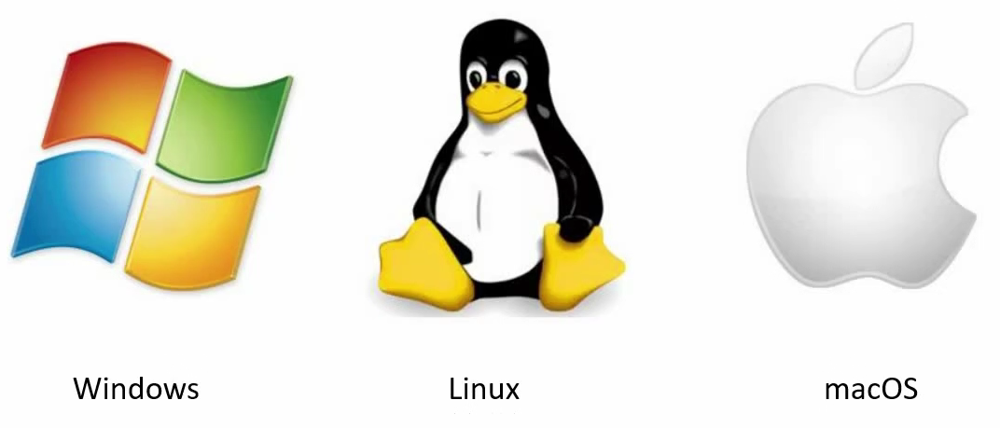
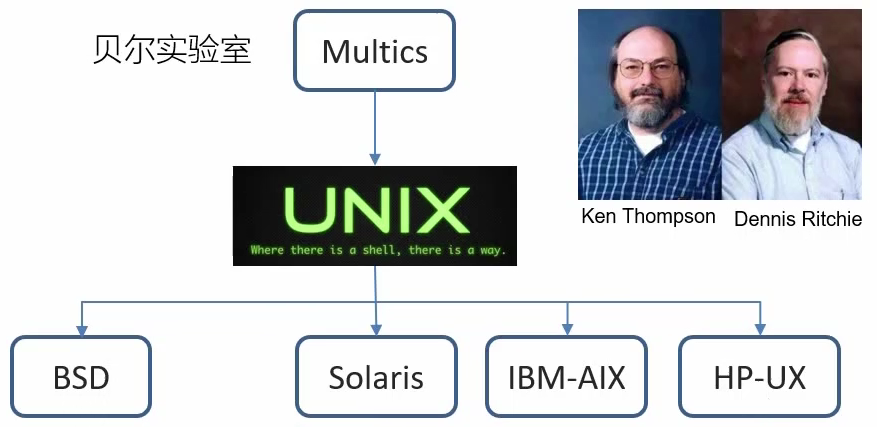
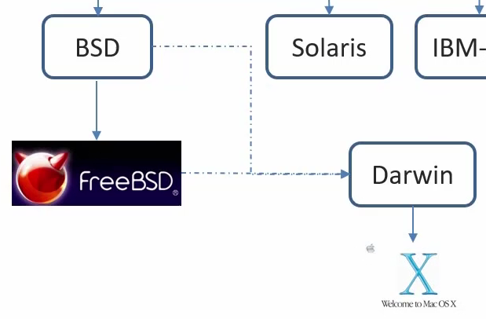
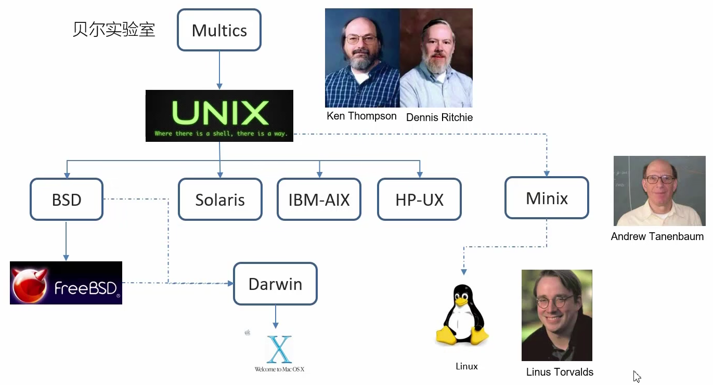
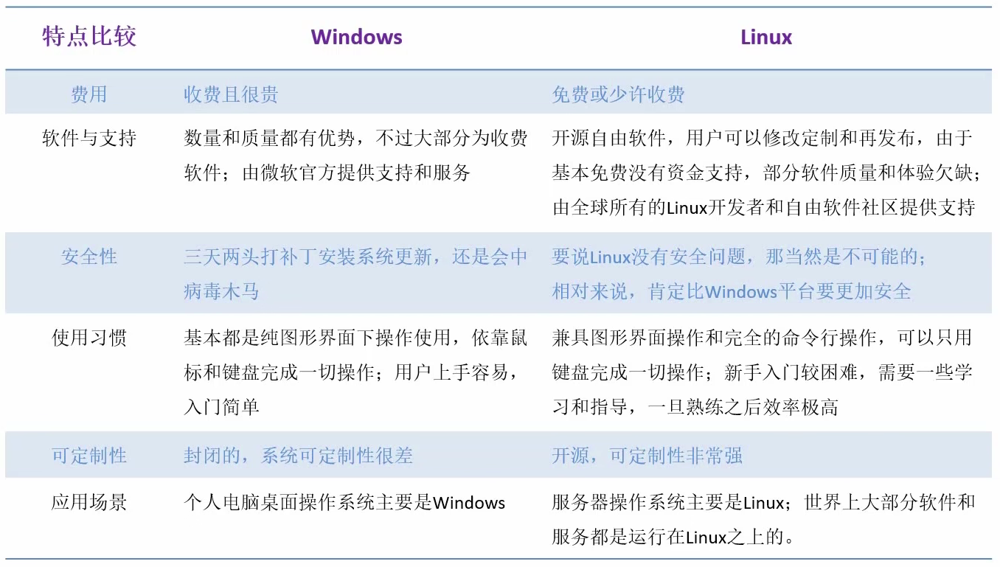
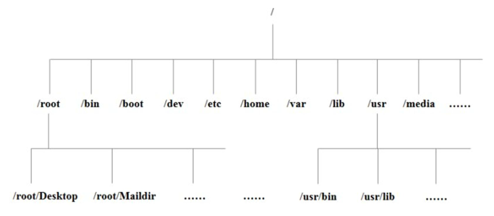
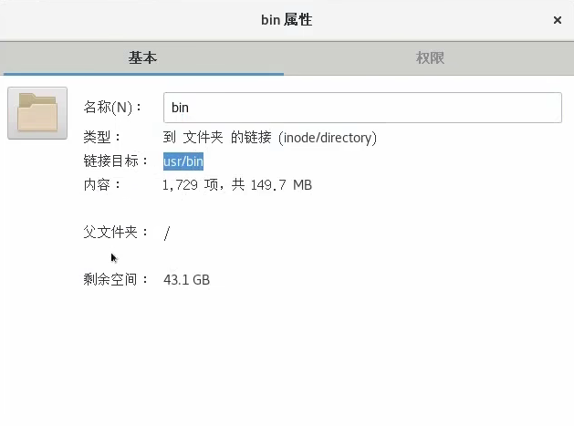
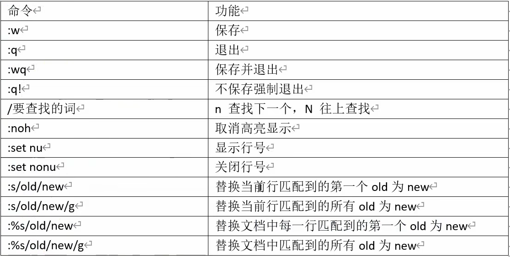

Linux

---

---

## 入门篇

---

### 1、Linux概述

#### 1.1 概述

- Linux是一个操作系统（OS）

  > 底层的**系统软件**

  > 当今三大流行操作系统
  >
  > 
  >
  > > 图中的企鹅名字叫Tux，显得自由散漫、无拘无束

#### 1.2 Linux的诞生

- *Linus Torvalds*

  - 上大学时对Unix产生兴趣
  - 91年初开始基于Minix（Unix的变种）进行开发
  - 1991年6月，确定开发一个类Unix操作系统内核
  - 1991年9月，开发完成内核的0.01版本，命名为Linux

- *Linux* 与 *Unix* 的渊源

  - Unix由贝尔实验室开发，==分时操作系统==

    > 在这之前还有Multics项目，是为解决批处理操作系统的低效问题，开发了**多用户分时操作系统**（时间片轮转）。但这个项目最后失败了

  - Unix是由汇编语言开发的，但开发系统效率较低，所以大神决定开发一门更合适的语言

    - 先开发出了B语言，解释型语言，效率依然低

    - 后开发出了new B语言，成功对Unix内核进行升级改造

      > 而后，new B语言更名为**C语言**

  - 但Unix是非开源的，通常是大型商业公司买来自己开发

    > 从而出现了各种Unix商业发行版：
    >
    > 
    >
    > 但**集群**发展趋势到来后，Sun/Oracle Solaris逐渐被Oracle Linux替代；
    >
    > 
    >
    > 基于BSD，又开发出了FreeBSD
    >
    > > BSD本身就是一个发布协议，方便软件的<u>商业化</u>（允许基于开源开发，再<u>闭源</u>）
    >
    > 基于BSD，又开发出了Darwin，从而有了MacOS的前身

  - 另一位大神（《计算机网络》的作者）参考了Unix的设计，开发出了Minix，并将其<u>开源</u>

  - Linus在使用Minix时觉得其在某些方面有缺陷（比如Minix不能上网），决定自己设计。

    

#### 1.3 GNU/Linux

- Richard Stallman，发起<u>自由软件</u>运动，发起GNU计划

- GNU是递归定义的：GNU's Not Unix。
  它计划开发开源高效的操作系统软件，使得用户可以<u>开源</u>地、完整地使用计算机

  > 有Unix优点的操作系统，**短小精悍**，但要开源免费

- *GNU Genaral Public Licence*，**GNU 通用公共协议证书**

  - **GPL**

  - <u>自由软件发布</u>的协议

  - 开源，但基于开源的开发必须继续开源

    > BSD协议是允许<u>商业化</u>的，所以苹果公司可以基于FreeBSD开发商业化操作系统MacOS

    > GPL强调的是用户权益，BSD强调软件开发者或者公司的权益

- GNU计划到最后，就差一个操作系统内核了。
  91年的时候，Linux开源，加入GNU，组成 ***GNU/Linux***，标志着GNU计划的完美成功

- 狭义上的Linux，指的是 ***Linux Kernel***
  基于这样的内核，可以开发出各种不同的“外围”。
  这样就形成了各种Linux发行版本，统称为GNU/Linux

- 广义上的Linux，指的就是 ***<u>GNU/Linux</u>***

常见的Linux发行版：

- **Red Hat**：追求**高效**而不是界面优美

  - Red Hat Enterprice Linux：企业收费版
  - fedora：社区免费版，实验测试版，可能不够稳定
  - :star:**<u>CentOS</u>**：基于已经发布的企业版，去除版权部分后的<u>社区免费版</u>

- debian：开源系统的典范，十分遵循GNU GPL协议

  - :star2:**<u>ubuntu</u>**：很前沿，可能会有小bug，不稳定；界面优美(偏向MacOS的风格)
    - Linux Mint：基于ubuntu，更像Windows

- SUSE：在欧洲流行，号称最华丽；本身是企业版

  > 桌面环境使用KDE而不是gnome，可能不够稳定，但就是颜值高

  - openSUSE：社区版，基于稳定的SUSE开放出来的

- gentoo linux：性能强悍，但安装十分复杂

- arch linux：轻量级，性能好，但难上手

  - manjaro：友好一些了

> android、鸿蒙底层内核也是Linux

#### 1.4 Linux VS Windows

> Linux操作系统的内核可以小到几百kB，非常适合嵌入式开发

> 总结：
>
> - Linux：继承Unix，**短小精悍**，性能强，稳定性安全性好，开源免费
> - Windows：向用户提供各种服务，满足各种生活需求

---

### 2、Linux安装

> 不可能只安装个Linux kernal的，需要安装**Linux发行版**

#### 2.1 CentOS

包管理系统完备：rpm、yum

> ubuntu的包管理系统是apt

可以扩展非常多的软件，技术文档丰富

目前CentOS 8已经不再更新，CentOS 7会更新到2024年，
在这之后可以去用CentOS Stream，但可能不太稳定

> 毕竟Red Hat是商业公司，但这种做法也有点违背开源的初心；
>
> Rocky将来可能会替代老CentOS，做Red Hat Enterprice Linux稳定的社区免费版

#### 2.2 VM Ware

> 操作系统是运行在**硬件**上的，但直接用真实硬件学习起来又不方便；

> Windows环境下有Windows Subsystem for Linux，但限制多

用软件使用硬件并**模拟硬件**，形成**虚拟机**，在其上可以运行<u>操作系统</u>

> 目前比较流行的还有**容器**的方式，比如Docker

#### 2.3 安装过程

"DIY硬件”：创建虚拟机

- CPU问题

  - 一个主板上通常有几个插槽，就能有几个CPU

  - 一个CPU可以有多个**处理核心**，实现并行

  - 运用HT(超线程技术)，每个内核又可以扩展成为<u>两个逻辑核心</u>

    > 但配置VM时是不会再扩展<u>逻辑核心</u>的，直接把原PC上的逻辑核心当成真正核心。但CPU数量可以配置多个，只要总核心数不超过原电脑逻辑核心数

  > 
  >
  > 虚拟化也是要启用的，不然虚拟机运行不了（如果没启用，需要进入BIOS中设置）

- 网络类型问题

  - 桥接：把原主机当成桥，去连接其他路由器，与原主机地位平等

  - NAT：依托于原主机与外部进行网络连接，把原主机当成路由器，对外表现为同一个IP

    > 这样安全性高一些

安装操作系统：

- 磁盘分区管理

  - Windows：同一块磁盘，默认有4块分区

  - Linux：可以只有根分区`/`，如果想有其他分区，需要**<u>挂载</u>**

    > 一般来说，一定要有一个**引导分区**，挂载点是`/boot`；
    >
    > 还有一个**交换分区**，挂载点是`swap`(没有斜杠)，作为内存的扩展，与内存频繁交换数据
    >
    > 当然根分区`/`是必须有的

    > Linux的磁盘分区管理与目录结构在<u>结构上</u>并不是标准的一对一关系，目录结构更多是逻辑上的结构，但可以通过**挂载**与**挂载点**将它们联系起来；
    >
    > 所以常称Linux的目录为==虚拟目录==

- 文件系统

  - xfs：支持大文件，性能优于ext
  - swap：交换分区专用，对内存交换作了优化

---

---

## 基础篇

---

### 1、文件系统与目录结构

#### 1.1 为什么要规范目录

- 防止文件存储过乱

  > 本来就没有可视化界面

- 文件分门别类存储

#### 1.2 目录结构简述

- Linux 只有一个根目录

  > 根目录就是一个`/`

- Linux 会把==硬件映射成目录==去管理

  > 在 Linux 世界中，==**一切皆文件**==

> 这些目录名基于标准定义的，继承了Unix的设计

#### 1.3 具体目录结构介绍

- `/bin`

  - Binary 的缩写

  - 存放经常使用的**命令**

  - 实际上，bin目录中的内容并没有直接存放在`/`目录下，而是存放到了`/usr/bin`中

    

    > `bin`就像一个超链接

- `/sbin`

  - s ：super user
  - 存放**系统管理员**使用的系统程序
  - 同样也是一个链接，实际链接到`/usr/sbin`

- `/lib`

  - 系统运行所需要的最基本的**动态连接共享库**

    > 类似于 Windows 的 system32 目录，存放 DLL 文件

    > 几乎所有应用程序都需要用到这些共享库
    
  - 本质也是一个链接，链接到`/usr/lib`

- `/lib64`

  - 与`/lib`类似，也是存放**库文件**，只不过是64位操作系统相关的
  - 本质也是一个链接，链接到`/usr/lib64`

- `/usr`

  - 用户**安装**的<u>应用程序</u>、<u>用户相关数据文件</u>等默认存放的目录

    > 类似 Windows C:/program files

  - 也存放了**系统**运行需要的<u>命令文件</u>和<u>库文件</u>

    > 类似 Windows C:/system32

- `/usr/local`

  - 另一个给主机额外**安装程序**所存放的目录

    > 一般是通过编译源码方式安装的程序，相当于用户自己的扩展；
    >
    > 其下也有对应的那4个重要目录

- `/boot`

  - Linux **启动**需要的核心文件

  - 是<u>引导分区</u>的**挂载点**

    > 默认情况下，除了这个`/boot`，其他都在根分区`/`下（`swap`交换分区除外）

- `/dev`

  - 存储所有硬件的文件形式

    > 类似 Windows 的设备管理器

- `/etc`

  - 所有系统管理所需要的**配置文件**及其子目录

    > 比如 mysql 配置文件 my.conf

- `/home`

  - “存放”**普通用户**的目录

    > 每个普通用户都对应一个目录，相当于把普通用户也映射成文件了

- `/root`

  - **系统管理员**目录

    > 将系统管理员映射成文件

- `/opt`

  - 给主机额外**安装第三方软件**所存放的目录，默认为空（所以是optional，可选的）

    > 比如 Oracle、MySQL

- `/media`

  - 挂载 linux 系统自动识别的一些**可移动设备**

    > 例如 U 盘、光驱

  - 移动化存储设备的挂载点之一

- `/mnt`

  - 为了让用户临时挂载别的文件系统
  - 可以将**外部的存储**挂载到`/mnt/`中，然后进入该目录就可以查看
  - 移动化存储设备的挂载点之一

- `/proc`

  - process，进程目录

  - 虚拟的目录，是系统内存中<u>进程的映射</u>

    > 可以访问这个目录来获取**系统信息**

- `/run`

  - 运行目录，存放系统本次<u>运行</u>的<u>实时信息</u>
  - 临时的文件目录，重启后就刷新

- `/srv`

  - service，系统服务相关
  - 服务启动之后需要提取的数据

- `/sys`

  - 系统**硬件**相关信息文件
  - 安装了 linux2.6 内核中新出现的文件系统

  > `/proc`、`/srv`、`/sys` 别动它们；
  >
  > 我们可以动的：tmp、opt、home(或者root)、var、etc、media、mount
  >
  > > 当然也要谨慎修改

- `/tmp`

  - 存放一些**临时**文件

    > 没空间了可以删除其中的文件

- `/var`

  - 可变目录

  - 存放<u>不断扩充</u>着的东西、经常被<u>修改</u>的目录

    > 比如日志相关

- `/lost+found`

  - 一般是空的。系统**非法关机**后会存放一些文件
  - 默认隐藏的，需要 root 用户在终端查看

- `/selinux`

  - 安全子系统

  - 控制程序只能访问特定文件

    > 有三种工作模式，可以自行设置

---

### 2、VI/VIM编辑器

#### 2.1 vi/vim概述

- VI 是 Unix 操作系统和类 Unix 操作系统中最通用的文本编辑器。
- VIM 编辑器是从 VI 发展出来的一个性能更强大的文本编辑器。可以主动的以字体颜色辨别语法的正确性，方便程序设计。VIM 与 VI 编辑器完全兼容。

#### 2.2 模式间转换

#### 2.3 一般模式

​	以 vim 打开一个档案就<u>直接进入一般模式</u>了（这是默认的模式）。在这个模式中， 你可以使用『上下左右』按键来移动光标，你可以使用『**删除**字符』或『**删除**整行』来处理档案内容， 也可以使用『**复制**、**粘贴**』来处理你的文件数据。

> 补充：
>
> - gg：移动的文档开关
> - L：跳转到窗口显示的最后一行
> - r：下一个输入的字符会替换当前字符
> - R：进入连续替换模式

#### 2.4 编辑模式

​	在一般模式中可以进行删除、复制、粘贴等的动作，但是却无法直接编辑文件内容的！要等到你按下『i, I, o, O, a, A』等任何一个字母之后才会进入编辑模式。

​	注意了！通常在Linux中，按下这些按键时，在画面的左下方会出现『INSERT或REPLACE』的字样，此时才可以进行编辑。而如果要回到一般模式时， 则必须要按下『Esc』这个按键即可退出编辑模式。

> o/O是会额外插入一行的

#### 2.5 命令模式

​	在一般模式当中，输入『 : / ?』3个中的任何一个按钮，就可以将光标移动到最底下那一行。

​	在这个模式当中， 可以提供你『搜寻资料』的动作，而读取、存盘、大量取代字符、离开 vi 、显示行号等动作是在此模式中达成的！

> 补充：
>
> - `wq!`常用于对<u>只读文件</u>进行必要修改
> - `:noh`：在`/查找`后取消高亮
> - 

---

### 3、网络配置

---

### 4、系统管理

---

### 5 远程登录

#### 5.1 为什么要远程登录

- Linux 服务器由开发小组共享
- Linux 系统一般在**公网**上

#### 5.2 怎么远程登录

- XShell：Linux终端模拟软件

#### 5.3 怎么上传和下载文件

- Xftp

  > 能完成 XShell 完成不了的文件传输功能

- 注意选择`/opt`目录

---

---

## 实操篇

---

### 1、文件目录类

---

### 2、时间日期类

---

### 3、用户管理类

---

### 4、文件权限类

---

### 5、磁盘分区类

---

### 6、进程线程类

---

---

## 扩展篇

---

### 1、软件包管理

---

### 2、克隆虚拟机

---

### 3、Shell编程