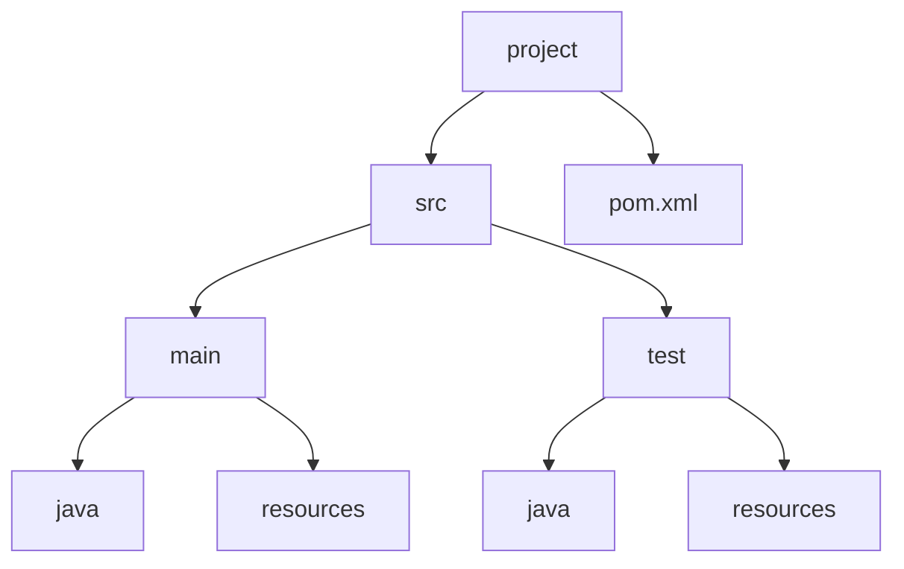
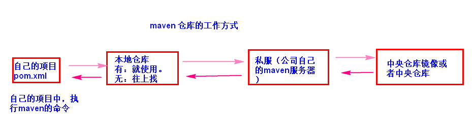
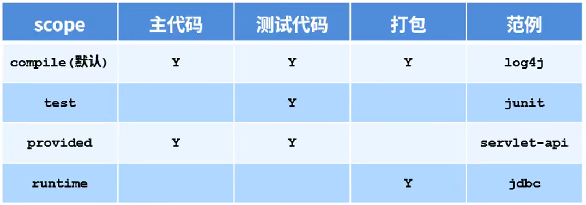
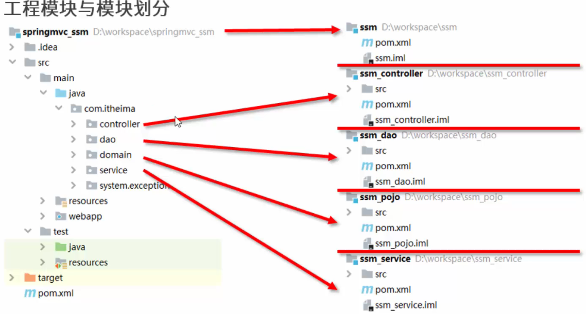
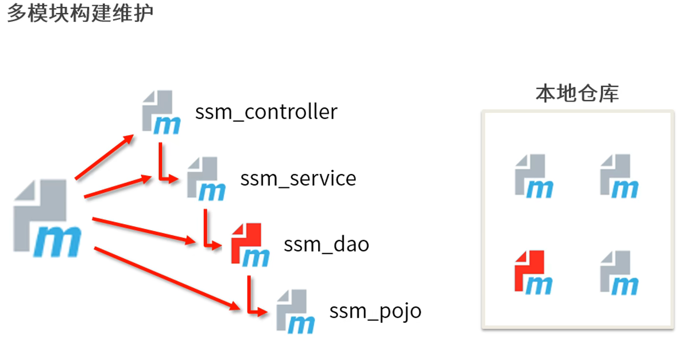
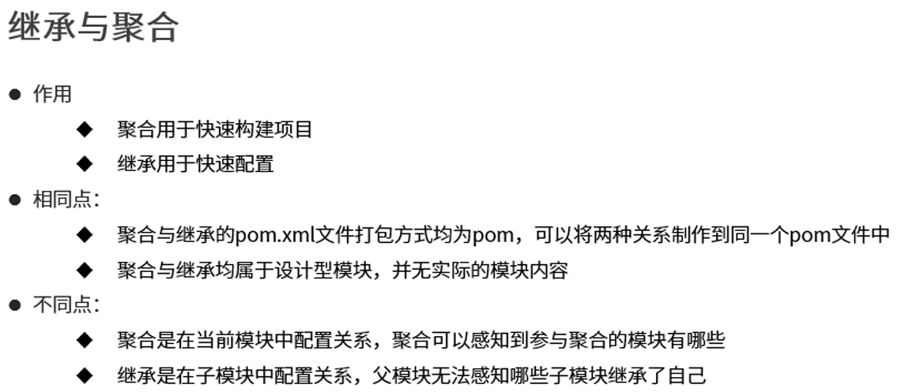

# Maven

---

---

---

## Maven简介

---

---

### 一、软件是一个工程

---

#### (一) 软件工程的概念

- 为了能够实现软件的**流水线**式生产，在设计和构建软件时能够有一种**规范**和**工程化**的方法，人们便提出了软件工程概念

#### (二) 软件开发阶段

1. *需求分析*：分析项目具体完成的**功能**，有什么要求，具体怎么实现
2. *设计阶段*：根据分析的结果，设计项目使用的**技术**，找到项目难点
3. *开发阶段*：**编码**、编译、测试
4. *测试阶段*：测试工程师来**测试**整个项目功能是否符合设计要求
5. *发布阶段*：给用户安装项目

---

### 二、Maven概述

---

#### (一) 什么是Maven

- apache 基金会的开源项目，使用 Java 开发的
- 项目的**<u>自动化构建工具</u>**，管理项目的依赖

#### (二) Maven的作用

- 项目的**自动构建**，帮助开发人员做项目代码的**编译**、**测试**、**打包**、**安装**、**部署**等工作

- 管理**依赖**

  > 依赖：项目中需要使用的其他**资源**（比如 jar 包）

---

---

## Maven核心概念

---

---

### 一、目录结构与第一个项目

---

#### (一) 目录结构



> - main：主程序目录
>   - java：**源代码**
>   - resourses：**配置**文件
> - test：测试程序目录
>   - java：测试代码
>   - resourses：测试程序需要的配置文件
> - pom.xml：maven 的配置文件，核心文件

#### (二) 第一个Maven项目

- 下载 Maven 并配置环境变量

- 按规定创建目录结构

- 在 src/java 下新建包并编写类

- 使用 <u>`mvn compile`</u>命令编译 .java 文件

  > 编译后的文件会放在新生成的 target/classes 目录下

- 进入 target/classes 后，可以使用 java 命令运行文件（注意写**完整类名**）

---

### 二、POM文件

---

#### (一) 什么是 POM

- **POM**：***Project Object Model***，***项目对象模型***
- 将项目的结构和内容抽象成一个模型，在 ***pom.xml*** 文件中构建和描述

#### (二) pom.xml 文件举例分析

```xml
<?xml version="1.0" encoding="UTF-8"?>

<!--project根标签，后面是约束文件-->
<project xmlns="http://maven.apache.org/POM/4.0.0" xmlns:xsi="http://www.w3.org/2001/XMLSchema-instance"
         xsi:schemaLocation="http://maven.apache.org/POM/4.0.0 http://maven.apache.org/xsd/maven-4.0.0.xsd">

    <!--POM模型版本，目前只有4.0.0-->  
    <modelVersion>4.0.0</modelVersion>

    <!--坐标-->
    <groupId>com.bjpowernode</groupId>
    <artifactId>ch01-maven</artifactId>
    <version>1.0-SNAPSHOT</version>
    
    <!--打包类型-->
	<packaging>jar</packaging>
    
    <!--依赖-->
    <dependencies>
        <!--mysql驱动-->
        <dependency>
            <groupId>mysql</groupId>
            <artifactId>mysql-connector-java</artifactId>
            <version>8.0.21</version>
        </dependency>
        <!--日志-->
        <dependency>
            <groupId>log4j</groupId>
            <artifactId>log4j</artifactId>
            <version>1.2.17</version>
        </dependency>
    </dependencies>
    
    <!--设置构建项目相关内容-->
    <build>
        <!--设置插件相关配置-->
        <plugins>
            <plugin>
                <groupId>org.apache.maven.plugins</groupId>
                <artifactId>maven-compiler-plugin</artifactId>
                <version>3.1</version>
                <configuration>
                    <!--指定编译时的jdk版本-->
                    <source>1.8</source>
                    <!--指定运行时的jdk版本-->
                    <target>1.8</target>
                </configuration>
            </plugin>
        </plugins>
    </build>

    
    <properties>
        <java.version>1.8</java.version>
        <maven.compiler.source>1.8</maven.compiler.source>
        <maven.compiler.target>1.8</maven.compiler.target>
    </properties>

</project>
```

---

### 三、坐标(gav)

---

#### (一) 组成

- groupId：组织名称、代码，公司、团体或者单位的标识

  > 通常用公司域名倒写；
  >
  > 如果项目规模比较大，也可以是：域名倒写 + 大项目名

- artifiacId：项目名称

  > 如果 groupId 中有项目，当前值就是子项目名

  > 项目名称是唯一的，应该是有意义的

- version

  > 项目的版本号，使用三位数字：主版本号.次版本号.小版本号

  > 如果版本号中有 -SNAPSHOT （表示快照），是不稳定的版本

#### (二) 作用

- 资源的**唯一标识**
- 在 maven 中，每个资源都对应了一个坐标

#### (三) 使用场景

- 每个 **maven 项目**都需要有自己的 gav
- 管理**依赖**，需要使用其他 jar 包时，也需要用 gav 作为标识

> 在 mvnrepository.com 可以搜索到相关资源的 gav

---

### 四、依赖(dependency)

---

#### (一) 什么是依赖

- 项目中要使用的其他资源，比如 jar 包

#### (二) 怎么使用

- **dependencies 标签**、**dependency 标签**、 **gav 坐标**配合使用

  > 举例：
  >
  > ```xml
  > <dependencies>
  >     <dependency>
  >         <groupId>mysql</groupId>
  >         <artifactId>mysql-connector-java</artifactId>
  >         <version>8.0.21</version>
  >     </dependency>
  > </dependencies>
  > ```

- maven 使用 gav 作为标识，从互联网上下载依赖的 jar 包，由 maven 管理这些 jar 包的使用

---

### 五、仓库

---

#### (一) maven仓库存放什么

- maven 工具自己的 jar 包
- 第三方的 jar 包
- 自己写的程序打包后形成的 jar 包
- ...

#### (二) 仓库的分类

- 本地仓库：位于自己的计算机，磁盘的某个目录

  > 默认位置是家目录下的 .m2/repository

  > 修改本地仓库的路径：
  >
  > 1. 创建一个目录，作为仓库
  >
  > 2. 修改 maven 工具的配置文件：conf/settings.xml
  >
  >    > 新增 localRepository 标签，文本是仓库位置

  > 注意：如果新仓库是空的，使用 mvn compile 命令后，会重新下载资源到仓库中

  > 注意：如果仓库中的 jar 包结尾有 lastUpdated，说明这个 jar 包无法使用

- 中央仓库

#### (三) 仓库的工作方式



---

### 六、生命周期、插件、命令

---

#### (一) 生命周期

- 概念：**项目构建**的各个阶段
- 包括：**清理**、**编译**、**测试**、**报告**、**打包**、**安装**、**部署**
- 要顺利完成各个阶段，就需要借助**命令**和**插件**

#### (二) 插件

- 插件可以理解成 jar 包、一些类

  > 插件与依赖的区别：
  >
  > 依赖是项目本身的一部分，在编译或运行时需要提供
  >
  > 插件只是用于项目构建与开发，运行时不需要

- 执行 maven 命令后的一些**功能**就是插件完成的

- :star:在 pom.xml 中**配置插件**

  ```xml
  <!--设置构建项目相关内容-->
  <build>
      <!--设置插件相关配置-->
      <plugins>
          <plugin>
              <groupId>org.apache.maven.plugins</groupId>
              <artifactId>maven-compiler-plugin</artifactId>
              <version>3.1</version>
              <configuration>
                  <!--指定编译时的jdk版本-->
                  <source>1.8</source>
                  <!--指定运行时的jdk版本-->
                  <target>1.8</target>
              </configuration>
          </plugin>
      </plugins>
  </build>
  ```

  > 不指定这个配置的话，默认使用 JDK1.7

#### (三) ==命令==

> 概念：maven 执行相关功能时，需要命令的指使

##### 0、前置知识：单元测试 junit

- 单元：在 java 中指的是***方法***

  > 一个方法就是一个单元。方法是测试的**最小单位**

- 作用：测试方法是否完成了要求

  > 属于开发人员的自测

- 使用：

  1. 添加 ***junit*** 依赖

  2. 在 **src/test/java** 目录中创建测试类文件

     - 测试类的**包名**与要接受测试的类保持一致
     - 测试类的**类名**一般是 **Test + 要接受测试的类名**

  3. 在类中定义方法，写测试代码

     - **public void**
     - 方法名一般是 **test + 要接受测试的方法名**
     - **无参**

     > 测试类和测试类中的方法应该可以**单独执行**

  4. 利用 Assert 类和 Test 注解

     - 用 @Test 修饰测试方法
     - 利用 Assert.assertEquals 方法判断结果与预期是否一致

> 注：以下命令都是在项目根目录下执行的

##### 1、mvn clean

- 清理命令，删除之前生成的相关数据
- 会删除 **target** 目录

##### 2、mvn compile

- 编译命令，编译 **src/main/java** 下的所有文件
- 编译到类路径中，也就是 ***target/classes***
- 还会将 **src/main/resoures** 中的资源文件拷贝到 ***target/classes*** 中

##### 3、mvn test-compile

- 编译命令，编译 **src/test/java** 下的所有文件
- 编译到测试类路径中，也就是 ***target/test-classes***
- 还会将 **src/test/resoures** 中的资源文件拷贝到 ***target/test-classes*** 中

##### 4、mvn test

- 测试命令，执行 target/test-classes 目录中的程序

- 测试 **src/main/java** 目录中的主程序代码是否符合要求

- 测试时会把之前阶段的必要命令再执行一次

  > 比如 compile、test-compile

- 会生成**测试报告**，放到 target/surefire-reports 目录下

  > 测试失败时会出异常，并阻止其他相关功能的执行

##### 5、mvn package

- 打包项目资源，将 **class 文件**和**配置文件**压缩到一个文件中

  > 是 main 目录中的内容，与 test 无关

  > 默认压缩文件是 jar （web 应用会是 war）

- 在打包之前还会再进行之前的操作：编译、测试

  > 一般来说，在打包之前需要手动清理 mvn clean

- 生成的文件会放到 target 目录下

  > 文件名是：坐标中的项目名-坐标中的版本名.jar

##### 6、mvn install

- 将**项目生成的 jar 包**安装到 maven **本地仓库**中

  > - groupId 中如果有 . 分隔，就会生成嵌套文件夹
  > - artifactId 会成为内部独立的文件夹
  > - version 会成为内部独立的文件夹

##### 7、mvn deploy

- 部署项目

---

---

## Maven在IDEA中的应用

---

---

### 一、IDEA集成Maven

---

#### (一) 什么意思

- IDEA 自带了 Maven，但不好用
- 要让 IDEA 使用自己安装的 Maven

#### (二) 怎么做

- Settings 下找到 Build, Execution, Deployment

- 在Build Tools 下 Maven 中配置 **Maven 路径**

- 在 Runner 中配置 **JRE** 和 **VM Options**

  > 配置 VM Options 是为了防止 maven 下载 archetype-catalog.xml 文件，加快 maven 构建速度
  >
  > ```
  > -DarchetypeCatalog=internal
  > ```

> 可以选择为之后新添加的项目也进行相同设置：Settings for New Projects

---

### 二、IDEA创建Maven版Java工程

---

1. 创建一个 Empty Project
2. 添加一个 Maven 模块
   - 可以选用模板：maven-archetype-quickstart
   - 设置模块名、坐标
   - 等待构建项目......
3. 自行创建 resourses 目录，Make Directory as ... Resources Root
4. 可以创建类和测试类，并且单独执行测试方法，也可以直接运行测试类

> 可以使用右侧的 Maven 工具窗

---

### 三、IDEA创建Maven版WEB工程

---

1. 创建一个 Empty Project

2. 添加一个 Maven 模块

   - 可以选用模板：maven-archetype-webapp
   - 设置模块名、坐标
   - 等待构建项目......

3. 在 main 目录下自行创建 java 目录和 resources 目录，并设置文件夹类型

   > 当然也可以在 src 目录下创建 test 目录，和 test/java 、test/resources

4. 加入 Servlet 相关依赖

5. 配置服务器，选择带有 exploded 的

> WEB项目打包成 war 后，可以直接放到 Tomcat 服务器的 webapps 目录下

---

### 四、IDEA中导入Maven工程(module)

---

1. import module
2. import module from external model
   - 选择 maven
3. 一直 next，直到 Finish
4. 可以在 Project Structures 中进行相关配置

---

---

## 依赖管理

---

---

### 一、依赖范围

---

- 在 **dependency 标签**中，可以用 ***scope* 标签**指定依赖范围

- 依赖范围指定相关依赖在**项目构建的哪个阶段**发挥作用

- scope 可用值

  - compile：**默认**的，**参与项目构建的所有阶段**

    > 编译级依赖会参与打包，打包后会存在于压缩文件中

  - runtime：只在运行时使用(配置成 compile 也行，但不标准)

    > 也就是说，编译时可以不需要，写代码用不着，但运行时必须存在

  - test：仅在**测试**阶段使用

    > 比如 junit

  - provided：项目在部署到服务器后，**服务器自带**相关依赖
  
    > 比如 jakarta.servlet
  
    > 对于这样的依赖，在开发时最好选用与服务器自带的**版本相同的**

> 

---

### 二、依赖传递

---

#### (一) 概念

- 直接依赖
- 间接依赖：被引用的资源依赖其他资源，会被继续引入到当前项目

#### (二) 冲突

- 依赖树中有重复“结点”
- 路径优先：越深优先级越低
- 声明优先：同层配置顺序靠前的优先
- 特殊优先：同一个项目中后写的覆盖先写的

#### (三) 可选依赖

- 对外隐藏所用依赖，也无法间接依赖了
- 添加 **optional 标签**，指定为 true

#### (四) 排除依赖

- exclusions 标签，exclusion 中写排除的坐标

---

---

## Maven常用设置

---

---

- pom.xml 中可以直接编写 properties 标签

- properties 的常用设置：

  ```xml
  <properties>
    <project.build.sourceEncoding>UTF-8</project.build.sourceEncoding>
    <project.reporting.outputEncoding>UTF-8</project.reporting.outputEncoding>
    <maven.compiler.source>1.8</maven.compiler.source>
    <maven.compiler.target>1.8</maven.compiler.target>
  </properties>
  ```

- 全局变量：

  ```xml
  <properties>
  	<全局变量名></全局变量名>
  </properties>
  ```

  ```xml
  ${全局变量名}
  ```

- 使用**资源插件**

  - 关于资源文件的默认规则：

    - src/main/resources 下的目录下的文件拷贝到 target/classes
    - src/main/java 中的**非 .java 文件不会被拷贝**

  - 在 build 标签下，写 resources 标签，在 resources 标签下，写 resource 标签

    ```xml
    <build>
        <!-- 资源-->
        <resources>
            <resource>
                <directory>src/main/java</directory>
                <includes>
                    <include>**/*.properties</include>
                    <include>**/*.xml</include>
                </includes>
                <filtering>false</filtering>
            </resource>
        </resources>
    </build>
    ```


---

---

## Maven高级

---

---

### 一、分模块开发与设计

---

#### (一) 模块划分



#### (二) pojo 拆分

- 直接 Copy ，啥也不依赖

#### (三) dao 拆分

- 需要一些依赖，包括 spring 环境

- 为了使用实体类，需要引入 pojo

  > 当然要先 <u>mvn install</u> pojo 到仓库

#### (四) service 拆分

- spring 环境

- 引入 dao

  > service 与 dao 的 applicationContext 不能重名

#### (五) controller 拆分

- 要有 web 项目的结构

- spring 环境

- controller 和 异常统一处理都要有

- 引入 service

  > 一些配置文件的名字需要修改一下

---

### 二、继承与聚合

---

#### (一) 聚合

> 如果没有聚合，一个模块修改了，其他模块根本感知不到



1. 创建一个总项目，用于聚合子项目

2. 只提供 pom.xml 文件，packaging 标签设置为 pom

   ```xml
   <packaging>pom</packaging>
   ```

3. 定义管理的工程列表

   ```xml
   <modules>
   	<module>../pojo</module>
   	<module>../dao</module>
   	<module>../service</module>
   	<module>../controller</module>
   </modules>
   ```

   > 注：对于简单的**线性依赖关系**，书写上没有先后顺序之分，

#### (二) 继承

1. 创建一个父项目

2. 只提供 pom.xml 文件，packaging 标签设置为 pom

   ```xml
   <packaging>pom</packaging>
   ```

3. 在父工程中**声明**所有依赖

   - 在 <u>***dependencyManagement*** 标签</u>中写 dependencies 标签

   > 线性依赖的四个工程也可以写到父工程中；
   >
   > 子工程在用依赖的时候，还是需要**指明**用哪个的，在父工程中只是声明

4. 在子工程中定义父工程

   - 在 <u>***parent*** 标签</u>中配置父工程坐标

   - 在 <u>***parent*** 标签</u>中配置 <u>***relativePath*** 标签</u>，填写父工程的 pom.xml 

     ```xml
     <relativePath>../root/pom.xml</relativePath>
     ```

   > 子工程的组织 ID 和版本号与父工程保持一致，可以不用写了

5. 子项目的依赖不用再指明**版本号**了

6. 插件的管理也同理

>继承与聚合的区别：
>
>


---

### 三、属性

---

