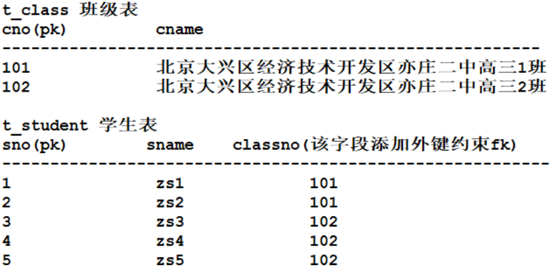
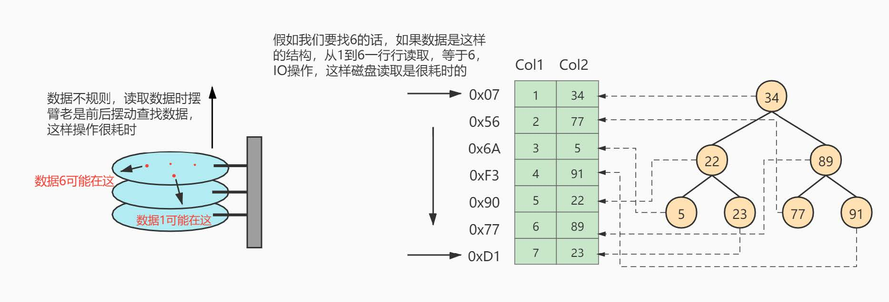
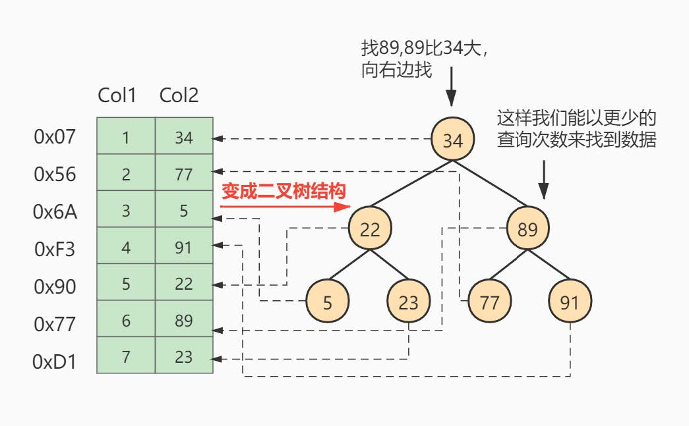
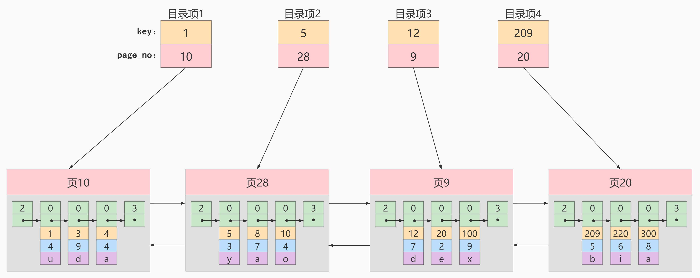
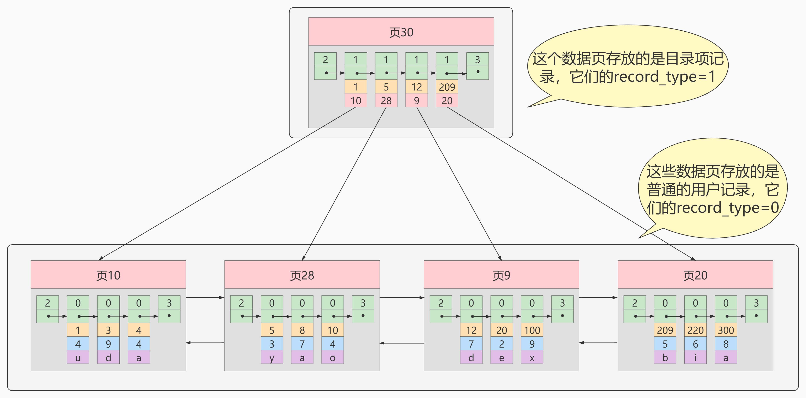
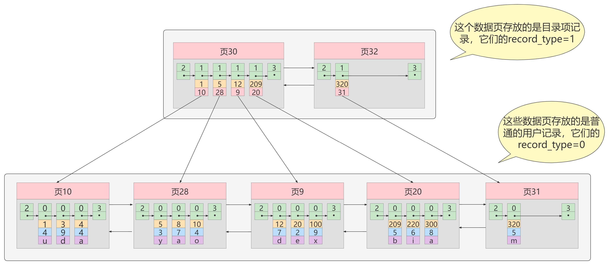
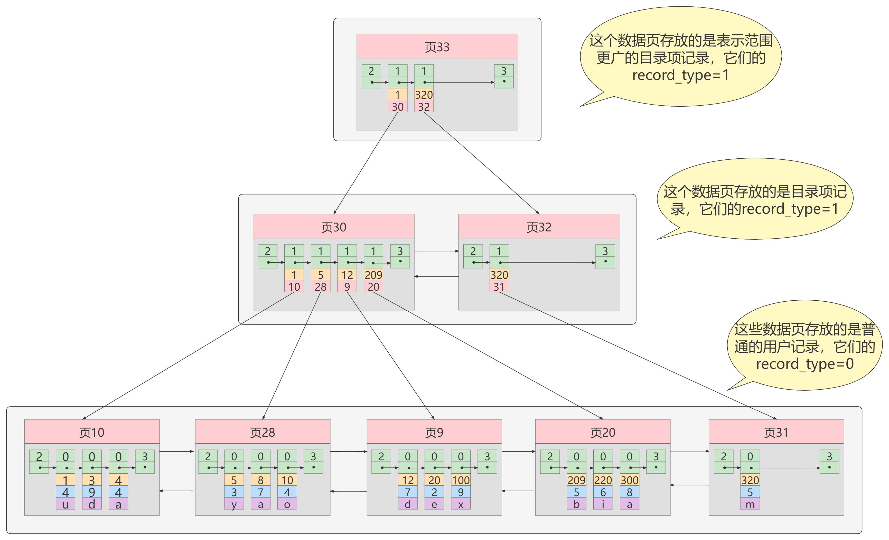
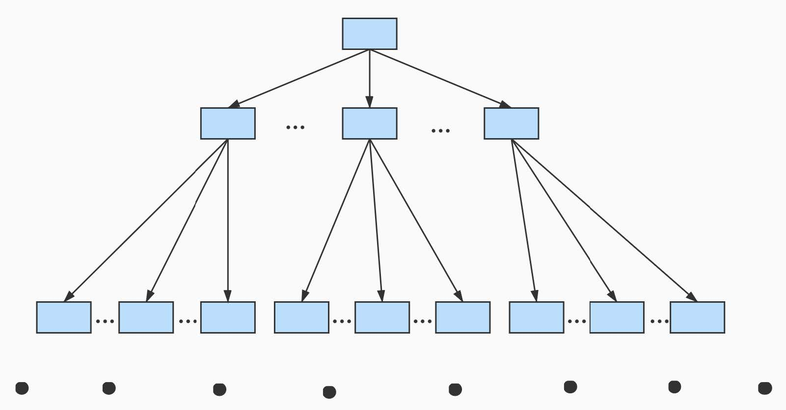
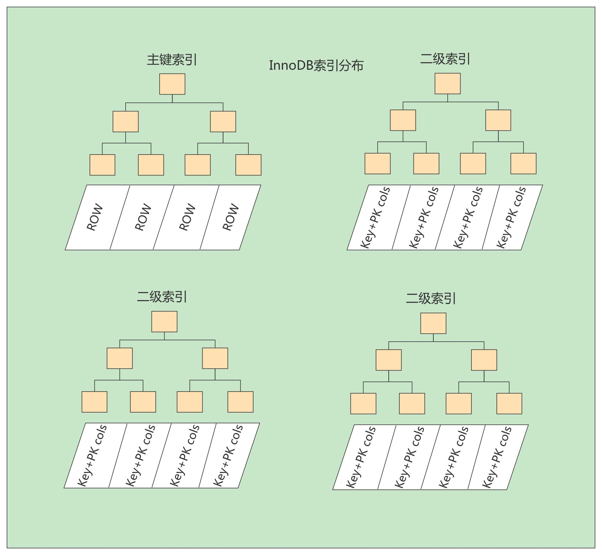

# 入门与概述

---

---

## 1. 相关概念

---

### （1）数据库

- ***DataBase***，简称***DB***
- 按照<u>一定格式</u>存储数据的仓库

### （2）数据库管理系统

- ***DBMS***
- 作用：管理数据库，对数据进行增删改查等操作
- 常见的数据库管理系统
  - MySQL
  - Oracle
  - MS SqlServer
  - DB2
  - sybase
  - ......

### （3）SQL

- ***Structrued Query Language***，结构化查询语言
- 程序员编写SQL语句，DBMS执行SQL语句，从而操作DB
- *分类*：
  - ***DQL***：数据查询语言(`select`)
  - ***DML***：数据操作语言（操作<u>表的数据</u>）(`insert, delete, update`)
  - ***DDL***：数据定义语言（操作<u>表的结构</u>）(`create, drop, alter`)
  - ***TCL***：事务控制语言(`commit, rollback`)
  - ***DCL***：数据控制语言(`grant, revoke`)


### （4）表

- *是什么*：<u>数据库</u>中存储数据的形式
- *为什么用“表”来存储数据*：直观
- *行与列*
  - 行(row)：数据/记录
  - 列(column)：字段；有字段名，数据类型，约束等属性

---

## 2. MySQL的安装与卸载

---

### （1）安装

1. 安装MySQL Server, Typical（经典版）

2. 实例配置

   1. 一路*next*

   2. 注意端口号

      - port，软件的标识，具有唯一性
      - 通常与IP地址结合，IP用来定位计算机，port用来定位软件
      - MySQL默认端口号是3306

   3. 设置字符编码方式为UTF-8

   4. 自动配置Path

   5. 超级管理员用户名别改，最好是***root***，但密码需要设置

      > 同时也可以激活root账号远程访问

### （2）卸载

1. 通过安装包卸载
2. 删除目录
   - C:/ProgramData下面的MySQL目录
   - C:/Program Files (x86)下面的MySQL目录

---

## 3. MySQL服务

---

### （1）查看MySQL服务

1. 右击计算机，点击管理

2. 点击服务和应用程序

3. 点击服务

4. 寻找MySQL

   > 默认启动类型是“自动”

### （2）启停MySQL服务

> 在<u>Windows操作系统</u>中使用命令启停服务

```sh
net start MySQL
```

```shell
net stop MySQL
```

> 其他服务也可以这样启停

### （3）登录MySQL

1. 用bin目录下的mysql.exe来连接MySQL数据库服务器
2. 登录
   - 显示密码：`mysql -uroot -p密码`
   - 隐藏密码：
     1. `mysql -uroot -p\n`
     2. `Enter password: 被隐藏的密码`

---

## 4. 常用命令

---

### （1）MySQL相关

- *登录*：上文
- *退出MySQL*：`exit`
- *查看MySQL版本号*：`select version();`

### （2）数据库相关

- *创建数据库*：`create database 数据库名;`

- *查看所有数据库*：`show databases;`

  ```
  +--------------------+
  | Database           |
  +--------------------+
  | information_schema |
  | mysql              |
  | performance_schema |
  | test               |
  +--------------------+
  ```

- *选择使用数据库*：`use 数据库名`

- *查看当前使用的数据库*：`select database();`

### （3）表相关

- *查看数据库中的表*：`show tables;`
- *导入sql文件中的数据*/*批量执行SQL语句*：`source 数据路径(不能带有中文)`
- *查看表的结构*：`desc 表名;`/`describe 表名;`
- *查看表中所有数据*：`select * from 表名;`

---

---

# ==DQL==

---

---

## 1. 简单查询

---

### （1）一般形式

```sql
select 字段名 from 表名;
```

> 其中`字段名`可以是**多个**，用`,`隔开
>
> 表名只有一个

> `select * from 表名`虽然写起来简单，但效率低（需要将`*`转化），可读性差
>
> 还是<u>写成字段名效率高，可读性强</u>

### （2）起别名

```sql
select 字段名 as 别名 from 表名;
```

> 其中`字段名 as 别名`可以是**多个**，用`,`隔开
>
> 表名只有一个

> 其中的`as`可以**省略**，只用空格隔开`字段名`和`别名`即可
>
> 那别名中有空格怎么办？写成<u>字符串形式</u>

> ==**SQL中字符串形式**==
>
> **最标准**的字符串形式：用单引号括起来
>
> 不太标准但在MySQL中可行的形式：用双引号括起来（在Oracle中不行）

### （3）列参数基本数学运算

- `select`后面的字段名可以结合**算术运算符**进行数学运算

  > 但默认列名也会因此变乱，所以最好要结合`as`**取别名**

---

## 2. 条件查询

---

### （1）语法

```sql
select 字段名 from 表名 where 筛选条件;
```

> 其中`字段名`可以是**多个**，用`,`隔开
>
> 表名只有一个
>
> 筛选条件见下文

### （2）常用筛选条件

- #### *值比较*

  - 等于：`=`

    > 只用一个`=`

  - 不等于：`<>`或`!=`

  - 小于、小于等于、大于、大于等于：`<`、`<=`、`>`、`>=`

  - 闭区间：`between 左端点 and 右端点`

    > 必须左小右大

- #### *判空*

  - 判断是否为空：`is null`、`is not null`

    > 注意，判空不能用`= null`，因为`null`不是值，而是<u>什么也没有</u>

- #### *条件连接*

  - 并且：`筛选条件1 and 筛选条件2`

  - 或者：`筛选条件1 or 筛选条件2`

    > `and`的优先级高于`or`，但可以通过**小括号**规定运算顺序

  - 包含于、不包含于：

    `字段名 in (值1, 值2, ...)`、`字段名 not in (值1, 值2, ...)`

    > `in`相当于`字段名 = 值1 or 字段名 = 值2 or ...`
    >
    > 是具体的值，而不是区间

- #### ==**模糊查询**==

  - 模糊匹配：`字段名 like 模糊匹配信息`

    > 模糊匹配信息：
    >
    > `%`一个百分号可以匹配**任意个**字符
    >
    > `_`一个下划线只能匹配**一个**字符

    > 如果字段名中有`%`或者`_`，要使用反斜杠`\`进行转义

---

## 3. 查询结果排序

---

### （1）语法

```sql
select 字段名 from 表名 where 筛选条件 order by 排序字段名 (desc / asc);
```

> `字段名 (desc / asc)`可以有多个，用`,`隔开
>
> > 注意`desc/asc`也要跟着写多个
>
> `asc`可以省略，因为默认是升序的；但如果想降序，就不能省略`desc`了

### （2）排序条件的顺序

- 先按照前面的字段排序，**如果<u>相等</u>**，再按照后面的字段排序

### （3）字段位置

- （了解）`order by 数字num`：表示根据<u>第`num`列</u>的字段进行排序

  > 不建议这样写，**不健壮**，因为列的顺序很容易发生改变 

---

## 4. 数据处理函数

---

### （1）概述

- 数据处理函数又称为单行处理函数

  > 函数的自变量只涉及一行内的字段值，不涉及其他行

- 特点：==<u>一行中的</u>**一个输入**对应一个输出==

  > 与之相对的就是，多行处理函数，<u>多行中的</u>多个输入对应一个输出

- 用于处理字段值，**字段名**可以写哪，这个函数就可以跟着写哪

  > 也常和`as`**起别名**结合使用

### （2）常用函数

- #### *字符串相关*

  - `lower(字段名)`和`upper(字段名)`：转换大小写
  
  - `substr(被截取的字符串，起始下标，截取长度)`：截取字符串
  
    > 起始下标<u>从`1`开始</u>
  
  - `concat(字段名1, 字段名2, ...)`：字符串拼接
  
  - `length(字段名)`：求长度
  
  - `trim(字段名)`：去除字符串前后空白

> 注意，所有字段，<u>无论是什么类型的</u>，都可以**<u>以“字符串”的形式</u>**参与**函数运算**

>:star:`select`之后如果接一个字面量，会借助`from`的表结构生成一列相同的字面量
>
>（字面量：字符串、数字）
>
>所以，`select`之后可以写字段名的地方也可以直接写一个字面量

> :star::star::star::star::star:
>
> 字段名$\approx$变量名
>
> 字面量$\approx$数据

- #### *数学相关*

  - `round(字段名, 保留的小数位数)`：四舍五入

    > 第二个参数为0表示保留到整数，1表示保留1位小数，-1表示保留到十位

  - `rand()`：产生`0~1`之间的随机数

    > 可以与`round`函数联合起来用
    >
    > 举例：生成100以内随机数
    >
    > ```sql
    > select round(rand() * 100, 0);
    > ```

  - `format(字段名, '格式')`：数字格式化

    > 格式举例：`$999，999`
    >
    > 以`$`**开头**，`9`代表**数字**，`,`代表**分位**，<u>低位不足补0</u>，<u>高位不足空着</u>

- #### *其他*

  - `ifnull(字段名, 字段值为null时替代的新值)`：空处理

    > 这个函数的意义何在？
    >
    > `null`只要参与运算，结果必然还是`null`，必要时需要将`null`换成**有运算意义的值**

  - `case 字段名 when 字段值 then 输出结果 else 输出结果`：分支结构

    > `when...then...`可以有多个，
    >
    > `case`与`when`组合起来可以理解成<u>`if(字段名==字段值)`</u>，`then`就是这个`if`对应的分支了

    > `输出结果`是**同一行的字段名**及其组合

---

## 5. 分组查询

---

### （1）分组查询

- #### *意义*

  - 有时需要**先对数据进行分组再操作**，更方便

- #### *用法*

  - 基础语法：

    ```sql
    select 字段名 from 表 where 筛选条件 group by 分组字段名 having 分组过滤条件 order by 排序字段名 (desc / asc);
    ```

    > :star:==执行顺序==：
    >
    > `from ...` （`join ... on ...`）
    >
    > `where ...`
    >
    > `group by ... having ...`
    >
    > `select ...`（`distinct`）
    >
    > `order by ...`
    >
    > （`limit`）

    > `group by`后面只跟一个`字段名`，即**相同字段值的为一组**
    >
    > 注意，比较特殊的一点是，`group by`就可以使用`select`中的别名了

  - `select`要与`group by`匹配上，即==select后只能出现**分组字段名**和**分组函数**==，不然<u>没意义</u>

    > 在oracle中如果`select`与`group by`不匹配，就直接报错了

  - 可以多个字段**联合分组**，把多个字段联合成一个去看，没有顺序之分

    > <u>参与联合分组的字段</u>都可以直接出现在`select`后
  
  - `having`必须和`group by`联合使用，作用是**进一步过滤掉整个分组**
  
    > :star:优化策略:star:
    >
    > 使用`having`的<u>效率往往较低</u>，因为都已经分完组了却又要扔掉；
    >
    > 所以，能使用`where`过滤的，尽量先用`where`，效率更高
    >
    > （其实就是不同的思考方式）
  
    > 当过滤条件中**必须要用到<u>分组函数</u>**时，就只能用`having`而不能用`where`了

### （2）分组函数

- #### *使用前提*

  - 分组函数也叫多行处理函数
  - 使用前需要进行分组
  - 默认情况下整张表为一组

- #### *常用分组函数*

  - `count(字段名)`：统计组内有几条字段值不为空的记录数

    > 注意：`count(*)`就不会忽略`NULL`了，因为**`*`代表的是整条记录**，而一条<u>有效记录</u>的字段值不可能都是`NULL`

  - `sum(字段名)`：输出组内该字段的字段值之和

  - `avg(字段名)`：输出组内该字段的字段值平均值

  - `max(字段名)`：输出组内该字段的最大字段值

  - `min(字段名)`：输出组内该字段的最小字段值

- #### *注意事项*

  - 分组函数**自动忽略**组内的`NULL`字段值，不需要提前对`NULL`进行处理

  - 分组函数不能使用在`where`子句中

    > 因为执行`where`的时候还没分组呢
    >
    > `Invalid use of group function`

---

## 6. 查询结果去重

---

### （1）语法

```sql
select distinct 字段名 from 表名 ......;
```

> `distinct`关键字必须用在所有字段前面

### （2）联合去重

- `distinct`后面可以接多个字段，代表多个字段联合去重

  ```sql
  select distinct 字段名1, 字段名2, ... from 表名 ......;
  ```

  > 把多个字段看成一个字段即可

---

## 7. ==连接查询==

---

### （1）什么是连接查询

- 从一张表中查询数据，称为单表查询

- 跨表查询，<u>多张表联合进来</u>查询数据，称为**连接查询**

  > 两张相同的表也算多张表

  > 两张表<u>直接接连时</u>如果没有条件限制，会发生**笛卡尔积现象**
  >
  > ```sql
  > select ... from 表1, 表2;
  > ```
  >
  > 这样就会导致表1和表2的直接连接，并发生笛卡尔积现象

### （2）连接查询的分类

- 根据<u>语法年代</u>分类

  - SQL92

    > 1992年出现的语法，非重点

  - SQL99

    > 1999年出现的语法，重点学习

- 根据**表连接的方式**去分类

  - **内连接**
    - <u>等值连接</u>：连接条件是**等量条件**
    - <u>非等值连接</u>：连接条件不是**等量条件**
      - <u>自连接</u>：两张相同的表进行连接
  - **外连接**
    - <u>左外连接</u>（左连接）
    - <u>右外连接</u>（右连接）
  - 全连接（几乎不用）

### （3）内连接

- 借助**条件查询**（SQL92语法）

  - 用法：在`where`子句中，添加<u>连接条件</u>

    > 注意，`where`子句中的字段名前面要加上`表名.`，防止**不同表中的同名字段**引发的冲突

    > 为了<u>提高检索效率</u>，最好也在`select`子句中的字段名前加上`表名.`

    > 也可以在`from`中**给表起别名**，然后在`where`子句和`select`子句中**应用别名**

  - 缺点：匹配次数多；SQL语句结构不浅析，表的**连接条件**和**筛选条件**都在`where`中

    > 拿着<u>一张表的一个字段</u>和<u>另一张表的所有字段</u>进行匹配，**执行效率很低**
    >
    > 所以**减少匹配次数**是很重要的优化手段

- SQL99语法

  ```sql
  select ... from 表1 
  inner join 表2 on 表1和表2的连接条件
  inner join 表3 on 表1和表3的连接条件
  ...;
  ```

  > `join ... on ... `可以有多组
  >
  > `inner`可以省略

  > 优点：结构清晰，表连接的条件（就是`on ...`）是独立的，连接之后如果要继续筛选，可以再添加`where`子句
  
  > 注意，`join...on...`可以理解为`from`中的**一部分**，紧跟着`from`执行，最终将多张表**连接成一张**，然后再执行`where...`、`group by...`、`select...`、`order by...`

### （4）外连接

- #### *概念*

  - 两张表有**主次关系**，有一个<u>主导</u>

  > 内连接是能匹配上就显示到结果中，匹配不上就不显示，两张表没有主次关系；
  >
  > 外连接是**无论能否匹配上**，**“主表”每条记录**都必须显示在结果中，就算<u>这条记录与另一张表的所有记录都匹配不上</u>（当然如果<u>能匹配上不止一条</u>，就**都显示出来**）

- #### *语法*

  ```sql
  select ... from 表1 
  right / left outer join 表2 on 表1和表2的连接条件
  right / left outer join 表3 on 表1和表3的连接条件
  ...;
  ```

  > `join ... on ... `可以有多组，可以<u>与内连接混合</u>
  >
  > `right`代表右外连接，`left`代表左外连接，<u>指向哪边哪边就是“主表”</u>
  >
  > `outer`可以省略

---

## 8. 子查询

---

### （1）概念

- `DQL`语句嵌套`DQL`语句

### （2）应用

- #### *`where`子句中的子查询*

  - 需要利用**子查询结果**进行**筛选**时可以使用
  - 将**整个子查询**用**小括号**括起来，当成`where`子句中的<u>一个值</u>

  > 有时候想在`where`中借助<u>分组函数</u>的作用，可以用**子查询**

  > 一步一步查，下一步要直接用到上一步的结果，这样就建立出了子查询

  > where中的子查询可以使用关键字`all`或`any`，`all`代表所有记录都要满足，`any`代表有一条记录满足即可
  >
  > > `some`和`any`的作用相同 
  >
  > 不使用关键字时，子查询最好是只返回一条结果，此时`select`出来的值就代表整个子查询的值。
  >
  > 多条结果时也可以使用`in`

- *`from`子句中的子查询*

  - :star:技巧：将**子查询结果**当做一张**临时表**
  - 既要**给临时表起别名**，又要**给<u>有函数的字段</u>起别名**，不然会出现混淆

  > 有时候想在`from`中借助<u>分组函数</u>的作用，可以用**子查询**

- *`select`子句中的子查询*

  - 这个子查询**只能返回一条记录**

    > 主要靠子查询中的`where`子句来保证

  - 在这个子查询中也可以使用主查询`from`中的表和别名，但主查询不能用子查询中的表和别名

---

## 9. union与limit

---

### （1）合并查询结果

- *语法*：`union`用在两个`DQL`语句之间

- *作用*：将两个表的**查询结果连接**；相比于连接查询，合并查询结果可以**减少匹配次数**

  > `union`可以将表连接时的“乘法”变成“加法”
  >
  > 举例：
  >
  > 

- *注意事项*：两个结果集的**列数**必须相同（两张表要能摞起来）；**列的数据类型**不一致时，Oracle数据库会报错

---

### （2）:star:取出部分查询结果

---

- *语法*：`select ... from ... where ... group by ... order by ... limit startIndex, length;`

  > `limit`是**从上至下**截取的，下标从 0 开始
  >
  > `startIndex`为0时可以省略

  > MySQL中`limit`在`order by`之后**执行**
  >
  > `limit`也常和`order by`搭配

- *作用*：将**查询结果集的一部分**取出来；通常应用在**查询结果分页**中

- *分页查询的套路*：每页显示pageSize条记录，第pageNo页的`limit`写法

  > `limit (pageNo - 1) * pageSize, pageSize`

---

---

# DDL

---

---

## 1. 数据类型

---

### （1）varchar

- **可变长度字符串**，可以根据<u>实际数据长度</u>**动态分配空间**
- 优点：**节省空间**
- 缺点：需要<u>动态分配空间</u>，速度**慢**
- 最多显示225位

### （2）char

- **定长字符串**，分配**固定长度空间**存储数据，不管实际数据长度是多少
- 优点：不需要<u>动态分配空间</u>，速度**快**
- 缺点：使用不当可能会造成**空间浪费**
- 最多显示225位

> `varchar`与`char`如何选择？
>
> 看实际需求，
>
> 如果数据是**定长的**，可以采用`char`
>
> 如果数据是**可变长度的**，可以采用`varchar`

### （3）int

- **整数型数字**
- 最多显示11位

### （4）bigint

- **长整型数字**

### （5）float

- **单精度浮点型**

### （6）double

- **双精度浮点型**

### （7）date

- **短日期类型**
- 只包括**年月日**

### （8）datetime

- **长日期类型**
- 包括**年月日时分秒**

> `date`与`datetime`具体解释与相关函数：[链接](###（3）date类型数据的插入和查询)

### （9）clob

- **字符大对象**（***Character Large OBject***）

- 最多可以存储**4G**字符串

  > 比如存储<u>一篇文章</u>，存储<u>一个说明</u>

  > 字符串长度超过**225个字符**就必须使用`clob`

### （10）blob

- **二进制大对象**（***Binary Large OBject***）
- 存储<u>图片</u>、<u>声音</u>、<u>视频</u>等**流媒体数据**
- 向该类型字段插入数据必须使用**流**的形式

---

## 2. 操作表

---

### （1）创建表

- #### *基础建表语法*：

  ```sql
  create table 表名(
  	字段名1 数据类型 default 默认值 约束，
  	字段名2 数据类型 default 默认值 约束，
  	...
  	字段名n 数据类型 default 默认值 约束
  );
  ```

  > 可以不写`default 默认值`

  > 表名建议以`t_`或`tbl_`开始，可读性强，**见名知意**
  >
  > 字段名要**见名知意**

- #### *快速建表 / 复制表*

  ```sql
  create table 表名 as 查询语句;
  ```

  > 将查询语句的**查询结果当做一张表**建出来，不仅有**表的框架**，还有**数据**

### （2）删除表

- #### *基础语法*

  ```sql
  drop table 表名;
  ```

  > <u>表不存在</u>时会<u>报错</u>

  ```sql
  drop table if exists 表名;
  ```

  > 当表不存在时**不会报错**

- [截断表](###（3）截断表（属于DDL）)

### （3）修改表结构

> 实际开发中，需求确定后，表一旦设计好，几乎不会再去修改表的结构，这样做的成本也很高，**代价大**

> 如果实在想修改，可以**借助*navicat*工具**

---

## 3. ==表的约束==

---

### （1）概述

- 在**创建表**的时候，可以给表中**字段**加一些**约束**，来保证表中数据的**完整性**和**有效性**
- 约束有哪些？
  - 非空约束：`not null`
  - 唯一性约束：`unique`
  - 主键约束：`primary key`（简称`PK`）
  - 外键约束：`foreign key`（简称`FK`）
  - 检查约束（Oracle支持，MySQL不支持）：`check`

### （2）非空约束

- #### *含义*

  - `not null`
  - 被约束的字段不能为`NULL`

- #### *语法规则*

  - 如果<u>创建表</u>的时候没有给`default`，**插入记录**的时候就必须**给该字段赋值**

  - 只能成为**列级约束**（不能成为<u>表级约束</u>）

    > :star:列级约束：<u>直接加到列后面</u>的约束就称为列级约束
    >
    > > 举例：
    > >
    > > ```sql
    > > create table t_vip(
    > > 	id int,
    > > 	name varchar(255) not null
    > > );
    > > ```
    > >
    > > 例中，`not null`就作为**列级约束**

### （3）唯一性约束

- #### *含义*

  - `unique`

  - 在这个被约束的字段上，所有记录的值必须是**唯一**的

    > 也可以为`NULL`，而且<u>多个`NULL`不算重复</u>

- #### *语法规则*

  - 可以**联合唯一性约束**，只要相关字段<u>联合起来是唯一的</u>即可（即可以作用**表级约束**）

    > 举例：
    >
    > ```sql
    > create table t_vip(
    > 	id int,
    > 	name varchar(255),
    > 	email varchar(255),
    > 	unique(name, email)
    > );
    > ```
    >
    > `name`字段和`email`字段联合起来唯一

    > :star:表级约束：<u>没有直接添加到某一列后面</u>，而是<u>联合了多个字段</u>的约束
    >
    > > 上例中的`unique`就是**表级约束**
    > >
    > > （当然那个括号里只写一个字段也是可以的，也算是表级约束）

  - 可以与`not null`一起使用，在MySQL中，`unique`与`null`共同约束的字段自动被当成**主键**

### （4）:star:主键约束

- #### *含义*

  - `primary`(`PK`)
  - 可以将主键约束理解为“<u>非空约束+唯一性约束</u>”

  > 相关术语：
  >
  > - 主键字段：被主键约束约束的字段
  > - 主键值：主键字段的每一个值

- #### *作用*

  - 表中每一行**记录**的**唯一标识**

  - 任何一张表都应该有主键

    > 在没有主键时，用工具查看表都会给出“缺少主键”的提示

- #### *语法规则*

  - 可以使用**列级约束**，也可以使用**表级约束**

    > 也就是说**单一主键**和**复合主键**均可，但<u>不建议使用复合主键</u>

  - **一张表只能有一个主键约束**

    > 建议使用`int, big int, char`等定长类型字段当主键，不建议使用`varchar`

    > $\rightarrow$自然主键和业务主键：
    >
    > - 自然主键：<u>与业务无关</u>的**自然数**
    >
    >   > 使用较多，因为主键只要**不重复**就行，<u>不需要有特殊意义</u>
    >
    > - 业务主键：主键值与业务紧密关联
    >
    >   > 当业务发生变动时可能影响到主键值

  - :star:自动维护主键值：`auto_increment`

    > 跟在`primary key`后面使用关键字`auto_increment`，表示主键值从`1`开始以`1`自增，这也是一种自然主键

    > 举例：
    >
    > ```sql
    > create table t_vip(
    > 	id int primary key auto_increment,
    > 	name varchar(255)
    > );
    > ```

### （5）外键约束

- #### *含义*

  - `foreign key`(`FK`)
  - 被约束的字段，其字段值只能是**另一张表**中某个字段中存在的**字段值**

  > 相关术语：
  >
  > - 外键字段：被外键约束约束的字段
  > - 外键值：外键字段的每一个值

- #### *应用*

  - 给字段添加外键约束，让字段值相对于另一张表是**有意义**的

  - 可以**防止数据冗余**，帮助<u>联合两张表</u>

    > 这种情况下的两张表就有了“**父子关系**”，添加了**外键约束**的表称为**子表**
    >
    > > 对有父子关系的两张表进行操作时要**遵循一定顺序**，例如：
    > >
    > > - 删除：先删子，再删父
    > > - 新建：先新建父，再新建子

- #### *语法规则*

  - 语法：

    ```sql
    foreign key(外键字段名) references 被引用的表名(被引用的字段)
    ```

    > 遵循这种表级约束的写法即可

  - 外键值可以为`NULL`

  - 被引用来当外键的字段<u>不一定是主键</u>，但**至少是*`unique`***

  > 案例：
  >
  > 
  >
  > ```sql
  > create table t_class(
  > 	classno int primary key,
  > 	classname varchar(255)
  > );
  > create table t_student(
  > 	no int primary key auto_increment,
  > 	name varchar(255),
  > 	cno int,
  > 	foreign key(cno) references
  > )
  > ```


---

---

# DML

---

---

## 1. 插入数据

---

### （1）基础语法

```sql
insert into 表名(字段名1, 字段名2, ..., 字段名n) values(值1, 值2, ..., 值n);
```

> 字段名与值的位置要**一一对应**
>
> 字段名**缺省**为**全部字段**

> `insert`语句执行成功后一定会<u>多一条记录</u>，如果没有指定字段值则都就是**默认值**
>
> 建表时没有指定默认值，<u>所有类型</u>的默认值就都是`NULL`

### （2）规范

- SQL中所有标识符都应**小写**
- 单词与单词之间使用**下划线**连接

### （3）date类型数据的插入和查询

- 将**特定格式**的`varchar`类型转换为`date`类型

  - 语法格式：`str_to_date('字符串日期', '日期格式')`

    > MySQL的日期格式：
    >
    > `%Y` 年
    >
    > `%m` 月
    >
    > `%d` 日
    >
    > `%h` 时
    >
    > `%i` 分
    >
    > `%s` 秒
    >
    > 短日期类型`date`默认格式为：`'%Y-%m-%d'`
    >
    > 长日期类型`datetime`默认格式为：`'%Y-%m-%d %h:%i:%s'`

    > :star:注：如果字符串日期的形式为`'%Y-%m-%d'`（默认格式），就可以自动转换成`date`类型，不需要手动调用`str_to_date`函数了

    > 这个函数常用于`insert`语句**插入日期类型数据**时
    >
    > 举例：
    >
    > ```sql
    > insert into t_user(id, name, birth) values(1, 'zhangsan', str_to_date('1990/10/01', '%Y/%m/%d'));
    > insert into t_user(id, name, birth) values(1, 'zhangsan', '1990-10-01');
    > ```

- 将`date`类型转换成**特定格式**的`varchar`类型

  - 语法格式：`date_format(日期类型字段名, '日期格式')`

    > :star:注：如果查询出日期类型数据时没有调用`date_format`函数，那么默认会以`'%Y-%m-%d'`的格式展示

    > 这个函数常用于**查询日期类型数据**
    >
    > 举例：
    >
    > ```sql
    > select id, name, date_format(birth, '%Y/%m/%d') from t_user;
    > select id, name, birth from t_user;
    > ```

  > 在MySQL中**获取系统当前时间**的方法：`now()`函数，返回的时间类型是`datetime`

### （4）一条语句插入多条记录

- 语法

  ```sql
  insert into 表名(...) values(...), values(...), values(...), ...;
  ```

### （5）将查询结果插入表中

- 语法格式：`insert into 表名 查询语句;`
- 相当于<u>把查询结果当成一张表</u>，<u>摞在下面</u>

---

## 2. 修改数据

---

### （1）基础语法

```sql
update 表名 set 字段名1 = 值1, 字段名2 = 值2, ..., 字段名n = 值n where 更新条件;
```

> 没有`where 更新条件`会导致**所有数据**都被更新

---

## 3. 删除数据

---

### （1）基础语法

```sql
delete from 表名 where 删除条件;
```

> 没有`where 更新条件`会导致**所有数据**都被删除

### （2）delete原理

- **删除数据**，但**存储空间**没有被释放
- 删除**效率低**，但**支持回滚**

### （3）截断表（属于DDL）

- 语法：`truncate table 表名;`

- **效率高**，但**不支持回滚**

  > 适用于<u>彻底删除</u>一张**大表中的数据**（数据没了，表本身还在）
  >
  > （可能用`delete`需要1h才能删完，但`truncate`就1s）


---

---

# 存储引擎

---

---

## 1. 概述

---

### （1）什么是存储引擎

- 存储引擎是表**存储、组织数据的方式**

  > 存储引擎不同，表的存储方式不同

> 存储引擎是 MySQL 中的专属名字，Oracle 中也有，但不叫这个名

### （2）怎么指定存储引擎

- 语法：在**建表时指定存储引擎**和字符编码方式

  ```sql
  create table 表名(
  	字段名1 数据类型 default 默认值 约束，
  	字段名2 数据类型 default 默认值 约束，
  	...
  	字段名n 数据类型 default 默认值 约束
  ) engine=InnoDB default charset=utf8;
  ```

  > MySQL **默认的存储引擎**是 ***InnoDB*** ，默认的字符编码方式是 utf8

> 展示建表时的 sql 语句：
>
> ```sql
> show create table 表名;
> ```
>
> > 显示出来的内容中，ENGINE 等号右侧的就是存储引擎

### （3）查看支持的存储引擎

```sql
show engines \G;
```

> 注意**反斜杠**和**大写的 G** 

> MySQL 支持**九大存储引擎**，但版本不同，支持情况不同

---

## 2. 常用存储引擎

---

### （1）MyISAM

- #### *特点*

  - 优点：
    - 可以被**压缩**
    - 可以转换为**只读表**，节省存储空间
    - **效率高**
  - 缺点：
    - 不支持**事务机制**，安全性低

- #### *如何存储数据*

  - 用**三个文件**存储一个表：

    - **格式文件**：存储表结构的定义

      > 存储到 .frm 文件中

    - **数据文件**：存储表的记录

      > 存储到 .MYD 文件中

    - **索引文件**：存储表上的索引

      > 存储到 .MYI 文件中

      > 索引可以<u>缩小扫描范围</u>，<u>提高检索效率</u>；
      >
      > 有**主键**约束或**唯一性**约束的字段上会自动创建索引

    > MySQL 自带的 <u>mysql 数据库</u>的存储引擎就是 MyISAM ，可以在 MySQL 目录中找到对应文件

### （2）InnoDB

- *特点*

  - 重量级存储引擎

    > MySQL **默认**的存储引擎

  - 支持**事务**机制，支持外键及引用的完整性，包括级联删除和更新

  - 支持 MySQL 服务器崩溃后的自动恢复机制

  - 不能压缩、不能转换为只读，<u>效率不高</u>，<u>不能节省存储空间</u>

  > 最主要的特点：支持**事务**机制，**非常安全**

- #### *如何存储数据*

  - 每个 InnoDB 表**结构**存储在 **.frm 格式文件**中
  - InnoDB 表空间 tablespace 用于存储表的**数据**和**索引**
  - 提供一组用来**记录事务性活动**的**日志文件**

### （3）MEMORY

- *特点*

  - 以前叫 HEAP 引擎（堆引擎）
  - **查询效率极高**，但**不安全**
  - 有表级锁机制

- #### *如何存储数据*

  - 在数据库目录内，每个表均以 .frm 格式的文件表示

  - **数据**和**索引**存储在**内存**中（效率高）

    > 因而与不能包含 TEXT 或 BLOB 字段

    > 一断电数据就消失，很不安全

---

---

# ==事务==

-----

***

## 1. 概述

---

### （1）什么是事务

- 一个事务就是一个**完整的业务逻辑**

- 一个完整的业务逻辑是一个**最小的工作单元**
  
  > 其中的操作要么**同时**失败，要么**同时**成功，否则就会出错
  >
  > > 比如给 A 账户减去 10000 元，再给 B 账户加上 10000 元，这两个操作就是一个最小的工作单元，一个完整的业务逻辑，如果不能同时成功或失败，就出问题了

### （2）DML与事务

- 只有 **DML 语句**与事务相关，其他语句没有

  > 这是因为数据一旦涉及到***insert***、***delete***、***update***，就有可能出现数据**安全问题**
  >
  > 其他操作也不会直接威胁到数据安全

### （3）为什么会存在事务

- 某些事需要**多条DML语句**联合起来才能完成

  > 如果所有事都能用一条DML语句执行，那么事务就没有存在的意义了

- 所以，**本质**上，==一个事务就是多条 ***DML*** 语句**同时成功**或**同时失败**==

### （4）事务怎么做到多条语句同时成功与失败

- InnoDB存储引擎会提供一组用来**记录事务性活动的日志文件**

  > <u>每一条DML</u>都会**记录**到事务性活动的日志文件中

- 事务**分类**：

  - 提交事务*(commit)*：**清空**事务性活动的日志文件，将数据全部**持久化**到数据库表中

    > 提交事务标志着事务的**成功**结束
    >
    > （多条语句同时成功）

  - 回滚事务*(rollback)*：**撤销**之前的全部DML操作，并**清空**事务性活动的日志文件

    > 回滚事务标志着事务的**失败**结束
    >
    > （多条语句同时失败）

  > 也就是说，在提交或回滚前，DML 语句的成功或失败是<u>还没有界定</u>的

***

## 2. 事务行为

---

### （1）默认情况

> 事务自动提交，每执行一条DML语句，就提交一次

> 但为了保证数据安全，不能这样

### （2）关闭自动提交机制/==开启事务==

```sql
start transaction;
```

### （3）==提交与回滚==

```sql
commit;
```

```sql
rollback;
```

---

## 3. 事务特性

---

### （1）A：原子性

- ***Atomicity***

- 事务是最小的工作单元，**不可再分**

- 同一个事务中的所有操作必须**同时**成功或失败

  > 对应到代码层面，commit即同时成功，rollback即同时失败

### （2）C：一致性

- ***Consistency***

- 事务完成时，数据总体上保持和之前的**一致状态**

  > 原子性保证了一致性

### （3）I：隔离性

- ***Isolation***
- 数据库系统提供了事务的隔离机制，两个不同事务之前有一定的**隔离**
- 若干个==并发事务==**不会互相影响**，在**<u>==相对独立==的环境</u>**下运行

### （4）D：持久性

- ***Durability***

- 事务一旦提交或回滚，对**数据库中数据**的影响是永久的

  > 因为数据库中的数据是存储在**磁盘**中的

***

## 4. 事务的隔离性

---

### （1）隔离级别（由低到高）

> 讨论事务隔离级别的前提是两个 MySQL 操作端都**开启了事务**

1. #### 读未提交*(read uncommitted)*

   - 事务A可以读取到事务B**未提交的数据**

     > 当然，B `rollback`之后 A 肯定是不能再读到了

   - 存在的问题：**<u>==脏读现象==</u>**(*Dirty Read*)；读到了脏数据

     > 人家还没提交呢，事务正在进行中，不一定咋回事呢，就读人家的数据，太脏了

   > 这种隔离级别一般是理论上的，大多数数据库隔离级别都是二档起步的

2. #### 读已提交*(read committed)*

   - 事务A在事务B**提交之后**，才会读取到 B 修改后的**数据**

   - 解决的问题：可以解决**脏读**现象

   - 存在的问题：可能**无法重复读取<u>事务开启时候的</u>数据**，**==<u>不可重复读</u>==**

     > 随着事务B的更新，事务A每次读到的数据<u>可能会和之前的不相同</u>
     >
     > > 比如 B 提交之后，数据发生<u>修改</u>了，但此时 A 还没结束，就已经只能读取到 B <u>改完之后的数据</u>，不能重复读到<u>事务刚开启时候</u>的数据


   > 在这种隔离级别下，每一次读到的数据都是**绝对真实**的（因为绝对不是**脏读**）
   >
   > 这也是 ***Oracle* 数据库默认**的隔离级别

3. #### 可重复读*(repeatable read)*

   - 事务每一次读取到的数据都是一致的，都是<u>刚**开启事务**时</u>读取到的数据

     > 先拍个快照，之后事务都是在读快照中的数据

   - 解决的问题：不可重复读取数据的问题

   - 存在的问题：幻影读 —— 每一次读到的数据都是幻象，不够真实。**<u>幻读</u>**


   > 这也是 ***MySQL* 数据库默认**的隔离级别

4. #### 序列化/串行化*(serializable)*

   - 事务**排队**，不能并行

     > 一个事务在操作数据时，另一个事务的命令会**卡住**，直到那个事务**结束**，才会执行

   - 解决了之前的所有问题，每一次读取到的数据都是**最真实**的，但**效率低**

     > 就你一个事务在操作数据，其他人根本影响不到，当然对你来说数据是**真实**的

### （2）设置隔离级别的语法

- 查看事务隔离级别

  ```sql
  select @@tx_isolation;
  ```

- 设置事务隔离级别（设置后需要重启MySQL）

  ```sql
  set global transaction isolation level read uncommitted;
  ```
  ```sql
  set global transaction isolation level read committed;
  ```
  ```sql
  set global transaction isolation level repeatable read;
  ```
  ```sql
  set global transaction isolation level serializable;
  ```

***

# ==索引==

***

## 一、概述

---

### (一)为什么使用索引

- 索引是存储引擎中用于**快速找到记录**的一种**<u>数据结构</u>**

- **<u>先通过索引查找</u>**，不符合再**全表扫描**

  > MySQL的查询方式：
  >
  > - 到 *where* 所指定的字段上去扫描
  >
  > - 两种方式
  >
  >   - **全表**扫描比对
  >
  >   - 根据**索引**检索
  >
  >     > 类似二叉树的查找
  >
  > - 在 MySQL 中索引的底层是 *B-Tree*

> 索引图解：
>
> 
>
> 
>
> > ==减少了**<u>磁盘I/O</u>**的次数==

### (二)索引及其优缺点

- 索引（Index）是帮助MySQL高效获取数据的**数据结构**

  > - 索引是添加在数据库表的**字段**上的
  > - 为了**提高查询效率**而存在的机制
  >
  > > 一个字段可以添加一个索引，<u>多个字段联合</u>也可以添加一个索引

- 索引是在**<u>存储引擎</u>**中实现的

  > 不同存储引擎，索引机制不一定相同；
  >
  > 存储引擎可以定义每个表的**最大索引数**和**最大索引长度**

  > MySQL中，索引是一个**单独的对象**，在不同的存储引擎中以不同的形式存在
  >
  > | 存储引擎 |         索引存储形式         |
  > | :------: | :--------------------------: |
  > |  MyISAM  |     存储在 *.MYI* 文件中     |
  > |  InnoDB  | 存储在表空间 *tablesapce* 中 |
  > |  MEMORY  |    存储在<u>内存</u>当中     |

- *优点*

  - 降低数据库**<u>I/O成本</u>**

    > 每一条记录在硬盘存储上都有一个**物理存储编号**

  - 保证**唯一性** 

    >在MySQL中，**有*unique*约束的字段**上会自动创建索引（当然，主键上也会）

  - 加速**表连接**

    > 找字段更快

  - 减少查询中**分组和排序**的时间

    > order by

- *缺点*

  - 创建索引和维护索引要**耗费时间**

  - 索引需要占**磁盘空间**

  - 降低**更新表的速度**

    > 缺点：索引太多会**降低系统性能**

    > 有一个小技巧，先**删除索引**，再操纵数据，再添加索引

### (三)索引应用场景

适合添加索引的情况：

- **数据量**相对庞大

- 该字段经常出现在*<u>where</u>*子句中

  > 反过来，比较建议通过**有 *unique* 约束的字段**进行查询

- 该字段很少需要 *DML* 操作

  > 如果对添加了索引的字段进行 DML 操作，索引有可能需要重新排序

***

## 二、InnoDB中索引的推演

---

### (一)不使用索引

#### 1、在同一页中查找

> 数据页(***Data Page***)：存储一组记录的最小单位
>
> - 在InnoDB存储引擎中，数据页的大小为16KB
> - 多个数据页会构成**双向链表**
> - 数据页中的数据是**单向链表**

- 以主键为搜索条件：二分法
- 以其他列为搜索条件：依次遍历

#### 2、在多页中查找

- 只能从**第一个页**沿着**双向链表**一直往下找

### (二)InnoDB索引设计方案

#### 1、一个粗糙的设计



> - 可以使用**二分法**查找目录项
> - 如果目录项在**空间存储**上也是连续的，那么增删数据会很不方便(就像**数组**)
> - 所以不妨也设计成下面的样子

#### 2、目录项记录页





> :star:目录项记录和普通的用户记录
>
> 不同点：
>
> - 目录项记录的**<u>record_type 值是1</u>**，而普通用户记录的record_type 值是0。
> - 目录项记录只有<u>**主键值**和**页的编号**两个列</u>，而普通的用户记录的列是用户自己定义的，可能包含很多列，另外还有InnoDB自己添加的隐藏列。
> - 了解：记录头信息里还有一个叫min_rec_mask 的属性，只有在存储目录项记录的页中的主键值
>   最小的目录项记录的min_rec_mask 值为1 ，其他别的记录的min_rec_mask 值都是0 。
>
> 相同点：
>
> 两者用的是一样的**<u>数据页</u>**，都会为主键值生成**Page Directory （页目录**），从而在按照主键值进行查找时可以使用**二分法**来加快查询速度。

#### 3、目录项记录页嵌套





> - 这样就形成了**<u>B+树</u>**
>
> - 但B+树的层次不能太高，因为每次**<u>只加载一片数据页到内存中</u>**，进行**<u>一次I/O</u>**，然后进入**下一层**，再加载一页，太多了就必然会有多次I/O
>
>   > 一般来说B+树不会超过4层：
>   >
>   > ==存放的**用户记录**条数=一个数据页可以存放的**目录项记录**条数^层数-1^$\times$一个数据页可以存放的**用户记录**条数==

### (三)索引相关概念

#### 1、聚族索引

- 聚族索引不是一种索引类型，而是一种**<u>数据存储方式</u>**

  > 索引即数据，数据即索引

- *特点：*

  - 使用**<u>记录主键值</u>**的大小进行记录和页的排序，这包括三个方面的含义：
    - 页内的记录是按照主键的大小顺序排成一个**单向链表**。
    - 各个存放用户记录的页也是根据页中用户记录的主键大小顺序排成一个**双向链表**。
    - 存放**目录项记录的页**分为**不同的层次**，在同一层次中的页也是根据页中目录项记录的主键大小顺序排成一个**<u>双向链表</u>**。
  - **<u>B+树的叶子节点</u>**存储的是完整的用户记录。
    - 所谓完整的用记录，就是指这个记录中存储了所有列的值（包括隐藏列）。

  > 具有这两大特点的B+树就是一种聚族索引
  >
  > 在MySQL的InnoDB中，添加数据时会**<u>用主键自动创建聚族索引</u>**，不需要显示指定

- *优点*

  - **数据访问更快**

    >因为聚簇索引将索引和数据保存在同一个B+树中，因此从聚簇索引中获取数据比非聚簇索引更快

  - 聚簇索引对于主键的**排序查找**和**范围查找**速度非常快

  - 节省了大量的io操作

- *缺点*

  - 插入速度严重依赖于**插入顺序**

    > 按照主键的顺序插入是最快的方式，否则将会出现页分裂，严重影响性能。因此，对于InnoDB表，我们一般都会**==定义一个自增的ID列为主键==**

  - 更新主键的代价很高

    > 因为将会导致被更新的行移动。因此，对于InnoDB表，我们一般**==定义主键为不可更新==**

  - 二级索引访问需要两次索引查找

- 限制

  - ==表中**只能有一个聚族索引**==

    > <u>**主键唯一**</u>

  - 如果没有主键，则会选择<u>**非空的唯一索引**</u> 

    > 如果这样的列都没有，就会隐式定义一个**隐藏列**

  - 为了更好地维护聚族索引，**==建议InnoDB表的主键选择有序自增id==**

#### 2、二级索引

- 简单理解，就是聚族索引的“主键”（搜索键）更换为**另一个字段**，且**叶子不存储一条记录的全部信息**

  > 

- 对比聚族索引和非聚族索引

  - 叶子节点不同，非聚族索引存储的是**数据位置**，而不是记录本身

    > 如果都存储记录，那就冗余了；
    >
    > 其实就是存一个**主键**，通过主键快速定位记录

  - 使用聚族索引时**<u>查询</u>**效率高，而**<u>非聚族索引的增删改效率高</u>**

    > 如果用非聚族索引进行记录的完整查询操作，就需要**回表**了

#### 3、联合索引

- 就是两个列联合起来，先排序一个，再排序另一个，建立一个**二级索引**

### (四)InnoDB的B+树索引

- **根数据页**（根目录项页）位置不变

  > B+树的构建是其实是根数据页和其他数据页**<u>分裂</u>**而来的，分裂之后的数据页就变成存储目录项的了

- 要保证内节点中目录项记录的**唯一性**


(二)使用索引的语法

1、索引的创建与删除

```sql
create index 索引名 on 表名(字段名);
```

```sql
drop index 索引名 on 表名;
```

2、查看一条SQL语句是否通过索引进行检索

```sql
explain select ... from ... where ... ...
```

```dos
用索引和不用索引两种结果对比
+------+---------------+------+---------+------+------+
| type | possible_keys | key  | key_len | ref  | rows |
+------+---------------+------+---------+------+------+
| ALL  | NULL          | NULL | NULL    | NULL |   14 |
+------+---------------+------+---------+------+------+
+------+-----------------+-----------------+---------+-------+------+
| type | possible_keys   | key             | key_len | ref   | rows |
+------+-----------------+-----------------+---------+-------+------+
| ref  | emp_ename_index | emp_ename_index | 33      | const |    1 |
+------+-----------------+-----------------+---------+-------+------+
```

---

4. 索引失效

- 在**模糊查询**中使用**"%"作为开头**会使索引失效；所以要尽量避免这种查询

  ```sql
  explain select * from emp where ename like '%ing';
  +------+---------------+------+---------+------+------+
  | type | possible_keys | key  | key_len | ref  | rows |
  +------+---------------+------+---------+------+------+
  | ALL  | NULL          | NULL | NULL    | NULL |   14 |
  +------+---------------+------+---------+------+------+
  ```

- 使用 ***or*** 时，其中有一个字段没有索引，就会使另一个字段的索引也失效；所以建议**少用 or**

  > 也可以使用*union*改进

  ```mysql
  explain select * from emp where ename = 'king' or job = 'manager';
  +------+-----------------+------+---------+------+------+
  | type | possible_keys   | key  | key_len | ref  | rows |
  +------+-----------------+------+---------+------+------+
  | ALL  | emp_ename_index | NULL | NULL    | NULL |   14 |
  +------+-----------------+------+---------+------+------+
  ```

- **复合索引没有**使用**左侧**列查找时，索引失效

  ```mysql
  create index emp_job_sal_index on emp(job, sal);
  explain select * from emp where job = 'manager';
  +------+-------------------+-------------------+---------+-------+------+
  | type | possible_keys     | key               | key_len | ref   | rows |
  +------+-------------------+-------------------+---------+-------+------+
  | ref  | emp_job_sal_index | emp_job_sal_index | 30      | const |    3 |
  +------+-------------------+-------------------+---------+-------+------+
  explain select * from emp where sal = 800;
  +------+---------------+------+---------+------+------+
  | type | possible_keys | key  | key_len | ref  | rows |
  +------+---------------+------+---------+------+------+
  | ALL  | NULL          | NULL | NULL    | NULL |   14 |
  +------+---------------+------+---------+------+------+
  ```

- 在 *where* 子句中索引字段参加了**运算**会使索引失效

  > 运算可以是简单的数学运算，也可以是函数运算

  ```mysql
  create index emp_sal_index on emp(sal);
  explain select * from emp where sal + 1 = 800;
  +------+---------------+------+---------+------+------+
  | type | possible_keys | key  | key_len | ref  | rows |
  +------+---------------+------+---------+------+------+
  | ALL  | NULL          | NULL | NULL    | NULL |   14 |
  +------+---------------+------+---------+------+------+
  explain select * from emp where lower(sal) = 800;
  +------+---------------+------+---------+------+------+
  | type | possible_keys | key  | key_len | ref  | rows |
  +------+---------------+------+---------+------+------+
  | ALL  | NULL          | NULL | NULL    | NULL |   14 |
  +------+---------------+------+---------+------+------+
  ```

- ...（还有许多情况，不再列举了）

***

5. 索引的分类

- 单一索引：一个字段上添加索引

- 复合索引：多个字段上添加索引

- 主键索引：主键上添加索引

- 唯一性索引：具有*unique*约束的字段上添加索引

  > 唯一性比较弱的字段上添加索引的用处不大

***

# 视图

***

## 1. 概述

- view：站在**不同的角度**看待**同一份数据**

***

## 2. 语法

- 创建视图

  ```mysql
  create view 视图名 as select ... from ... ...; # as后面必须是DQL语句
  ```

  > 可以是多表连接的查询

- 删除视图

  ```mysql
  drop view 视图名;
  ```

***

## 3. 作用

- 可以<u>面向视图对象</u>进行增、删、改、查

- 对视图进行操作会**影响到原表数据**

  > 可以把视图理解成原表的**引用**，<u>把视图当成表来操作</u>就好，只是会影响到原表数据

  > 视图对象也是**存储在硬盘上**的，不是断电就消失

- :star:重要作用：==**包装 *SQL* 语句**==

  > 可以把比较长的 **SQL 语句**以**视图对象**的形式创建出来，一个引用（视图）指向多条 SQL 语句，就可以对这些 SQL 语句进行<u>重复利用</u>

> *CRUD*：*Create、Retrieve、Update、Delete*

***

# DBA常用命令

***

## 1. 新建用户

```sql
create user 用户名 identified by '密码';
```

***

## 2. 授权

***

## 3. 回收权限

***

## 4. 导入导出（重点掌握）

### （1）导出

- 在Dos命令行中（要退出MySQL）

  - 导出数据库
  
	  ```sh
    mysqldump 数据库名>盘符开始的文件路径.sql -uroot -p密码 
    ```
  
  - 导出表
  
    ```shell
    mysqldump 数据库名 表名>盘符开始的文件路径.sql -uroot -p密码
    ```
  

### （2）导入

1. **登录** MySQL

2. **创建数据库**：`create database 数据库名;`

3. **使用**数据库：`use 数据库名`

4. **初始化**数据库：`source 盘符开始的根目录`

***

# ==数据库设计的三范式==

***

## 1. 概述

#### （一）是什么、有什么用

- 数据库表的**设计依据**
- 可以避免表中**数据的冗余**和**空间的浪费**
- 保证表中数据的**正确性**，进行合适的约束检查

#### （二）三个范式

> 范式(***Normal Form***)：在**<u>关系型数据库</u>**中，关于数据表设计的基本**原则**、**规则**

- *第一范式*：要求任何一张表必须有**主键**，每一个字段原子性**不可再分**

- *第二范式*：建立在第一范式的基础之上，要求所有非主键字段**完全依赖主键**，不要产生**部分依赖**

- *第三范式*：建立在第二范式的基础之上，要求所有非主键字段**直接依赖主键**，不要产生**传递依赖**

***

## 2. 第一范式

- 最核心、最重要的范式，所有表的设计都要满足
- 要求任何一张表必须有**<u>主键</u>**，每一个字段**<u>原子性</u>**不可再分

> 举例：不符合第一范式的表改进成符合第一范式的表
>
> 

***

## 3. 第二范式

- 建立在**第一范式**的基础之上，要求所有非主键字段**<u>完全依赖</u>**主键，不要产生**部分依赖**

  > 部分依赖：
  >
  > 在两个字段**<u>复合主键</u>**时可能产生，某条记录的某个字段只依赖<u>**联合**主键中的**一个字段**</u>
  >
  > 通俗解释部分依赖：只看<u>复合主键中的一个字段</u>就可以确定该字段的值了
  >
  > > 可能导致的问题：
  > >
  > > - **<u>数据冗余</u>**：为了一个主键的信息，不得不把另一个主键的信息再次存储一遍
  > > - **<u>插入、删除异常</u>**
  
  > :star:解决方法：
  >
  > 使用三张表来表示A与B**<u>多对多</u>**的关系
  >
  > > 多对多：A 可以有多个 B ，B 也可以有多个 A
  >
  > A表、B表、AB关系表
  >
  > AB关系表中使用两个**外键**
  >
  > ==<u>**多对多**，**三张表**，**关系表两个外键**</u>==

> 举例：不满足第一范式，改进成满足第二范式
>
> 
>
> > “张三”只依赖学生编号，“王老师”和“赵老师”只依赖教师编号；
> >
> > “张三”重复了，“王老师”和“赵老师”重复了
>
> 
>
> 

***

## 4. 第三范式

### (1) 3NF

- 建立在**第二范式**的基础之上，要求所有非主键字段**直接依赖**主键，不要产生**传递依赖**

  > 通俗解释传递依赖：表中有**两个非主键字段**，其中一个字段完全<u>可以当作</u>另一个字段的“**主键**”
  
  > ==<u>**一对多**，**两张表**，**多的表加外键**</u>==

> 举例：满足第二范式但不满足第三范式，改进成满足第三范式
>
> 
>
> 

### (2)巴斯-科德范式(BCNF)


---

## 5. 总结

- 一对多：一对多，两张表，多的表加外键

- 多对多：多对多，三张表，关系表两个外键

- 一对一：

  - 在实际开发中，一张表的<u>字段可能太多</u>，需要**拆分表**

  - ==一对一，**外键唯一** （*fk+unique*）==

    > “共享主键”这种方法已经很少用了，一般都是拆表之后，在一张表上添加一个有`unique`修饰的外键

- 三范式是理论，会与实践有偏差
  - 有时会用冗余换执行速度（因为表连接的效率较低），**空间换时间**
  - 一张表时编写SQL语句也会简单些

  > 主要是为了满足客户需求


