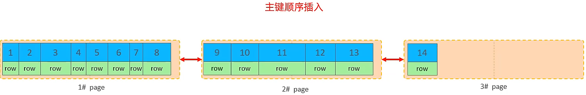

# MySQL高级

---

## 存储引擎

### 一、MySQL体系结构

#### (一) 体系结构图


#### (二) MySQL Server 分层结构

- *连接层*

  > 客户端的连接处理、**认证授权**相关操作、安全方案、最大连接数

- *服务层*

  > 核心，有SQL相关接口，负责SQL解析和优化

- *存储引擎层*

  > 可插拔的存储引擎；
  >
  > 服务器会通过*API*与存储引擎进行交互

  > 注意，**索引**是在存储引擎层实现的

- *存储层*

  > 就是真正存储数据的

#### (三) 各层工作概述

- 连接层
  - 最上层是一些客户端和<u>链接服务</u>
  - 主要完成一些类似于**连接处理**、**授权认证**、及相关的**安全方案**
  - 服务器也会为安全接入的每个客户端验证它所具有的**操作权限**
- 服务层
  - 第二层架构主要完成大多数的<u>核心服务功能</u>
  - 如*SQL*接口，并完成缓存的查询，SQL的分析和优化，部分内置函数的执行
  - 所有跨**存储引擎的功能**也在这一层实现，如过程、函数等
- 引擎层
  - 存储引擎真正的负责了<u>*MySQL*中数据的存储和提取</u>，
    服务器通过*API*和存储引擎进行通信。
  - 不同的存储引擎具有不同的功能，
    这样我们可以根据自己的需要，来选取合适的存储引擎
- 存储层
  - 主要是<u>将数据存储在文件系统</u>之上，并完成**与存储引擎的交互**

---

### 二、存储引擎简介

#### (一) 概念

- 存储引擎就是**存储数据**、**建立索引**、**操作数据**等技术的实现方式

- ==存储引擎是基于**数据表**的==，而不是基于库的，所以存储引擎也可被称为**表类型**

  > 表的默认存储引擎是*InnoDB*

#### (二) 相关语法

- 在**创建表**时指定**存储引擎**

  ```sql
  create table 表名(
      字段1 字段1类型 [comment 字段1注释]
      ...
      字段n 字段n类型 [comment 字段n注释]
  ) engine = innodb [comment 表注释];
  ```

- 查看当前数据库支持的存储引擎

  ```sql
  show engines
  ```


---

### 三、存储引擎特点

#### (一) InnoDB

- *简介*

  InnoDB是一种兼顾**高可靠性**和**高性能**的通用存储引擎

  > 在MySQL 5.5之后，InnoDB是 默认的MySQL存储引擎。

- *特点*

  - DML操作遵循ACID模型，支持**事务**
  - **行级锁**，提高并发访问性能
  - 支持**外键**FOREIGN KEY约束，保证数据的完整性和正确性

  > 总结：事务、行级锁、外键（这也是官方对InnoDB的Comment）

- *磁盘文件*

  ==***ibd* 表空间文件**==

  innoDB引擎的每张表都会对应这样一个表空间文件【***xxx.idb***，xxx代表<u>表名</u>】，
  存储该表的**表结构**(frm、 sdi)、**数据**和**索引**。

  > .frm是**表结构**文件，MySQL8.0后，frm存储在sdi数据字典中，而sdi又融入到ibd中

  > 一个重要参数：`innodb_file_per_table`
  >
  > 决定到底是多张表<u>共享**表空间文件**</u>，还是每张表对应一个（默认）

  > 命令：`idb2sdi xxx.ibd`，查看**表结构**

- *逻辑存储结构*

  

  > ==页==包含**索引页**和**数据页**，是<u>磁盘操作的最小单元</u>；
  >
  > 页的大小是固定的16K，区的大小是固定的1M；
  >
  > > 一个区可以包含64页

#### (二) MyISAM

- *简介*

  MyISAM是MySQL早期的默认存储引擎

- *特点*

  - 不支持事务，不支持外键
  - 支持表锁，不支持行锁
  - 访问速度快

- *磁盘文件*

  - xxx.sdi：存储**表结构**信息

    > 文本文件，存放JSON格式数据

  - xxx.MYD：存储**数据**

  - xxx.MYI：存储**索引**

#### (三) Memory

- 简介

  Memory引擎的表数据是存储在**内存**中的，由于受到硬件问题或断电问题的影响，只能将这些表作为<u>临时表</u>或<u>缓存</u>使用。

- 特点

  - 内存存放，访问速度快
  - 支持hash索引（默认）

- 磁盘文件

  - xxx.sdi：存储**表结构**信息

  > **数据**是存放在**内存**中的，与磁盘文件无关

> 三种存储引擎对比：
>
> 

---

### 四、存储引擎选择

#### (一) 选择原则

在选择存储引擎时，应该根据应用系统的特点选择合适的存储引擎。对于复杂的应用系统，还可以根据实际情况选择多种存储引擎进行组合。

#### (二) 应用场景

- ***InnoDB*** 

  > Mysql的默认存储引擎，支持事务 、外键。

  如果应用对**事务的完整性**有比较高的要求，在并发条件下要求**数据的一致性**，
  数据操作除了<u>插入和查询</u>之外，还包含很多的**更新、删除**操作，
  那么InnoDB存储引擎是比较合适的选择。

- ***MyISAM***

  如果应用是以读**操作**和**插入**操作为主，只有很少的<u>更新和删除</u>操作，
  并且对**事务的完整性、并发性**要求不是很高，
  那么选择这个存储引擎是非常合适的。

- ***MEMORY***

  > 将所有数据保存在内存中，访问速度快

  通常用于**临时表**及**缓存**；

  MEMORY的缺陷就是**对表的大小有限制**，太大的表无法缓存在内存中，
  而且无法保障**数据的安全性**。

> 在实际应用中，MyISAM常被**MongoDB**替代，MEMORY常被**Redis**替代

---

---

## 索引

### 一、索引概述

#### (一) 概念

- 索引是帮助MySQL**高效获取数据**的**<u>数据结构</u>**（有序）

  > 在数据之外，数据库还维护着**满足特定查找算法**的数据结构；
  >
  > 这些数据结构以**引用**的方式指向数据，这样就可以在其上使用**高效的查询算法** 

> 举例理解索引的作用：
>
> 

#### (三) 索引的特点

- *优点*

  - 提高**查询效率**，降低**<u>I/O成本</u>**

  - 通过索引排序可以降低**<u>分组和排序成本</u>**，降低CPU的消耗

    >比如order by、group by

- *缺点*

  - 索引列也需要**占用磁盘空间**

    > 但磁盘便宜

  - <u>更新表</u>时**维护索引**，降低效率

    > 但正常的业务不会有太多的更新表

---

### 二、索引结构

> MySQL的索引是在**<u>存储引擎</u>**层实现的，不同的存储引擎有不同的结构

#### (一) 索引结构分类


#### (二) 索引结构支持情况


#### (三) B树

- B-Tree：多路平衡查找树

  > 解决<u>二叉树形成链表</u>的问题，解决红黑树<u>大数据量层级较深</u>的问题
  >
  > 
  >
  > 
  >
  > 

- B树高度问题

  > 
  >
  > 
  >
  > 
  >
  > > 关键：**<u>分叉数</u>**和**关键字数**

- B树的插入和删除

  - 在插入key后，若导致原结点关键字数超过上限，则从**<u>中间位置</u>**将其中的关键字分为两部分,左部分包含的关键字放在原结点中，右部分包含的关键字放到新结点中，中间位置的结点插入原结点的**<u>父结点</u>**

    > 中间位置指的是$\lfloor\frac m2\rfloor$

  - 删除

    - 若被删除关键字在**<u>终端节点</u>**，则直接删除该关键字

      > 要注意节点关键字个数是否低于下限

    - 若被删除关键字在**<u>非终端节点</u>**，则用**<u>直接前驱</u>**或**<u>直接后继</u>**来替代被删除的关键字

      >直接前驱:当前关键字左侧指针所指子树中“最右下”的元素
      >
      >直接后继:当前关键字右侧指针所指子树中“最左下”的元素

      >对**<u>非终端</u>**结点关键字的删除，必然可以转化为对**<u>终端</u>**结点的删除操作

    - 若删除后关键字个数低于下限，

      - 兄弟够借，且与此结点右(或左)兄弟结点的关键字个数还很宽裕，则需要调整该结点、右(或左)兄弟结点及其双亲结点(**<u>父子换位法</u>**) 

        > 找**<u>后继</u>**，找**<u>前驱</u>**

      - 兄弟不够借，且此时与该结点相邻的左、右兄弟结点的关键字个数均达到下限则将关键字删除后与左(或右) 兄弟结点及**<u>双亲结点</u>**中的关键字进行合并

        > **<u>合并兄弟和双亲</u>**

#### (四) MySQL中的B+树索引

- MySQL索引数据结构对经典的B+Tree进行了优化，在原B+Tree的基础上,增加一个指向相邻叶子节点的链表指针，就形成了带有顺序指针的B+Tree,提高<u>**区间访问的性能**</u>。

  > 叶子节点之间形成了**<u>双向链表</u>**

#### (五) Hash索引结构

- 哈希索引就是采用一定的hash算法，将键值换算成新的hash值，映射到对应的槽位上，然后存储在hash表中

  > 同时会用**<u>拉链法</u>**解决冲突问题

> Hash索引特点：
>
> - Hash索引只能用于**<u>对等比较</u>**(<u>=，in</u>)， 不支持范围查询(between, >，<, ...)
>
> - 无法利用索引完成**<u>排序</u>**操作
>
>   > hash值可能是无序的
>
> - 查询效率高，通常只需要一次检索就可以了，效率通常要高于B+tree索引

> 存储引擎支持情况：
>
> 在MySQL中，支持hash索引的是**<u>Memory引擎</u>**
>
> InnoDB中 具有**<u>自适应hash功能</u>**，hash索引是存储引擎根据B+Tree索引在指定条件下自动构建的。


---

### 三、索引分类

#### (一) 按字段分类


> - 有主键约束的自动会**自动创建主键索引**	
> - <u>添加了`unique`约束的字段</u>也会**自动创建索引**

#### (二) 按InnoDB中索引存储形式分类


>- 聚集索引必须有，不然数据（记录）都没地方存放（而且只能有一个）
>- **聚集索引的选取规则**
>  1. **<u>主键</u>**索引
>  2. 第一个**<u>唯一</u>**索引
>  3. InnoDB自动生成一个rowid作为**隐藏的聚集索引**

> 聚集索引和二级索引的结构举例：
>
> 
>
> - 聚集索引的叶子节点会直接存储数据记录
> - 二级索引的叶子节点不会再存储数据记录了

> 二级索引的查询举例：
>
> 
>
> - 以这种方式查询**整条记录**，还需要**回表**
> - 如果是非唯一性索引，扫描到相同值之后还会继续扫描，**直到不相等**

---

### 四、索引语法

#### (一) 创建索引

```sql
create index idx_name on table_name(index_col_name, ...);
```

> - :star:`index`之前可以有`unique`或`fulltext`修饰，如果不修饰就是**常规索引**
>
>   > 如果要创建**<u>唯一索引</u>**，这个字段就**<u>不能有重复数据</u>**，否则创建失败
>
> - 一个索引可以只关联一个字段，称为**单列索引**；也可以关联多个字段，称为**组合索引**
>
>   > 组合索引的**顺序**是会产生影响的

#### (二) 查看索引

```sql
show index from table_name;
```

#### (三) 删除索引

```sql
drop index index_name on table_name;
```

---

### 五、SQL性能分析

> SQL优化主要优化的是**查询语句**

#### (一) SQL执行频率

```sql
show session|global status like 'Com_______'
```

> - global代表全局，session代表当前会话
>
> - 执行结果举例
>
>   
>
>   > 主要看insert、delete、update、select

#### (二) 慢查询日志

- 慢查询日志记录了所有执行时间超过指定参数的所有SQL语句的日志

  > 指定参数：long_ query _time,单位:秒，默认10秒

- MySQL的慢查询日志**默认没有开启**，需要在MySQL的配置文件(/etc/my.cnf)中配置信息

  >- 查看是否开启：
  >
  >  ```sql
  >  show variables like 'slow_query_log';
  >  ```
  >
  >- 开启方法
  >
  >  ```properties
  >  #开启MySQl慢日志查询开关
  >  slow_query_log=1
  >  #设置慢日志的时间为2秒，SQL语句执行时间超过2秒，就会视为慢查询，记录慢查询日志
  >  long_query_time=2
  >  ```
  >
  >  > 配置完毕之后,通过以下指令**重新启动MySQL服务器**进行测试,查看慢日志文件中记录的信息**/var/lib/mysql/localhost-slow.log**
  >  >
  >  > ```sql
  >  > systemctl restart mysqld
  >  > ```

#### (三) profile详情

> show profiles能够在做SQL优化时帮助我们了解时间都耗费到哪里去了

- 查看当前数据库是否支持profile操作

  ```sql
  SELECT @@have_ profiling;
  ```

- 默认profiling是关闭的，可以通过set语句在session/global级别开启profiling

  ```sql
  set session|global profiling=1;
  ```

- 执行一系列的业务SQL的操作， 然后通过如下指令查看指令的执行耗时

  ```sql
  #查看每一条SQL 的耗时基本情况
  show profiles;
  #查看指定query_id的SQL语句各个阶段的耗时情况
  show profile for query query_id;
  #查看指定query_id的SQL语句CPU的使用情况
  show profile cpu for query query_id; 
  ```

  > query_id可以通过show profiles命令查看

#### (四) explain执行计划

- EXPLAIN或者DESC命令获取MySQL**<u>如何执行SELECT语句</u>**的信息，包括在SELECT语句执行过程中表**<u>如何连接</u>**和**<u>连接的顺序</u>**

- 语法

  ```sql
  #直接在select语句之前加.上关键字explain/desc
  EXPLAIN SELECT语句;
  ```

- 各字段含义

  - *id*：select查询的**序列号**,表示查询中执行select子句或者是操作表的**<u>顺序</u>**

    > id相同，执行顺序从**上到下**; id不同，值**越大**，越先执行

    > 注：一条DQL的explain可能出现多条执行计划，比如表连接的时候

  - *select_type*：代表**查询类型**

    > SIMPLE：简单表，即不使用**表连接**或者**子查询**
    >
    > PRIMARY：**主**查询,即**外层的查询**
    >
    > UNION：UNION中的**第二个或者后面的**查询语句
    >
    > SUBQUERY：SELECT/WHERE之后**包含的子查询**

  - :star:***type***：表示**连接/访问类型**

    > 性能由好到差的连接类型为
    >
    > *NULL*、*system*、 *const*、 *eq_ref*、*ref*、*range*、*index*、 *all*
    >
    > > *NULL*：不访问任何表的时候才是
    > >
    > > *system*：访问一张系统表才有可能
    > >
    > > *const*：根据**主键**和**唯一索引**查询
    > >
    > > *ref_eq*：用于**联表**查询，按联表的主键或唯一键查询
    > >
    > > *ref*：使用**非唯一性索引**查询
    > >
    > > *range*：有范围的索引扫描（出现了`between`、`in`、`or`、`and < >`等）
    > >
    > > *index*：遍历了**整个索引树**（也是一种全表扫描，甚至还可能回表）
    > >
    > > *all*：代表**全表扫描**

  - ***possible_key***：可能应用在这张表上的索引，一个或多个

  - ***key***：实际用到的索引，如果没有用到就是NULL

  - ***key_len***：表示索引中使用的字节数

    > 该值为索引字段最大可能长度,并非实际使用长度,在不损失精确性的前提下，长度**越短越好**

  - *rows*：MySQL认为必须要执行**查询的行数**

    > 在innodb引擎的表中，是一个**估计值**，可能并不总是准确的。

  - *filtered*：表示返回结果的行数占需**读取行数**的百分比
  
    > 注意是读取整条行记录数，而不是读取某一个索引的次数
  
    > filtered 的值越大越好，根据主键查询时是100.00
  
  - ***extra***：额外信息
  
    > 在SQL优化中会讲解部分extra的内容

> 举例：
>
> 
>
> 

---

### 六、索引使用

#### (一) 最左前缀法则

- 如果索引了多列(**联合索引**)，要遵守最左前缀法则。

- 最左前缀法则指的是：查条件询从**<u>索引的最左列</u>**开始,并且**<u>不跳过索引中的列</u>**

  > 如果**最左侧的列不存在**，则索引**全部失效**，**全表**扫描
  >
  > 如果**跳跃某一列,** 索引将**部分失效**
  >
  > > 跳跃**后面的字段索引**失效，索引长度也会跟着变化

  > 注意，这与where中的字段**顺序无关**，只与在筛选条件中**是否出现**有关

  > 因为联合索引在创建的时候是**从最左侧的列开始排序**的，
  >
  > 相等时再依次按照后面的列排序（相当于多位数比大小）

#### (二) 范围查询

- **联合索引**中出现**范围查询**，范围查询右侧的列索引失效

  > 因为在B+树的查找中，一个**数据页**中会使用**二分查找**，在联合索引中一个字段出现范围取值时，另一个字段就是**无序**的，无法再使用二分查找

#### (三) 索引失效

##### 1、单字段运算导致的

- 在索引列上进行**运算**操作，索引失效

  > 包括函数运算；
  >
  > 但如果只是参与比较、判断是否为NULL，可能不会失效

- 隐式类型转换（比如**字符串不加单引号**）会导致索引失效

  > 会出现可能用到的索引，但实际上没有使用

- **头部模糊匹配**，索引失效

  > 尾部不会失效

##### 2、多字段导致的

- *or*连接时，**有一侧没有索引**，索引一定失效

  > 可以通过给另一列加上索引来解决这个问题

- **数据分布影响**：*MySQL*评估使用索引比全表扫描慢时，索引失效

  > 一般是**要查出来的数据接近全表**的情况

#### (五) SQL提示

- 在SQL语句中加入一些**人为的提示**来达到优化操作的目的

  > 优化数据库的重要手段

- 语法

  ```sql
  select ... use|ignore|force index(idx_name)
  ```

  > *use*和*ignore*只是建议MySQL，而*force*是强制MySQL

#### (六) 覆盖索引

- 如果要查询出来的列包含于**索引相关列**，则不需要**<u>回表</u>**查询，这就是覆盖索引

  > 对于二级索引，**索引本身**和**主键**都是索引相关列

  > 如果没有回表，即索引覆盖，*Extra*中会显示 *Using where*；*Using index*；
  >
  > > *Using index*就代表覆盖索引，
  > >
  > > 如果出现*Using where*，代表索引不仅用来读取数据，还用来当作过滤条件，没出现就说明索引只是用来本身当作数据来读了
  >
  > 如果回表了，*Extra*中会显示 *Using index condition*

- *单列索引与联合索引*

  - 在业务场景中，如果存在多个查询条件,考虑针对于查询字段建立索引时，
    建议建立**<u>联合索引</u>**，而非单列索引
  
    > 建立联合索引就相当于把这两个数据**存放在一棵索引树上**了，减少回表
  
    >MySQL自动评估时可能会受单列索引的影响，所以最好用`use index()`关键字
  
  - 当然，创建联合索引时要注意**<u>顺序</u>**，尽量**把<u>唯一性</u>的放在左侧**

> 举例：需要建立联合索引的情况
>
> 

> 联合索引查询举例：
>
> 
>
> 创建联合索引的时候就没必要加上**主键**了

#### (七) 前缀索引

- *背景*

  - 当字段类型为字符串(***varchar***, ***text***等 )时,有时候需要**索引很长的字符串**,这会让索引变得很大,查询时，浪费大量的磁盘*IO*，影响查询效率。
  - 此时可以只将字符串的一部分前缀,建立索引,这样可以大大节约索引空间，从而提高索引效率。

- *语法*

  ```sql
  create index idx_xxx on table_name(column(n));
  ```

  > n代表使用前n个字符

- *前缀长度*

  - 可以根据索引的选择性来决定

  - <u>**选择性**</u>是指**不重复的索引值**(基数)和数据表的**记录总数**的比值

    > 索引选择性越高则查询效率越高,

    > 唯一索引的选择性是1, 这是最好的索引选择性,性能也是最好的。

  - 求法：借助**聚合函数**和**查询结果去重**

    ```sql
    #用email举例
    select count(distinct email) / count(*) from tb_user;
    select count(distinct substring(email, 1, 5)) / count(*) from tb_user;
    ```

  - 查看：`show index`命令的`Sub_part`字段

> 查询过程举例：
>
> 
>
> 依然需要**回表**，对比**是否完全相等**；
>
> 如果不是**唯一性**索引，**回表之后**还会回到原来的索引树上，继续向下比对，直到不相等

---

### 七、索引设计原则

#### (一) 表

- 针对于数据量较大，且查询比较频繁的表建立索引。

#### (二) 单个字段

- 针对于常作为**<u>查询条件</u>**(where) 、 **<u>排序</u>**(order by)、**<u>分组</u>**(group by)操作的字段建立索引

- 尽量选择**<u>区分度高的列</u>**作为索引，尽量建立唯一索引，区分度越高,使用索引的效率越高

  > 比如姓名、状态这种字段就不要设成索引

- 如果是字符串类型的字段，字段的长度较长，可以针对于字段的特点，建立**<u>前缀索引</u>**

  > 同时需要考虑**<u>选择度</u>**

- 如果索引列不能存储NULL值，请在创建表时使用**<u>NOT NUL约束</u>**它。当优化器知道每列是否包含NULL值时，它可以更好地确定哪个索引最有效地用于查询。

#### (三) 多个字段

- 尽量使用**<u>联合索引</u>**，减少单列索引，查询时，联合索引很多时候可以**<u>覆盖索引</u>**，节省存储空间，避免**<u>回表</u>**,提高查询效率。
- 要控制索引的数量,索引并不是多多益善,索引越多，**<u>维护索引</u>**结构的代价也就越大，会影响增删改的效率

---

---

## SQL优化

---

---

### 一、插入数据

---

#### (一) insert优化

- 需要插入多条记录时，一次**批量插入**

  > 每次*insert*都要连接数据库，所以一次批量插入更好

  > 当然一次批量插入也建议不要多于*1000*条，实在太多了还是需要拆分一下的

  ```sql
  insert into tb_test(id, name) values(1, 'Tom'), (2, 'Tom'), (3, 'Jerry');
  ```

- 手动提交事务

  > *MySQL*默认自动提交，频繁的事务也会影响效率

  > 建议手动控制事务，多条*insert*语句写在一次事务中

- 主键顺序插入

  > 取决于*MySQL*的数据组织结构；
  >
  > 顺序比乱序效率高

#### (二) 大批量插入数据

> 如果一次性需要插入**大批量数据**，使用*insert*语句插入性能较低

- 此时可以使用*MySQL*数据库提供的<u>*load*指令</u>进行插入

  > *load*的是一个**本地文件**，这个本地文件中的数据组织遵循某种规则

  > 性能提升是很明显的

- 使用方法

  1. 客户端连接服务端时，加上参数`--local-infile`

     ```sql
     mysql --local-infile -uroot -p123456
     ```

  2. 设置全局参数`local_infile`为`1`，开启**从本地加载文件导入数据**的开关

     ```sql
     set global local_infile = 1;
     ```

  3. 执行`load`指令将准备好的数据加载到表中

     ```sql
     load data local infile '路径' into table '表名' 
     	fields terminated by '字段分隔符' 
     	lines terminated by '行记录分隔符'
     ```

> 示例：
>
> 

---

### 二、主键优化

---

#### (一) 数据组织方式

- 在*InnoDB*存储引擎中，表数据都是根据<u>主键</u>**顺序组织**存放的
- 这种存储方式的表称为**索引组织表**(*index organized table IOT*)

> B+ 树举例：（聚集索引）
>
> 
>
> 每一个橙色的块都是一个**数据页**
>
> 回顾 InnoDB 逻辑存储结构：
>
> 

#### (二) 深入理解插入数据的流程

- 有关数据页的介绍：

  页可以为空，也可以填充一半，也可以填充100%。

  每个页包含了 ***2-N*** 行数据（如果一行数据多大, 会行溢出），<u>根据主键排列</u>。

- 主键<u>顺序</u>插入：

  

  > 不会发生**页分裂**

- 主键<u>乱序</u>插入：

  为了维护叶子节点的有序性，需要**==页分裂==**：

  

  

  

  

> 页合并：
>
> 当删除一行记录时，实际上记录并没有被<u>物理删除</u>，只是记录**被标记(flaged)**，为删除并且它的空间变得允许被其他记录声明使用。
>
> 当页中删除的记录达到`MERGE_THRESHOLD`( 默认为页的50%)，InnoDB会开始寻找最靠近的页(前或后)看看是否可以**将两个页合并**以优化空间使用。
>
> 
>
> 
>
> > 注：`MERGE_THRESHOLD`可以在<u>创建表</u>或者<u>创建索引</u>时自行指定

#### (三) 主键设计原则

- 尽量降低主键长度

  > **二级索引**可以有很多个，其<u>叶子节点</u>上存放的就是行记录的**主键**

- 插入数据时，尽量选择**顺序插入**

  > 建议使用`AUTO_INCREMENT`自增主键

> 尽量不要使用UUID或自然主键（如身份证号），因为很可能<u>无序且较长</u>

- 业务操作中避免修改主键

  > 不然还要大规模修改**索引结构**

---

### 三、order by 优化

#### (一) 排序的两种方式

- Using firesort

  通过表的**索引**或**全表扫描**，读取满足条件的数据行，然后在排序缓冲区*sort buffer*中完成排序操作

  > 所有不是<u>通过索引直接返回排序结果</u>的排序都叫*FileSort*排序。

- Using index

  通过**有序索引**顺序扫描直接返回有序数据，这种情况即为*using index*

  > 不需要额外排序，操作效率高。

> 这两个信息会出现在<u>执行计划的***Extra***部分</u>

> 举例：
>
> > 在加入name_phone联合索引、并且查询时**覆盖索引**的前提下
>
> 书写顺序（也就是**排序优先级**）<u>遵循索引顺序</u>，且同为升序或降序：
>
> 
>
> 
>
> 
>
> > 降序时需要<u>反向扫描索引</u>（*Backward index scan*）
>
> ----
>
> 书写顺序（也就是**排序优先级**）<u>不遵循索引顺序</u>：
>
> 
>
> ----
>
> 一升一降：
>
> 
>
> 查看索引树的排序方式：
>
> 
>
> > A代表Asc
>
> 创建索引时指定排序方式：
>
> 
>
> 
>
> 
>
> ---
>
> > 如果不覆盖索引：
> >
> > 
> >
> > 使用索引后**多次回表**导致效率严重下降，不如直接不要索引，在缓冲区中排序

#### (二) order by 优化原则

- 根据排序字段建立合适的索引，多字段排序时，也遵循最左前缀法则。

- 尽量使用覆盖索引。

- 多字段排序，一个升序一个降序，此时需要注意联合索引在创建时的规则(ASC/DESC)。

- 如果不可避免的出现filesort，大数据量排序时，可以适当增大排序缓冲区大小sort_ buffer_size

  > 默认256k，可以通过指令`show variables like 'sort_buffer_size'`查看

---

### 四、group by 优化

#### (一) 举例

不加索引，使用**临时表**分组，效率低（Using temporary）：


创建（联合）索引后，使用索引分组，效率高（Using index）：


使用索引分组但不满足<u>最左前缀法则</u>：


> 这里之所以还会用一下索引，是因为毕竟还可以**索引覆盖**，读取数据还是比不用索引方便的；
>
> 联合分组满足最左前缀法则：
>
> 

使用索引分组，不满足<u>最左前缀法则</u>，但先<u>使用左侧列进行筛选</u>了：


> `where`是在`group by`之前执行的

#### (二) 原则

在分组操作时，通过**索引**提高效率

> 索引的使用也要满足<u>最左前缀法则</u>

---

### 五、limit优化

#### (一) limit分页的问题

大数据量下，使用limit分页，当前页数越靠后，查询耗时越长，**性能越低**

> 一个常见又非常头疼的问题就是`limit 2000000, 10`，此时需要MySQL排序前2000010记录,仅仅返回2000000 - 2000010的记录，其他记录丢弃，查询排序的代价非常大。

#### (二) 优化方案

覆盖索引 + from子查询

> 
>
> > 如果使用`select *`，就要将`*`转化成所有字段，那么所有字段都要查一遍，其中有不带索引的字段，就需要全表扫描

---

### 六、count优化

#### (一) 问题

- MyISAM引擎把一个表的总行数存在了磁盘上，因此执行`count(*)`的时候会直接返回这个数，效率很高

  > 当然如果后面还添加了`where`筛选，那么效率还是低

- InnoDB引擎就麻烦了，它执行`count(*)`的时候，需要把数据一行一行地从引擎里面读出来，然后累积计数。

> 优化思路：可以使用redis之类的缓存，自己计数

#### (二) count用法对比

- `count()`是一个**聚合函数**，对于返回的结果集，<u>一行行地判断</u>，
  如果count函数的参数不是NULL，累计值就加1，否则不加，最后返回**累计值**。

- 用法

  - `count(*)`：总记录数

    InnoDB引擎<u>并不会把全部字段取出来</u>，而是专门做了**优化**，不取值，服务层直接按行进行累加。

  - `count(主键)`：总记录数

    InnoDB引擎会遍历整张表，把每一行的主键id值都取出来，返回给服务层。服务层拿到主键后，直接按行进行累加

    >主键不可能为null

  - `count(字段)`：该字段不为NULL的记录数

    - 没有not null约束

      InnoDB引擎会遍历整张表，把每一行的字段值都取出来，返回给服务层，<u>服务层判断是否为null</u>，不为null则计数累加。

    - 有not null约束

      InnoDB引擎会遍历整张表把每一行的字段值都取出来，返回给服务层，直接按行进行累加。

  - `count(1)`：总记录数

    InnoDB引擎遍历整张表，但不取值。<u>服务层对于返回的每一行, 放一个数字1进去</u>，直接按行进行累加。

    > 把1换成其他数字也行，0都可以

  >按照**效率**排序的话，`count(字段)`<`count(主键id)`<`count(1)`≈`count(*)`，
  >所以建议使用`count(*)`，毕竟专门做了优化

---

### 七、update优化

#### (一) 问题

在事务中update时，如果筛选字段**有索引**，就是**行级锁**；如果**没有索引**/索引失效，就是**表级锁**

> 相比于行级锁，表级锁不利于事务并发

#### (二) 设计原则

在事务中update时，尽量利用索引

> 大总结：
>
> 
>
> 大部分情况下都是在**优化索引**

---

---

## 视图

---

