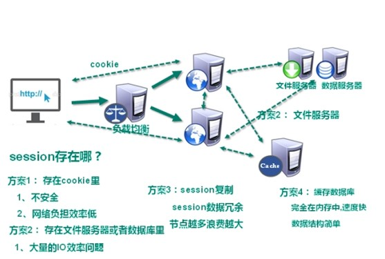
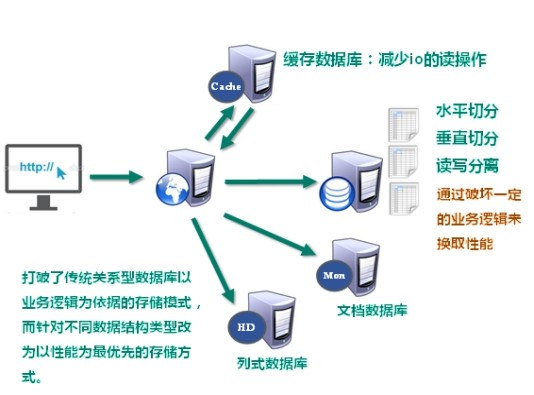

# Redis_Nginx

---

---

---

## Redis

---

---

### 一、概述

---

#### (一) 技术的分类

- 解决功能性的问题：Java、Jsp、 RDBMS、 Tomcat、 HTML、 Linux、 JDBC、 SVN
- 解决扩展性的问题: Struts、Spring、 SpringMVC、 Hibernate、 Mybatisv
- 解决性能的问题：NoSQL、 Java线程、Hadoop、 Nginx、 MQ、ElasticSearchv

#### (二) WEB 的发展历程

1. 单体

2. 分布式与集群

   

   > 解决 Session 问题：
   >
   > - 客户端 Cookie
   >
   >   > 不安全
   >
   > - Session 复制
   >
   >   > 空间浪费
   >
   > - NoSQL 数据库 / 缓存
   >
   >   > 

#### (三) NOSQL 数据库

- ***Not Only SQL***，非关系型数据库

  > NoSQL 不依赖业务逻辑方式存储，而以简单的key-value模式存储。因此大大的增加了数据库的扩展能力。

- *特点*

  - 不遵循SQL标准。
  - 不支持ACID。
  - 远超于SQL的性能。

-  *应用场景*

  - 对数据高并发的读写

    > 比如电商秒杀系统

  - 海量数据的读写

  - 对数据高可扩展性的

  > 不适用的场景：
  >
  > - 需要事务支持
  > - 基于sql的结构化查询存储，处理复杂的关系,需要即席查询
  >
  > 用不着sql的和用了sql也不行的情况，请考虑用NoSql

#### (四) Redis 概述

- Redis是一个开源的key-value存储系统。

- 和Memcached类似，它支持存储的value类型相对更多，包括string(字符串)、list(链表)、set(集合)、zset(sorted set --有序集合)和hash（哈希类型）。

  > 这些数据类型都支持push/pop、add/remove及取交集并集和差集及更丰富的操作，而且这些操作都是原子性的。
  >
  > 在此基础上，Redis支持各种不同方式的排序。

- 与memcached一样，为了保证效率，数据都是缓存在内存中。

  > 区别的是Redis会周期性的把更新的数据写入磁盘或者把修改操作写入追加的记录文件。
  >
  > 并且在此基础上实现了master-slave(主从)同步。

#### (五) Redis 安装

- Linux
- Windows
  - Redis 官方不支持 Windows 下运行
  - 下载后，需要启动服务端，保持不关闭
  - 可以使用命令行客户端访问，也可以使用图形化工具 .jar