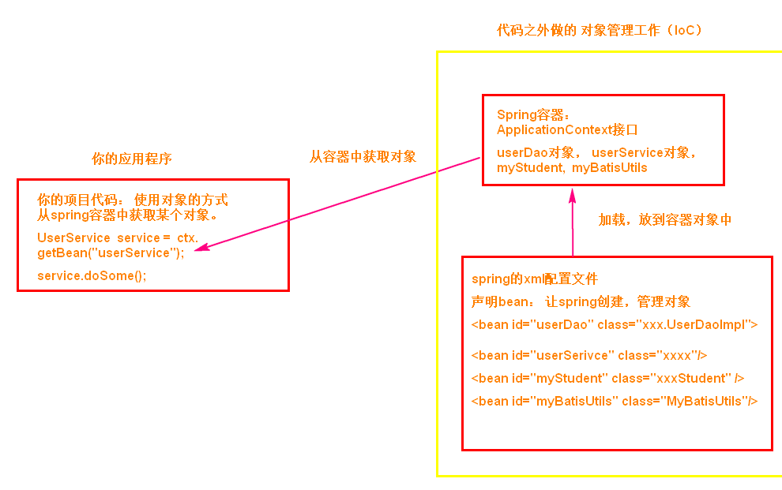

# SSM

---

---

---

## 框架概述

---

---

### 一、MVC架构

---

#### (一) MVC概述

- *M*：数据，可能来自数据库、文件、网络

  > 可用的技术举例：MySQL

- *V*：视图，显示请求的处理结果

  > 可用的技术举例：Vue

- *C*：控制器，主要进行 service，处理请求

  > 可用的技术举例：Servlet 可以作为控制器

#### (二) MVC作用

- 解耦合、各司其职
- 提高扩展性

---

### 二、三层架构

---

#### (一) 三层概述

- *界面层*：接收用户请求，调用 service，显示请求处理结果

  > 包括 Vue、Servlet

  > 对应的包名为 controller

- *业务逻辑层*：处理业务逻辑，使用算法处理数据，将数据返回给界面层

  > 对应的包名为 service

- *持久层*：访问数据库、读取文件、访问网络，从而获取数据

  > 对应的包名为 Dao

  #### (二) 请求处理流程

  1. 用户发起请求
  2. 界面层
  3. 业务逻辑层
  4. 持久层
  5. 数据库

  

#### (三) 优点

- **结构**清晰、**耦合度**低、各层分工明确

  > 有利于标准化、有利于各层逻辑复用

- 可**维护性**、可**扩展性**高

#### (四) 三层架构模式和框架

- 界面层：***Spring MVC***
- 业务层：***Spring***
- 持久层：***MyBatis***

---

### 三、框架概述

---

#### (一) 什么是框架

- Framework

- 框架就是一个**软件**，封装了**<u>某一方面</u>**的功能

  > 其中有各种模块，模块之间的调用已经规定好了

- 框架也可以看成一种**模板**

#### (二) 框架的作用

- 将各种技术整合，使用时更方便
- 提高开发效率，降低难度

---

---

## MyBatis

---

---

### 一、快速入门

---

#### (零) 为什么要用 MyBatis

- 关于 JDBC 的优缺点
  - 优点：直观，容易理解
  - 缺点：需要创建很多对象；需要注册驱动；需要手动转化 ResultSet；需要关闭资源；SQL 与**业务逻辑**混杂

#### (一) 什么是 MyBatis

- *来源*

  - 最初是 apache 的一个开源项目**iBatis**
  - 后迁移到 google code，改名为 ***MyBatis***
  - 后迁移到 GitHub

- *作用*

  - 减轻使用 JDBC 的复杂性，专注于 SQL 的编写

    > 底层依然是 JBDC

  - 可以注册驱动、创建所需对象，执行 SQL 语句，并将 ResultSet 更好地呈现

  - 实现 **SQL 语句**与 **Java 代码**的解耦合

#### (二) 第一个MyBatis项目

1. 创建 Project 和 Module，进行相关**配置**

   > 配置包括：Maven、编码方式、JDK、Language level、......

2. 加入**依赖**、**资源插件**

   - MyBatis 依赖
   - MySQL 依赖
   - 资源插件

3. 创建==**实体类**==，属性名和列名保持一致

4. 创建 ==**Dao 接口**==，在接口中定义操作数据的方法

   > 事实上，MyBatis底层可以不需要用到这个接口，
   >
   > 但通过接口帮助 SQL 和 Java 代码解耦合，是很实用的

   > 注意，接口中的方法**禁止重载**

5. 创建 ==**mapper.xml**==，书写 **SQL 语句**

   > 推荐：mapper.xml 与 Dao 接口在同一个目录中，名字保持一致
   >
   > > 所以，这里需要使用到==资源插件==，将 mapper.xml 也加载到类路径中
   >
   > 在项目中，一般是一张表对应一个 mapper 文件

   > 参考官方文档的 SQL 语句配置方法：
   >
   > ```xml
   > <?xml version="1.0" encoding="UTF-8" ?>
   > <!--
   > 	约束文件：
   > 		定义和限制当前文件中可以使用的标签和属性，
   > 		以及标签出现的顺序
   > -->
   > <!DOCTYPE mapper
   >         PUBLIC "-//mybatis.org//DTD Mapper 3.0//EN"
   >         "http://mybatis.org/dtd/mybatis-3-mapper.dtd">
   > <!--mapper是根标签-->
   > <!--
   >     namespace
   >     概念：命名空间，不能为空，且是唯一的值，推荐使用Dao接口的全限定名称
   >     作用：参与SQL语句的识别
   > -->
   > <mapper namespace="com.bjpowernode.dao.StudentDao">
   >     <!--mapper标签中可以写SQL语句标签
   >         <insert>
   >         <update>
   >         <delete>
   >         <select>
   >     -->
   >     <!--
   >         id:SQL语句的唯一标识，推荐使用dao接口中的方法名
   >         resultType:SQL语句的结果转换成哪类Java对象，
   > 					要写Java对象的全限定名称
   >     -->
   >     <select id="selectStudentById" 
   >             resultType="com.bjpowernode.doman.Student">
   >         select id, name, email, age
   >         from student
   >         where id = 1001
   >     </select>
   > </mapper>
   > ```

6. 创建 MyBatis ==**主配置文件**==（mybatis.xml 文件）

   1. 定义创建连接实例的数据源（DataSource）对象
   2. 指定其他 mapper 文件的位置

   > 这个 xml 文件只有一个，放在 **resources 目录**下

   > 参考MyBatis文档
   >
   > ```xml
   > <?xml version="1.0" encoding="UTF-8" ?>
   > <!DOCTYPE configuration
   >         PUBLIC "-//mybatis.org//DTD Config 3.0//EN"
   >         "http://mybatis.org/dtd/mybatis-3-config.dtd">
   > <configuration>
   >     <environments default="development">
   >         <environment id="development">
   >             <transactionManager type="JDBC"/>
   >             <!--配置数据源：创建Connection对象-->
   >             <dataSource type="POOLED">
   >                 <property name="driver" 
   >                           value="com.mysql.jdbc.Driver"/>
   >                 <property name="url"
   >                      value="jdbc:mysql://localhost:3306/springdb
   >                      ?useUnicode=true&amp;characterEncoding=utf-8"/>
   >                 <property name="username" value="root"/>
   >                 <property name="password" value="123456"/>
   >             </dataSource>
   >         </environment>
   >     </environments>
   >     <!--指定其他mapper文件的位置，从而可以正常执行SQL语句-->
   >     <mappers>
   >         <!--路径是从类路径的根开始的，也就是target/classes-->
   >         <mapper resource="com/bjpowernode/dao/StudentDao.xml"/>
   >     </mappers>
   > </configuration>
   > ```

7. 创建**测试**内容

   - MyBatis 中的**核心**是 ==**SqlSessionFactory 实例**==

     > 这个实例是 SqlSessionFactoryBuilder 通过读取 xml 文件创建的

     > 举例：
     >
     > ```java
     > //1.定义MyBatis主配置文件的位置，也是从类路径的根开始(target/classes)
     > String config = "mybatis.xml";
     > //2.使用MyBatis框架中的Resources类读取主配置文件
     > InputStream inputStream = Resources.getResourceAsStream(config);
     > //3.利用SqlSessionFactoryBuilder对象创建SqlSessionFactory对象
     > SqlSessionFactory factory = 
     >     new SqlSessionFactoryBuilder().build(inputStream);
     > ```

   - 从 SqlSessionFactory 中获取 ==**SqlSession 实例**==，执行 SQL 对应的方法

     > 应用举例：
     >
     > ```java
     > //4.获取SqlSession对象
     > SqlSession session = factory.openSession();
     > //5.指定要执行的SQL的标识：namespace + . + id
     > String sqlId = 
     >  "com.bjpowernode.dao.StudentDao" + '.' + "selectStudentById";
     > //6.通过SqlSession的方法，执行SQL语句
     > Student student = session.selectOne(sqlId);
     > //7.关闭SqlSession
     > session.close();
     > ```
     >
     > > 注：selectXxx(...)方法返回**泛型**

#### (三) 其他常用操作简介

- *占位符*

  ```xml
  <!--StudentDao.xml-->
  <!--#{xxx}是占位符，调用方法时传入参数会替换占位符-->
  <select id="selectStudentById"
          resultType="com.bjpowernode.doman.Student">
      select id, name, email, age
      from student
      where id = #{studentId}
  </select>
  <!--这里只能使用一个占位符，具体原因之后讲-->
  <insert id="insertStudent">
      insert into student
      values (#{id}, #{name}, #{email}, #{age})
  </insert>
  <!--会对相应属性调用get方法-->
  ```

  ```java
  //MyTest.java
  Student student = session.selectOne(sqlId, 1002);//只能带一个parameter
  int rows = session.insert(sqlId, student);
  ```

- *日志*

  - 在 mybatis.xml **主配置文件**中配置

    ```xml
    <configuration>
        <!--设置日志-->
        <settings>
            <!--name:日志方式 value:日志框架-->
            <setting name="logImpl" value="STDOUT_LOGGING"></setting>
        </settings>
    </configuration>
    ```

  - 再执行相关操作时，就会输出日志

    ```
    Logging initialized using 'class org.apache.ibatis.logging.stdout.StdOutImpl' adapter.
    PooledDataSource forcefully closed/removed all connections.
    PooledDataSource forcefully closed/removed all connections.
    PooledDataSource forcefully closed/removed all connections.
    PooledDataSource forcefully closed/removed all connections.
    Opening JDBC Connection
    Created connection 1529060733.
    Setting autocommit to false on JDBC Connection [com.mysql.jdbc.JDBC4Connection@5b239d7d]
    ==>  Preparing: select id, name, email, age from student where id = ? 
    ==> Parameters: 1002(Integer)
    <==    Columns: id, name, email, age
    <==        Row: 1002, 张三, zs@qq.com, 20
    <==      Total: 1
    Resetting autocommit to true on JDBC Connection [com.mysql.jdbc.JDBC4Connection@5b239d7d]
    Closing JDBC Connection [com.mysql.jdbc.JDBC4Connection@5b239d7d]
    Returned connection 1529060733 to pool.
    自己写的输出语句：Student{id=1002, name='张三', email='zs@qq.com', age=20}
    ```

- *事务*

  1. 在 **StudentDao 接口**中编写相关**方法**

     ```java
     public interface StudentDao {
         /**
          * 添加学生
          * @param student
          * @return 本次操作影响的行数
          */
         int insertStudent(Student student);
     }
     ```

  2. 在 **StudentDao.xml** 中添加相关**标签**

     ```xml
     <mapper namespace="com.bjpowernode.dao.StudentDao">
         <insert id="insertStudent">
             insert into student
             values (#{id}, #{name}, #{email}, #{age})
         </insert>
     </mapper>
     ```

  3. 在测试类中编写SQL相关代码，并**提交事务**

     ```java
     String config = "mybatis.xml";
     InputStream inputStream = Resources.getResourceAsStream(config);
     SqlSessionFactory factory = new SqlSessionFactoryBuilder().build(inputStream);
     SqlSession session = factory.openSession();
     String sqlId = "com.bjpowernode.dao.StudentDao" + '.' + "insertStudent";
     Student student = new Student();
     student.setId(1004);
     student.setName("李思思");
     student.setEmail("lss@qq.com");
     student.setAge(22);
     int rows = session.insert(sqlId, student);
     session.commit();//提交事务
     session.close();
     System.out.println(rows);
     ```

#### (四) 重要类讲解

- Resources

  - 读取MyBatis**<u>主配置文件</u>**，生成**流**

  ```java
  InputStream is = Resources.getResourceAsStream("mybatis.xml")
  ```

- SqlSessionFactoryBuilder

  - 通过**流**创建**<u>SqlSessionFactory对象</u>**

  ```java
  SqlSessionFacroty ssf = new SqlSessionFactoryBuilder().build(is);
  ```

- :star:***SqlSessionFactory***

  - **重量级**对象：创建它需要**更多的资源和时间**

    > 比如，创建Connection对象时，需要连接网络，发送多次网络请求；
    >
    > 连接创建之后可以持续保持会话；
    >
    > SqlSessionFactory 创建一个就可以

    > **主配置文件**的相关信息都被**解析**后**封装**在这个对象中

  - 是一个接口，作用是创建 **<u>SqlSession 对象</u>**

    > 它的实现类是 **DefaultSqlSessionFactory**
    >
    > （在之后用Spring集成MyBatis时，**SqlSessionFactoryBean**类的内部就是这个实现类）

  - 常用方法：

    - `openSession()`和`openSession(boolean)`：获取一个(默认的)SqlSession对象

      >传入 true 表示开始**自动提交事务**机制

- :star:***SqlSession***

  - 接口，提供大量执行SQL语句的方法

    > 它的实现类是 DefaultSqlSession，**非线程安全的**
    >
    > > 解决线程安全问题：
    > >
    > > 保证 SqlSession 对象只存在于**栈区**（方法的局部变量），使用后及时`close`，**其他线程无法共享**

  - 常用方法

    - `selectOne(String)`和`selectOne(String, Object)`

      > SQL语句最多只能有**一条记录**

    - `selectList(String)`和`selectList(String, Object)`

      > 可以返回**多条记录**，存储在List集合中

    - `selectMap`相关

    - `insert`、`update`、`delete`相关

    - `commit`、`rollback`相关

---

### 二、Dao代理

---

#### (一) 传统Dao开发方式

- 主动创建**Dao实现类**，实现相关方法，在方法中接收参数，利用MyBatis执行SQL

> 分析：Dao实现类有无手动创建的必要
>
> - 通过**反射**机制，可以获取到Dao接口的**<u>全限定类名</u>**
>
>   > 从而可以去找对应的**<u>namespace</u>**
>
> - 再加上mapper文件中SQL语句标签的**<u>id属性</u>**，就可以得到完整的**<u>SQL唯一标识</u>**
>
>   > **<u>方法名</u>**就对应了id属性
>
> - 接下来可以继续确定调用<u>SqlSession的哪个方法</u>
>   - 通过标签名可以判断是DQL还是DML
>   - 如果是DQL，可以再利用**反射**，根据方法**返回值类型**可以确定具体是哪个方法
>
> 因此，MyBatis完全可以根据Dao接口自动创建一个实现类，这就是Dao代理 

#### (二) 什么是Dao代理技术

- MyBatis框架自动创建Dao接口的实现类，代理程序员手写的实现类的功能

#### (三) 使用Dao代理的要求

- mapper文件中的**namespace**必须是Dao接口的**全限定类名**
- mapper文件中**SQL标签的id**必须是Dao接口中的**方法名**

> 底层步骤：
>
> 1. 得到接口，反射**<u>全限定类名</u>**
> 2. 通过全限定类名找到**<u>namespace</u>**
> 3. 通过调用的**方法名**找到**<u>id</u>**

#### (四) 使用代理的方式

- 利用`SqlSession`对象的`getMapper(Class<T>)`方法，传入`接口.class`，直接得到可使用的**实现类**

  > 这个实现类就是一个**<u>代理类</u>**

#### (五) :star:深入理解参数

- “参数”指的是**Dao接口方法的形参**，要理解这个形参与**mapper文件中SQL语句**的关系

- **抽象方法的<u>参数</u>**可以理解成**SQL语句中的<u>占位符</u>**

  > 这个占位符的名字有某种规定，且与方法的参数一一对应

##### 1、SQL标签的parameterType属性

- 表示参数类型，指定**Dao方法的形参数据类型**

- MyBatis框架在给**SQL语句占位符赋值**时会用到这个类型

  > PreparedStatement类的方法，setXxx，会用到

- 属性值可以有两种

  - Java类的**全限定名称**
  - MyBatis框架规定的**别名**

> 当然，MyBatis通过反射是可以获取到方法形参类型的，所以这个属性可以省略

##### 2、传参：:star:一个简单参数

- 认为**基本数据类型及其包装类**与**String类型**是简单参数

- 占位符书写方法：`#{任意字符}`

  > 只能写**一个**，任意字符，与方法形参名无关

> 如果参数是数组或集合怎么办？使用`foreach`标签

##### 3、传参：:star:多个简单参数(@param)

- 利用**注解Param**，在方法的形参前使用，指定value

- 指定的value就可以在SQL标签中使用：`#{value}`

  > 就算是同名，也要指定

```java
List<Student> selectByNameOrAge(@Param("name") String name, 
                                @Param("age") Integer age);
```

```xml
<select id="selectByNameOrAge" resultType="com.bjpowernode.domain.Student">
    select * from student where name = #{name} or age = #{age}
</select>
```

##### 4、传参：多个简单参数(:star:对象方式)

- 将方法的形参**封装成一个Java对象**，这个Java对象的**属性**就是形参

  > 这个Java对象可以是Dao对应的实体类，提供了setter和getter
  >
  > > 当然也可以是其他对象

- 在SQL标签中的用法：`#{属性名}`

  > 其实还可以指定 javaType 和 jdbcType，不过这些 MyBatis 都可以检查出来

##### 5、传参：根据参数位置

- 在SQL标签中的用法：`#{arg0}`、`#{arg1}`、`#{arg2}`、......

  > 分别对应接口方法的第1、2、3、....... 个参数

##### 6、传参：形参是Map类型

- Map的key建议设置成String类型
- 在SQL标签中的用法：`#{key}`

##### 7、#和$的区别

- :star:#占位符

  - MyBatis处理#{}使用的是**<u>PreparedStatement</u>**对象，利用了<u>占位符`?`</u>

  - 特点

    - 效率高

      > 编译一次就可以

    - 可以避免**SQL注入**

    - 常常作为**列值**使用，在**等号右侧**

      > 与数据类型有关

- $占位符

  - 用法上和#占位符相似

    > 区别：
    >
    > - 一个参数时也需要在抽象方法的形参上用@param指定名称
    >
    > - 无论什么类型的数据，都会直接把**字面值**原样拼接到SQL语句中
    >
    >   > 字符串的引号都需要手写出来

  - 底层创建的是**Statement对象**，使用字符串拼接的方式连接

  - 特点

    - 效率底

      > 每次都要重新编译

    - 有SQL注入的风险

    - 会用作表名或列名

      > **原样**使用，与数据类型无关

      > 举例：根据**列名**排序
      >
      > ```java
      > List<Student> queryStudentOrderByColName
      >  (@Param("colName")String colName);
      > ```
      >
      > ```xml
      > <select id="queryStudentOrderByColName" resultType="com.bjpowernode.domain.Student">
      >  select *
      >  from student
      >  order by ${colName} desc
      > </select>
      > ```
      >
      > > 这种情况如果用`#{colName}`会导致多一层引号（因为是setString）

#### (六) :star:封装输出结果

> 注：
>
> 如果**<u>接口方法的返回值</u>**与session对象对应方法的返回值不一致，会尝试向上转型成接口方法的返回值，如果成功，运行时也不会报错，如果失败则报错
>
> > 如果接口方法返回值写成`void`，那就直接不返回了，不会报错

##### 1、概念问题

- MyBatis执行SQL语句后得到ResultSet，会转为Java对象

##### 2、:star:resultType

- 在select标签中作为属性，代表DQL语句的查询结果，可以是一个**简单单一值**、一个**Map集合**，也可以封装为一个**实体类对象**

- 属性值是执行DQL语句后返回的结果**类型**
  - Java类的**全限定名称**
  - MyBatis规定的**别名**
  
- 底层
  - 使用**反射**机制读取resultType指定的类型
  
    - :star:如果是**<u>实体类对象</u>**
  
      - 则**创建对象**
  
      - select子句中**<u>同名的列</u>**（或**别名**）赋值给**<u>同名的属性</u>**
  
        >如果没有找到同名的列，就不赋值了
        >
        >（所以本质上也可以是其他自定义对象）
  
        > 如果查询结果是**多条记录**，要设置Dao接口的抽象方法返回值是 **List 集合**，这样就会把实体类对象放到 List 集合中
  
    - 如果是一个**<u>简单单一值</u>**
  
      - 直接返回
  
    - 如果是**<u>Map集合</u>**
  
      - 以select子句中的**列名**（或**别名**）作为**key**，查询到的**值**作为**value**
      - 使用Map集合时，DQL只能是查询到**一行记录**，多于一行则报错

> :star:自定义别名：
>
> 方式一：
>
> 1. 在MyBatis**主配置文件**中，在configuration标签下，在**typeAliases标签**下，使用**typeAlias标签**声明别名
>
>    > 举例：
>    >
>    > ```xml
>    > <typeAliases>
>    >     <typeAlias type="com.bjpowernode.domain.Student" 
>    >                alias="stu"/>
>    > </typeAliases>
>    > ```
>
> 2. 在mapper文件的select标签中，指定resultType属性值为别名
>
> 方式二：
>
> 1. 在MyBatis**主配置文件**中，在configuration标签下，在**typeAliases标签**下，使用**package标签**指定包名，则包下类的**类名**就成为了**别名**
>
>    > 举例：
>    >
>    > ```xml
>    > <typeAliases>
>    >     <package name="com.bjpowernode.domain"/>
>    > </typeAliases>
>    > ```
>
>    > 不过不同包下的同名类如果同时使用这种方式，就有可能出错
>    >
>    > （还是建议用**全限定名称**）
>
> 2. 在mapper文件的select标签中，指定resultType属性值为对应包下的**类名**

##### 3、:star:resultMap:star:

- 结果映射，自定义**列名**（或**别名**）和对象**属性名**的对应关系

  > 常用于列名和属性名不同的情况，(当然，相同也行，相同就不用配置了)
  >
  > > resultType 也可以解决列名与属性名不同的情况，只要**起别名**就行

- 使用方法

  - 在 mapper.xml 中写 **==resultMap 标签==**，**<u>id 属性</u>**代表这个映射关系的名字，<u>type 属性</u>是映射相关的实体类

  - 在 resultMap 标签中

    - 主键类型使用 **==id 标签==**，**<u>column 属性</u>**的属性值是表中的列名，<u>**property 属性**</u>的属性值是是实体类的属性名
    - 非主键类型使用 **==result 标签==**，属性同理

  - 在 select 标签中指定 **resultMap 属性**，属性值为 resultMap 标签中的 **id 属性值**

    > 就不用写 resultType 了，两者不能同时使用；
    >
    > 推荐使用 resultMap

- :star:进阶使用：多对一关系的处理（有一个属性是<u>另一个实体类对象的**引用**</u>，举例：员工对部门）

  - 级联属性：在 <u>property 属性</u>中通过`.`的方式指定引用属性中的属性

    ```xml
    <result property="dept.did" column="did"></result>
    <result property="dept.deptName" column="dept_name"></result>
    ```

    > 简单，但用得不多

  - `association`标签

    - property 属性依然是引用属性名

    - <u>`javaType`属性</u>，指定引用属性对应的实体类

    - 在**标签体**中：

      - 可以写 <u>id 标签</u>与 <u>result 标签</u>

      ```xml
      <association property="dept" javaType="Dept">
      	<id></id>
      	<retult></retult>
      </association>
      ```

    > 还有第二种方式：将分步查询单独拿出来
    >
    > property 属性依然是引用属性名
    >
    > <u>column 属性</u>指定的是**分步查询条件字段**
    >
    > > 或者说是：
    > >
    > > - 表连接中的关键字段
    > > - **外键**
    > > - 另一个接口方法要传的参数
    >
    > <u>select 属性</u>指定分步查询第二步的 SQL **唯一标识**（命名空间 + SQL ID）
    >
    > ```xml
    > <association property="dept"
    >           select="com.xxx.xxx.selectXxxByStepTwo"
    >           column="did"></association>
    > ```
    >
    > :star:分步查询的好处：延迟加载/懒连载
    >
    > 首先需要开启延迟加载：
    >
    > ```xml
    > <settings>
    >  <!--开启延迟加载-->
    >  <setting name="lazyLoadingEnabled" value="true"></setting>
    >  <!--调用方法时不要加载对象的所有属性-->
    >  <!--agressiveLazyLoading default false-->
    > </settings>
    > ```
    >
    > 延迟加载的意思：在用`getter`==获取<u>关联对象</u>的信息时==才执行 SQL 查询，调用接口方法的时候并不会去查询关联对象
    >
    > > 注意：主加载对象还是会直接查询的
    >
    > 如果不想全局都延迟加载，可以在**开启了全局延迟加载后**，在 association 标签中指定 <u>***fetchType*** 属性</u>为 ***early*** (如果设置为 ***lazy*** 则还是延迟加载)
    >
    > > 注：当开启全局加载后，fetchType 属性才有意义

- :star:进阶使用：一对多关系的处理（有一个属性是<u>实体类**集合**</u>，举例：部门对员工）

  - 在 resultMap 标签体中，使用 <u>`collection`标签</u>代表**集合**引用属性

  - collection 标签头中：

    - property 同理

    - <u>`ofType`属性</u>：属性值为集合中类型的类名

      > 注意 ofType 的含义是**集合中的类型**，与 javaType 含义不同
      >
      > > 引用类型设置 xxxType 是为了处理**多态**的情况，不然怎么知道到底使用哪个实现类

  - 在 collection 标签体中：

    - 使用 id 标签与 result 标签，代表集合中一个对象的映射关系

    > 注意，这里就不要再设置多对一了
    >
    > > 不然的话，部门中查员工、员工中又需要部门，无限递归了
    >
    > 在实际的查询中，总是有一张**主表**的

  > 也可以通过`resultMap`使用**分步查询**来解决**一对多**的关系：
  >
  > 1. <u>collection 标签</u>，property 属性，都同理
  >
  > 2. 标签头中的 <u>select 属性</u>与 <u>column 属性</u>也同理
  >
  >    > 对应的 SQL 返回值肯定也要是 ***List* 集合**
  >
  > 也可以**延迟加载**，同理

> 总结：
>
> 多对一，对应**对象(引用)**；一对多，对应**集合**

> 关于字段名与属性名不一致的解决：
>
> - 方法一：`as`字段名起别名，别名与属性名相同
>
> - 方法二：`resultMap`
>
> - 方法三：下划线映射成驼峰
>
>   > 全局配置`mapUnderscoreToCamelCase`

#### (七) 模糊查询

- :star:第一种方式：将**模糊匹配的字符**写在 **Java 程序**中（建议）

- 第二种方式：将模糊匹配的字符写在SQL标签中

  ```xml
  <select id="selectLikeTwo" resultType="com.bjpowernode.domain.Student">
      select * from student where name like '%' #{name} '%'
  </select>
  ```

  > 注意，空格不能少

---

### 三、动态SQL

---

#### (一) 概述

- 动态SQL：同一个Dao的抽象方法，根据**不同的条件**，可以代表**不同的SQL语句**

  > 主要是 **where 子句**的不同，以及**多条件查询**

- 使用动态SQL时，Dao抽象方法的形参是Java对象

#### (二) if标签

- 用法举例

  ```xml
  <select id="selectIf" resultType="com.bjpowernode.domain.Student">
      select *
      from student
      where 1 = 0
      	<!--test属性代表判断条件-->
      <if test="name != null and name != ''">
          or name = #{name}
      </if>
      <if test="age > 0">
          or age &lt;= #{age}
      </if>
  </select>
  ```

  > 注意几点：
  >
  > - test属性值中的**变量名**要与实体类**属性名**保持一致，可以直接写
  > - 写`1 = 0`是为了防止`or`或`and`多出一个
  > - 注意使用**实例符号**

#### (三) where标签

- if标签常与where标签配合使用

- where标签中可以放多个if标签

  - 当if标签里有一个为true时，会添加**where关键字**，并会自动删除紧跟在后面的不合法的or
  - 如果没有ture，则忽略where和所有if

- 用法举例：

  ```xml
  <select id="selectWhere" resultType="com.bjpowernode.domain.Student">
      select *
      from student
      <where>
          <if test="name != null and name != ''">
              name = #{name}
          </if>
          <if test="age > 0">
              or age = #{age}
          </if>
      </where>
  </select>
  ```

#### (四) foreach标签

- 可以循环**数组**、**List集合**，一般用在**in语句**中

- 语法格式

  ```xml
  <foreach collection="集合类型" open="开始的字符" close="结束的字符" 
           separator="集合成员之间的分隔符" item="集合中的成员">
      #{item 的值}
  </foreach>
  ```

  > - collection
  >   - 如果Dao抽象方法形参是数组，就写**array**
  >   - 如果Dao抽象方法形参是List集合，就写**list**
  > - open、close、separator
  >   - 循环**开始前**、**结束后**和**进行中**要加的字符
  > - item
  >   - 代表集合成员，相当于一个**变量名**
  > - `#{item变量名}`
  >   - 可以获取值

- 用法举例：简单类型的List

  ```xml
  <select id="selectForEachOne" resultType="com.bjpowernode.domain.Student">
      select *
      from student
      <if test="list != null and list.size > 0">
          where id in
          <foreach collection="list" open="(" close=")" separator="," item="id">
              #{id}
          </foreach>
      </if>
  </select>
  ```

  > - 注意与if标签的配置使用
  > - test中可以**直接写list**，代表抽象方法的**List类型参数**，也可以写list.size，代表调用size方法

- 用法举例：**对象**类型的List

  ```xml
  <select id="selectForEachTwo" resultType="com.bjpowernode.domain.Student">
      select *
      from student
      <if test="list != null and list.size > 0">
          where id in
          <foreach collection="list" open="(" close=")" separator="," item="stu">
              #{stu.id}
          </foreach>
      </if>
  </select>
  ```

#### (五) 代码片段

- 代表**一段SQL代码**，可以在其他地方**复用**

- 使用方式

  - 在 mapper.xml 文件中，使用**sql标签**，**属性id**指定为任意唯一标识，在标签内写SQL代码片段

  - 在其他位置使用**include标签**，**属性refid**指定为对应标识

    > include自结束标签，需要加`/`

- 应用举例

  ```xml
  <sql id="selectAll">
      select * from student
  </sql>
  <select id="selectForEachTwo" resultType="com.bjpowernode.domain.Student">
      <include refid="selectAll"/>
      <if test="list != null and list.size > 0">
          where id in
          <foreach collection="list" open="(" close=")" separator="," item="stu">
              #{stu.id}
          </foreach>
      </if>
  </select>
  ```

---

### 四、配置文件

---

#### (一) 主配置文件

- 提供MyBatic全局设置，包括**设置项**、**环境**、**数据源**、**数据库配置**、**mapper文件位置**、......

```xml
<?xml version="1.0" encoding="UTF-8" ?>
<!DOCTYPE configuration
        PUBLIC "-//mybatis.org//DTD Config 3.0//EN"
        "http://mybatis.org/dtd/mybatis-3-config.dtd">
<!------------------------------->
<!--0. 根标签configuration-->
<!------------------------------->
<configuration>
    
    <!--引入数据库的属性配置文件，从类路径的根开始-->
    <properties resource="jdbc.properties"/>
    
    <!--------------------------------------------->
    <!--1. settings大多数配置项使用默认值即可-->
    <!--------------------------------------------->
    <settings>
        <!--设置日志-->
        <setting name="logImpl" value="STDOUT_LOGGING"></setting>
    </settings>
    
    <!------------------>
    <!--2. 设置别名-->
    <!------------------>
    <typeAliases>
        <!--两种方式设置别名-->
        <typeAlias type="com.bjpowernode.domain.Student" alias="stu"/>
        <package name="com.bjpowernode.domain"/>
    </typeAliases>
    
    <!-- → 插件相关配置-->
    <plugins>
        <plugin interceptor="com.github.pagehelper.PageInterceptor" />
    </plugins>
    
    <!----------------------------------------------------->
    <!--3. 配置环境，一个环境表示一个数据库的连接信息-->
    <!----------------------------------------------------->
    			<!--default属性表示默认使用的环境，
					要与下面的某个id一致-->
    <environments default="test">
        
        <!--项目上线后使用的数据库环境-->
        <environment id="online">
        	...
        </environment>
      
        <!--测试使用的数据库环境-->
        <environment id="test">
            <!--:::::3.1 事务管理器类型:::::-->
            <!--
			属性值有：
				JDBC：使用Connection对象，由MyBatis自己完成事处理
				MANAGED：把事务处理交给容器实现
			-->
            <transactionManager type="JDBC"/>
            
            <!--:::::3.2 数据源:::::-->
            <!--
			type属性值：
				POOLED:创建PoolDatasource类，管理连接池
				UNPOOLED:创建UnPoolDataSource类，不使用连接池
				JNDI:Java的命名和目录服务
			-->
            <dataSource type="POOLED">
                
                <!--引用数据库的属性配置文件-->
                <property name="driver" value="${jdbc.driver}"/>
                <property name="url" value="${jdbc.url}"/>
                <property name="username" value="${jdbc.username}"/>
                <property name="password" value="${jdbc.password}"/>
            </dataSource>
            
        </environment>
    </environments>
    
    <!--------------------------------------------->
    <!--4. mapper标签:指示写有SQL语句的文件-->
    <!--------------------------------------------->
    <mappers>
        <!--::4.1 方式一：使用mapper标签，指定resoure属性::-->
        <mapper resource="com/bjpowernode/dao/StudentDao.xml"/>
        <!--::4.2 方式二：使用package标签，指定name属性为包名::-->
        <!--
		使用要求：
			1) mapper文件和Dao接口在同一目录中
			2) mapper文件和Dao接口同名
		-->
        <!--这种方式可以自动扫描包中的接口，一次性加载多个与接口同名文件-->
        <package name="com.bjpowernode.dao"/>
    </mappers>
</configuration>
```

#### (二) 数据库属性配置文件

- 最好把**数据库的配置信息**放到一个单独的**.properties文件**中，单独管理

- 使用步骤

  1. 在**resources目录**中，创建**.properties属性配置文件**

  2. 在文件中，使用**key=value**的格式配置数据

     > 举例：
     >
     > ```properties
     > jdbc.url=jdbc:mysql://localhost:3306/springdb
     > ```

  3. 在主配置文件中，使用property标签，引入.properties文件

     ```xml
     <configuration>
         <properties resource="jdbc.properties"/>
     </configuration>
     ```

  4. 使用`${key}`解析配置文件中的值

     ```xml
     <property name="driver" value="${jdbc.driver}"/>
     <property name="url" value="${jdbc.url}"/>
     <property name="username" value="${jdbc.username}"/>
     <property name="password" value="${jdbc.password}"/>
     ```

---

### 五、扩展

---

#### (一) PageHelper

- MyBatis通用分页插件

- 使用方法

  1. 在 **pom.xml** 文件中加入**依赖**

  2. 在MyBatis**主配置文件**中声明**插件**

     >写在environments标签之前（这个是有顺序要求的）

  3. 在查询语句之前调用**PageHelper.startPage 静态方法**

     ```java
     PageHelper.startPage(pageNo, pageSize);
     ```

     

---

---

## Spring

---

---

### 一、概述

---

#### (一) 什么是Spring

- 轻量级Java开发框架

- 为了解决企业应用开发的复杂性而创建的

- Spring的核心是**控制反转**(IoC)和**面向切面编程**(AOP)

- Spring又叫做**容器**

  > Spring作为容器，主要装的是Java对象

#### (二) 优点

- 轻量

  > jar包比较小，运行占用资源少、效率高

- 面向接口编程，实现**Java对象**之间、**不同模块**之间的**解耦合**

- **AOP编程**的支持

- 方便**集成**各种优秀框架

#### (三) Spring体系结构




---

### 二、IoC控制反转

---

#### (一) 概述

- IoC，***Inversion of Control***

- 是一种理论，一种指导思想

- 指导开发人员如果使用对象、**管理对象**

  > 对象的创建、赋值等操作、对象的生命周期，都交由容器**管理**

- ***控制反转***

  - 控制：对于对象创建、属性赋值、生命周期的**管理**

  - 反转：将开发人员管理对象的权限转交给**容器**

    > 通过容器，就可以使用其中的对象了

- **IoC的技术实现**

  - DI(***Dependency Injection***)，依赖注入

  - 程序只需要提供要使用的对象名称，具体操作细节都由容器内部自己实现

    > 具体操作包括对象创建、属性赋值......
    >
    > “注入”的意思就是**赋值**

  - Spring底层使用**反射**机制创建对象

> 图解IoC：
>
> 
>
> 在不同的业务下，同一个接口需要使用不同的实现类，只需要在配置文件中进行修改即可

#### (二) 第一个Spring程序

1. 新建Maven项目

2. 加入==依赖==

   - spring-context
   - junit

3. 定义==**接口**和**实现类**==

4. 创建**==spring配置文件==**

   - 作用：声明对象
   - 使用`<bean>`表示一个对象的声明

   ```xml
   <?xml version="1.0" encoding="UTF-8"?>
   <beans xmlns="http://www.springframework.org/schema/beans"
          xmlns:xsi="http://www.w3.org/2001/XMLSchema-instance"
          xsi:schemaLocation="http://www.springframework.org/schema/beans http://www.springframework.org/schema/beans/spring-beans.xsd">
   </beans>
   ```

   > - xmlns：声明beans**命名空间**
   > - xmlns:xsi：xsi命名空间
   > - xsi：指定**约束文件**具体路径，beas命名空间就引用了这个约束文件

   ```xml
   <!--
       声明对象：
           id:自定义的对象名，唯一值（可以不指定）
           class:类的全限定名称，用于反射机制创建对象（必须指定）
           spring底层会将创建好的对象放到一个map中，key是id，value是对象
       -->
   <bean id="someService" 
         class="com.bjpowernode.service.impl.SomeServiceImpl"/>
   ```

5. 使用容器中的对象

   - 创建一个表示spring容器的对象：`ApplicationContext`
   - 使用`getBean("bean标签中的id")`获取对象

   ```java
   //1. 指定配置文件
   String config = "beans.xml";
   //2. 创建容器对象
   ApplicationContext ctx = new ClassPathXmlApplicationContext(config);
   //3. 从容器中获取指定名称的对象
   //SomeService service = ctx.getBean(SomeService.class);//也可以
   SomeService service = (SomeService) ctx.getBean("someService");
   //4. 调用接口中的方法
   service.doSome();
   ```

   > - 怎么创建对象
   >
   >   - Spring **默认**使用无参构造创建对象，所以要提供**无参构造**
   >
   > - 什么时候创建对象
   >
   >   - **创建Spring容器**的同时，就创建了文件中声明的Java对象
   >
   >     > 优点：获取对象的速度快
   >     >
   >     > 缺点：占用内存
   >
   > - 创建几个对象
   >
   >   - 在创建容器对象时，会把配置文件中<u>所有的`<bean>`</u>都创建出来
   >
   >     > 使用`getBean(String)`时，**相同的类型**也会创建多个
   >
   >   - 如果使用的是`getBean(Class<T>)`，则不允许创建多个**同类不同id**的对象，会**报错**
   >
   > - 创建之后放到哪
   >
   >   - Map集合
   >
   >     > 实质上是一个`ConcurrentHashMap`，适合**高并发**环境

> :star:关于容器中的对象信息：
>
> - 获取容器中定义对象的**数量**：`getBeanDefinitionCount`
>
>   > 有几个bean返回值就是几
>
> - 获取容器中定义对象的**名称**：`getBeanDefinitionNames`
>
>   > 就是id

> :star:创建**非自定义类对象**和无接口的对象
>
> 一样的操作，一样的id和class，**全限定类名**正确即可

#### (三) :star:DI：给属性赋值

> DI的分类：
>
> - set注入，也叫设值注入
>
>   > Spring调用类的**set方法**赋值
>
> - 构造注入

##### 1、基于XML的DI

###### (1) :star:set注入:star:

- 简单类型：**<u>property标签</u>**，**<u>name属性</u>**和**<u>value属性</u>**

  > 自定义类举例：
  >
  > ```xml
  > <bean id="myStudent" class="com.bjpowernode.ba01.Student">
  >     <property name="name" value="李四"/>
  >     <property name="age" value="20"/>
  > </bean>
  > ```
  >
  > 底层执行的是***setter***
  >
  > - 不提供setter会报错
  >
  > - spring只是调用setter，setter执行的内容还是程序员自己写的
  >
  > - 只有setter没有**属性**，提供了**property标签**，其实也可以运行
  >
  >   > 所以本质上看的是<u>setXxx方法上的xxx</u>，和**属性名**无关
  >
  > 什么时候执行setter？
  >
  > - 容器**创建对象后**立刻执行

  > 非自定义类也是同样的原理，只要找到<u>setXxx方法</u>就可以

- 复杂引用数据类型：**<u>ref属性</u>**

  > 举例：
  >
  > ```xml
  > <bean id="myStudent" class="com.bjpowernode.ba02.Student">
  >  <property name="name" value="李四"/>
  >  <property name="age" value="20"/>
  >  <property name="school" ref="mySchool"/>
  > </bean>
  > <bean id="mySchool" class="com.bjpowernode.ba02.School">
  >  <property name="name" value="hitsz"/>
  >  <property name="address" value="平山村"/>
  > </bean>
  > ```
  >
  > > 需要在xml文件中同时写好相关引用数据类型的bean；
  > >
  > > 不必考虑顺序问题，如果顺序反了，spring会先创造所有对象，再赋值
  > >
  > > ```dos
  > > student constructor
  > > school constructor
  > > set school name
  > > set school address
  > > set student name
  > > set student age
  > > set student school
  > > ```
  > >
  > > 顺序没反就按顺序创建对象、赋值
  > >
  > > ```dos
  > > school constructor
  > > set school name
  > > set school address
  > > student constructor
  > > set student name
  > > set student age
  > > set student school

###### (2) 构造注入

- <u>`<constructor-arg>`标签</u>、<u>name、index、ref、value属性</u>

  ```xml
  <constructor-arg name="构造方法中的形参名" value="简单类型的值"/>
  <constructor-arg name="构造方法中的形参名" ref="引用类型的值"/>
  <!--也可以用index属性代替name，通过形参下标指定，从0开始-->
  <!--可以省略index，则默认从上到下、从0开始对应参数-->
  ```

  > 注意，name属性值是**形参名**，而与属性无关

  > 举例：
  >
  > ```xml
  > <bean id="myStudent" class="com.bjpowernode.ba03.Student">
  >     <constructor-arg index="0" value="李四"/>
  >     <constructor-arg name="myAge" value="20"/>
  >     <constructor-arg name="mySchool" ref="mySchool"/>
  > </bean>
  > <bean id="mySchool" class="com.bjpowernode.ba03.School">
  >     <property name="name" value="hitsz"/>
  >     <property name="address" value="平山村"/>
  > </bean>
  > ```
  >
  > ```dos
  > school constructor
  > set school name
  > set school address
  > student constructor with parameters
  > ```
  >
  > 使用**构造注入**，就需要**先创建好引用类型参数**了，但在 xml 文件中的顺序还是没有限制的

###### (3) :star:引用类型自动注入:star:

- 按名称注入(byName)：**<u>引用类型属性名</u>**和**<u>bean的id值</u>**相同，且**数据类型**相同

  ```xml
  <!--bean标签的autowire属性指定为byName-->
  <bean id="myStudent" class="com.bjpowernode.ba04.Student" 
        autowire="byName">
      <property name="name" value="李四"/>
      <property name="age" value="20"/>
      <!--Student类还有个属性private String school;-->
  </bean>
  <bean id="school" class="com.bjpowernode.ba04.School">
      <property name="name" value="hitsz"/>
      <property name="address" value="平山村"/>
  </bean>
  ```

  > 底层：看到了byName后，去读**属性名**，然后和xml中所有**bean的id**匹配

- 按类型注入(byType)：引用类型<u>**属性的数据类型**</u>和**<u>bean的class</u>**同源

  ```xml
  <!--bean标签的autowire属性指定为byType-->
  <bean id="myStudent" class="com.bjpowernode.ba04.Student" 
        autowire="byType">
      <property name="name" value="李四"/>
      <property name="age" value="20"/>
      <!--Student类还有个属性private String school;-->
  </bean>
  <bean id="mySchool" class="com.bjpowernode.ba04.School">
      <property name="name" value="hitsz"/>
      <property name="address" value="平山村"/>
  </bean>
  ```

  > byType只允许single，即xml文件中**只能存在一个符合注入条件的bean**，不然报错

  > 底层：
  >
  > 看到了byType后，去读**属性数据类型**，然后和xml中所有**bean的class**匹配，
  >
  > 符合下列条件的就可以自动注入：
  >
  > - 数据类型**完全相同**
  > - **父子**继承关系，属性数据类型是父，bean的class是子
  > - **接口与实现类**关系，属性数据类型是接口，bean的class是实现类

> 注：自动注入要结合set注入一起使用，所以要**<u>自动注入的引用属性要提供setter</u>**

###### (4) 多个配置文件

- 分类方式

  - 按功能模块分类，一个模块一个配置文件
  - 按类的功能分，功能相似的类放在一个配置文件中

- **包含关系**的多配置文件

  ```xml
  <import resource="classpath:其他配置文件的路径" />
  ```

  >- 使用**import标签**
  >
  >- **classpath**是关键字，代表类路径的根
  >
  >  > 在一个配置文件中**<u>指定另一个配置文件</u>**都需要用`classpath`
  >
  >- 也可以在路径中使用**通配符***
  >
  > > 注意总配置文件名不要与通配符匹配

##### 2、:star:基于注解的DI:star:

> 使用 spring 提供的注解，完成 Java 对象的创建和属性赋值

###### (1) 创建对象相关

- :star:`@Component`

  - 使用在**类声明上方**，表示创建一个***bean***

  - 有一个属性value，代表bean的***id***

    > 如果不指定value属性，spring会提供一个**默认id**：**<u>类名首字母小写</u>**

- :star:`component-scan`标签

  - 需要在xml文件中添加这个**标签**，spring才会去**对应包**(和**子包**)中找到类并创建***bean***

    ```xml
    <context:component-scan base-package="包名" />
    ```

  - 这个标签有前缀，防止重名；使用时还会引入一个新的约束文件

  > 扫描多个包的方式：
  >
  > - 再添加一个**标签**
  > - 在属性值中使用**分隔符**（`;`或`,`）
  > - 指定**父包**
  >
  > > 注：对同一个包扫描多次也只会创建一个实例

- `@Repository`

  - 使用在**<u>Dao接口的实现类</u>**上，与Component功能相同
  - 代表这个对象属于**<u>持久层</u>**，可以访问**数据库**

- `@Service`

  - 使用在**<u>业务层接口的实现类</u>**上，与Component功能相同
  - 代表这个对象属于**<u>业务层</u>**，有**事务**相关功能

- `@Controller`

  - 使用在**<u>控制器类</u>**上，与Component功能相同
  - 代表这个对象属于**<u>表示层</u>**，可以接收并处理**请求**

###### (2) 属性赋值相关

- :star:`@Value`

  - 可以使用在**属性定义的上方**

    > 不需要提供setter，推荐使用

  - 也可以使用在setter上方

    > 必须提供setter

  - 指定**value属性**，可以给**简单类型**的属性赋值

    > 注意，value属性一定是String类型的，字面值都要放在引号中

- :star:`property-placeholder`标签

  - 在xml文件中添加这个标签，可以读取属性配置文件，从而可以给value赋值

    ```xml
    <context:property-placeholder location="classpath:xxx.properties"/>
    ```

    > 底层用到了`Properties`这个类去读取属性配置文件；
    >
    > 在Spring集成MyBatis时也可以用这个标签引入**<u>外部属性配置文件</u>**

  - 在Value注解中使用`${name}`获取属性值

    ```java
    @Value("${name}")
    ```

- :star:`@Autowire`

  - 可以使用在**属性定义的上方**

    > 不需要提供setter，推荐使用

  - 也可以使用在setter上方

    > 必须提供setter

  - 主要用于以***byType***的方式给**引用属性**赋值

    > 有一个required属性，默认就是**true**，表示当<u>**匹配失败**后，会**终止**</u>程序运行；若将其值设置为 **false**，则匹配失败后不会终止，<u>未匹配的属性值为 **null**</u>
    >
    > > 设置为true更好一些，尽早知晓程序错误

- `@Qualifire`

  - 与`@Autowire`一起配合使用，主要用于以***byName***的方式给**引用属性**赋值

    > 两者一起修饰一个引用属性（或者setter），没有顺序之分

  - 有一个value属性，代表要找的**<u>bean的id</u>**

    > 这个不能省略

- `@Resource`

  - 来自JDK8，用于给引用类型赋值

    > spring 支持这个注解的使用；
    >
    > 如果是高于 JDK8，需要手动加入依赖 Javax Annotation API

  - 默认先使用***byName***，如果失败则使用***byType***

    > 不需要指定任何属性，就会走默认情况，直接用**<u>属性名</u>**找bean的id；
    >
    > 指定了name属性后，只使用***byName***，找不到对应id就报错

> DI：XML与注解的对比
>
> - XML文件能实现**配置**与**程序**的完全分离，但大型项目中难以管理，效率低
> - 注解<u>直接写在程序中</u>使用方便，效率高，但**难以改动**，且会导致**程序结构较乱**

#### (四) IoC总结

- 将对象放在**容器**中管理，包括**创建和赋值**操作、**依赖关系**

- 解开了业务逻辑对象之间的耦合关系，也就是<u>service与dao之间**解耦合**</u>

- spring适合管理什么对象

  - service对象、dao对象
  - 工具类

- spring不适合管理的对象

  - 实体类

    > 数据是从**用户**方收集来的，或是从**数据库**中读取出来的，是**<u>动态</u>**的

  - servlet、listener、filter等web中的对象

    >这些对象是**<u>tomcat容器</u>**管理的

#### (五) 补充：工厂创建对象

使用**实例工厂**：

- 重点：bean标签中的：

  - `factory-bean`属性
  - `factory-method`属性

  

  > 相当于：
  >
  > 
  >
  > 注：不需要在实体类的标签中指定`class`属性了

使用**静态工厂**：

- 重点：bean标签中的

  - `factory-bean`属性
  - `factory-method`属性
  - `class`属性

  

  > 相当于：
  >
  > 

---

### 三、AOP面向切面编程

---

#### (零) 不使用AOP的开发方式

- 增加功能导致的问题
  - 源代码改动较大
  - 重复代码多
  - 代码难以维护

> 解决方式：代理
>
> - 使用代理可以完成对**目标方法**的调用
> - 在调用目标方法的同时，也可以**<u>扩展</u>**许多新功能

#### (一) AOP概述

- ***AOP(Aspect Orient Programming)***

  > Aspect：
  >
  > - **切面**，即给业务方法<u>**扩展的功能**</u>
  >
  > - 切面的功能一般可以复用
  >
  >   > 例如：日志功能、事务功能、权限检查、参数检查

- *:star:如何面向切面编程*

  - 设计项目时，找出**<u>切面功能</u>**
  - 安排切面的执行**时间**、执行**位置**

  > **<u>以切面为核心</u>**

- *优点*

  - **切面可复用**

  - 让相关人员专注**业务逻辑的实现**，提高开发效率

  - 实现业务功能与其他非业务功能**<u>解耦合</u>**

    > 给现有的业务方法**扩展切面功能**时不用修改业务逻辑的代码

- *相关术语*

  - ***Aspect***：<u>切面</u>，即给业务方法**<u>扩展的功能</u>**

  - ***Join Point***：<u>连接点</u>，连接着切面的业务方法，**切面执行的位置**

    > 在这个业务方法执行时会**同时执行切面功能**

  - ***Point Cut***：<u>切入点</u>，多个连接点的**集合**，也代表**<u>切面执行的位置</u>**

  - ***Target***：<u>目标对象</u>，就是指**扩展了切面功能的**对象

  - ***Advice***：<u>通知</u>(**增强**)，代表**<u>切面的执行时机</u>**

    > 是在目标方法之前执行，还是在目标方法之后执行

  > 综述：==在***Advice***时机，在***Point Cut***位置，执行***Aspect***==

- *AOP应用场景*

  - 给某些核心方法增加功能
  - 给业务方法增加非业务功能

#### (二) AOP的实现

> - Spring框架实现了AOP思想中的部分功能，但操作起来比较繁琐
>
> - ***AspectJ***：独立的框架，专门服务于AOP思想
>
>   > 属于Eclipse基金会
>
>   > 可以使用**XML配置文件**和**注解**两种方式

##### 1、通知(Advice)

- `@Before`：前置通知

  - 在**目标方法之前**先执行
  - 只有一个属性value，代表**切入点表达式**

  > 修饰的方法定义要求：
  >
  > - `public void`
  >
  > - 方法名自定义
  >
  > - 可以有参数，也可以无参
  >
  >   > ==:star:**关于切面方法的参数**:star:==
  >   >
  >   > 语法：
  >   >
  >   > - 都可以有<u>**`JoinPoint`类型的参数**</u>，但它必须是**第一个**，相当于当前执行的<u>**方法代表**`Method`</u>
  >   >
  >   > 功能：
  >   >
  >   > - **<u>获取方法执行时的信息</u>**
  >   >
  >   >   > - 方法签名：`getSignature()`
  >   >   > - 方法名：`getSignature().getName()`
  >   >   > - 方法参数：`getArgs()`
  >   >
  >   > - **<u>针对不同的目标方法，提供不同的切片功能</u>**

- `@AfterReturning`：后置通知

  - 在**目标方法之后**执行

  - 有**两个属性**

    - value：切入点表达式

    - ***returning***：代表目标方法的**返回值**

      > 这个**<u>属性值</u>**要和**<u>切面方法的某一个形参名</u>**保持一致，相当于是把目标方法的返回值接收到了

  >修饰的方法定义要求：
  >
  >- `public void`
  >
  >- 方法名自定义
  >
  >- 可以有参数，推荐使用**<u>Object类型</u>**，也可以选择无参
  >
  >  > - 使用这个参数时，注解中必须指定**<u>returning属性</u>**
  >  >
  >  > - 相当于下面的逻辑：
  >  >
  >  >   ```java
  >  >   Object res = 目标对象.目标方法(...);
  >  >   代理对象.后置通知方法(res);
  >  >   ```
  >
  >  > 注：这个参数可以与`JoinPoint`共存，但`JoinPoint`必须放在第一个位置 

- `@Around`：环绕通知

  - 会<u>劫持</u>目标方法，将**目标方法的调用**改成**<u>调用环绕通知指定的方法</u>**

    > 注意这不完全等于代理对象的功能，代理指的是代替对象调用相同的方法，而这里**调用的方法**都不同了

  - 在**目标方法的前后**都能增加切面

  - 控制目标方法是否执行，还可以修改**<u>执行结果</u>**

  > :star:环绕通知方法定义语法：
  >
  > - public
  >
  > - :star:必须有**<u>返回值</u>**，推荐使用**Object类型**
  >
  >   > 这个返回值，代表调用目标方法**<u>希望得到的执行结果</u>**，但不一定是目标方法的返回值；不影响目标方法<u>调用时指示的返回值类型</u>
  >
  >   > 如果<u>实际`return`的结果</u>不能与<u>目标方法的返回值</u>兼容，
  >   >
  >   > 会有`ClassCastException`
  >
  > - :star:必须有**<u>ProceedingJoinPoint参数</u>**
  >
  >   > 相当于`Method`，**<u>用于执行目标方法</u>**
  >   >
  >   > `ProceedingJoinPoint`对象可以调用<u>`proceed()`方法</u>，相当于invoke
  >   >
  >   > > proceed方法会抛出异常，在实际开发中建议使用**==try...finally + throws Throwable==**的方式处理，即抛出异常给**统一异常处理**，但还要在finally中继续执行**切面**
  >   >
  >   > > :star:与**其他通知**的关系
  >   > >
  >   > > - 还会多次调用**<u>前置通知指定的切面</u>**
  >   > > - 在return语句之前会调用**<u>后置通知指定的切面</u>**，且return的**返回值**还会给到**后置通知切面**
  >   > > - 在**后置通知切面**前，还会执行**最终通知切面**
  >   
  >   > 同样可以获取方法相关信息
  >   >
  >   > - 方法签名：`getSignature()`
  >   > - 方法名：`getSignature().getName()`
  >   > - 方法参数：`getArgs()`

- `@AfterThrowing`：异常通知

  - 在**目标方法抛出异常**后才执行

    > 并不是**异常处理程序**，只是**<u>监控</u>**

  - 有一个属性value代表切入点表达式

  - 有一个属性throwing，代表方法抛出的异常，属性值必须和形参名一致

  >异常通知方法定义要求：
  >
  >- public void
  >- 可以有一个参数***<u>Exception</u>***，形参名必须和属性值一致

- `@After`：最终通知

  - 在**目标方法之后**执行，**总是会执行**

    > 就算**<u>抛异常</u>**了，**<u>最终通知也会执行</u>**，而**后置通知**是无法执行的

  - 用来做一些程序的收尾工作

> 注：同类通知可以写多个，但没什么意义（直接写一个里就行），而且执行顺序不确定

> :star:通知的应用场景总结：
>
> - 前置：**<u>日志</u>**相关
> - 后置：根据**<u>方法执行结果</u>**做出某种操作
> - 环绕：**<u>事务</u>**相关功能

##### 2、切入点(PointCut)

- AspectJ的**<u>切入点表达式</u>**

  ```
  execution(
      modifiers-pattern? 
      ret-type-pattern
      declaring-type-pattern?namepattern(param-pattern)
      throws-pattern?
  )
  ```

  >- modifiers-pattern **访问权限**类型
  >- ***<u>ret-type-pattern</u>*** **返回值**类型
  >- declaring-type-pattern **包名类名**
  >- ***<u>name-pattern(param-pattern)</u>*** **方法**名(参数类型和参数个数)
  >- throws-pattern 抛出**异常**类型
  >- ?表示**可选**的部分
  >- 带有pattern的都可以使用**通配符**
  >
  >> 总体来说就像一个**方法的定义**
  >>
  >> ```xml
  >> execution(访问权限 方法返回值 方法名(参数) 异常类型)
  >> ```

  > 通配符：
  >
  > 

  > :star:常见表达式举例：
  >
  > - execution(public \* \*(..))
  >   - 指定切入点为：任意**公共**方法。
  > - execution(\* set\*(..))
  >   - 指定切入点为：任何一个**以“set”开始**的方法。
  > - execution(\* com.xyz.service.\*.\*(..))
  >   - 指定切入点为：定义在**service包**里的任意类的任意方法。
  > - execution(\* com.xyz.service..\*.\*(..))
  >   - 指定切入点为：定义在**service包或者子包**里的任意类的任意方法。
  > - execution(\* \*..service.\*.\*(..))
  >   - 指定所有包下的**serivce子包**下所有类中的所有方法

- `@Pointcut`

  - 用于为切入点表达式起别名

  - 用法：
    - 修饰一个私有方法，<u>value值</u>指定为原始的**切入点表达式**

    - 这样，这个私有方法的**方法签名**就成为了切入点表达式的**别名**

      > 方法签名：`method(params)`
      >
      > 当然只能在<u>同一个切面类</u>中使用

- :star:切点函数@annotaion

  - 用于指定要加切面的**业务方法**

    > 不用自己写<u>切入点表达式</u>了

  - 指定方式：

    - 自定义一个注解

      > 注解要能加在**方法**上：`@Target(ElementType.METHOD)`；
      >
      > 注解要能保存到**运行时**：`@Retention(RetentionPolicy.RUNTIME)`
      >
      > > 因为需要利用**反射**获取
      >
      > 这个注解也可以自定义一些属性，用于**传递数据**给切面，获取数据时可以**反射注解**
      >
      > > 通过ProceedingJointPoint对象，获取Signature，
      > >
      > > 并强转成子接口MethodSignature，再调用getMethod方法获取Method

    - 在<u>业务方法</u>上加入这个**自定义注解**

    - 借助`@Pointcut`注解，value属性指定为以下格式

      ```java
      @Pointcut("@annotaion(com.example.aspect.XxxAnotaion)")
      public void pt(){}
      ```

      > 注：使用的是注解的全类名；
      >
      > 表示对<u>加了自定义注解的所有方法</u>进行增强

    - 此时再使用**方法签名**就可以当作<u>被自定义注解修饰了的方法</u>的**切入点表达式**


#### (三) AOP具体操作步骤

1. 加入<u>`spring-aspects`依赖</u>

2. 首先需要创建一个**<u>切面类</u>**，加上==<u>@Aspect修饰</u>==

   > 别忘了`@Component`也要加

3. 在**切面类**中定义方法（方法就代表**<u>切面功能</u>**），方法上加**<u>注解</u>**

   > 注解举例：
   >
   > ```xml
   > @Before("切入点表达式")
   > ```
   >
   > 这可以指定**实现类的方法**，也可以指定**接口的抽象方法**

4. 创建配置文件

   - 声明**<u>目标对象</u>**

   - 声明**<u>切面类</u>**

   - ==声明**<u>自动代理自成器</u>**==

     ```xml
     <aop:aspectj-autoproxy />
     ```

     > 会调用**AspectJ框架**中的功能，先找到**切面类**，再根据通知上的**切入点表达式**，寻找spring容器中的**<u>所有目标对象</u>**，并加入**切面功能**，**<u>生成代理</u>**
     >
     > >可以这样理解：
     > >
     > >会创建一个新的**代理对象**，**目标对象**和**切面类**都是这个对象的**属性**了；
     > >
     > >看起来是**目标对象**调用了方法，但实际上是**<u>代理对象调用的</u>**，<u>目标对象已经转换成了代理对象</u>


#### (四) AOP总结

- AOP是一种==**动态**的技术思想==，目的是实现**<u>业务功能和非业务功能的解耦合</u>**

  > 业务功能是独立的模块，非业务功能也是独立的模块

- 可以在不修改业务功能**源代码**的情况下，使用AOP技术生成**<u>代理</u>**，通过代理执行业务方法，同时==**扩展切面功能**==

  > **<u>代理</u>**让**目标对象**和**切面**有了联系

---

### 四、Spring集成MyBatis

---

#### (一) 集成思路

- Spring可以**集成很多框架**，是Spring的优势功能
- 集成使用的是Spring==**<u>IoC技术</u>**==

#### (二) MyBatis的IoC相关对象

- **Dao接口的<u>代理</u>对象**

- <u>***SqlSessionFactory***</u>

  > 用于创建***SqlSession***

- <u>数据源***DataSource***</u>对象

  >用于代替MyBatis自己的**PooledDataSource**

#### (三) 操作步骤

1. 加入**==依赖==**

   - spring-context

   - spring**<u>事务</u>**相关依赖

     > spring-tx、spring-jdbc

   - 集成mybatis相关

     > ***<u>mybatis-spring</u>***、mybatis、druid、mysql-connector-java

     > 还要加入build下的资源插件，包括目录下的.properties.xml文件都会扫描到

2. **==MyBatis相关操作==**

   1. 主配置文件
   2. 实体类和mapper

3. ==创建Service接口和实现类==

   > Servie对象对应的方法就是Dao对象的方法；
   >
   > <u>Dao对象</u>作为service实现类的**<u>属性</u>**，从而在实现方法中调用

4. :star:**==*spring*配置文件==**:star:

   - :star2:声明**<u>数据源DataSource</u>**

     > 使用阿里的Druid连接池，去GitHub找仓库，看文档，找**参考配置**

     ```xml
     <context:property-placeholder location="classpath:jdbc.properties"/>
     <bean id="MyDataSource" 
           class="com.alibaba.druid.pool.DruidDataSource" 
           init-method="init" 
           destroy-method="close">
         <property name="url" value="${jdbc.url}" />
         <property name="username" value="${jdbc.username}" />
         <property name="password" value="${jdbc.password}" />
     </bean>
     ```
   
     > `init-method`指定创建对象后的初始化方法；`destroy-method`指定对象销毁前的方法
   
   - :star2:声明**<u>SqlSessionFactoryBean</u>**类
   
     > 实际是MyBatis提供的SqlSessionFactory对象
   
     ```xml
     <!--SqlSessionFactoryBean-->
     <bean id="factory" class="org.mybatis.spring.SqlSessionFactoryBean">
         <!--DataSource-->
         <property name="dataSource" ref="MyDataSource"/>
         <!--mybatis-config-->    
         <!--Resource can be assigned by String-->
         <property name="configLocation" value="classpath:mybatis.xml"/>
     </bean>
     ```
   
     > 需要指定**<u>数据源</u>**（连接池）和（没有配置dataSource的）**<u>主配置文件</u>**
   
     > 源码分析：
     >
     > ***SqlSessionFactoryBean***对象
     >
     > 有***SqlSessionFactory属性***和***SqlSessionFactoryBuilder属性***，
     >
     > 也是用同样的方法(**build**)创建实现类***DefaultSqlSessionFactory***
   
   - :star2:声明**<u>MapperScannerConfigurer</u>**类，在内部创建**<u>Dao代理对象</u>**
   
     >这个Dao代理对象就相当于<u>session.getMapper</u>出来的，会作为**<u>service的属性</u>**
   
     ```xml
     <!--MapperScannerConfigurer-->
     <bean class="org.mybatis.spring.mapper.MapperScannerConfigurer">
         <!--SqlSessionFactory-->
         <property name="sqlSessionFactoryBeanName" value="factory"/>
         <!--package dao--> <!--getMapper with dao interface in package-->
         <property name="basePackage" value="com.bjpowernode.dao"/>
     </bean>
     ```
   
     > 扫描包，然后用SqlSessionFacroty得到SqlSession，并创建代理对象，相当于
     >
     > ```java
     > SqlSessionFactory sqlSessionFactory = ctx.getBean("facroty");
     > SqlSession session = sqlSessionFactory.openSession();
     > for(Dao : package dao) {
     >     Dao daoImpl = session.getMapper(Dao.class);
     >     springMap.put("dao", daoImpl)
     > }
     > ```
     >
     > 容器中**<u>代理对象的id</u>**就是<u>接口名首字母小写</u>，可以拿出来直接用，但一般都是借助Service对象去调用
   
   - :star2:声明<u>**Service对象**</u>
   
     ```xml
     <bean id="studentService" 
           class="com.bjpowernode.service.impl.StudentServiceImpl">
         <!--这个ref来自于mapper扫描后的默认id-->
         <property name="studentDao" ref="studentDao"/>
     </bean>
     ```

> :star:外部数据库<u>**属性配置文件**</u>
>
> ```xml
> <context:property-placeholder location="classpath:jdbc.properties"/>
> ```

---

### 五、Spring事务

---

#### (一) Spring事务管理概述

- <u>事务的位置</u>：**<u>业务类方法</u>**上面（通常是public方法）

  > 表示业务方法执行时，需要**<u>事务</u>**的支持

- 不同的数据库访问技术，处理事务的方式是不同的

  - JDBC
  - MyBatis
  - Spring

  > 使用<u>***Spring*的事务管理器**</u>，可以管理不同数据库访问技术的事务处理，
  >
  > **<u>统一</u>**各种事务处理技术

#### (二) Spring事务管理器

##### 1、:star:事务管理器接口

- *`PlatformTransactionManager`*接口

  > 定义一事务操作，主要是commit和rollback

- 一种数据库的访问技术都有一个对应**<u>实现类</u>**

  > JDBC和MyBatis的实现类*`DataSourceTransactionManager`*

- *事务提交和回滚的时机*

  - **不抛出运行时异常**，事务正常**提交**；如果抛出**运行时异常**，事务会**回滚**

    > 当然，Error也会导致直接回滚

    > 常见的**运行时**异常：
    >
    > - 访问权限类
    >   - `NullPointerException`
    >   - `IndexOutOfBoundsException`
    > - 转换类
    >   - `NumberFormatException`
    >   - `ClassCastException`
    > - 其他
    >   - `ArithmeticException`
    >   - `InputMismatchExcption`
    >
    > 常见的**受检**异常：
    >
    > - 没找到相关
    >   - `FileNotFoundException`
    >   - `ClassNotFoundException`
    > - 技术相关
    >   - `IOException`
    >   - `SQLException`
    >   - `ServletException`
    > - 其他
    >   - `InvalidClassException`

- Spring事务的具体实现模拟：本质上是**环绕通知**

  ```java
  @Around("execution()")
  public Object myAround(ProceedingJoinPoint pjp) {
      try {
          PlatformTransactionManager.beginTransaction();
          pjp.proceed();
          PlatformTransactionManager.commit();
      } catch {
          PlatfromTransactionManager.rollback();
      }
  }
  ```

##### 2、:star:事务定义接口

- *`TransactionDefinition`*接口

- 定义了三类常量，关乎<u>事务控制的属性</u>

  > 事务的属性：
  >
  > - **隔离级别**
  > - **传播行为**
  > - **事务的超时**
  >
  > 要给业务方法说明这三个属性

- *隔离级别*

  - `READ_UNCOMMITED`
  - `READ_COMMITED`
  - `REPEATABLE_READ`
  - `SERIALIZABLE`
  - `DEFAULT`：采用DB默认的事务隔离级别

- *超时时间*

  - 以秒为单位，整数值，默认是**-1**
  - 表示一个业务方法的最长执行时间，超时了会**回滚**

  > 一般的WEB项目不会设置，因为时间难以估计
  >
  > 除非是机顶盒之类的小型设备软件

- *:star2:传播行为*

  - 业务方法在调用时，**事务**<u>在方法之间</u>的传递和使用

  - 使用传播行为可以标识<u>一个方法有无事务</u>

  - 共有7个传播行为

    >:star:`PROPAGATION_REQUIRED`
    >
    >- Spring默认传播行为
    >- 方法调用时如果存在事务，就**加入当前事务**；如果不存在事务，就**新建**事务并执行
    >- 保证一个方法**<u>一定在事务中运行</u>**
    >
    >:star:PROPAGATION_REQUIRES_NEW
    >
    >- 一定需要一个**<u>新事务</u>**
    >- 如果方法调用时存在事务，则**暂停**之，**新建事务**并执行，新事务执行完再恢复原事务；如果没有，则直接**新建事务**并执行
    >- 这个新建的事务是**独立**的，不受外部事务影响
    >
    >:star:`PROPAGATION_SUPPORTS`
    >
    >- 有无事务都可正常运行
    >
    >  > 例如查询操作
    >
    >PROPAGATION_MANDATORY
    >
    >PROPAGATION_NESTED
    >
    >PROPAGATION_NEVER
    >
    >PROPAGATION_NOT_SUPPORTED

> 图解：
>
> 

#### (三) 实现事务

> 事务控制的两种模式：
>
> - 编程式
>
> - 声明式
>
>   > 下面两种方式都属于声明式

##### 1、方式一：@Transactionnal

> 这个注解属于Spring框架；
>
> 使用位置：**<u>业务方法</u>**(有public修饰)上方、类上方；
>
> > 如果不是public，就不会添加事务
>
> 机制：创建相关类的**==代理==**，给**目标方法**添加事务相关的**==切面功能==**
>
> 特点：使用方便；适合**中小型项目**
>
> > 要一个个加注解，如果事务多起来，也不方便了解整体事务情况

- propagation属性

  - 表示事务**传播行为**

  - 属性值为**<u>Propagation枚举值</u>**

    > 默认值为`Propagation.REQUIRED`

- isolation属性

  - 表示事务**隔离级别**

  - 属性值为**<u>Isolation枚举值</u>**

    > 默认值为`Isolation.DEFAULT`

- readonly属性

  - 表示数据库的操作是否只有DQL
  - 默认值为`false`

- timeout属性

  - 表示事务**超时时间**

  - 整数值，单位是s

    > 默认值为-1

- rollbackFor和rollbackForClassName属性

  - 表示回滚的**异常**列表
  - 属性值为<u>异常类型的`class`属性</u>，属性值为<u>`String`类型的异常名称</u>

  > 底层机制：
  >
  > 抛出异常后，先检查异常在不在**rollback指定的数组**中
  >
  > - 如果在，则一定回滚
  >
  >   > 所以可以将**受检异常**放在列表中，也会导致回滚
  >
  > - 如果不在，则判断是不是一个**运行时异常**
  >
  >   - 如果是则回滚
  >   - 如果不是则不回滚

- noRollbackFor和noRollbackForClassName属性

  - 表示不需要回滚的**异常**列表
  - 属性值为<u>异常类型的`class`属性</u>，属性值为<u>`String`类型的异常名称</u>

> :star:使用步骤:star:
>
> 1. 在spring配置文件中，声明事务相关内容
>
>    - 声明**事务管理器**
>
>      > 1. 声明bean，使用***DataSourceTransactionManager***类，id最好叫***transactionManager***
>      > 2. 指定其**数据源**属性
>
>      > 事务管理器也可以有多个
>
>    - 开启**事务注解驱动**
>
>      ```xml
>      <tx:annotation-driven transaction-manager="transactionManager"/>
>      ```
>
>      > 注意要选择tx下的资源；
>      >
>      > transaction-Manager指定事务管理器的id
>
> 2. 在源代码中使用注解

##### 2、方式二：使用AspectJ框架

> 使用***AspectJ***的AOP，**声明**事务

1. 在pom.xml中加入***spring-aspects***依赖

2. 在spring配置文件中声明事务相关内容

   - 声明**<u>事务管理器</u>**

     > 和注解方式相同

   - 声明业务方法需要的**<u>事务属性</u>**

     ```xml
     <tx:advice id="serviceAdvice" transaction-manager="transactionManager">
         <tx:attributes>
             <tx:method name="buy" propagation="REQUIRED" 
                        isolation="DEFAULT" read-only="false" timeout="20"
                        rollback-for="java.lang.NullPointerException, 
                        com.bjpowernode.exception.NotEnoughException"/>
         </tx:attributes>
     </tx:advice>
     ans>
     ```

     > id相当于<u>这个事务的名字</u>，唯一值

     > **name**：**业务方法**名称
     >
     > > - 可以写简单**方法名**
     > > - 可以部分使用通配符，针对遵循**命令规则**的方法
     > > - 可以直接写一个`*`，代表上面两种方式指定**以外的方法**
     >
     > propagation、isolation、read-only、timeout、rollback-for
     >
     > > rollback-for要使用**全限定名称**，多个名称之间用逗号隔开

   - 声明**<u>切入点表达式</u>**

     > 只有方法名不够，要声明哪些包中的哪些类中的方法参与

     ```xml
     <aop:config>
         <aop:pointcut id="servicePointcut" 
                       expression="execution(* *..service..*.*(..))"/>
         <aop:advisor advice-ref="serviceAdvice" 
                      pointcut-ref="servicePointcut"/>
     </aop:config>
     ```

     > expression代表切入点表达式，
     >
     > 举例的切入点表达式代表所有service包下类的所有方法，
     >
     > 当然这些方法具体的事务属性都是<u>tx:advice标签</u>中指定的，所以需要**关联**


#### (四) 总结

声明式事务优缺点：

- 缺点
  - 配置复杂，理解难
- 优点
  - 代码与事务配置分开
  - 能快速了解和掌控项目的全部事务，适合大型项目

---

### 六、Spring与WEB

---

#### (一) 操作步骤

1. 添加**依赖**
2. 创建**实体类**
3. 创建**Dao接口**和**mapper文件**
4. 创建**MyBatis主配置文件**
5. 创建**Service接口**和**实现类**
6. 创建**Servlet**
7. 编写**前端页面**
8. 创建**Spring配置文件**

#### (二) 使用监听器

- 目的：所有Servlet**<u>共享</u>同一个容器对象**

  - 使用监听器 `ServletContextListener`
  - 将容器放在**应用作用域**中

- 使用步骤：

  1. 加入依赖spring-web

  2. 在web.xml中声明监听器对象

     ```xml
     <listener>
         <listener-class>
             org.springframework.web.context.ContextLoaderListener
         </listener-class>
     </listener>
     <context-param>
         <param-name>contextConfigLocation</param-name>
         <param-value>classpath:applicationContext.xml</param-value>
     </context-param>
     ```

     > 监听器创建**容器**对象时，默认读取的是/WEB-INF/applicationContext.xml；
     >
     > 也可以使用<u>context-param标签</u>，自定义配置文件的路径（可以配置多个）

  3. 通过**Spring框架**提供的方法获得**容器对象**

     ```java
     WebApplicationContext ctx = 
     	WebApplicationContextUtils.
         getRequiredWebApplicationContext(getServletContext());
     ```

- 源码分析

  - 在ContextLoaderListener类的初始化方法中，会创建<u>WebApplicationContext容器对象</u>

  - 并会将WebApplicationContext容器对象存放在**全局作用域**中

    ```java
    WebApplicationContext extends ApplicationContext
    ```

  - 容器对象在应用域中对应的key为：

    ```java
    String ROOT_WEB_APPLICATION_CONTEXT_ATTRIBUTE = 
        WebApplicationContext.class.getName() + ".ROOT";
    ```

> servlet相关依赖的版本问题：
>
> Spring项目部署到Tomcat中后，会按照Spring自己的需求从Tomcat中寻找servlet相关版本的依赖，如果没找到匹配的版本，就可能出错

---

---

## SpringMVC

---

---

### 一、概述

---

#### (一) 基于Spring

- SpringMVC也叫 ***Spring web mvc*** 

- 是 Spring 框架的一部分，是在Spring3.0 后发布的。

- 使用 Spring 的核心技术

  > 可以使用IoC、AOP

#### (二) MVC架构

- 内部使用的是mvc架构
- 底层就是 **<u>*Servlet*</u>**

> $SpringMVC\Lrarr Spring\Lrarr Mybatis$

#### (三) DispatcherServlet

- SpringMVC框架的一个Servlet对象

- 父类是 HttpServlet

- 负责接收请求、响应处理结果

- 也叫做**<u>前端控制器</u>**(***front controller***)

  > 可以代替原始servlet的功能

#### (四) 第一个SpringMVC项目

> SpringMVC注解式开发

##### 1、加入相关依赖

- spring-webmvc

  > 加入这个依赖的同时，spring相关其他依赖会自动加入

- javax.servlet-api

##### 2、:star:声明<u>DispatcherServlet对象</u>

- 在web.xml文件中声明

  ```xml
  <servlet>
      <servlet-name>springmvc</servlet-name>
      <servlet-class>
          org.springframework.web.servlet.DispatcherServlet
      </servlet-class>
  </servlet>
  <servlet-mapping>
      <servlet-name>springmvc</servlet-name>
      <url-pattern>*.xxx</url-pattern>
  </servlet-mapping>

- :star:它的作用

  - 在init方法中<u>创建**容器**对象</u>
  - 接收并处理<u>**请求**</u>

> 在Servlet的init方法中要创建容器对象，默认情况下：
>
> ```java
> WebApplicationContext ctx = 
>     new ClassPathXmlApplicationContext
>     ("/WEB-INF/<servlet-name>-servlet.xml");
> ```
>
> 也可以通过init-param修饰默认配置
>
> ```xml
> <init-param>
>     <param-name>contextConfigLocation</param-name>
>     <param-value>classpath:springmvc.xml</param-value>
> </init-param>
> ```

> 最好让这个对象在服务器启动时创建：
>
> ```xml
> <load-on-startup>1</load-on-startup>
> ```

> 使用**url-pattern标签**将前端对应路径的请求交给DispatcherServlet处理
>
> ```xml
> <servlet-mapping>
>     <servlet-name>springmvc</servlet-name>
>     <url-pattern>*.mvc</url-pattern>
>     <!--<url-pattern>/</url-pattern>-->
> </servlet-mapping>
> ```
>
> > 注意，`*`前面不要有`/`，否则报错

##### 3、创建前端，发送<u>请求</u>

##### 4、创建普通类，作为<u>控制器对象</u>

- 类上加@Controller

- <u>相关方法上加`@RequestMapping`</u>

  > 这个方法相当于doGet和doPost，而且一个类中可以定义多个方法

  > `@RequestMapping`注解：
  >
  > - value属性，是数组，表示请求中的**<u>URI</u>**，以`/`开头
  > - 相当于配置**url-pattern标签**

> 示例：
>
> ```java
> @Controller
> public class MyController {
>     @RequestMapping("/some.do")
>     public ModelAndView doSome() {
>         ModelAndView mv = new ModelAndView();
>         //添加数据
>         mv.addObject("msg", "处理了some.do请求");
>         mv.addObject("fun", "执行了doSome方法");
>         //指定视图
>         mv.setViewName("/show.jsp");
>         return mv;
>     }
> }
> ```
>
> 方法**形参**表示**请求的参数**；
>
> 方法**返回值**表示**请求处理结果**；
>
> > Model表示**数据**，View表示**视图**
>
> > 底层分析：
> >
> > 框架得到ModelAndView，（也就是方法return之后）
> >
> > 对数据执行request.setAttribute方法，存储在**<u>请求域</u>**中
> >
> > 对视图进行request.getRequestDispatcher(...).forward方法，**<u>转发</u>**

##### 5、创建SpringMVC<u>配置文件</u>

- **组件扫描器**

- **视图解析器**

  > 帮助处理视图
  >
  > ```xml
  > <bean class="org.springframework.web.servlet.view.
  >        InternalResourceViewResolver">
  >     <property name="prefix" value="/WEB-INF/view/"/>
  >     <property name="suffix" value=".jsp"/>
  > </bean>
  > ```
  >
  > ```java
  > mv.setViewName("show");
  > ```
  >
  > 框架会用**前缀**和**后缀**拼接成一个完整URI

>SpringMVC请求处理过程：
>
>Tomcat接收请求$\Rarr$DispatcherServlet$\Rarr$MyController
>
>DispatcherServlet会进行**<u>请求分派</u>**

> 为了防止用户跳跃请求路线，可以将一些资源放入WEB-INF目录的子目录下，
>
> 受保护资源
>
> ```java
> mv.setViewName("/WEB-INF/view/show.jsp");
> ```

> WEB开发中配置文件的说明
>
> web.xml：部署描述符文件
>
> - 服务器在启动时读取，根据文件创建对象
> - 给服务器指定请求和Servlet对象的对应关系
>
> 框架配置文件
>
> - 声明框架项目中的对象
>
>   > 主要是Controller

#### (五) MVC组件


---

### 二、注解式开发

---

#### (一) @RuquestMapping

##### 1、指定模块名称

- 修饰**类**时，属性值value代表类中所有方法的<u>**公共**路径前缀</u>

  > 相当于是模块名称

##### 2、定义请求方式

> GET：
>
> - 查询数据
> - 有缓存
>
> POST：
>
> - 传输大量数据

- 对于<u>修饰方法的@RequestMapping</u>，可以指定**<u>method属性</u>**，从而指定<u>请求方式</u>

- method属性的属性值是**枚举类*RequestMethod***中的枚举值

  > 如果不指定method属性，则两种请求方式均可

#### (二) 处理器方法参数

- 可用参数有：

  - HttpServletRequest
  - HttpServletResponse
  - HttpSession
  - 请求中所携带的**请求参数**

- 使用方法：直接在处理器方法的**形参列表中定义**即可

  > 框架会自动给形参赋值；
  >
  > 对于请求中携带的请求参数，<u>要求**形式参数名**与**name属性**相同</u>
  >
  > > :star:请求参数:star:
  > >
  > > 这里的name包括**表单标签**中的<u>name属性</u>和<u>?name=value&name=value...</u>；
  > >
  > > 底层：
  > >
  > > ```java
  > > //利用request获取参数
  > > String name1 = request.getParameter("name1");
  > > String name2 = request.getParameter("name2");
  > > ...
  > > //调用控制器方法时会进行类型转换
  > > controllMethod(Xxx.valueOf(name1), Xxx.parseXxx(name2), ...);
  > > ```
  > >
  > > $==\Rarr$***String***向**基本数据类型**转换时可能发生异常，出现400(前端的bad request)错误，所以建议使用<u>包装类型</u>，可以处理**空值**，减少异常
  >
  > > name属性与形参名不同：
  > >
  > > 可以用`@RequestParam`修饰形参，<u>属性value</u>指定为name属性；
  > >
  > > 还有一个<u>属性required</u>，表示**请求中**是否一定要有这个参数，默认为true
  >
  > > **:star:对象封装参数**：
  > >
  > > - 形参是Java对象，用<u>Java对象的属性</u>接收<u>请求中的name属性</u>
  > >
  > > - 要求这个Java有<u>无参构造</u>和<u>setter</u>（当然，没有getter也取不出来）
  > >
  > > - **框架**会自动创建对象，封装属性值
  > >
  > >   > 先调用无参构造，创建对象；再找**相同的属性名**，用setter赋值
  > >   >
  > >   > （属性名<u>不相同不行</u>）
  > >
  > >   > 如果有其他对象的**同名属性**，或者**同名形参**，都会**赋相同值**

- 中文乱码问题

  - get请求中的编码方式已经在<u>配置文件中</u>设置好

    > *CATALINA_HOME/conf/server.xml*

  - post请求需要使用过滤器，在**<u>接收参数前</u>**设置**字符编码方式**

    > 用<u>request.setChraracterEncoding方法</u>在**控制器方法**中设置已经晚了，因为参数已经接收好了

    > 过滤器配置举例：
    >
    > ```xml
    > <filter>
    > <filter-name>characterEncodingFilter</filter-name>
    > <filter-class>
    >   org.springframework.web.filter.CharacterEncodingFilter
    > </filter-class>
    > <init-param>
    >   <!--项目使用的字符编码方式-->
    >   <param-name>encoding</param-name>
    >   <param-value>utf-8</param-value>
    > </init-param>
    > <init-param>
    >   <!--request对象的字符编码方式-->
    >   <param-name>forceRequestEncoding</param-name>
    >   <param-value>true</param-value>
    > </init-param>
    > <init-param>
    >   <!--response对象的字符编码方式-->
    >   <param-name>forceResponseEncoding</param-name>
    >   <param-value>true</param-value>
    > </init-param>
    > </filter>
    > <filter-mapping>
    > <filter-name>characterEncodingFilter</filter-name>
    > <!--强制所有请求先经过过滤器处理-->
    > <url-pattern>/*</url-pattern>
    > </filter-mapping>
    > ```
    >
    > 过滤器底层也调用了如下方法
    >
    > ```java
    > request.setCharacterEncoding(encoding);
    > response.setCharacterEncoding(encoding);
    > ```

> 关于请求体中的数据格式：
>
> - ***x-www-form-urlencoded***
>
>   - 使用URLencode转码方法
>
>     > 就是常说的?key=value&key=value；
>     >
>     > 包括非ASCII字符做百分号编码(<u>需要用三个字符，效率低</u>)、空格替换成加号、使用?&=、...
>
>   - POST请求的默认格式
>
> - ***multipart/form-data***
>
>   - 可以传简单键值对，也能处理<u>复杂数据</u>，如**文件(文档、图片等)**
>
>     > 也是为了解决***x-www-form-urlencoded***类型不适合用于传输**大型二进制数据**或者包含**非ASCII字符**的数据
>
>   - 具体格式：以part为单位，part之间用boundray分隔
>
>     - 每个part必须包含`content-desposition`头，其值(也叫type)为`form-data`，后面还会用分号`;`相隔，接着一个`name`属性，其值为表单的字段名，如果是文件，后面还会用分号`;`相隔，接着一个`filename`属性，其值为文件名
>     - content-type非必须属性，其值会根据文件类型自动变化，默认值是text/plain
>     - （在数据内容之间会有一个空白行）
>     - 空白行之后就是正式的**数据内容**了
>
> - ***raw***
>
>   - 可以上传任意格式的**文本**，可以上传text、json、xml、html等
>
> - ***binary***
>
>   - 相当于**Content-Type:application/octet-stream**，从字面意思得知，只可以上传二进制数据，通常用来上传文件，由于没有键值，所以，一次只能上传一个文件。
>
> 请求行中的数据格式：
>
> - query params，请求参数，也是URLencode，拼在URL后，放在请求行中

> :star::star::star::star::star:==**controller参数接收问题大总结**==:star::star::star::star::star::star:
>
> $\Rarr$`@RequestBody`
>
> - 适用情况：POST请求且**请求体**中携带JSON数据(或XML)
>
>   > 不能处理x-www-form-urlencoded、x-www-form-urlencoded、binary，只适用于raw的JSON或者XML
>
> - 接收方法：
>
>   - 在形式参数列表中**只能使用一次**`@RequestBody`
>
>   - 用于修饰**实体类**，则直接向对象中赋值
>
>     >如果JSON对象中的属性值为空串，
>     >则对于String类型来说，会接收到`""`，对于其他引用数据类型来说，会接收到`null`
>
>   - 用于修饰`String`，则直接把JSON字符串给String对象
>
> $\Rarr$`@RequestParam`
>
> - 适用情况（下面几种都行）
>
>   - GET请求
>
>     > GET请求是没有请求体的，参数都在**请求行**中，以key=value的形式存在，也就是query params，URLencode方式编码的
>
>   - POST请求且**请求体**中有简单键值对
>
>   > 无法直接解析请求体中的JSON（除非是当成一个字符串）
>
> - 接收方法：
>
>   - 修饰简单数据类型
>
>     - 如果不指定注解value属性，就会去寻找与参数名同名的key，找不到直接400
>     - 如果指定注解value属性，就会去寻找与value属性值同名的key，找不到直接400
>
>     > 当然如果设置了requeire属性为false，则找不到就只会“赋值为null”，不报错
>     >
>     > > 所谓的“赋值为null”，其实是使用`Xxx.valueOf(null)`或者`Xxx.parseXxx(null)`去转换，所以基本数据类型就会直接报错了
>
>   - 想修饰对象引用？好像没这么用的，很奇怪
>
>   - 修饰数组：将**数组名**当成key，去寻找form-data参数，按顺序**都**存在数组中
>
> $\Rarr$`不使用注解修饰`
>
> - 适用情况：相当于require指定为false的@RequestParam
>
> - 接收方法
>
>   - 简单数据类型：和@RequestParam类似，省略不讲
>
>   - 对象
>
>     - 需要提供标准getter和setter，以及无参构造，同名属性直接赋值，找不到就null
>
>     - 想要@RequestParam那种检验功能？可以使用***Bean Validation***
>
>       > 需要引入相关依赖的。
>       >
>       > 常用的修饰属性的注解：@NotNull、@NotBlank、@Min、@Max
>       >
>       > 然后要在controller形式参数列表的对象引用前加@Validated
>
>       > 这个bean检验也可以结合着@RequestBody和@RequestParam去使用，同时修饰一个形参
>
>   - 数组：与@RequestParam类似


#### (三) 处理器方法返回值

> 这个返回值就代表==请求的处理结果==；
>
> 返回值有**4类**，`ModelAndView`、`String`、`void`、`Object`

##### 1、ModelAndView

- 请求结果既包含**数据**又包含**视图**

- 数据：底层是存放在<u>请求域</u>

  > `addObject(String, Object)`

- 视图：底层是<u>转发机制</u>

  > `setViewName(String)`

##### 2、String

- 请求结果**只有视图**

- 底层执行的是<u>forward转发</u>

- 值可以是**完整路径**或**逻辑视图**名称

  > 直接`return`即可；
  >
  > 完整路径和视图解析器不能共存

> 如果也想传数据，借助请求域即可

##### 3、void

- 请求结果中既没有数据又没有视图

- 可用于***Ajax***请求的处理，也可用于响应图片等**特殊格式的数据**

  > 使用`response`响应Ajax请求
  >
  > ```java
  > response.setContentType("application.json;charset=utf-8");
  > response.getWriter().print("JsonString")
  > ```

##### 4、Object

- 请求结果是**数据**

- 专用于==***Ajax***请求==的处理

- 可以是**实体类**、List集合、包装类等

- 框架自动完成Java对象到JSON的转换

  > :star:底层原理
  >
  > `HttpMessageConverter`：
  >
  > - 可以把==请求==的数据转为Java对象
  > - 可以把控制器方法返回的对象（==响应==）转换为***JSON***、**XML**、**Text**、**二进制**等不同格式的数据
  >
  > 
  >
  > ```java
  > 						/*源码接口分析*/
  > public interface HttpMessageConverter<T> {
  >     /**
  >     * 检查数据格式，并将数据转换为clazz表示的对象
  >     */
  >     T read(Class<? extends T> clazz, HttpInputMessage inputMessage)
  >         throws IOException, HttpMessageNotReadableException;
  >     boolean canRead(Class<?> clazz, @Nullable MediaType mediaType);
  >     /**
  >     * 检查clazz表示的类型，并将对象转换为一定数据格式
  >     */
  >     void write(T t, @Nullable MediaType contentType, HttpOutputMessage outputMessage)
  >         throws IOException, HttpMessageNotWritableException;
  >     boolean canWrite(Class<?> clazz, @Nullable MediaType mediaType);
  > }
  > ```
  >
  > 主要使用的实现类：
  >
  > - `MappingJackson2HttpMessageConverter`
  >
  >   > 用jackson工具库把Java对象转换为JSON格式字符串
  >
  > - `StringHttpMessageConverter`
  >
  >   > 把字符串类型的数据进行格式转换和编码
  >
  > 框架会根据**<u>返回值类型</u>**，自动使用合适的实现类
  >
  > > 默认情况下SpringMVC创建了接口的**4**个实现类，有String相关的那个，但这其中没有JSON相关的那个

- :star:**操作步骤：**

  1. 在 pom.xml 文件中加入 Jackson 依赖

     ```xml
     <dependency>
         <groupId>com.fasterxml.jackson.core</groupId>
         <artifactId>jackson-core</artifactId>
         <version>2.9.0</version>
     </dependency>
     <dependency>
         <groupId>com.fasterxml.jackson.core</groupId>
         <artifactId>jackson-databind</artifactId>
         <version>2.9.0</version>
     </dependency>

  2. 在SpringMVC配置文件中，加入**注解驱动**的标签<u>`mvc:annotation-driven`</u>

     - 这样就会自动创建**8**个实现类对象，包括JSON和String相关的

     ```xml
     <mvc:annotation-driven />
     <!--注意选mvc结尾的，不然xsi:schemaLocation中会引入错误的文件-->
     <!--xmlns:mvc="http://www.springframework.org/schema/mvc"是对的-->
     ```

     
  
     > 这个注解驱动有很多功能：
     >
     > - 8个converter
     > - 静态资源问题
     > - SpringMVC处理异常
  
  3. `@ResponseBody`
  
     - 注解作用：将<u>***JSON***数据</u>**响应**给浏览器 
  
     - 直接**返回一个<u>实体类对象</u>**即可
  
       > 底层会找到`HttpMessageConverter`接口的实现类
       >
       > `MappingJackson2HttpMessageConverter`，执行`write`方法，转换成JSON格式数据
       >
       > 注解会使数据输出给浏览器
       >
       > > 输出的格式是实现类指定的
  
       > 如果返回的是一个**<u>List集合对象</u>**，会转换成**<u>JSON格式数组</u>**；
       >
       > 如果返回的是一个**<u>String对象</u>**，并加了`@ResponseBody`，会被当成**<u>数据</u>**，而不是**视图**；
       >
       > > 但会有中文乱码问题，
       > >
       > > 因为默认Content-Type是text/html;charset=ISO-8859-1；
       > >
       > > 需要在`@RequestMapping`注解中配置
       
       > 如果<u>不加这个注解而返回了一个对象</u>，就会当成**视图**被解析，大概率是404错误

#### (四) url-pattern

- **静态资源**

  - 由DefaultServlet处理

    > ***CATALINA_HOME/conf/web.xml***下：
    >
    > ```xml
    > <servlet>                                                        
    >     <servlet-name>default</servlet-name>                           
    >     <servlet-class>
    >         org.apache.catalina.servlets.DefaultServlet
    >     </servlet-class>
    >     <init-param>               
    >         <param-name>debug</param-name>                             
    >         <param-value>0</param-value>                               
    >     </init-param>                                                 
    >     <init-param>                                                  
    >         <param-name>listings</param-name>                         
    >         <param-value>false</param-value>                           
    >     </init-param>                                                 
    >     <load-on-startup>1</load-on-startup>                           
    > </servlet>
    > <servlet-mapping>
    >     <servlet-name>default</servlet-name>
    >     <url-pattern>/</url-pattern>
    > </servlet-mapping>
    > ```
    >
    > 可以处理：
    >
    > - 静态资源
    >
    > - 未映射到其他请求的请求处理
    >
    > 这就是`/`的意思

- 如果给DispatcherServlet的url-pattern设置成了`/`，就会替代DefaultServlet默认处理请求的功能，所以，需要添加能**处理静态资源的<u>控制器</u>**

  - `<mvc:default servlet handler/>`

    - 直接把这个标签加到配置文件中

      > 但这个标签与`@RequestMapping`注解有冲突，还需要加<u>annotation-driven</u>来解决问题

  - :star:`<mvc:resources mapping="..." location="..."/>`

    - 直接把这个标签加到配置文件中，配置属性<u>mapping</u>和<u>location</u>

      > mapping：访问静态资源的URI地址。可以使用通配符`**`，代表从当前目录开始，任意目录下的任意静态资源
      >
      > location：静态资源在项目中的实际位置

      > 这个标签可以配置多个

    - 框架会创建ResourceHttpRequestHandler控制器对象，处理静态资源的访问

      > 这种处理方式**不依赖于服务器**

---

### 三、SSM整合

---

> 实现方式可分为两种：XML配置方式、基于注解方式

#### (一) 整合思路

- 三个框架分别对应**<u>三层架构</u>**的三层

  > 视图层：SpringMVC
  >
  > 业务层：Spring
  >
  > 持久层：MyBatis

- 将对象交给<u>容器</u>管理

  - Spring容器：**业务层**对象的容器。管理***service***和***dao***等对象
  - SpringMVC容器：**视图层**对象。管理***controller***等对象

  > 两个容器**共存**，各自负责管理不同的对象

#### (二) 容器的创建

- Spring容器的创建

  - 在***web.xml***中声明监听器***ContextLoaderListener***
  - 创建***WebApplicationContext***对象

- SpringMVC容器的创建

  - 在***web.xml***中声明中央调度器***DispatcherServlet***
  - 在init方法中创建了***WebApplicationContext***对象，读取SpringMVC的***配置文件***

- 两个容器之间的关系：

  - SpringMVC容器是Spring容器的**子容器**

  - 子容器能访问父容器中的对象

    > 也就是<u>*controller*访问*service*</u>

#### (三) 整合开发步骤

1. 数据库、表、maven web项目

2. pom.xml中加入<u>依赖</u>和<u>资源插件</u>

   - spring-context

   - spring**<u>事务</u>**相关依赖

     > spring-tx、spring-jdbc

   - mybatis相关

     > ***<u>mybatis-spring</u>***、mybatis、druid、mysql-connector-java

     > 还要加入build下的资源插件，包括目录下的.properties.xml文件都会扫描到

   - springmvc相关

     > spring-webmvc、javax.servlet-api、jackson-databind

3. 在<u>web.xml</u>文件中声明对象

   - 监听器ContextLoaderListener
   - 中央调度器DispatcherServlet
   - 字符集过滤器CharacterEncodingFiter

4. 创建<u>包</u>：entity、dao、service、controller

5. SMM的<u>配置文件</u>

   - **applicationContext.xml**
     - component-scan
     - property-placeholder
     - DruidDataSource
     - SqlSessionFactoryBean
     - MapperScannerConfigurer
     - (事务相关)
   - **dispatcherServlet.xml**
     - component-scan
     - InternalResourceViewResolver
     - annotation-driven
   - **mybatis.xml**
     - logImpl
     - typeAliases
     - mappers
   - jdbc.properties

6. 写类，使用<u>注解</u>声明对象和赋值

> :star:前端页面的地址问题：
>
> - 没有`/`开头：**当前所在**地址 + 相对地址(写在文件里的) 
>
>   > 使用`<base>`标签，设置`href`属性为**基准地址**，就可以替换当前所在地址
>
> - 以`/`开头：服务器的地址(到**端口号**) + 相对地址(写在文件里的)

---

### 四、SpringMVC核心技术

---

#### (一) 请求重定向和转发

- *请求转发*

  - 显式转发

    ```java
    mv.setViewName("forward:/不加项目名")
    ```

    > 这样**不会使用视图解析器**指定的路径

- *重定向*

  ```java
  mv.setViewName("redirect:/不加项目名")
  ```

  > 不与**视图解析器**一起工作；
  >
  > 重定向不能访问WEB-INF下的资源

  > `mv.addObject(...)`方法可以完成重定向中**两次请求**的**数据传输**：
  >
  > - 会将 mv 中的数据转换成**字符串**，以name=value的形式拼接在URL后面
  > - 相当于给重定向的下一次请求增加了**GET参数**(param)

#### (二):star:统一异常处理

> 框架使用的是集中异常处理，把Controller中抛出的异常都集中到一个地方处理；
>
> >service 和 dao 层的异常也是抛到 controller 层
>
> 由**异常处理器**处理异常，==统一异常处理==；将异常的处理==解耦合==出来
>
> 有两个相关注解：`@ExceptionHandler`和`@ControllerAdvice`

##### 1、两个注解 

- `@ExceptionHandler`

  - 放在**方法**的上面，表示此方法可以**处理某个类型的异常**

    > 当**异常发生**时，会执行这个方法

- `@ControllerAdvice`

  - 放在类的上面，表示这个类有异常的处理方法

    > 相当于AOP中的@Aspect；
    >
    > 可以看做是**控制器的切面**

##### 2、操作步骤

1. 在`Controller`方法中的合适位置**抛出异常**

2. 创建一个**异常处理类**，用<u>`@ControllerAdvice`</u>修饰这个类

   > 注意，如果是要返回JSON格式数据，可以直接用`@RestControllerAdvice`注解

3. 在异常处理类中方法的定义格式与`Controller`方法的**定义格式相同**，要有一个***Exception*类型的参数**，用于接收异常

4. 用`@ExceptionHandler`修饰方法，属性`value`是要处理的**异常类型(.*class*)**

   - <u>方法的**返回结果**</u>就是发生异常后的<u>最终呈现结果</u>

     > 也就是，可以成为*response body*
     >
     > （因为这是发生在请求处理过程中，相当于在加工*response body*，不像是过滤器拦截）

   - 如果注解**不指定*value***，
     就可以处理没被其他指定了`value`方法处理的**任何类型异常**

     > 推荐加上一个这类方法

5. 在SpringMVC的配置文件中声明组件扫描器，扫描**异常处理包**

6. 加入**注解驱动**

##### 3、补充：实现HandlerExceptionResolver

1. 自定义类实现`HandlerExceptionResolver`接口

2. 重写方法`resolveException(request, response, handler, ex)`

   > 这个方法的返回值是`ModelAndView`，主要用于模板引擎开发的。

3. 将自定义类注入容器

#### (三) 拦截器

- SpringMVC框架中的对象，需要实现***HandlerInterceptor*接口**

- 在<u>controller之前</u>，拦截用户的请求

  > 可以对请求做**预处理**；
  >
  > 可以把==多个controller**共用的功能**==定义到拦截器中

- *特点*

  - 拦截器分为**系统**拦截器和**自定义**拦截器
  - 一个项目可以有多个拦截器
  - 在请求正式处理前先执行

- *定义*

  1. 创建拦截器接口***HandlerInterceptor***的实现类，实现方法

     > 注：接口中的3个方法有`default`修饰，即有**默认实现**

  2. 在**SpringMVC配置**文件中，声明拦截器对象，指定拦截的**URI地址**

     ```xml
     <mvc:interceptors>
         <mvc:interceptor>
             <mvc:mapping path="/**"/>
             <bean class="com.bjpowernode.handler.MyInterceptor"/>
         </mvc:interceptor>
     </mvc:interceptors>
     ```

     > path：拦截的**URI地址**。可以使用**通配符，代表任意多级目录下的资源
     >
     > bean：指定使用哪个具体的**拦截器**

- *方法*

  - :star:`preHandle`

    - **预处理**方法

    - 参数`handler`代表**被拦截的控制器对象**

    - 特点：在**控制器方法前**执行；可以决定控制器是否执行

      > boolean类型返回值，
      >
      > 代表**控制器**以及之后的**postHandle**、**aftercompletion**是否执行；
      >
      > 所以如果返回了false，最好再准备一个**提示页面**，并转发
      >
      > > 更新：在前后端分离项目中，如果`preHandle`返回`false`，建议仍然遵循Rest风格，自行设置`response`对象，返回JSON格式数据

  - `postHanlde`

    - **后处理**方法

    - 参数`handler`代表**被拦截的控制器对象**

    - 参数`mv`代表**控制器方法的返回值**

      > 也就是请求的原始执行结果；
      >
      > 可以在这个方法中**修改mv**

    - 特点：在**<u>控制器方法</u>后**执行；可以修改请求的**执行结果**

      > 对请求的**二次处理**

  - `afterCompletion`

    - **最后执行**的方法

    - 参数`handler`代表**被拦截的控制器对象**

    - 参数`ex`代表**控制器方法抛出的异常对象**

    - 特点：在**请求处理**完成后执行；可以做一些**收尾工作**

      > 请求处理完成的标志：视图处理完成，执行forward操作

    > afterCompletion方法执行条件：
    >
    > - ***preHanlder***方法执行且返回***true***

- *多个拦截器*

  - 多个拦截器会根据配置文件中的***声明顺序***执行

    ```shell
    preHandle11111111
    preHandle222222
    postHandle2222222
    postHandle11111111
    afterCompletion222222
    afterCompletion1111111
    ```

    > 执行顺序：
    >
    > 用户发起**请求**$\Rarr$**拦截器1**的preHandle$\Rarr$**拦截器2**的preHandle$\Rarr$
    >
    > **控制器**方法$\Rarr$
    >
    > **拦截器2**的postHandle$\Rarr$**拦截器1**的postHandle$\Rarr$
    >
    > **拦截器2**的aftercompletion$\Rarr$**拦截器1**的aftercompletion
    >
    > > 如果其中某个拦截器的preHandle返回false，则**后续的preHandle**也不会执行，且**控制器方法**就不会执行，因而**所有拦截器的postHandle**也不会执行，但**其他拦截器的afterCompletion**会根据preHandle方法是否执行且是否返回true而执行
    >
    > > 总结：
    > >
    > > - ==只要preHandle返回false，请求就立刻进入处理完成的状态==，不执行后续其他拦截器的preHandler，不执行控制器方法
    > > - ==postHandle的执行取决于控制器方法是否执行==
    > > - ==afterCompletion的执行取决于preHandle是否执行且返回true==

  - 多个拦截器的意义：**分散**拦截器的功能；实现拦截器之间的**组合**

> 
>
> - ==相当于在第一个拦截器**内部**又拦截了一次==
> - ==整个**拦截链条**是由***HandlerExcutionChain***类管理的==
>
> ```java
> /*源代码*/
> public class HandlerExecutionChain {
>     //存放控制器对象controller
>     private final Object handler;
>     @Nullable//存放多个拦截器对象
>     private HandlerInterceptor[] interceptors;
>     @Nullable
>     private List<HandlerInterceptor> interceptorList;
> }
> ```
>
> ```java
> /*模拟底层*/
> for (HandlerInterceptor interceptor : interceptors) {
>     interceptor.preHandle()
> }
> handler.doSome();
> for reverse (HandlerInterceptor interceptor : interceptors) {
>     interceptor.postHandle()
> }
> ```

- *:star:拦截器与过滤器*
  
  - 拦截器是**SpringMVC框架**中的对象，过滤器是**Servlet规范**中的对象
  
    > 拦截器是AOP的一种实现
  
  - 拦截器是**框架容器**创建的，过滤器是**Tomcat容器**创建的
  
  - 拦截器侧重**对请求处理**，可以截断请求；
    过滤器侧重**对request和response对象进行操作**
    
  - 拦截器的执行时间有三个(控制器方法之前、控制器方法之后、请求处理完成后)；
    过滤器的主要执行时间是**请求之前**
    
    > 当然，Filter也可以在doFilter之后写代码，在请求处理结束后返回时也会执行，只不过意义不大，此时对response对象的修改也没用
    
  - 拦截器主要用于拦截**动态资源**请求，过滤器可以过滤**静态和动态资源**请求
  
  - 执行顺序：==**过滤**器$\Rarr$**中央调度**器$\Rarr$**拦截**器$\Rarr$**控制**器==

#### (四) SpringMVC执行流程


1. 浏览器$\Rarr$服务器$\Rarr$中央调度器

   > 浏览器发送请求

2. 中央调度器$\Lrarr$处理器映射器

   > 这是为了让中央调度器得到**处理器执行链**

   >处理器映射器：
   >
   >- SpringMVC框架中的对象，需要实现***HandlerMapping*接口**
   >- 从SpringMVC容器中获取**控制器**对象和**拦截器**对象
   >- 将控制器对象和拦截器对象都放到**处理器执行链**对象中，返回给中央调度器

3. 中央调度器$\Lrarr$处理器适配器$\Lrarr$处理器

   > 将**处理器执行链**交给处理器适配器，由==适配器**调用控制器(处理器)**==
   >
   > > 适配器处理模式；
   > >
   > > 处理器适配器也是SpringMVC框架的对象，需要实现***HandlerAdapter接口***
   >
   > 适配器返回***ModelAndView***

4. 中央调度器$\Lrarr$视图解析器

   > 中央调度器将**控制器的执行结果**：***ModelAndView***交给视图解析器
   >
   > > 视图解析器也是SpringMVC框架的对象，需要实现***ViewResolver接口***
   >
   > 视图解析器会**处理视图**，组成视图的完整路径，可以创建**View类型对象**并返回
   >
   > (View也是个接口，有各种类型的实现类，如PDF、JSP、Excel、...)

5. 中央调度器$\Lrarr$视图

   >中央调度器调用视图View

6. 中央调度器$\Rarr$服务器$\Rarr$浏览器

   > 响应给浏览器

> 底层执行流程：
