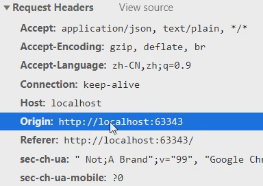
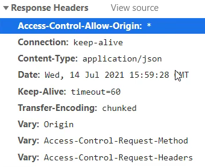
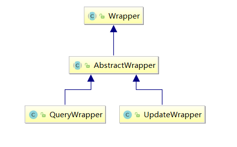

# SpringBoot_MyBatisPlus

---

---

---

## SpingBoot

---

---

### 一、JavaConfig

---

#### (一) 什么是JavaConfig

- Spring 提供的使用 **Java 类配置容器**

- 配置 **Spring IOC 容器**的纯 Java 方法

  > 将一个 Java 类当作**配置文件**

#### (二) @Configuration与@Bean

- `@Configuration`：放在类上面，表示将这个类当作**配置文件**

  > @Configuration 注解本身是有*@Component 注解*修饰的，
  >
  > 所以这个对象也会被**创建并放到容器**中，毕竟还是要被调用的

- `@Bean`：将方法的返回值(一个对象)**注入到容器**中

  > id 默认为类名小写

#### (三) 使用 JavaConfig 的基本步骤

1. 依赖：spring-context、插件：maven-complier-plugin

2. 创建一个 Java 类，用 ***<u>@Configuration</u>*** 修饰**类**

3. 在这个类中定义方法，返回一个对象，用 <u>***@Bean</u>*** 修饰这个**方法**

   > 表示会将方法返回的对象放到容器中；
   >
   > Bean 注解的 **name 属性**代表对象在容器中的 ***id***，默认是**方法名**

4. 使用 ***<u>AnnotationConfigApplicationContext</u>*** 这个实现类去创建**容器**

   - 构造方法中传入代表配置文件的 **Java 类 .class**

#### (四) @ImportResource

- 作用用：导入其他 XML 配置文件，从而通过 **XML 配置文件**创建容器中的对象

- 写好 applicationContext.xml 配置文件后，在 SpringConfig 类上使用 ***<u>@ImportResource</u>***

  > 相当于 import 标签

- value 属性是**配置文件的位置**，通常以 ***classpath:*** 开头，代表类路径下的

  > value属性是数组，可以指定多个配置文件

#### (五) @PropertyResource 和 @ComponentScan

- 读取**属性配置文件**，实现<u>外部化配置</u>

- 先创建好 .properties 属性配置文件

- 在代表配置文件的 Java 类上添加 <u>@PropertyResource 注解</u>，
  value 属性指定为**属性配置文件**路径

  > 通常也是类路径开始 classpath:xxx.properties；
  >
  > 相当于 property-placeholder 标签

- 在代表配置文件的 Java 类上添加 <u>@ComponentScan注解</u>，
  basePackages 属性指定为对象所在**包**

  > 相当于 component-scan 标签

- 用 **@Component 系列注解**修饰要创建的类，
  并用 **@Value 注解 **以属性配置文件的格式注入属性

---

### 二、SpringBoot入门

---

#### (一) SpringBoot概述

- Spring 家族的成员，可以简化 Spring 、Spring MVC 的使用
- 核心是 IOC 容器

#### (二) SpringBoot特性

- 可以创建 ***Spring* 应用**

- **内嵌**了服务器

  > 比如：Tomcat 、Jetty

- 提供了 ***starter*** <u>起步依赖</u>，简化应用的**配置**

  > 比如使用 MyBatis 框架，只需要加入一个 mybatis-spring-boot-starter 依赖

- 尽可能配置好 <u>Spring</u> 和<u>第三方库</u>

- 提供了健康检查、统计、外部化配置

- 不用再生成代码，不用再使用 XML 配置

#### (三) 创建Spring项目

##### 1、方式一：Spring 初始化器

> 使用 Spring 提供的**初始化器**作为向导

1. 新建 Module，选择 Spring Initializr

2. Server URL 使用默认的 start.spring.io 即可

   > 也可以选择使用国内镜像：https://start.springboot.io

   > **直接访问URL**也可以去初始化项目

3. 选择 Dependencies

   > 对于简单的 Java WEB 项目来说，选择 Spring web 即可

4. 关于目录结构：

   - resources/static ：**静态资源**目录
   - resources/template ：模板目录
   - resources/application.properties ：Spring Boot 重要**配置文件** 

5. 关于 pom.xml 文件

   - parent 指定父项目是 spring-boot-starter-parent

   - 坐标

   - properties 标签配置 java.version

   - dependencies 中依赖，版本号不写，默认与父项目保持一致

     > spring-boot-starter-web 依赖包括：
     >
     > - 启动器 starter
     > - JSON 相关
     > - 内嵌 Tomcat
     > - spring-web 和 spring-webmvc

   - build/plugins 中的 spring-boot-maven-plugin 插件

##### 2、方式二：maven 向导

1. 创建普通的 Maven 工程
2. 在 pom.xml 文件中
   - 添加父项目
   - 添加相关依赖
3. 在目录结构中
   - 新建 resources 下的文件夹和配置文件

#### (四) @SpringBootApplication

- 修饰类，代表该类是这个 Spring Boot 项目的**主启动类**

  > 一般这个类的名字叫 Application

- 注解源码分析：

  ```java
  @SpringBootConfiguration
  @EnableAutoConfiguration
  @ComponentScan(
      excludeFilters = {@Filter(
      type = FilterType.CUSTOM,
      classes = {TypeExcludeFilter.class}
  )
  public @interface SpringBootApplication {...}
  ```

  >`@SpringBootConfiguration`注解本身又有`@Configuration`修饰，
  >
  >也就是说，它所修饰的类就可以当作容器**<u>配置文件</u>**，
  >
  >可以直接在 Application.java 中通过<u>方法</u>**声明对象并注入容器**

  >`@EnableAutoConfiguration`：
  >
  >启用**自动配置**，将 Java 对象配置好并注入到 Spring 容器中

  > @ComponentScan：**组件扫描器**
  >
  > 默认扫描的是当前包和**子包**，所以建议将容器中的类写在子包中

- 该注解修饰的类要有一个`main`方法，用于启动整个 Spring Boot 项目

  ```java
  public static void main(String[] args) {
      SpringApplication.run(Application.class, args);
  }
  ```

#### (五) SpringBoot环境配置文件

$\Rarr$两种格式：

- application.properties：`key=value`

- application.yml ：`k: v`

  > `:`后面要有**一个空格**；
  >
  > 可以采用结构化的方式，有层级关系，层级之间也必须有**两个空格**

$\Rarr$常用配置

- .properties

  ```properties
  #端口号
  server.port=8082
  #应用上下文路径
  server.servlet.context-path=/myboot
  ```

- .yml

  ```properties
  server:
    port: 8083
    servlet:
      context-path: /myboot2
  ```

$\Rarr$多环境配置

- 为**不同的环境**创建配置文件，只需要在**配置文件名**上体现环境即可

  > 命名规则：`application-环境名称.yml|properties`

- 在`appliction.yml|properties`中指定激活哪个配置文件

  ```properties
  spring:
    profiles:
      active: 环境名称
  ```
  
  > 不指定激活的话，就只有application.yml一个配置文件起作用

#### (六) SpringBoot自定义配置

> 前提是要在 applcation.yml 文件中自定义一些键值对，
>
> 以下两个注解是不同的**注入**方式

$\Rarr$@Value

- 可以直接在application.yml文件中自定义**键值对**
- 在其他 Bean 的属性注入时，可以直接使用`@Value(${key})`读取

$\Rarr$@ConfigurationProperties

- 修饰类，表示这个 Java 类作为一个**属性配置文件**来使用，也就是<u>将配置文件中的数据映射到对象的同名属性中</u>

  > 这个类需要提供setter；
  >
  > 这样就会去application.yml文件中自动读取并注入到**同名属性**中

- ***prefix***属性，属性值指定为application.yml中的**层级前缀**

  > 如果不指定这个属性，就需要使用全名：`xxx.xxx.xxx`（其实没这么写的）
  >
  > 这个注解属性有别名：value

- 如果其他类要使用，还要用<u>@Component修饰</u>这个类，在需要使用的java类中，<u>引用类型注入</u>

> 如果想要自定义一些ConfigurationProperties元数据，
>
> 可以加入依赖：spring-boot-configuration-processor

#### (七) SpringBoot容器

- `SpringApplication.run(Application.class, args)`的返回值就是容器

  ```java
  public static ConfigurableApplicationContext run
      (Class<?> primarySource, String... args) {
      return run(new Class[]{primarySource}, args);
  }
  //ConfigurableApplicationContext extends ApplicationContext
  ```

#### (八) CommandLineRunner

- 用于**容器创建后**执行一些内容

  >比如读取配置文件，数据库连接

- ***CommandLineRunner*** 和 ApplicationRunner

  - 都是接口，都有一个 <u>***run*** 方法</u>

    > 具体到代码上，run方法会在 <u>***SpringApplication.run*** 方法</u>之后执行；
    >
    > 此时容器中的对象已经创建好，属性注入也已经完成

  - CommandLineRunner 的 run 方法参数为 <u>String 数组</u>

  - ApplicationRunner 的 run 方法参数为ApplicationArguments

- 使用方法

  - <u>主启动类 Application 实现 CommandLineRunner 接口</u>
  - 实现其中的 **run 方法**

---

### 三、SpringBoot和web组件

---

> DispatcherServlet已经由SpringBoot自动创建好了

> 以下这些 Web 组件可以写在一个 JavaConfig 类里，
>
> 有的是<u>**接口实现方法**</u>，有的是 **<u>@Bean 方法返回对象</u>**

#### (一) SpringBoot拦截器

- 定义一个**拦截器**类，需要实现 <u>***HandlerInterceptor* 接口**</u>，并实现其中的部分**方法**

- 定义一个**MVC配置**类，需要实现 <u>***WebMvcConfigurer* 接口**</u>，
  并实现其中的<u>***addInterceptores* 方法**</u>

  > 这个接口中的方法也都有 ***default*** 修饰

  > addInterceptors 方法有一个 InterceptorRegistry 参数，用来配置**拦截器的具体信息**


> 定义举例：
>
> ```java
> public class LoginInterceptor implements HandlerInterceptor {
>     @Override
>     public boolean preHandle(HttpServletRequest request, HttpServletResponse response, Object handler) throws Exception {
>         System.out.println("preHandler executed !!!");
>         return true;
>     }
> }
> ```
>
> ```java
> @Configuration
> public class MyAppConfig implements WebMvcConfigurer {
>     @Override
>     public void addInterceptors(InterceptorRegistry registry) {
>         registry.addInterceptor(new LoginInterceptor())
>                 .addPathPatterns("/user/**")
>                 .excludePathPatterns("/user/vipLogin");
>     }
> }
> ```
>
> >需要用 <u>@Configuration 注解</u>修饰 MVC 配置类；
> >
> >这个`LoginInterceptor`也可以先用@Component修饰，然后通过@Autowired注入，再`addInterceptor`加进去

#### (二) SpringBoot Servlet

1. 创建 Servlet，继承 HttpServlet

   > Spring MVC 内嵌的 Tomcat 服务器中有相关包

2. 定义一个 <u>***Servlet*** 配置类</u>，用 ***@Configuration*** 修饰

3. 在 Servlet 配置类中定义方法，用 ***@Bean*** 修饰，返回 ***<u>ServletRegistrationBean</u>*** 对象

   > new 这个对象需要两个参数，一个是 Servlet，另一个是 String 类型的 url-pattern
   >
   > ```java
   > @Configuration
   > public class ServletConfig {
   >     @Bean
   >     public ServletRegistrationBean createServlet() {
   >         return new ServletRegistrationBean
   >             (new MyServlet(), "/myServlet");
   >     }
   > }
   > ```
   >
   > 也可以使用无参构造，然后借助方法配置 Servlet
   >
   > ```java
   > @Configuration
   > public class ServletConfig {
   >     @Bean
   >     public ServletRegistrationBean createServlet() {
   >         ServletRegistrationBean servletBean = 
   >             new ServletRegistrationBean();
   >         servletBean.setServlet(new MyServlet());
   >         servletBean.addUrlMappings("/myServlet");
   >         return servletBean;
   >     }
   > }

> 直接用 <u>***@WebServlet*** 注解</u>也可以

#### (三) SpringBoot Filter

1. 创建自定义过滤器类

   1. 定义一个类，实现 <u>***Filter*** 接口</u>

   2. 重写 <u>***doFilter*** 方法</u>

      > 接口中还有 init 和 destroy 方法，不过有 default 修饰

2. 配置过滤器对象

   1. @Configuration、@Bean

   2. 方法返回值类型是 ***FilterRegistration*** 

      > 可以用 <u>setFilter 方法</u>和 <u>addUrlPatterns 方法</u>配置

> 举例：
>
> ```java
> public class MyFilter implements Filter {
>     @Override
>     public void doFilter(ServletRequest servletRequest, 
>                          ServletResponse servletResponse, 
>                          FilterChain filterChain) 
>         throws IOException, ServletException {
>         System.out.println("filtered");
>         filterChain.doFilter(servletRequest, servletResponse);
>     }
> }
> ```
>
> ```java
> @Configuration
> public class FilterConfig {
>     @Bean
>     public FilterRegistrationBean createFilter() {
>         FilterRegistrationBean bean = new FilterRegistrationBean();
>         bean.setFilter(new MyFilter());
>         bean.addUrlPatterns("/user/*");
>         return bean;
>     }
> }
> ```
>
> 注：过滤器比拦截器先执行

> 直接用 <u>***@WebFilter*** 注解</u>也可以

> :star:==字符集过滤器==的应用
>
> - 在<u>注册 Filter</u> 的时候，new 一个字符集过滤器 ***<u>CharacterEncodingFilter</u>***
>
>   > 不用 new 自己写的了
>
> - 指定使用的编码方式
>
>   ```java
>   CharacterEncodingFilter filter = new CharacterEncodingFilter();
>   filter.setEncoding("utf-8");
>   filter.setForceEncoding(true);
>   ```
>
> - 注册过滤器
>
> - 在**主配置文件**中设置关闭默认的字符集过滤器
>
>   ```properties
>   server:
>     servlet:
>       encoding:
>         enabled: false
>   ```
>
> > :star:直接利用**默认字符集过滤器**：
> >
> > ```properties
> > server:
> >   port: 8081
> >   servlet:
> >     context-path: /mydev
> >     encoding:
> >       charset: utf-8
> >       force: true
> > ```

---

### 四、ORM操作MySQL

---

> ORM：对象关系映射，***Object Relational Mapping***

#### (一) 基本使用步骤

1. MyBatis 起步依赖和 MySQL 驱动

   - Spring Web
   - MyBatis Framework
   - MySQL Driver

2. pom.xml 资源插件

3. 创建实体类和 Dao 接口

   > :star:要用 <u>***@Mapper*** 注解</u>修饰 Dao 接口，代表创建此接口的**代理对象**
   >
   > > 这样 Spring Boot 就会自动创建代理对象并放入容器

4. 创建 Mapper XML 文件

5. 创建 Service 层对象

6. 创建 Controller 层对象

7. 配置文件 application.yml

   ```properties
   server:
     port: 9001
     servlet:
       context-path: /orm
   spring:
     datasource:
       driver-class-name: com.mysql.cj.jdbc.Driver
       url: jdbc:mysql://localhost:3306/springdb?useUnicode=true&characterEncoding=UTF-8&serverTimezone=GMT%2B8
       username: root
       password: 123456
   ```
   
   > SpringBoot默认使用hikari连接池，有默认配置，如果想进行其他配置，可以参考下面这个：
   >
   > ```yaml
   > spring:
   >   datasource:
   >     driver-class-name: com.mysql.cj.jdbc.Driver
   >     url: jdbc:mysql://localhost:3306/yeb?useUnicode=true&characterEncoding=UTF-8&serverTimezone=Asia/Shanghai
   >     username: root
   >     password: 123456
   >     hikari:
   >       # 连接池名
   >       pool-name: DateHikariCP
   >       # 最小空闲连接数
   >       minimum-idle: 5
   >       # 空闲连接存活最大时间，默认600000(10分钟)
   >       idle-timeout: 180000
   >       # 最大连接数，默认10
   >       maximum-pool-size: 10
   >       # 从连接池返回的连接的自动提交
   >       auto-commit: true
   >       # 连接池最大存活时间，0表示永久存活，默认1800000（30分钟）
   >       max-lifetime: 1800000
   >       # 连接超时时间，默认30000（30秒）
   >       connection-timeout: 30000
   >       # 测试连接是否可用的查询语句
   >       connection-test-query: SELECT 1
   > ```

#### (二) @MapperScan

- 作用：用于扫描多个 Dao 接口，同时创建多个**代理**

- 用法：修饰**主类**，指定 <u>***basePackage*** 属性</u>为包名

  > 属性值是 String 类型数组

#### (三) Dao接口与Mapper文件分开

1. 新建 ***resources/mapper*** 目录，将 mapper.xml 都放在这个目录中

2. 在 application.yml 中指定 ***mybatis.mapper-locations***

   ```properties
   mybatis:
     mapper-locations: classpath:mapper/*.xml
   ```

   > 这样资源插件就可以不用特意配置了

3. 在 application.yml 中指定 ***mybatis.configuration.log-impl***，开启日志功能

   ```properties
   mybatis:
     mapper-locations: classpath:mapper/*.xml
     configuration:
       log-impl: org.apache.ibatis.logging.stdout.StdOutImpl
   ```

> 还可以使用`mybatis.type-aliases-package`来指定起别名的包；
>
> 如果想单个起别名，就用`@Alias`注解修饰要起别名的实体类，value 属性为别名 

#### (四) SpringBoot事务

> ==事务管理器接口==，有很多实现类；
>
>  JDBC 和 MySQL访问数据库，使用的事务管理器：***DataSourceTransactionManager***

> 声明式事务：XML 配置文件或注解

> 事务处理方式：
>
> - Spring 框架中的 @Transactional
> - AspectJ框架的 XML 配置文件
> - Spring Boot 框架 ......

- 在业务方法上加 <u>***@Transactional*** 注解</u>

  > 最好同时在主启动类上加 @EnableTransactionManager，表示启用事务管理器

  > 默认：
  >
  > 数据库的隔离级别、传播行为 REQUIRED、超时时间 -1；
  >
  > 抛出运行时异常，回滚事务

#### (五) MyBatis逆向工程

1. 在 pom.xml 文件中配置MyBatis 代码自动生成插件

   ```xml
   <plugin>
       <groupId>org.mybatis.generator</groupId>
       <artifactId>mybatis-generator-maven-plugin</artifactId>
       <version>1.3.6</version>
       <configuration>
           <configurationFile>GeneratorMapper.xml</configurationFile>
           <verbose>true</verbose>
           <overwrite>true</overwrite>
       </configuration>
   </plugin>
   ```

2. 在整个项目的根目录(与 src 平级)下添加 Generator.xml 文件

   ```xml
   <?xml version="1.0" encoding="UTF-8"?>
   <!DOCTYPE generatorConfiguration
           PUBLIC "-//mybatis.org//DTD MyBatis Generator Configuration 1.0//EN"
           "http://mybatis.org/dtd/mybatis-generator-config_1_0.dtd">
   
   <generatorConfiguration>
   
       <!-- ***指定连接数据库的JDBC驱动包所在位置，指定到你本机的完整路径 -->
       <classPathEntry location="D:\Java\MyRepository\mysql\mysql-connector-java\8.0.28\mysql-connector-java-8.0.28.jar"/>
   
       <!-- 配置table表信息内容体，targetRuntime指定采用MyBatis3的版本 -->
       <context id="tables" targetRuntime="MyBatis3">
   
           <!-- 抑制生成注释，由于生成的注释都是英文的，可以不让它生成 -->
           <commentGenerator>
               <property name="suppressAllComments" value="true" />
           </commentGenerator>
   
           <!-- 配置数据库连接信息 -->
           <jdbcConnection driverClass="com.mysql.cj.jdbc.Driver"
                           connectionURL="jdbc:mysql://localhost:3306/springdb?useUnicode=true&amp;characterEncoding=UTF-8&amp;serverTimezone=GMT%2B8"
                           userId="root"
                           password="123456">
           </jdbcConnection>
   
           <!-- ***生成model类，targetPackage指定model类的包名， targetProject指定生成的model放在IDEA的哪个工程下面-->
           <javaModelGenerator targetPackage="com.bjpowernode.model"
                               targetProject="D:\Java\JavaProjects\springboot-prj\springboot-019-transactional\src\main\java">
               <property name="enableSubPackages" value="false" />
               <property name="trimStrings" value="false" />
           </javaModelGenerator>
   
           <!-- ***生成MyBatis的Mapper.xml文件，targetPackage指定mapper.xml文件的包名， targetProject指定生成的mapper.xml放在eclipse的哪个工程下面 -->
           <sqlMapGenerator targetPackage="mapper" targetProject="src/main/resources">
               <property name="enableSubPackages" value="false" />
           </sqlMapGenerator>
   
           <!-- ***生成MyBatis的Mapper接口类文件,targetPackage指定Mapper接口类的包名， targetProject指定生成的Mapper接口放在eclipse的哪个工程下面 -->
           <javaClientGenerator type="XMLMAPPER" targetPackage="com.bjpowernode.dao" targetProject="src/main/java">
               <property name="enableSubPackages" value="false" />
           </javaClientGenerator>
   
           <!-- ***数据库表名及对应的Java模型类名 -->
           <table tableName="student3" domainObjectName="Student"
                  enableCountByExample="false"
                  enableUpdateByExample="false"
                  enableDeleteByExample="false"
                  enableSelectByExample="false"
                  selectByExampleQueryId="false"/>
       </context>
   </generatorConfiguration>
   ```

3. Maven$\rarr$plugins

> 当然还是需要在 application.yml 中进行相关配置

---

### 五、接口架构风格——RESTful

---

#### (一) 概述

- API (***Application Programming Interface***)：应用程序接口

  > 接口或约定，访问程序的入口

- 接口架构风格：API 的组织方式

  > 比如：URL?key=value&key=value..... 就是一种风格

- :star:REST (***REpresentational State Transfer***)：表现层状态转移

  - 一种接口架构风格，一种理念

  - 优点：简洁、有层次

  - 要素：**资源**、对资源的**操作**

    > 资源：
    >
    > - URL
    >
    > 操作：(增删改查)
    >
    > - GET：查询资源
    > - POST：增加资源
    > - PUT：更新资源
    > - DELETE：删除资源

  - 表现层：视图层，展示资源的

  - 状态：资源的变化

  - 转移：资源随着操作发生变化

  - ==使用 URL 表示资源，使用 HTTP 动作操作资源==
  
    > 而不是把动作也写在 URL 上

#### (二) RESTful 相关注解

- `@RestController`：使用在类上面，有`@Controller`的功能，
  同时还相当于给所有方法都加上`@ResponseBody`

- `@GetMapping`、`@PostMapping`、`@PutMapping`、`@DeleteMapping`

  > 等同于：
  >
  > ```java
  > @RequestMapping(method = RequestMethod.GET)
  > @RequestMapping(method = RequestMethod.POST)
  > @RequestMapping(method = RequestMethod.PUT)
  > @RequestMapping(method = RequestMethod.DELETE)
  > ```
  >
  > 可以替代`@RequestMapping`，也需要<u>指定**路径**</u>，路径中可以使用<u>占位符`{xxx}`</u>

- `@PathVariable`：修饰 controller 方法形参，从 URL 中获取数据

  - value 属性指定为**占位符**，就可以给对应参数赋值

    > 当路径变量名与形参名相同时，可以省略 value 属性

  - 只能修饰**简单类型**的形参，不能用**对象**接收了

> 注意保证唯一性：<u>请求方式 + URL</u> 整体是唯一的

#### (三) 支持PUT、DELETE

- 使用过滤器：`HiddenHttpMethodFilter`

  > 作用：将 POST 请求转为 PUT 或 DELETE

- 实现步骤：

  1. 在 application.yml 文件中开启**过滤器**

     ```properties
     spring:
       mvc:
         hiddenmethod:
           filter:
             enabled: true
     ```

  2. 在请求页面中包含 <u>_method 参数</u>，值指定为 put 或 post

     ```html
     <from action="" method="post">
     	<input type="hidden" name="_method" value="PUT">
     </from>
     ```

> 其实用 RESTful 注解也可以不遵循其风格(doge

---

### 六、SpringBoot集成Redis

---

#### (一) Redis 简介

- NOSQL数据库，常用作**缓存 **(Cache)

- Redis 的数据类型：string、hash、set、zset、list

- Redis 属于中间件，是独立的服务器

  > Java 中比较著名的客户端：Jedis、Lettuce、Redisson；
  >
  > SpringBoot 中有 RedisTemplate 和 StringRedisTemplate

#### (二) 操作步骤

1. 依赖选择

   - Spring Web

   - NoSQL $\rarr$ Spring Data Redis

     > pom.xml 中会增加 redis 起步依赖项：
     >
     > ```xml
     > <dependency>
     >     <groupId>org.springframework.boot</groupId>
     >     <artifactId>spring-boot-starter-data-redis</artifactId>
     > </dependency>
     > ```
     >
     > 这样就可以直接使用 `RedisTemplate `和 `StringRedisTemplate` 类了（也可以使用 JavaConfig 去自己创建，详见云E办项目）；
     >
     > 实际上使用的是  <u>lettuce 客户端</u>，这两个类调用的也是这个客户端

2. 配置 redis 服务器信息

   ```properties
   spring:
     redis:
       host: localhost
       port: 6379
       #password:没有密码就不用设置
   ```

   > 如果使用虚拟机，host 就要配置虚拟机的 IP 地址

3. 注入 RedisTemplate 属性

   ```java
   @Resource
   private RedisTemplate redisTemplate;
   ```

   > 泛型可以都是`Object`、都是`String`或者不指定；
   >
   > SpringBoot 放到容器中的对象默认名就是 redisTemplate；
   >
   > 这样写的话，默认用的是 JDK 序列化方式，可以修改

   > 也可以用这个 template
   >
   > ```java
   > @Resource
   > private StringRedisTemplate stringRedisTemplate;
   > ```
   >
   > 这个默认的泛型就是`String`，使用的是 String 的序列化，可读性强
   >
   > ```java
   > public class StringRedisTemplate extends RedisTemplate<String, String> 
   > {...}
   > ```

4. 操作数据

   - 操作`String`类型数据

     ```java
     ValueOperations valueOperations = redisTemplate.opsForValue();
     valueOperations.set(name, value);
     ```
   
     ```java
     ValueOperations valueOperations = redisTemplate.opsForValue();
     Object v = valueOperations.get(k);
     ```
   
     > 用`String`专用也可以
     >
     > ```java
     > ValueOperations<String, String> stringStringValueOperations = stringRedisTemplate.opsForValue();
     > stringStringValueOperations.set(k, v);
     > ```
     >
     > ```java
     > String v = stringRedisTemplate.opsForValue().get(k);
     > ```
   

> :star:补充：序列化
>
> 概念：
>
> - 序列化：将对象转化为可传输的字节序列
> - 反序列化：将字节序列还原成对象
>
> 应用场景：
>
> - 跨平台存储
> - 网络传输
>
> 序列化方式：
>
> > 序列化只是一种拆装对象的规则，规则可以有很多种
>
> - JDK (不支持跨语言)
>
>   > 这个性能差，高并发时可以用 Kryo (不支持跨语言)，或者用 JSON
>
> - JSON
>
> - XML
>
> SpringBoot 中修改 Redis 序列化
>
> ```java
> redisTemplate.setKeySerializer(new StringRedisSerializer());
> redisTemplate.setValueSerializer(new StringRedisSerializer());
> ```
>
> ```java
> redisTemplate.setKeySerializer(new StringRedisSerializer());
> redisTemplate.setValueSerializer(
>     new Jackson2JsonRedisSerializer(Student.class));
> ```
>
> > Json 序列化在 get 之后会自动反序列化成对象，而不是得到一个 Json 字符串


---

### 八、打包

---

#### (一) war

1. 新建 webapp 目录，在 Project Structures 中添加 web 根目录

2. 在配置文件中指定视图解析器

   ```properties
   spring:
     mvc:
       view:
         prefix: /
         suffix: .jsp
   ```

3. 指定打包类型

   ```xml
   <packaging>war</packaging>
   ```

4. 添加 resources 插件

   ```xml
   <build>
       <resources>
           <resource>
               <directory>src/main/webapp</directory>
               <!--这个要指定是因为不编译到类路径中-->
               <targetPath>META-INF/resources</targetPath>
               <includes>
                   <include>**/*.*</include>
               </includes>
           </resource>
       </resources>
       <!--这个一定要加-->
       <resource>
           <directory>src/main/resources</directory>
           <includes>
               <include>**/*.*</include>
           </includes>
       </resource>
   </build>
   ```

5. 指定打包后的名字

   ```xml
   <build>
       <finalName>myBoot</finalName>
   </build>
   ```

6. 部署 war 到独立的 Tomcat 服务器

   - 主启动类继承`SpringBootServletInitializer`，并重写`configure`
   - 相当于 web.xml 文件的作用

   ```java
   @SpringBootApplication
   @EnableTransactionManagement
   @MapperScan(basePackages = "com.bjpowernode.dao")
   public class Springboot019TransactionalApplication extends SpringBootServletInitializer {
       public static void main(String[] args) {
           SpringApplication.run(Springboot019TransactionalApplication.class, args);
       }
       @Override
       protected SpringApplicationBuilder configure(SpringApplicationBuilder builder) {
           return builder.sources(Springboot019TransactionalApplication.class);
       }
   }
   ```

7. `mvn package`

8. 将 war 包放到独立 Tomcat 服务器的 webapps 目录下

   > 注意，端口号与应用上下文路径由实际的 Tomcat 决定

#### (二) jar

- pom.xml 中打包类型

  ```xml
  <packaging>jar</packaging>
  ```

- 其他和 war 相同

- 使用<u>内嵌 Tomcat</u> 部署项目

  ```shell
  java -jar xxx.jar
  ```

  > 端口号和上下文根路径和配置的相同

#### (三) war 与 jar 区别

- war
  - 需要独立的 Tomcat，可以充分利用其能力
- jar
  - 内嵌 Tomcat ，可以独立运行
  - 但内嵌 Tomcat 功能稍弱

---

### 九、跨域问题

---

#### (一) 什么是跨域

浏览器出于安全的考虑，使用`XMLHttpRequest`对象发起HTTP请求时必须遵守**同源策略**，否则就是跨域的HTTP请求，<u>默认情况下是被禁止的</u>。

同源策略要求**源相同**才能正常进行通信，即***【协议、域名、端口号】***都完全一致。 

#### (二) CORS解决跨域

***CORS*** 是一个<u>W3C标准</u>，全称是”跨域资源共享”（*Cross-origin resource sharing*），
允许浏览器向跨源服务器，发出`XMLHttpRequest`请求，从而克服了AJAX只能同源使用的限制。

它通过服务器增加一个特殊的 ***Header[Access-Control-Allow-Origin]*** 来告诉**客户端**跨域的限制，如果<u>浏览器支持CORS</u>、并且<u>判断Origin通过</u>的话，就会允许`XMLHttpRequest`发起**跨域**请求。

> 在Request Headers中：
>
> 
>
> 在Response Headers中：
>
> 

#### (三) SpringBoot使用CORS解决跨域

##### 1.使用@CrossOrigin

可以在支持跨域的方法上或者是Controller上<u>加上@CrossOrigin注解</u>

~~~~java
@RestController
@RequestMapping("/user")
@CrossOrigin
public class UserController {

    @Autowired
    private UserServcie userServcie;

    @RequestMapping("/findAll")
    public ResponseResult findAll(){
        //调用service查询数据 ，进行返回
        List<User> users = userServcie.findAll();

        return new ResponseResult(200,users);
    }
}
~~~~

> 这个注解可以加在**类**上或**方法**上，加完注解后需要**重启**

##### 2.使用 WebMvcConfigurer 的 addCorsMappings 方法配置CorsInterceptor

~~~~java
@Configuration
public class CorsConfig implements WebMvcConfigurer {

    @Override
    public void addCorsMappings(CorsRegistry registry) {
      					// 设置允许跨域的路径
        registry.addMapping("/**")
                // 设置允许跨域请求的域名
                .allowedOriginPatterns("*")
                // 是否允许cookie
                .allowCredentials(true)
                // 设置允许的请求方式
                .allowedMethods("GET", "POST", "DELETE", "PUT")
                // 设置允许的header属性(携带什么样的请求头)
                .allowedHeaders("*")
                // 跨域允许时间
                .maxAge(3600);
    }
}
~~~~

> 核心是`WebMvcConfigurer`接口的实现类对象，需要实现`addCorsMappings`方法
>
> (`@Configuration`注解修饰的也会注入到容器中)

> SpringBoot底层有CorsInterceptor对跨域请求发挥作用

> maxAge的含义是：在发送一些请求（比如某些PUT请求）前，可能会提前发一个跨域请求询问一下，得到了这个maxAge之后就知道允许跨域了，然后在maxAge时间内就不会发送询问请求了

---

---

## MyBatisPlus

---

---

### 一、概述

---

#### (一) 与 MyBatis 关系

- Just like 魂斗罗红蓝 CP 的关系

> 中国人开发的，baomidou

#### (二) 优点

- 强大的 CRUD 操作
- 内置代码生成器
- 内置分页

---

### 二、MyBatis基础

---

#### (零) 基本使用

1. 添加依赖（SpringBoot起步、MyBatisPlus起步）

   ```xml
   <dependency>
       <groupId>com.baomidou</groupId>
       <artifactId>mybatis-plus-boot-starter</artifactId>
       <version>3.3.2</version>
   </dependency>
   ```

2. mapper 接口继承内置的 <u>`BaseMapper `接口</u>

   ```java
   public interface PojoDao extends BaseMapper<Pojo> {...}
   ```

   > 这样不用写 XML 文件也能实现**基本的 CRUD**；
   >
   > 当然 ***@MapperScan*** 还是要写的，会创建**动态代理**；

3. 用注解配置实体类：

   - 用 `@TableName` 修饰实体类，指定 value 属性，设置相关表名

     > 如果不使用这个注解，默认会将实体类名当作表名（允许大小写）

   - 用`@TableId`修饰属性，属性 value 指定主键名称，属性 type 指定字段类型

     > 现在简单使用，先指定成自增类型：
     >
     > ```java
     > @TableId(value = "id", type = IdType.AUTO)
     > private Integer id;
     > ```
     >
     > > 如果表中的主键字段名是 id ，可以不指定 type 属性

   - 下划线命名和驼峰命名是可以自动转换的，如果实在不一致，可以用`@TableField`注解指定；

4. 提供日志：在配置文件配置 MyBatisPlus 日志

   ```properties
   mybatis-plus:
     configuration:
       log-impl: org.apache.ibatis.logging.stdout.StdOutImpl
   ```

5. 调用接口方法，进行简单的 CRUD 操作

#### (一) 常用注解

*$\Rarr$`@TableName`*

- 表名由是泛型（实体类）决定的，默认是驼峰转下划线

- 指定 ***value* 属性**为数据库中的**表名**

- 全局配置表**前缀**：在配置文件中设置

  ```properties
  mybatis-plus:
    global-config:
      db-config:
        table-prefix: t_
  ```

*$\Rarr$`@TableId`*

- MyBatisPlus 默认把字段名为 ***id*** 的字段当成主键

- MyBatisPlus 默认用**雪花算法**给主键赋唯一值

  > 当然插入的时候如果**手动赋值**，就不用雪花算法生成了
  >
  > （自动递增也是一个道理）

- `@TableId`修饰的**属性对应的字段**会成为主键

  > 默认会去找<u>“同名”字段</u>；
  >
  > 除非指定了 ***value*** 属性，就会去找字段名为属性值的

- ***type*** 属性代表**主键生成策略**

  > 默认为雪花算法(就算在数据库中设置了`auto_increment`)，
  >
  > 对应`IdType.ASSIGN_ID`；
  >
  > 如果想使用自动递增：
  >
  > 1. 数据库中设置了自动递增
  > 2. type 属性设置为`IdType.AUTO`

  > 全部策略：
  >
  > 全部主键策略定义在了枚举类`IdType`中，`IdType`有如下的取值
  >
  > - `AUTO`
  >
  >   数据库ID自增，**依赖于数据库**。该类型请确保数据库设置了 ID自增 否则无效
  >
  > - `NONE`
  >
  >   未设置主键类型。若在代码中没有手动设置主键，则会根据**主键的全局策略**自动生成（默认的主键全局策略是基于雪花算法的自增ID）
  >
  > - `INPUT`
  >
  >   需要手动设置主键，若不设置。插入操作生成SQL语句时，主键这一列的值会是`null`。
  >
  > - `ASSIGN_ID`
  >
  >   当没有手动设置主键，即实体类中的主键属性为空时，才会自动填充，使用雪花算法
  >
  > - `ASSIGN_UUID`
  >
  >   当实体类的主键属性为空时，才会自动填充，使用UUID

  > **全局配置**主键生成策略：
  >
  > ```properties
  > mytabis-plus:
  > global-config:
  >  db-config:
  >    id-type: auto
  > ```

> 关于雪花算法：
>
> - 分表问题
>
>   - 主键递增分表：简单、平滑，但可能不均匀
>   - 取模分表：均匀，但扩充时很麻烦，需要重新分布
>
> - 雪花算法
>
>   - 保证不同表的主键不重复 (分表后)
>
>   - 相同表的主键有序
>
>     > 后添加的大于之前添加的
>
>   - 核心思想：符号位 + 时间戳 + 机器 ID + 流水号
>
>   > 很适合**分布式**架构

*$\Rarr$`@TableField`*

- 默认情况下，**下划线**与**驼峰**是可以自动转换的

  > 如果需要关闭我们可以使用如下配置进行关闭。
  >
  > ~~~~yaml
  > mybatis-plus:
  >   configuration:
  > 	#是否开启自动驼峰命名规则（camel case）映射，即从经典数据库列名 A_COLUMN（下划线命名） 到经典 Java 属性名 aColumn（驼峰命名） 的类似映射
  >     map-underscore-to-camel-case: false
  > ~~~~

- 当不相同且无法自动转换时，可以用这个注解修饰属性，***value*** 指定为要对应的**字段名**

- 可以指定 <u>exist 属性</u>，为 false 代表数据库中不存在对应的字段

*$\Rarr$`@TableLogic`*

> 逻辑删除：
>
> 假删除，比如可以借助一个字段，代表“**被删除的状态**”；
>
> 这样可以进行**数据恢复**

- 如果表中有逻辑删除的字段，就可以用这个注解修饰对应的属性

  > value 也是同理

- 这样在删除的时候，就只是**修改逻辑删除字段值**了

  > 底层是其实 UPDATE；
  >
  > 会影响其他的 SQL ，每次操作的都是**未删除状态**的数据

#### (二) CRUD 基本操作

##### 1、insert 操作

- 对应的是接口的 `insert `方法

- 传入的实体类对象可以不指定主键，会自动调用 setter and getter

  > 前提是已经用 `@TableId` 注解修饰，且配置为自增长类型

##### 2、udpate 操作

- `updateById`方法，按照主键更新，传入的参数是**对象**

  > 直接指定好<u>对象的 id</u> 即可；
  >
  > 若<u>属性为`null`</u>，则**不会更新** (SET 关键字后不出现该字段)；
  >
  > 如果是**基本数据类型**，那就一定会被修改了(所以还是建议用**包装类**)

##### 3、delete 操作

- `deleteById`方法：按主键删除，参数是**主键类型** (不用传对象)

  > 主键类型需要**可序列化**

- `deleteByMap`方法：按条件删除，参数是`Map<String, Object>`，代表**删除条件**

  > key：字段名，value：要删除记录对应的值；
  >
  > Map 集合内多个元素是<u>==and的关系==</u>

- `deleteBatchIds`方法：按主键批量删除，参数是`Collection`

  > 底层是==in语句==；
  >
  > 可以结合 Lambda 表达式快速生成`List`集合，举例：
  >
  > ```java
  > List<Integer> ids = Stream.of(1, 2, 3, 4, 5).collect(Collectors.toList());
  > ```
  >
  > 当然用`Arrays.asList(param1, param2, ...)`也行

##### 4、select 操作

- `selectById`、`selectBatchIds`、`selectByMap`

  > 后两个方法返回的是`List`集合；查询结果为空时不会报错 

> 底层是`JDK`动态代理

#### (三) ActiveRecord

1. 实体类`Pojo`要继承`Model<Pojo>`，且保证实体类名与字段名一致

2. 定义`Mapper`接口，继承`BaseMapper<Pojo>`接口

   > 这个接口在代码中用不到，
   >
   > 但 MyBatisPlus 需要借助这个接口找到实体类，建立与表的关系，
   >
   > 所以也是必须要有的

3. 用 AR 对象本身就可以调用 SQL 相关方法

   > `pojo.insert()`：插入自身
   >
   > `pojo.updateById()`：根据主键更新，返回的是`boolean`
   >
   > `pojo.deleteById(Serializable)`：根据**传入的主键**删除，返回的是`boolean`
   >
   > > 如果要删除的记录本来就不存在，则返回`false`；
   > >
   > > 这个方法与 pojo 本身没有太大关系
   >
   > `pojo.deleteById()`：根据<u>`pojo`自己的主键属性</u>进行删除，返回的是`boolean`
   >
   > `pojo.selectById()`：根据<u>`pojo`自己的主键属性</u>进行查询，返回的是 pojo 对象
   >
   > > 查询结果为空会返回`null`
   >
   > `pojo.selectById(Serializable)`：根据**传入的主键**查询
   >
   > `pojo.selectAll()`：返回

#### (四) 通用service

1. 创建 service 接口，继承 `IService<Pojo>`接口

2. 创建 service 实现类，继承适配器`ServiceImpl<Mapper, Pojo>`，再实现接口

   > `Mapper`指的是 dao 接口，所以这里<u>还是需要写 dao 接口和 pojo 的</u>

   > 默认的接口和适配器已经提供了一些方法；
   >
   > 需要自定义方法时，可以再向类体中添加，和之前的添加方法都一样

3. 查 API 文档，调方法

   > 方法名一般都是**逻辑命名**，而不以 SQL 关键字命名；
   >
   > 方法都包装的很好，还有**事务**功能

   > 常用高级方法：
   >
   > `count()`：查询总记录数
   >
   > `saveBatch(Collection<Pojo>)`：**批量添加**
   >
   > `saveOrUpdateBatch(Collection<Pojo>)`：批量添加或修改
   >
   > > 批量添加的方法不会出现 dao 层，因为 SQL 不能太长了；
   > >
   > > service 的批量添加底层也是多个单个添加

---

### 三、MyBatis进阶

---

#### (一) 条件构造器

##### 1、概述

- 我们在实际操作数据库的时候会涉及到很多的==条件==。所以MP为我们提供了一个功能强大的条件构造器 `Wrapper` 。使用它可以让我们非常方便的<u>构造条件</u>。

  > 其继承体系如下：
  >
  > ​	
  >
  > 在其子类`AbstractWrapper`中提供了很多用于构造<u>Where条件</u>的方法。

- AbstractWrapper的子类 ***QueryWrapper*** 则额外提供了用于针对<u>***Select***语法</u>的select方法。可以用来<u>设置查询哪些列</u>。

- AbstractWrapper的子类***UpdateWrapper***则额外提供了用于针对<u>***SET***语法</u>的set方法。可以用来<u>设置对哪些列进行更新</u>。

> 完整的AbstractWrapper方法可以参照：
>
> https://baomidou.com/guide/wrapper.html#abstractwrapper
>
> 
>
> 介绍是用来干什么的。它的实现类有哪些
>
> QueryWrapper,UpdateWrapper，==LambdaQueryWrapper==

##### 2、用AbstractWrapper方法

> `eq`：equals，等于
> `gt`：greater than ，大于 >
> `ge`：greater than or equals，大于等于≥
> `lt`：less than，小于<
> `le`：less than or equals，小于等于≤
> `between`：相当于SQL中的BETWEEN
> `like`：模糊匹配。like("name","黄")，相当于SQL的name like '%黄%'
> `likeRight`：模糊匹配右半边。likeRight("name","黄")，相当于SQL的name like '黄%'
> `likeLeft`：模糊匹配左半边。likeLeft("name","黄")，相当于SQL的name like '%黄'
> `notLike`：notLike("name","黄")，相当于SQL的name not like '%黄%'
> `isNull`
> `isNotNull`
> `and`：SQL连接符AND
> `or`：SQL连接符OR
>
> `in`: in(“age",{1,2,3})相当于 age in(1,2,3)
>
> `groupBy`: groupBy("id","name")相当于 group by id,name
>
> `orderByAsc` :orderByAsc("id","name")相当于 order by id ASC,name ASC
>
> `orderByDesc` :orderByDesc ("id","name")相当于 order by id DESC,name DESC
>
> > 注：几乎所有这类方法都会有一种重载，第一个参数是`boolean condition`，后面的参数就是之前的所有参数，代表当某个条件成立时才会加入这个**筛选条件**

示例一

SQL语句如下： 

~~~~mysql
SELECT 
	id,user_name,PASSWORD,NAME,age,address 
FROM 
	USER 
WHERE 
	age > 18 AND address = '狐山'
~~~~

如果用Wrapper写法如下：<u>结合`selectList`方法</u>

~~~~java
@Test
public void testWrapper01(){
    QueryWrapper wrapper = new QueryWrapper();
    wrapper.gt("age",18);
    wrapper.eq("address","狐山");
    List<User> users = userMapper.selectList(wrapper);
    System.out.println(users);
}
~~~~

示例二

SQL语句如下：

~~~~mysql
SELECT 
	id,user_name,PASSWORD,NAME,age,address 
FROM 
	USER 
WHERE 
	id IN(1,2,3) AND 
	age BETWEEN 12 AND 29 AND 
	address LIKE '%山%'
~~~~

如果用Wrapper写法如下：

~~~~java
@Test
public void testWrapper02(){
    QueryWrapper<User> wrapper = new QueryWrapper<>();
    wrapper.in("id",1,2,3);
    wrapper.between("age",12,29);
    wrapper.like("address","山");
    List<User> users = userMapper.selectList(wrapper);
    System.out.println(users);
}
~~~~

示例三

SQL语句如下：

~~~~mysql
SELECT 
	id,user_name,PASSWORD,NAME,age,address 
FROM 
	USER 
WHERE 
	id IN(1,2,3) AND 
	age > 10 
ORDER BY 
	age DESC
~~~~

如果用Wrapper写法如下：

~~~~java
@Test
public void testWrapper03(){
    QueryWrapper<User> queryWrapper = new QueryWrapper<>();
    queryWrapper.in("id",1,2,3);
    queryWrapper.gt("age",10);
    queryWrapper.orderByDesc("age");
    List<User> users = userMapper.selectList(queryWrapper);
    System.out.println(users);
}
~~~~

##### 3、常用QueryWrapper方法

- QueryWrapper的 <u>select 方法</u>可以==设置要查询的列==。

$\Rarr$*示例一* 

> select(String... sqlSelect) 方法的测试为**要查询的列名**

SQL语句如下：

~~~~mysql
SELECT 
	id,user_name
FROM 
	USER 
~~~~

MP写法如下：

~~~~java
@Test
public void testSelect01(){
    QueryWrapper<User> queryWrapper = new QueryWrapper<>();
    queryWrapper.select("id","user_name");
    List<User> users = userMapper.selectList(queryWrapper);
    System.out.println(users);
}
~~~~

$\Rarr$*示例二*

```java
select(Class<T> entityClass, Predicate<TableFieldInfo> predicate)
```

- 方法的第一个参数为实体类的**字节码对象**

- 第二个参数为Predicate类型，可以使用lambda的写法，**过滤要查询的字段** (**主键除外**) 。

  > 过不过滤主键都会查出来

SQL语句如下：

~~~~mysql
SELECT 
	id,user_name
FROM 
	USER 
~~~~

MP写法如下：

~~~~java
@Test
public void testSelect02(){
    QueryWrapper<User> queryWrapper = new QueryWrapper<>();
    queryWrapper.select(User.class, new Predicate<TableFieldInfo>() {
        @Override
        public boolean test(TableFieldInfo tableFieldInfo) {
            return "user_name".equals(tableFieldInfo.getColumn());
        }
    });
    List<User> users = userMapper.selectList(queryWrapper);
    System.out.println(users);
}
~~~~

> 主要使用的是`tableFiledInfo.getColumn()`来得到并筛选列名

*$\Rarr$示例三*

```java
select(Predicate<TableFieldInfo> predicate)
```

- 方法第一个参数为Predicate类型，可以使用lambda的写法，过滤要查询的字段 (主键除外) 。

  > 其实就是在调用方法时省略了实体类，而在创建 `Wrapper`对象时传入了实体类

SQL语句如下：

~~~~mysql
SELECT 
	id,user_name,PASSWORD,NAME,age 
FROM 
	USER
~~~~

就是不想查询address这列，其他列都查询了

MP写法如下：

~~~~java
@Test
public void testSelect03(){
									    /*注意这里，传入了实体类*/
    QueryWrapper<User> queryWrapper = new QueryWrapper<>(new User());
    queryWrapper.select(new Predicate<TableFieldInfo>() {
        @Override
        public boolean test(TableFieldInfo tableFieldInfo) {
            return !"address".equals(tableFieldInfo.getColumn());
        }
    });
    List<User> users = userMapper.selectList(queryWrapper);
    System.out.println(users);
}
~~~~

##### 4、常用UpdateWrapper方法

> 我们前面在使用update方法时需要创建一个实体类对象传入，用来指定要更新的列及对应的值。但是如果<u>需要更新的列比较少</u>时，创建这么一个对象显的有点麻烦和复杂。

- 我们可以使用<u>UpdateWrapper的set方法</u>来**设置要更新的列及其值**。同时这种方式也可以使用Wrapper去指定更复杂的更新条件。

$\Rarr$*示例*

SQL语句如下：

~~~~mysql
UPDATE 
	USER
SET 
	age = 99
where 
	id > 1
~~~~

我们想把id大于1的用户的年龄修改为99，则可以使用如下写法：<u>结合`update`方法</u>

> 一般来说 update 方法的第一个参数传入 null 即可，第二个参数传入 updateWrapper；
>
> 调用 <u>set 方法</u>就相当于设置**第一个参数**了

~~~~java
@Test
public void testUpdateWrapper(){
    UpdateWrapper<User> updateWrapper = new UpdateWrapper<>();
    updateWrapper.gt("id",1);
    updateWrapper.set("age",99);
    userMapper.update(null,updateWrapper);
}
~~~~

##### 5、Lambda条件构造器

> 我们前面在使用条件构造器时**列名都是用字符串的形式去指定**。
> 这种方式无法在编译期确定列名的合法性。

- 所以MP提供了一个Lambda条件构造器可以让我们直接以<u>实体类的方法引用</u>的形式来指定**列名**。这样就可以弥补上述缺陷。

$\Rarr$示例		

要执行的查询对应的SQL如下

~~~~mysql
SELECT 
	id,user_name,PASSWORD,NAME,age,address 
FROM 
	USER 
WHERE 
	age > 18 AND address = '狐山'
~~~~

如果使用之前的条件构造器写法如下

~~~~java
@Test
public void testLambdaWrapper(){
    QueryWrapper<User> queryWrapper = new QueryWrapper();
    queryWrapper.gt("age",18);
    queryWrapper.eq("address","狐山");
    List<User> users = userMapper.selectList(queryWrapper);
}
~~~~

如果使用*Lambda*条件构造器写法如下

~~~~java
@Test
public void testLambdaWrapper2(){
    LambdaQueryWrapper<User> queryWrapper = new LambdaQueryWrapper<>();
    queryWrapper.gt(User::getAge,18);
    queryWrapper.eq(User::getAddress,"狐山");
    List<User> users = userMapper.selectList(queryWrapper);
}
~~~~

#### (二) 自定义SQL

> 虽然MP为我们提供了很多常用的方法，并且也提供了条件构造器。但是如果真的遇到了复制的SQL时，我们还是需要自己去定义方法，自己去写对应的SQL，这样SQL也更有利于后期维护。

- 因为MP是对mybatis做了增强，所以还是支持之前Mybatis的方式去自定义方法。

- 同时也支持在使用Mybatis的自定义方法时使用MP的条件构造器帮助我们进行条件构造。

##### 1、准备工作

①准备数据

~~~~mysql
CREATE TABLE `orders` (
  `id` bigint(20) NOT NULL AUTO_INCREMENT,
  `price` int(11) DEFAULT NULL COMMENT '价格',
  `remark` varchar(100) DEFAULT NULL COMMENT '备注',
  `user_id` int(11) DEFAULT NULL COMMENT '用户id',
  `update_time` timestamp NULL DEFAULT NULL COMMENT '更新时间',
  `create_time` timestamp NULL DEFAULT NULL COMMENT '创建时间',
  `version` int(11) DEFAULT '1' COMMENT '版本',
  `del_flag` int(1) DEFAULT '0' COMMENT '逻辑删除标识,0-未删除,1-已删除',
  `create_by` varchar(100) DEFAULT NULL COMMENT '创建人',
  `update_by` varchar(100) DEFAULT NULL COMMENT '更新人',
  PRIMARY KEY (`id`)
) ENGINE=InnoDB AUTO_INCREMENT=6 DEFAULT CHARSET=utf8;

/*Data for the table `orders` */

insert  into `orders`(`id`,`price`,`remark`,`user_id`,`update_time`,`create_time`,`version`,`del_flag`,`create_by`,`update_by`) values (1,2000,'无',2,'2021-08-24 21:02:43','2021-08-24 21:02:46',1,0,NULL,NULL),(2,3000,'无',3,'2021-08-24 21:03:32','2021-08-24 21:03:35',1,0,NULL,NULL),(3,4000,'无',2,'2021-08-24 21:03:39','2021-08-24 21:03:41',1,0,NULL,NULL);

~~~~

②创建实体类

~~~~java
@Data
@NoArgsConstructor
@AllArgsConstructor
public class Orders  {

    private Long id;

    /**
     * 价格
     */
    private Integer price;

    /**
     * 备注
     */
    private String remark;

    /**
     * 用户id
     */
    private Integer userId;

    /**
     * 更新时间
     */
    private LocalDateTime updateTime;

    /**
     * 创建时间
     */
    private LocalDateTime createTime;

    /**
     * 版本
     */
    private Integer version;

    /**
     * 逻辑删除标识,0-未删除,1-已删除
     */
    private Integer delFlag;


}
~~~~

##### 2、Mybatis方式

①定义方法

​	在Mapper接口中定义方法

~~~~java
public interface UserMapper extends BaseMapper<User> {
    User findMyUser(Long id);
}
~~~~

②创建xml

- 先配置xml文件的存放目录

~~~~yml
mybatis-plus:
  mapper-locations: classpath*:/mapper/**/*.xml
~~~~

> 创建对应的xml映射文件

③在xml映射文件中编写SQL

- 创建对应的标签，编写对应的SQL语句

~~~~java
<?xml version="1.0" encoding="UTF-8" ?>
<!DOCTYPE mapper PUBLIC "-//mybatis.org//DTD Mapper 3.0//EN" "http://mybatis.org/dtd/mybatis-3-mapper.dtd" >
<mapper namespace="com.sangeng.mapper.UserMapper">
    <select id="findMyUser" resultType="com.sangeng.domian.User">
       select * from user where id = #{id} 
    </select>
</mapper>
~~~~

##### 3、Mybatis方式结合条件构造器

- 我们在使用上述方式自定义方法时。如果也希望我们的自定义方法能像MP自带方法一样使用条件构造器来进行条件构造的话，只需要使用如下方式即可。

①方法定义中添加<u>Warpper类型的参数</u>

添加Warpper类型的参数，并且要注意给其指定参数名。

~~~~java
public interface UserMapper extends BaseMapper<User> {
    User findMyUserByWrapper(@Param(Constants.WRAPPER) Wrapper<User> wrapper);
}
~~~~

②在SQL语句中获取Warpper拼接的SQL片段进行拼接。

~~~~xml
<select id="findMyUserByWrapper" resultType="com.sangeng.domian.User">
    select * from user ${ew.customSqlSegment}
</select>
~~~~

> 注意：不能使用#{}应该用${}，因为 ew 中包含关键字，不能预编译了

#### (三) 分页

##### 1、基本分页查询

①配置**分页查询拦截器**

~~~~java
@Configuration
public class PageConfig {
    /**
     * 3.4.0之前的版本
     * @return
     */
    /* @Bean
    public PaginationInterceptor paginationInterceptor(){
        return  new PaginationInterceptor();
    }*/

    /**
     * 3.4.0之后版本
     * @return
     */
    @Bean
    public MybatisPlusInterceptor mybatisPlusInterceptor(){
        MybatisPlusInterceptor mybatisPlusInterceptor = new MybatisPlusInterceptor();
        mybatisPlusInterceptor.addInnerInterceptor(new PaginationInnerInterceptor());
        return mybatisPlusInterceptor;
    }
}
~~~~

②进行**分页查询**

~~~~java
@Test
public void testPage(){
    IPage<User> page = new Page<>();
    //设置每页条数
    page.setSize(2);
    //设置查询第几页
    page.setCurrent(1);
    userMapper.selectPage(page, null);
    System.out.println(page.getRecords());//获取当前页的数据
    System.out.println(page.getTotal());//获取总记录数
    System.out.println(page.getCurrent());//当前页码
}
~~~~

>需要使用`Page`类对象和`mapper`对象
>
>- 通过`setSize`方法设置**每页条数**，通过`setCurrent`方法设置**查询第几页**
>- 通过`selectPage`方法进行**分页查询**
>- 通过`getRecords`方法获取当前页的数据

##### 2、多表分页查询

- 如果需要在多表查询时进行分页查询的话，就可以在mapper接口中**自定义方法**，然后让方法接收<u>Page对象</u>。

$\Rarr$*示例*

需求：我们需要去查询Orders表，并且要求查询的时候除了要获取到Orders表中的字段，还要获取到每个订单的下单用户的用户名。

1. 准备工作

SQL准备

~~~mysql
SELECT 
	o.*,u.`user_name`
FROM 
	USER u,orders o
WHERE 
	o.`user_id` = u.`id`
~~~

实体类修改

增加一个userName属性

~~~~java
@Data
@NoArgsConstructor
@AllArgsConstructor
public class Orders  {
	//省略无关代码
    private String userName;
}
~~~~

2. 实现

①定义接口，定义方法

方法第一个测试定义成Page类型

~~~~java
public interface OrdersMapper extends BaseMapper<Orders> {
    IPage<Orders> findAllOrders(Page<Orders> page);
}
~~~~

> 只要定义成这种格式，这个方法就支持**分页查询**了
>
> > 参数列表中<u>第一个参数必须是`Page<Pojo>`</u>，返回值是`IPage<Pojo>`
> >
> > > 返回值不这样写也行，但建议这样写

**在xml中不需要关心分页操作**，MP会帮我们完成。

~~~~xml
<?xml version="1.0" encoding="UTF-8" ?>
<!DOCTYPE mapper PUBLIC "-//mybatis.org//DTD Mapper 3.0//EN" "http://mybatis.org/dtd/mybatis-3-mapper.dtd" >
<mapper namespace="com.sangeng.mapper.OrdersMapper">
    <select id="findAllOrders" resultType="com.sangeng.domian.Orders">
        SELECT
            o.*,u.`user_name`
        FROM
            USER u,orders o
        WHERE
            o.`user_id` = u.`id`
    </select>
</mapper>
~~~~

然后调用方法测试即可

~~~~java
@Autowired
private OrdersMapper ordersMapper;
@Test
public void testOrdersPage(){
    Page<Orders> page = new Page<>();
    //设置每页大小
    page.setSize(2);
    //设置当前页码
    page.setCurrent(2);
    ordersMapper.findAllOrders(page);
    System.out.println(page.getRecords());
    System.out.println(page.getTotal());
}
~~~~

#### (四) 代码生成器

​	MP提供了一个代码生成器，可以让我们一键生成实体类，Mapper接口，Service，Controller等全套代码 。使用方式如下

①添加依赖

~~~~xml
        <!--mybatisplus代码生成器-->
        <dependency>
            <groupId>com.baomidou</groupId>
            <artifactId>mybatis-plus-generator</artifactId>
            <version>3.4.1</version>
        </dependency>
        <!--模板引擎-->
        <dependency>
            <groupId>org.freemarker</groupId>
            <artifactId>freemarker</artifactId>
        </dependency>
~~~~

②生成

​	修改相应配置后执行以下代码即可

~~~~java
public class GeneratorTest {
	@Test
	public void generate() {
		AutoGenerator generator = new AutoGenerator();

		// 全局配置
		GlobalConfig config = new GlobalConfig();
		String projectPath = System.getProperty("user.dir");
		// 设置输出到的目录
		config.setOutputDir(projectPath + "/src/main/java");
		config.setAuthor("sangeng");
		// 生成结束后是否打开文件夹
		config.setOpen(false);

		// 全局配置添加到 generator 上
		generator.setGlobalConfig(config);

		// 数据源配置
		DataSourceConfig dataSourceConfig = new DataSourceConfig();
		dataSourceConfig.setUrl("jdbc:mysql://localhost:3306/mp_db?characterEncoding=utf-8&serverTimezone=UTC");
		dataSourceConfig.setDriverName("com.mysql.cj.jdbc.Driver");
		dataSourceConfig.setUsername("root");
		dataSourceConfig.setPassword("root");

		// 数据源配置添加到 generator
		generator.setDataSource(dataSourceConfig);

		// 包配置, 生成的代码放在哪个包下
		PackageConfig packageConfig = new PackageConfig();
		packageConfig.setParent("com.sangeng.mp.generator");

		// 包配置添加到 generator
		generator.setPackageInfo(packageConfig);

		// 策略配置
		StrategyConfig strategyConfig = new StrategyConfig();
		// 下划线驼峰命名转换
		strategyConfig.setNaming(NamingStrategy.underline_to_camel);
		strategyConfig.setColumnNaming(NamingStrategy.underline_to_camel);
		// 开启lombok
		strategyConfig.setEntityLombokModel(true);
		// 开启RestController
		strategyConfig.setRestControllerStyle(true);
		generator.setStrategy(strategyConfig);
		generator.setTemplateEngine(new FreemarkerTemplateEngine());

        // 开始生成
		generator.execute();
	}
}
~~~~

#### (五) 自动填充

> 在实际项目中的表会有**更新时间**，**创建时间**，**创建人，更新人**等字段。

- 我们可以使用 `@TableField` 的 `fill`  属性来设置字段的**自动填充**。让我们能更方便的更新相关字段。

$\Rarr$*示例*

①在对应字段上增加注解

- 使用*TableField*注解的*fill*属性来标注哪些字段需要自动填充，加了注解*MP*才会在对应的*SQL*中为我们预留字段。
- 而属性值代表我们进行<u>什么操作时需要自动填充</u>预留字段。

~~~~java
/**
 * 更新时间
 */
@TableField(fill = FieldFill.INSERT_UPDATE)
private LocalDateTime updateTime;

/**
 * 创建时间{
 */}
@TableField(fill = FieldFill.INSERT)
private LocalDateTime createTime;
~~~~

②自定义<u>填充处理器  ***MetaObjectHandler***</u> 

~~~~java
@Component
public class MyMetaObjectHandler implements MetaObjectHandler {
    @Override
    public void insertFill(MetaObject metaObject) {
        this.setFieldValByName("createTime", LocalDateTime.now(), metaObject);
        this.setFieldValByName("updateTime", LocalDateTime.now(), metaObject);
    }

    @Override
    public void updateFill(MetaObject metaObject) {
        this.setFieldValByName("updateTime", LocalDateTime.now(), metaObject);
    }
}
~~~~

#### (六) 逻辑删除

- MP也支持逻辑删除的处理。我们只需要配置好逻辑删除的实体字段名，代表删除的字段值和代表未删除的字段值后即可。

  > 注意：如果3.3.0版本之前还需要在对应的字段上加上`@TableLogic`注解

~~~~yaml
mybatis-plus:
  global-config:
    db-config:
      logic-delete-field: delFlag  # 全局逻辑删除的实体字段名
      logic-delete-value: 1 # 逻辑已删除值(默认为 1)
      logic-not-delete-value: 0 # 逻辑未删除值(默认为 0)
~~~~

#### (七) 乐观锁

> **并发操作**时，我们需要保证对数据的操作不发生冲突。乐观锁就是其中一种方式。

- 乐观锁就是先假设不存在并发冲突问题，在**进行实际数据操作的时候**再<u>检查是否冲突</u>。

- 我们在使用乐观锁时一般在表中增加一个<u>version列</u>。用来记录我们对每条记录操作的版本

  > 每次对某条记录进行过操作后，对应的版本也需要+1。

  > 我们在每次要进行更新操作时，**先查询对应数据的version值**。
  >
  > 在执行更新时， set version = 老版本+1 where version = 老版本 

- 如果在查询老版本号到更新操作的中间时刻有其他人更新了这条数据，这样这次更新语句就会更新失败。

> 这里在更新时对version的操作如果有我们自己做就会显的有点麻烦。所以MP提供了乐观锁插件。使用后我们就可以非常方便的实现对version的操作。

##### 1、使用

①配置对应插件

~~~~java
@Configuration
public class MybatisPlusConfig {
    /**
     * 旧版
     */
    @Bean
    public OptimisticLockerInterceptor optimisticLockerInterceptor() {
        return new OptimisticLockerInterceptor();
    }

    /**
     * 新版
     */
    @Bean
    public MybatisPlusInterceptor mybatisPlusInterceptor() {
        MybatisPlusInterceptor mybatisPlusInterceptor = new MybatisPlusInterceptor();
        mybatisPlusInterceptor.addInnerInterceptor(new OptimisticLockerInnerInterceptor());
        return mybatisPlusInterceptor;
    }
}
~~~~

②在实体类的字段上加上`@Version`注解

~~~~java
@Version
private Integer version;
~~~~

③更新

**注意：在更新前我们一定要先查询一次设置了version的实体类，再进行更新，才能生效**

~~~~java
@Test
public void testVersion(){
    //查询id为3的数据
    QueryWrapper<Orders> queryWrapper = new QueryWrapper<>();
    queryWrapper.eq("id",3);
    Orders orders = ordersMapper.selectOne(queryWrapper);


    //对id为3的数据进行更新  把price修改为88
    orders.setPrice(88);
    ordersMapper.updateById(orders);
}
~~~~

> 这种情况下我们可以看到执行的sql已经发生了变化。
>
> ```dos
> ==>  Preparing: UPDATE orders SET price=?, update_time=?, version=? WHERE id=? AND version=? AND del_flag=0
> ==> Parameters: 8888(Integer), null, 2(Integer), 2(Long), 1(Integer)
> ```

##### 2、多插件配置问题

- 我们在使用3.4.0版本以后的MP时，如果需要用到多个插件的话要注意。在配置的时候<u>只需要注入一个MybatisPlusInterceptor 对象</u>，把插件对象添加到MybatisPlusInterceptor 对象中即可。

​	例如：

~~~~java
@Bean
public MybatisPlusInterceptor mybatisPlusInterceptor() {
    MybatisPlusInterceptor interceptor = new MybatisPlusInterceptor();
    interceptor.addInnerInterceptor(new PaginationInnerInterceptor(DbType.MYSQL));
    interceptor.addInnerInterceptor(new OptimisticLockerInnerInterceptor());
    return interceptor;
}
~~~~


