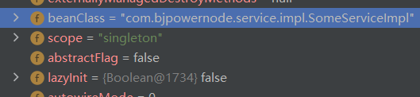

# SpringBoot源码学习

### 1 Spring容器中Bean的创建

#### 1.1 目标

- Spring容器中的Bean是<u>何时创建</u>的？
- 为什么我们能<u>从容器中获取</u>到？

#### 1.2 探究过程

*对象的创建：*

1. 在`ClassPathXmlApplicationContext`的构造方法中进行对象的创建

2. 在`refresh()`这个重要方法中，
   调用`finishBeanFactoryInitialization(beanFactory)`方法

   ```java
   // Instantiate all remaining (non-lazy-init) singletons.
   finishBeanFactoryInitialization(beanFactory);
   ```

3. 在`finishBeanFactoryInitialization(beanFactory)`方法中，继续调用`beanFactory`的`preInstantiateSingletons()`方法

   ```java
   // Instantiate all remaining (non-lazy-init) singletons.
   beanFactory.preInstantiateSingletons();
   ```

4. 在中`preInstantiateSingletons()`，继续调用`getBean(beanName)`方法

5. 在`getBean(beanName)`方法中，继续<u>**调用`doGetBean(name, null, null, false)`方法**</u>

6. 在`doGetBean(...)`方法中，继续调用`getSingleton(beanName, singletonFactory)`方法

7. 在`getSingleton(...)`方法中，
   在同步代码块中，调用`singletonFactory.getObject()`方法

   > `singletonFactory.getObject()`方法其实就是匿名内部类中的方法

8. 在`getObject()`方法中，调用`doCreateBean(beanName, mbdToUse, args)`方法

9. 在`doCreateBean(...)`方法中，调用`createBeanInstance(beanName, mbd, args)`方法

10. 在`createBeanInstance(...)`方法中，调用`instantiateBean(beanName, mbd)`方法

11. 在`instantiateBean(...)`方法中，
    调用`getInstantiationStrategy().instantiate(mbd, beanName, parent)`

12. 在`instantiate(...)`方法中，出现了：

    ```java
    constructorToUse = clazz.getDeclaredConstructor();
    ```

    即默认获取的是空参构造；调用了`BeanUtils.instantiateClass(constructorToUse)`方法

13. 在`instantiateClass(...)`方法中，调用了`ctor.newInstance(argsWithDefaultValues)`

*对象的获取：*

1. 对象存储：

   1. 在`beanFactory`的`getSingleton(...)`方法中，创建对象后，有如下代码：

      ```java
      if (newSingleton) {
        addSingleton(beanName, singletonObject);
      }
      ```

   2. 进入`addSingleton(...)`方法中，有：

      ```java
      synchronized (this.singletonObjects) {
        this.singletonObjects.put(beanName, singletonObject);
      	...
      }
      ```

2. 对象获取：

   1. 在`getBean(...)`方法中，调用`getBeanFactory().getBean(name)`

   2. 在`getBean(...)`方法中，<u>**调用`doGetBean(name, null, null, false)`方法**</u>

   3. 在`doGetBean(...)`方法中，调用`getSingleton(beanName)`方法

      > 在创建对象时也会调用这个方法，但返回的是`null`

   4. 又调用了另一个重载`getSingleton(...)`，其中有如下代码

      ```java
      Object singletonObject = this.singletonObjects.get(beanName);
      ```

   5. 之后其实就是返回该对象

#### 1.3 结论

- **非懒加载**的**单实例**bean会在容器创建时创建，容器内部会创建一个`beanFactory`，调用其`doGetBean`方法，内部还会再调用一个`getSingleton`方法，<u>发现还没有创建单例</u>，之后就会通过**反射**，使用**策略模式**，调用**无参构造**，创建对象。创建后会在`addSingleton`方法中，将bean存储到一个单例bean的map集合(`singletonObjects`)中，key就是id，value就是bean对象
- 调用容器`getBean`方法获取对象时，也调用了`doGetBean`方法，进而调用`getSingleton`方法，在存储单例bean的map集合(`singletonObjects`)中获取到key为id的bean

#### 1.4 疑问

- `BeanDefinition`是什么东西？

  

- FactoryBean如何创建