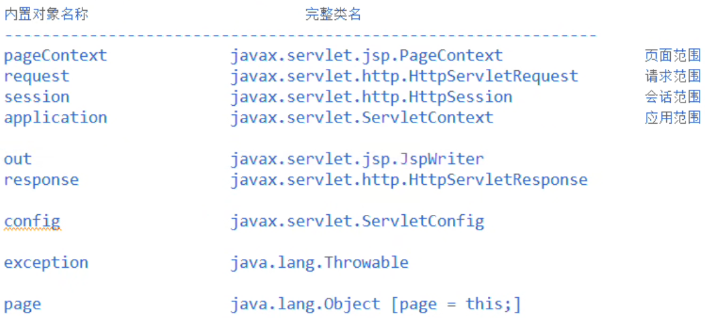
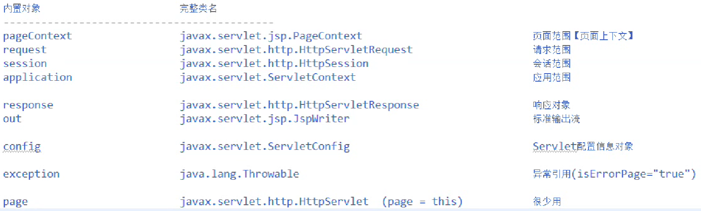
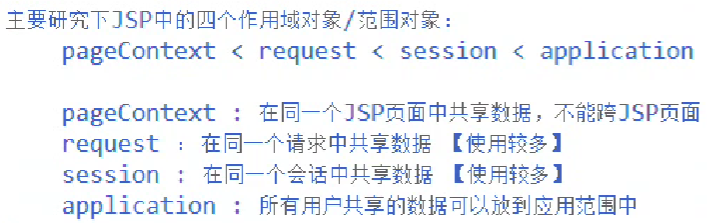

# JSP

---

---

---

## JSP基础

---

---

### 一、概述

---

#### (一)为什么需要 JSP

- 解决 <u>前端代码写死在 Java 程序</u>中的问题

  > **修改前端**不能让后端重新编译，不应该去修改 **Java 源程序**

- 要遵循 ***OCP*** 开发原则

#### (二) JSP 是什么

- ***Java Server Pages***

- **JakartaEE** 规范之一

- 基于 Java 语言实现的服务器端**页面**

  > 运行在服务器中，底层是 Java 程序，运行在 JVM 中

#### (三) .jsp 文件

- JSP 文件常**以 .jsp 结尾**，但也可以换成其他的后缀

  > 这个可以在 CATALINA_HOME/conf/web.xml 中配置

- .jsp 文件可以放到 **WEB-INF 目录外**

- 在实际开发中，有很多项目将 .jsp 文件放到 **WEB-INF 内部**，为了保护 JSP

  > WEB-INF 内部的文件是<u>相对安全</u>的

---

### 二、JSP原理

---

#### (一) JSP 文件的本质

- .jsp 文件底层是一个 <u>Java 类</u>，继承 `org.apache.jasper.runtime.HttpJspBase`

  > 也会编译生成 .class 文件

- HttpJspBase 继承 ***HttpServlet***

- 所以 JSP 也属于 ***Servlet* 类**，也是**单实例多线程**环境下运行的一个 ***Servlet* 对象**

#### (二)理解 JSP 规范

- 直接写在 JSP 中的代码会被解析，放到一个 Java 程序中

  > 比如 HTML、CSS、JavaScript 代码会在<u>底层 Java 程序中`out.print(...)`</u>

- JSP 中也可以写 Java 代码

  > 比如，<u>用`<%`和`%>`包围起来</u>的就是<u>普通 Java 代码</u>，不会用 out.print

- 所以，JSP 中的代码要和 Java 程序有一定<u>对应关系</u>，这种对应关系就是 ***JSP* 规范**

  > 不同的服务器翻译手法是相同的，因为都遵循 JSP 规范

- JSP 的强项是**展示页面**

  > 反过来说，JDBC 之类的<u>业务逻辑处理</u>代码就不适合写在 JSP 中，应该写在一个 Servlet 类里面

#### (三)关于 JSP 的更新

- JSP 文件修改后，**只需要更新资源（*Update resources*）**，<u>不需要重新部署</u>，也<u>不需要重新启动服务器</u>，就可以实现对前端页面的修改

- 但 JSP 文件**第一次访问**的时候很慢

  - 需要启动 JSP 翻译引擎

  - 需要翻译、编译

    > JSP 文件修改后也需要重新翻译，Tomcat 会根据 JSP 文件的<u>最后修改时间</u>来判断是否需要

  - 需要创建 Servlet 对象，执行相关方法

  > 第二次访问时就不需要进行这些操作了，之后也一样，
  >
  > （所以有些人为了显得网站很快，会在用户测试前，提前把 JSP 文件都访问一遍）

---

### 三、基础语法

---

#### (一) JSP 小脚本

- 语法

  ```jsp
  <%
  	java语句;    
  	java语句;
  	java语句;
  	...
  %>
  ```

- 小脚本中的 java 语句会被翻译到 Servlet 的 **service 方法**中

- 多个小脚本中的代码也是有**执行顺序**的，<u>从上至下</u>

- 小脚本中不能写成员变量、方法、静态代码块

  > 就把写 JSP 当成在写 Java 程序

#### (二)声明

- 语法

  ```jsp
  <%!
  	成员变量;    
  	方法;
  	静态代码块;
  	...
  %>
  ```

- 小脚本中的 java 语句会被翻译到 Servlet 的 <u>**service 方法**之外</u>

- 所以声明块中不能直接编写非声明的 Java 语句

- 多个声明块与多个小脚本<u>各有各的顺序</u>，重点还是要知道<u>翻译成的 Java 程序</u>中的顺序

---

### 四、内置对象概述与表达式

---

#### (一)什么是内置对象

- 可以<u>直接在 JSP 文件中使用</u>的对象

  > **小脚本**会被翻译到 **service 方法**中，在 service 方法体中常用的对象都可以用
  >
  > 其他方法想要使用，需要间接地传

#### (二)九大内置对象



> 当然现在包名变成`jakarta`了

#### (三)什么是表达式

- JSP 符号系统**封装**了一系列常用代码，可以通过**表达式**简洁地<u>执行封装好的程序</u>

#### (四)常见表达式

- `<%=xxx>`等同于`<%out.print(xxx);%>`

  > 应用举例：
  >
  > ```jsp
  > <%
  >     for (int i = 1; i < 7; i++) {
  > %>
  >     <h<%=i%>><%=i%>级标题</h<%=i%>>
  > <%
  >     }
  > %>
  > ```

---

### 五、指令与动作

---

#### (一)指令概述

- 指令的作用：指导 JSP 的翻译引擎翻译 JSP 代码

- JSP 中共有三个指令

  - 页面指令：page
  - 包含指令：include
  - 标签库指令：taglib

- 语法格式

  ```jsp
  <%@指令名 属性名=属性值 属性名=属性值 ...%>
  ```

#### (二) page 指令常用属性

- contentType：设置 **JSP 响应的内容类型**（后面也可以指定字符编码方式）

  > 底层是 **response.setContentType**

- pageEncoding：设置 JSP 响应的字符编码方式

  > 底层会在 response.setContentType 中加入 charset="..."

- import：组织**导入**

  > 底层会导包 import ...;
  >
  > 属性值之间可以用`,`隔开，也**可以写多个 page 指令**，会**同时生效**

- session：设置当前 JSP 页面中是否可以直接使用 session 内置对象

  > session="true" 表示在当前 JSP 中可以直接使用 session 对象，程序执行时会获取 session 对象，获取不到就会新建一个
  >
  > session="false" 表示在当前 JSP 中**不能直接使用 session 对象**，如果想用必须手写小脚本
  >
  > > 手写小脚本一般是 **request.getSession(false)** 调用当前**已经存在的会话**对象，一般不会写 request.getSession(true) ，这样还会新建，没意义
  >
  > 没有指定的情况下，默认值是 true

- errorPage：错误页面

  > 指定当前 JSP 出现异常后会跳转到的页面，属性值是不带项目名的 URI，
  >
  > 底层是**转发**机制

- isErrorPage：是否是错误页面

  > 属性值指定为 true，指明当前 JSP 是错误页面，
  >
  > 就可以使用**内置对象 exception** 去打印**异常堆栈追踪信息**了
  >
  > > 这样就算前端错误页面遮盖了错误信息，后面也可以打印出异常堆栈追踪信息
  >
  > 没有指定的情况下，默认值是 false

- isELIgnored：是否忽略 EL 表达式

#### (三) include 指令

```jsp
<%@include file="/资源路径"%>
```

> 可以在其他 JSP 中**复用**常用的资源，便于**维护**
>
> > 比如**固定不变**的<u>顶部、底部导航栏</u>

> 一个 JSP 中也可以使用**多个** include 指令

> 底层实现原理：
>
> **编译期**包含，直接把资源包含到底层 Java 程序中
>
> 编译期包含/翻译器包含/静态联编
>
> 相当于是拿过来<u>**整合**成同一个 Java 程序</u>，局部变量也可以共享

#### (四)动作

- 语法格式

  ```jsp
  <jsp:动作名 属性名=属性值 属性名=属性值 ...></jsp:动作名>
  ```

- forward 动作

  ```jsp
  <jsp:forward page="/资源路径"></jsp:forward>
  ```

  > **转发**机制

- include 动作

  ```jsp
  <jsp:include page="/资源路径"></jsp:include>
  ```

  > 这是**动态包含**，底层会生成多个 Java 程序，实际上是在运行阶段，在一个 service 方法中调用了另一个 service 方法
  >
  > > 如果有重名变量，就应该使用动态包含了
  >
  > > 动态联编

- bean 动作

  ```jsp
  <jsp:useBean id=""></jsp:useBean>
  ```

  ```jsp
  <jsp:setProperty property="" name=""></jsp:setProperty>
  ```

  ```jsp
  <jsp:getProperty property="" name=""></jsp:getProperty>
  ```

---

### 六、内置对象

---

#### (一)列举九大内置对象



#### (二)作用域对象



> :star:pageContext：
>
> - 关于 attribute 也有同样的方法
>
> - 可以通过 pageContext 对象获取页面中的其他对象（当然程序自己用不着）
>
>   > getRequest、getSession、getServletContext、getServletConfig、...


---

---

## JSP进阶

---

---

### 一、EL表达式

---


---

### 二、JSTL标签库

---


---


---

---


