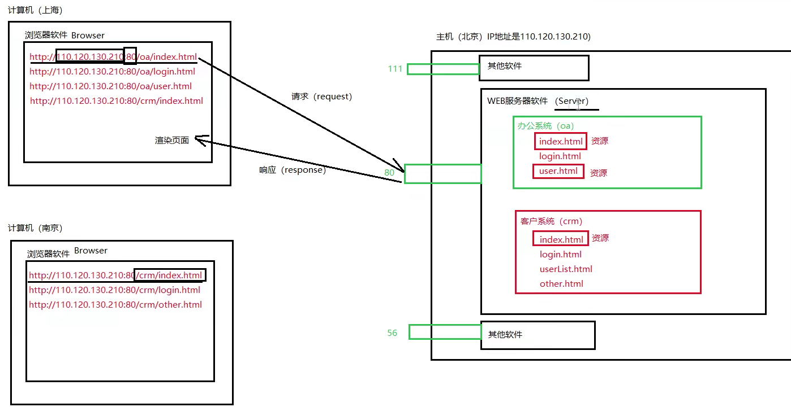
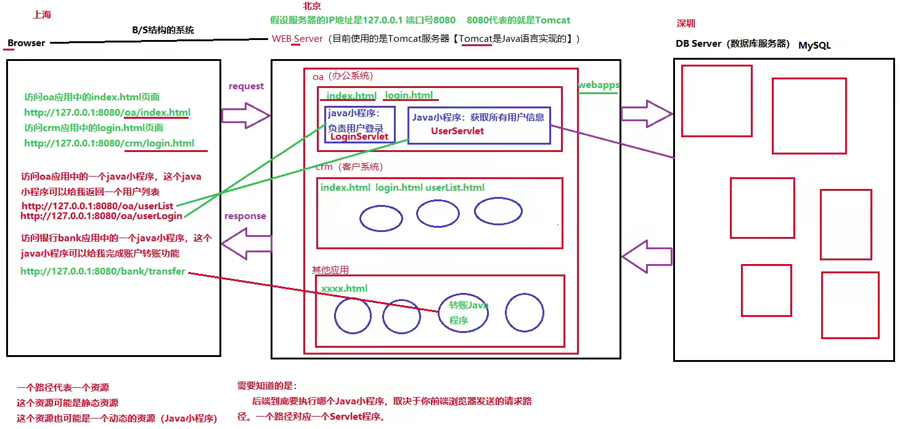
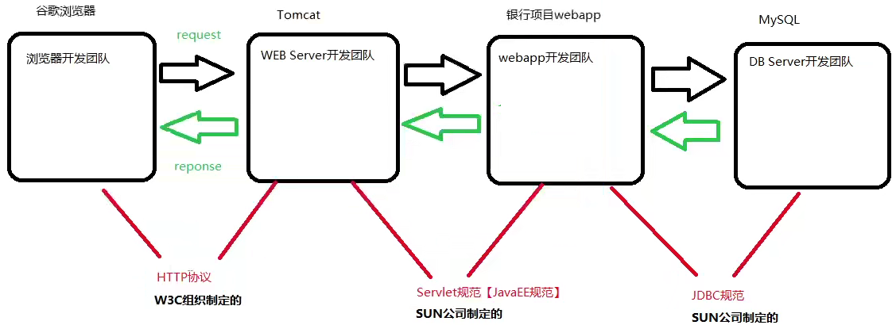
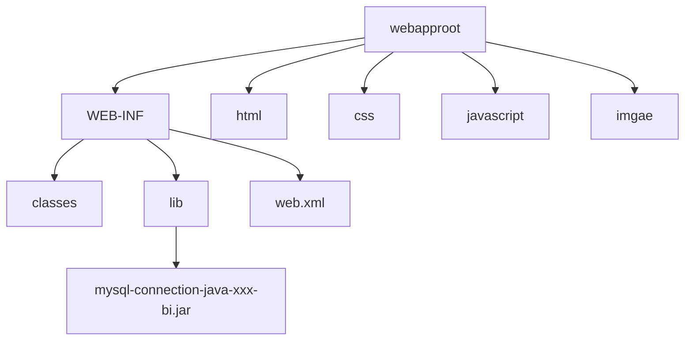
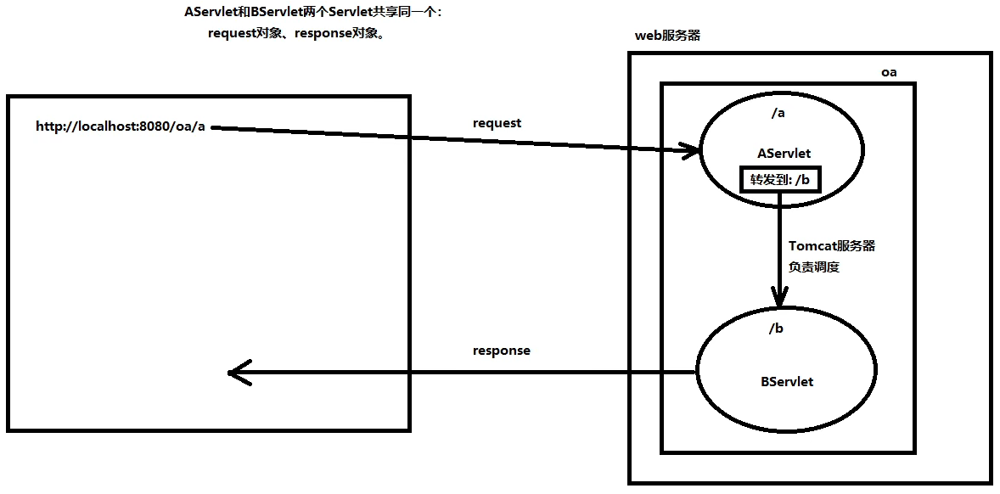
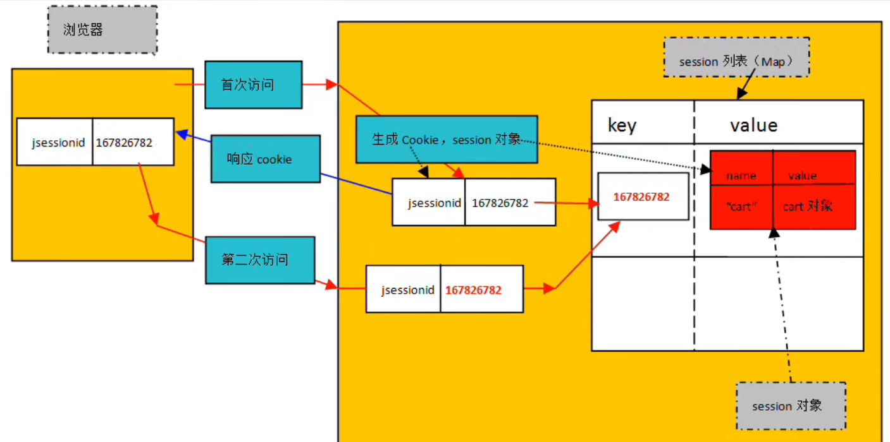
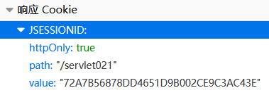
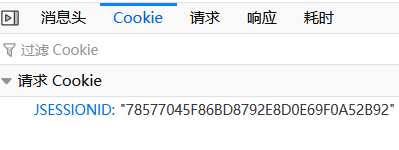

# Servlet

---

---

---

## 系统架构

---

---

### 一、C/S架构

---

#### （一）概述

- Client/Servlet（客户端/服务端）
- *特点*：需要安装特定的**客户端软件**

#### （二）优缺点

- ##### *优点*

  - 速度快，体验好
  - 服务器压力小
  - 界面炫酷
  - 安全

  > 根本原因：
  >
  > **大部分数据**都集成到了**客户端的软件**上，相对来说**比较少的数据**是从服务传送过来的
  >
  > 大量的数据在客户端上也有缓存

  > C/S架构通常有专门的软件去写界面，所以界面效果更好

- ##### *缺点*

  - 升级维护比较麻烦，成本较高

    > 系统每一次升级，每一个客户端软件都要升级，某些软件不是那么容易安装的

    > 这可以说是C/S的致命伤了

---

### 二、B/S架构

---

#### （一）概述

- Brower/Server（浏览器/服务器）
- *特点*
  - 可以理解成一种特殊的C/S结构，只不过这里的Client是一个固定不变的浏览器

#### （二）优缺点

- ##### *优点*

  - 升级维护方便，成本较低

    > 只需要在服务器端升级一次

  - 不需要安装特定的客户端软件，用户操作很方便

- ##### *缺点*

  - 速度慢，体能差
  - 不安全
  - 界面不够酷炫

  > 根本原因：
  >
  > 大部分数据都是在服务器上，用户每发送一个请求都需要浏览器响应
  >
  > B/S架构的系统在网络中传输的数据量较大

  > 浏览器只支持`HTML CSS JavaScript`三种语言

#### （三）Web开发

- 开发B/S架构的系统，其实就是开发Web系统，开发网站

- 用`Java`作后端语言开发Web可以称为`JavaWeb`开发

- `JavaWeb`开发最**核心的规范**就是`Servlet`

  > Server Applet，服务端的Java小程序

  > `JavaEE`包含13种规范，`Servlet`就是其中一种

> :star:`Java`包括三大块：
>
> - `JavaSE`
>
>   - `Java`标准版
>   - 一套别人写好的类库，是**标准类库**，是基础
>
> - `JavaEE`
>
>   - `Java`企业版
>   - 也是一套别人写好的类库，帮助完成**企业级项目**的开发，为企业提供解决方案
>   - 可以用来开发`Web`系统
>
> - `JavaME`
>
>   - `Java`微型版
>
>   - 还是一套别人写好的类库，帮助进行电子（微型）设备**内核程序**的开发
>
>     > 比如机顶盒、吸尘器、电冰箱、电饭煲等等的内核程序

---

---

## B/S架构系统基础知识

---

---

### 一、B/S架构系统的通信原理

---

#### （一）访问网页的过程

1. 打开浏览器
2. 在地址栏输入合法网址
3. 回车
4. 在浏览器上展示响应的结果（渲染）

#### （二）域名

> 以https://www.baidu.com/举例

- www.baidu.com 是一个域名
- 域名解析
  - 在浏览器地址栏上输入域名并回车后，<u>域名解析器</u>会将域名解析成一个具体的**IP地址**和**端口号**等信息
  - 解析结果也许是：http://110.242.68.3:80/index.html
- 端口号
  - **软件**在<u>服务器</u>上的唯一标识

#### （三）通信步骤

1. 用户输入网址(***URL***：统一资源定位符)
2. **域名解析器**进行域名解析
3. 浏览器软件在网络中搜索**IP地址**对应的<u>服务器</u>
4. 通过**端口号**定位到服务器上的<u>软件</u>
5. 服务器根据**资源名**找到相应的资源，将资源直接**响应**给浏览器
6. 浏览器接收到代码，进行渲染，展示效果

> 画图理解：
>
> 

---

### 二、WEB服务器软件

---

#### （一）服务器软件有什么

- Tomcat（Web服务器）
- jetty（Web服务器）
- JBOSS（应用服务器）
- WebLogic（应用服务器）
- WebSphere（应用服务器）

#### （二）应用服务器与WEB服务器的关系

- 应用服务器实现了`JavaEE`的**所有规范**

- WEB服务器只实现了`JavaEE`中的**<u>`Servlet`和`JSP`两个核心规范</u>**

- 应用服务器 $\supset$ WEB服务器

  > 例如：JOBSS内嵌了一个Tomcat

#### （三）Tomcat

- ##### *Tomcat概述*

  - Tomcat 是 Apache Software Foundation (ASF) 开发的一款开源免费的轻量级WEB服务器软件

    > tomcat也叫catalina（美国的一个岛屿，风景秀丽）
    >
    > tomcat的logo是一只公猫，寓意tomcat服务器是<u>轻巧的</u>，体积小，运行速度快，只实现了`Servlet`和`JSP`规范

    > Apache官网地址：www.apache.org
    >
    > Tomcat官网地址：tomcat.apache.org

  - tomcat服务器想要运行，必须先配置`jre`

    > tomcat是`Java`语言编写的

- ##### *Tomcat服务器的目录*

  - bin：**命令文件**存放的目录

    > 比如：启动Tomcat，关闭Tomcat

  - conf：**配置文件**存放的目录

    > 在server.xml文件中可以配置端口号，Tomcat的默认端口号是8080

  - lib：**核心程序**目录

    > 存放了很多jar包

  - logs：**日志**目录

    > Tomcat服务器启动等信息都会在这个目录下生成日志文件

  - temp：临时目录，存储**临时文件**

  - webapps：存放大量的***web application***

  - work：存放JSP文件翻译之后的***java*文件**以及编译之后的***class*文件**

- ##### *Tomcat服务器的启动*

  -  ***starup.bat*** 文件

    > bat文件是<u>Windows操作系统专用</u>的文件，bat文件是**批处理文件**，这种文件中可以编写大量的Windows的**dos命令**，执行bat文件就相当于**<u>批量地执行dos命令</u>**

    > 这个文件里面有好多**CATALINA_HOME**
    >
    > 运行这个文件，实质上会去运行 ***catalina.bat*** 文件
    >
    > Tomcat是Java语言编写的，运行Tomcat，实际上就是去运行了一个***main*方法**
    >
    > ```sh
    > set MAINCLASS=org.apache.catalina.startup.Bootstrap
    > ```
    >
    > 上面这行代码说明了<u>main方法所在的类</u>

    > :star:正常运行Tomcat服务器需要配置的环境变量:star:
    >
    > ==CATALINA_HOME==
    >
    > ==JAVA_HOME==
    >
    > 还有它们对应的==bin目录==

  -  ***starup.sh*** 文件

    > sh文件在Windows中无法执行，是在<u>Linux环境</u>中使用的，用来**批量执行shell命令**

  - 启动和关闭的命令

    - 启动：startup.bat

    - 关闭：shutdown.bat

      > 建议将shutdown.bat文件重命名为stop.bat
      >
      > 因为shutdown与Windows操作系统的关机命令冲突了


> 关于 Tomcat 服务器启动后的乱码问题的解决：
>
> 1. 找到 CATALINA_HOME\conf\logging.properties ，打开
> 2. 找到 java.util.logging.ConsoleHandler.encoding
> 3. 将 UTF-8 更改为 GBK

- ##### *测试Tomcat服务器*

  - 打开浏览器，在地址栏上输入对应的URL

    > http://IP地址:端口号
    >
    > IP地址：本机IP地址，127.0.0.1，或者 localhost
    >
    > 端口号：8080

---

### 三、第一个WEB应用

---

#### （一）步骤

1. 在CATALINA_HOME\webapps目录下**新建子目录oa**

   > 规定：所有的webapp都放到webapps目录（如果不放这里，Tomcat找不到）
   >
   > 目录名oa就是webapp的名字

2. 在oa目录下**编写资源文件**，例如：index.html

3. **启动Tomcat服务器**

4. 在**浏览器**中输入***URL***

   > URL格式：`http://IP地址:端口号/资源目录/资源文件`
   >
   > 例如：`http://127.0.0.1:8080/oa/index.html`

#### （二）相关知识

- 多个资源文件之间的**超链接**

  ```html
  <a href="/oa/login.html">user login</a>
  ```

  > 这个路径以`/`开始，带**项目名**，是**绝对路径**
  >
  > 不需要写成`http://127.0.0.1:8080/oa/login.html`

- 动态网页技术

  - 页面中的**数据是动态的**，根据<u>数据库</u>中数据的变化而变化

    > 这就需要`JDBC`，要编写`Java`程序

  - 要访问`Java`小程序资源，需要动态资源路径

---

### 四、B/S架构系统的角色和协议

---

#### （一）动态WEB应用的通信原理图



#### （二）相关角色

- **浏览器**软件的开发团队

- ***WEB Server*** 的开发团队

- ***DB Server*** 的开发团队

- ***WEB App*** 的开发团队

  > WEB应用就是`JavaWEB`程序员开发的

> 不同的开发团队之间要解耦合，
>
> 需要接口，需要规范

#### （三）相关规范

- ==:star::star::star::star::star:***JavaEE*规范**之一——***Servlet***:star::star::star::star::star:==

  > <u>***WEB Server***</u>与<u>***WEB App***</u>之间的规范

  > JDK中没有Servlet，JavaEE-API中才有Servlet

  > Servlet的作用：WEB Server 与 WEB App 之间**解耦合**
  >
  > （前提是双方都要遵循Servlet规范）

  > Servlet规范规定了什么？（举例）
  >
  > - 接口、类
  > - webapp**目录结构**
  > - webapp**配置文件**及其**路径**
  > - webapp中***java*程序**及其**路径**

  > :star:***Servlet***的应用：
  >
  > 需要==指定**用户请求路径**与***Java*小程序**之间的关系==，可以使用**配置文件**
  >
  > > :star:模拟Tomcat服务器，理解Servlet在其中的作用:star:
  > >
  > > ```java
  > > import java.util.Scanner;
  > > import java.util.Properties;
  > > import java.io.FileReader;
  > > public class TomcatServer {
  > > 	public static void main(String[] args) throws Exception{
  > >         System.out.println("服务器启动...");
  > >         //获取用户请求路径
  > >         System.out.println("请输入您的访问路径：");
  > >         Scanner s = new Scanner(System.in);
  > >         String key = s.nextLine();
  > >         //找到用户请求路径与Java小程序之间的关系
  > >         FileReader reader = new FileReader("web.properties");
  > >         Properties pro = new Properties;
  > >         pro.load(reader);
  > >         //根据关系，执行小程序
  > >         String className = pro.getProperty(key);
  > >         Class clazz = Class.forName(className);
  > >         Object obj = clazz.newInstance();
  > >         Servlet sevlet = (Servlet)obj;//这里假设Servlet是被实现的接口
  > >         servlet.service();//Servlet接口中的抽象方法(面向接口编程)
  > > 	}   
  > > }
  > > ```
  > >
  > > > 从这个例子中也可以看出，很多东西都是在Tomcat服务器中写好了的，比如，**<u>配置文件的路径和文件名</u>**就不能乱写（这些也都是<u>Servlet中的规范</u>）

- **超文本传输协议**——***HTTP*协议**

  > ***<u>Browser</u>***与***<u>WEB Server</u>***之间的规范

- ***JDBC***规范

  > **<u>*WEB App*</u>**与***<u>DB Server</u>***之间的规范

  > JDBC规范也属于JavaEE规范，只不过在JDK中可以看到

#### （四）角色与规范关系图解



---

---

## Servlet开发基础

---

---

### 一、开发第一个Servlet

---

#### （一）基本步骤

1. 创建**目录结构**和**配置文件**

   1. 在**webapps目录**下<u>新建一个目录</u>，可以起名为 crm

   	> crm 就是这个 webapp 的**根目录**了

   	> 这个根目录的名字<u>不是固定的</u>，<u>银行项目</u>可以创建一个根目录 bank ，<u>办公系统</u>可以创建一个根目录 oa

   2. 在**根目录下**<u>新建一个目录</u>，**必须命名为 WEB-INF**

   	> 这个目录的名字是 **Servlet 中的规范**，必须遵守

   3. 在 **WEB-INF 目录下**<u>新建一个目录</u>，**必须命名为 classes**

   	> classes 目录下存放的是 **Java 程序编译后**生成的 .class 文件（字节码文件）

   4. 在 **WEB-INF 目录下**<u>新建一个目录</u>，**必须命名为 lib**

   	> 如果一个 webapp 需要**第三方 jar 包**，这个 jar 包就要放在 lib 目录下
   	>
   	> > 例如，JDBC 需要数据库驱动的 jar 包，这个 jar 包就要放在 lib 目录下

   5. 在 **WEB-INF 目录下**<u>新建一个 xml 文件</u>，**必须命名为 web.xml**

   	> 这个 web.xml 文件就是**配置文件**，在这个配置文件中描述了**请求路径**和 **Servlet 类**之间的对照关系

   	> 这个 web.xml 文件最好从其他的 webapp 中**拷贝**，最好别自己写
   	>
   	> ```xml
   	> <?xml version="1.0" encoding="UTF-8"?>
   	> <web-app xmlns="https://jakarta.ee/xml/ns/jakartaee"
   	>   xmlns:xsi="http://www.w3.org/2001/XMLSchema-instance"
   	>   xsi:schemaLocation="https://jakarta.ee/xml/ns/jakartaee
   	>                       https://jakarta.ee/xml/ns/jakartaee/web-app_5_0.xsd"
   	>   version="5.0"
   	>   metadata-complete="true">
   	> </web-app>
   	> ```

2. **编写 *Java* 程序**，必须**实现 Servlet 接口**，**实现其中的 5 个方法**

   > Servlet 接口是 SUN 公司提供的
   >
   > :star:<u>Tomcat 服gggggg务器</u>也需要实现 Servlet 接口
   >
   > 在 CATALINA_HOME\lib 目录下有 servlet-api.jar ，解压后在 jakarta\servlet 文件夹下有 Servlet.class 
   >
   > > 关于 JavaEE 的版本：
   > >
   > > - JavaEE 的<u>最高版本停留在 JavaEE8</u> 了
   > >
   > > - JavaEE 被 Oracle 捐献给 Apache 了，<u>Apache 将 JavaEE 更名为 JakartaEE</u>
   > >
   > > - *JavaEE8* 时 Servlet 接口的完整类名：*javax.servlet.Servlet*
   > >
   > > - :star:***JakartaEE9*** 时 ***Servlet* 接口**的**完整类名**：***jakarta.servlet.Servlet***:star:
   > >
   > >   > <u>Tomcat 10+ 版本都采用的是 JakartaEE9</u> ，有一个<u>迁移工具</u>，可以将采用 JavaEE 的项目迁移到 JakartaEE
   > >
   > > > 可以从 Tomcat 官网提供的文档中获取 JakartaEE 帮助文档

   > Java 程序放在哪里编写都可以，只要编译后生成的**字节码文件**放在 **classes 目录**下就行

   > 关于要实现的 5 个方法：
   >
   > ```java
   > public void init(ServletConfig config) throws ServletException {     
   > 	                                                                 
   > }                                                                    
   >                                                                      
   > public void service(ServletRequest request, ServletResponse response)
   > 	throws ServletException, IOException {                           
   > 	System.out.println("Hello Servlet !");                           
   > }                                                                    
   >                                                                      
   > public void destroy() {                                              
   >                                                                      
   > }                                                                    
   >                                                                      
   > public String getServletInfo() {                                     
   > 	return "";                                                       
   > }                                                                    
   >                                                                      
   > public ServletConfig getServletConfig() {                            
   > 	return null;                                                     
   > }                                                                    
   > ```

3. 编译 Java 程序，将生成的 .class 文件**带着包** copy 到 **classes 目录**下

   > 配置**环境变量 CLASSPATH** ，将 ***CATALINA_HOME\lib\servlet-api.jar*** 配置进去
   >
   > > 配置这个环境变量与 Tomcat 服务器的运行无关

4. 在 ***web.xml* 文件**中**注册 *Servlet* 类**

   > 就是在 web.xml 中编写**配置信息**，让**请求路径**和 **Servlet 类名**关联在一起

   ```xml
   <?xml version="1.0" encoding="UTF-8"?>
   <web-app xmlns="https://jakarta.ee/xml/ns/jakartaee"
     xmlns:xsi="http://www.w3.org/2001/XMLSchema-instance"
     xsi:schemaLocation="https://jakarta.ee/xml/ns/jakartaee
                         https://jakarta.ee/xml/ns/jakartaee/web-app_5_0.xsd"
     version="5.0"
     metadata-complete="true">
   
   	<!--servlet描述信息-->
   	<servlet>
   		<!--两个servlet-name必须保持一致-->
   		<servlet-name>myname</servlet-name>
   		<!--必须是带有包名的全限定类名-->
   		<servlet-class>com.bjpowernode.servlet.HelloServlet</servlet-class>
   	</servlet>
   
   	<!--servlet映射信息-->
   	<!--任何一个servlet都会对应一个servlet-mapping-->
   	<servlet-mapping>
   		<servlet-name>myname</servlet-name>
   		<!--必须是以/开始的路径-->
   		<url-pattern>/a/b/c/d</url-pattern>
   	</servlet-mapping>
   </web-app>
   ```

5. 启动 Tomcat 服务器，在浏览器中输入相应的网址，发送请求，从而使 Java 程序执行

   > :star:浏览器上的请求路径必须和 ***url-pattern*** 一致，而且要带**项目名**
   >
   > 以上面的 web.xml 中的配置为例，URL 就是 http://127.0.0.1:8080/crm/a/b/c/d

   > 这相当于是 Tomcat 服务器**接收到请求**后，在底层使用**反射机制**，
   >
   > `new`了一个`com.bjpowernode.servlet.HelloServlet`对象，
   >
   > 并调用其`service()`方法
   >
   > > `main`方法是 Tomcat 服务器中写好的方法，不需要程序员再写了
   > >
   > > （Tomcat 服务器启动时执行的就是`main`方法）

   > 如果觉得这个 URL 太复杂，可以使用**超链接**
   >
   > > :star:注意，HTML 文件必须写在 **WEB-INF 目录**外边

#### （二）webapp 目录结构



#### （三）向浏览器响应 HTML 代码

> 响应（***response***），即**从服务器向浏览器**发送数据，将信息输出到浏览器上
>
> 这需要用到 ***ServletResponse*** 接口

> 默认方法体：
>
> ```java
> public void service(ServletRequest request, ServletResponse response)
> 	throws ServletException, IOException {                           
> 	......                          
> }                                                               
> ```

- `response.getWriter()`：返回一个`PrintWriter` 对象，可以用它向浏览器发送字符

  > 这个流不需要程序员**刷新**和**关闭**，这些都是由 Tomcat 来维护的
  >
  > 这里我们将返回的流命名为`out`

- `response.setContentType(String)`：设置响应的内容类型

  > 可以传入`"text/html"`，这样浏览器就会以**普通文本**或 **HTML 代码**的形式解析发送来的数据
  >
  > 在 Tomcat 10 之前，有<u>响应的中文乱码问题</u>，需要指定字符集，一般情况下要传入的完整参数是`"text/html;charset=utf-8"`

  > :star::star:设置响应的内容类型要**在获取流之前完成**

- `out.print(String)`方法，向浏览器

#### （四）在 Servlet 中连接数据库

1. 将 **JDBC 的步骤**放到[基本步骤](#（一）基本步骤)中去

   > `com.mysql.jdbc.Driver`驱动已过时，
   >
   > 新版本建议使用`com.mysql.cj.jdbc.Driver`

2. 将 mysql-connection-java 驱动放到 crm/WEB-INF/lib 中

#### （五）使用 IDEA 开发 Servlet

1. New Project ，创建一个 Empty Project

2. New Module ，创建一个普通的 JavaSE 模块

3. 给 Module 添加**框架支持**，Add Framework Support ，选择Web Application

   > 这是让 JavaSE Module 变成 JavaEE Module ，变成<u>符合 Servlet 规范的 Module</u>

   > 自动生成的 web 目录就代表了 webapp 的**根目录**，但只是虚拟的

4. 将 CATALINA_HOME/lib 下的 ***jsp-api.jar*** 和 ***servlet-api.jar*** 添加到 IDEA 的 ***CLASSPATH*** 中

   > $File\rightarrow Project~Structure\rightarrow Project~Settings\rightarrow Modules\rightarrow Dependencies$

5. 编写 Servlet 实现类

6. 在 WEB-INF 目录下**新建目录 lib** ，将 mysql-connection-java 驱动放到其中

7. 在 web.xml 文件中注册

8. 在 web 目录下新建并编写 index.html

   > 超链接中的项目名先写死（/xmm），写 web 也没用，因为这个根目录是虚拟的

9. <u>IDEA **关联** Tomcat 服务器</u>

   > 在关联的过程中将 webapp **部署**到 Tomcat 服务器中

   > 在 Add Configuration 中添加 Tomcat Server $\rightarrow$ Local 
   >
   > - 在 Server 配置页面中配置 Application server 、Name 、JRE 
   > - 在 Deployment 部署页面中添加 Artifact ，修改 Application context 为 刚才写死的（/xmm）

10. **启动** Tomcat 服务器

    > 点击绿色小虫子，以 <u>debug 模式</u>启动 Tomcat 服务器

11. 在浏览器地址栏上输入 URL

    > 这个例子中的 URL 就是 http://localhost:8080/xmm/student.html

> 之后在创建其他项目时也需要在 Project Structrue 中添加 jar 包，并在 Configuration 中部署

---

### 二、Servlet对象生命周期

---

#### （一）什么是 Servlet 对象的生命周期

- Servlet 对象什么时候被**创建**、**销毁**？
- Servlet 对象创建了几个？
- 一个 Servet 对象**从出生到死亡**，经历了哪些**过程**？

#### （二）Servlet 对象的<u>维护</u>

- <u>Servlet 对象</u>的生命周期是由 **Tomcat 服务器**负责的，不需要程序员做什么

  > Tomcat 服务器通常又被称为 **WEB 容器**（***WEB Container***）

  > 程序员<u>自己`new`的 Servlet 对象</u>是不受 WEB Container 管理的，不在容器中
  >
  > > WEB Container 创建的 Servlet 对象都放到一个 HashMap **集合**中进行管理

- 让 Servlet 对象**在服务器启动时**就被创建（一般来说不用）

  ```xml
  <servlet>
      <servlet-name>aservlet</servlet-name>
      <servlet-class>com.bjpowernode.javaweb.servlet.AServlet</servlet-class>
      <load-on-startup>整数</load-on-startup>
  </servlet>
  ```
  
  > 在<servlet>标签中添加<load-on-startup>标签，标签中添加整数，**数字越小**，**优先级越高**（正整数就够用了）

  > 注意，默认情况下，**服务器启动时**并没有创建 Servlet 对象，只是**解析了 xml 文件**，将**请求路径**和**类名**匹配起来，放到 Map 集合中
  >
  > > 在<u>用户还没发送请求</u>时就创建 Servlet 对象可能会浪费内存

#### （三）生命周期

1. 在用户发送**第一次请求**时，Servlet 对象被**创建**（<u>无参构造</u>），并**紧接着调用**其*`init()`*方法

   > 对象**一创建就会调用**其`init()`方法，就算是<u>在服务器启动时</u>创建也会**调用**
   >
   > > `init()`方法主要用于**代替构造方法**，这样程序员就不必手写构造方法而导致无参构造方法消失，更安全

   > Servlet 对象是**单实例**的，只创建一次，只执行一次`init()`方法
   >
   > （但 Servlet 并不符合“**单例模式**”，称为“**假单例**”）

   > 这里创建对象使用到的是**反射机制**，所以必须提供**无参数构造方法**
   >
   > > 不然会报 **HTTP 500 错误**
   > >
   > > （**500 错误**一般是因为服务端的 <u>Java 程序出现了异常</u>）
   > >
   > > 所以也建议**程序员不要自己去写构造方法**了，用<u>`init()`方法</u>代替

2. 然后调用 Servlet 对象的`service()`方法

   > 之后用户**每次发送请求**，都会**调用一次**`service()`方法
   >
   > （但不会新建对象）

3. **关闭服务器**时，Servlet 对象的<u>`destroy()`方法</u>会执行

   > 服务器在关闭时要销毁 Servlet 对象的**内存**，在**销毁前**会调用其`destroy()`方法

   > 一些<u>释放资源、保存数据的代码</u>可以放在`destroy()`方法中

---

### 三、适配器模式改造Servlet

---

#### （一）为什么要改造

- Servlet 接口中有 **5 个方法**，但其中**只有`service(...)`方法比较常用**

- 在大多数情况下，其他方法只写一个**空实现体**就可以，代码不美观

- 那能否改造一下，让主类**只去实现一个`service(...)`方法**

  > 这里就可以用到**适配器**了，
  >
  > 用适配器去**实现另外 4 个方法**，留一个**抽象方法**`service(...)`
  >
  > 所以适配器一定是一个<u>*`abstract class`*</u>

#### （二）Servlet 适配器的原理

1. 首先要替子类**实现那 4 个方法**，但**把`service(...)`方法保留成抽象的**

2. :star:进一步**改造适配器**

   1. :star:添加`ServletConfig`类型**私有成员变量**，在`init(...)`方法中对其进行**赋值**，并让`getServiceConfig()`方法**返回**这个私有成员变量

      - 主要是想在`service(...)`方法中也使用这个`ServletConfig`对象，而这个对象在`init(ServletConfig)`中出现过

      - `init(ServletConfig)`方法是 ***Tomcat* 服务器**调用的，`ServletConfig`对象也是 ***Tomcat* 服务器**创建的

        > Tomcat 服务器遵循**规范**写的**实现类**：
        >
        > ```java
        > package org.apache.catalina.core;
        > ...
        > public final class StandardWrapperFacade
        >     implements ServletConfig {
        >     ...
        > }
        > ```

      - 为了能让<u>服务器创建的`ServletConfig`对象</u>在`service(...)`方法中得到使用，就在`init(ServletConfig)`中赋值给**私有成员变量**

      - 还需要利用`getServletConfig()`方法返回这个**私有成员变量**

   2. :star:用`final`修饰`init(ServletConfig)`方法，并创建`init()`方法（无参重载），在`init(ServletConfig)`方法中调用`init()`

      - 有可能在 Servlet 类中<u>真的需要重写`init()`方法</u>，直接重写肯定会影响到破坏`ServletConfig`对象的保存，所以一定要让`init(ServletConfig)`方法**不能被覆盖**
      - 为了让子类还能在<u>服务器调用`init(ServletConfig)`方法</u>时做点事，就再在适配器中提供一个**无参重载的`init()`方法**，供**子类重写使用**

      > **模板方法设计模式**

#### （三）jakarta.servlet.GenericServlet

- 现成的适配器，原理类似，`implements Servlet`
  - 提供了`init()`方法，但`init(ServletConfig)`方法并没有用`final`修饰
- 同时它还扩展了一些其他的方法，方便子类的编程
- 但这个适配器也不是最常用的，它还有一个**子类**，是更常用的适配器

---

### 四、ServletConfig与ServletContext

---

#### （一）ServletConfig

- ##### *概述*

  - `jakarta.servlet.ServletConfig`，***Servlet* 规范**中的一员，是一个**接口**

    > Tomcat 服务器实现了这个接口
    >
    > ```java
    > package org.apache.catalina.core;
    > ...
    > public final class StandardWrapperFacade
    >     implements ServletConfig {
    >     ...
    > }
    > ```
    >
    > 但要注意，<u>换个服务器</u>，接口实现情况<u>可能就不同</u>了

  - ==:star:***Servlet* 对象的配置信息对象**==

  - Servlet 实现类与 ServletConfig 对象是**一对一**的关系

    > ServletConfig 对象是由 ***Tomcat* 服务器**通过**反射机制**在 **<u>Servlet 对象</u>创建的时候**同时创建的

- ##### *作用*

  - ServletConfig 对象是 Servlet 对象的配置信息对象，包装了许多**配置信息**

  - 主要是 web.xml 文件中 <servlet></servlet> 标签的配置信息

    > Tomcat 在解析 web.xml 文件时，就会将标签中的一些配置信息自动包装到 ServletConfig 对象中

- ##### *常用方法*

  - `getServletName()`：获取 Servlet 实现类的名字

    ```java
    public String getServletName();
    ```

  - `getInitParameter(String)`和`getInitParameterNames()`：获取**初始化参数**配置信息

    ```java
    public String getInitParameter(String name);
    public Enumeration<String> getInitParameterNames();
    ```

    > 可以在 web.xml 文件的<servlet>标签中配置**初始化参数**
    >
    > ```xml
    > <servlet>
    >     <servlet-name>configTest</servlet-name>
    >     <servlet-class>com.bjpowernode.javaweb.servlet.ConfigTestServlet.ConfigTestServlet</servlet-class>
    >     <init-param>
    >         <param-name>driver</param-name>
    >         <param-value>com.mysql.jdbc.Driver</param-value>
    >     </init-param>
    >     <init-param>
    >             <param-name>url</param-name>
    >         <param-value>jdbc:mysql://localhost:3306/bjpowernode</param-value>
    >     </init-param>
    >     <init-param>
    >         <param-name>user</param-name>
    >         <param-value>root</param-value>
    >     </init-param>
    >     <init-param>
    >         <param-name>password</param-name>
    >         <param-value>123456</param-value>
    >     </init-param>
    > </servlet>
    > ```
    >
    > Tomcat 服务器解析 web.xml 文件时，这些信息也会被包装到 ServletConfig 对象中

    > 应用举例：在`service(...)`方法中
    >
    > ```java
    > Enumeration<String> initParameterNames = getInitParameterNames();
    > while (initParameterNames.hasMoreElements()) {
    >     String parameterName = initParameterNames.nextElement();
    >     String initParameter = getInitParameter(parameterName);
    >     out.print(parameterName + "=" + initParameter);
    >     out.print("<br>");
    > }
    > ```
    >
    > > 注意`Enumeration`集合的使用方法

  - `getServletContext()`：获取`ServletContext`对象

    ```java
    public ServletContext getServletContext();
    ```

  > :star:注意，`GenericServlet`中已经**直接写好了**
  >
  > `getServletName()`方法、
  >
  > `getInitParameterNames()`方法、
  >
  > `getInitParameter(String)`方法和
  >
  > `getServletContext()`方法
  >
  > ```java
  > public String getServletName() {
  >     return config.getServletName();
  > }
  > public String getInitParameter(String name) {
  >     return getServletConfig().getInitParameter(name);
  > }
  > public Enumeration<String> getInitParameterNames() {
  >     return getServletConfig().getInitParameterNames();
  > }
  > public ServletConfig getServletConfig() {
  >     return config;
  > }
  > ```
  >
  > 这正是因为`GenericServlet`也**实现**了`ServletConfig`接口
  >
  > > 应用举例：
  > >
  > > ```java
  > > out.print("Servlet对象名字：" + getServletName() + "<br>");
  > > Enumeration<String> initParameterNames = getInitParameterNames();
  > > while (initParameterNames.hasMoreElements()) {
  > >     String name = initParameterNames.nextElement();
  > >     out.print(name + "=" + getInitParameter(name) + "<br>");
  > > }
  > > ```

#### （二）ServletContext

- ##### *概述*

  - `jakarta.servlet.ServletContext`，***Servlet* 规范**中的一员，是一个**接口**

    > ***Tomcat* 服务器**实现了这个接口
    >
    > ```java
    > package org.apache.catalina.core;;
    > ...
    > public class ApplicationContextFacade implements ServletContext {
    >     ...
    > }
    > ```

  - ==:star:***Servlet* 对象的上下文对象**（**环境**对象）==

  - ServletContext 对象是在 **WEB 服务器启动的时候**，由**服务器<u>创建</u>**的，并且在**服务器关闭的时候<u>销毁</u>**

  - **一个 *webapp*** 只有**一个 *ServletContext*** 对象

    > 可以把 ServletContext 理解成**整个 *web.xml* 文件的<u>配置信息</u>**
    >
    > 放在 <u>ServletConfig 对象中的数据</u>，一定是**所有 Servlet 对象<u>共享</u>的**
    >
    > :star:***ServletConfig*** 是**应用级对象**:star:

- ##### *常用方法*

  - `getInitParameterNames()`和`getInitParameter(String)`

    ```java
    public Enumeration<String> getInitParameterNames();
    public String getInitParameter(String name);
    ```

    > :star:这里的配置信息与`ServletConfig`对象所指的配置信息不同，这里的是<web-app>标签内，所有<servlet>标签外的，<context-param>标签内的信息
    >
    > 举例： 
    >
    > ```xml
    > <context-param>
    >     <param-name>pageSize</param-name>
    >     <param-value>10</param-value>
    > </context-param>
    > <context-param>
    >     <param-name>startIndex</param-name>
    >     <param-value>0</param-value>
    > </context-param>
    > ```
    >
    > 应用举例：
    >
    > ```java
    > Enumeration<String> initParameterNames = application.getInitParameterNames();
    > while (initParameterNames.hasMoreElements()) {
    >     String name = initParameterNames.nextElement();
    >     out.print(name + "=" + application.getInitParameter(name) + "<br>");
    > }
    > ```

    > :star::star::star:关于**全局**配置信息和**局部**配置信息
    >
    > 就看这个配置信息是否是<u>所有 Servlet 对象都统一的</u>，还是只是<u>某个 Servlet 对象需要的</u>

  - `getContextPath()`：获取应用上下文的**根**

    ```java
    public String getContextPath();
    ```

    > “根”也是**项目名**， 这个方法可以**动态获取**应用的根，返回值是`"/项目名"`
    >
    > > 注： 在 Java 源代码中，不要将应用的根路径写死，因为在最终部署的时候，项目名不一定是什么

  - `getRealPath(String)`：获取项目中某个文件的真实路径

    ```java
    public String getRealPath(String path);
    ```

    > 传入的参数是**从项目根开始的相对路径**
    >
    > （返回值的绝对路径中使用的是`\`）

  - `log(String)`和`log(String, Throwable)`：记录日志到 CATALINA_HOME\logs 中
  
    ```java
    public void log(String msg);
    public void log(String message, Throwable throwable);
    ```
  
    > IDEA 工具会按照 Tomcat 的目录结构生成一个 Tomcat 服务器的副本，并把日志存储在这个**副本的 *logs* 目录**下
    >
    > > :star:IDEA中的 ***CATALINA_BASE*** 就是 Tomcat 服务器副本
    > >
    > > ```dos
    > > CATALINA_BASE:   "C:\Users\不怕晒的铃铛\AppData\Local\JetBrains\IntelliJIdea2021.2\tomcat\dc51058f-e88a-44dc-a60c-80b48b193637"
    > > ```
  
    > :star:关于 logs 目录中的**日志信息**：
    >
    > - 服务器一启动就会创建两个文件
    >
    >   - 其中一个是 0KB 的**访问信息**
    >
    >     > 刚开始没有访问，所以是 0KB
    >     >
    >     > 之后每访问一次，就会记录一次
    >
    >   - 另一个是 Tomcat 服务器的**后台日志**信息
    >
    >     > 也会显示在 IDEA 的控**制台**中
    >
    > - `log(...)`方法执行后又会创建一个新的 .log 文件，将日志信息记录
    >
    > > 举例：
    > >
    > > 
    > >
    > > 从上到下分别是
    > >
    > > - 服务端的 java 程序运行的**控制台**信息
    > > - ServletContext 对象的`log(...)`**方法记录的**日志信息
    > > - **访问**日志

    > 如果是调用`log(String, Throwable)`方法，**异常信息**也会记录到 .log 文件中，而不会输出到控制台上

    > Tomcat10之前的关于控制台乱码问题：修改CATALINA_HOME/conf/log.properties中出现的编码方式即可
  
  - `getResourseAsStream(String)`：直接以流的形式获取对应路径的资源
  
    ```java
    public InputStream getResourceAsStream(String path);
    ```

    > 这个`path`也是从项目根路径开始的
  
  - `setAttribute(String, Object)`：向**应用域**中**存数据**
  
    ```java
    public void setAttribute(String name, Object object);
    ```
  
    > ***ServletContext*** 对象还有一个名字：==**应用域**==
    >
    > 如果所有用户**共享**一份数据，并且这个数据**很少被修改**，并且**数据量很少**，可以将其存放到**应用域**中
    >
    > - 不共享却放到应用域中是没有意义的
    >
    > - 共享的数据如果涉及到修改操作，就会有**线程安全**问题
    >
    >   > Tomcat 是**默认支持多线程**的，不需要程序员编写多线程，便需要程序员保证**线程安全**
    >
    > - 数据量太大会占用太多**堆内存**，因为只有**服务器关闭**的时候数据才会被销毁，影响**服务器性能**
    >
    > > 应用域相当于一个**缓存**，**提高读取效率**
    > >
    > > > 缓存机制举例：
    > > >
    > > > - redis 
    > > >
    > > >   > noSQL 数据库，非关系型数据库，缓存数据库
    > > >
    > > > - 常量池
    > > >
    > > >   - 字符串常量池
    > > >
    > > >     > 比如要使用字符串`"abc"`，会<u>先在字符串常量池中查找</u>，如果有，直接拿来用，如果没有，再<u>新建并存入常量池</u>中
    > > >
    > > >   - 整数型常量池
    > > >
    > > >     > $[-128,127]$共256个 Integer 类型的引用，都存放在整数型常量池中
    > > >
    > > > - 线程池
    > > >
    > > >   > 例如，Tomcat 服务器<u>启动的时候</u>就会创建好一些线程对象，存放在**线程池**中，用户发送请求后，可以直接使用线程池中的线程
    > > >
    > > > - 连接池
    > > >
    > > >   > 例如，JDBC 中的 ***Connection*** 对象，用于连接 JVM 进程与 MySQL 进程，而<u>连接池中会存储一些提前创建好的 Connection 对象</u>，可以直接用，不需要新建
    > > >
    > > >   > 连接池既可以**提高用户访问效率**，也可以**保证数据安全**，因为如果没有连接池，在许多用户同时请求连接的情况下，需要同时新建大量连接，容易崩溃
    > > >
    > > > - ServletContext 应用域
  
  - `getAttribute(String)`：从**应用域**中**取数据**
  
    ```java
    public Object getAttribute(String name);
    ```
  
  - `removeAttribute(String)`：**删除**应用域中的数据
  
    ```java
    public void removeAttribute(String name);
    ```

---

### 五、HTTPServlet

---

#### （一）概述

- 专门为 **HTTP 协议**准备的 Servlet **抽象类**

- **继承结构**

  ```java
  interface jakarta.servlet.Servlet
  abstract class jakarta.servlet.GenericServlet implements Servlet, ServletConfig, java.io.Serializable
  abstract class jakarta.servlet.Servlet.http.HttpServlet extends GenericServlet
  ```


#### （二）HTTP 协议

- ##### *什么是协议、什么是 HTTP 协议*

  - 协议：某些人或组织提前制定好的用于辅助沟通的**规范** / **标准**

  - ***HTTP* 协议**：

    - ***W3C*** 组织制定的一种**超文本传输协议**

      > 超文本：不是普通文本，比如**流媒体**：声音、视频、图片、......

    -  游走在 <u>Browser 和 Server 之间</u>，帮助它们**解耦合**

      > B 和 S 在向彼此数据通信时都要遵循 HTTP 协议

    - 包括**请求(*request*)协议**和**响应(*response*)协议**

      > HTTP 协议提前制定好了<u>消息模板</u>

- ##### ***HTTP** 的请求协议*

  - **请求行**

    - 请求方式（7 种）

      - <u>***get*** 方式</u>
      - <u>***post*** 方式</u>
      - delete 方式
      - put 方式
      - head 方式
      - options 方式
      - trace 方式

    - URI

      - **统一资源标识符**，代表网络中某个资源的名字，但通过 URI 不能定位资源

        > URL 与 URI：
        >
        > - URL 也代表网络中的某个资源，并且通过 URL 可以定位该资源
        >
        > - URL 包括 URI
        >
        >   > 举例：
        >   >
        >   > URL：http://localhost:8080/servlet05/index.html
        >   >
        >   > URI：servlet05/index.html

    - HTTP 协议版本号

  - **请求头**

    - 请求的主机
    - 主机的端口
    - 浏览器信息
    - 平台信息
    - cookie 等信息
    - ......

  - **空白行**

    - 分隔请求头和请求体

  - **请求体**

    - 向服务器发送的具体数据

  > :star:GET 请求与 POST 请求:star:
  >
  > 1. 怎么向服务器发送这两种请求？
  >
  >    - 到目前为止，只有用 **form 表单**发送请求且 **method 属性指定为 post** 时，才会发送 post 请求
  >    - 其他所有情况都是 get 请求
  >      - 在浏览器地址栏上输入 URL
  >      - 在浏览器中点击超链接
  >      - 使用 form 表单提交数据时标签中没有指明 method 属性或指定 method 属性为 get
  >      - ......
  >
  > 2. 两种请求的**区别**
  >
  >    - get 请求发送数据时，数据会挂在 URI 后面，这样会导致发送的数据回显在浏览器地址栏上（<u>在请求行中发送数据</u>）
  >
  >    - post 请求发送数据时，<u>在请求体中发送数据</u>，不会数据回显在浏览器地址栏上
  >
  >    - get 请求只能发送普通的**字符串**，并且长度有限（不同浏览器限制不同）
  >
  >    - post 请求可以发送任何类型的数据，包括普通字符串，还包括流媒体，且理论上没有长度限制
  >
  >    - ==:star: get 请求比较适合**从服务器端获取数据**==
  >
  >      >所以 get 请求会比较**安全**，不会对服务器造成威胁
  >
  >      > 但如果数据中有敏感信息，还是不建议使用 get 请求，因为会将敏感信息直接回显到浏览器地址栏上
  >
  >    - ==:star: post 请求比较适合**向服务器端传送数据**==
  >
  >      > 所以 post 请求会比较危险，可能从后门向服务器注入数据
  >
  >      > 大部分 **form 提交**都是 post 请求，因为 form 中往往有大量的用户信息，服务器要将根据这些数据进行保存或修改；
  >      >
  >      > 要上传文件数据时，尤其文件数据不是普通文本时，应使用 post 请求
  >
  >    - get 请求**支持缓存**，任何一个 get 请求的“响应结果”都会被**缓存**
  >
  >      > 在缓存中，<u>一个 get 请求路径对应一个资源</u>，发送 get 请求时会<u>先从缓存中寻找</u>，<u>再去服务器中获取</u>
  >
  >      > 怎么不让 get 请求使用缓存？**更改请求路径**
  >      >
  >      > 可以使用**时间截**，在路径后面添加一个每时每刻都会变化的<u>系统当前毫秒数</u>
  >
  >    - post 请求**不支持缓存**，post 请求“响应结果”的缓存没有意义
  >
  > 3. 两种请求的**共同点**
  >
  >    - 可以使用相同的发送数据格式（只不过位置不同）
  >
  >      > 格式都是 HTTP 协议规定的：name=value&name=value&......
  >      >
  >      > > 其实还可以有JSON格式，post请求常用

  > 请求协议的具体报文举例：
  >
  > GET 请求
  >
  > ```
  > GET /servlet05/getServlet?username=jack&userpwd=123 HTTP/1.1  请求行
  > Host: localhost:8080                                          请求头
  > Connection: keep-alive
  > sec-ch-ua: " Not;A Brand";v="99", "Google Chrome";v="97", "Chromium";v="97"
  > sec-ch-ua-mobile: ?1
  > sec-ch-ua-platform: "Android"
  > Upgrade-Insecure-Requests: 1
  > User-Agent: Mozilla/5.0 (Linux; Android 6.0; Nexus 5 Build/MRA58N) AppleWebKit/537.36 (KHTML, like Gecko) Chrome/97.0.4692.99 Mobile Safari/537.36
  > Accept: text/html,application/xhtml+xml,application/xml;q=0.9,image/avif,image/webp,image/apng,*/*;q=0.8,application/signed-exchange;v=b3;q=0.9
  > Sec-Fetch-Site: same-origin
  > Sec-Fetch-Mode: navigate
  > Sec-Fetch-User: ?1
  > Sec-Fetch-Dest: document
  > Referer: http://localhost:8080/servlet05/index.html
  > Accept-Encoding: gzip, deflate, br
  > Accept-Language: en-US,en;q=0.9,zh-CN;q=0.8,zh;q=0.7
  >                                                               空白行
  >                                                               请求体
  > ```
  >
  > POST 请求
  >
  > ```
  > POST /servlet05/postServlet HTTP/1.1                          请求行
  > Host: localhost:8080                                          请求头
  > Connection: keep-alive
  > Content-Length: 25
  > Cache-Control: max-age=0
  > sec-ch-ua: " Not;A Brand";v="99", "Google Chrome";v="97", "Chromium";v="97"
  > sec-ch-ua-mobile: ?1
  > sec-ch-ua-platform: "Android"
  > Upgrade-Insecure-Requests: 1
  > Origin: http://localhost:8080
  > Content-Type: application/x-www-form-urlencoded
  > User-Agent: Mozilla/5.0 (Linux; Android 6.0; Nexus 5 Build/MRA58N) AppleWebKit/537.36 (KHTML, like Gecko) Chrome/97.0.4692.99 Mobile Safari/537.36
  > Accept: text/html,application/xhtml+xml,application/xml;q=0.9,image/avif,image/webp,image/apng,*/*;q=0.8,application/signed-exchange;v=b3;q=0.9
  > Sec-Fetch-Site: same-origin
  > Sec-Fetch-Mode: navigate
  > Sec-Fetch-User: ?1
  > Sec-Fetch-Dest: document
  > Referer: http://localhost:8080/servlet05/index.html
  > Accept-Encoding: gzip, deflate, br
  > Accept-Language: en-US,en;q=0.9,zh-CN;q=0.8,zh;q=0.7
  >                                                                  空白行
  > username=rose&userpwd=456                                     请求体
  > ```

- ##### ***HTTP** 的响应协议*

  - **状态行**

    - HTTP 协议版本号

    - 状态码

      > 状态码举例：
      >
      > - 200 表示响应成功，正常结束
      >
      > - 404 表示访问的资源不存在
      >
      >   > 通常是因为<u>路径错了</u>或者<u>资源没有启动</u>
      >   >
      >   > <u>以 4 开头</u>的，一般是<u>前端错误</u>
      >
      > - 405 表示前端发送的请求方式与后端请求的处理方式不一致
      >
      >   > 比如，前端是 POST 请求，而后端的处理方式是 get 方式
      >
      > - 500 表示服务器端的程序出现异常
      >
      >   > <u>以 5 开头</u>的，一般是<u>服务端错误</u>
  
    - 状态描述信息

      > ok 表示正常，成功结束
      >
      > not found 表示资源找不到
  
  - **响应头**

    - 响应的内容类型
    - 响应的内容长度
    - 响应的时间
    - ......
  
  - **空白行**

    - 用来分隔响应头和响应体

  - **响应体**

    - 响应的正文，是很长的**字符串**，会被浏览器解释并执行，最终渲染出效果

  > 响应协议的具体报文举例:
  >
  > ```
  > HTTP/1.1 200 ok                                状态行
  > Content-Type: text/html;charset=UTF-8          响应头
  > Content-Length: 345
  > Date: Mon, 31 Jan 2022 02:29:12 GMT
  > Keep-Alive: timeout=20
  > Connection: keep-alive
  >                                                空白行
  > <!doctype html>                                响应体   
  > <html>                                 
  > 	<head>                             
  > 		<title>from get servlet</title>
  > 	</head>                            
  > 	<body>                             
  > 		<h1>from get servlet</h1>      
  > 	</body>                            
  > </html>                                
  > 
  > ```
  

> 怎么查看协议内容？
>
> 使用浏览器，按 F12 ，进入 network 窗口

#### （三）模板方法设计模式

- ##### *什么是设计模式*

  - 某个问题的**固定解决方案**，可以被重复使用
  - 常见设计模式：
    - GoF 设计模式：经常说的 23 种设计模式（Gang of Four 4 人组提出的设计模式）
      - 单例模式、工厂模式、代理模式、门面模式、责任链设计模式、观察者模式、模板方法设计模式
    - JavaEE 设计模式
      - DAO 、DTO 、VO 、PO 、pojo 、...

- ##### *模板方法设计模式概述*

  - 在**模板类**的**模板方法**中定义**核心算法框架**，具体的实现步骤可以延迟到子类完成

    > 模板类通常是**抽象类**，模板类中的模板方法通常是**有`final`修饰**的

    > 模板类中的**抽象方法**就是延迟到子类实现的方法

- ##### *模板方法设计模式特点*

  - 核心算法框架不能被覆盖，得到了保护
  - 既有代码复用，又有子类的特殊化

#### （四）HttpServlet 源码分析

- ##### *概述*

  - `jakarta.servlet.http.HttpServlet`
  - HttpServlet 类是专门为 HTTP 协议准备的，比 GenericServlet 更适合 HTTP 协议下的开发

- ##### ***http** 包下的类和接口*

  - `jakarta.servlet.http.HttpServlet`

    > HTTP 协议专用的 Servlet 抽象类

  - `jakarta.servlet.http.HttpServletRequest`

    > HTTP 协议专用的请求对象
    >
    > - 封装了请求 HTTP 协议的全部内容
    >
    >   > Tomcat 服务器（WEB 服务器）会将“请求协议”中的<u>数据全部解析出来</u>，然后**封装**到 HttpServletRequest 对象中

  - `jakarta.servlet.http.HttpServletResponse`

    > HTTP 协议专用的响应对象
    >
    > - 专门用来响应 HTTP 协议到浏览器

  > :star:`servlet`规范中的基本类和接口
  >
  > - `jakarta.servlet.Servlet`
  > - `jakarta.servlet.ServletConfig`
  > - `jakarta.servlet.ServletContext`
  > - `jakarta.servlet.ServletRequest`
  > - `jakarta.servlet.ServletResponse`
  > - `jakarta.servlet.ServletException`
  > - `jakarta.servlet.GenericServlet`

- ##### *以生命周期为线索分析源码*

  - HttpServlet 中没有自己写 init 方法，而是**继承父类** GenericServlet 中的 ***init* 方法**

  - HttpServlet **实现了 *service* 方法**并提供了一个**重载 *service*** 

    ```java
    @Override
    public void service(ServletRequest req, ServletResponse res)
        throws ServletException, IOException {
        HttpServletRequest  request;
        HttpServletResponse response;
        try {
            request = (HttpServletRequest) req;
            response = (HttpServletResponse) res;
        } catch (ClassCastException e) {
            throw new ServletException(lStrings.getString("http.non_http"));
        }
        service(request, response);
    }
    ```

    ```java
    protected void service(HttpServletRequest req, HttpServletResponse resp)
        throws ServletException, IOException {
        //getMethod方法是获取请求方式
        String method = req.getMethod();
        if (method.equals(METHOD_GET)) {
            long lastModified = getLastModified(req);
            if (lastModified == -1) {
                doGet(req, resp);
            } else {
                ...
            }
        } else if (method.equals(METHOD_HEAD)) {
            ...
            doHead(req, resp);
        } else if (method.equals(METHOD_POST)) {
            doPost(req, resp);
        } else if (method.equals(METHOD_PUT)) {
            doPut(req, resp);
        } else if (method.equals(METHOD_DELETE)) {
            doDelete(req, resp);
        } else if (method.equals(METHOD_OPTIONS)) {
            doOptions(req,resp);
        } else if (method.equals(METHOD_TRACE)) {
            doTrace(req,resp);
        } else {
            ...
        }
    }
    ```

    > 按照**模板方法设计模式**去分析：
    >
    > - `HttpServlet`就是**模板类**
    >
    > - `service(HttpServletRequest, HttpServletResponse)`就是**模板方法**
    >
    >   > 其中就有算法骨架，比如`do...(req, resp)`方法

    > service 方法都没有 final 修饰，可以被覆盖，但这样就享受不到 HTTP 协议专属的东西了，比如 405 错误
    >
    > > :star: ***405* 错误**
    > >
    > > - 当后端只重写了 doPost 方法没重写 doGet 方法时，如果前端发送了一个 get 请求，会发生 405 错误。反过来也是一样的。如果两个方法都没重写，那就都发生错误
    > > - 这是因为，HttpServlet 类中 doGet 方法和 doPost 方法的<u>默认实现</u>就是**发送一个 405 错误**
    > > - 405 也是一种前端错误，表示**<u>前端发送请求的方式不对</u>**，不是服务端需要的
    > > - 所以一般来说不会同时重写 doGet 和 doPost 方法，这样 405 错误就没有意义了（那样还不如直接重写 service 方法）

#### （五）==Servlet 类的基本开发步骤==

1. 新建一个 Servlet 类，**继承 *HttpServlet* 抽象类**
2. 重写 ***doGet* 方法**或者 ***doPost* 方法**
3. 将 Servlet 类**注册**到 web.xml 文件中
4. 准备**前端**的页面，指定**请求路径**

---

### 六、web站点的欢迎页面

---

#### （一）概述

- 可以给一个 webapp 设置欢迎页面

- 设置欢迎页面后，当访问这个 web 站点时，如果**不指定任何资源路径**，会**<u>默认访问欢迎页面</u>**

  > 如果没有设置欢迎页面，又不指定资源路径，会出现 **404 错误**

#### （二）静态资源欢迎页面

1. 新建一个 xxx.html 文件

2. 在 web.xml 文件中进行配置

   ```xml
   <?xml version="1.0" encoding="UTF-8"?>
   <web-app xmlns="https://jakarta.ee/xml/ns/jakartaee"
            xmlns:xsi="http://www.w3.org/2001/XMLSchema-instance"
            xsi:schemaLocation="https://jakarta.ee/xml/ns/jakartaee https://jakarta.ee/xml/ns/jakartaee/web-app_5_0.xsd"
            version="5.0">
       <welcome-file-list>
           <welcome-file>xxx.html</welcome-file>
       </welcome-file-list>
   </web-app>
   ```

   > 注意：<welcom-file>中的这个路径**不需要以斜杠开头**，并且该路径**默认从 webapp 的根下开始**

   > 一个 webapp 也可以设置<u>多个欢迎页面</u>，越靠上优先级越高，找不到再向下找
   >
   > ```xml
   > <welcome-file-list>
   >         <welcome-file>xxx.html</welcome-file>
   >         <welcome-file>xxxx/xxxx/xxxx.html</welcome-file>
   > </welcome-file-list>
   > ```

   > 当文件名为 index.html 时，就不需要在 web.xml 中配置了，
   >
   > 这是因为 Tomcat 服务器提前配置好了
   >
   > :star:关于欢迎页面的配置：
   >
   > - 局部配置：在 webapp 内部的 web.xml 文件中配置
   >
   > - 全局配置：在 CATALINA_HOME/conf/web.xml 中配置
   >
   >   ```java
   >   /*Tomcat中的默认配置*/
   >   <welcome-file-list>
   >       <welcome-file>index.html</welcome-file>
   >       <welcome-file>index.htm</welcome-file>
   >       <welcome-file>index.jsp</welcome-file>
   >   </welcome-file-list>
   >   ```
   >
   > > 原则：**局部优先**原则

3. 在浏览器端访问 http://localhost:8080/webapp

   > 只写到<u>项目名</u>就可以

#### （三）动态资源欢迎页面

1. 编写一个 Servlet 类 XxxServlet

2. 在 web.xml 文件中进行注册和配置

   ```xml
   <welcome-file-list>
       <welcome-file>welcome</welcome-file>
   </welcome-file-list>
   <servlet>
       <servlet-name>welcomeServlet</servlet-name>
       <servlet-class>javaweb.servlet.WelcomeServlet</servlet-class>
   </servlet>
   <servlet-mapping>
       <servlet-name>welcomeServlet</servlet-name>
       <url-pattern>/welcome</url-pattern>
   </servlet-mapping>
   ```

3. 在浏览器端访问 http://localhost:8080/webapp

   > 只写到<u>项目名</u>就可以


> :star:关于 WEB-INF 目录
>
> - 放在 WEB-INF 目录下的资源是**受保护的**，在浏览器上<u>不能通路路径直接访问</u>
>
>   > 直接访问会出现 <u>404 错误</u>
>
> - 所以像 HTML 、CSS 、JS 、image 等**静态资源**最好放在 WEB-INF 目录外

---

### 七、HttpServletRequest接口

---

#### （一）概述

- HttpServletRequest 是一个**接口**，继承 ServletRequest 接口，是 Servlet 规范中的一员

  > 全限定名称是：***jakarta.servlet.http.HttpServletRequest***

- Tomcat 服务器实现了这个接口，并会创建相关对象

  ```java
  package org.apache.catalina.connector;
  public class RequestFacade implements HttpServletRequest {...}
  ```

  > 这也说明 <u>Tomcat 服务器实现了 Servlet 规范</u>
  >
  > 而 Java 程序员不必关心 Tomcat 服务器怎么实现的，只需要**面向接口编程**即可
  >
  > > 面向接口：接口中有哪些方法，有什么用

- HttpServletRequest 中封装了 **HTTP 的请求协议信息**

  > Java 程序员**面向接口编程**，<u>调用相关方法</u>就可以获取到相关信息了

- ==***request* 对象又称为请求域对象**==

#### （二）生命周期

- request 对象和 response 对象**只在当前请求中有效**

#### （三）常用方法

- *获取用户提交的数据*

  - `getParameterMap()`

    ```java
    public Map<String, String[]> getParameterMap();
    ```

    > 根据前端发送数据的格式，可以采用 Map 集合存储数据，
    >
    > 但有的时候一个 key 会对应“多个 value ”，所以使用了 String 数组

  - `getParameterNames()`

    ```java
    public Enumeration<String> getParameterNames();
    ```

    > 可以使用 Map 集合的 keySet 方法获取所有的 key ，
    >
    > 但 getParameterNames 这个方法直接就获取了，不需要再借助 Map 集合

  - `getParameterValues()`

    ```java
    public String[] getParameterValues(String name);
    ```

    > 这个方法也同理，不需要再借助 Map 集合就可以获取 value
    >
    > key 就<u>直接从前端页面复制</u>

  - :star:`getParameter(String)`

    ```java
    public String getParameter(String name);
    ```

    > 大部分情况下数组中只有一个元素，所以提供了这个<u>方便开发的方法</u>，
    >
    > 本质是获取**数组中的第一个元素**，
    >
    > 这个方法也是<u>最常用</u>的

- *操作请求域*

  - `setAttribute(String, name)`

    ```java
    public void setAttribute(String name, Object o);
    ```

  - `getAttribute()`

    ```java
    public Object getAttribute(String name);
    ```

  - `removeAttribute(String);`

    ```java
    public void removeAttribute(String name);
    ```

  > ==:star:请求域对象==
  >
  > - 请求域对象<u>相比于应用域对象</u>，**范围小**很多，**生命周期短**很多
  >
  >   > 一个请求域只在**一次请求**中有效
  >
  > - 尽量选择小的域对象，因为小的域对象占用资源少

- *转发机制*

  - `getRequestDispatcher(String)`：获取请求转发器对象

    ```java
    public RequestDispatcher getRequestDispatcher(String path);
    ```

    > 传入的是要获取的 Servlet 对象在 web.xml 中配置的路径，或者 WEB 容器中的其他合法资源的路径，以`/`开始，不加项目名

    > 相当于把`path`这个**路径**<u>包装</u>到**请求转发器**中，实际上是把下一个**跳转的资源路径**告知给 **Tomcat 服务器**了

  - `forward(ServletRequest, ServletResponse)`：转发请求

    ```java
    public void forward(ServletRequest request, ServletResponse response)
            throws ServletException, IOException;
    ```

    > 这是`RequestDispatcher`接口中的方法

    > 调用这个方法后，**Tomcat 服务器**就会去调用相关 Servlet 类的 `doXxx`方法或者跳转到别的资源中去，而且是**同一次请求**，显示到<u>浏览器同一个页面</u>上，<u>不会再回到原方法</u>中去了

- ##### *其他常用方法*

  - `getRemoteAddr()`：获取**客户端的 IP 地址** 

    ```java
    public String getRemoteAddr();
    ```

  - `setCharacterEncoding(String)`：设置**请求体**字符集

    ```java
    public void setCharacterEncoding(String env)
            throws java.io.UnsupportedEncodingException;
    ```

    > get 请求在请求行中提交数据，post 请求在**请求体**中提交数据
    >
    > 所以这个方法是解决 <u>**post 请求**</u>乱码问题的
    >
    > > 在 Tomcat 10 之前是有这个问题的

    > Tomcat 8 之后，<u>get 请求</u>就没有乱码问题了，因为 URIEncoding 的默认值被设置成了UTF-8
    >
    > > 在 CATALINA_HOME/conf/server.xml 配置文件中可以进行配置
    > >
    > > ```xml
    > > <Connector port="8080" protocol="HTTP/1.1"
    > >         connectionTimeout="20000"      
    > >         redirectPort="8443" 
    > >         URIEncoding="UTF-8"/>  
    > > ```

    > :star:关于**中文乱码**问题
    >
    > 1. 乱码会出现在什么位置上？
    >
    >    - 数据**传递**过程中的乱码
    >
    >    - 数据**展示**过程中的乱码
    >
    >      > <u>浏览器网页</u>上出现的乱码
    >
    >    - 数据**保存**过程中的乱码
    >
    >      > <u>数据库</u>中的乱码
    >
    > 2. 数据**保存**过程中的乱码
    >
    >    - <u>保存到数据库之前</u>数据本身就是乱码
    >
    >      > 可以通过**调试**代码来找到问题
    >
    >    - <u>数据库本身</u>不支持中文
    >
    > 3. 数据**展示**过程中的乱码(**响应**)
    >
    >    - 后端解决方法：
    >
    >      ```java
    >      response.setContentType("text.html;charset=utf-8");
    >      ```
    >
    >      > 执行 Java 程序导致乱码
    >
    >      > 配置 DefaultServlet 的 init-param，fileEncoding 属性设置为 UTF-8
    >
    >    - 前端解决方法：
    >
    >      ```html
    >      <meta charset="utf-8" />
    >      ```
    >
    >      ```html
    >      <meta content="text/html;charset=utf-8" />
    >      ```
    >
    >      > HTML 页面本身的乱码
    >
    > 4. 数据**传递**过程中的乱码(请求)
    >
    >    - 在老版本，<u>浏览器发送给服务器</u>时，默认采用 ***ISO-8859-1*** 的编码方式
    >
    >    - 解决方式：
    >
    >      - 方式一：先采用 ISO-8859-1 解码，再用支持中文的编码方式编码
    >
    >        ```java
    >        public byte[] getBytes(String charsetName)
    >            throws UnsupportedEncodingException {...}
    >        ```
    >
    >        ```java
    >        public String(byte bytes[], String charsetName)
    >            throws UnsupportedEncodingException {...}
    >        ```
    >
    >        > 编码的方式要和浏览器一致
    >
    >      - 方式二：设置**请求体**编码方式（只对 <u>POST 请求</u>有效）
    >
    >        ```java
    >        public void setCharacterEncoding(String env)
    >                throws java.io.UnsupportedEncodingException;
    >        ```
    >
    >      - 方式三：在 CATALINA_HOME/conf/server.xml 配置文件中进行配置（只对 <u>GET 请求</u>有效）
    >
    >        ```xml
    >        <Connector port="8080" protocol="HTTP/1.1"
    >                connectionTimeout="20000"      
    >                redirectPort="8443" 
    >                URIEncoding="UTF-8"/>  
    >        ```
    >
    >        > Connector 标签中可以编写哪些属性？
    >        >
    >        > 可以在 CATALINA_HOME\webapps\docs\config\http.html 中查看
  
  - `getContextPath()`：获取应用的根路径
  
    ```java
    String getContextPath();
    ```
  
    > 和 ServletContext 接口的 getContextPath 方法效果相同
  
  - `getMethod()`：获取前端的请求方式
  
    ```java
    public String getMethod();
    ```
  
    > 例如 GET 、POST 、......
  
  - `getRequestURI()`：获取前端请求的 URI
  
    ```java
    public String getRequestURI();
    ```
  
    > 返回值的形式是：`/项目名/资源路径`
  
  - `gerServletPath()`：获取前端请求的 Servlet 路径
  
    ```java
    public String getServletPath();
    ```
    
    > 返回值的形式是：`/资源路径`（不带项目名）
    

---

### 八、案例：使用Servlet进行单表CRUD

---

#### (一) 实现功能

1. 准备一张数据库表

2. 准备一套 **HTML 页面**（项目原型），设置页面之间的**链接**（页面流转）

   - 欢迎页面：index.html

   - 列表页面：list.html

     > 核心页面，有各种链接

   - 新增页面：add.html

   - 修改页面：edit.html

     > 有一项是 readonly 的，这也是 where 中的筛选条件

     > 修改之后还要回到列表页面

   - 详情页面：detail.html

   > :star:有些东西可以先写死，相当于提供一个模板例子，之后再变成动态的

   > Axure 原型设计工具

3. **分析系统功能**

   - 查看部门列表

   - 新增部门

   - 删除部门

   - 跳转到修改页面

     > 也是需要从底层数据库中查询的

   - 修书部门

   - 查看部门详情

   >:star:什么是一个功能？
   >
   >只要一个操作需要**连接数据库**，就表示一个独立的功能

4. **在 IDEA 中搭建开发环境**

   1. 创建一个 webapp
   2. 添加连接数据库的驱动
   3. 最好还有一个 JDBC 工具类（<u>MyBatis</u> 其实就是现成的框架）
   4. 将所有 HTML 页面放到 web 目录下

5. 实现列表功能

   - 可以**从后端向前端**一步一步写，也可以**从前端向后端**一步一步写
   - 写代码的顺序最好就是**程序运行的顺序**，程序执行到哪，就写到哪

   > 假设从前端开始，那一定是从<u>用户点击按钮</u>开始，所以：
   >
   > 1. 先修改前端**超链接**
   > 2. 再编写 web.xml 文件，**注册 Servlet**
   > 3. 编写 **Servlet 类**，重写相应方法
   > 4. 在相应方法中**连接数据库**，**动态展示页面**
   >    - 将 html 文件中的双引号替换成单引号，用 Ctrl + R
   >    - 分析 html 文件中静态和动态的内容，使用多行编辑
   >    - 根据模板例子动态设置内容

6. 实现查看部位详情功能

   - <u>从前端向后端</u>考虑，用户点击的是什么，**相关资源**应该在哪里

     > 应该将之前写的链接更改成 Servlet 的路径了，这个路径也是需要<u>加项目名</u>的，而且可以是**动态**的（注意这个动态的是自带`\`的）

     > 如果需要传一些资源，可以按照`?name=value&name=value...`的形式拼在 URI 后面

   - 解决 404 问题，**注册**，编写相关 **Servlet 类**

7. 实现删除部门的功能

   - 从前端向后端考虑，用户点击删除按钮时需要**提示**

     > 使用`window.confirm`

   - 确定删除后，需要向后端**发送请求**

     > 使用`document.location.href`

   - 回到后端的 **Java 程序**中改代码，解决 404 问题

     > 记得将项目名改成**动态**的

   - **删除成功**与**删除失败**的处理

     > 要记录**影响到的数据条数 count** 
     >
     > 使用了**转发机制**，并没有使用重定向

8. 实现部门新增的功能

   - 这里要注意的是，转发给 DeptListServlet 的请求也是 POST 请求（**同一次请求**），会有 405 问题

     > 一个不太好的解决方法是，重写 doPost 方法，在其中调用 doGet
     >
     > 更好的方案是，使用**重定向**，通知<u>浏览器</u>去<u>访问 DeptListServlet</u> 这个资源

9. 实现部门修改的功能

   - 需要两个 Servlet

#### (二) 优化：解决类爆炸问题

> 使用模板方法设计模式，将各个 Servlet 的功能都以方法的形式呈现在一个 Serlvlet 模板类中，再根据用户的请求路径执行相应的方法


---

### 九、资源跳转深入

---

#### （一）web 应用中资源跳转的方式

- ##### *转发*

- ##### *重定向*

#### （二）转发和重定向的区别

- ##### *代码上的区别*

  - 转发

  - 重定向

    ```java
    response.sendRedirect("/项目名/资源路径");
    ```

    > 这个`/项目名`应该写成<u>动态</u>的，因为本质上是给**前端发送请求**的路径

    > 本质上是**响应给浏览器**（所以用的是 response），让浏览器自发地访问<u>另一个资源</u>

- ##### *形式上的区别*

  - 转发

    - 浏览器地址栏中的**地址不变**

      > 是**同一次请求**

  - 重定向

    - 浏览器自发地向<u>服务器</u>重新发送了一次**全新的请求**

      > 会导致浏览器地址栏上的地址发生改变

- ##### *本质上的区别*

  - 转发
    - 由 **WEB 服务器**来控制的，跳转动作在 Tomcat 服务器内部完成
  - 重定向
    - 由**浏览器**完成的

  > 图解：
  >
  > - 转发
  >
  >   
  >
  > - 重定向
  >
  >   

  > :star:补充：`Javabean`
  >
  > - `Java`程序就是由一个个`Javabean`组成的
  > - 一个`Javabean`要遵循相应规范
  >   - 提供无参构造
  >   - 封装：属性私有化，对外提供`setter and getter`
  >   - 重写`toString`方法
  >   - 重写`equals`和`hashcode`方法
  >   - 实现`java.io.Serializable`接口

#### （三）如何选择两种方式

- 想通过**请求域**在两个 Servlet 之间传输数据时，使用**转发**

- 剩下所有情况都使用**重定向**

  > 重定向使用较多

  > :star:转发存在**刷新问题**，刷新转发到的页面，本质上还是在刷新**同一个请求**，也就是还会<u>再走一次转发之前的过程</u>
  >
  > 使用重定向，就只会刷新第二次请求（浏览器只会刷新**最后一次请求**）

---

### 十、Servlet线程安全问题

---

- Servlet 是**单实例多线程**环境下运行的

  > 可以用局部变量代替实例变量解决问题，
  >
  > 如果不能用局部变量，
  >
  > 又是单例的，对象就一个，其中的实例变量也就一份，
  >
  > 所以只能考虑使用`synchronized`了

> 注：经过测试，现在 Servlet 默认线程排队

---

---

## Servlet开发进阶

---

---

### 一、Cookie

---

#### （一）Cookie 概述

- 将**会话状态**保存到**客户端**上

- 保存形式

  - 保存在浏览器**缓存**中，浏览器关闭，Cookie 消失（当然也不一定）
  - 保存在客户端**硬盘文件**中，浏览器关闭，Cookie还在，除非 Cookie 失效

- Cookie 是 **HTTP 协议**中的规定

- Cookie 实现的常见功能

  - 保留购物车商品状态
  - 免登录

- 在 Java 中，Cookie 被当作**类**来处理，`jakarta.servlet.http.Cookie`

  > Java 中的 Cookie 由两部分组成，分别是 **name** 和 **value**，都是 **String 类型**

#### （二）Cookie 使用

- ##### *服务器创建Cookie并发送给浏览器*

  - `Cookie(String, String)`：创建 Cookie 对象

    ```java
    public Cookie(String name, String value) {...}
    ```

  - ServletResponse 对象的`addCookie(Cookie)`方法：向浏览器发送 Cookie

    ```java
    public void addCookie(Cookie cookie);
    ```

    > 服务器可以在一次请求中向浏览器发送<u>多个 Cookie</u>，
    >
    > 默认情况下，浏览器将 Cookie 保存在**缓存**当中

    > 在客户端保存的 Cookie，什么时候会再次发送给服务器？
    >
    > - **请求路径**和 Cookie 是紧密关联的，访问**和 Cookie 绑定的请求路径**会向服务器发送 Cookie
    > - 浏览器中的 Cookie 默认会和<u>第一个`/`之前的资源路径</u>绑定到一起
    > - 当然，更换了浏览器品牌，cookie 是不能共享的

  - Cookie 对象的`setPath(String)`方法：设置与 Cookie 绑定的路径

    ```java
    public void setPath(String uri) {...}
    ```

- ##### *设置 Cookie 有效时长，让 Cookie 保存在硬盘文件中*

  - Cookie 对象的`setMaxAge(int)`方法

    ```java
    public void setMaxAge(int expiry) {...}
    ```

    > `expiry`是以**秒**为单位的

    > 只要设置了 Cookie 的有效时长**大于 0**，则该 Cookie 就会保存到客户端硬盘文件中，有效时间过去后，Cookie 才会失效

- ##### *服务器接收浏览器提交的 Cookie*

  - ServletRequest 对象的`getCookies()`方法

    ```java
    public Cookie[] getCookies();
    ```

  - Cookie 对象的`getName()`和`getValue()`方法

    ```java
    public String getName() {...}
    public String getValue() {...}
    ```


#### （三）案例：十天内免登录

1. 完成基本登录功能
2. 创建 Cookie
   - 登录验证成功之后才有必要判断是否需要十天内免登录
3. 实现免登录
   - 将欢迎页面设置成一个 Servlet
   - 取出 Cookie，如果不为 null 则验证 Cookie

> :star:路径和 url-pattern 编写方式总结：
>
> - 路径编写方式
>
>   - HTML
>
>     ```html
>     <a href="/项目名/资源路径"></a>
>     ```
>
>     ```html
>     <form action="/项目名/资源路径"></form>
>     ```
>
>   - XML
>
>     ```xml
>     <welcome-file-list>
>     	<welcom-file>资源路径</welcom-file>
>     </welcome-file-list>
>     ```
>
>     ```xml
>     <servlet>
>         <servlet-name></servlet-name>
>         <servlet-class></servlet-class>
>     </servlet>
>     <servlet-mapping>
>         <servlet-name></servlet-name>
>         <url-pattern>/资源路径</url-pattern>
>     </servlet-mapping>
>     ```
>
>   - 转发和重定向
>
>     ```java
>     request.getRequestDispatcher("/资源路径").forward(request, response);
>     ```
>
>     ```java
>     response.sendRedirect("/项目名/资源路径/");
>     ```
>
>   - Cookie 设置绑定路径
>
>     ```java
>     cookie.setPath("/项目名/资源路径");
>     ```
>
>   - 获取项目中某个资源的绝对路径
>
>     ```java
>     getServletContext().getRealPath("/资源路径");
>     ```
>
> - url-pattern 编写方式
>
>   - 精确匹配
>
>     ```xml
>     <servlet>
>         <servlet-name></servlet-name>
>         <servlet-class></servlet-class>
>     </servlet>
>     <servlet-mapping>
>     	<servlet-name></servlet-name>
>     	<url-pattern>/精确路径1</url-pattern>
>     	<url-pattern>/精确路径2</url-pattern>
>     </servlet-mapping>
>     ```
>
>   - 扩展匹配
>
>     ```xml
>     <url-pattern>/精确路径/*</url-pattern>
>     ```
>
>     > `/*`就是全部匹配
>
>   - 后缀匹配
>
>     ```xml
>     <url-pattern>*.后缀</url-pattern>
>     ```
>
>     > 访问时直接写`URI.后缀`
>
> > 注：扩展匹配与后缀匹配不能混用

---

### 二、Session

---

#### （一）Session 概述

- 将**会话状态**保存到**服务端**上

- Session 在 Java 中以**接口**的形式存在，`jakarta.servlet.http.HttpSession`

- Session 属于**用户级别**的对象，在一次完整的会话中，**WEB 服务器**一直为当前用户维护着一个会话对象

  > 简单理解**一次完整的会话**：
  >
  > 用户打开浏览器，通过浏览器发送**多次请求**，最终关闭浏览器
  >
  > **本质**上讲：
  >
  > 从 session 对象创建到最终 session 对象超时销毁

#### （二）==:star:Session 的实现原理:star:==

- 为什么用户**当前会话**中的**每一次请求**可以获取到属于自己的**同一个会话对象**？

  - 打开浏览器，在浏览器上发送**首次请求**，服务器会创建一个 **HttpSession 对象**

    > 一般来说是 request 对象的 <u>getSession 方法</u>引发 HttpSession 对象的创建

  - 第一次创建 HttpSession 对象后，**服务器**还会自动创建一个 **Cookie**，并且 Cookie 对象的 **name 是 JSESSIONID**，**value 是 32 位长度的字符串**

  - 在 WEB 容器中应该有一个“ **Session 列表**” ，服务器会将 Cookie 的 value 和 HttpSession 对象绑定到 Session 列表中

  - **服务器**自动将 Cookie 发送给浏览器客户端，**浏览器**将 Cookie 保存到**缓存**中

  - **再次发送请求**时，**浏览器**会自动提交**缓存**中的 Cookie 给**服务器**，服务器验证该 Cookie 的 **name 是 JSESSIONID**，并获取其 **value**

  - **服务器**通过 **Cookie 对象的 value** 去检索对应的 **HttpSession 对象**

  > 图解 Session ：
  >
  > 
  >
  > Cookie 举例:
  >
  > 
  >
  > 

- 浏览器禁用 Cookie 会出现什么问题？

  - Cookie 不能再保存在浏览器**缓存**中
  - 同一个会话中再次发送请求，浏览器无法获取到**对应的 Cookie 对象**
  - 就不能发送给服务器，服务器就找不到**之前创建的那个 Session 对象**

  > 解决方案：**URL重写机制**
  >
  > 1. 手动记录服务器创建的 Cookie 的 value
  >
  > 2. 在 URL 后面加`;jsessionid=xxxxxxxxxxxxxxxxxxxxxxxxxxxxxxxx`
  >
  > 3. 再访问，就可以获取到之前的 HttpSession 对象了
  >
  >    > 甚至换个浏览器访问都可以访问到服务器对应的 HttpSession 对象
  >
  >    > 浏览器关闭后，服务器不会销毁 HttpSession 对象，因为 B/S 架构基于 ***HTTP* 协议**，而 ==HTTP 协议是一种**无连接/无状态**的协议==
  >    >
  >    > > :star:什么是**无连接/无状态**？
  >    > >
  >    > > - <u>请求响应的时候</u>浏览器和服务器之前的通道是打开的，<u>请求响应结束</u>，通道立刻**关闭**
  >    > > - 这样做是为了<u>降低服务器的压力</u>
  >
  > > 使用这种机制有难度，所以一般的 web 站点不建议禁用 Cookie

- Session 对象什么时候被销毁？

  - web 系统中引入了 **session 超时**的概念
  - 当一段时间<u>没有用户访问</u>该 session 对象时，web 服务器会自动回收 session 对象

  ```xml
  <session-config>
      <session-timeout>120</session-timeout>
  </session-config>
  ```

  > 可以**手动配置超时时间**，单位是分钟，默认为 30 分钟


#### （三）HttpSession 相关方法

- request 对象的 getSession 系列方法

  ```java
  public HttpSession getSession(boolean create);
  public HttpSession getSession();
  ```

  > 应用举例：
  >
  > 在退出系统时，希望<u>销毁 session 对象</u>，
  >
  > 首先要用 getSession 方法<u>获取对象</u>，
  >
  > 如果没有获取到，就说明本来就没有 session 对象了，<u>不能再默认创建</u>了

- `setAttribute(String, Object)`：向会话域中存储数据

  ```java
  public void setAttribute(String name, Object value);
  ```

- `getAttribute(String)`：从会话域中取数据

  ```java
  public Object getAttribute(String name);
  ```

- `removeAttribute(String)`：删除会话域中的数据

  ```java
  public void removeAttribute(String name);
  ```

- `invalidate()`： 销毁当前的 session 对象

  ```java
  public void invalidate();
  ```

> :star:`ServletContext`、`HttpSession`、`HttpServletRequest`
>
> - 都是范围对象：**应用域**、**会话域**、**请求域**
>
> - 范围大小：application > session > request
>
> - 共享范围
>
>   - application **跨会话**共享
>   - session **跨请求**共享，但这些请求必须在<u>同一个会话域</u>中
>   - request **跨 Servlet** 共享，但这些 Servlet 必须是<u>同一次请求</u>（转发）
>
> - 使用原则：**<u>由小到大</u>**尝试
>
>   > 例如，
>   >
>   > 用户<u>登录成功的状态</u>可以保存到 <u>session 对象</u>中，
>   >
>   > 不能保存到 request 中，因为一次请求对应一个新的 request 对象，
>   >
>   > 不能保存到 application 中，因为登录成功是**会话级别**的，不能所有用户共享

#### （四）案例：记录登录状态

1. 登录功能

   - 可以去 uimaker 网站上白嫖素材

2. 保存登录状态功能

   - 创建 session

3. 点击验证登录状态，并显示员工列表功能

   - 在 Servlet 的代码开头去**拦截**，如果没有登录状态，则**重定向**

---

### 三、监听器

---


---

### 四、过滤器

---


---

### 五、文件的上传与下载

---


---

### 六、Servlet3.0

---

#### (一) 注解式开发

- *为什么要用注解式开发*

  - 在 web.xml 中进行 servlet 信息配置，开发效率太低，web.xml十分庞大

  - 注解式开发，直接在 java 类上标注

    > 注解 + web.xml 配置文件

- *怎么使用*

  - `jakarta.servlet.annotation.WebServlet`

    - `@Target(ElementType.TYPE)`

      > 只能标注在类上

    - `String name() default "";`

      > 指定 Servlet 名字，等同于 servlet-name
      >
      > （不是必须配置的）

    - `String[] urlPatterns() default {};`

      > 指定 Servlet 映射路径，可以指定多个，等同于 url-pattern

    - `int loadOnStartup() default -1;`

      > 是否在服务器启动阶段加载该 Servlet，等同于 load-on-startup

    - `WebInitParam[] initParams() default {};`

      ```java
      @Target(ElementType.TYPE)
      @Retention(RetentionPolicy.RUNTIME)
      @Documented
      public @interface WebInitParam {
          String name();
          String value();
          String description() default "";
      }
      ```

      >配置初始化参数

    - `String[] value() default {};`

      > 和 urlPatterns 配置效果一样，而且属性名为 value，当只有这一个属性时，可以省略、简写

 


