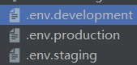

# 若依

---

---

## 1 若依概述

---

### 1.1 什么是若依

#### 1.1.1 若依的本质

本质是一个**开源项目**，可以在此基础上做**二次开发**

#### 1.1.2 学习若依的目的

- 直接使用开源框架，减少工作量
- 学习优秀开源项目底层的设计思想，提高编程能力

> 官网：www.ruoyi.vip

----

### 1.2 使用若依

#### 1.2.1 使用开源项目基本步骤

1. 下载并运行
2. 看懂业务流程
3. 进行二次开发

#### 1.2.2 具体步骤

1. 下载若依项目

   > 直接复制Gitee上的链接，使用IDEA进行git clone即可
   >
   > 如果遇到代理问题，可以使用如下命令取消代理：
   >
   > ```shell
   > git config --global --unset http.proxy
   > ```

2. 运行sql脚本、修改MySQL数据源、配置redis

   > 在application-druid.yml中修改数据源、
   > 在application.yml中配置redis

3. 通过主启动类启动后端项目

4. npm install 、npm run dev

---

---

## 2 底层业务解析

--------------

### 2.1 验证码

#### 2.1.1 前端

> 首先找到登录页面，页面都在@/views下

1. 在`created`钩子中调用方法，向后端发送请求，返回**验证码图片url**和**uuid**

> uuid相当于一个*key*，用于后端在**redis**中查找对应的验证码答案

2. 经过了多层封装，调用了***axios***

> `axios.create(config)`中，`config`的`baseURL`是一个<u>配置文件</u>中的常量，
> 不同环境下使用的配置文件：
> 
>
> > 如果是.env，代表在所有环境下都会生效；
> >
> > npm run dev(/serve)启动时就会自动启用.env.development；
> >
> > npm run build就会启用.env.production

3. 在向后端发送请求时，为了解决跨域问题，用到的**反向代理**

#### 2.1.2 后端

> 首先找到对应的controller，可以用IDEA的*Find in Files*功能（Ctrl Shift F），输入**请求路径**

1. 先判断是否开启验证码功能，没开启直接返回未开启的信息
2. 生成uuid，接着生成验证码答案在redis中的key
3. 生成某种类型的验证码表达式和图片，保存uuid和答案
4. 响应uuid和图片给前端

-----

### 2.2 登录

#### 2.2.1 前端

登录表单收集用户信息，存储到`vm.loginForm`中

按钮回调`handleLogin`处理登录

多重`Promise`异步任务封装，调用后端接口验证登录

#### 2.2.2 后端

> 总体上还是SpringSecurity；
>
> 期间会**异步记录操作日志**，与业务逻辑分离，效率高

1. 校验验证码
2. 认证，成功后记录登录信息
3. 用Jwt生成token，响应给前端

---

### 2.3 用户权限管理

#### 2.3.1 后端

getInfo：

- 通过id查询用户角色和权限，响应给前端

  > 这里的权限主要就是perms`，不包含其他信息

getRouters：

- 根据id查询菜单/路由

  > 其实还是权限，只不过这次查的信息更多，但不包括`perms`

- 递归处理父子结构菜单

#### 2.3.2 前端

getInfo：

- 将角色和权限信息存储到vuex中，即存储在了客户端，不需要再向后端请求了

getRouters：

- 根据路由信息生成菜单组件，


