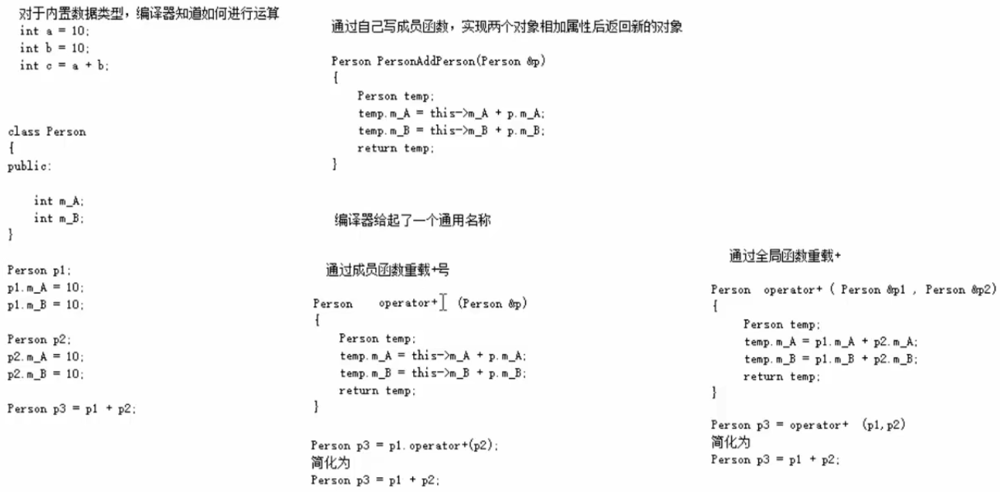
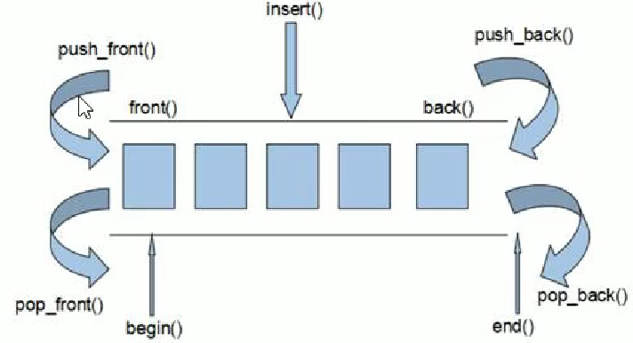

# C++

---

---

---

## 概述

---

---

### 一、C++包括什么

---

#### （一）C语言

- 说到底`C++`是以`C`为基础的
- 区块、语句、预处理器、内置数据结构、数组、指针......都来自于`C`

#### （二）Obeject-Oriented C++

- 这部分就是 ***C With Classes*** 所诉求的
- 构造函数、封装继承多态......都属于这一部分

#### （三）Template C++

- C++泛型编程的部分，大多数程序员经验最少的部分

#### （四）STL

- STL是一个程序库
- STL有自己的规则，使用时要遵循

---

### 二、C++相关经典书籍

---

- C++ Primer
- Effective C++
- Effective STL
- STL源码剖析
- 深度探索C++对象模型

> 公众号回复“C++进阶书籍”

---

---

## Basic C++

---

---

### 一、初识C++

---

#### （一）第一个C++程序

- 编写C++程序的4个步骤
  1. 创建项目
  2. 创建文件
  3. 编写代码
  4. 运行程序


- 简单的程序框架

```c++
#include <iostream>
using namespace std;

int main() {
    
    cout << "Hello, World!" << endl;

    int a = a 
    system("pause");
    return 0;
}
```

#### （二）变量

- 变量的作用

  - 给一段指定的内存空间**起名**，<u>方便操作这段内存</u>

    > 不然的话就要用十六进制的内存地址去记录，太麻烦

#### （三）常量

- 常量的作用

  - 记录程序中不可以更改的数据

- 常量的定义方法

  - `#define`宏常量

    `#define 常量名 常量值`

    > 通常在<u>文件上方</u>定义

  - `const`修饰的变量

    `const 数据类型 常量名 = 常量值;`

    > 通常是在变量的定义前加一个const修饰

  ```c++
  #include <iostream>
  using namespace std;
  
  #define DAY 7
  
  int main() {
  
      cout << "一周共有" << DAY << "天" << endl;
      //Day = 8;//error: lvalue required as left operand of assignment
      const int MONTH = 12;
      cout << "一年共有" << MONTH << "月" << endl;
      //MONTH = 13;//error: assignment of read-only variable 'MONTH'
  
      system("pause");
      return 0;
  }
  ```


---

### 二、数据类型

---

#### （一）为什么要指定数据类型

- 不指定数据类型，无法给变量分配内存
- 为了给变量<u>分配合适的**内存空间**</u>

#### （二）整型


> **占用空间**不同导致了**取值范围**不同

#### （三）sizeof

- 作用

  - 统计数据类型所占空间大小（单位：**字节**）

  > 所以我们不必刻意去记某种数据类型所占空间大小了

- 语法

  - `sizeof(数据类型/变量)`

#### （四）实型/浮点型

- 作用
  - 表示小数
- 分类


- 其他值得注意的点

  - 小数默认类型：`double`

    

    

    > 为了体现出它是`float`类型的，一般要加上一个`f`

  - 有效数字：默认6位

    

  - 科学计数法

    

    > e后面是正数就是10为底
    >
    > e后面是负数就是0.1为底

#### （五）字符型

- C和C++中的字符只占用<u>1个字节</u>的空间

- 底层存储的是ASCII码

  

  > ASCII：
  >
  > a --- 97
  >
  > A --- 65

```c++
char c = "a";//error: Cannot initialize a variable of type 'char' with an lvalue of type 'const char [2]'
char c = 'abcdef';//warning: character constant too long for its type
```

> 为什么上例中是`char[2]`呢？
>
> 因为还有一个结尾标志空字符

#### （六）转义字符

- 作用

  - 表示一些**不能显示出来的**ASCII字符

- 常用的转义字符

  

  > 水平制表的作用：**整齐输出数据**
  >
  > 
  >
  > 
  >
  > $\rightarrow$补空格至**8**个字符长度

#### （七）字符串

- 两种风格

  - C风格：`char 变量名[] = "字符串值"`

  - C++风格：`string 变量名 = "字符串值"`

    > C++风格需要加入头文件`#include <string>`

#### （八）布尔类型

- 作用
  - 代表“真”或“假”的值
- 只占用**1个字节**

```c++
bool flag1 = true;
bool flag2 = false;
cout << flag1 << endl;//1
cout << flag2 << endl;//0
```

#### （九）数据的输入

- 作用

  - 从键盘上获取数据

- 关键字：`cin`

  - 语法：`cin >> 变量`

- 值得注意的点

  - 给bool类型输入值的时候，不要打英文"true"或者"false"，<u>直接给"1"或"0"</u>

    > **非0的<u>数字</u>**给到bool类型后会变成1（包括负数）

---

### 三、运算符

---

#### （一）算术运算符

- 除法

  - 整数相除运算结果仍然是整数
  - 小数也可以相除，结果仍为小数
  - 除数为0会让程序崩溃

- 取模

  - 模不过的，运算结果就是本身

    ```c++
    int a = 10;
    int c = 20;
    cout << a % c << endl;//10
    ```

  - 模0会让程序崩溃

  - 小数是不可以进行取模运算的

    ```c++
    double a = 3.3;
    int c = 1;
    cout << a % c << endl;//error: invalid operands of types 'double' and 'int' to binary 'operator%'
    ```

#### （二）赋值运算符

#### （三）比较运算符

- 返回真值或假值（1或0）

#### （四）逻辑运算符

---

### 四、程序流程结构

---

#### （一）顺序结构

#### （二）选择结构

- 三目运算符

  - 在C++中，如果三目运算符**返回了变量**，则**可以对其进行赋值**

    ```c++
    int a = 3;
    int c = 1;
    (a > c? a: c) = 5;//注意加括号
    cout << a << endl << c << endl;
    ```

  - 三目运算符<u>两个分支的数据类型要能兼容</u>，不然会报错

    ```c++
    a < c? (cout << a << endl << c << endl): (cout << "no" << endl);//no error
    a > c ? (cout << a << endl << c << endl) : c;//error: operands to ?: have different types 'std::basic_ostream<char>::__ostream_type' {aka 'std::basic_ostream<char>'} and 'int'
    ```

#### （三）循环结构

---

### 五、数组

---

#### （一）数组特点

- 元素类型相同
- 内存空间连续

#### （二）数组名

- :star:统计数组长度

  > 利用`sizeof`
  >
  > 对于一维数组：
  >
  > ​	元素个数 = `sizeof(arr) / sizeof(arr[0])`
  >
  > 对于二维数组：
  >
  > ​	元素个数 = `sizeof(arr) / sizeof(arr[0][0])`
  >
  > ​	行数 = `sizeof(arr) / sizeof(arr[0])`
  >
  > ​	列数 = `sizeof(arr[0]) / sizeof(arr[0][0])`

- 获取数组的首地址

  > 直接输出数组名就好
  >
  > （注：`arr == &arr`）

- 数组名是==常量==

---

### 六、函数

---

#### （一）概述

- *函数的作用*

  - 将代码封装起来，实现代码复用

  > 将较大的程序划分成若干程序模块，每个模块实现特定功能

#### （二）函数的定义

1. 返回值类型
2. 函数名
3. 形式参数列表
4. 函数体

#### （三）函数的调用

#### （四）值传递

#### （五）函数的声明

- *作用*
  - （提前）告诉编译器函数名称以及如何调用函数
  - 函数的实际主体可以单独定义

#### （六）函数的分文件编写

- *作用*

  - 让代码结构更加清晰

- *步骤*

  - 创建后缀名为 .h 的**头文件**

  - 创建后缀名为 .cpp 的**源文件**

  - 在头文件中写函数的**声明**

  - 在源文件中写函数的**定义**

    > 当然，要在源文件中**引用**对应的头文件
    >
    > 自定义的头文件使用 ==`#include "自定义头文件名.h"`== 这种格式

---

### 七、指针

---

#### （一）基本概念

- *指针的作用*
  - 通过指针可以操作内存空间
  - 可以用指针变量保存地址

#### （二）指针变量的定义和使用

#### （三）指针所占用的内存空间

- 在**32位操作系统**下，一个指针变量占用**4个字节**的内存空间
- 在**64位操作系统**下，一个指针变量占用**8个字节**的内存空间

> 无论指向的是什么类型变量，指针所占内存空间大小都是这样

#### （四）空指针和野指针

- *空指针*
  - 指向<u>编号为0</u>的内存地址的指针

    > 默认有宏定义 `#define NULL 0`

  - 用途：初始化指针变量

  - 注意：空指针指向的内存是不可以访问的

- *野指针*

  - 指针变量指向非法的内存空间
  - 野指针指向的内存是不可以访问的


> 空指针和野指针并不是我们“**申请**”的内存空间，所以不能随意操作

#### （五）const修饰指针

- *const修饰指针*

  - 常量指针

  ```c++
  int a = 10;
  int b = 20;
  const int *p = &a;
  *p = 100;//error: assignment of read-only location '* p'
  p = &b;//no error
  ```

  > *p不能补修改

- *const修饰常量*

  - 指针常量
  ```c++
  int a = 10;
  int b = 20;
  int *const p = &a;
  p = &b;//error: assignment of read-only variable 'p'
  *p = 100;//no error
  ```

  > p不能被修改

- *const既修饰指针又修饰常量*

  > ```c++
  > int a = 10;
  > int b = 20;
  > const int *const p = &a;
  > p = &b;//error: assignment of read-only variable 'p'
  > *p = 100;//error: assignment of read-only location '*(const int*)p'
  > ```

#### （六）指针和数组

- 利用指针操作数组

- 指针和数组名的区别

  ```c++
  int a = 10;
  int b = 20;
  int arr[] = {1, 2, 3, 4, 5};
  int *p1 = arr;
  int *p2 = &arr;//error: cannot convert 'int (*)[5]' to 'int*' in initialization
  cout << arr << ',' << &arr << endl;//0x61fe00,0x61fe00
  cout << p1 << ',' << &p1 << endl;//0x61fe00,0x61fdf8
  ```
  
  > 数组名是宏观的指针整体，数组名取址后是微观的指针变量们（数组元素们）

#### （七）指针和函数

- 指针作为参数：地址传递

  > 所以向函数中直接传**数组名**就可以在函数<u>内部</u>真正**操作数组**了

---

### 八、结构体

---

#### （一）基本概念

- 结构体属于用户==自定义的数据类型==，允许用户存储不同的数据类型

#### （二）结构体的定义和使用

- 定义结构体

  - 语法：`struct 结构体名 {结构体成员列表};`

- 利用结构体**创建变量**

  - 方式1：`struct 结构体名 变量名`（然后用`.`去访问变量并赋值）

  - 方式2：`struct 结构体名 变量名 = {成员1值, 成员2值}`

  - 方式3：在定义时创建

    > 方式1、2用得较多，方式3用得较少

    > 在C++中，创建变量时，struct关键字可以省略

- 举例

  ```c++
  struct Student {
      string name;
      int age;
      int score;
  } s3 = {"Bob", 20, 101};
  int main() {
      struct Student s1;
      s1.name = "Harry";
      s1.age = 18;
      s1.score = 100;
  
      struct Student s2 = {"Potter", 19, 99};
  
      return 0;
  }
  ```

#### （三）结构体数组

- 作用
  - 将自定义的结构体放入数组中，方便维护
- 语法
  - `struct 结构体名 数组名[元素个数] = {{}, {}, {},}`

#### （四）结构体指针

#### （五）结构体嵌套

#### （六）结构体与函数

- *值传递*

  > 不会影响到上层函数中结构体的值，但要额外复制一份，<u>占用内存空间</u>

- *地址传递*

  > 不会因复制副本而占用太多内存（只占用一个指针的内存），但会<u>影响到上层函数中结构体的值</u>
  >
  > 解决方法如下（七）

#### （七）结构体与const

- ==在函数的形式参数列表上加入const==

  ```c++
  void priStu(const Student *stu) {
      stu->age = 100000;//error: assignment of member 'Student::age' in read-only object
      cout << stu->age;
  }
  ```

---

---

## Obeject-Oriented C++

---

---

### 一、内存分区模型

---

#### （零）前言

> C++程序在执行时，将内存大方向划分为**4个区域**
>
> - 代码区：存放<u>函数体</u>的二进制代码，由<u>操作系统</u>进行管理的
> - 全局区：存放<u>全局变量</u>、<u>静态变量</u>以及<u>常量</u>
> - 栈区：由<u>编译器自动分配和释放</u>，存放函数的<u>参数</u>值、<u>局部变量</u>等
> - 堆区：由<u>程序员分配和释放</u>，若程序员不释放，程序结束时由操作系统回收
>
> 内存四区的**意义**：
>
> ​	可以给不同区域存放的数据赋予<u>不同的生命周期</u>，给我们更大程度上的灵活编程

#### （一）程序运行前

> 生成了.exe可执行程序但还没运行时，代码区和全局区就已经存在了

- *代码区*

  - 内容
    - 存放CPU执行的机器命令（代码）
  - 特点
    - **共享**：对于频繁被执行的程序，只需要在内存中有一份代码即可
    - **只读**：防止程序意外地修改指令

- *全局区*

  - 内容

    - **全局变量**
  
    - **静态变量**
  
    - **常量区**
      
      - 字符串常量
      
      - ***const***修饰的**全局**变量
      
        > **const修饰的局部变量**不行，因为无法在程序运行前分配
      
      - 其他常量
  
  - 特点
  
    - 该区域的数据在程序结束后由<u>**操作系统**</u>释放
  
  - 举例
  
    ```c++
    #include <iostream>
    using namespace std;
    int g_a = 1, g_b = 2;
    const int c_g_a = 1, c_g_b = 2;
    int main() {
        int a = 1, b = 2;
        static int s_a = 1, s_b = 2;
        const int c_l_a = 1, c_l_b = 2;
        cout << &a << ',' << &b << endl;//0x61fe1c,0x61fe18
        cout << &g_a << ',' << &g_b << endl;//0x403010,0x403014
        cout << &s_a << ',' << &s_b << endl;//0x403018,0x40301c
        cout << &"hello" << ',' << &"world" << endl;//0x40400c,0x404012
        cout << &c_l_a << ',' << &c_l_b << endl;//0x61fe14,0x61fe10
        cout << &c_g_a << ',' << &c_g_b << endl;//0x404004,0x404008
        return 0;
    }
    ```

#### （二）程序运行时

- *栈区*

  - 由<u>编译器自动分配和释放</u>，存放函数的<u>参数</u>值、<u>局部变量</u>等

  - 注：==不要返回函数栈区局部变量的地址==，因为函数执行结束后，栈区开辟的空间会由编译器自动释放

    > 非法操作释放后的内存空间可能会导致程序崩溃

- *堆区*

  - 由<u>程序员分配和释放</u>，若程序员不释放，程序结束时由<u>操作系统</u>回收

  - 在C++中主要利用`new`在堆区开辟内存空间

    > 语法格式：`new 数据类型(参数)`

  ```c++
  int* func() {
      return new int(10);
  }
  int main() {
      int *p = func();
      cout << *p << endl;//10
      return 0;
  }
  ```

#### （三）new操作符

- *new的基本语法*

  - `new 数据类型(参数)`

  > 释放空间：`delete 地址`

- *new开辟数组*

  - `new 数组类型[元素个数]`

  > 释放数组空间：==`delete[] 数组名`==

---

### 二、引用

---

#### （一）基本用法

- *作用*：给变量**起别名**
- *语法*：`数据类型 &别名 = 原名`

#### （二）引用的注意事项

- 引用必须**初始化**

  ```c++
  int &c;//error: 'c' declared as reference but not initialized
  ```

- 引用在初始化后**不可以再改变**

  > 只能<u>一直</u>是<u>同一个变量</u>的别名
  >
  > （其实是因为`const`）

#### （三）引用与函数

- *引用作为函数参数*

  - 作用：函数传参时，<u>不直接利用指针</u>，就可以让形参修饰实参

  > 形参修饰实参的两种方法：
  >
  > 地址传递、**引用传递**

  > 别名与原变量名<u>地位相当</u>，所以在函数传参时<u>起别名</u>（而<u>不是copy</u>一份到新的内存空间上），就可以操作到原数据

- *引用作为函数返回值*

  - 语法：直接在返回值类型后面加`&`

  - 不要返回**局部变量的引用**

    > 和返回局部变量地址类似

    ```c++
    int& test02() {
        int a = 10;
        return a;//warning: reference to local variable 'a' returned [-Wreturn-local-addr]
    }
    ```

  - 函数的调用可以作为左值

    - 函数可以返回**静态变量的引用**

    ```c++
    int& test02() {
        static int a = 111;
        return a;
    }
    int main() {
        int &ref = test02();
        cout << ref << endl;//111
        test02() = 1111;
        cout << ref << endl;//1111
        return 0;
    }
    ```

    > ==如果函数的返回值是一个引用，那么这个函数的调用可以作为左值==

#### （四）引用的本质

- *本质*

  - ==在C++中，引用的本质（内部实现）是一个<u>封装了各种操作</u>的**指针常量**==

  ```c++
  void func(int &ref) {//发现是引用语法，自动转换为 int *const ref = &a;
      ref = 100;//检测到ref是引用，自动转换为 *ref = 100
  }
  int main() {
      int a = 10;
      int &ref = a;//自动转换为 int *const ref = &a;
      ref = 20;//检测到ref是引用，自动转换为 *ref = 20
      cout << "a: " << a << endl;//20
      cout << "ref: " << ref << endl;//20
      func(a);// 等价于 func(ref);
      cout << "a: " << a << endl;//100
      cout << "ref: " << ref << endl;//100
      return 0;
  }
  ```

- *C++推荐使用引用技术*

  - 语法方便
  - 引用的本质是指针常量，但编译器帮我们完成了相关的指针操作

#### （五）常量引用

- *作用*

  - 常量引用主要用来**修饰形参**，**防止误操作**

  - 在函数的形式参数列表中，可以加<u>const修饰形参</u>，防止形参改变实参

    > 相比于直接传值，可以不改开辟新的内存空间
    >
    > （但实质上还是要开辟一个8字节/4字节的指针）

- 举例

  ```c++
  int &ref = 10;//error: cannot bind non-const lvalue reference of type 'int&' to an rvalue of type 'int'
  ```

  ```c++
  const int &ref = 10;
  //编译器自动转换为
  //int temp = 10;
  //const int &ref = temp;
  ref = 1000000;//error: assignment of read-only reference 'ref'
  ```

---

### 三、函数进阶

---

#### （一）函数默认参数

> 在C++中，函数的形式参数列表中的形参是可以有默认值的

- *语法*：`返回值类型 函数名(数据类型 形式参数名 = 默认值){}`
- *举例分析：*

    ```c++
    int func(int a, int b = 20, int c = 30) {
        return a + b + c;
    }
    int main() {
        cout << func(10) << endl;//60
        cout << func(10, 30) << endl;//70
        return 0;
    }
    ```

    > 传了就用传的值，没传才用默认值

    ```c++
    int func(int a = 20, int b, int c = 30) {//error: default argument missing for parameter 2 of 'int func(int, int, int)'
        return a + b + c;
    }
    ```

    > 如果某个位置有了默认参数，那么<u>从这个位置开始之后的所有位置</u>，都必须有默认值

    ```c++
    int func2(int a = 10, int b = 10);
    int func2(int a = 10, int b = 10) {//Redefinition of default argument
        return a + b;
    }
    ```

    > 如果函数声明有默认参数了，函数实现就不能有默认参数
    >
    > <u>声明和实现中**只能有一个**带有默认参数</u>

#### （二）函数的占位参数

> C++中的函数形参列表里可以有占位参数，调用函数时**必须填补**该位置

- *语法：*`返回值类型 函数名(数据类型){}`

```c++
void func3(int a, int) {
    cout << "func3" << endl;
}
int main() {
    func3(10);//error: too few arguments to function 'void func3(int, int)'
    return 0;
}
```

```c++
void func3(int a, int = 10) {
    cout << "func3" << endl;
}
int main() {
    func3(10);//no error
    return 0;
}
```

#### （三）函数重载

- *作用*

  - 函数名相同，提高复用性

- *条件*

  - 在同一个**<u>作用域</u>**下
  - 函数名相同
  - 函数参数**类型（/顺序）**不同或**个数**不同

  > 注：函数的**<u>返回值不同</u>**不可以作为函数重载的条件

- *其他注意事项*

  - **引用作为重载条件**

    ```c++
    void func(int &a) {}
    void func(const int &a) {}
    int main() {
        int a = 10;
        func(a);//调用的是func(int&)
        func(10);//调用的是func(const int&)
        return 0;
    }
    ```

    > 在**两种引用参数都有**的情况下，使用变量`a`一定会调用`func(int&)`，但**只有一个**时，都可以
    >
    > 字面量只能传入`const int &a`
  
  - 函数重载与默认参数
  
    ```c++
    void func2(int a, int b = 10) {}
    void func2(int a) {}
    int main() {
        func2(10);//error: call of overloaded 'func2(int)' is ambiguous
        return 0;
    }
    ```
  
    > 容易引发二义性
    >
    > 所以想要重载就不要用默认参数了


---

### 四、类和对象

---

#### （一）封装

- *封装的意义*
  - 将**属性和行为**作为一个**整体**，表现生活中的事物
  - 将属性和行为加以**权限控制**
- *访问权限*
  1. `public` 类内类外都可以访问
  2. `protected` 类内可以访问，类外只有子类可以访问
  3. `private` 类内可以访问，类外不可以访问（子类也不行）

> `struct`的默认权限是`public`
>
> `class`的默认权限是`private`

- *属性私有化并提供操作入口*
  - 属性写在`private:`下面
  - 操作写在`public:`下面

#### （二）对象的初始化和清理

##### 1、构造函数与析构函数概述

- 构造函数：**创建**对象时初始化操作
- 析构函数：对象**销毁前**进行一些清理工作
- **编译器自动调用**，且会**缺省**提供**空实现**的构造函数与析构函数

##### 2、构造函数与析构函数语法

- 构造函数：`类名(){}`

  - 函数名与类名相同，不写返回值（实质上返回值就是类名了）
  - 可以重载
  - <u>在调用对象时</u>就会<u>自动调用构造函数</u>

  > 当手动写出构造函数时，也要写明`public:`，不然默认还是`private`的，会报错

- 析构函数：`~类名(){}`

  - 函数名与类名相同，**不写返回值**
  - 析构函数**不可以有参数**，不能重载
  - 在对象销毁前自动调用

  > 当手动写出构造函数时，也要写明`public:`，不然默认还是`private`的，会报错

##### 3、构造函数的分类及调用

- :star:*分类*

  - 按参数分为

    - 有参构造
    - 无参构造

    > 这个区分并不太重要，可以等同

  - 按类型分为

    - 普通构造

    - 拷贝构造

      ```c++
      Person(const Person &person) {
              age = person.age;
      }
      ```

      > 注意传入的拷贝源一定要是**`const`**修饰的**引用**
      
      > 缺省会提供一个 **copy 所有属性值**的拷贝构造

- :star:*调用*

  - **括号法**

    ```c++
    Person p;//无参
    Person p2(10);//有参
    Person p3(p);//copy
    ```

    > 注意无参的时候不要写括号，不然**会被编译器当成函数的声明**
    >
    > （C+允许在一个函数体的内部写另一个函数的声明）

    > ==特点：参数跟在变量名后面==

  - **显示法**
  
    ```c++
    Person p1 = Person();
    Person p2 = Person(10);
    Person p3 = Person(p2);
    ```

    > 注意不用`new`
  
    > ==特点：参数跟在类名后面==

    ```c++
    Person(100);
    ```

    > 如果只是这样写，不用变量去接收，这种对象叫做**匿名对象**
    >
    > 当前这一行执行结束后，系统就会**立即自动回收**掉匿名对象
  
    ```c++
    Person p = Person(10);
    Person(p);//redeclaration of 'Person p3'
    ```
  
    > 不能利用<u>拷贝构造</u>初始化<u>匿名对象</u>
    >
    > 因为对于编译器来说，`Person(p);`相当于`Person p;`
    >
    > 这会导致重定义
  
  - **隐式转换法**
  
    ```c++
    Person p1 = 10;//会调用普通构造
    Person p2 = p1;//会调用拷贝构造（不是运算符重载）
    Person p3 = {1, "sd"};//多参数时利用大括号
    ```
    
    > 直接用相关参数赋值
    >
    > 当然，前提是要有对应的**构造函数**
    
    > ==特点：参数谁也不跟==

##### 4、拷贝构造函数调用时机

- **主动调用**拷贝构造克隆对象时

- 值传递的方式**给函数参数传值**时

  ```c++
  void doWork(Person p) {
  }
  void test02() {
      Person p;
      doWork(p);
  }
  int main() {
      test02();
      return 0;
  }
  //constructor executed !
  //constructor of copy executed !
  //destructor executed !
  //destructor executed !
  ```

  > 给函数传对象参数时本质上进行了一次**拷贝构造**
  >
  
- 以值方式**返回**局部对象

  ```c++
  Person doOther() {
      Person p;
      return p;
  }
  int main() {
      doOther();
      return 0;
  }
  ```

  > 这个测试后发现是不正确的，有待考量


##### 5、构造函数调用规则

- *缺省提供*
  - 无参构造（函数体为空）
  - 拷贝构造（对属性进行值拷贝）
  - 无参析构（函数体为空）
- *提供规则*
  - 程序员提供了有参，会覆盖无参，但不会覆盖拷贝
  - 程序员提供了拷贝，也会覆盖无参

##### 6、深拷贝与浅拷贝

- *浅拷贝*

  - 简单的赋值拷贝操作

    > 编译器提供的缺省拷贝构造就是这样

- *深拷贝*

  - 在**堆区**重新申请空间，进行拷贝操作

    > 如果有在**堆区**开辟空间的属性，一定要手动写一个深拷贝

- *举例：问题与解决*

  - 问题：**重复释放**

    ```c++
    class Person {
    public:
        int age;
        int *height;
        Person() {}
        Person(int a, int h) {
            age = a;
            height = new int(h);
        }
        ~Person() {
            if (height != NULL) {
                delete height;
                height = NULL;
            }
        }
    };
    int main() {
        Person p1;
        p1.age = 600;
        *p1.height = 1000;
        Person p2(p1);
        return 0;
    }//栈的顺序，先释放p2，再释放p1
    ```

    > 上面程序的第21行使用的是**缺省浅拷贝**，导致了重复释放的问题

    > 不过在<u>析构函数中释放内存</u>确实是规范的操作

  - 解决问题：利用**深拷贝**

    ```c++
    Person(const Person &p) {
        age = p.age;
        height = new int(*p.height);
    }
    ```

    > 程序员手写一个**深拷贝**，申请新的**堆区空间**

##### 7、初始化列表

> 这是**初始化属性**的另一种方法，可以代替构造函数

- *语法*

  - `类名(形式参数列表): 属性(属性值) {函数体}`

    > **属性值**可以使用形式参数列表中的**变量**
    >
    > **属性名**可以和形式参数列表中的**变量名**相同

- *作用*：避免在构造函数体中对属性进行赋值

> 举例
>
> ```c++
> class Person {
> public:
>     Person(int a, int b, int c) : m_A(a), m_B(b), m_C(c) {
>         
>     }
>     int m_A;
>     int m_B;
>     int m_C;
> }
> ```

##### 8、类对象作为类成员

- C++ 类中的成员可以是另一个类的对象，我们称该对象为**对象成员**

- 对象成员的**初始化**：

  - **手动**写出来的构造函数**必须手动给对象成员初始化**
  - **初始化列表**可以结合**隐式转换法**给对象成员初始化

- :star:先构造对象成员，再构造类；先析构类，再析构对象成员

  > 先有零件，才能构造整体；先拆整体，再单独拆零件

> 举例：
>
> ```c++
> class Phone {
> public:
>     Phone(string PName) : m_PName(PName) {
>     }
>     string m_PName;
> };
> class Person {
> public:
>     Person(string name, string pName : m_Name(name), m_Phone(pName){
>     }
>     string m_Name;
>     Phone m_Phone;
> };
> ```

##### 9、静态成员

-  *概念*

  - 静态成员就是在**成员变量**和**成员函数**前加上关键字`static`修饰

- *分类*

  - 静态成员变量

    - 所有对象**共享一份数据**

    - 在**编译阶段分配内存**

    - ==**类内声明类外初始化**==

      > 这个操作是必须的，否则无法访问这块内存

      > 举例：
      >
      > ```c++
      > class Person {
      > public:
      >     static int m_A;
      > };
      > int Person::m_A = 100;

  - 静态成员函数

    - 所有对象**共享一个函数**
    - 静态成员函数**只能访问静态成员变量**

- *访问*

  - 静态成员变量
    - `类名::变量名`
    - `对象名.变量名`
  - 静态成员函数
    - `类名::函数名(参数列表)`
    - `对象名.函数名(参数列表)`

  > 静态成员也是有**访问控制权限**的

> 举例：
>
> ```c++
> class Person {
> public:
>     static void func(
>         m_A = 100;
>         //m_B = 200;//Invalid use of member 'm_B' in static member function
>         cout << "stat
>     }
>     static int m_A;
>     int m_B;
> };
> int Person::m_A = -1;
> ```

#### （三）C++ 对象模型和 this 指针

##### 1、成员变量和成员函数分开存储

- C++ 中，类内的**成员变量**和**成员函数**分开存储

- 只有**非静态成员变量**才属于类的**对象**上

  > 没有**非静态成员变量**的类的**对象**只占**一个字节**，有非静态成员变量，就按照非静态成员变量来算，不用加1

  > **函数**或**静态成员变量**都不会影响**对象的内存空间大小**

##### 2、this 指针

- this 指针出现在**非静态成员函数**中，指向调用函数的对象，即函数的**调用者**

  > **函数只有一份**，但**非静态成员变量**可以有很多，用 this 指针就可以让函数知道该访问哪个对象的**非静态成员变量**

- this 指针的用途

  - 当形参和成员变量同名时，可以用于区分

  - 在类的**非静态成员函数**中返回对象本身时，可以使用`return *this`

    > 可用于==**链式编程思想**==
    >
    > （其实`cout << ... << ... <<...`就是这种思想）

  > 注意`this`在 C++ 里就是一个指针，**解引用**之后才表示**这个对象**，
  >
  > 用`this`访问成员变量只能用`->`，不能用`.`

> 举例：
>
> ```c++
> class Person {
> public:
>     int age;
>     Person(int age) : age(age) {}
>     //如果返回值改成Person，返回的就是this的一个拷贝
>     Person& add_age(Person p) {
>         this->age += p.age;
>         return *this;
>     }
> };
> int main() {
>     Person p1(10);
>     Person p2(5);
>     p2.add_age(p1).add_age(p1).add_age(p1);
>     cout << p2.age << endl;//35
>     return 0;
> }
> ```

##### 3、空指针调用成员函数和访问静态成员变量

- 用相应类型的空指针`NULL`是可以调用**成员函数**和访问**静态成员变量**

> 举例：
>
> ```c++
> class Person {
> public:
>     int age;
>     Person(int age) : age(age) {}
>     static double PI;
>     void func1() {
>         if (this == NULL) {//比较常用的写法
>             return;
>         }
>         cout << this->age << endl;
>     }
> };
> double Person::PI = 3.14;
> int main() {
>     Person *pp = NULL;
>     cout << pp->PI << endl;//静态成员变量也可以访问
>     pp->func1();
>     return 0;
> }
> ```

##### 4、const修饰成员函数

- 常函数

  - 成员函数后加`const`

    > `this`指针本身是一个指针常量
    >
    > 在函数后加了`const`，这个`const`其实是修饰`this`去了
    >
    > 就把`this`变成了“**常量指针常量**”

  - 常函数内不可以修改成员属性

    > 除非这个成员属性有`mutable`修饰

- 常对象

  - 声明对象前加`const`修饰

  - 常对象的**属性不能修改**

    > 除非有`mutable`修饰

  - 常对象**只能调用常函数**

    > 因为普通成员函数有可能修改属性

#### （四）友元

##### 0、概述

- 有时候，函数中的**私有成员**，也是允许**在类外被访问**的，这就需要用到**友元技术**
- 友元的目的：让一个**函数**或者**类**访问另一个类中**私有**成员
- 友元的关键字是`friend`

##### 1、全局函数作友元

- 语法

  - 将全局函数的“声明”（其实只是一个形式）放在类内部，在最前面用`friend`关键字修饰

    > 建议把声明放在类的最开始（其实放哪都行，跟权限符无关）

> 举例：
>
> ```c++
> class Building {
>     friend void goodGay(Building &building);
> private:
>     string bedroom;
> public:
>     Building(): bedroom("bed") {}
> };
> void goodGay(Building &building) {
>     cout << building.bedroom << endl;//bed
> }
> int main() {
>     Building b;
>     goodGay(b);
>     //cout << b.bedroom << endl;//'bedroom' is a private member of 'Building'
>     return 0;
> }

##### 2、类作友元

- 语法
  - 将类的“声明”（其实只是一个形式）放在类内部，在最前面用`friend`关键字修饰

> 举例：
>
> ```c++
> class Building;
> class GoodGay {
> public:
>     GoodGay();
>     void visit();
>     Building *building;
> };
> class Building {
>     friend class GoodGay;
> public:
>     Building();
> private:
>     string bedroom;
> };
> //这里使用了成员函数新的定义方法
> //::是指定作用域的意思，就是在对应作用域中找成员
> Building::Building() : bedroom("bed") {}
> GoodGay::GoodGay() : building(new Building) {}
> void GoodGay::visit() {
>     cout << this->building->bedroom << endl;//bed
> }
> int main() {
>     GoodGay gg;
>     gg.visit();
>     return 0;
> }

##### 3、成员函数作友元

- 语法
  - 将成员函数的“声明”（其实只是一个形式）放在类内部，在最前面用`friend`关键字修饰，同时用`::`指明是哪个类下的成员函数

> 举例：
>
> ```c++
> class Building;
> class GoodGay {
> public:
>     GoodGay();
>     void visit();
>     Building *building;
> };
> class Building {
>     //friend class GoodGay;
>     friend void GoodGay::visit();
> public:
>     Building();
> private:
>     string bedroom;
> };
> Building::Building() : bedroom("bed") {}
> GoodGay::GoodGay() : building(new Building) {}
> void GoodGay::visit() {
>     cout << this->building->bedroom << endl;//bed
> }
> ```

#### （五）运算符重载

##### 0、概述

- 对已有的运算符重新进行定义，赋予其另一种功能，以适应不同的**数据类型**

  > 对于内置数据类型，编译器知道该如何运算

- 重载方式

  - 成员函数重载
  - 全局函数重载

##### 1、加号运算符重载

- 作用：实现两个（相同的）**自定义的类型相加**

- 图解

  

> 举例
>
> ```c++
> class Person {
> public:
>     int age;
>     Person(int age) : age(age) {}
>     Person() {}
>     Person operator+(Person &p){
>         return Person(age + p.age);
>     }
> };
> /*Person operator+(Person &p1, Person &p2) {
>     return Person(p1.age + p2.age);
> }*/
> int main() {
>     Person p1(10);
>     Person p2(20);
>     //Person p3 = p1.operator+(p2);//两种重载不混淆
>     //Person p3 = operator+(p1, p2);//两种重载不混淆
>     Person p3 = p1 + p2;//如果两种重载都提供：Use of overloaded operator '+' is ambiguous
>     cout << p3.age << endl;//30
>     return 0;
> }
> ```
>
> ```c++
> class Person {
> public:
>     int age;
>     Person(int age) : age(age) {}
>     Person() {}
>     Person operator+(Person &p){
>         return Person(age + p.age);
>     }
>     //运算符重载还可以重载
>     Person operator+(int age){
>         return Person(this->age + age);
>     }
> };
> int main() {
>     Person p1(10);
>     Person p2(20);
>     Person p3 = p1 + p2 + 100;
>     cout << p3.age << endl;//130
> }
> ```

##### 2、左移运算符重载

- 输出自定义数据类型

- 通常不会利用成员函数重载左移运算符

  > 因为这样`cout`就会变到右侧去，变成`对象名 << cout`

- 为了能“链式编程”，重载后也要返回`ostream`类型的引用对象

  > 不然就没办法一直`<<`了，像这样`cout << person << endl;`
  >
  > 而且必须是引用，不然就会返回一个`cout`的拷贝

> 举例：一般来说属性都是私有的，所以这里还可以结合**友元技术**
>
> ```c++
> class Person {
>     friend ostream &operator<<(ostream &cout, Person &p);
> private:
>     int a;
>     int b;
> public:
>     Person() : a(10), b(20) {}
> };
> ostream &operator<<(ostream &cout, Person &p) {
>     cout << "Person{a = " << p.a << ", b = " << p.b << "}";
>     return cout;
> }
> int main() {
>     Person p;
>     cout << p << "hello world" << endl;
>     return 0;
> }

##### 3、递增运算符重载

- 通过重载递增运算符，实现自己的整型数据
- **前置无参返引用**，**后置占位返回值**

> 举例：
>
> ```java
> class MyInteger {
>     friend ostream &operator<<(ostream& cout, MyInteger myInteger);
> public:
>     MyInteger() : num(0) {}
>     MyInteger(int i) : num(i) {}
>     //overload pre++
>     MyInteger& operator++(){
>         this->num++;
>         return *this;
>     }
>     //overload suf++
>     MyInteger operator++(int) {
>         MyInteger temp = *this;
>         this->num++;
>         return temp;
>     }
> private:
>     int num;
> };
> ostream &operator<<(ostream& cout, MyInteger myInteger) {
>     cout << myInteger.num << endl;
>     return cout;
> }
> int main() {
>     MyInteger myInt;
>     cout << ++++++++myInt << endl;//4
>     cout << myInt++++++++ << endl;//4
>     cout << myInt << endl;//5
>     return 0;
> }
> ```

##### 4、赋值运算符重载

- C++ 编译器缺省给一个类添加的 4 个函数

  - 无参普通构造

  - 浅拷贝构造

  - 无参析构

  - **赋值运算符重载**，重载的结果是**浅拷贝**

    > 所以这个默认情况下还是会造成**内存重复释放**的问题
    >
    > 解决方案还是**深拷贝**

- 为了能支持**连等**，返回值也要是`*this`

> 举例：
>
> ```c++
> class Person {
> public:
>  int *age;
>  Person(int age) : age(new int(age)) {}
>  Person(const Person &person) : age(new int(*person.age)) {}
>  ~Person() {
>      if (age != NULL) {
>          delete age;
>          age = NULL;
>      }
>  }
>  Person& operator=(Person &person) {
>      if (this->age != NULL) {
>          delete this->age;
>      }
>      this->age = new int(*person.age);
>      return *this;
>  }
> };
> int main() {
>  Person p1(10);
>  Person p2(5);
>  p2 = p1;
>  cout << *p2.age << endl;//10
>  Person p3(3);
>  p3 = p2 = p1;//从右向左执行
>  cout << *p3.age << endl;//10
>  return 0;
> }
> ```

##### 5、关系运算符重载

- 可以让两个自定义类型对象进行比较操作

##### 6、函数调用运算符重载

- 重载的是==`()`运算符==

- 由于重载后的使用方式非常像函数的调用，所以又称为**仿函数**

  > 仿函数没有固定写法，非常灵活

- 匿名函数对象：`类名(构造函数的形式参数列表)(仿函数的形式参数列表)`

> 举例：
>
> ```c++
> class MyAdd {
> public:
>     int operator()(int num1, int num2) {
>         return num1 + num2;
>     }
> };
> int main() {
>     MyAdd myAdd;
>     cout << myAdd(10, 20) << endl;
>     cout << MyAdd()(10, 20) << endl;
>     return 0;
> }

#### （六）继承

##### 1、基本语法

```c++
class 子类 ： 继承方式 父类 {...}
```

> 子类也称为**派生类**
>
> 父类也称为**基类**

##### 2、继承方式

- 公共继承
- 保护继承
- 私有继承


##### 3、继承中的对象模型

- 子类对象 = 父类所有**非静态属性**（包括**私有**的） + 子类所有**非静态属性**

> 单个类布局举例：
>
> 
>
> （使用 VS 开发人员命令提示符）

##### 4、构造和析构顺序

- 创建子类对象时
  - 先构造父，再构造子
- 销毁子类对象时
  - 先析构子，再析构父

##### 5、同名成员访问方式

- 非静态

  - 访问子类同名成员，直接访问：`对象名.属性名`
  - 访问父类同名成员，需要加作用域：`对象名.父类名::属性名`

  > 非静态成员函数的访问方式同理，但是要注意，子类的同名函数会覆**盖父类所有同名重载**的函数，所以在子类同名的情况下如果想要**父类重载**，**仍然需要加作用域**

- 静态

  - 访问子类同名成员，直接访问：

    - `对象名.属性名`
    - `子类名::属性名`

  - 访问父类同名成员，需要加作用域：

    - `对象名.父类名::属性名`

    - `父类名::属性名`

      > 直接通过父类类名访问属性

    - `子类名::父类名::属性名`

      > 通过**子类类名**访问**父类作用域下**的属性

  > 静态成员函数同理，重载也和非静态同理，也需要加上**父类作用域**

##### 6、多继承语法

- 语法：

  ```c++
  class 子类 : 继承方式1 父类1, 继承方式2 父类2, ... {}
  ```

> 多继承可能引发不同父类中有同名成员出现，需要加**父类作用域**以区分

> C++ 实际开发中不建议使用多继承

> 多继承的单个类布局举例：
>
> 

##### 7、菱形继承

- 概念：两个派生类继承同一个**基类**，又有**一个类同时继承这两个派生类**

  > 菱形继承，也叫钻石继承

- 菱形继承引发的问题

  - 首先是**多继承**的引发的父类同名成员问题
  - 然后是菱形继承引发的**数据重复继承问题**，

- 问题的解决：主要解决**数据重复继承**的问题

  - :star:**虚继承**

    ```c++
    class 派生类 : virtual 继承方式 基类 {}
    ```

    > 菱形继承中的术语：
    >
    > 让两个派生类都去**虚继承**基类，这个基类就称为**虚基类**

    > 这样，同名数据在子类中就只有一份了，就算写出来的**父类作用域不同**，指向的也是**同一份数据**（因此也不用加<u>父类作用域</u>了，不会出现<u>二义性</u>）

> 虚继承类布局举例：
>
> 
>
> 底层：虚基类指针
>
> 

#### （七）多态

##### 1、基本概念

- 静态多态

  - 函数重载、运算符重载都属于静态多态

  - 复用函数名

  - ==**静态多态的函数地址早绑定**==

    > ==**编译阶段确定函数地址**==
    >
    > 不使用**虚函数**机制，就会导致**早绑定**

- 动态多态

  - **父类型引用**指向**子类型对象**

    > 注意，必须是使用引用`&`，不然会直接调用**拷贝构造**创建父类型对象
    >
    > 使用了引用机制后，就不会新创建父类型对象了
    >
    > （当然，在创建子类型对象时，父类的构造方法是一定会执行的）

  - **派生类**和**虚函数**实现运行时多态

  - ==**动态多态的函数地址晚绑定**==

    > ==**运行阶段确定函数地址**==
    >
    > 使用**虚函数**机制，<u>用`virtual`关键字修饰父类函数</u>，就会导致**晚绑定**，编译阶段不会确定函数地址，等运行阶段有对象了再说

  - :star:条件

    - 有**继承**关系

    - 子类**重写**父类的虚函数

      > 子类重写的时候可以不加`virtual`

    - **父类型引用**指向**子类型对象**

      > 用**父类型指针**也可以
      >
      > ```c++
      > 父类名 *对象名 = new 子类名;
      > ```

> 举例：
>
> ```c++
> class Animal {
> public:
>     Animal() {
>         cout << "animal" << endl;
>     }
>     Animal(const Animal &animal) {
>         cout << "copy animal" << endl;
>     }
>     virtual void speak() {
>         cout << "动物在说话" << endl;
>     }
> };
> class Cat : public Animal {
> public:
>     Cat(){
>         cout << "cat" << endl;
>     }
>     void speak() {
>         cout << "喵喵喵" << endl;
>     }
> };
> class Dog : public Animal {
> public:
>     Dog() {
>         cout << "dog" << endl;
>     }
>     void speak() {
>         cout << "汪汪汪" << endl;
>     }
> };
> int main() {
>     Cat cat;
>     Animal &animal = cat;
>     animal.speak();
>     Dog dog;
>     Animal animal1 = dog;
>     animal1.speak();
>     return 0;
> }
> /*
> animal
> cat
> 喵喵喵
> animal
> dog
> copy animal
> 动物在说话
> */
> ```

##### 2、多态原理

- **虚函数（表）指针**
  - 有虚函数，就会有一份虚函数指针存储在对象中
  - 子类重写后，虚函数指针会发生覆盖

> 图解举例：
>
> 
>
> 父类成布局：
>
> 
>
> 没有覆盖的子类布局：
>
> 
>
> 覆盖了的子类布局：
>
> 

##### 4、纯虚函数和抽象类

- 纯虚函数

  - 多态中父类的虚函数基本用不到，不如不去实现它，将其改成纯虚的

  - 语法

    ```c++
    virtual 返回值类型 函数名(参数列表) = 0;
    ```

- 抽象类

  - 一个类中有纯虚函数后，这个类就叫抽象类

    > 不需要其他关键字修饰了

  - 子类如果不重写父类的虚函数，子类也会成为抽象类

  - 抽象类**无法实例化对象**

##### 5、虚析构和纯虚析构

- 使用多态时，如果子类中有属性开辟到堆区，那么**父类型引用或指针是无法调用到子类的析构函数的**

- 解决方式：将父类中的析构函数也改成**虚析构**或**纯虚析构**

- 虚析构和纯虚析构

  - 共性

    - 解决父类指针释放子类对象

    - **都需要有具体的实现**

      > 纯虚析构有特殊的实现方式，有点像“<u>类内声明，类外实现</u>”

  - 区别

    - 纯虚析构导致**抽象类**

> 举例：
>
> 使用**虚析构**
>
> ```c++
> class Animal {
> public:
>     Animal() {
>         cout << "Animal constructor" << endl;
>     }
>     virtual ~Animal() {
>         cout << "Animal destructor" << endl;
>     }
>     virtual void speak() = 0;
> };
> class Cat : public Animal {
> public:
>     string *name;
>     Cat(string name) : name(new string(name)) {
>         cout << "cat constructor" << endl;
>     }
>     ~Cat() {
>         cout << "cat destructor" << endl;
>         if (name != NULL) {
>             delete name;
>             name = NULL;
>         }
>     }
>     void speak() {
>         cout << *name + "喵喵喵" << endl;
>     }
> };
> int main() {
>     Animal *animal = new Cat("Tom");
>     animal->speak();
>     delete animal;
>     return 0;
> }
> /*
> Animal constructor
> cat constructor
> Tom喵喵喵
> cat destructor
> Animal destructor
> */
> //如果不用虚析构，cat destructor 不会执行
> ```
>
> 使用纯虚析构
>
> ```c++
> class Animal {
> public:
>     Animal() {
>         cout << "Animal constructor" << endl;
>     }
>     virtual ~Animal() = 0;
>     virtual void speak() = 0;
> };
> Animal::~Animal() {
>     cout << "Animal destructor" << endl;
> }
> class Cat : public Animal {
> public:
>     string *name;
>     Cat(string name) : name(new string(name)) {
>         cout << "cat constructor" << endl;
>     }
>     ~Cat() {
>         cout << "cat destructor" << endl;
>         if (name != NULL) {
>             delete name;
>             name = NULL;
>         }
>     }
>     void speak() {
>         cout << *name + "喵喵喵" << endl;
>     }
> };
> int main() {
>     Animal *animal = new Cat("Tom");
>     animal->speak();
>     delete animal;
>     return 0;
> }
> /*
> Animal constructor
> cat constructor
> Tom喵喵喵
> cat destructor
> Animal destructor
> */
> //如果纯虚析构不写实现，程序运行时会出错
> ```

---

### 五、文件操作

---

> 前言：
>
> - 通过文件可以将**数据持久化**
> - C++ 中对文件操作需要包含头文件
>   - `<ofstream>`：写操作
>   - `<ifstream>`：读操作
>   - `<fstream>`：读写操作
> - 文件类型可以分为两类
>   - 文本文件：文件以文本的 **ASCII 码**形式存储在计算机中
>   - 二进制文件：文件以文本的**二进制**形式存储在计算机中

#### （一）文本文件

##### 1、写文件

1. 包含头文件

   ```c++
   #include <fstream>
   ```

2. 创建流对象

   ```c++
   ofstream ofs;
   ```

3. 打开文件

   ```c++
   ofs.open("文件路径", 打开方式);
   ```

   > 

4. 写数据

   ```c++
   ofs << "写入的数据";
   ```

5. 关闭流

   ```c++
   ofs.close();
   ```

##### 2、读文件

1. 包含头文件

   ```c++
   #include <fstream>
   ```

2. 创建流对象

   ```c++
   ifstream ifs;
   ```

3. 打开文件并判断文件是否打开成功

   ```c++
   ifs.open("文件路径", 打开方式);
   ```

   ```c++
   ifs.is_open()

4. 读数据：四种方式

   - 缓冲字符数组，一次读到一个分隔标志（但不包括分隔标志）

     ```c++
     char buf[1024] = {0};
     while (ifs >> buf) {
         cout << buf;
     }
     ```

   - 缓冲字符数组，一次读到一个换行符（但不包括换行符）

     ```c++
     char buf[1024] = {0};
     while (ifs.getline(buf, sizeof(buf))) {
         cout << buf << endl;
     }
     ```

   - 缓冲字符串，一次读到一个换行符（但不包括换行符）

     ```c++
     string buf;
     while(getline(ifs, buf)) {//这次使用的是全局函数
         cout << buf << endl;
     }
     ```

   - 缓冲字符，一次只读取一个字符

     ```c++
     char buf;
     while ((buf = ifs.get()) != EOF) {//直到文件末尾标志
         cout << buf;
     }
     ```

5. 关闭流

   ```c++
   ifs.close();
   ```

#### （二）二进制文件

> 首先，文件打开方式中一定要指定`ios::binary`

##### 1、写文件

- 主要函数：`ostream& write(const char *buffer, int len)`

```c++
#include <iostream>
//1、包含头文件
#include <fstream>
using namespace std;
class Person {
public:
    char name[64];
    int age;
};
int main() {
    //2(3)、创建对象和打开文件合并
    ofstream ofs("person.txt", ios::binary | ios::out);
    Person p = {"sd", 18};
    //4、写文件
    ofs.write((const char *)&p, sizeof (p));
    //关闭流
    ofs.close();
    return 0;
}
```

##### 2、读文件

- 主要函数：`istream& read(char *buffer, int len)`

```c++
#include <iostream>
//1、包含头文件
#include <fstream>
using namespace std;
class Person {
public:
    char name[64];
    int age;
};
int main() {
    //2(3.1)、创建流并打开文件
    ifstream ifs("person.txt", ios::binary | ios::in);
    //3.2、判断是否打开成功
    if(!ifs.is_open()) {
        cout << "文件打开失败" << endl;
        return 0;
    }
    //4、读文件
    Person person;
    ifs.read((char*)&person, sizeof(person));
    cout << person.name << ": " << person.age << endl;//sd: 18
    //5、关闭流
    ifs.close();
    return 0;
}
```


> ps：C语言简单文件读写
>
> - `fopen("文件路径", "读写方式")`
>
>   ```c++
>   FILE *fopen(const char * path, const char * mode);
>   ```
>
>   > 文件路径 path 如果使用相对路径，默认是以 **exe 文件所在目录**为起点的
>
>   > 读写方式见下表
>   >
>   > 
>
> - `fscanf(FILE*, char*, ...)`
>
>   ```c++
>   int fscanf ( FILE *fp, char * format, ... );
>   ```
>
>   > 相比于`scanf`函数，多了一个`FILE*`参数
>
>   > 返回值表示**成功被赋值的参数个数**
>
> - `fprintf(FILE*, char*, ...)`
>
>   ```c++
>   int fprintf ( FILE *fp, char * format, ... );
>   ```
>
>   > 相比于`printf`函数，多了一个`FILE*`参数
>
>   > 返回值表示**成功写入的字符的个数，失败则返回负数**

---

---

## 	Template C++

---

---

### 一、模板概述

---

#### （一）概念

- 模板就是建立通用的模具，大大提高**复用性**

#### （二）作用

- 模板**不可以直接使用**，它只是一个**框架**
- 模板的通用并不是万能的

#### （三）泛型编程

- C++ 的另一种编程思想就是**泛型编程**，主要利用的技术就是模板
- C++提供两种模板机制，函数模板和类模板

---

### 二、函数模板

---

#### （一）基本语法

- 函数模板作用：

  - 建立一个通用函数，其**返回值**类型和**形参**类型可以不具体制定，用一个**虚拟的类型**来代表

- 创建模板语法：

  ```c++
  template<typename T>
  函数的声明或定义
  ```

  > `typename`可以用`class`代替

- 调用模板语法：

  - 自动类型推导：直接传入参数，让编译器自动推断
  - 显式指定类型：`模板函数名<类型>(参数列表)`

> 注意事项：
>
> 传入的参数必须使指定的**类型是一致的**
>
> 模板必须要**确定出 T 的数据类型**，才可以使用
>
> > 就算模板中没有用到 T 

#### （二）普通函数与函数模板

- 区别

  - **普通函数**调用时可以发生**自动类型转换（隐式）**

  - 函数模板调用时

    - 不能利用**自动类型推导**机制触发**隐式类型转换**

    - 如果**显示指定类型**，可以发生**隐式类型转换**

      > 注意，想要发生隐式类型转移，**参数不能是引用**

- 调用规则

  - 如果函数模板和普通函数都符合要求，**优先调用普通函数**

    > 就算**只有声明**没有定义也会优先调普通函数，然后**报错**

    > 但也可以通过**空模板参数列表**来强制调用函数模板
    >
    > ```c++
    > 函数名<>(参数列表);
    > ```

    > 但如果函数模板可以产生**更好的匹配**，会优先调用函数模板
    >
    > > 在普通函数需要**隐式类型转换**才可以调用时，会优先尝试模板

  - 函数模板也可以**重载**

#### （三）模板的局限性

- 模板的通用性不是万能的

  - 如果模板中有对泛型的基本运算，而传入的类型不是基本数据类型，也**没有重载**相应的运算符，就无法正常运行

- 为了解决上述问题，可以为这些**特定的类型**提供**具体化的模板**

  > 举例：
  >
  > ```c++
  > class Person {
  > public:
  >     string name;
  >     int age;
  > };
  > template<typename T>
  > void func(T &a, T &b) {
  >     ...//模板
  > }
  > template<> void func(Person &p1, Person &p2) {
  >     ...//Person类的专用情况
  > }
  > ```

---

### 三、类模板

---

#### （一）基本语法

- 函数模板作用：

  - 建立一个通用类，类中的**成员数据类型**可以不具体制定，用一个**虚拟的类型**来代表

- 创建模板语法：

  ```c++
  template<typename T1, typename T2, ...>
  类的声明或定义
  ```

  > `typename`可以用`class`代替

- 使用类模板时的语法：`类模板名<类型>(参数列表)`

> 举例：
>
> ```c++
> template<typename Name, typename Age>
> class Person {
> public:
>     Name name;
>     Age age;
>     Person(Name name, Age age) : age(age), name(name) {}
> };
> int main() {
>     Person<string, int> p1("sd", 18);
>     return 0;
> }
> ```
>
> 使用到类名的时候指定类型就可以

> 注：类模板与函数模板的区别
>
> - 类模板**没有自动类型推导**的使用方式
>
> - 类模板在模板参数列表中可以有**默认参数**
>
>   > 举例：
>   >
>   > ```c++
>   > template<typename Name, typename Age = int>
>   > class Person {
>   > public:
>   >     Name name;
>   >     Age age;
>   >     Person(Name name, Age age) : age(age), name(name) {}
>   > };
>   > int main() {
>   >     Person<string> p1("cqw", 18);
>   >     return 0;
>   > }
>   > ```

#### （二）类模板与函数

- ##### *类模板中成员函数的创建时机*

  - 普通类中的成员函数一开始就可以创建

  - 类模板中的成员函数**在调用时才创建**

    > 因为调用之前**确定不了成员类型**

- ##### *类模板对象做函数参数*

  - **指定**传入的类型

    - **直接**写明对象的泛型（最常用）

    > 举例：
    >
    > ```c++
    > template<typename Name, typename Age>
    > class Person {
    > public:
    >     Name name;
    >     Age age;
    >     Person(Name name, Age age) : age(age), name(name) {}
    > };
    > void printPerson(Person<string, int> &p) {
    >     cout << p.name << p.age << endl;
    > }
    > ```

  - **参数**模板化

    - 将对象中的**泛型保留**进行传递

    > 举例：
    >
    > ```c++
    > template<typename Name, typename Age>
    > class Person {
    > public:
    >     Name name;
    >     Age age;
    >     Person(Name name, Age age) : age(age), name(name) {}
    > };
    > template<typename T1, typename T2>
    > void printPerson(Person<T1, T2> &p) {
    >     cout << p.name << p.age << endl;
    > }
    > ```
    >
    > > 获取泛型实际类型名：
    > >
    > > ```c++
    > > typeid(T).name()
    > > ```

  - 整个**类**模板化

    - 将这个**对象整个当成泛型**进行传递

    > 举例：
    >
    > ```c++
    > template<typename Name, typename Age>
    > class Person {
    > public:
    >     Name name;
    >     Age age;
    >     Person(Name name, Age age) : age(age), name(name) {}
    > };
    > template<typename T>
    > void printPerson(T &p) {
    >     cout << p.name << p.age << endl;
    > }
    > ```

- ##### *类模板成员函数类外实现*

  - 同一个文件内（见举例1）

  -  分文件编写（见举例2、3）

    - 问题

      - 类模板中成员函数创建时机是调用阶段，导致分文件编写时链接不到

    - 解决方法

      - 方法1：直接包含 .cpp 源文件

      - 方法2：将声明（.h）和实现（.cpp）写到同一个文件中，并更改后缀名为 .hpp

        > hpp 是约定的名称，并不是强制

  > 举例1：
  >
  > ```c++
  > template<typename Name, typename Age>
  > class Person {
  > public:
  >     Name name;
  >     Age age;
  >     Person(Name name, Age age);
  >     void show();
  > };
  > template<typename T1, typename T2>
  > Person<T1, T2>::Person(T1 name, T2 age) {...}
  > template<typename T1, typename T2>
  > void Person<T1, T2>::show() {...}
  > //类模板名在使用时必须指定泛型
  > ```

  > 举例2：方式一
  >
  > ```c++
  > /*
  > * person.h
  > */
  > #ifndef FIRSTDEMO_PERSON_H
  > #define FIRSTDEMO_PERSON_H
  > #include <iostream>
  > using namespace std;
  > template<typename Name, typename Age>
  > class Person {
  > public:
  >     Name name;
  >     Age age;
  >     Person(Name name, Age age);
  >     void show();
  > };
  > #endif //FIRSTDEMO_PERSON_H
  > ```
  >
  > ```c++
  > /*
  > * person.cpp
  > */
  > #include "person.h"
  > template<typename T1, typename 
  > Person<T1, T2>::Person(T1 name,
  > template<typename T1, typename 
  > void Person<T1, T2>::show() {}
  > ```
  >
  > ```c++
  > /*
  > * test.cpp
  > */
  > #include <iostream>
  > //#include "person.h" //这样与会出错
  > #include "person.cpp"
  > using namespace std;
  > int main() {
  >     
  >     return 0;
  > }
  > ```
  >
  > > 如果只包含`person.h`，那么是这样寻找的：
  > >
  > > 当成普通函数调用$\rightarrow$头文件$\rightarrow$类模板中的成员函数，根本没创建过，出错
  >
  > 举例3：方式二
  >
  > ```c++
  > /*
  > * person.hpp
  > */
  > #ifndef FIRSTDEMO_PERSON_HPP
  > #define FIRSTDEMO_PERSON_HPP
  > #include <iostream>
  > using namespace std;
  > template<typename Name, typename Age>
  > class Person {
  > public:
  >     Name name;
  >     Age age;
  >     Person(Name name, Age age);
  >     void show();
  > };
  > template<typename T1, typename T2>
  > Person<T1, T2>::Person(T1 name, T2 age) {}
  > template<typename T1, typename T2>
  > void Person<T1, T2>::show() {}
  > #endif //FIRSTDEMO_PERSON_HPP
  > ```
  >
  > ```c++
  > /*
  > * test.cpp
  > */
  > #include <iostream>
  > #include "person.hpp"
  > using namespace std;
  > int main() {
  >     
  >     return 0;
  > }
  > ```

#### （三）类模板与继承

- 当子类继承的父类是一个类模板时，子类在声明的时候，要**指定出父类的泛型**

  > 如果不指定，编译器**无法给子类分配内存**

- 如果想<u>灵活指定父类泛型</u>，<u>子类</u>也需要成为<u>类模板</u>

> 举例：
>
> ```c++
> template<class T>
> class Base {
>     T t;
> };
> class Son :public Base<int> {
> };
> ```
>
> ```c++
> template<class T>
> class Base {
>     T t;
> };
> template<typename E, class C>
> class Son :public Base<C> {
>     E e;
>     C c;
> };
> ```

#### （四）类模板与友元

- 全局函数**类内实现**

  - 直接在类内**声明友元**

  > 举例：
  >
  > ```c++
  > template<class Name, class Age>
  > class Person {
  >     friend void printPerson(Person<Name, Age> p) {
  >         cout << p.name << p.age << endl;
  >     }//这样写就是全局函数了，不用再写外面了
  > public:
  >     Person(Name name, Age age) : name(name), age(age) {}
  > private:
  >     Name name;
  >     Age age;
  > };
  > ```

- 全局函数**类外实现**

  - 需要提前让编译器知道**全局函数<u>模板</u>的存在**

  > 举例：代码顺序一定不能变
  >
  > ```c++
  > template<class Name, class Age>
  > class Person;//先让编译器知道有这样一个类模板
  > template<class T1, class T2>
  > void printPerson(Person<T1, T2> p) {
  >     cout << p.name << p.age << endl;
  > }//再让编译器知道有这个一个函数模板
  > template<class Name, class Age>
  > class Person {
  >     friend void printPerson<>(Person<Name, Age> p);//注意这里的<>
  > public:
  >     Person(Name name, Age age) : name(name), age(age) {}
  > private:
  >     Name name;
  >     Age age;
  > };
  > ```


---

---

## C++ STL

---

---


### 一、概述

---

#### （一）STL 的诞生

- 之前许多情况下，数据结构和算法都未能有一套标准，导致了很多“**重复造轮子**”的工作

- 为了建立**数据结构和算法的一套标准**，STL 诞生

  > 进一步提高了**代码复用性**

#### （二）STL 基本概念

- **STL:** ***Standard Template Library***

  > **标准模板库**

- STL 从广义上分为：

  - 容器（container）
  - 算法（algorithm）
  - 迭代器（iterator）

  > 容器和算法之间通过迭代器进行无缝连接

- STL 几乎所有代码都采用了**模板类**或**模板函数**

#### （三）STL 六大组件

- **容器**：各种**数据结构**，如 vector 、list 、duque 、set 、map
- **算法**：各种**常用算法**，如 sort 、find 、copy 、for_each 等
- **迭代器**：扮演了**容器与算法之间的胶合剂**
- **仿函数**：行为**类似函数**，可作用算法的某种策略
- 适配器：一种用来修饰容器或者仿函数或者迭代器接口的东西
- 空间配置器：负责空间的配置与管理

---

### 二、常用容器

---

#### （负一）容器概述

- STL 容器就是将运用最广泛的一些**数据结构**实现出来

- 常用的数据结构有：数组、链表、树、栈、队列、集合、映射表

- 容器分类

  - **序列式容器**：强调值的排序，每个元素均有固定的位置
  - **关联式容器**：二叉树结构，各元素之间没有严格的物理上的顺序关系

- **迭代器**提供某种方法，使算法可以操作容器

  > ==**每个容器都有自己专属迭代器**，迭代器的使用非常类似于**指针**==
  >
  > 比如取元素的时候可以用`*`去“解引用”
  
  > 
  >
  > 常用的容器中迭代器种类为**双向迭代器**和**随机访问迭代器**

#### （零）容器入门

- 容器：`vector<T>`

  > 需要包含头文件`#include <vector>`

- 成员函数：

  - `push_back(T)`：向**容器尾插**入数据
  - `begin()`：返回**起始迭代器**，指向容器中**第一个**元素
  - `end()`：返回**结束迭代器**，指向容器中**最后一个**元素的**下一个**位置

- 迭代器：`vector<T>::iterator`

- 相关算法：

  - `for_each`

    ```c++
    template<typename _InputIterator, typename _Function>
        _Function
        for_each(_InputIterator __first, _InputIterator __last, _Function __f)
        {...}
    ```

    > 需要包含头文件 `#include <algorithm>`

    > 第三个参数需要传入一个回调函数，有一个`T`类型参数，其中执行遍历时的操作

- 遍历

  - 遍历方式一：利用**起始**迭代器与**结束**迭代器之间的距离

    ```c++
    vector<T> v;
    vector<T>::iterator itBegin = v.begin();
    vector<T>::iterator itEnd = v.end();
    while (itBegin != itEnd) {
        ...
        itBegin++;
    }
    ```

    ```c++
    vector<T> v;
    for(vector<T>::iterator it = v.begin(); it != v.end(); v++) {
        ...
    }
    ```

  - 遍历方式二：利用算法`for_each`

    ```c++
    void func(T t) {...}
    ...
    for_each(v.begin(), v.end(), func);
    ```

    > 其实算法内部原理也是“<u>起始迭代器与结束迭代器之间的距离</u>”


> 应用举例：
>
> 基本数据类型
>
> ```c++
> #include <vector>
> #include <algorithm>
> void myPrint(int val) {
>     cout << val << endl;
> }
> void test01() {
>     vector<int> v;
>     v.push_back(10);
>     v.push_back(20);
>     v.push_back(30);
>     v.push_back(40);
>     vector<int>::iterator itBegin = v.begin();
>     for_each(v.begin(), v.end(), myPrint);
> }
> ```
>
> 引用数据类型
>
> ```c++
> class Person {
> public:
>     Person(string name, int age) : name(name), age(age) {}
>     string name;
>     int age;
> };
> void test01() {
>     vector<Person> v;
>     Person p1("a", 10);
>     Person p2("b", 20);
>     Person p3("c", 30);
>     Person p4("d", 40);
>     Person p5("e", 50);
>     v.push_back(p1);
>     v.push_back(p5);
>     v.push_back(p4);
>     v.push_back(p3);
>     v.push_back(p2);
>     for (vector<Person>::iterator it = v.begin(); it != v.end(); it++) {
>         //迭代器甚至可以直接看成自定义泛型类型的指针
>         cout << it->name << it->age << endl;
>     }
> }
> void test02() {
>     vector<Person*> v;
>     Person p1("a", 10);
>     Person p2("b", 20);
>     Person p3("c", 30);
>     Person p4("d", 40);
>     Person p5("e", 50);
>     v.push_back(&p1);
>     v.push_back(&p5);
>     v.push_back(&p4);
>     v.push_back(&p3);
>     v.push_back(&p2);
>     for (vector<Person*>::iterator it = v.begin(); it != v.end(); it++) {
>         cout << (*it)->name << (*it)->age << endl;
>     }
> }
> /*
> test01和test02的结果都是：
> a10
> e50
> d40
> c30
> b20
> */
> ```
>
> :star:**嵌套容器**（类似<u>多维数组</u>）
>
> ```c++
> void test01() {
>     vector<vector<int>> v;
>     vector<int> v1;
>     vector<int> v2;
>     vector<int> v3;
>     vector<int> v4;
>     for (int i = 0; i < 4; i++) {
>         v1.push_back(i + 1);
>         v2.push_back(i + 2);
>         v3.push_back(i + 3);
>         v4.push_back(i + 4);
>     }
>     v.push_back(v1);
>     v.push_back(v2);
>     v.push_back(v3);
>     v.push_back(v4);
>     for (vector<vector<int>>::iterator it = v.begin(); it != v.end(); it++) {
>         for (vector<int>::iterator itr = it->begin(); itr != it->end(); itr++) {
>             cout << *itr << " ";
>         }
>         cout << endl;
>     }
> }
> /*
> 1 2 3 4 
> 2 3 4 5 
> 3 4 5 6 
> 4 5 6 7 
> */
> ```

#### （一）string 容器

- ##### *概述*

  - `string` 是 C++ 风格的字符串，本质上是一个**类**

    > `string`与`char*`的区别：
    >
    > - `char*`是一种指针
    > - `string`是一个类，内部封装了`char*`这种指针，相当于是`char*`的容器

  - `string`类内部封装了很多<u>成员方法</u>

  - `string`管理`char*`所分配的内存，不用担心<u>复制越界</u>和<u>取值越界</u>等问题

    > 这些问题都由类内部自己解决了

- ##### *构造函数*

  ```c++
  string();//空字符串
  string(const char *s);//s也可以称为一个字符串字面量
  string(const char *s, int n);//s的前n个字符
  string(const string& str);//拷贝构造
  				//from pos included with continuous n
  string(const string& str, int pos, int n);
  string(int n, char c);//用n个c初始化
  ```

  > 助记方法：
  >
  > 把`const char *s`理解成**字符串字面量**
  >
  > 把`const string& str`理解成拷贝
  >
  > 把`int n, char c`理解成单个字符

- ##### *赋值操作*

  ```c++
  string& operator=(const char *s);
  string& operator=(const string &s);
  string& operator=(char c);
  string& assign(const char *s);
  string& assign(const char *s, int n);//s的前n个字符
  string& assign(const string &s);
  				//from pos included with continuous n	
  string& assign(const string& str, int pos, int n);
  string& assign(int n, char c)
  ```

  > 一般来说，`operator=`这种方式是比较常用的

  > 运算符重载一般只能接参数，所以只能是**单个字符**或者**整个字符串**，只有成员函数才能**多个参数取 n 个字符**

- ##### *字符串拼接*

  ```c++
  string& operator+=(const char *s);
  string& operator+=(char c);
  string& operator+=(const string& str);
  string& append(const char *s);
  string& append(const char *s, int n);//s的前n个字符
  string& append(const string& str);
  				//from pos included with continuous n
  string& append(const string& str, int pos, int n);
  string& append(int n, char c)
  ```

> :star:构造、赋值、拼接总结：
>
> - `const char *s, int n`字符串“字面量”系列
> - `const string& str, int pos, int n`字符串拷贝系列
> - `int n, char c`单个字符系列

- ##### *查找和替换*

  - “字面量”系列

    ```c++
    int find(const char *s, int pos = 0) const;// from pos index
    int find(const char *s, int pos, int n) const;
    int rfind(const char *s, int pos = npos) const;//reverse find, util npos
    int rfind(const char *s, int pos, int n) const;
    //replace n chars from pos with s (equals delete n chars firstly)
    string& replace(int pos, int n, const char *s);
    ```

    > `find`和`rfind`返回值是 index
    >
    > 如果没找到，会返回`npos`
    >
    > > 注：`npos`是一个静态成员常量，代表“**直到字符串的结尾**”，参与运算时其值为`-1`

    > `replace`返回的是“this”引用（当前对象）

  - 拷贝系列

    ```c++
    int find(const string &str, int pos = 0) const;
    int rfind(const string &str, int pos = npos) const;
    //replace n chars from pos with str
    string &replace(int pos, int n, const string &str);
    ```

  - 单个系列

    ```c++
    int find(const char c, int pos = 0) const;
    int rfind(const char c, int pos = npos) const;
    ```

- ##### *字符串比较*

  ```c++
  int compare(const string &str) const;
  int compare(cosnt char *s) const;
  ```

  > 按照 ASCII 进行比较，
  >
  > = 返回 0
  >
  > \> 返回 1
  >
  > < 返回 -1

- ##### *字符存取*

  ```c++
  char &operator[](int n);//sim to index
  char &at(int n);//at index, notice ref return can be lvalue
  ```

  > `size()`和`length()`可以返回字符串长度

- ##### *字符插入和删除*

  ```c++
  string &insert(int pos, const char *s);
  string &insert(int pos, const string &str);
  string &insert(int pos, int n, char c);
  string &erase(int pos, int n = npos);
  ```

  > `pos`是指定的**要插入**的位置或者是**要删除**的开始位置
  >
  > （删除是包括`pos`的）

- *子串*

  ```c++
  string substr(int pos = 0, int n = npos) const;
  ```

  > 包括下标`pos`位置的字符，参数`n`是截取的**长度**

#### （二）vector 容器

- ##### *概述*

  - 和数组非常相似，也称为**单端数组**

    > 不同之处在于数组是静态空间，而 vector 可以**动态扩展**
    >
    > > 动态扩展：找更大的内存空间，然后将原数据**拷贝**新空间，释放原空间

  - vector 容器的迭代器是支持**随机访问**的迭代器

- ##### *构造函数*

  ```c++
  vector<T> v;//无参构造
  vector<T>(vector<T>::iterator first, vector<T>::iterator last);//区间构造，不包括last
  vector<T>(int n, T elem);//the same n elems
  vector<T>(const vector &vec);
  ```

- ##### *赋值操作*

  ```c++
  vector& operator=(const vector &vec);
  assign(vector<T>::iterator first, vector<T>::iterator last);
  assign(int n, T elem);
  ```

- *容量与长度*

  ```c++
  int capacity();
  int size();
  bool empty();
  //if shorter then delete, if longer then assign with default
  void resize(int new_size);
  //if shorter then delete, if longer then assign with x
  void resize(int new_size, T x);
  void reserve(int len);//给容器预留len个元素，但预留的位置不能访问
  ```

  > `reserve(int)`的使用
  >
  > ```c++
  > vector<int> v;
  > int *p = NULL;
  > int num = 0;
  > v.reserve(50000);//unused used
  > for (int i = 0; i < 100000; i++) {
  >     v.push_back(i + 1);
  >     if (p != &v[0]) {
  >         p = &v[0];
  >         num++;
  >     }
  > }
  > cout << "num = " << num << endl;//18 2
  > cout << "capacity = " << v.capacity() << endl;//131072 100000
  > cout << "size = " << v.size() << endl;//100000 100000
  > ```

- ##### *插入与删除*

  ```c++
  void push_back(T elem);
  void pop_back();
  //插入和删除都需要迭代器
  iterator insert(const_iterator pos, T elem);//return pos
  iterator insert(const_iterator pos, int n, T elem);//with counts elem
  //first to last-1
  iterator insert(const_iterator pos, iterator first, iterator last);
  iterator erase(const_iterator pos);//return the position of the next data
  iterator erase(const_iterator first, const_iterator last);
  void clear();
  ```

  > 使用`insert`插入时，`pos`迭代器可以是`v.end()`，就相当于在末尾`push_back()`
  >
  > 但调用`erase`的时候`pos`不能是`v.end()`

- ##### *数据存取*

  ```c++
  T &at(int idx);
  T &operator[](int idx);
  T &front();//the first elem
  T &back();//the last elem
  ```

- ##### *互换容器*

  ```c++
  void swap(vector<T> vec);//将vec与*this互换
  ```

  > $\rightarrow$应用：收缩容器内存
  >
  > 当 capacity 远大于 size 时，可以考虑收缩内存
  >
  > ```c++
  > vector<T>(v).swap(v);
  > ```
  >
  > 本质是利用拷贝构造创建匿名对象，这个新的匿名对象容量就不会那么大，然后再交换

#### （三）deque容器

- ##### *概述*

  - 双端数组，可以对**头端**和**尾端**进行高效的插入删除操作

  - deque 的迭代器也支持**随机访问**

    
  
  > deque 和 vector 区别
  >
  > - vector 对于头部的增删效率较低
  > - vector **访问元素**的速度比 deque 快，这和**内部实现**有关
  
  > 内部工作原理：
  >
  > - deque 内部有**中控器**，维护每段**缓冲区**，缓冲区中存放的是**真实数据**
  > - 中控器维护每个缓冲区的**地址**，使得 deque 的内存空间像是连续的
  >
  > 

- ##### *构造函数*

  ```c++
  deque<T> deq;
  deque<T>(deque<T>::iterator first, vector<T>::iterator last);
  deque<T>(int n, T elem);
  deque<T>(const deque &vec);
  ```

> :star:**只读迭代器**
>
> 如果容器是由`const`修饰的，<u>与之匹配的迭代器</u>的类型也会由普通迭代器变成**只读迭代器**，即`容器名<泛型>::const_iterator`
>
> 举例：
>
> ```c++
> void printDeque(const deque<int> &d) {
>     for (deque<int>::const_iterator it = d.begin(); it != d.end(); it++) {
>         cout << *it << ' ';
>     }
>     cout << endl;
> }
> ```

- ##### *赋值操作*

  ```c++
  deque& operator=(const deque &vec);
  assign(deque<T>::iterator first, deque<T>::iterator last);
  assign(int n, T elem);
  ```

- ##### *长度相关操作*

  ```c++
  int size();
  bool empty();
  void resize(int new_size);
  void resize(int new_size, T x);
  ```

  > deque 是没有<u>“容量”</u>这个概念的

- ##### *插入与删除*

  - 两端增删

    ```c++
    void push_back(T elem);
    void pop_back();
    void push_front(T elem);
    void push_back();
    ```

  - 指定位置增删

    ```c++
    iterator insert(const_iterator pos, T elem);
    iterator insert(const_iterator pos, int count, T elem);//with counts elem
    iterator insert(const_iterator pos, iterator first, iterator last);
    iterator erase(const_iterator pos);
    iterator erase(const_iterator first, const_iterator last);
    void clear();
    ```

- ##### *数据存取*

  ```c++
  T &at(int idx);
  T &operator[](int idx);
  T &front();//the first elem
  T &back();//the last elem
  ```

#### （四）stack 容器

- ##### *构造函数*

  ```c++
  stack<T> stk;
  stack(const stack &stk);
  ```

- ##### *赋值操作*

  ```c++
  stack &operator=(const stack &stk);
  ```

- ##### *数据存取*

  ```c++
  void push(T x);
  void pop();
  T &top();//返回栈顶元素
  ```

- ##### *大小*

  ```c++
  int size() const;
  bool empty() const;
  ```

#### （五）queue 容器

- ##### *构造函数*

  ```c++
  queue<T> que;
  queue(const queue &que);
  ```

- ##### *赋值操作*

  ```c++
  queue &operator=(const queue &que);
  ```

- ##### *数据存取*

  ```c++
  void push(T x);
  void pop();
  T &front();//返回队头元素
  T &back();//返回队尾元素
  ```

- ##### *大小*

  ```c++
  int size() const;
  bool empty() const;
  ```

#### （六）list 容器

- ##### *构造函数*

  ```c++
  list<T> lst;
  list<T>(list<T>::iterator first, list<T>::iterator last);
  list<T>(int n, T value);
  list<T>(const list<T> &lst);
  ```

- ##### *赋值和交换*

  ```c++
  void assign(list<T>::iterator first, list<T>::iterator last);
  void assign(int n, T val);
  list<T> &operator=(const list<T> &lst);
  void swap(list<T> lst);//将两个list交换
  ```

- ##### *大小操作*

  ```c++
  int size() const;
  bool empty() const;
  void resize(int new_size);//delete or fill with default
  void resize(int new_size, T x);//delete or fill with x
  ```

- ##### *插入和删除*

  - 两端增删

    ```c++
    void push_back(T elem);
    void pop_back();
    void push_front(T elem);
    void push_back();
    ```

  - 指定位置增删

    ```c++
    iterator insert(const_iterator pos, T elem);
    iterator insert(const_iterator pos, int count, T elem);//with counts elem
    iterator insert(const_iterator pos, iterator first, iterator last);
    iterator erase(const_iterator pos);
    iterator erase(const_iterator first, const_iterator last);
    ```

  - 整体删除

    ```c++
    void clear();
    void remove(T value);//delete all values
    ```

- ##### *数据存取*

  ```c++
  T &front();
  T &back();
  ```

  > 不支持随机访问，迭代器是**双向迭代器**
  >
  > > `vector`等容器的迭代器可以进行`it = it + 8;`之类的运算，而`list`的迭代器之能`++`或`--`
  > >
  > > （没有重载`+`和`-`）

- ##### *反转和排序*

  ```c++
  void sort();//升序
  void sort(comp);//传入函数指定排序规则，v1 > v2 降序
  void reverse();
  ```

  > 这个`sort`是成员函数，不支持**随机访问**迭代器的容器，不可以用**标准算法**，但内部会补充一些**成员函数**

  > 对于自定义的数据类型，是必须要指定排序规则的


#### （七）set 容器

- ##### *概述*

  - 所有元素会在插入时**自动排序**
  - 属于**关联式容器**，底层结构用**二叉树**实现
  - set 中不允许有重复的元素，multiset 可以

- ##### *构造和赋值*

  ```c++
  set<T> st;
  set(const set &st);
  set &operator=(const set &st);
  ```

- ##### *大小和交换*

  ```c++
  int size() const;
  bool empty() const;
  void swap(set &x);
  ```

  > 不支持 resize

- ##### *插入和删除*

  ```c++
  std::pair<iterator, bool> insert(T &x);
  int erase(const T &x);//返回成功删除的个数
  iterator<T> erase(iterator<T> position);
  iterator<T> erase(iterator<T> first, iterator<T> last);
  void clear();
  ```

  >:star: std::pair 对组
  >
  >- 创建
  >
  >  ```c++
  >  pair<type1, type2> p(value1, value2);
  >  pair<type1, type2> p = make_pair(value1, value2);
  >  ```
  >
  >- 访问对组
  >
  >  ```c++
  >  p.first;
  >  p.second;
  >  ```

  > set 和 multiset 的区别：
  >
  > - set 中的数据不允许重复，所以每次插入的时候可能插入成功，也可能失败，**插入结果**保存在 **pair** 中
  > - multiset 插入后就只会返回表示插入位置的**迭代器**

- ##### *查找和统计*

  ```c++
  const_iterator<T> find(const T &x);
  int count(const T &x) const;
  ```

  > find 函数返回迭代器，如果不存在则返回 set.end

- ##### *指定排序规则*

  ```c++
  class MyCompare {
  public:
  	bool operator()(const T &v1, const T &v2) {
          return v1 > v2;//降序
      }
  }
  set<T, MyCompare> st;
  ```

#### （八）map 容器

- ##### *概述*

  - map 和 multipair 容器中所有的元素都是 ***pair***

    ```c++
    pair<key, value>
    ```

  - 所有元素根据 key 自动排序

    > key 起索引作用，使得 map 容器**效率**很高

  - map 和 multimap 属于**关联式容器**，底层是**二叉树**

- ##### *构造和赋值*

  ```c++
  map<T1, T2> mp;
  map(const map &mp);
  map &operator=(const map &mp);
  ```

- ##### *大小和交换*

  ```c++
  int size() const;
  bool empty() const;
  void swap(map &x);
  ```

- ##### *插入和删除*

  ```c++
  pair<iterator, bool> insert(pair &x);
  iterator erase(iterator position);
  iterator erase(const_iterator first, const_iterator last);
  int erase(const T1 &key);
  void clear();
  ```

- ##### *查找和统计*

  ```c++
  iterator find(const T2 &key);
  int count(const T2 &key) const;
  ```

- 指定排序规则

  ```c++
  class MyCompare {
  public:
  	bool operator()(const T &v1, const T &v2) {
          return v1 > v2;//降序
      }
  }
  map<T1, T2, MyCompare> mp;
  ```

  

  

  

  

  

  


---

### 三、函数对象

---


---

### 四、常用算法

---

#### （零）概述

- **质变**算法：运算过程中会更改区间内元素的内容

  > 如拷贝、替换、删除

- **非质变**算法：运算过程中不会更改区间内元素的内容

  > 如查找、计数、遍历、寻找极值

#### （一）遍历算法


#### （二）查找算法


#### （三）排序算法


#### （四）拷贝和替换算法


#### （五）算术生成算法


#### （六）集合算法


