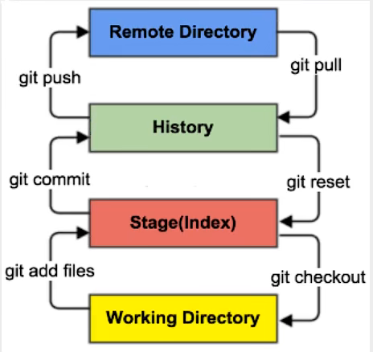
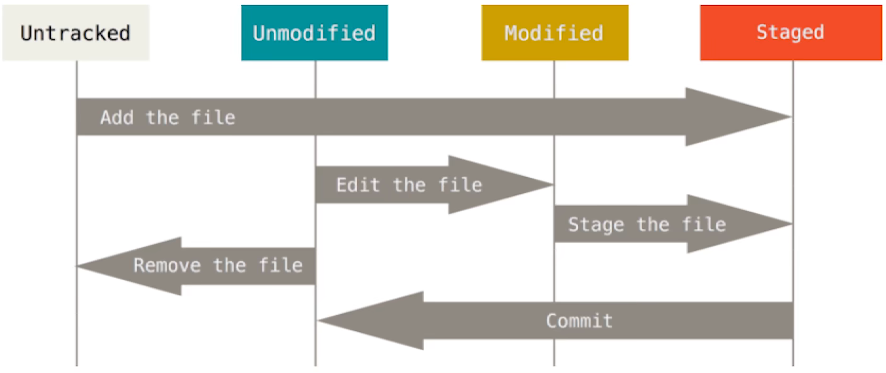

<center><b><font size=12 face="黑体">Git学习笔记</font></b><center>

# Git

***

## 1. Git简介

- 免费的、开源的、**分布式**版本控制系统*(everything-is-local)*

- 版本控制

  - *What*

    > 记录文件内容变化/**修改记录**，以便查阅特定版本

  - *Why*

    > 从个人开发过渡到**团队协作**

  - 版本控制工具

    - **集中式**

      - 常见版本控制系统：CVS、SVN、VSS...

      - 需要**中央服务器**；管理员可以轻松掌控权限；致命缺点——单点故障

    - **分布式**

      - 常见版本控制系统：Git、Mercurial、Bazaar、Darcs...

      - 优点

        > 服务器断网也可以开发，因为**版本控制**是在**本地**进行的；
        
        > 每个客户端保存的都是**完整**的项目（包含**历史记录**的）

- 简史

  > Linux系统开源后，都是由原作者*(Linus)*手动合并其他人的代码；
  
  > 十年后，BitMover公司授权Linux社区免费使用BitKeeper（但要求不能破解）；
  
  > BitMover公司发现BitKeeper被破解，收回了Linux社区的使用权；
  
  > Linus自己用C语言开发了一个分布式版本控制系统——Git*（林大神只用两周就开发完了）*；
  
  > 三年后，GitHub上线

- 工作机制

  - 工作区：代码在磁盘中存放的位置；写代码的地方
  - 暂存区：临时存储代码的地方
  - 本地库：生成历史版本的地方；无法再删除
  
  ```mermaid
  graph BT
  A["工作区"]--"git add"-->B["暂存区"]--"git commit"-->C["本地库"]
  ```
  
  
  
- 代码托管中心

  > 基于网络服务器的远程代码仓库，简称为**远程库**

  ```mermaid
  graph BT
  A["工作区"]--"git add"-->B["暂存区"]--"git commit"-->C["本地库"]
  C--"push"-->D["远程库"]
  ```

  

  

  - 互联网
  
    > GitHub
    >
    > Gitee

  - 局域网
  
    > GitLab

***

## 2. Git安装

> （无脑下一步）

***

## 3. Git常用命令

### 1. 设置用户签名

-  git config --global user.name *用户名*

   > 设置用户签名（不设置的话提交时会报错）

- git config --global user.email *邮箱*

  > 设置邮箱

### 2. 初始化本地库

- git init

  > 在项目文件夹中右键进入Git Bash,再输入此命令
  
  > 会生成一个.git隐藏文件夹

### 3. 查看本地库状态

- git status

  > 会输出三行日志:
  >
  > ```git bash
  > On branch main
  > No commits yet
  > nothing to commit (create/copy files and use "git add" to track)
  > ```
  >
  > > 本地库当前所在分支
  >
  > > 提交记录
  >
  > > 需要提交的内容(可以检测到未追踪的文件,文件名为红色)

### 4. 添加至暂存区/从暂存区删除

- git add *文件名*

  > 会弹出换行符转换的警告
  >
  > ```git bash
  > warning: LF will be replaced by CRLF in hello.txt.
  > The file will have its original line endings in your working directory
  > ```
  
  > 未追踪的文件添加后,再查看status,文件名为绿色
  
  > 有两类文件需要git add：
  >
  > - 工作区新建的，未跟踪，untracked
  > - 工作区修改了的，未暂存，unstaged
  >
  > 但在IDEA中，第二种情况往往会自动add
  
  >`git add .`可以add所有文件
  
- git rm --cached 文件名

  > 只是将文件从暂存区中移除,工作区的文件还在
  
  > `git reset 文件名`也有同样的效果




### 5. 提交至本地库

- git commit -m "*日志信息*" *文件名*

  > 日志信息必需写；
  >
  > git commit默认会提交所有add后的文件
  
  > 提示信息:
  >
  > ```git bash
  > The file will have its original line endings in your working directory
  > [main (root-commit) 68aeddf] fitst  //68aeddf是版本号
  > 1 file changed, 16 insertions(+)
  > create mode 100644 hello.txt
  > ```
  >
  > 通过`git log`可以查看完整提交日志，每一个commit都有一个hash值，相当于身份证
  
  > 提交后再查看status
  >
  > ```git bash
  > On branch main
  > nothing to commit, working tree clean
  > ```

### 6. 提交后修改文件

- 修改的文件会有*modified*标识

  ```git bash
  $ git status
  On branch main
  Changes not staged for commit:
    (use "git add <file>..." to update what will be committed)
    (use "git restore <file>..." to discard changes in working directory)
          modified:   hello.txt
  no changes added to commit (use "git add" and/or "git commit -a")
  ```

- 用与之前相同的命令再次提交

  ```git bash
  $ git commit -m "second commit" hello.txt
  warning: LF will be replaced by CRLF in hello.txt.
  The file will have its original line endings in your working directory
  [main 41bfe50] second commit
   1 file changed, 1 insertion(+), 1 deletion(-) //git是按行管理文件的
  ```

### 7. 历史版本

1. 查看历史版本
    - git reflog : 查看版本信息 
    - git log : 查看版本详细信息
2. 版本穿梭
    - git reset --hard *版本号*
    - 通过.git文件夹中的文件查看版本 : .git/refs/heads/xxx
    - 既可以向前穿越,也可以向后穿越

> 

***

## 4. Git分支

### *What*

  > 在版本控制过程中,为了同时推进多个任务,就可以为每个任务创建单独的分支

  > 底层是指针的引用

### *Why*

> 并行推进多个功能的开发,提高开发效率

> 一个分支开发失败,不会对其他分支产生影响

### 分支的操作

#### 1. 查看分支

- git branch -v

#### 2. 创建分支

- git branch *分支名*

  > 其实后面还有一个参数，是*模板* ，默认是继承当前分支

#### 3. 切换分支

- git checkout *分支名*

#### 4. 修改分支

- 切换到对应分支后按之前的方法修改文件即可

#### 5. 合并分支

- git merge *分支名*

- 冲突合并

  - *when*

    > 两个分支在同一个文件的同一个位置有两种不同的修改,必须人为决定合并后代码的内容
    >
    > ```git bash
    > Auto-merging hello.txt
    > CONFLICT (content): Merge conflict in hello.txt
    > Automatic merge failed; fix conflicts and then commit the result.
    > ```
  
    > 此时的status
    >
    > ```git bash
    > On branch main
    > You have unmerged paths.
    >   (fix conflicts and run "git commit")
    >   (use "git merge --abort" to abort the merge)
    > Unmerged paths:
    >   (use "git add <file>..." to mark resolution)
    >         both modified:   hello.txt
    > no changes added to commit (use "git add" and/or "git commit -a")
    > ```

  - *how*

    > 手动修改文件;文件中会新增如下格式的内容
    >
    > ```text
    > <<<<<<< HEAD
    > Hello Git ! Hello Gay ! master test
    > Hello Git ! Hello Gay !
    > =======
    > Hello Git ! Hello Gay !
    > Hello Git ! Hello Gay ! hot-fix test
    > >>>>>>> hot-fix
    > ```
    
    > 修改并保存后,还要**添加至暂存区并提交**
    >
    > ```git bash
    > git add xxx.xxx
    > git commit -m "merge..." //注意这里最后不要写文件名
    > ```
    

#### 6. 变基分支

- git rebase 新基分支

  > 如果相对于新基，当前分支有多次commit，就需要连续变基，git rebase --continue

> 变基中也有冲突，也需要merge，与git merge类似

***

## 5. IDEA集成Git

### 1. 配置Git忽略文件

- *Why*

  > 有些文件与项目的实际功能无关，不参与服务器上部署运行。把它们忽略掉能**屏蔽IDE工具之间的差异**

- *How*

  - 创建忽略规则文件*xxx.ignore*(前缀名建议起为*git*，后缀名必须是*.ignore*)

  - 为了便于让*~/.gitconfig*文件引用，建议放在用户家目录下

  - 在.gitconfig文件中，引用git.ignore

    ```.gitconfig
    [core]
    	excludesfile = C:/Users/不怕晒的铃铛/git.ignore
    # 注意：一定要使用正斜线而不是反斜线	
    ```

  - 注意：新版IDEA要安装.ignore插件，重启，按下图方式打开ignore文件

    

    勾选User templates和下面的Java，就会自动生成需要忽略的文件了，然后Generate

    最后也可以手动操作生成的.gitignore文件（记得忽略.gitinore文件自己）

### 2. 在IDE中定位Git程序

- File-->Settings-->Version Control（这里最好使用cmd中的git.exe）

### 3. 初始化本地库

- VCS-->Greate Git Repository
- 在IDEA中最好手动关闭新版的Git自动提交功能（关闭后要重启一下）
- 遇到问题了可以删除.git文件夹重新创建repository

### 4. 提交至本地库

- 右击文件（或文件夹），选择Git-->Add/Commit

### 5. 版本控制

- 左下角Git-->Log
- 黄色和绿色的指针
- 切换版本：右键要切换到的版本，Chekout即可

### 6. 使用分支

- #### 创建分支
  
  - 右击项目文件夹Git-->Branches-->New Branch
  - 或在右下角点击当前分支，New Branch
- #### 切换分支
  
  - 在右下角点击当前分支，点击LocalBranches里要切换到的分支，再Checkout
- #### 合并分支
  
  - 正常合并
    - 切换到要合并到的分支
    - 同样在右下角，Merge Selected into Current
  - 冲突合并
    - 代码发生冲突，合并时会弹出Conficts对话框
    - 点击Merge，会弹出一个新的对话框
    - 左侧是当前所在分支，右侧是被合并过来的分支，中间是没有冲突部分的代码
    - ×是删除代码，>>或<<是使用这些代码
    - Apply之后，Merge成功，会自动提交到本地库

***

# Github

***

## 1. 创建远程库

- 进入GitHub账号页面，点击右上角 + , New repository
- 远程库的名字一般和本地库相同
- 三个初始化先不勾选
- 有HTTPS和SSH两种协议的网址

***

## 2. 远程库操作

### 1. 给远程库起别名

- 查看当前所有远程库别名: git remote -v

- 新建远程库别名: git remote add *别名* *网址*

  > 一个远程库对应两个别名,一个用于推送,另一个用于拉取
  >
  > ```git bash
  > git-demo      https://github.com/StupidBell/git-demo.git (fetch)
  > git-demo      https://github.com/StupidBell/git-demo.git (push)
  > ```

### 2. 从本地库向远程库推送

- git push *别名* *远程库分支名*

> 默认是提交本地库**当前所在分支**；
>
> 如果远程库存在同名分支，会自动在远程库**创建同名分支**并提交到同名分支
>
> > 前提是已经get remote配置了远程库，这样会自动设置上流分支

> 所以说，可以将本地库的dev分支提交到远程库的main分支，就是这种操作比较脑瘫；
>
> 还是尽量保证本地库分支与远程库分支的一致性

### 3. 从远程库向本地库拉取

- git pull *别名* *远程库分支名*

  > 在pull其他分支的时候，需要在本地库创建好一个同名的分支，不会像push到远程库那样自动在远程库创建同名分支并提交到同名分支

  > 如果不指定远程库分支名，就会默认找**同名**的

  > 也可以不保持同名，就是这样显得很有病

- 拉取动作会自动提交至本地库(拉取也不需要网络凭据)

- pull  = fetch + merge

  > fetch只是获知远程仓库的分支信息，并不是真正的本地分支；此时也可以直接check out，会在本地以远程库分支为模板在本地创建一个新的分支

### 4. 克隆远程仓库到本地

- 在对应的本地库上进行*git bash*
- git clone *网址*
- 克隆是不需要登录GitHub账号的
- 克隆自动完成的三件事: 拉取代码, 初始化本地库, 创建别名(默认为*origin*)

> 注：clone只会克隆远程库的主分支

### 5. 团队内协作

- 按之前的方式修改后, 需要push,此时就需要登录账号了

- 若没有加入团队,则没有权限push

  ```git bash
  info: please complete authentication in your browser...
  remote: Permission to StupidBell/git-demo.git denied to GoofyBell
  .
  fatal: unable to access 'https://github.com/StupidBell/git-demo.g
  it/': The requested URL returned error: 403
  ```

- 添加团队成员

  - 进入repository, settings
  - Manager access, 添加成员, 复制邀请函(也是一个网址)
  - 被添加的成员用自己的GitHub账号打开邀请函, 接受邀请

### 6. 跨团队协作

- 搜索项目

  - GitHub左上角
  - 搜索时可以加上用户名: 用户名/项目名
  - 也可以在登录GitHub账号后,直接打开项目连接

- *Fork*

  - 先将项目fork到自己的远程库

- *Pull requests*

  - 修改方

    > New pull request
    
    > Create pull request
    
    > 备注一些信息, 再Create pull request
    
  - 项目拥有者
  
    > 从Pull requests中查看
    
    > 也可以回复一个评论
    >
    > Merge pull rerquest, Confirm merge 

>pull request是远程库分支间的操作，与本地库没什么关系
>
>相当于是想让另一个团队远程库的分支pull自己远程库的分支

***

## 3. SSH免密登录

- 进入电脑用户目录, *git bash here*
- 生成SSH文件: ssh-keygen -t rsa -C *描述*
- 再敲三次回车
- 复制公钥: id_rsa.pub
  - 进入项目拥有者GitHub账号
  - settings, SSH and GPG keys 
  - New SSH key, Add SSH key
- 进入Repository, 点击中间偏右的Code, 查看SSH网址
- 用SSH网址代替之前的HTTPS网址即可

***

## 6、IDEA集成Github

### 1. 在IDEA中设置GitHub账号

- File-->Settings-->Version Control-->GitHub插件
- 点击"+"，登录即可
- 账号密码登录失败的话可以使用Token
  - 在GitHub界面的右上角进入Settings
  - Developer settings --> Personal access tokens
  - Generate一个Token，在Node中输入名字，下面的权限都勾选上

### 2. 分享项目到GitHub

- IDEA中，点击VCS（Git）
- GitHub-->Share Project on GitHub
- 设置远程库名、别名（建议和项目名相同），Description可填可不填

### 3. 远程库相关操作

- #### *Push*

  - 右击项目文件夹，Git-->Repository-->Push

  - VCS(Git)-->Push

  - 默认使用项目别名去连接，即默认使用HTTPS网址

  - 也可以利用SSH

    - 到GitHub界面复制SSH链接
    - 点击别名-->Define remote
    - 然后再点击别名，就可以切换到SSH链接了

  - 如果本地库的版本比远程库的低，Push操作会被拒绝

    > 因此一个成熟的程序员在修改本地库代码前，一定会先检查一下远程库与本地库的区别

- #### *Pull*

  - 与Push操作在同一个位置
  - 选择要合并的分支
  - Pull也会有自动合并，也可能带来冲突

- #### *Clone*

  - 在IDEA的初始化页面就可以Get from VCS
    - 可以使用链接，也可以使用GitHub账号
  - 可能还需要手动配置一下忽略文件

***

# Gitee

***

## 1. 码云创建远程库

1. 注册码云账号并登录（大部分操作和GitHub都相同）
2. 右上角"+"，新建仓库

***

## 2. IDEA集成码云

1. 在IDEA中安装码云插件（安装后重启）
2. 然后在Version Control里就有Gitee了
3. 在IDEA中登录Gitee账号，其他操作都与GitHub的相同

***

## 3. 码云连接Github

1. 在码云上新建仓库

2. 选择导入仓库，输入GitHub中仓库的HTTPS网址

3. 更新：点击箭头圆圈即可

   

***

# GitLab

***

## 1. GitLab简介

- 乌克兰程序员用Ruby语言开发；后来一部分用Go语言重写
- 使用Git作为代码管理工具
- 官网地址：about.gitlag.com

## 2. GitLab安装

- 进入官网，安装Gitlab（about.gitlag.com/install）

- 服务器准备（可以用虚拟机）

  ..........................................................（这部分等学完Linux有机会再补充吧）


