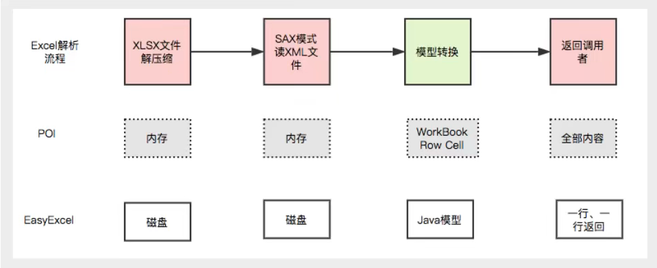

# POI_EasyExcel


#### (一) 初识POI和EasyExcel

- POI

  - Apache：https://poi.apache.org/

  - 函数库，提供API让Java程序操作Office

  - 基本功能

    - HSSF：读写03版的xls

      > 最多就65536行

    - XSSF：读写07版的xlsx

  - 原生的，会比较麻烦

- EasyExcel

  - 官网：https://github.com/alibaba/easyexcel
  - Java解析Excel工具
  - 不会出现溢出



#### (二) POI写

- 依赖

  ```xml
  <!--xls(03)-->
  <dependency>
    <groupId>org.apache.poi</groupId>
    <artifactId>poi</artifactId>
    <version>3.9</version>
  </dependency>
  <!--xlsx(07)-->
  <dependency>
    <groupId>org.apache.poi</groupId>
    <artifactId>poi-ooxml</artifactId>
    <version>3.9</version>
  </dependency>
  ```

- 常见对象

  - 工作簿（workbook）
  - 工作表（sheet）
  - 行（row）
  - 列（column）
  - 单元格（cell）

- 基本**写**操作

  ```java
  String path = "D:\\Java\\JavaProjects\\kuang-poi\\";
  @Test
  public void testWrite() throws Exception {
    // 1、创建工作簿
    Workbook workbook = new HSSFWorkbook();
    // 2、创建工作表
    Sheet sheet = workbook.createSheet("测试表");
    // 3、创建一个行
    Row row1 = sheet.createRow(0);// 0代表第一行
    // 4、创建单元格
    Cell cell1 = row1.createCell(0);// 与row1一起确定了(1, 1)这个格子
    cell1.setCellValue("测试值");
    Cell cell2 = row1.createCell(1);
    cell2.setCellValue(
      new DateTime().toString("yyyy-MM-dd HH:mm:ss SSS"));// 使用了joda-time
    // 5、生成一张表（IO流）
    FileOutputStream fileOutputStream = 
      new FileOutputStream(path + "test.xls");
    workbook.write(fileOutputStream);
    fileOutputStream.close();
  }
  ```

  > 以03为例，07的只需要将***HSSF***换成***XSSF***，并更换文件**后缀名**

- 大数据量导入

  - HSSF

    - 缺点：最多只能处理**65536**行，否则抛出异常

      > `IllegalArgumentException`

    - 优点：过程中写入缓存，不操作磁盘，最后一次性写入磁盘，速度**快**

  - XSSF

    - 缺点：写数据时**慢**，耗内存，数据太多也会溢出

      > 可以用**缓存**去优化；
      >
      > 也可以使用SXSSF对象替代，需要调用`workbook.dispose()`清除临时文件

    - 优点：可以写**较大数据量**

#### (三) POI读

- 基本读操作

  ```java
  String path = "D:\\Java\\JavaProjects\\kuang-poi\\";
  @Test
  public void testRead() throws Exception{
    // 1、获取文件流
    FileInputStream fileInputStream = new FileInputStream(path + "狂神观众统计表03.xls");
    // 2、放入工作簿
    Workbook workbook = new HSSFWorkbook(fileInputStream);
    // 3、获得行、列、单元格对象
    Sheet sheet = workbook.getSheetAt(0);
    Row row = sheet.getRow(0);
    Cell cell = row.getCell(1);
    // 4、读取单元格数据
    //System.out.println(cell.getStringCellValue());
    System.out.println(cell.getNumericCellValue());
  }
  ```

  > 注：单元格中**不同类型的数据**需要通过**不同方法**去获取

  > 07的也是一样读取

- :star:读取不同类型的数据

  ```java
  @Test
  public void testReadType() throws Exception {
    // 创建文件流，获取工作表
    FileInputStream fileInputStream = new FileInputStream(path + "会员消费商品明细表.xls");
    Workbook workbook = new HSSFWorkbook(fileInputStream);
    Sheet sheet = workbook.getSheetAt(0);
    // 读取标题
    Row rowTitle = sheet.getRow(0);
    if (rowTitle != null) {
      // 读取行的标准写法，要掌握
      int cellCount = rowTitle.getPhysicalNumberOfCells();
      for (int cellNum = 0; cellNum < cellCount; cellNum++) {
        Cell cell = rowTitle.getCell(cellNum);
        if (cell != null) {
          int cellType = cell.getCellType();
          String cellValue = cell.getStringCellValue();
        }
      }
    }
    // 读取表内容
    int rowCount = sheet.getPhysicalNumberOfRows();
    for (int rowNum = 1; rowNum < rowCount; rowNum++) {
      Row rowData = sheet.getRow(rowNum);
      if (rowData != null) {
        int cellCount = rowData.getPhysicalNumberOfCells();
        for (int cellNum = 0; cellNum < cellCount; cellNum++) {
          Cell cell = rowData.getCell(cellNum);
          if (cell != null) {
            // 按类型读取数据
            int cellType = cell.getCellType();
            String cellValue = "";
            switch (cellType) {
              case Cell.CELL_TYPE_STRING:
                System.out.print("【String】");
                cellValue = cell.getStringCellValue();
                break;
              case Cell.CELL_TYPE_BOOLEAN:
                System.out.print("【Boolean】");
                cellValue = String.valueOf(cell.getBooleanCellValue());
                break;
              case Cell.CELL_TYPE_BLANK:
                System.out.print("【BLANK】");
                break;
              case Cell.CELL_TYPE_NUMERIC:
                // 在NUMERIC中要区分日期和数字
                if (HSSFDateUtil.isCellDateFormatted(cell)) {
                  System.out.print("【DATE】");
                  Date date = cell.getDateCellValue();
                  cellValue = new DateTime(date).toString("yyyy-MM-dd HH:mm:ss SSS");
                } else {
                  // 防止数字过长，需要将cell类型转换成string
                  System.out.print("【NUMBER】");
                  cell.setCellType(Cell.CELL_TYPE_STRING);
                  cellValue = cell.toString();
                }
                break;
              case Cell.CELL_TYPE_ERROR:
                System.out.print("【ERROR】");
                break;
            }
            System.out.println(cellValue);
          }
        }
      }
    }
    fileInputStream.close();
  }
  ```

- 读取计算公式

  ```java
  @Test
  public void testFormula() throws Exception {
    FileInputStream inputStream = new FileInputStream(path + "计算公式.xls");
    Workbook workbook = new HSSFWorkbook(inputStream);
    Sheet sheet = workbook.getSheetAt(0);
    Row row = sheet.getRow(4);
    Cell cell = row.getCell(0);
    FormulaEvaluator formulaEvaluator = new HSSFFormulaEvaluator((HSSFWorkbook) workbook);
    int cellType = cell.getCellType();
    switch (cellType) {
      case Cell.CELL_TYPE_FORMULA:
        String formula = cell.getCellFormula();
        CellValue evaluate = formulaEvaluator.evaluate(cell);
        String cellValue = evaluate.formatAsString();
        System.out.println(cellValue);
        break;
    }
  }
  ```

#### (四) EasyExcel

- 依赖

  ```xml
  <dependency>
    <groupId>com.alibaba</groupId>
    <artifactId>easyexcel</artifactId>
    <version>2.1.7</version>
  </dependency>
  <dependency>
    <groupId>org.projectlombok</groupId>
    <artifactId>lombok</artifactId>
    <version>1.18.12</version>
  </dependency>
  <dependency>
    <groupId>com.alibaba</groupId>
    <artifactId>fastjson</artifactId>
    <version>1.2.62</version>
  </dependency>
  ```

- 写

  - 实体类对象
  - List封闭数据
  - 写

  > 详见官方文档

- 读

  - 实体类对象
  - 监听器
  - 读
    - 核心方法：invoke
    - DemoData 类型
    - Analysis 分析上下文


