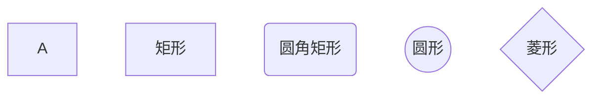
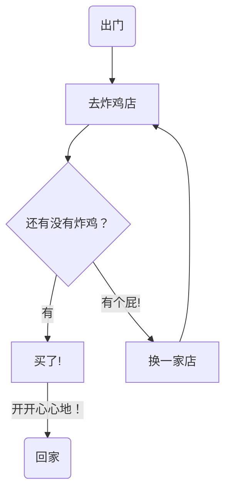
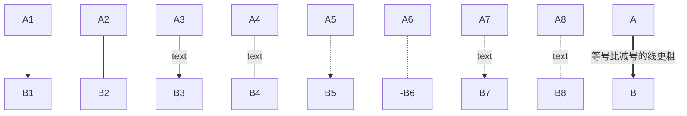
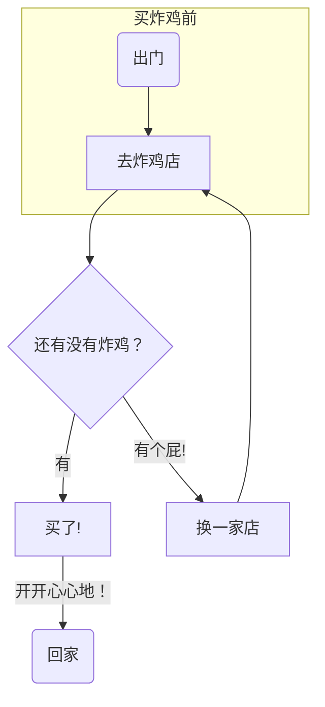
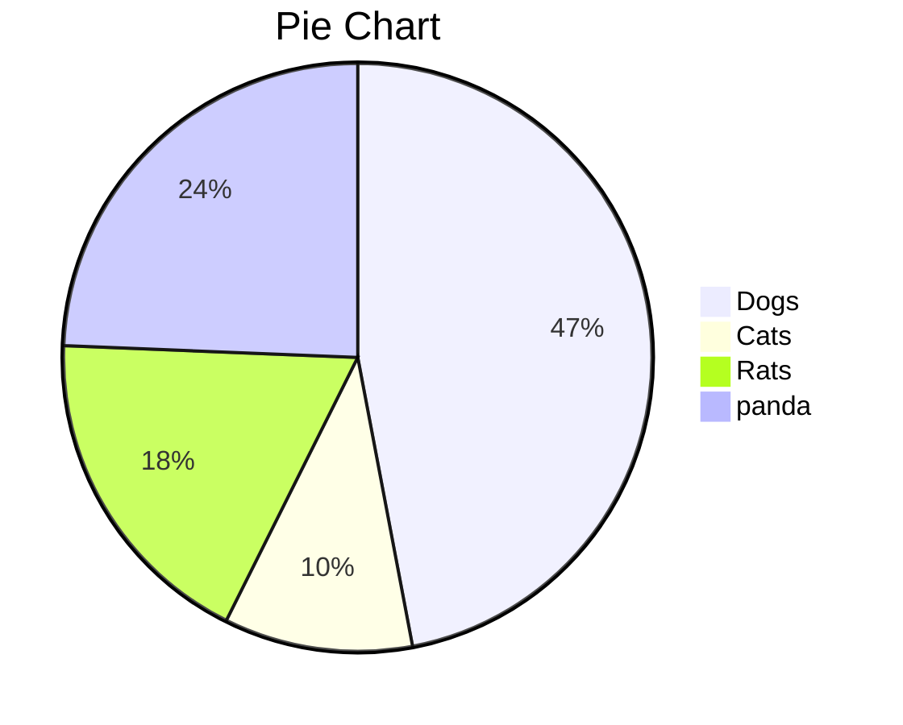

# Markdown快速入门

[toc]

## 代码块

```java
//代码块语法
// ```java 回车 
package com.example.apple;
public class Apple {
    //TODO
}
```


```shell
//Linux下springBoot的启动命令
# java -jar blog start
```

## 标题

```java
# 一级标题
## 二级标题
### 三级标题
Typora 快捷键：Ctrl + 1/2/3/4/5/... (注意是上面的数字按键)
```

## 字体

```java
//加粗
**加粗**
Typora 快捷键：Ctrl + B
//斜体
*斜体*
_斜体_    
Typora 快捷键：Ctrl + I
//高亮
==高亮==
//删除线
~~删除~~
Typora 快捷键：Alt + Shift + 5        
//下划线
Typora 快捷键：Ctrl + U
/**可嵌套使用**/
```

==高亮==

## 引用

```java
>一级引用
>>二级引用
>>>三级引用
(在空引用时按回车结束引用)    
```

>一级引用
>>二级引用
>>
>>>三级引用

## 分割线

```java
//分割线1
---
//分割线2
***    
```

---

***

## 图片插入

```java
//在线图片/本地图片

```


## 超链接

```java
[超链接名称](地址)
按Ctrl + 鼠标左键访问
```


[zxr的网站](https://i.loli.net/2021/08/15/6CThXjkR4KBQoqe.png)

## 列表

```java
//无序列表
- 目录1
+ 目录2  
* 目录3    
(-/+/*后面再按一个空格)    
//有序列表
1. 标题名称    
(.后面再按一个空格) 
//任务列表
- [ ] 
- [ ] 任务
(一个空格不能少)
```

- [ ] 这是一个没完成的任务

- [x] 这是一个完成了的任务

## 表格

```java
Typora 快捷键：Ctrl + T
```

| 员工编号 |      |      |
| -------- | ---- | ---- |
|          |      |      |
|          |      |      |
|          |      |      |

## 其他Typora快捷键

1. Ctrl + / ：查看源码
2. Ctrl + Shift + 1 ：查看大纲

## 补充

```java
自动生成目录：[toc] + enter
表情：:表情名:(英文冒号)  
上标：^上标^
下标：~下标~
字体颜色和大小：<font size = 4 color = "red">地主家的傻儿子</font>（3是默认大小）
文档内标题跳转[名称](#标题名)    
脚注：[^name]  ...  [^name]:
退出代码块进入下一行：Ctrl + Enter
居中:<p align = "center">text</p>
```

<font size = 4 color = "red">地主家的傻儿子</font>

[列表](##列表)

[引用](##引用)

一段标有脚注的内容[^name]

<p align = "center">text</p>

## 作图

### 流程图

#### 1、节点形状



#### 2、流程线

##### 1、简单示例



##### 2、流程线总结



#### 3、子图



### 序列图

- 还没学，之后再说

### 饼图



### 甘特图

- 不会，没学

***

***

## 数学公式块

***

### 插入公式

- 行内

在行内：$y=ax+b$

- 占一整行

  $$ y=ax+b $$

***

### 上下标

- $x^{2}$
- $x_{i}$

***

### 括号和分隔符

- 可以直接输入的

  $(12)[fd]|11$

- 不能直接输入的

  $\langle2, 3\rangle$

  $max\{a, b\}$

***

### 分数

$\frac{x+1}{y*\frac{4}{3}}$

***

### 开方

$\sqrt[100]{6}$

***

### 向量和箭头

$\vec{x}$

$\overleftarrow{x}$

$\rightarrow$

$\leftrightarrow$

$\uparrow$

$\updownarrow$

$\Leftarrow{x}$

$\Leftrightarrow$

$\Downarrow$

$\Updownarrow$

***

### 积分、累加累乘

- 积分

  $\int_{0}^{\infty}\frac{1}{n^{2}}dn$

- 累加

  $\sum_{i=1}^{10}x_{i}$

- 累乘

  $\prod_{i=1}^n3n$

***

### 希腊字母

$\alpha\beta\gamma$

$\Alpha\Beta\Gamma$

$\delta\Delta\epsilon\Epsilon\zeta\Zeta$

$\eta\Eta\theta\Theta\kappa\Kappa$

$\lambda\Lambda\mu\Mu\nu\Nu$

$\xi\Xi oO\pi\Pi$

$\rho\Rho\sigma\Sigma\tau\Tau$

$\phi\Phi\chi\Chi\psi\Psi\omega\Omega$


### 关系运算

$\pm \times \div \mid \circ \leq \geq \lt \gt$

$\odot\otimes\oplus\bigodot\bigotimes\bigoplus$

### 集合运算

$\emptyset \in \notin \subset \supset \subseteq \wedge \bigcup \bigcap$

### 对数运算

$log_{2}4 lg ln$

### 积分运算

$\int \iint \iiint$

### 逻辑运算

$\because\ \ \ \ \ \therefore$

$\forall \exist$

### 戴帽运算

$\bar{y}$

### 矩阵

$\left\{\begin{matrix}1&2&3\\4&5&6\\7&8&9\end{matrix}\right\}$

$\begin{cases} 0  \\ 1 \end{cases}$

### 对齐

$~~~空格~~~$


[^name]:啥也没有


