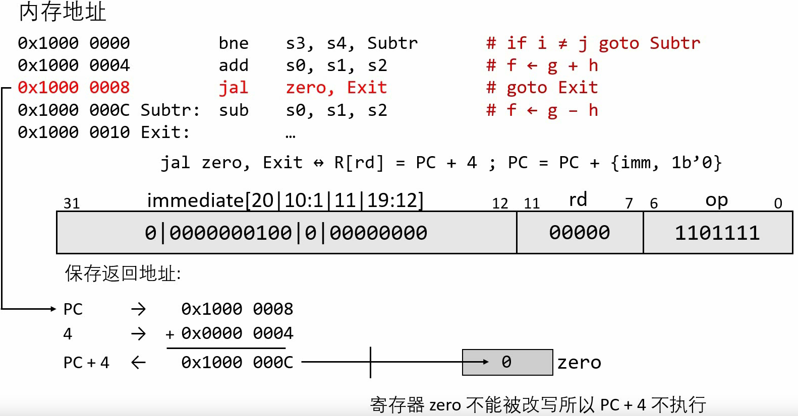
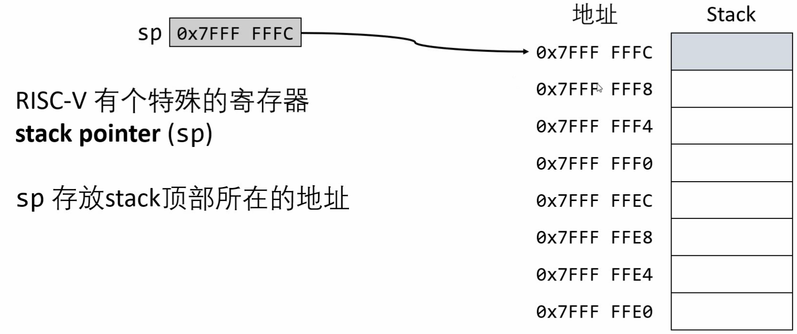

# 汇编语言入门

#### (一) 指令Type

##### 1、R-Type指令

- 举例理解指令格式：

  

  > 

##### 2、I-Type指令

- 举例理解指令格式：

  

- 拓展：

  

##### 3、S-Type指令

举例理解指令格式：

##### 4、SB-Type指令

举例理解指令格式：

> 用12位的imm表示13位的偏移量，因为最后一位一定是0（任意指令的地址最后一位一定是0）；
>
> 偏移量的单位是2byte，half word

##### 5、U-Type指令

> 应用：
>
> 

##### 6、UJ-Type指令

#### (二) 指令总结

##### 1、算术运算

| Instruction         | Description                                                  |
| ------------------- | ------------------------------------------------------------ |
| `add t1, t2, t3`    | Addition: set t1 to (t2 plus t3)                             |
| `addi t1, t2, -100` | Addition immediate: set t1 to (t2 plus signed 12-bit immediate) |
| `sub t1, t2, t3`    | Subtraction: set t1 to (t2 minus t3)                         |
| `mul t1, t2, t3`    | Multiplication: set t1 to the lower 32 bits of t2*t3         |
| `div t1,t2,t3`      | Division: set t1 to the result of t2/t3                      |

> 注：减去立即数的操作可以用<u>addi加上负立即数实现</u>

##### 2、逻辑运算

| Instruction       | Description                                                  |
| ----------------- | ------------------------------------------------------------ |
| `and t1,t2,t3`    | Bitwise AND : Set t1 to bitwise AND of t2 and t3             |
| `or t1,t2,t3`     | Bitwise OR : Set t1 to bitwise OR of t2 and t3               |
| `xor t1,t2,t3`    | Bitwise XOR : Set t1 to bitwise XOR of t2 and t3             |
| `andi t1,t2,-100` | Bitwise AND immediate:  Set t1 to bitwise AND of t2 and sign-extended 12-bit immediate |
| `ori t1,t2,-100`  | Bitwise OR immediate :  Set t1 to bitwise OR of t2 and sign-extended 12-bit immediate |
| `xori t1,t2,-100` | Bitwise XOR immediate : Set t1 to bitwise XOR of t2 and sign-extended 12-bit immediate |

##### 3、移位操作

| Instruction     | Description                                                  |
| --------------- | ------------------------------------------------------------ |
| `sll t1,t2,t3`  | Shift left logical:  Set t1 to result of shifting t2 left by number of bits  specified by value in low-order 5 bits of t3 |
| `srl t1,t2,t3`  | Shift right logical:  Set t1 to result of shifting t2 right by number of bits  specified by value in low-order 5 bits of t3 |
| `sra t1,t2,t3`  | Shift right arithmetic:  Set t1 to result of sign-extended shifting t2 right by number of bits  specified by value in low-order 5 bits of t3 |
| `slli t1,t2,33` | Shift left logical :  Set t1 to result of shifting t2 left by number of bits  specified by immediate |
| `srli t1,t2,33` | Shift right logical :  Set t1 to result of shifting t2 right by number of bits  specified by immediate |
| `srai t1,t2,33` | Shift right arithmetic :  Set t1 to result of sign-extended shifting t2 right by number of bits  specified by immediate |

> 注：补码的算术左移与逻辑左移完全相同

##### 4、数据传输

| Instruction        | Description                                                  |
| ------------------ | ------------------------------------------------------------ |
| `lb t1, -100(t2)`  | Set t1 to sign-extended 8-bit value  from effective memory **byte address** |
| `sb t1, -100(t2)`  | Store byte :  Store the low-order 8 bits of t1  into the effective memory **byte address** |
| `lbu t1, -100(t2)` | Set t1 to zero-extended 8-bit value  from effective memory **byte address** |
| `lh t1, -100(t2)`  | Set t1 to sign-extended 16-bit value  from effective memory **halfword address** |
| `sh t1, -100(t2)`  | Store halfword :  Store the low-order 16 bits of t1  into the effective memory **halfword address** |
| `lhu t1, -100(t2)` | Set t1 to zero-extended 16-bit value  from effective memory **halfword address** |
| `lw t1, -100(t2)`  | Set t1 to contents of effective memory **word address**      |
| `sw t1, -100(t2)`  | Store word : Store contents of t1 into effective memory **word address** |
| `lwu t1, -100(t2)` | Set t1 to contents of effective memory **word address**  without sign-extension |
| `ld t1, -100(t2)`  | Set t1 to contents of effective memory **double word address** |
| `sd t1, -100(t2)`  | Store double word :  Store contents of t1 into effective memory **double word address** |
| `lui t1,100000`    | Load upper immediate: set t1 to 20-bit followed by 12 0s     |

> 注：1word = 4byte；
>
> 取寄存器中数据的语法：`高位偏移字节数(寄存器名)`

##### 5、比较指令

| Instruction        | Description                                                  |
| ------------------ | ------------------------------------------------------------ |
| `slt t1,t2,t3`     | Set less than : If t2 is less than t3, then set t1 to 1 else set t1 to 0 |
| `slti t1,t2,-100`  | Set less than immediate :  If t2 is less than sign-extended 12-bit immediate,  then set t1 to 1 else set t1 to 0 |
| `sltu t1,t2,t3`    | Set less than :  If t2 is less than t3 using unsigned comparision,  then set t1 to 1 else set t1 to 0 |
| `sltiu t1,t2,-100` | Set less than immediate unsigned :  If t2 is less than sign-extended 16-bit immediate  using unsigned comparison,  then set t1 to 1 else set t1 to 0 |

##### 6、条件分支

| Instruction        | Description                                                  |
| ------------------ | ------------------------------------------------------------ |
| `beq t1,t2,label`  | Branch if equal :  Branch to statement at label's address if t1 and t2 are equal |
| `bne t1,t2,label`  | Branch if not equal :  Branch to statement at label's address if t1 and t2 are not equal |
| `blt t1,t2,label`  | Branch if less than:  Branch to statement at label's address if t1 is less than t2 |
| `bge t1,t2,label`  | Branch if greater than or equal:  Branch to statement at label's address  if t1 is greater than or equal to t2 |
| `bltu t1,t2,label` | Branch if less than (unsigned):  Branch to statement at label's address  if t1 is less than t2 (with an unsigned interpretation) |
| `bgeu t1,t2,label` | Branch if greater than or equal to (unsigned):  Branch to statement at label's address  if t1 is greater than or equal to t2 (with an unsigned interpretation) |

##### 7、无条件跳转

| Instruction         | Description                                                  |
| ------------------- | ------------------------------------------------------------ |
| `jal t1, target`    | Jump and link :  Set t1 to Program Counter (return address)  then jump to statement at target address |
| `jalr t1, t2, -100` | Jump and link register:  Set t1 to Program Counter (return address)  then jump to statement at t2 + immediate |

#### (三) 调用

##### 1、caller与callee

调用与被调用

返回地址：callee必须正确的回到caller的返回地址

步骤：

1. 保存函数参数
2. 移交控制权
3. 申请存储空间
4. 执行函数功能
5. 存储结果、还原寄存器、释放存储空间
6. 返还控制权

##### 2、ra

- RISC-V中，***ra*寄存器**专门（唯一）用来**存储返回地址**。

  > Return Address

- 但有个问题：<u>ra覆盖</u>

  

##### 3、Stack与StackPointer

> 解决<u>ra覆盖</u>问题的方案

- Stack中的存储内容

  

  > fp代表栈桢

  

- Stack顶部

  RISC-V中，由sp(Stack Pointer)寄存器存放Stack顶部所在位置

  

  > sp也对应x~2~，栈指针寄存器
  >
  > 

- 寄存器存入Stack

  

  

  

> 问题的解决：
>
> 

##### 4、内存

##### 5、调用规范

- 一些问题

  

- s0-s11、sp、gp、tp中的值

  

  > s0-s11是用来**保存**的寄存器；
  >
  > 使用前要先保存好其中的值，要么就不使用

- t0-t6与a0-a7中的值

  

  > t0-t6和a0-a7是**临时**寄存器；
  >
  > 在调用其他函数前，自行保存好

- 用于调用的寄存器

  

- 寄存器使用规范

  

  

##### 6、FramePointer

栈桢的概念：

不使用fp举例：

> 保存寄存器：
>
> 
>
> 但还是有问题：
>
> 
>
> 解决方法就是遵循规范、使用栈
>
> 

示例：

问题：

举例：

##### 7、无嵌套调用与嵌套调用

#### (四) 其他知识点

##### 1、rars的使用

- Help中的手册超级好用
- Edit与Execute

##### 2、zero的作用

##### 数组

要先求==地址公式==：start + 4 * i（只是举例）

> 元素是32bit数字，存储字长是8bit；
>
> 一个word刚好就是4byte，可以直接lw(load word)；
>
> lb就是load byte（这个会做符号扩展，lbu就是零扩展）
>
> > 注意<u>load系列</u>往往用于从寄存器中以字节为最小单位**取数**

