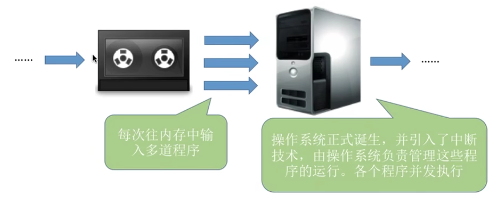

# 操作系统

---

---

## 1 操作系统概述

---

### 1.1 操作系统基本概念

#### 1.1.1 概念（定义）

##### 1.1.1.1 计算机系统层次结构

> <u>用户与操作系统之间</u>也是有直接交互的

- 硬件：如CPU、内存、硬盘、...
- :star:**操作系统**
  - 负责管理<u>协调硬件、软件</u>等计算机资源的工作
  - 为上层的应用程序、用户提供简单易用的<u>服务</u>
  - 操作系统是**系统软件**，而不是硬件
- 应用程序：QQ、Chrome、...

##### 1.1.1.2 操作系统的定义

操作系统（*Operating System*，OS）是指控制和管理整个计算机系统的<u>硬件和软件资源</u>，
并合理地组织调度<u>计算机的工作和资源的分配</u>，

> 从中间向两边看

以提供给用户和其他软件方便的<u>接口和环境</u>的系统软件，

> 从下往上看

它是计算机系统中**最基本的系统软件**。

> 从上往下盾

> 举例：
>
> 

#### 1.1.2 功能和目标

##### 1.1.2.1 作为系统资源的管理者

- **文件**管理

- 存储器管理/**内存**管理

  >进程是一个**程序的执行过程**
  >
  >程序执行前需要将该程序放到内存中，才能被CPU处理

- 处理机(**CPU**)管理

- 设备管理

>目标：安全、高效

> 举例：
>
> 

##### 1.1.2.2 作为用户和计算机硬件之间的接口

>向用户提供服务

- **命令**接口：允许用户<u>直接使用</u>

  - **联机**命令接口/**交互式**命令接口

    > 比如dos窗口，用户说一句，操作系统做一句

  - **脱机**命令接口/**批处理**命令接口

    > 比如.bat文件，用户说一堆，操作系统再做一堆

- **程序**接口：允许用户通过程序<u>间接使用</u>

  由一组**系统调用**组成

  > 程序接口等同于**系统调用**；
  >
  > 比如用户<u>通过程序调用</u>的.dll文件，就是一种程序接口；
  >
  > 程序接口只能通过<u>用户调用程序</u>**间接**使用

  > 系统调用可能还会被称作：广义指令

- GUI：现代操作系统最流行的图形用户接口

  Graphical User Interface

  用户可以使用形象的图形界面进行操作，而不再需要记忆复杂的<u>命令、参数</u>。

> 目标：方便用户使用

##### 1.1.2.3 作为最接近硬件的层次

>实现对硬件机器的扩展
>
>> 封装思想

没有任何软件支持的计算机成为**裸机**。

在裸机上安装的**操作系统**，可以提供资源管理功能和方便用户的服务功能，将裸机改造成功能更强、使用更方便的机器

通常把<u>覆盖了软件</u>的机器成为**扩充机器**，又称之为**虚拟机**

> 目标：扩展能力

----

### 1.2 操作系统基本特征

#### 1.2.1 并发

- 并发的概念

  两个或多个事件在同一时间间隔内发生。
  这些事件宏观上是同时发生的，但微观上可能是交替发生的。

  > 并行：指两个或多个事件在同一时刻同时发生。

- 操作系统的**并发性**

  计算机系统中同时存在着<u>多个运行着的程序</u>。

  一个单核处理机(CPU)同一时刻只能执行一个程序，
  因此操作系统会负责**协调多个程序交替执行**

  > 这些程序微观上是交替执行的，但宏观上看起来就像在同时执行；
  >
  > 事实上，操作系统就是伴随着“多道程序技术”而出现的。
  > 因此，操作系统和程序并发是一起诞生的。

  >当今的计算机，一般都是多核CPU，比如Intel的第八代i3处理器就是4核CPU，这意味着同一时刻可以有4个程序**并行**执行，但是操作系统的**并发性**依然必不可少。当代人使用计算机绝对有4个以上的程序需要同时工作

#### 1.2.2 共享

共享即资源共享，是指系统中的资源可供内存中多个**并发执行的进程**共同使用。

两种资源共享方式：

- **互斥**共享方式

  系统中的某些资源，虽然可以提供给多个进程使用，但一个时间段内只允许一个进程访问该资源

- **同时**共享方式

  系统中的某些资源，允许一个时间段内由多个进程“同时”对它们进行访问

>所谓的“同时”往往是宏观上的，而在微观上，这些进程可能是交替地对该资源进行访问的
>
>> 即分时共享；
>>
>> 当然在某些情况下，微观上也可能是真的同时，比如同时播放音乐

>生活实例：
>互斥共享方式：
>使用QQ和微信视频。同一时间段内摄像头只能分配给其中一个进程。
>同时共享方式：
>使用QQ发送文件A，同时使用微信发送文件B。宏观上看，两边都在同时读取并发送文件<说明两个进程都在访问硬盘资源，从中读取数据。微观上看，两个进程是交替着访问硬盘的。

> :star:并发与共享的关系：
>
> 如果失去并发性，则系统中只有一个进程正在运行，则共享性失去存在的意义
>
> > 永远都是一个进程在运行，没有其他的共享伙伴
>
> 如果失去共享性，则多个进程不能同时访问同一资源，相对来说也就无法并发
>
> > 有点像数据库Serializable那种隔离级别

#### 1.2.3 虚拟

虚拟是指把一个**物理上的实体**变为若干个**逻辑上的对应物**。

物理实体(前者)是实际存在的，而逻辑上对应物(后者)是用户感受到的。

> 举例：虚拟技术
>
> 
>
> 

虚拟技术：

- 空分复用技术

  > 如虚拟存储器技术

- 时分复用技术

  > 如虚拟处理器

>显然，如果失去了并发性，则一个时间段内系统中只需运行一道程序，那么就失去了实现虚拟性的意义了。因此，**没有并发性，就谈不上虚拟性**

#### 1.2.4 异步性

异步是指，在多道程序环境下，<u>允许多个程序并发执行</u>，但由于**资源有限**，进程的执行不是一贯到底的，而是走走停停，<u>以不可预知的速度向前推进</u>，这就是进程的异步性。

>显然，如果失去了并发性，则系统只能串行地处理各个进程，每个进程的执行会一贯到底。**只有系统拥有并发性，才有可能导致异步性。**

> :star:总结：
>
> 

---

### 1.3 操作系统的发展与分类

#### 1.3.1 手工操作阶段

> 还没有出现操作系统

纸带机+计算机：

- 纸带机
  - 用户独占全机
  - 处理速度慢
- 计算机
  - 处理速度快
  - 人机速度矛盾导致资源利用率极低

#### 1.3.2 批处理阶段

单道批处理系统：

- 引入<u>脱机输入/输出技术</u>(用**磁带**完成)，并**监督程序**负责控制作业的输入、输出

  > 监督程序也是**操作系统**的雏形

- 优点：缓解了一定程度的人机速度矛盾，资源利用率有所提升。

- 缺点：

  - 内存中**仅能有一道程序运行**，只有该程序运行结束之后才能调入下一道程序。
  - CPU有大量的时间是在<u>空闲等待I/O完成</u>。资源利用率依然很低。

多道批处理系统：

- 在单道批处理系统基础上：

  - 每次可以向内存中输入多道程序

  - 操作系统正式诞生，并引入了中断技术，由操作系统负责管理这些程序的运行。

    > 各个程序并发执行

- 主要优点：

  - 多道程序**==并发==**执行，**共享**计算机资源。

  - **资源利用率大幅提升**，CPU和其他资源保持“忙碌”状态，系统吞吐量增大。

    > 
    >
    > 
    >
    > 

- 主要缺点：用户响应时间长，**没有人机交互功能**

  > 用户提交自己的作业之后就只能等待计算机处理完成，中间不能控制自己的作业执行

#### 1.3.3 分时操作系统

计算机以**<u>时间片</u>**为单位**轮流**为各个用户/作业服务，各个用户可通过终端与计算机进行<u>交互</u>。

主要优点：

- 用户请求可以被即时响应，解决了**人机交互**问题。
- 允许**多个用户同时使用**一台计算机，并且用户对计算机的操作相互独立，感受不到别人的存在。

主要缺点：不能优先处理一些**紧急**任务。

> 操作系统对各个用户/作业都是完全公平的，
> 循环地为每个用户/作业服务一个时间片，不区分任务的**紧急性**。

#### 1.3.4 实时操作系统

主要优点：能够优先响应一些**紧急任务**，某些紧急任务不需<u>时间片</u>排队。

> 在实时操作系统的控制下，计算机系统接收到外部信号后及时进行处理，并且要在严格的时限内处理完事件。实时操作系统的主要特点是**及时性**和**可靠性**

实时操作系统分类：

- 硬实时系统：必须在绝对严格的规定时间内完成处理
- 软实时系统：能接受偶尔违反时间规定

#### 1.3.5 网络操作系统

网络操作系统是伴随着计算机网络的发展而诞生的，能把网络中各个计算机有机地结合起来，实现数据传送等功能，**实现网络中各种资源的共享(如文件共享)和各台计算机之间的通信**。

> 如: Windows NT就是一种典型的网络操作系统，网站服务器就可以使用

#### 1.3.6 分布式操作系统

分布式操作系统主要特点是**分布性和并行性**。系统中的各台计算机地位相同，**任何工作都可以分布在这些计算机上，由它们并行、协同完成这个任务**。

#### 1.3.7 个人计算机操作系统

如WindowsXP、MacOS，方便个人使用

> 总结：
>
> 

