----

---

---

# 第一章：计算机系统概述

---

---

## 第一节：计算机发展历程

---

### 零、什么是计算机系统

#### (零)“计算机组成原理”的地位

#### (一)计算机系统的组成

#### (二)软件的分类

---

### 一、计算机硬件的发展

#### (一)计算机四代变化

##### 1、电子管时代(1946-1957)

- 第一台电子数字计算机：***ENIAC(Electronic Numerical Integrator And Computer)***

- 逻辑元件采用**电子管**

  > 体积庞大，成本高（电子管耗电量高）

  > 运算速度较低，几千次到几万次每秒

- 使用**机器语言**进行编程

  > 要借助<u>纸带机</u>

##### 2、晶体管时代(1958-1964)

- 逻辑元件采用**晶体管**

  > 体积稍小，但<u>焊接晶体管并不可靠</u>
  
  > 运算速度稍有提升（几万次到几十万次每秒）

- 软件开始使用**高级语言**

  > <u>FORTRAN语言</u>诞生，有了**操作系统**的雏形

##### 3、中小规模集成电路时代(1965-1971)

- 逻辑元件采用**中小规模集成电路**

  > 将元件集成在基片上，体积更小，可靠性更高

- 高级语言发展迅速，操作系统进一步发展

  > 开始出现**分时操作系统**
  >
  > （但计算机还是主要用于<u>科学计算</u>等专业用途）

##### 4、大规模集成电路时代(1972-)

- 逻辑元件采用**大规模和超大规模集成电路**

  > 产生了<u>微处理器</u>（CPU）、微型计算机
  >
  > <u>个人计算机</u>（PC）萌芽

- 著名操作系统诞生：***Windows***、***MacOS***、***Linux***

#### (二) 计算机元件的更新换代

##### 1、微处理器的发展

> 以 Intel 公司开发的微处理器为例

##### 2、摩尔定律

- 集成电路上可容纳的**晶体管数目**，每隔**<u>18个月</u>**便会增加一倍，整体**性能**也将提升一倍

> <u>揭示了信息技术进步的速度</u>

##### 3、半导体存储器的发展

- 半导体单芯片**存储器**也遵循摩尔定律，每<u>两年</u>**容量**增长一倍

---

### 二、计算机软件的发展

#### (一)编程语言的发展（应用软件的发展）

- 机器语言与汇编语言

  > 编程时要关心**机器的具体特性**，<u>不能离开机器</u>而独立存在

  > 软件难以发展

- 高级语言

  > 应用软件开始丰富

#### (二)操作系统的发展

- 命令行操作系统

  > 比如 DOS 系统

- 图形化操作系统

  > Windows、Android、iOS

---

### 三、计算机发展趋势

#### (一)“两极”分化

- 一极是**微型计算机**向着更**微型化**、**网络化**、**高性能**、**多用途**方向发展
- 另一极是**巨型机**向更**巨型化**、**超高速**、**并行处理**、**智能化**方向发展

---

---

## 第二节：计算机系统层次结构

---

### 一、计算机硬件的基本组成

#### (一)早期的冯·诺依曼机

##### 1、存储程序

- 将**指令**以<u>二进制代码</u>的形式提前输入计算机的<u>**主存储器**</u>中，然后按其在存储器中的**首地址**执行程序的<u>第一条指令</u>，之后按规定顺序执行其他指令，直到程序执行结束

  > 在此之前，是程序**手动接线**来控制 ENIAC 进行计算，
  >
  > 直到作为<u>顾问</u>的冯·诺依曼提出了“**存储程序**”这个概念，程序员就不需要每一步都去手动接线了，这就**大幅度提升了计算速度**

  - 有了“存储程序”这个概念，第一台采用冯诺依曼结构的计算机 ***EDVAC***(***Electronic Discrete Variable Automatic Computer***) 就诞生了

##### 2、硬件结构

> 输入设备会将信息转换成机器能识别的**二进制**的形式；
>
> 控制器会用电信号协调其他部件，也会**解析**<u>存储器</u>中存储的**程序指令**

> 在计算机系统中，==**软件**和**硬件**在<u>逻辑</u>上是等效的==。
>
> 同一个功能用**软件**实现**成本较低**但**效率也较低**，用**硬件**实现**成本较高**但**效率高**
>
> > 比如，对于乘法运算，
> >
> > 可以使用软件的方式，执行<u>多次加法指令</u>；
> >
> > 也可以使用硬件的方式，设计一个<u>专门的硬件电路</u>实现乘法运算

##### 3、特点

- 计算机由五大部件组成

- **指令**和**数据**用**二进制**表示，以<u>同等地位</u>存储在**存储器**中，可按地址[寻访]()

- 指令由**操作码**和**地址码**组成

- **存储程序**

- 以**运算器**为<u>中心</u>

  > 比如，<u>I/O 设备与存储器</u>之间的**数据传送**要通过**运算器**完成
  >
  > 这也导致**数据计算**的效率降低

#### (二)现代计算机的组织结构

- **==以存储器为中心==**，让运算器进行更高效的运算

- ***CPU* = 运算器 + 控制器**

  > 运算器与控制器之间的逻辑关系十分紧密，被集成在了同一个芯片上，也就是 CPU

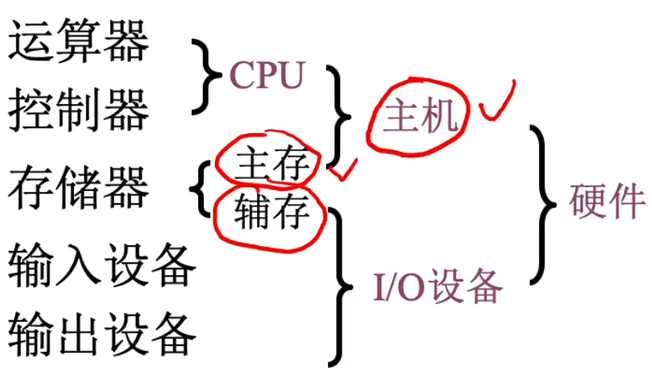

#### (三) 主机中的功能部件

##### 1、主存储器

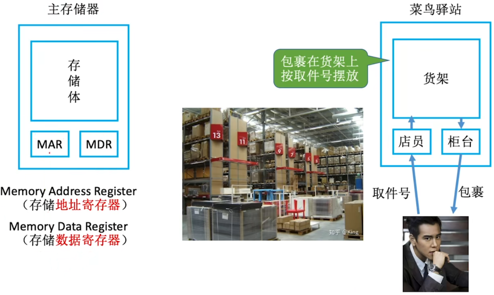

- 存储体

  - 由一系列**存储元件**构成，存放二进制的 0 和 1

  - 用于存放**数据**，数据在存储体中按**地址**存储

  - **存储单元**：每个存储单元存放一串**二进制代码**，也就是存放一个**存储字**

    > 每个存储单元会对应有一个**地址**，也放到是 <u>MAR 中的地址</u>

    > 存储元：存储二进制的**电子元件**，每个存储元可以存储 <u>1bit</u>
    >
    > > 这个电子单元通常是可以存放电荷的<u>电容</u>
    >
    > <u>存储单元 = 存储元 + 线路</u>

  - **存储字**(word)：存储单元中**二进制代码**的组合

  - **存储字长**：<u>存储单元</u>中**二进制代码的位数**，也就是**存储字的位数**

    > 通常是 8bit 的整数倍，也就是<u>一个存储字通常包括若干个字节</u>

- ***MAR***(***Memory Address Register***)

  - 存储地址寄存器

  - <u>MAR 的位数</u>反映**存储单元**的个数

    >读操作：CPU 会将要访问的数据的**地址**写到 MAR 中
    >
    >写操作：CPU 会将要写入的**地址**写到 MAR 中

- ***MDR***(***Memory Data Register***)

  - 存储数据寄存器

  - <u>MDR 的位数</u>和**存储字长**保持一致

    > 读操作：按地址找到的**数据**，会<u>先写到 MDR</u> 中，再被 CPU 取走
    >
    > 写操作：CPU 会将要写的**数据**写到 MDR 中

> :star:MAR 与 MDR 的位数问题
>
> 

##### 2、运算器

- 功能：实现**算术**运算、**逻辑**运算
- ***ACC***(***Accumulator***)：**累加器**，存放操作数或运算结果
- ***MQ***(***Multiple-Quotient Register***)：**乘商寄存器**，在<u>乘、除运算</u>时，用于存放操作数或运算结果
- ***X***：通用的**操作数寄存器**，用于存放操作数
- ==***ALU***==(***Arithmetic and Logic Unit***)：**算术逻辑单元**，通过内部<u>复杂的电路</u>实现算数运算、逻辑运算，运算器的核心部件

> :star:作用
>
> 

> 机器字长：运算器的位数；能直接处理的二进制数据的位数

##### 3、控制器

- ==***CU***==(***Control Unit***)：**控制单元**，分析指令，给出控制信号
- ***IR***(***Instruction Register***)：**指令寄存器**，存放<u>当前</u>执行的**指令**
- ***PC***(***Program Counter***)：**程序计数器**，存放<u>下一条</u>指令**地址**，有自动加 1 功能

	> 完成一条指令：
	>
	> 

---

### 二、==:star:计算机系统工作过程举例:star:==

---

### 三、计算机系统层次结构

#### (一) 机器层次结构

> - 微指令与机器语言
>
>   - 二进制的**机器语言**指令会被解释成更精细的**微指令**
>
> - 汇编语言
>
>   - 二进制指令编程太不方便，出现<u>符号式</u>的**汇编语言**
>
>   - 机器好像能直接识别汇编程序，称为<u>虚拟机</u>
>
>   - 但仍需翻译成机器语言，**汇编语言**指令和**机器语言**指令**一一对应**
>
>     > 所以汇编语言也是低级语言
>
> - 高级语言
>
>   - 机器好像能直接识别高级语言程序，也称为<u>虚拟机</u>
>   - 需要先翻译成**汇编语言**，再翻译成**机器语言**

#### (二) 语言层次结构

> - **编译**程序：将<u>高级语言编写的源程序</u>**全部**语句**一次全部**翻译成<u>机器语言程序</u>，而后再执行机器语言程序（**只需翻译一次**）
> - **解释**程序：将源程序的一条语句翻译成对应于机器语言的语句，并立即执行，紧接着再翻译下一句（**每次执行都要翻译**）

---

---

## 第三节：计算机的性能指标

---

### 一、计算机的主要性能指标

#### (一) 存储器的性能指标

- 总容量

  

  > 字节(B)相关单位：
  >
  > 

#### (二) ==CPU的性能指标==

- **CPU主频**：CPU内<u>数字脉冲信号</u>**振荡**的频率

  > 每秒中会经历的**时钟周期个数**

  

- ***CPI(Clock cycle Per Instruction)***：执行一条指令所需的时钟周期数

  > 不同的指令，CPI不同。甚至相同的指令，CPI也可能有变化

  > $执行一条指令的耗时=CPI\times CPU时钟周期$
  >
  > $CPU执行时间(整个程序的耗时) =CPU时钟周期数/主频= (指令条数\times CPI) /主频$

  > 常用计算的指标是**<u>平均CPI</u>**

- ***IPS(Instructions Per Second)***：**每秒**执行多少条**指令**

  > $IPS=\frac{主频}{平均CPI}$

- ***FLOPS(Floating point Operations Per Second)*** ：**每秒**执行多少次**浮点运算**

  > IPS和FLOPS前面可以加一些数量单位，表示<u>CPU数据运算速率</u>
  >
  > 
  >
  > > CPU主频的单位也是这样

#### (三) 系统整体的性能指标

- *数据通路带宽*：数据总线一次所能**并行**传送信息的位数

  > 各**硬件部件**通过数据总线传输数据

- *吞吐量*：系统在**单位时间**内处理**请求**的数量

  > 这里的“请求”在不同场景下是不同的

  > 它取决于信息能多快地输入内存，CPU能多快地取指令，数据能多快地从内存取出或存入，以及所得结果能多快地从内存送给一台外部设备。这些步骤中的每一步都关系到**主存**，因此，系统吞吐量主要取决于<u>主存的存取周期</u>。

- *响应时间*：指从用户向计算机发送一个请求，到系统对该请求做出响应并获得它所需要的结果的等待时间

  > 通常包括**CPU时间**(运行一个程序所花费的时间)与**等待时间**(用于磁盘访问、存储器访问、I/O操作、操作系统开销等时间)

> 基准程序：
>
> 基准程序是用来测量**计算机处理速度**的一种实用程序，以便于被测量的计算机性能可以与运行相同程序的其它计算机性能进行**比较**
>
> > 跑分软件

> 计算机性能相关思考题：
>
> 

---

### 二、几个专业术语

有待补充......

---

---

---

# 第二章：数据的表示和运算

---

---

## 第一节：数制与编码

---

### 一、进位计数制

#### (一) 十进制、二进制、八进制、十六进制

> **符号反映<u>权重</u>** + 基于“<u>乘法</u>”思想的计数方法

- 十进制

  

  > 逢**十进**一

- :star:**r进制**

  - 基数：每个**数码位**所用到的**不同符号**的个数，r进制的基数为r

    > **基数**和**位权底数**保持一致

  - 其他进制到十进制：**位权数码**<u>乘积和</u>

  

  > 其他进制的加法和十进制类似

- 二进制

  - ①可使用**两个稳定状态**的<u>物理器件</u>表示
  - ②0，1正好对应**逻辑值**假、真。方便实现逻辑运算
  - ③可很方便地使用**逻辑门电路**实现算术运算

#### (二) 其他进制$\rarr$十进制

- **位权数码**<u>乘积和</u>

#### (三) 二进制、八进制、十六进制互相转换

- 二进制$\rarr$八进制、十六进制：每3、4个一组，必要补0
- 八进制、十六进制$\rarr$二进制：每位数码转换为3、4个二进制数码

#### (四) 十进制$\rarr$其他进制

- 整数部分：**除基取余**法，每次得到的余数是当前最低位，直到结果剩下0

  

- 小数部分：**乘基取整**法，每次得到的整数部分是当前最高位，直到结果剩下0或**循环**

  

- **拼凑法**

  
  
  > 先把每个位的权重写出来，再在权重下面写数

> 十进制先转换成二进制，再转换成其他进制

#### (五) 真值和机器数

- 真值:符合人类习惯的数字
- 机器数:数字实际存到机器里的形式，正负号需要被“数字化”

---

### 二、BCD码

> 二进制与十进制之间精确转换较为麻烦；
>
> 每<u>4位二进制数</u>作为一个**符号**整体代表<u>1位十进制</u>， 方便快捷

#### (一) 8421码

- 映射关系：最直接的映射

  

- 运算：溢出**加六**

  

  > 相加结果落在1010~10010之间

#### (二) 余3码

- 映射关系：加3

  

  > 注：每一位的权值是变化的，称为无权码

#### (三) 2421码

- 映射关系：改变权值定义

  

  > 也是一种有权码；
  >
  > 大于等于5时，第一位规定为1

---

### 三、字符与字符串

#### (一) <u>英文字符</u>在计算机内的表示

- ***ASCII*码**

  

  

  > 比如 ACK 就是一个通信字符

  > 数字：48(0011 0000)~57(0011 1001)
  >
  > - 前四位都是0011，后四位是8421BCD码
  >
  > 大写字母: 65(0100 0001)~90(0101 1010)
  >
  > - 前三位都是010，后面五位是1~26
  >
  > 小写字母: 97(0110 0001)~122(0111 1010)
  >
  > - 前三位都是011，后面五位是1~26

#### (二) 中文字符在计算机内的表示

- ***GB 2312-80***

  - 1980年提出，汉字+各种符号共7445个；也叫国标码

- **区位码**$\rarr$**国标码**：横纵坐标，94*94，$(0,93)$

  > ASCII码规定用于**控制和通信**的字符是在***0~31***，
  >
  > 为**传输时防止冲突**，会每个字节加上**20H**， 这就成为了**国标码**

- **汉字机内码**

  >ASCII码规定用于英文字符是在***32~125***，还有126、127两个控制字符
  >
  >为**完全防止冲突**，每个字节就直接加上**128D**，一个汉字占用***2B***（区位），而每个字节都大于128，就可以直接区分ASCII码与中文字符了

- 汉字的输入与输出

  - 输入：**输入编码**

    > 输入编码($\rarr$国标码)$\rarr$汉字内码

  - 输出：**汉字字形码**

    >汉字内码($\rarr$国标码)$\rarr$汉字字形码

#### (三) 字符串的存储

- 无中文字符的字符串

  

- 有中文字符的字符串

  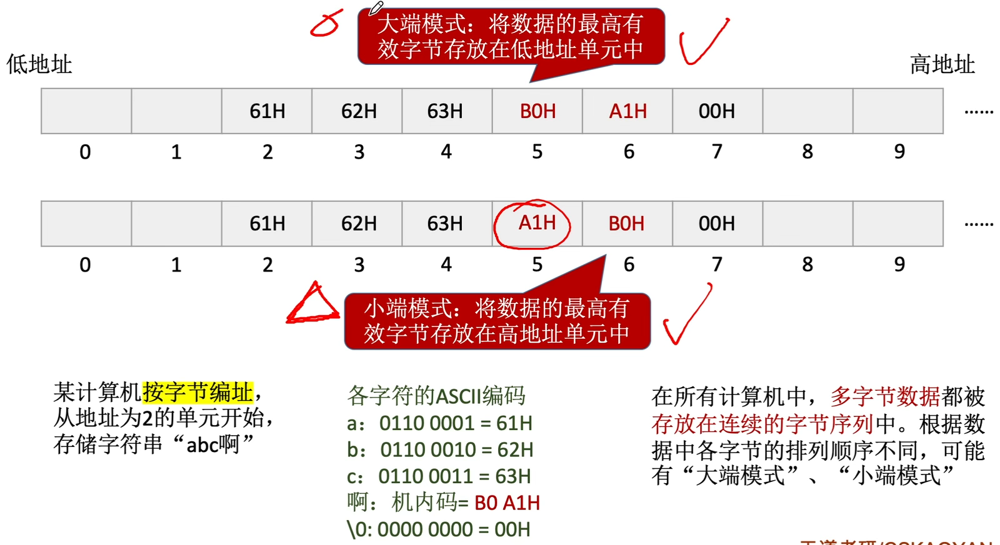

---

### 四、校验码

> 二进制数据在传输的过程中可能受到环境的干扰而属发生错误，
>
> 怎么检测错误？怎么改正错误？

#### (一) 奇偶校验码

- *情景*

  

- *相关概念*

  - 码字：由若干位代码组成的一个字叫码字。

  - 码字间的距离：
    将两个码字逐位进行对比，具有不同的位的个数称为两个码字间的距离。

  - 码距：一种编码方案可能有若干个合法码字，各合法码字间的最小距离称为“码距”。

    > 码距也意味着，当发生“码距”个错误时，可能跳变到另一个合法状态；
    >
    > 所以码距长一些可能会更好

    > 码距 d 与检测能力：
    >
    > 当d=1时，无检错能力；当d=2时，有检错能力;当d$\ge$3时， 若设计合理，可能具有检错、纠错能力

- *奇偶校验码*

  - 概念

    

  - 校验位与校验

    - **偶校验位**的硬件实现：各信息进行异或(模2加)运算，得到的结果即为偶校验位
    - **偶校验**的硬件实现：各信息进行异或(模2加)运算，得到的结果为1则说明出错

#### (二) 海明校验码

<u>基本思想</u>：将信息位**分组**进行**偶校验**

- 这样就有多个校验位，可以指示**对/错**
- 多个校验位就可以标注**出错位置**

> 要解决的问题：
>
> - 需要**分几个组**？
> - 信息位怎么**分到对应的组**中

<u>求解步骤</u>：

1. 确定**校验位**数

   - 海明不等式：$2^k\ge n+k+1$

     > n位信息位，k位校验位；
     >
     > 共n+k位每一位都有可能出错，再加上1种都正确的状态

2. :star:确定校验位的分布：校验位$P_i$放在==位号为$2^{i-1}$的位置==上

   > 这个位置其实隐含了一种“**权重**”

   - 设信息位为：$D_nD_{n-1}...D_1$，校验位为：$P_kP_{k-1}...P_1$
   - 设对应的海明码为：$H_{n+k}H_{n+k-1}...H_1$

   > 举例：
   >
   > 

3. 求检验位的值：数据位的**位号**写成二进制，如果**对应位为1**，就要将这位数据交给**对应权重的校验位**去**偶校验**，也就是将它们放在**一组**中

   > 举例：
   >
   > 
   >
   > 

4. 纠错：对**分组**内的所有比特位进行**异或**（偶校验），出现**1**则说明出现错误，从低到高排列结果位，则可以知道第几位出现错误

   > 举例：
   >
   > 
   >
   > - 用图来理解原理：
   >
   >   
   >
   >   - 三种颜色代表三个**分组**，分组中任何一个位改变，都会使**校验结果**发生变化

<u>检错、纠错能力</u>：纠正**单比特错**，检验**双比特错**

- 上面所说的方案并不能应对**双比特错**，需要改进：
  需要加上“**全校验位**”，对整体进行偶校验

  > 举例：
  >
  > 
  >
  > 

---

---

## 第二节：定点数的表示与运算

---

### 一、定点数的表示

#### (一) 基本概念

- 定点数：小数点的位置固定

  > 比如常规计数，个位之后加小数点

- 浮点数：小数点的位置不固定

  > 比如科学计数法

#### (二) 无符号数

- 无符号数：整个机器字长的全部二进制位均为**数值位**

  > 没有符号位，相当于数的**绝对值**

  > 通常只有无符号**整数**，而没有无符号小数
  >
  > > 比如 C 语言的`unsigned`修饰符

- 表示范围：n 位无符号数的表示范围是 0 ~ $2^n-1$

#### (三) 有符号数

##### 0、概述

> 大于 1 的小数，整数部分和小数部分分别存储；
>
> 数值部分也称“尾数”；
>
> 数值部分每一位的**权值**就是基于<u>隐含小数点位置</u>判断的

> 注：
>
> 可用**原码**、**反码**、**补码**三种方式来表示<u>定点整数</u>和<u>定点小数</u>。
>
> 还可用**移码**表示<u>定点整数</u>。
>
> 若真值为x，则用$[x]_原$、$[x]_反$、$[x]_补$、$[x]_移$
>
> 分别表示真值所对应的原码、反码、补码、移码

##### 1、原码

- 用**尾数**表示真值的**绝对值**，符号位“0/1” 对应“正/负”

  > 若机器字长为 n+1 位，则尾数占 n 位

- 表示范围

  - 原码整数

    

  - 原码小数

    

  > 注意，能表示$2^n-1$个数，而不是$2^n$个，因为 0 被表示了两次

> 书写方式举例：
>
> 

##### 2、反码

- 若符号位为 0 ，则反码与原码相同
- 若符号位为 1 ，则反码是原码的**数值位**全部**取反**

> 整数和小数都一样

> 反码与原码有一一对应的关系，表示范围都一样；
>
> 只是一个中间状态，没什么实际作用

##### 3、补码

- 正数的补码等于原码；
  负数的补码等于反码**末位加 1**

  > 整数和小数都一样，小数的话要去掉后面的0
  >
  > 负数的补码注意**进位**问题，**符号位**也参数进位；
  >
  > 原码$\rarr$补码：补码定义
  >
  > 补码$\rarr$原码：方法相同，都是**尾数取反再加1**

- 表示范围

  - 补码整数

    

    > 规定：$[x]_补=1,0000000$表示$-2^7$；
    >
    > 可以比原码多表示一个，可以再小一点

  - 补码小数

    

    > 规定：$[x]_补=1.0000000$表示$-1$
    >
    > 可以比原码多表示一个，可以再小一点

> :star:技巧 
>
> 由$[x]_补$快速求$[-x]_补$的方法：
>
> 符号位、数值位全部取反，末位+1
>
> **负数补码**与其真值绝对值：
>
> - 负整数真值绝对值：模(128D=1 0000 0000B) - 补码 (包括符号位)
> - 负小数真值绝对值：左边的 0 越多，真值越大 (全 0 就是 -1)

##### 4、移码

- 在补码的基础上，将符号位取反

  > 注意：移码只能用于表示**整数**

- 表示范围：与补码一一对应

- 移码特性：

  

> :star:定点整数表格
>
> 
>
> 原码和反码的真值0有两种表示，补码和移码的真值0只有一种表示，补码和移码可以多表示一一个负数

> 总结：
>
> 

#### (四) 原码补码移码的作用

> 加减运算：
>
> - 如果用**原码**，就需要同时使用**加法器**和**减法器**
>
>   > ALU
>
> - 利用**模运算**的性质，可以用加法代替减法
>
>   > 计算机硬件天然就会**模运算**，因为溢出的高位会被舍弃
>
> - 补码的原生定义，正是“模 - 绝对值”

- 补码的作用

  - 使用补码可将减法操作转变为等价的加法，ALU 中无需集成减法器。

    > 执行加法操作时，**符号位**一起参与运算

- 移码的作用

  

---

### 二、定点数的运算

#### (一) :star:移位运算

##### 1、算数移位

- *原码*：符号位保持不变，仅对数值位进行移位

  > 右移：
  > 高位<u>补 0</u>，低位舍弃。若舍弃的位 = 0，则相当于 ÷ 2；
  > 若舍弃的位不是 0，则会**丢失精度**
  >
  > 左移：
  >
  > 低位<u>补 0</u>，高位舍弃。若舍弃的位=0，则相当于 * 2
  > 若舍弃的位 ≠ 0， 则会出现**严重误差**
  >
  > > 所以某些时候算术移位并不能精确等效于乘除法

  > 正数、负数、整数、小数都同理

- *反码*

  - 正数：与原码同理
  - 负数：0 和 1 反过来

- *补码*

  - 正数：与原码同理

  - 负数

    

    > 补码从右向左到第一个 1 ，都和原码相同，这个 1 之后都和反码相同；
    >
    > 所以，对于补码负数的移位运算，==高位补 1，低位补 0==
    >
    > （小数都同理）

> 算术移位总结：
>
> 

##### 2、逻辑移位

- 逻辑右移:高位补0，低位舍弃。
- 逻辑左移:低位补0，高位舍弃。

> 应用举例：
>
> 

##### 3、循环移位

> 汉字**大端**存储和**小端**存储之间的转换

#### (二) :star:加减运算

##### 1、原码的加减运算

- 加法
  - 正+正：绝对值相加，符号位取正
  - 负+负：（先忽略符号位）绝对值相加，符号位取负
  - 正+负：（先忽略符号位）绝对值大的减绝对值小的，符号位同绝对值大的
- 减法

> 原码的加减运算用硬件实现<u>很麻烦</u>

##### 2、补码的加减运算

- 两数相加：$[A+B]_补=[A]_补+[B]_补$

- 两数相减：$[A-B]_补=[A]_补+[-B]_补$

  > 注：$[-B]_补=[B]_补连同符号位一起取反再加1$

>对于补码来说，无论加法还是减法，最后都会转变成加法，由加法器实现运算
>
>> **符号位**也参与运算

>负数补码原码互转的两种方法：
>
>- 数值位取反+1；
>- 负数补码中，最右边的1及其右边**同原码**；最右边的1的左边**同反码**

##### 3、补码运算溢出判断

- 上溢与下溢的<u>所有可能情况</u>：

  - 正+正=负
  - 负+负=正

- 计算机硬件<u>判断溢出</u>的方法：

  - 采用一位符号位

    - 根据**操作数**与**结果**的符号位，得到溢出表达式：$V=A_SB_S\bar{S_S}+\bar{A_S}\bar{B_S}S_S$
    - 根据**数值位**与**符号位**的进位情况，得到溢出表达式：$V=C_S\oplus C_1$

  - :star:**采用**双符号位

    > 正数符号位为00，负数符号位为11

    - 根据运算结果的**两个符号位**，得到溢出表达式：$V=S_{S_1}\oplus S_{S_2}$

    > 双符号位补码又称**模4补码**；单符号位补码又称**模2补码**
    >
    > > 模$2^n$补码的意思就是，把符号位与尾数之间的分隔当作<u>小数点</u>，
    > > 则每次运算只保留位权比$2^n$小的位
    >
    > 双符号位实际存储时<u>只存储1个符号位</u>，运算时再<u>复制</u>一个符号位；
    >
    > 发生溢出时，双符号位的**最高位**代表了本应该得到的符号

##### 4、符号扩展

- 正整数：高位补0
- 负整数
  - 原码：高位补0，符号位保持1
  - 反码、补码：高位补1
- 正小数：低位补0
- 负小数
  - 原码：低位补0
  - 反码：低位补1
  - 补码：低位补0

#### (三) 乘法运算

> 乘法运算的实现思想：
>
> 与十进制相同，本质上就是**移位相加**。
>
> 但有如下问题：
>
> 考虑用机器实现:
>
> - 实际数字有正负，**符号位**如何处理？
> - 乘积的**位数扩大**一倍，如何处理？
> - 所有**位积**都要保存下来最后统一相加？

> 复习：运算器的基本组成
>
> 

##### 1、原码一位乘法运算

用小数举例：（整数类似）

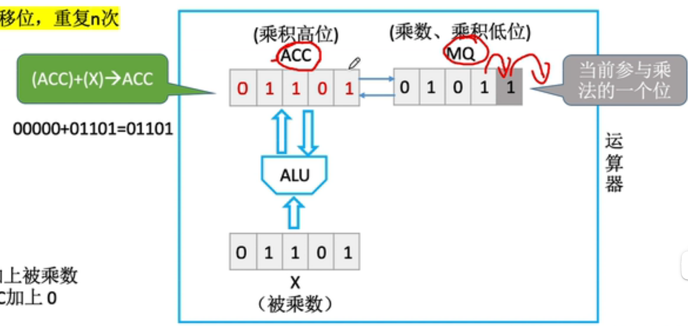

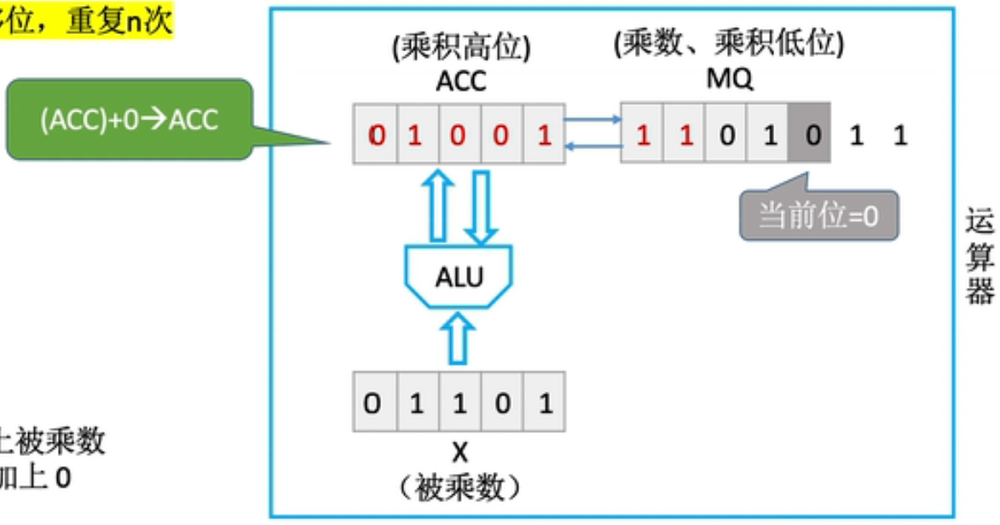

- 从X中取数向ACC加法，ACC、MQ统一移位，从而扩大**部分积**的位数，丢弃使用过的低位
- 处理符号位=$x_s\oplus y_s$

> 

总结：

> 原码一位乘法（机器字长n+1， 数值部分占n位）

- 符号位通过==异或==确定；

- 数值部分通过被乘数和乘数绝对值的**n轮**==加法、移位==完成；

  > 符号位不参加运算，但ACC中的符号位还是会跟着**逻辑右移**的

- 根据当前乘数中参与运算的位确定(ACC)加什么。
  - 若当前运算位=1,则$(ACC)+[|x|]_原$;
  - 若=0，则(ACC)+0。
  
- 每轮加法后ACC、MQ的内容统一==逻辑右移==

##### 2、补码一位乘法运算

MQ多了一位辅助位，ACC和X也跟着扩展了一位，可以直接采用双符号位补码运算了

与原码的乘法运算对比：

- 进行n轮加法、移位，**最后再多来一次加法**

- 每次加法可能+0、+[x]~补~、+[-x]~补~

  > 根据MQ中”**最低位**“和**辅助位**确定：
  >
  > - 辅助位 - MQ中最低位 = 1时，(ACC)+[x]~补~
  > - 辅助位 - MQ中最低位 = 0时，(ACC)+0
  > - 辅助位 - MQ中最低位 = -1时，(ACC)+[-x]~补~

  > 加法有可能导致溢出，不用在意，高位直接丢弃即可

  > 注意所有的运算都是补码，x和y都用补码，但y倒是不用双符号位，因为符号位只是用来确定最后一次怎么加

- 每次移位是“补码的**算数右移**“

  > 这就是标准的算数右移了，符号位是不动的

- **符号位参与运算**，并非单独处理

  > 最终的结果是[x\*y]~补~而不是x\*y

  

> 最后一次加法时，符号位也会参与运算

#### (四) 除法运算

> 复习：
>
> 

##### 1、原码除法

***恢复余数**法：*

- 符号位单独处理
- 实现方法：上商0/1, 得到余数，余数末尾补0

> **恢复**的时候还是需要用补码再加回去；
>
> 其实所谓的”恢复“，也只是在计算这次的余数是多少

> 注意这个余数是要左移n位的

> 
>
> 

- 总结：

  

  > 左移n次，<u>上商n+1次</u>，<u>最后一次商，余数不左移</u>
  >
  > > 这个左移也是带着符号位的**逻辑左移**

***加减交替**法（不恢复余数法）*

> 思想：
>
> 
>
> 相当于把<u>计算（恢复）余数和下一次商1</u>结合起来了；
>
> 正常商1之后也是要左移一下，然后用[-|y|]~补~，再看情况决定商几；
>
> 当然第一次还是要正常减一下的

>符号位还是单独计算；
>
>计算过程中溢出直接丢

总结：

>一定会加/减n+1次，每次加减确定一位商（也就是上商一定是n+1次）；
>
>左移n次(最后一次加减完不移位)，最终为了恢复余数，可能还要再多一次加

> 注：定点小数的运算必须保证运算结果也小于1，不然无法表示。
>
> > 这可以通过**第一次上商**检测出来

##### 2、补码除法

加减交替法：与原码对比

- <u>符号位参与运算</u>
- 被除数/余数、除数采用**双符号位**
- 在第一步中：
  - 原码的话，一定是被除数减去除数
  - 补码的话
    - <u>被除数</u>与<u>除数</u>**同号**，则**减**
    - <u>被除数</u>与<u>除数</u>**异号**，则**加**
- 上商的确定：
  - <u>余数</u>和<u>除数</u>**同号**则商**1**，余数<u>左移一位</u>并**减**去除数
  - <u>余数</u>和<u>除数</u>**异号**则商**0**，余数<u>左移一位</u>并**加**上除数
- 但是在最后一步：无论同号异号，都商**1**，之后也不再移位
- 商和余数的符号位由计算确定

---

---

## 第三节：浮点数的表示与运算

---

### 一、浮点数的表示

#### (一) 浮点数的作用和基本原理

> 定点数的局限性：定点数可表示的数字范围有限，但我们不能无限制地增加数据的长度
>
> 如何在位数不变的情况下增加数据表示范围?

- 科学计数法理解浮点数

  

- ==*浮点数的表示*==

  - 阶码 (E)：常用补码或移码表示的定点整数

    > 反映小数点的**实际位置**和浮点数的**表示范围**，通常用补码、移码表示

  - 尾数 (M)：常用原码或补码表示的定点小数

    > 数值部分反映**浮点数的精度**，通常用补码、原码表示

  > 浮点数的真值：$N=r^E\times M$ 通常 $r=2^i,i=1$
  >
  > 
  >
  > 二进制，阶码用底数 2 ，小数点直接移动即可
  >
  > > ==<u>尾数</u>给出**小数**，<u>阶码</u>指明**小数点**向左/右移动几位==

#### (二) 浮点数规格化

> 尾数部分长度有限，为了提高精度；
>
> 就像科学计数法的要求一样

- *规格化浮点数*：

  - 规定尾数的**最高数值位**必须是一个有效值。

- *左规*：

  - 当浮点数运算的结果为非规格化时要进行规格化处理，
  - 将尾数算数左移一位，阶码减 1

- *右规*：

  - 当浮点数运算的结果**尾数出现溢出**(双符号位为01或10)时
  - 将尾数算数右移一位，阶码加 1

- *特点*：

  - 原码表示的尾数规格化

    

    > 最高位一定是 1，和科学计数法类似；
    >
    > 注意规格化不包括 0

  - 补码表示的尾数规格化

    

    > 负数的时候让数值位最高位为 0，这是为了方便计算机处理

#### (三) 浮点数的表示范围

#### (四) IEEE 754 标准

> 回顾移码：
>
> IEEE 754 标签中，阶码用移码表示；
>
> 移码的定义：真值 + 偏置值
>
> > 可以规定：8 位移码的偏置值就是 1000 0000B，即 $2^{n-1}D$；
> >
> > 其计算规律是：补码的符号位取反
>
> > 在 IEEE 754 中，偏置值为 01111111B，即 $(2^{n-1}-1)D$
>
> 

- **尾数**遵循规格化，又将最高位的 1 省略 (算术左移之后)

- **阶码**真值的正常范围是：-126 ~ 127

  > IEEE 754 阶码全 1 、全 0 有特殊用途

- 计算真值的方法：

  

  > 

- 特殊情况

  - 绝对值太小了：让**阶码全为 0** ，**尾数非规格化**

    > 阶码全为 0 的移码的真值其实是 -127，但这里就强行规定成 ***-126***；
    >
    > 尾数可以不遵循规格化，且之前隐含的最高位也变成 0 了

    > 如果阶码和尾数都为 0 ，就表示 ±0

  - 绝对值太大了：不再代表具体的数

    - 如果**阶码全为 1**、尾数全为 0，就表示 ±$\infin$
    - 如果**阶码全为 1**、尾数不全为 0，表示 NaN

  > 

---

### 二、浮点数的运算

#### (一) 加减运算

借助如下的例子来理解：

1. **对阶**

   > 小阶向大阶对齐
   >
   > > 计算机内部，尾数是定点**小数**，所以最好不要出现大于0的情况
   >
   > **阶码加一**则**尾数右移一位**

   1. 求阶差
   2. 对阶

   

2. **尾数加减**

   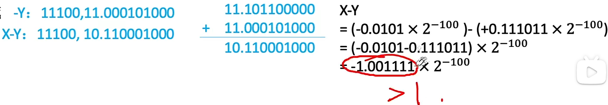

   > 在本例中已经发生溢出，但采用了双符号位，之后还可以“拯救”

3. **规格化**

   

   > 注意这里右移到底是补1还是补0，要看第一符号位是多少，因为**<u>双符号位最高位代表本应得到的符号</u>**

   > 通过尾数右移和阶码加一，“拯救”了溢出的情况，相当于：
   >
   > 

   > 在右规时可能也会有舍入问题：
   >
   > 有的计算机可能会把浮点数的尾数部分单独拆出去计算(24bit→32bit)，算完了经过舍入(32bit→24bit)再拼回浮点数

4. **舍入**

   > 可以有多种舍入规则，要根据最终保留的位数取舍；
   >
   > 在上一步规格化的过程中也涉及到了舍入

   本例中规格化时右移丢弃的位是0，不需要舍入

   > 需要舍入的情况：
   >
   > - 0舍1入法
   >
   >   
   >
   >   这个操作可能再次导致尾数溢出，需要回到规格化那一步，再次右规
   >
   > - 恒置1法：把丢弃后剩下的最后一位一定置1
   >
   >   

5. **判溢出**

   > 阶码溢出一定会导致溢出，尾数溢出或许可以通过规格化或舍入来防止

   本例中，在规格时，阶码右移，双符号位仍然保持一致，没有溢出

   

   > 有溢出的情况：
   >
   > 
   >
   > 下溢直接当成0，上溢则抛出异常

#### (二) 强制类型转换

---

---

---

# 第三章：存储系统

---

---

## 第一节：存储系统基本概念

---

### 一、存储器的层次结构

#### (一) 结构

> 辅存和外存有时区分不明显，注意分辨；
>
> 一般认为U盘属于外存；
>
> 硬盘有固态硬盘和机械硬盘，固态硬盘会更快

#### (二) 交互

> 主存-辅存：
>
> 实现了**虚拟存储系统**，解决了<u>主存容量不够</u>的问题
>
> > 辅存中的数据要调入主存后才能被CPU访问，不然速度差异太大
>
> Cache-主存：
>
> 解决了<u>主存与CPU</u>速度不匹配的问题

----

### 二、存储器的分类

#### (一) 层次

#### (二) 存储介质

- 半导体存储器
  - 主存、Cache
  - 以**半导体**存储信息
- 磁表面存储器
  - 磁盘(硬盘)、磁带
  - 以**磁性材料**存储信息
- 光存储器
  - 以光介质存储信息

#### (三) 存取方式

- 随机存取存储器

  - Random Access Memory, RAM
  - 读写任何一个存储单元所需时间都相同，与存储单元所在的**物理位置**无关

  > 比如内存条

- 顺序存取存储器

  - Sequential Access Memory, SAM
  - 读写一个存储单元所需时间取决于存储单元所在的**物理位置**

- 直接存取存储器

  - Direct Access Memory, DAM
  - 既有<u>随机存取</u>特性，也有<u>顺序存取</u>特性
  - 先直接选取信息所在<u>区域</u>，然后按<u>顺序</u>方式存取

> 串行访问存储器：读写某个存储单元所需时间与存储单元的**物理位置**有关

- 相联存储器

  - Content Addressed Memory, CAM
  - 可以按**内容**访问的存储器
  - 可以<u>按照内容检索</u>到存储位置进行读写

  > “快表”就是一种相联存储器

#### (四) 信息的可更改性

- 读写存储器

  - Read Write Memory
  - 即可读，也可写

  > 如：磁盘、内存、Cache

- 只读存储器

  - Read Only Memory
  - 只能读，不能写

  > 如：音乐专辑CD-ROM、实体电影蓝光光碟、BIOS(这个ROM通常在主板上)
  >
  > > 事实上很多ROM也可以写，只不过很麻烦 

#### (五) 信息的可保存性

断电后：

- 易失性存储器

  - 存储信息消失的存储器

  > 如Cache、主存

- 非易失性存储器

  - 存储信息依然保持的存储器

  > 如磁盘、光盘

信息读出后：

- 破坏性读出

  - 原存储信息被破坏

  > 如DRAM芯片，读出数据后要进行**重写**

- 非破坏性读出

  - 原存储信息被破坏

  > 如SRAM芯片、磁盘、光盘

---

### 三、存储器的性能指标

#### (一) 存储容量

存储字的数量$\times$存储字长

> MAR反映了存储字的数量，MDR反映了存储字长

#### (二) 单位成本

$每个bit位的花费=\frac{总成本}{总容量}$

#### (三) 存储速度

$数据传输率=\frac{数据的宽度}{存储周期}$

> 数据的宽度即**存储字长**；
>
> 数据传输率也叫**主存带宽**(Bm)，表示每秒<u>从主存进出信息</u>的最大数量，
> 单位为字/秒、宇节/秒(B/s) 或位/秒(b/s) 。

> 存取时间与存储周期：
>
> 
>
> - 存取时间(Ta)：存取时间是指从启动一次存储器操作到完成该操作所经历的时间，分为读出时间和写入时间。
> - 存取周期(Tm)：存取周期又称为读写周期或访问周期。它是指存储器进行一次完整的读写操作所需的全部时间，即连续两次独立地访问存储器操作(读或写操作)之间所需的<u>最小时间间隔</u>。

---

---

## 第二节：主存储器的基本组成

---

### 一、半导体元件的原理

#### (一) 存储器的结构

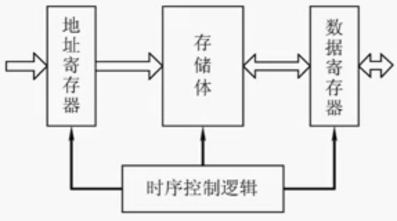

#### (二) MOS管和电容/存储体的结构

> MOS管可理解为一种电控开关，输入电压达到某个阈值时，就会导通；
>
> 读写0和1时，本质上就是让电荷流经MOS管，从而达到目的

---

### 二、存储芯片的基本原理

#### (一) 译码器/读取存储单元

#### (二) 控制电路、MAR、MDR

> 控制电路可以用来稳定MAR与MDR的输入输出；
>
> 控制电路还会与外界通过若干条线交互，片选线用来指示这块芯片是否可用

#### (三) 整体结构

> 驱动是用来保证**译码器输出的信号稳定有效**的；
>
> 读写电路包括图中红色、绿色的线，以及控制电路

> 存储芯片示例：
>
> 
>
> 每种根都对应着引脚，这些线包括：地址线、数据线、片选线、读/写控制线
>
> 存储芯片**数据指标**的描述：
>
> 
>
> > 注：
> >
> > - 总容量=存储单元个数(对应着**地址线**)$\times$存储字长(对应着**数据线**)
> >
> >   > 据此也可以判断出引脚数
> >
> > - K的单元是$2^{10}$

---

### 三、如何实现不同的寻址方式

> 每个小格代表一个字节，一行代表一个**存储字**
>
> 
>
> 存储器是**按字节<u>编址</u>**的
>
> 
>
> 在这种情况下，按**存储字**寻址时，只需要将**存储字**的编号<u>左移两位</u>即可得到对应<u>起始字节</u>

---

---

## 第三节：DRAM和SRAM

---

> 初识DRAM与SRAM：
>
> - Dynamic Random Access Memory，动态RAM
>
>   >DRAM用于主存；
>   >
>   >上一小节讲的就是DRAM
>
> - Static Random Access Memory，静态RAM
>
>   > SRAM用于Cache

### 一、存储元件不同导致的特性差异

#### (一) 存储元件的类别差异

- DRAM芯片：使用**栅极电容**存储信息

- SRAM芯片：使用**双稳态触发器**存储信息

  > 核心区别，存储元不同

#### (二) 两类存储元的对比

- 栅极电容：

  

  > <u>读出</u>的时候，电容放电，信息被破坏，称为**破坏式读出**。
  > 读出后应该有**重写**的操作，也称“再生”。
  >
  > 因而<u>读写速度较慢</u>。

  >每个存储元制造成本更低，集成度高，功耗低

- 双稳态触发器：

  

  > 两个稳态分别是：
  >
  > - 1：A高B低
  > - 2：A低B高
  >
  > 写的时候，给对应的BL、BLX一高一低的信号即可

  > 读出数据时，<u>触发器仍保持稳定状态</u>，是**非破坏性读出**，**无需重写**。
  >
  > 因而<u>读写速度较快</u>。

  >每个存储元制造成本更高，集成度低，功耗大
  >
  >> 集成度低是因为mos管多，<u>电路复杂</u>
  
  > 因为mos管多，所以引脚也更多一些

#### (三) 总结对比

> 注意不要混淆**破坏性**与**易失性** 

> <u>**刷新**</u>：
>
> - 栅极电容的电荷是会自动流失的，即使不断电，2ms的时间就足够消失了
>   所以就需要刷新这种操作，2ms之内必须“刷新”一次（给电容充电）
> - 但触发器不会这样，只要不断电，状态就不变
> - 本质原因还是存储元件的特性不同

> 关于送行列地址的问题，涉及到下面要讲的DRAM地址线复用

---

### 二、DRAM的刷新

> 从上面的分析可以知道，DRAM的栅极电容不能长时间保持电荷，是需要刷新的

#### (一) 多久刷新一次

刷新周期：一般为2ms

#### (二) 每次刷新多少存储单元

以行为单元，每次刷新**一行存储单元**

> 一行存储单元的意思是，存储单元以行列地址存放，一行中可以有多个存储单元

> 为什么要用行列地址？减少选通线的数量
>
> 
>
> > 现在可能还有三维排列
>
> 怎么选中的？
>
> 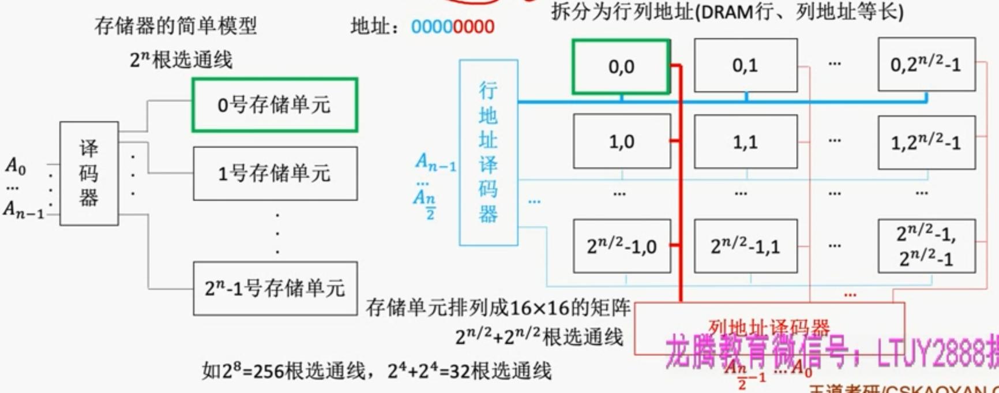

#### (三) 怎么刷新？

有硬件支持，读出一行的信息后重新写入，占用<u>1个读/写周期</u>

> 刷新操作是由存储器独立完成的，不需要CPU控制 

#### (四) 在什么时刻刷新？

- 分散刷新：

  

- 集中刷新

  

- 异步刷新

  

  > 可以在CPU不需要访问存储器时刷新

---

### 三、DRAM的地址线复用技术

行列地址分两次送，可使**地址线更少**，芯片引脚更少

> ==地址线、地址引脚减半==

> SRAM可以同时送是因为它集成度低，存储容量较少，本来也不需要太多位地址线

---

---

## 第四节：ROM

---

### 一、各种ROM概述

#### (一) MROM

#### (二) PROM

#### (三) EPROM

UVEPROM：

EEPROM：

 

#### (四) Flash Memory

> 

> 虽然可读可写，但依然归类为ROM；
>
> 

#### (五) SSD

> 

#### (六) BIOS芯片

那么最初的指令从哪里来？

> 

主存的完整组成：

>注:我们常说“内存条”就是“主存”，但事实上，主板上的ROM芯片也是“主存”的一部分

> :star:总结：
>
> - 很多ROM芯片虽然名字是“Read-Only"，但==很多ROM也可以“写”==
>
> - ==闪存的写速度般比读速度更慢==， 因为写入前要先擦除
>
> - RAM芯片是易失性的，ROM芯片是非易失性的。很多ROM也具有“随机存取”的特性
>
>   > 所以RAM和ROM并不是完全对立的

---

---

## 第五节：主存储器与CPU的连接

---

### 一、单块存储器与CPU的连接

此前留下的问题：

> 

> 
>
> 读写信号是通过**控制总线**发送的

> 信号命名约定：
>
> 

---

### 二、多块存储芯片与CPU的连接

#### (一) 位扩展法

> 增加主存的**存储<u>字长</u>**，就是嫌每个存储单元太短了，比如8K*1位，有8K个**存储单元**，但每个存储单元的**字长**就1bit

一块芯片、又只有一位的情况：

再扩展一块芯片：

扩展到8bit：

>8片8K x 1位的存储芯片$\rarr$1个8K X 8位的存储器，容量8KB

#### (二) 字扩展法

> 增加主存的**存储字数**

$\Rarr$线选法

>利用片选信号CS，防止数据总线冲突；
>
>但地址利用的很不充分

$\Rarr$片选法

> 优化对片选信号的处理，构成1-2译码器

> 可以对**译码器**再扩展，将**地址线**译码成更多的**片选线**

再多几次字扩展：

> 注：红色的地址线实际上不是图中那么接的，而是都来自于CPU

> 题目有可能把A14空下，故意使用A15
>
> 
>
> 注意，位扩展不需要译码器的参与，字扩展需要；
> 而且位扩展和字扩展地址线都是接到一起的，位扩展直接一起选中即可，字扩展需要用译码器加以区分。

> 总结：对比两种方法
>
> 

#### (三) 字位扩展法

先位扩展，构成一**组**；再对每组进行字扩展

---

### 三、关于译码器知识的补充

> 这样控制时间有什么用？
>
> 可以等**地址信号**都**稳定**了，再进行片选

> 

---

---

## 第六节：双口RAM&多模块存储器

---

### 一、回顾

#### (一) 存储周期

**存储周期**：可以连续读/写的最短时间间隔

> 注: DRAM芯片的恢复时间比较长，有可能是存取时间的几倍(SRAM的恢复时间较短)

#### (二) 问题

- **多核CPU都要访存**，怎么办？——双端口RAM
- CPU的读写**速度**比主存快很多，主存**恢复时间**太长怎么办？——多模块存储器

---

### 二、双端口RAM

#### (一) 概述

这种技术的作用：

- 优化多核CPU访问一根内存条的速度

实现这种技术的条件：

- 需要有两组完全独立的数据线、地址线、控制线。CPU、RAM中也要有更复杂的控制电路

两个端口对同一-主存操作有以下4种情况:

- 两个端口同时对不同的地址单元存取数据。
- 两个端口同时对同一地址单元读出数据。
- 两个端口同时对同一地址单元写入数据——写入错误
- 两个端口同时对同一地址单元，一个写入数据，另一个读出数据——读出错误

解决方法：

- 置“忙”信号为0,由判断逻辑决定暂时关闭一个端口( 即被延时)，未被关闭的端口正常访问，被关闭的端口延长一个很短的时间段后再访问。

---

### 三、多模块存储器

#### (一) 多体并行存储器

> 多体就是**多个存储体**，可以理解为多根**内存条**

高位交叉编址：

> **地址连续**访问时会也会连续访问同一存储体，这只是单纯扩充的容量，几乎不会增加访存速度

低位交叉编址：

> **地址连续**访问时会依次访问各个存储体，访存速度翻倍

两种编址方式的比较：探讨连续访问的情况

> 为什么要探讨连续访问？因为数组、程序代码片段也都是连续存放的

> 注意这个耗时也考虑了最后的**恢复时间**；
>
> 计算方法：连续读取先只考虑存取时间，即nr，再加上最后一个的恢复时间，即3r；
>
> 宏观上读写一个字的时间接近r

流水线存取：

- 采用“流水线”的方式并行存取

  > 宏观上并行，微观上串行；
  >
  > 流水指的就是各个存储体之间流水

- 宏观上，一个存储周期内，**m体交叉存储器**可以提供的数据量为**单个模块的m倍**。

  > 给定一个地址x，如何确定其属于哪个存储体？可以直接看**低位**，也可以**对m取余**

- **存取周期为T**，**存取时间为r**，为了使流水线不间断，应保证模块数m≥T/r

  > 
  >
  > 最好的情况还是相等
  >
  > 

  >在计算中，“**存取时间**”与“**总线传输周期**”是近似相等的

总结：

> 
>
> - 为什么相同主频？不然的话高频就低频，会浪费
>
> - 为什么相同容量？不然的话只能低地址双通道，高地址还是单通道
>
>   > 
>   >
>   > 电脑性能不稳定

#### (二) 单体多字存储器

> 这样不够灵活，m个字是绑定的，一旦有数据分别存储到了不同的存储单元，就有可能读出一些冗余的信息

> 当然读写速度都是会有很大提高的

---

---

## 第七节：Cache

---

> 存储系统仍存在的速度差异问题：
>
> 

### 一、基本原理和基本概念

#### (一) Cache工作原理

#### (二) 局部性原理

- **空间局部性**：在最近的未来要用到的信息(指令和数据)，很可能与现在正在使用的信息在存储空
  间上是邻近的

  > 比如：数组元素、顺序执行的指令代码

- **时间局部性**：在最近的未来要用到的信息，很可能是现在正在使用的信息

  > 比如：循环结构的指令代码

基于局部性原理，不难想到，可以把CPU目前访问的地址“周围”的部分数据放到Cache中

#### (三) 性能分析

设tc为访问一次Cache所需时间，tm为访问一次主存所需时间

- **命中率**H: CPU欲访问的信息已在Cache中的比率

- **缺失(未命中)率**M=1-H

- Cache——主存系统的**平均访问时间t**为t=Htc+(1- H)(tc + tm)

  > 先访问Cache，若Cache未命中再访问主存；
  >
  > 当然也可以同时访问Cache和主存，t=Htc+(1- H)tm

> 举例：
>
> 
>
> 题目举例：
>
> 

#### (四) 有待解决的问题

- 如何界定“周围”？
  **将主存的存储空间“分块”**，都在一个块内的就是周围

  > 如：每1KB为一块。主存与Cache之间以“块”为单位进行数据交换

  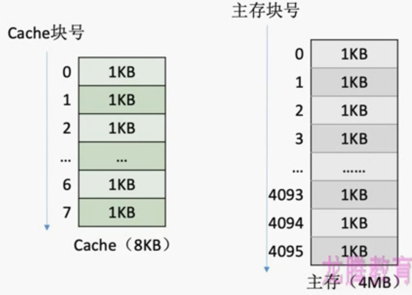

  

  > 因而，主存的地址又可以拆分为**（主存块号，块内地址）**的形式

  > 注意，每次被访问的主存块，一定会被立即调入Cache

  > 概念问题：
  >
  > 注：
  >
  > - 操作系统中，通常将主存中的“一个块”也称为“一个页/页面/页框”
  >
  > - Cache中的"块”也称为“行”

- Cache中的块和主存中的块怎么建立**映射关系**？

  > Cache和主存的映射方式

- Cache很小，主存很大。如果<u>Cache填满了</u>怎么办？

  > 替换算法

- CPU修改了Cache中的**数据副本**，如何确保主存中**数据母本**的一致性？

  >Cache写策略

---

### 二、主存映射方式

#### (一) 方式总结

- 全相联映射

- 直接映射/直相联映射

  > 比如，取模的方式

- 组相联映射：将Cache分组

> 反过来，怎么知道每个Cache块对应着哪个主存块呢？
>
> 可以给每个Cache块增加一个“**标记**”字段，记录对应的主存块号；
>
> 但还不够，还需要增加一个**有效位**

#### (二) 全相联映射

举例：

- 先分析出主存地址的构成：

  - 主存地址总位数：按字节编址，总字节数取以2为底的对数

  - 块内地址位数：与Cache块保持一致，取行长以2为底的对数

  - 主存块号位数：上面两个相减即可

    > 所谓标记，其实就是这个块号

- 如何存储？
- 如何访存？
  1. 拿到主存地址，取出前若干位的主存块号，对比Cache中的所有标记
  2. 若有效且标记匹配，则命中，再根据块内地址找到对应的字节即可
  3. 若无效或未命中，则正常访问主存

- **优点**
  - Cache存储空间利用充分，**命中率高**
- **缺点**
  - 查找”标记“最慢，有可能需要对比所有行的标记

#### (三) 直接映射

> 缺点：有其他**空闲块**的情况，可能无法使用，必须覆盖

- 优化标记：
  - 对<u>主存块号的取余</u>，实际上就是取末尾的若干位；
    只需要知道主存块号的<u>末尾若干位</u>，就能知道这块主存会放到Cache中的哪块里，
    反过来，知道这块主存在Cache中的哪块里，就能知道主存块号的<u>末尾若干位</u>
  - 所以最末尾的若干位信息就可以不存了

> 

- 如何访存？
  1. 根据行号(主存块号的末尾若干位)确定可能放到哪个Cache块中
  2. 对比标记
     - 有效且命中，则根据块内地址寻找
     - 无效或未命中，访问主存
- **优点**
  - 对于任意一个地址，<u>只需要对比一次标记</u>，速度最快
- **缺点**
  - Cache存储空间利用不充分，**命中率低**

#### (四) 组相联映射

- 对<u>标记的优化</u>与上一个同理

> 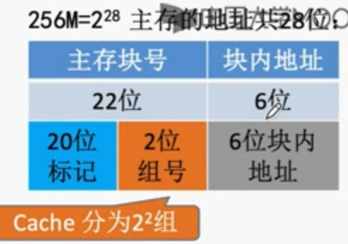
>
> 术语：n路组相联映射——每n个Cache行作为一组

- 如何访存？
  1. 根据组号(主存块号的末尾若干位)确定可能放到哪个Cache**分组**中
  2. 对比标记：分组中的所有块都要参与对比
     - 同理
- 优点：
  - 另外两种方式的折中，综合效果更好
  - 具备全相联映射的自由度，又具备直接映射的对比速度

---

### 三、替换算法

#### (一) 替换算法解决的问题

> ==每次被访问的主存块一定会被立即调入Cache==，而当Cache满了的时候，应该覆盖哪个呢？
>
> 显然，**直接映射**是不需要考虑这个问题的，因为它只有一个可放的地方

#### (二) 随机算法(RAND)

> 随机算法(RAND, Random) 

若Cache已满，则**随机选择一块替换**。

> 实现简单，但完全没考虑**局部性原理**，命中率低，实际效果很不稳定

#### (三) 先进先出算法(FIFO)

> 先进先出算法(FIFO, First In First Out) 

若Cache已满，则替换**最先被调入Cache的块**

> 
>
> 实现简单，最开始按#0#1#2#3放入Cache，之后轮流替换#0#1#2#3即可
>
> FIFO依然没考虑**局部性原理**，最先被调入Cache的块也有可能是被频繁访问的
>
> > Cache命中率很低，还会出现抖动现象
> >
> > > 抖动现象：频繁的换入换出现象(刚被替换的块很快又被调入)

#### (四) :star:近期最少使用(LRU)

> 近期最少使用算法(LRU, Least Recently Used ) 

为每一个Cache块设置一个“计数器”，用于记录每个Cache块已经有多久没被访问了。当Cache满后 替换“计数器”最大的

> 计数器规则：
>
> - 未命中且还有空闲行时，新装入的行的计数器置0，其余<u>非空闲</u>全加1
>
> - 命中时，所命中的行的计数器清零，<u>**比其低的**</u>计数器加1，其他不变
>
>   > 比其高的没必要加1，因为也能达到同样的效果，而且还可以**限制计数器的大小**
>
> - 未命中且无空闲行时，计数值最大的行的信息块被淘汰0，
>   新装行的块的计数器置0，其余全加1。
>
> 
>
> > 这里计数器只可能出现0123这四种数字，且除了0之外不会重复

LRU算法基于“局部性原理”，近期被访问过的主存块，在不久的将来也很有可能被再次访问，因此淘汰最久没被访问过的块是合理的。LRU算法的实际运行效果优秀

> 若被频繁访问的主存块数量 > Cache行的数量，则有可能发生“抖动”，如：{1,2,3,4,5,1,2,3,4,5,1,2...}

#### (五) 最近不经常使用(LFU)

> 最不经常使用算法(LFU, Least FrequentlyUsed )

为每一个Cache块设置一个“计数器”，用于记录每个Cache块被访问过几次。当Cache满后替换“计数器”最小的

> 计数器规则
>
> - 新调入的块计数器=0，之后每被访问一次计数器+1。需要替换时，选择计数器最小的一行
>
>   > 计数器有可能变成一个很大的数
>
> 

曾经被经常访问的主存块在<u>未来不一定会用到</u>

> 如：微信聊天相关的块

并没有很好地遵循**局部性原理**，因此实际运行效果不如LRU

---

### 四、写策略

#### (一) 总览

- 写命中
  - 全写法
  - 写回法
- 写缺失
  - 写分配法
  - 非写分配法

> 为什么在这里不讨论读命中、读缺失的情况？
>
> 因为这里要解决的是**数据一致性**的问题

#### (二) 写命中-写回法

> write-back

当CPU对Cache写命中时，只修改Cache的内容，而不立即写入主存，
<u>只有当此块**被换出**时才写回主存</u>

> 那怎么知道是否被修改过：增加一个**脏位**

减少了**访存次数**，但存在数据不一致的隐患

#### (三) 写命中-全写法

> 也叫**写直通法**，write-through

当CPU对Cache写命中时，必须把数据同时写入Cache和主存

访存次数增加，速度变慢，但能保证数据一致性；

> 为了尽量减少访存次数，可以使用**写缓冲**(write buffer)，
>
> 写缓冲用SRAM实现，与CPU交互很快
>
> 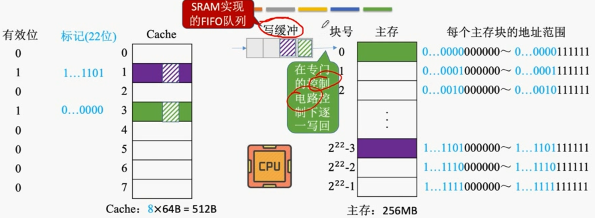
>
> 使用写缓冲，CPU写的速度很快，若写操作不频繁，则效果很好。
> 若写操作很频繁，可能会因为写缓冲饱和而发生阻塞

#### (四) 写缺失-写分配法

>写分配法(write allcate)

当CPU对Cache写不命中时，把主存中的块调入Cache，在Cache中修改。通常搭配**写回法**使用。

#### (五) 写缺失-非写分配法

> 非写分配法(not-write-allocate)

当CPU对Cache写不命中时只写入主存，<u>不调入Cache</u>。搭配**全写法**使用。

> 多级Cache
>
> 
>
> > 尽量少访问主存

---

---

## 第八节：页式存储器

---

### 一、概述

页式存储系统：一个程序(进程)在逻辑上被分为若干个大小相等的”页面”，**“页面”大小与“块”的大小相同**。每个页面可以离散地放入不同的主存块中

> 这里的分页主要是<u>逻辑</u>层面的分，而主存与Cache的分块是<u>物理</u>层面的分

---

### 二、程序的存储与读取

#### (一) 虚地址与实地址

逻辑地址(虚地址)：**程序员**视角看到的地址

物理地址(实地址)：实际在**主存**中的地址

> 逻辑页号与主存块号就有了**映射关系**，为了记录这种映射关系，操作系统中需要有一个**页表**

#### (二) 页表

> 页表存储在**主存**中，所以CPU在进行<u>地址转换</u>时，需要**访存**

#### (三) 地址变换过程

先通过**页表基址寄存器**，找到主存中的**页表**，然后根据**逻辑页号**，找到页表项，从而找到**主存块号**，然后把主存块号与**页内地址**拼接，得到最终的物理地址

> 注：根据程序局部性原理，被访问到的**页表项**也会放到<u>更高速的存储器</u>中，不然之后还要访问主存

#### (四) 快表与慢表

引入快表，减少访存，加快从**逻辑地址**向**物理地址**的转换速度

> 快表用的是SRAM，比主存快

> 当然快表中<u>不可能保存整个页表信息</u>，因为成本高；快表很容易存满，也会有**替换**的问题，替换的是**表项**

---

### 三、总结

---

---

## 第九节：虚拟存储器

---

### 一、概述

> 虚拟：用户感觉到的存储容量大于实际存储容量；
> 其实是将辅存中的数据调入内存

> 

---

### 二、页式虚拟存储器

> 页表不仅要记录映射关系，还要记录程序“页”**有没有调入主存**，并记录**外存块号**；
>
> <u>访问位</u>是为了实现**页面替换算法**；
>
> <u>脏位</u>：记录是否被更改

---

### 三、段式虚拟存储器

#### (一) 与页式存储相比

#### (二) 概述

---

### 四、段页式虚拟存储器

---

---

---

# 第四章：指令系统

---

---

## 第一节：指令格式

---

### 一、根据地址码数目不同分类

> 指令(又称机器指令) :
>
> 是指示计算机执行某种操作的命令，是计算机运行的最小功能单位。
>
> > 一条指令通常要包括**操作码**字段和**地址码**字段两部分:
>
> 指令集：
>
> 一台计算机的**所有指令的集合**构成该机的指令系统，也称为指令集。
>
> >注：一台计算机只能执行自己**指令系统**中的指令，不能执行其他系统的指令
>
> > Eg：x86 架构（PC）、ARM 架构（手机）

#### (一) 零地址指令

- **不需要**操作数

  - 空操作、停机、关中断等指令

- 操作数**隐含**

  - 比如堆栈计算机，两个操作数<u>隐含</u>存放在<u>栈顶和次栈项</u>，计算结果压回**栈顶**

    > 比如用**后缀表达式**进行计算

#### (二) 一地址指令

- 只需要<u>单操作数</u>

  > 如加1、减1、取反、求补等

  > 指令含义：==OP(A~1~)$\rarr$A~1~==

  > 完成一条指令需要<u>3次访存</u>：取指$\rarr$读A~1~$\rarr$写A~1~

- 需要<u>两个操作数</u>，但其中一个操作数隐含在某个**寄存器**（如隐含在*ACC*）

  > 指令含义：==(ACC)OP(A~1~)$\rarr$ACC==

> 注：A~1~代表主存地址，(A~1~)代表主存中的数据

#### (三) 二地址指令

- 需要**两个操作数**，进行<u>算术运算</u>、<u>逻辑运算</u>相关指令

  > 指令含义：==(A~1~)OP(A~2~)$\rarr$A~1~==

  > 完成一条指令需要<u>4次访存</u>：取指$\rarr$读A~1~$\rarr$读A~2~$\rarr$写A~1~

#### (四) 三地址指令

- 需要**两个操作数**，进行<u>算术运算</u>、<u>逻辑运算</u>相关指令

  >指令含义：==(A~1~)OP(A~2~)$\rarr$A~3~==

  > 完成一条指令需要<u>4次访存</u>：取指$\rarr$读A~1~$\rarr$读A~2~$\rarr$写A~3~

#### (五) 四地址指令

- 除了**下址**以外，其他都与<u>三地址指令</u>类似

  >指令含义：==(A~1~)OP(A~2~)$\rarr$A~3~==，==A~4~=下一条将要执行指令的**地址**==

>正常情况下：取指令之后<u>*PC+1*</u>，指向下一条指令
>四地址指令：执行指令后，<u>将PC的值修改为A4所指地址</u>
>
>> 当然这会导致寻址能力变差

---

### 二、根据指令长度分类

> 回顾“**字长**”相关概念：
>
> - <u>指令字长</u>：一条**指令**的总长度
>
>   > 可能会变
>
> - <u>机器字长</u>：**CPU**进行一次整数运算所能**处理的二进制数据的位数**
>
>   > 通常和**ALU**直接相关
>
> - <u>存储字长</u>：一个**存储单元**中的二进制代码位数
>
>   > 通常和**MDR**位数相同

#### (一) 指令长度

> 指令长度是**机器字长**的多少倍

- 半字长指令
- 单字长指令
- 双字长指令

> 指令字长会影响**取指令所需时间**

#### (二) 指令字结构

- <u>定长</u>指令字结构：指令系统中所有指令的**长度都相等**
- <u>变长</u>指令字结构：指令系统中**各种指令的长度不等**

---

### 三、根据操作码的长度不同分类

> 指令是由**操作码**和**地址码**组成的

#### (一) 定长操作码

指令系统中所有指令的**操作码长度都相同**

> n位$\rarr$2^n^种指令

> 控制器的译码电路<u>设计简单</u>，
> 但<u>灵活性较低</u>

#### (二) 可变长操作码

指令系统中各指令的**操作码长度可变**

> 控制器的译码电路<u>设计复杂</u>，
> 但<u>灵活性较高</u>

---

### 四、根据操作类型分类

> *数据传送类：*进行主存和CPU之间的数据传送
>
> *运算类：*算术、逻辑、移位
>
> *程序控制类：*改变程序的执行顺序
>
> *输入输出类：*进行CPU和I/O设备之间的数据传送

#### (一) 数据传送

- LOAD

  把**存储器**中的数据放到**寄存器**中

  > 存储器$\rarr$寄存器

- STORE

  把**寄存器**中的数据放到**存储器**中

  > 寄存器$\rarr$存储器

#### (二) 算术逻辑操作

- 算术

  加、减、乘、除、增1、减1、求补、浮点运算、十进制运算

- 逻辑

  与、或、非、异或、位操作、位测试、位清除、位求反

#### (三) 移位操作

算术移位、逻辑移位、循环移位（带进位和不带进位）

#### (四) 转移操作

- 无条件转移

  JMP

- 条件转移

  - JZ：结果为0
  - JO：结果溢出;
  - JC：结果有进位

- 调用和返回

  CALL和RETURN

- 陷阱(Trap)与陷阱指令

> 实现程序执行流跳转，本质上就是改变PC

#### (五) 输入输出操作

CPU寄存器与IO端口之间的数据传送

> 端口即IO接口中的寄存器

---

### 五、扩展操作码

> ==扩展操作码指令格式 = 定长指令字结构 + 可变长操作码==
>
> > <u>不同地址数</u>的指令使用<u>不同长度的操作码</u>

#### (一) 举例

指令字长为16位，每个地址码占4位；

基本操作码OP占4位

全1通常会留作扩展操作码，除了零地址指令

> 这只是一种举例，还有其他设计方法

#### (二) 设计时注意事项

1. 不允许短码是长码的**前缀**

   > 即短操作码不能与长操作码前面部分的代码相同

2. 各指令的操作码一定**不能重复**

> 通常情况下，对**使用频率较高**的指令，分配**较短的操作码**；
> 对**使用频率较低**的指令，分配**较长的操作码**，
> 从而尽可能<u>减少指令译码和分析的时间</u>。
>
> > 可以对比<u>哈夫曼编码树</u>的设计思想

> 再举例：
>
> 
>
> 注意这个**计算状态数**的逻辑

#### (三) 指令操作码总结

*操作码* 指出指令中该指令应该执行什么性质的**操作**和具有何种**功能**。

*操作码* 是识别指令、了解指令功能与区分操作数地址内容的组成和使用方法等的关键信息。

> 例如，指出是算术加运算，还是减运算；是程序转移，还是返回操作。

操作码分类：

- 定长操作码：在指令字的<u>最高位部分</u>分配**固定的若干位(定长)**表示操作码。

  > 一般n位操作码字段的指令系统最大能够表示2^n^条指令。

  - 优：定长操作码对于简化计算机硬件设计，提高指令译码和识别速度很有利;
  - 缺：指令数量增加时会占用更多固定位，留给表示操作数地址的位数受限。

- 扩展操作码(不定长操作码)：
  全部指令的操作码字段的位数不固定，且分散地放在指令字的不同位置上。

  > 最常见的变长操作码方法是**扩展操作码**，使操作码的长度随地址码的减少而增加，
  > 不同地址数的指令可以具有不同长度的操作码，
  > 从而在满足需要的前提下，有效地缩短指令字长。

  - 优：在指令字长有限的前提下仍保持比较丰富的指令种类;
  - 缺：增加了<u>指令译码和分析的难度</u>，使控制器的设计复杂化

---

---

## 第二节：寻址

---

### 一、指令寻址

#### (一) 指令寻址的概念

- 下一条欲执行指令的地址

> 始终由程序计数器 PC 给出

#### (二) 顺序寻址

$\Rarr$系统采用**定长**指令字结构或**变长**指令字结构、主存按**存储字**编址或按**字节**编址

- 定长 + 存储字 ：顺序加 **1** 即可

- 定长 + 字节 ：每次加**存储字长的字节数**即可

- 变长 + 字节：

  - 读入一个字，根据操作码判断这条指令的总字节数n,
  - 修改PC的值：(PC) + n →PC
  - 根据指令的类型，CPU可能还要进行多次访存，每次读入一个字

  

$\Rarr$统一：PC + "1" $\rarr$ PC

#### (三) 跳跃寻址

$\Rarr$系统采用**定长**指令字结构或**变长**指令字结构、主存按**存储字**编址或按**字节**编址

- 定长 + 存储字 

  - 先正常顺序加 1

  - 直到遇到**转移指令**

    > 例如：JMP CALL，会让 PC 的值直接改成某个值

---

### 二、数据寻址

---

> 数据寻址：确定<u>本条指令的地址码</u>指明的**真实地址**
>
> > 地址码的含义不一定是直接的内存地址；
> >
> > 对地址码的解读方式有很多种

#### (零) 概述

##### 1、一地址

> 新增了==寻址特征==

##### 2、多地址

#### (一) 直接寻址

- 指令字中的形式地址A就是操作数的真实地址EA，即EA=A  

- 优点：简单，指令执行阶段仅访问一次主存，不需专门计算操作数的地址。

  >条指令的执行：取指令访存1次，执行指令访存1次，暂不考虑存结果，共访存2次

- 缺点：A的位数决定了该指令操作数的寻址范围；操作数的地址不易修改。

#### (二) 间接寻址

- 指令的地址字段给出的形式地址不是操作数的真正地址，
  而是<u>操作数有效地址所在的**存储单元的地址**</u>

  > 也就是操作数地址的地址，即EA=(A)
  >
  > 注：()相当于解引用

  > 可以有多次间接寻址：
  >
  > 

- 优点：

  - 可扩大寻址范围

    > 有效地址EA的位数大于形式地址A的位数

  - 便于编制程序

    > 用间接寻址可以方便地完成子程序返回

- 缺点：指令在执行阶段要多次访存

  > 一次间址需两次访存，多次寻址需根据存储字的最高位确定几次访存

#### (三) 寄存器寻址

- 在指令字中直接给出操作数所在的**寄存器编号**

  > 即<u>EA = R</u>，其操作数在由R所指的寄存器内

  >一条指令的执行：取指令访存1次，执行指令访存0次，暂不考虑存结果，共访存1次

- 优点:

  - 指令在**执行阶段**不访问主存，只访问**寄存器**
  - 指令字短且执行**速度快**，支持向量/矩阵运算

- 缺点：寄存器价格昂**贵**，计算机中**寄存器个数有限**

#### (四) 寄存器间接寻址

- 寄存器R~i~中给出的不是一个操作数，而是操作数所在**主存单元的地址**

  > 即<u>EA=(R~i~)</u>

  >1条指令的执行：取指令访存1次，执行指令访存1次，暂不考虑存结果，共访存2次

- 特点：

  - 与一般间接寻址相比速度更快

  - 但指令的执行阶段需要访问主存

    > 因为操作数在主存中

#### (五) 隐含寻址

> 比较奇葩

- 不是明显地给出操作数的地址，而是在指令中隐含着操作数的地址

  > 

- 优点：有利于缩短**指令字长**

- 缺点：需增加存储操作数或隐含地址的**硬件**

#### (六) 立即寻址

> 也比较奇葩

- <u>形式地址 A</u> 就是操作数本身，又称为**立即数**，一般采用补码形式。

  > #表示立即寻址特征

  >一条指令的执行：取指令访存1次，执行指令访存0次，暂不考虑存结果，共访存1次

- 优点：指令执行阶段不访问主存，指令执行时间最短

- 缺点

  - **A的位数**限制了立即数的范围

    > 如A的位数为n，且立即数采用补码时，可表示的数据范围为 - 2^n-1^ ~ 2^n-1^ - 1；

> 总结一：
>
> 

#### (七) 偏移寻址

> :star:概述
>
> 
>
> 基址寻址：以程序的起始存放地址作为“起点
> 变址寻址：程序员自己决定从哪里作为“起点”
> 相对寻址：以程序计数器PC所指地址作为“起点”

##### 1、基址寻址

- 将CPU中==基址寄存器(BR)==的内容加上指令格式中的形式地址A,而形成操作数的有效地址

  > 即==EA=(BR)+A==；
  >
  > BR：Base address Register
  >
  > EA：Effective Address

  > 专用：
  >
  > 
  >
  > 通用：
  >
  > 
  >
  > >在指令中指明，要将<u>哪个通用寄存器</u>作为基址寄存器使用；
  > >
  > >R~0~ 的位数要看通用寄存器有几个

- 优点：**便于程序“浮动”**，方便实现多道程序并发运行

  > 拓展：
  >
  > 程序运行前，CPU将<u>BR的值</u>修改为该程序的**起始地址**
  >
  > > 存在操作系统PCB中

>注:
>
>基址寄存器是<u>面向操作系统</u>的，其内容由<u>操作系统或管理程序</u>确定。
>
>在程序执行过程中，基址寄存器的内容不变(作为基地址)，形式地址可变(作为偏移量)。
>
>当采用通用寄存器作为基址寄存器时，可由用户决定<u>哪个寄存器作为基址寄存器</u>，但其内容仍由<u>操作系统</u>确定。
>
>> 这样做的优点：
>>
>> - 可扩大寻址范围
>>
>>   > 基址寄存器的位数大于形式地址A的位数
>>
>> - 用户不必考虑自己的程序存于主存的哪一空间区域
>>
>> - 故有利于多道程序设计，以及可用于编制浮动程序
>>
>>   > 整个程序在内存里边的浮动

##### 2、变址寻址

- 有效地址EA等于指令字中的形式地址A与变址寄存器IX的内容相加之和

  > 即EA= (IX)+A
  >
  > 其中IX可为变址寄存器(专用)，也可用通用寄存器作为变址寄存器
  >
  > 

  > IX：Index Register

- 与基址寻址区别：

  - 将 IX 视为**偏移量**，认为形式地址 A 不变（作为**基地址**）
  - 变址寄存器**面向用户**，在程序执行过程中，变址寄存器的内容可**由用户改变**

  > 应用举例：
  >
  > 
  >
  > 在数组处理过程中，可设定<u>A为数组的首地址</u>，不断<u>改变变址寄存器IX的内容</u>，便可很容易形成数组中任一数据的地址，特别适合**编制循环程序**。

- 优点：

  - 适合**编制循环程序**

    > 在数组处理过程中，可设定A为数组的首地址，不断改变变址寄存器IX的内容，便
    > 可很容易形成数组中任一数据的地址

##### 3、基址&变址复合寻址

> 可以理解为复合函数

> 这里是假如把地址改成 100+ 了

##### 4、相对寻址

- 把**程序计数器PC**的内容加上指令格式中的**形式地址A**而形成操作数的**有效地址**

  > 即<u>EA=(PC)+A</u>，其中***A***是**相对于PC**所指地址的**位移量**，可正可负，**补码**表示

  > 
  >
  > 注意，PC 取出当前指令后就立即加一，与指令的执行无关

  > 作用举例：
  >
  > 
  >
  > > 拓展：ACC 加法指令的地址码可采用“分段”方式解决，即程序段、数据段分开

- 优点：

  - 操作数的地址不是固定的，它随着PC值的变化而变化，并且与指令地址之间总是
    相差一个固定值，因此**便于程序浮动**

    > 相对寻址的浮动指的是：一段代码在程序内部的浮动
    >
    > 基址寻址的浮动指的是：整段程序在内存中的浮动

    > 相对寻址广泛应用于**转移指令**

> 总结：
>
> 

> 补充：硬件中数的比较
>
> 

#### (八) 堆栈寻址

- 堆栈寻址：操作数存放在堆栈中，隐含使用堆栈指针(SP)作为操作数地址

  > *SP*：*Stack Pointer*

- 堆栈是存储器（或专用寄存器组）中一块特定的、
  按“后进先出（*LIFO*）”原则管理的存储区，

  - 该存储区中被读/写单元的地址是用一个特定的寄存器给出的

    > 该寄存器称为堆栈指针(SP)。

- 堆栈的<u>实现方式</u>

  - *专用寄存器组*

    

    > 这种方式也叫**硬堆栈**，速度快，但成本高

  - *在主存中划分区域*

    

    >这种方式也叫**硬堆栈**，速度慢（需要<u>访存</u>），但成本低；
    >
    >实际的系统通常也使用软堆栈

  > 堆栈可用于**函数调用**时保存当前函数的相关信息

> 大总结：
>
> 

---

---

## 第三节：CISC和RISC

---

### 一、概述

#### (一) CISC 与 RISC 的设计思路

- CISC

  - Complex Instruction Set Computer
  - 设计思路：一条指令完成一个复杂的基本功能。

  > 代表: x86架构，主要用于笔记本、台式机等

  >80-20规律：典型程序中80%的语句仅仅使用处理机中20%的指令

- RISC

  - Reduced Instruction Set Computer
  - 设计思路：一条指令完成一个基本“动作”；多条指令组合完成一个复杂的基本功能。

  > 代表: ARM架构、MIPS架构，主要用于手机、平板等

#### (二) 两种设计思路比较

- CISC 对硬件的要求常常较高，用硬件实现许多复杂的指令

  > 对于特别复杂的指令，纯硬件几乎无法实现，可以采用“存储程序”的设置思想

- RISC 只有硬件提供一些基本指令

  > 一条指令一个电路，电路简单，功耗较低；
  >
  > 可以“并行”、“流水线”，因为基本指令的执行时间都差不多

#### (三) 对比

---

---

---

