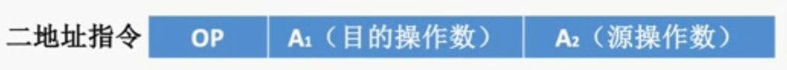
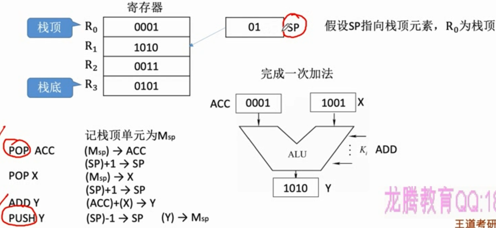

----

---

---

# 第一章：计算机系统概述

---

---

## 第一节：计算机发展历程

---

### 零、什么是计算机系统

#### (零)“计算机组成原理”的地位

#### (一)计算机系统的组成

#### (二)软件的分类

---

### 一、计算机硬件的发展

#### (一)计算机四代变化

##### 1、电子管时代(1946-1957)

- 第一台电子数字计算机：***ENIAC(Electronic Numerical Integrator And Computer)***

- 逻辑元件采用**电子管**

  > 体积庞大，成本高（电子管耗电量高）

  > 运算速度较低，几千次到几万次每秒

- 使用**机器语言**进行编程

  > 要借助<u>纸带机</u>

##### 2、晶体管时代(1958-1964)

- 逻辑元件采用**晶体管**

  > 体积稍小，但<u>焊接晶体管并不可靠</u>
  
  > 运算速度稍有提升（几万次到几十万次每秒）

- 软件开始使用**高级语言**

  > <u>FORTRAN语言</u>诞生，有了**操作系统**的雏形

##### 3、中小规模集成电路时代(1965-1971)

- 逻辑元件采用**中小规模集成电路**

  > 将元件集成在基片上，体积更小，可靠性更高

- 高级语言发展迅速，操作系统进一步发展

  > 开始出现**分时操作系统**
  >
  > （但计算机还是主要用于<u>科学计算</u>等专业用途）

##### 4、大规模集成电路时代(1972-)

- 逻辑元件采用**大规模和超大规模集成电路**

  > 产生了<u>微处理器</u>（CPU）、微型计算机
  >
  > <u>个人计算机</u>（PC）萌芽

- 著名操作系统诞生：***Windows***、***MacOS***、***Linux***

#### (二) 计算机元件的更新换代

##### 1、微处理器的发展

> 以 Intel 公司开发的微处理器为例

##### 2、摩尔定律

- 集成电路上可容纳的**晶体管数目**，每隔**<u>18个月</u>**便会增加一倍，整体**性能**也将提升一倍

> <u>揭示了信息技术进步的速度</u>

##### 3、半导体存储器的发展

- 半导体单芯片**存储器**也遵循摩尔定律，每<u>两年</u>**容量**增长一倍

---

### 二、计算机软件的发展

#### (一)编程语言的发展（应用软件的发展）

- 机器语言与汇编语言

  > 编程时要关心**机器的具体特性**，<u>不能离开机器</u>而独立存在

  > 软件难以发展

- 高级语言

  > 应用软件开始丰富

#### (二)操作系统的发展

- 命令行操作系统

  > 比如 DOS 系统

- 图形化操作系统

  > Windows、Android、iOS

---

### 三、计算机发展趋势

#### (一)“两极”分化

- 一极是**微型计算机**向着更**微型化**、**网络化**、**高性能**、**多用途**方向发展
- 另一极是**巨型机**向更**巨型化**、**超高速**、**并行处理**、**智能化**方向发展

---

---

## 第二节：计算机系统层次结构

---

### 一、计算机硬件的基本组成

#### (一)早期的冯·诺依曼机

##### 1、存储程序

- 将**指令**以<u>二进制代码</u>的形式提前输入计算机的<u>**主存储器**</u>中，然后按其在存储器中的**首地址**执行程序的<u>第一条指令</u>，之后按规定顺序执行其他指令，直到程序执行结束

  > 在此之前，是程序**手动接线**来控制 ENIAC 进行计算，
  >
  > 直到作为<u>顾问</u>的冯·诺依曼提出了“**存储程序**”这个概念，程序员就不需要每一步都去手动接线了，这就**大幅度提升了计算速度**

  - 有了“存储程序”这个概念，第一台采用冯诺依曼结构的计算机 ***EDVAC***(***Electronic Discrete Variable Automatic Computer***) 就诞生了

##### 2、硬件结构

> 输入设备会将信息转换成机器能识别的**二进制**的形式；
>
> 控制器会用电信号协调其他部件，也会**解析**<u>存储器</u>中存储的**程序指令**

> 在计算机系统中，==**软件**和**硬件**在<u>逻辑</u>上是等效的==。
>
> 同一个功能用**软件**实现**成本较低**但**效率也较低**，用**硬件**实现**成本较高**但**效率高**
>
> > 比如，对于乘法运算，
> >
> > 可以使用软件的方式，执行<u>多次加法指令</u>；
> >
> > 也可以使用硬件的方式，设计一个<u>专门的硬件电路</u>实现乘法运算

##### 3、特点

- 计算机由五大部件组成

- **指令**和**数据**用**二进制**表示，以<u>同等地位</u>存储在**存储器**中，可按地址[寻访]()

- 指令由**操作码**和**地址码**组成

- **存储程序**

- 以**运算器**为<u>中心</u>

  > 比如，<u>I/O 设备与存储器</u>之间的**数据传送**要通过**运算器**完成
  >
  > 这也导致**数据计算**的效率降低

#### (二)现代计算机的组织结构

- **==以存储器为中心==**，让运算器进行更高效的运算

- ***CPU* = 运算器 + 控制器**

  > 运算器与控制器之间的逻辑关系十分紧密，被集成在了同一个芯片上，也就是 CPU

#### (三) 主机中的功能部件

##### 1、主存储器

- 存储体

  - 由一系列**存储元件**构成，存放二进制的 0 和 1

  - 用于存放**数据**，数据在存储体中按**地址**存储

  - **存储单元**：每个存储单元存放一串**二进制代码**，也就是存放一个**存储字**

    > 每个存储单元会对应有一个**地址**，也放到是 <u>MAR 中的地址</u>

    > 存储元：存储二进制的**电子元件**，每个存储元可以存储 <u>1bit</u>
    >
    > > 这个电子单元通常是可以存放电荷的<u>电容</u>
    >
    > <u>存储单元 = 存储元 + 线路</u>

  - **存储字**(word)：存储单元中**二进制代码**的组合

  - **存储字长**：<u>存储单元</u>中**二进制代码的位数**，也就是**存储字的位数**

    > 通常是 8bit 的整数倍

- ***MAR***(***Memory Address Register***)

  - 存储地址寄存器

  - <u>MAR 的位数</u>反映**存储单元**的个数

    >读操作：CPU 会将要访问的数据的**地址**写到 MAR 中
    >
    >写操作：CPU 会将要写入的**地址**写到 MAR 中

- ***MDR***(***Memory Data Register***)

  - 存储数据寄存器

  - <u>MDR 的位数</u>和**存储字长**保持一致

    > 读操作：按地址找到的**数据**，会<u>先写到 MDR</u> 中，再被 CPU 取走
    >
    > 写操作：CPU 会将要写的**数据**写到 MDR 中

> :star:MAR 与 MDR 的位数问题
>
> 

##### 2、运算器

- 功能：实现**算术**运算、**逻辑**运算
- ***ACC***(***Accumulator***)：**累加器**，存放操作数或运算结果
- ***MQ***(***Multiple-Quotient Register***)：**乘商寄存器**，在<u>乘、除运算</u>时，用于存放操作数或运算结果
- ***X***：通用的**操作数寄存器**，用于存放操作数
- ==***ALU***==(***Arithmetic and Logic Unit***)：**算术逻辑单元**，通过内部<u>复杂的电路</u>实现算数运算、逻辑运算，运算器的核心部件

> :star:作用
>
> 

> 机器字长：运算器的位数；能直接处理的二进制数据的位数

##### 3、控制器

- ==***CU***==(***Control Unit***)：**控制单元**，分析指令，给出控制信号
- ***IR***(***Instruction Register***)：**指令寄存器**，存放<u>当前</u>执行的**指令**
- ***PC***(***Program Counter***)：**程序计数器**，存放<u>下一条</u>指令**地址**，有自动加 1 功能

	> 完成一条指令：
	>
	> 

---

### 二、==:star:计算机系统工作过程举例:star:==

---

### 三、计算机系统层次结构

#### (一) 机器层次结构

> - 微指令与机器语言
>
>   - 二进制的**机器语言**指令会被解释成更精细的**微指令**
>
> - 汇编语言
>
>   - 二进制指令编程太不方便，出现<u>符号式</u>的**汇编语言**
>
>   - 机器好像能直接识别汇编程序，称为<u>虚拟机</u>
>
>   - 但仍需翻译成机器语言，**汇编语言**指令和**机器语言**指令**一一对应**
>
>     > 所以汇编语言也是低级语言
>
> - 高级语言
>
>   - 机器好像能直接识别高级语言程序，也称为<u>虚拟机</u>
>   - 需要先翻译成**汇编语言**，再翻译成**机器语言**

#### (二) 语言层次结构

> - **编译**程序：将<u>高级语言编写的源程序</u>**全部**语句**一次全部**翻译成<u>机器语言程序</u>，而后再执行机器语言程序（**只需翻译一次**）
> - **解释**程序：将源程序的一条语句翻译成对应于机器语言的语句，并立即执行，紧接着再翻译下一句（**每次执行都要翻译**）

---

---

## 第三节：计算机的性能指标

---

### 一、计算机的主要性能指标

#### (一) 存储器的性能指标

- 总容量

  

  > 字节(B)相关单位：
  >
  > 

#### (二) ==CPU的性能指标==

- **CPU主频**：CPU内<u>数字脉冲信号</u>**振荡**的频率

  > 每秒中会经历的**时钟周期个数**

  

- ***CPI(Clock cycle Per Instruction)***：执行一条指令所需的时钟周期数

  > 不同的指令，CPI不同。甚至相同的指令，CPI也可能有变化

  > $执行一条指令的耗时=CPI\times CPU时钟周期$
  >
  > $CPU执行时间(整个程序的耗时) =CPU时钟周期数/主频= (指令条数\times CPI) /主频$

  > 常用计算的指标是**<u>平均CPI</u>**

- ***IPS(Instructions Per Second)***：**每秒**执行多少条**指令**

  > $IPS=\frac{主频}{平均CPI}$

- ***FLOPS(Floating point Operations Per Second)*** ：**每秒**执行多少次**浮点运算**

  > IPS和FLOPS前面可以加一些数量单位，表示<u>CPU数据运算速率</u>
  >
  > 
  >
  > > CPU主频的单位也是这样

#### (三) 系统整体的性能指标

- *数据通路带宽*：数据总线一次所能**并行**传送信息的位数

  > 各**硬件部件**通过数据总线传输数据

- *吞吐量*：系统在**单位时间**内处理**请求**的数量

  > 这里的“请求”在不同场景下是不同的

  > 它取决于信息能多快地输入内存，CPU能多快地取指令，数据能多快地从内存取出或存入，以及所得结果能多快地从内存送给一台外部设备。这些步骤中的每一步都关系到**主存**，因此，系统吞吐量主要取决于<u>主存的存取周期</u>。

- *响应时间*：指从用户向计算机发送一个请求，到系统对该请求做出响应并获得它所需要的结果的等待时间

  > 通常包括**CPU时间**(运行一个程序所花费的时间)与**等待时间**(用于磁盘访问、存储器访问、I/O操作、操作系统开销等时间)

> 基准程序：
>
> 基准程序是用来测量**计算机处理速度**的一种实用程序，以便于被测量的计算机性能可以与运行相同程序的其它计算机性能进行**比较**
>
> > 跑分软件

> 计算机性能相关思考题：
>
> 

---

### 二、几个专业术语

有待补充......

---

---

---

# 第二章：数据的表示和运算

---

---

## 第一节：数制与编码

---

### 一、进位计数制

#### (一) 十进制、二进制、八进制、十六进制

> **符号反映<u>权重</u>** + 基于“<u>乘法</u>”思想的计数方法

- 十进制

  

  > 逢**十进**一

- :star:**r进制**

  - 基数：每个**数码位**所用到的**不同符号**的个数，r进制的基数为r

    > **基数**和**位权底数**保持一致

  - 其他进制到十进制：**位权数码**<u>乘积和</u>

  

  > 其他进制的加法和十进制类似

- 二进制

  - ①可使用**两个稳定状态**的<u>物理器件</u>表示
  - ②0，1正好对应**逻辑值**假、真。方便实现逻辑运算
  - ③可很方便地使用**逻辑门电路**实现算术运算

#### (二) 其他进制$\rarr$十进制

- **位权数码**<u>乘积和</u>

#### (三) 二进制、八进制、十六进制互相转换

- 二进制$\rarr$八进制、十六进制：每3、4个一组，必要补0
- 八进制、十六进制$\rarr$二进制：每位数码转换为3、4个二进制数码

#### (四) 十进制$\rarr$其他进制

- 整数部分：**除基取余**法，每次得到的余数是当前最低位，直到结果剩下0

  

- 小数部分：**乘基取整**法，每次得到的整数部分是当前最高位，直到结果剩下0或**循环**

  

- **拼凑法**

  
  
  > 先把每个位的权重写出来，再在权重下面写数

> 十进制先转换成二进制，再转换成其他进制

#### (五) 真值和机器数

- 真值:符合人类习惯的数字
- 机器数:数字实际存到机器里的形式，正负号需要被“数字化”

---

### 二、BCD码

> 二进制与十进制之间精确转换较为麻烦；
>
> 每<u>4位二进制数</u>作为一个**符号**整体代表<u>1位十进制</u>， 方便快捷

#### (一) 8421码

- 映射关系：最直接的映射

  

- 运算：溢出**加六**

  

  > 相加结果落在1010~10010之间

#### (二) 余3码

- 映射关系：加3

  

  > 注：每一位的权值是变化的，称为无权码

#### (三) 2421码

- 映射关系：改变权值定义

  

  > 也是一种有权码；
  >
  > 大于等于5时，第一位规定为1

---

### 三、字符与字符串

#### (一) <u>英文字符</u>在计算机内的表示

- ***ASCII*码**

  

  

  > 比如 ACK 就是一个通信字符

  > 数字：48(0011 0000)~57(0011 1001)
  >
  > - 前四位都是0011，后四位是8421BCD码
  >
  > 大写字母: 65(0100 0001)~90(0101 1010)
  >
  > - 前三位都是010，后面五位是1~26
  >
  > 小写字母: 97(0110 0001)~122(0111 1010)
  >
  > - 前三位都是011，后面五位是1~26

#### (二) 中文字符在计算机内的表示

- ***GB 2312-80***

  - 1980年提出，汉字+各种符号共7445个；也叫国标码

- **区位码**$\rarr$**国标码**：横纵坐标，94*94，$(0,93)$

  > ASCII码规定用于**控制和通信**的字符是在***0~31***，
  >
  > 为**传输时防止冲突**，会每个字节加上**20H**， 这就成为了**国标码**

- **汉字机内码**

  >ASCII码规定用于英文字符是在***32~125***，还有126、127两个控制字符
  >
  >为**完全防止冲突**，每个字节就直接加上**128D**，一个汉字占用***2B***（区位），而每个字节都大于128，就可以直接区分ASCII码与中文字符了

- 汉字的输入与输出

  - 输入：**输入编码**

    > 输入编码($\rarr$国标码)$\rarr$汉字内码

  - 输出：**汉字字形码**

    >汉字内码($\rarr$国标码)$\rarr$汉字字形码

#### (三) 字符串的存储

- 无中文字符的字符串

  

- 有中文字符的字符串

  

---

### 四、校验码

> 二进制数据在传输的过程中可能受到环境的干扰而属发生错误，
>
> 怎么检测错误？怎么改正错误？

#### (一) 奇偶校验码

- *情景*

  

- *相关概念*

  - 码字：由若干位代码组成的一个字叫码字。

  - 码字间的距离：
    将两个码字逐位进行对比，具有不同的位的个数称为两个码字间的距离。

  - 码距：一种编码方案可能有若干个合法码字，各合法码字间的最小距离称为“码距”。

    > 码距也意味着，当发生“码距”个错误时，可能跳变到另一个合法状态；
    >
    > 所以码距长一些可能会更好

    > 码距 d 与检测能力：
    >
    > 当d=1时，无检错能力；当d=2时，有检错能力;当d$\ge$3时， 若设计合理，可能具有检错、纠错能力

- *奇偶校验码*

  - 概念

    

  - 校验位与校验

    - **偶校验位**的硬件实现：各信息进行异或(模2加)运算，得到的结果即为偶校验位
    - **偶校验**的硬件实现：各信息进行异或(模2加)运算，得到的结果为1则说明出错

---

---

## 第二节：定点数的表示与运算

---

### 一、定点数的表示

#### (一) 基本概念

- 定点数：小数点的位置固定

  > 比如常规计数，个位之后加小数点

- 浮点数：小数点的位置不固定

  > 比如科学计数法

#### (二) 无符号数

- 无符号数：整个机器字长的全部二进制位均为**数值位**

  > 没有符号位，相当于数的**绝对值**

  > 通常只有无符号**整数**，而没有无符号小数
  >
  > > 比如 C 语言的`unsigned`修饰符

- 表示范围：n 位无符号数的表示范围是 0 ~ $2^n-1$

#### (三) 有符号数

##### 0、概述

> 大于 1 的小数，整数部分和小数部分分别存储；
>
> 数值部分也称“尾数”；
>
> 数值部分每一位的**权值**就是基于<u>隐含小数点位置</u>判断的

> 注：
>
> 可用**原码**、**反码**、**补码**三种方式来表示<u>定点整数</u>和<u>定点小数</u>。
>
> 还可用**移码**表示<u>定点整数</u>。
>
> 若真值为x，则用$[x]_原$、$[x]_反$、$[x]_补$、$[x]_移$
>
> 分别表示真值所对应的原码、反码、补码、移码

##### 1、原码

- 用**尾数**表示真值的**绝对值**，符号位“0/1” 对应“正/负”

  > 若机器字长为 n+1 位，则尾数占 n 位

- 表示范围

  - 原码整数

    

  - 原码小数

    

  > 注意，能表示$2^n-1$个数，而不是$2^n$个，因为 0 被表示了两次

> 书写方式举例：
>
> 

##### 2、反码

- 若符号位为 0 ，则反码与原码相同
- 若符号位为 1 ，则反码是原码的**数值位**全部**取反**

> 整数和小数都一样

> 反码与原码有一一对应的关系，表示范围都一样；
>
> 只是一个中间状态，没什么实际作用

##### 3、补码

- 正数的补码等于原码；
  负数的补码等于反码**末位加 1**

  > 整数和小数都一样；
  >
  > 负数的补码注意**进位**问题，**符号位**也参数进位；
  >
  > 原码$\rarr$补码：补码定义
  >
  > 补码$\rarr$原码：方法相同，都是**尾数取反再加1**

- 表示范围

  - 补码整数

    

    > 规定：$[x]_补=1,0000000$表示$-2^7$；
    >
    > 可以比原码多表示一个，可以再小一点

  - 补码小数

    

    > 规定：$[x]_补=1.0000000$表示$-1$
    >
    > 可以比原码多表示一个，可以再小一点

> :star:技巧 
>
> 由$[x]_补$快速求$[-x]_补$的方法：
>
> 符号位、数值位全部取反，末位+1
>
> **负数补码**与其真值绝对值：
>
> - 负整数真值绝对值：模(128D=1 0000 0000B) - 补码 (包括符号位)
> - 负小数真值绝对值：左边的 0 越多，真值越大 (全 0 就是 -1)

##### 4、移码

- 在补码的基础上，将符号位取反

  > 注意：移码只能用于表示**整数**

- 表示范围：与补码一一对应

- 移码特性：

  

> :star:定点整数表格
>
> 
>
> 原码和反码的真值0有两种表示，补码和移码的真值0只有一种表示，补码和移码可以多表示一一个负数

> 总结：
>
> 

#### (四) 原码补码移码的作用

> 加减运算：
>
> - 如果用**原码**，就需要同时使用**加法器**和**减法器**
>
>   > ALU
>
> - 利用**模运算**的性质，可以用加法代替减法
>
>   > 计算机硬件天然就会**模运算**，因为溢出的高位会被舍弃
>
> - 补码的原生定义，正是“模 - 绝对值”

- 补码的作用

  - 使用补码可将减法操作转变为等价的加法，ALU 中无需集成减法器。

    > 执行加法操作时，**符号位**一起参与运算

- 移码的作用

  

---

### 二、定点数的运算

#### (一) :star:移位运算

##### 1、算数移位

- *原码*：符号位保持不变，仅对数值位进行移位

  > 右移：
  > 高位<u>补 0</u>，低位舍弃。若舍弃的位 = 0，则相当于 ÷ 2；
  > 若舍弃的位不是 0，则会**丢失精度**
  >
  > 左移：
  >
  > 低位<u>补 0</u>，高位舍弃。若舍弃的位=0，则相当于 * 2
  > 若舍弃的位 ≠ 0， 则会出现**严重误差**
  >
  > > 所以某些时候算术移位并不能精确等效于乘除法

  > 正数、负数、整数、小数都同理

- *反码*

  - 正数：与原码同理
  - 负数：0 和 1 反过来

- *补码*

  - 正数：与原码同理

  - 负数

    

    > 补码从右向左到第一个 1 ，都和原码相同，这个 1 之后都和反码相同；
    >
    > 所以，对于补码负数的移位运算，==高位补 1，低位补 0==
    >
    > （小数都同理）

> 算术移位总结：
>
> 

##### 2、逻辑移位

- 逻辑右移:高位补0，低位舍弃。
- 逻辑左移:低位补0，高位舍弃。

> 应用举例：
>
> 

##### 3、循环移位

> 汉字**大端**存储和**小端**存储之间的转换

#### (二) :star:加减运算

#### (三) 乘法运算和除法运算

> 可以基于<u>移位再相加</u>来实现

---

---

## 第三节：浮点数的表示与运算

---

### 一、浮点数的表示

#### (一) 浮点数的作用和基本原理

> 定点数的局限性：定点数可表示的数字范围有限，但我们不能无限制地增加数据的长度
>
> 如何在位数不变的情况下增加数据表示范围?

- 科学计数法理解浮点数

  

- ==*浮点数的表示*==

  - 阶码 (E)：常用补码或移码表示的定点整数

    > 反映小数点的**实际位置**和浮点数的**表示范围**，通常用补码、移码表示

  - 尾数 (M)：常用原码或补码表示的定点小数

    > 数值部分反映**浮点数的精度**，通常用补码、原码表示

  > 浮点数的真值：$N=r^E\times M$ 通常 $r=2^i,i=1$
  >
  > 
  >
  > 二进制，阶码用底数 2 ，小数点直接移动即可
  >
  > > ==<u>尾数</u>给出**小数**，<u>阶码</u>指明**小数点**向左/右移动几位==

#### (二) 浮点数规格化

> 尾数部分长度有限，为了提高精度；
>
> 就像科学计数法的要求一样

- *规格化浮点数*：

  - 规定尾数的**最高数值位**必须是一个有效值。

- *左规*：

  - 当浮点数运算的结果为非规格化时要进行规格化处理，
  - 将尾数算数左移一位，阶码减 1

- *右规*：

  - 当浮点数运算的结果**尾数出现溢出**(双符号位为01或10)时
  - 将尾数算数右移一位，阶码加 1

- *特点*：

  - 原码表示的尾数规格化

    

    > 最高位一定是 1，和科学计数法类似；
    >
    > 注意规格化不包括 0

  - 补码表示的尾数规格化

    

    > 负数的时候让数值位最高位为 0，这是为了方便计算机处理

#### (三) 浮点数的表示范围

#### (四) IEEE 754 标准

> 回顾移码：
>
> IEEE 754 标签中，阶码用移码表示；
>
> 移码的定义：真值 + 偏置值
>
> > 可以规定：8 位移码的偏置值就是 1000 0000B，即 $2^{n-1}D$；
> >
> > 其计算规律是：补码的符号位取反
>
> > 在 IEEE 754 中，偏置值为 01111111B，即 $(2^{n-1}-1)D$
>
> 

- **尾数**遵循规格化，又将最高位的 1 省略 (算术左移之后)

- **阶码**真值的正常范围是：-126 ~ 127

  > IEEE 754 阶码全 1 、全 0 有特殊用途

- 计算真值的方法：

  

  > 

- 特殊情况

  - 绝对值太小了：让**阶码全为 0** ，**尾数非规格化**

    > 阶码全为 0 的移码的真值其实是 -127，但这里就强行规定成 ***-126***；
    >
    > 尾数可以不遵循规格化，且之前隐含的最高位也变成 0 了

    > 如果阶码和尾数都为 0 ，就表示 ±0

  - 绝对值太大了：不再代表具体的数

    - 如果**阶码全为 1**、尾数全为 0，就表示 ±$\infin$
    - 如果**阶码全为 1**、尾数不全为 0，表示 NaN

  > 

---

### 二、浮点数的运算

---

---

---

# 第三章：存储系统

---

---

## 存储系统基本概念

---

### 一、存储器的层次结构

#### (一) 结构

> 辅存和外存有时区分不明显，注意分辨；
>
> 一般认为U盘属于外存；
>
> 硬盘有固态硬盘和机械硬盘，固态硬盘会更快

#### (二) 交互

> 主存-辅存：
>
> 实现了**虚拟存储系统**，解决了<u>主存容量不够</u>的问题
>
> Cache-主存：
>
> 解决了主存与CPU速度不匹配的问题

----

### 二、存储器的分类

#### (一) 层次

#### (二) 存储介质

- 半导体存储器
  - 主存、Cache
  - 以**半导体**存储信息
- 磁表面存储器
  - 磁盘(硬盘)、磁带
  - 以**磁性材料**存储信息
- 光存储器
  - 以光介质存储信息

#### (三) 存取方式

- 随机存取存储器

  - Random Access Memory, RAM
  - 读写任何一个存储单元所需时间都相同，与存储单元所在的**物理位置**无关

  > 比如内存条

- 顺序存取存储器

  - Sequential Access Memory, SAM
  - 读写一个存储单元所需时间取决于存储单元所在的**物理位置**

- 直接存取存储器

  - Direct Access Memory, DAM
  - 既有<u>随机存取</u>特性，也有<u>顺序存取</u>特性
  - 先直接选取信息所在<u>区域</u>，然后按<u>顺序</u>方式存取

> 串行访问存储器：读写某个存储单元所需时间与存储单元的**物理位置**有关

- 相联存储器

  - Content Addressed Memory, CAM
  - 可以按**内容**访问的存储器
  - 可以<u>按照内容检索</u>到存储位置进行读写

  > “快表”就是一种相联存储器

#### (四) 信息的可更改性

- 读写存储器

  - Read Write Memory
  - 即可读，也可写

  > 如：磁盘、内存、Cache

- 只读存储器

  - Read Only Memory
  - 只能读，不能写

  > 如：音乐专辑CD-ROM、实体电影蓝光光碟、BIOS(这个ROM通常在主板上)
  >
  > > 事实上很多ROM也可以写，只不过很麻烦 

#### (五) 信息的可保存性

断电后：

- 易失性存储器

  - 存储信息消失的存储器

  > 如Cache、主存

- 非易失性存储器

  - 存储信息依然保持的存储器

  > 如磁盘、光盘

信息读出后：

- 破坏性读出

  - 原存储信息被破坏

  > 如DRAM芯片，读出数据后要进行**重写**

- 非破坏性读出

  - 原存储信息被破坏

  > 如SRAM芯片、磁盘、光盘

---

### 三、存储器的性能指标

#### (一) 存储容量

存储字的数量$\times$存储字长

> MAR反映了存储字的数量，MDR反映了存储字长

#### (二) 单位成本

$每个bit位的花费=\frac{总成本}{总容量}$

#### (三) 存储速度

$数据传输率=\frac{数据的宽度}{存储周期}$

> 数据的宽度即**存储字长**；
>
> 数据传输率也叫**主存带宽**(Bm)，表示每秒<u>从主存进出信息</u>的最大数量，
> 单位为字/秒、宇节/秒(B/s) 或位/秒(b/s) 。

> 存取时间与存储周期：
>
> 
>
> - 存取时间(Ta)：存取时间是指从启动一次存储器操作到完成该操作所经历的时间，分为读出时间和写入时间。
> - 存取周期(Tm)：存取周期又称为读写周期或访问周期。它是指存储器进行一次完整的读写操作所需的全部时间，即连续两次独立地访问存储器操作(读或写操作)之间所需的最小时间间隔。

---

---

---

---

---

# 第四章：指令系统

---

---

## 第一节：指令格式

---

### 一、根据地址码数目不同分类

> 指令(又称机器指令) :
>
> 是指示计算机执行某种操作的命令，是计算机运行的最小功能单位。
>
> > 一条指令通常要包括**操作码**字段和**地址码**字段两部分:
>
> 指令集：
>
> 一台计算机的**所有指令的集合**构成该机的指令系统，也称为指令集。
>
> >注：一台计算机只能执行自己**指令系统**中的指令，不能执行其他系统的指令
>
> > Eg：x86 架构（PC）、ARM 架构（手机）

#### (一) 零地址指令

- **不需要**操作数

  - 空操作、停机、关中断等指令

- 操作数**隐含**

  - 比如堆栈计算机，两个操作数<u>隐含</u>存放在<u>栈顶和次栈项</u>，计算结果压回**栈顶**

    > 比如用**后缀表达式**进行计算

#### (二) 一地址指令

- 只需要<u>单操作数</u>

  > 如加1、减1、取反、求补等

  > 指令含义：==OP(A~1~)$\rarr$A~1~==

  > 完成一条指令需要<u>3次访存</u>：取指$\rarr$读A~1~$\rarr$写A~1~

- 需要<u>两个操作数</u>，但其中一个操作数隐含在某个**寄存器**（如隐含在*ACC*）

  > 指令含义：==(ACC)OP(A~1~)$\rarr$ACC==

> 注：A~1~代表主存地址，(A~1~)代表主存中的数据

#### (三) 二地址指令

- 需要**两个操作数**，进行<u>算术运算</u>、<u>逻辑运算</u>相关指令

  > 指令含义：==(A~1~)OP(A~2~)$\rarr$A~1~==

  > 完成一条指令需要<u>4次访存</u>：取指$\rarr$读A~1~$\rarr$读A~2~$\rarr$写A~1~

#### (四) 三地址指令

- 需要**两个操作数**，进行<u>算术运算</u>、<u>逻辑运算</u>相关指令

  >指令含义：==(A~1~)OP(A~2~)$\rarr$A~3~==

  > 完成一条指令需要<u>4次访存</u>：取指$\rarr$读A~1~$\rarr$读A~2~$\rarr$写A~3~

#### (五) 四地址指令

- 除了**下址**以外，其他都与<u>三地址指令</u>类似

  >指令含义：==(A~1~)OP(A~2~)$\rarr$A~3~==，==A~4~=下一条将要执行指令的**地址**==

>正常情况下：取指令之后<u>*PC+1*</u>，指向下一条指令
>四地址指令：执行指令后，<u>将PC的值修改为A4所指地址</u>
>
>> 当然这会导致寻址能力变差

---

### 二、根据指令长度分类

> 回顾“**字长**”相关概念：
>
> - <u>指令字长</u>：一条**指令**的总长度
>
>   > 可能会变
>
> - <u>机器字长</u>：**CPU**进行一次整数运算所能**处理的二进制数据的位数**
>
>   > 通常和**ALU**直接相关
>
> - <u>存储字长</u>：一个**存储单元**中的二进制代码位数
>
>   > 通常和**MDR**位数相同

#### (一) 指令长度

> 指令长度是**机器字长**的多少倍

- 半字长指令
- 单字长指令
- 双字长指令

> 指令字长会影响**取指令所需时间**

#### (二) 指令字结构

- <u>定长</u>指令字结构：指令系统中所有指令的**长度都相等**
- <u>变长</u>指令字结构：指令系统中**各种指令的长度不等**

---

### 三、根据操作码的长度不同分类

> 指令是由**操作码**和**地址码**组成的

#### (一) 定长操作码

指令系统中所有指令的**操作码长度都相同**

> n位$\rarr$2^n^种指令

> 控制器的译码电路<u>设计简单</u>，
> 但<u>灵活性较低</u>

#### (二) 可变长操作码

指令系统中各指令的**操作码长度可变**

> 控制器的译码电路<u>设计复杂</u>，
> 但<u>灵活性较高</u>

---

### 四、根据操作类型分类

> *数据传送类：*进行主存和CPU之间的数据传送
>
> *运算类：*算术、逻辑、移位
>
> *程序控制类：*改变程序的执行顺序
>
> *输入输出类：*进行CPU和I/O设备之间的数据传送

#### (一) 数据传送

- LOAD

  把**存储器**中的数据放到**寄存器**中

  > 存储器$\rarr$寄存器

- STORE

  把**寄存器**中的数据放到**存储器**中

  > 寄存器$\rarr$存储器

#### (二) 算术逻辑操作

- 算术

  加、减、乘、除、增1、减1、求补、浮点运算、十进制运算

- 逻辑

  与、或、非、异或、位操作、位测试、位清除、位求反

#### (三) 移位操作

算术移位、逻辑移位、循环移位（带进位和不带进位）

#### (四) 转移操作

- 无条件转移

  JMP

- 条件转移

  - JZ：结果为0
  - JO：结果溢出;
  - JC：结果有进位

- 调用和返回

  CALL和RETURN

- 陷阱(Trap)与陷阱指令

> 实现程序执行流跳转，本质上就是改变PC

#### (五) 输入输出操作

CPU寄存器与IO端口之间的数据传送

> 端口即IO接口中的寄存器

---

### 五、扩展操作码

> ==扩展操作码指令格式 = 定长指令字结构 + 可变长操作码==
>
> > <u>不同地址数</u>的指令使用<u>不同长度的操作码</u>

#### (一) 举例

指令字长为16位，每个地址码占4位；

基本操作码OP占4位

全1通常会留作扩展操作码，除了零地址指令

> 这只是一种举例，还有其他设计方法

#### (二) 设计时注意事项

1. 不允许短码是长码的**前缀**

   > 即短操作码不能与长操作码前面部分的代码相同

2. 各指令的操作码一定**不能重复**

> 通常情况下，对**使用频率较高**的指令，分配**较短的操作码**；
> 对**使用频率较低**的指令，分配**较长的操作码**，
> 从而尽可能<u>减少指令译码和分析的时间</u>。
>
> > 可以对比<u>哈夫曼编码树</u>的设计思想

> 再举例：
>
> 
>
> 注意这个**计算状态数**的逻辑

#### (三) 指令操作码总结

*操作码* 指出指令中该指令应该执行什么性质的**操作**和具有何种**功能**。

*操作码* 是识别指令、了解指令功能与区分操作数地址内容的组成和使用方法等的关键信息。

> 例如，指出是算术加运算，还是减运算；是程序转移，还是返回操作。

操作码分类：

- 定长操作码：在指令字的<u>最高位部分</u>分配**固定的若干位(定长)**表示操作码。

  > 一般n位操作码字段的指令系统最大能够表示2^n^条指令。

  - 优：定长操作码对于简化计算机硬件设计，提高指令译码和识别速度很有利;
  - 缺：指令数量增加时会占用更多固定位，留给表示操作数地址的位数受限。

- 扩展操作码(不定长操作码)：
  全部指令的操作码字段的位数不固定，且分散地放在指令字的不同位置上。

  > 最常见的变长操作码方法是**扩展操作码**，使操作码的长度随地址码的减少而增加，
  > 不同地址数的指令可以具有不同长度的操作码，
  > 从而在满足需要的前提下，有效地缩短指令字长。

  - 优：在指令字长有限的前提下仍保持比较丰富的指令种类;
  - 缺：增加了<u>指令译码和分析的难度</u>，使控制器的设计复杂化

---

---

## 第二节：寻址

---

### 一、指令寻址

#### (一) 指令寻址的概念

- 下一条欲执行指令的地址

> 始终由程序计数器 PC 给出

#### (二) 顺序寻址

$\Rarr$系统采用**定长**指令字结构或**变长**指令字结构、主存按**存储字**编址或按**字节**编址

- 定长 + 存储字 ：顺序加 **1** 即可

- 定长 + 字节 ：每次加**存储字长的字节数**即可

- 变长 + 字节：

  - 读入一个字，根据操作码判断这条指令的总字节数n,
  - 修改PC的值：(PC) + n →PC
  - 根据指令的类型，CPU可能还要进行多次访存，每次读入一个字

  

$\Rarr$统一：PC + "1" $\rarr$ PC

#### (三) 跳跃寻址

$\Rarr$系统采用**定长**指令字结构或**变长**指令字结构、主存按**存储字**编址或按**字节**编址

- 定长 + 存储字 

  - 先正常顺序加 1

  - 直到遇到**转移指令**

    > 例如：JMP CALL，会让 PC 的值直接改成某个值

---

### 二、数据寻址

---

> 数据寻址：确定<u>本条指令的地址码</u>指明的**真实地址**
>
> > 地址码的含义不一定是直接的内存地址；
> >
> > 对地址码的解读方式有很多种

#### (零) 概述

##### 1、一地址

> 新增了==寻址特征==

##### 2、多地址

#### (一) 直接寻址

- 指令字中的形式地址A就是操作数的真实地址EA，即EA=A  

- 优点：简单，指令执行阶段仅访问一次主存，不需专门计算操作数的地址。

  >条指令的执行：取指令访存1次，执行指令访存1次，暂不考虑存结果，共访存2次

- 缺点：A的位数决定了该指令操作数的寻址范围；操作数的地址不易修改。

#### (二) 间接寻址

- 指令的地址字段给出的形式地址不是操作数的真正地址，
  而是<u>操作数有效地址所在的**存储单元的地址**</u>

  > 也就是操作数地址的地址，即EA=(A)
  >
  > 注：()相当于解引用

  > 可以有多次间接寻址：
  >
  > 

- 优点：

  - 可扩大寻址范围

    > 有效地址EA的位数大于形式地址A的位数

  - 便于编制程序

    > 用间接寻址可以方便地完成子程序返回

- 缺点：指令在执行阶段要多次访存

  > 一次间址需两次访存，多次寻址需根据存储字的最高位确定几次访存

#### (三) 寄存器寻址

- 在指令字中直接给出操作数所在的**寄存器编号**

  > 即<u>EA = R</u>，其操作数在由R所指的寄存器内

  >一条指令的执行：取指令访存1次，执行指令访存0次，暂不考虑存结果，共访存1次

- 优点:

  - 指令在**执行阶段**不访问主存，只访问**寄存器**
  - 指令字短且执行**速度快**，支持向量/矩阵运算

- 缺点：寄存器价格昂**贵**，计算机中**寄存器个数有限**

#### (四) 寄存器间接寻址

- 寄存器R~i~中给出的不是一个操作数，而是操作数所在**主存单元的地址**

  > 即<u>EA=(R~i~)</u>

  >1条指令的执行：取指令访存1次，执行指令访存1次，暂不考虑存结果，共访存2次

- 特点：

  - 与一般间接寻址相比速度更快

  - 但指令的执行阶段需要访问主存

    > 因为操作数在主存中

#### (五) 隐含寻址

> 比较奇葩

- 不是明显地给出操作数的地址，而是在指令中隐含着操作数的地址

  > 

- 优点：有利于缩短**指令字长**

- 缺点：需增加存储操作数或隐含地址的**硬件**

#### (六) 立即寻址

> 也比较奇葩

- <u>形式地址 A</u> 就是操作数本身，又称为**立即数**，一般采用补码形式。

  > #表示立即寻址特征

  >一条指令的执行：取指令访存1次，执行指令访存0次，暂不考虑存结果，共访存1次

- 优点：指令执行阶段不访问主存，指令执行时间最短

- 缺点

  - **A的位数**限制了立即数的范围

    > 如A的位数为n，且立即数采用补码时，可表示的数据范围为 - 2^n-1^ ~ 2^n-1^ - 1；

> 总结一：
>
> 

#### (七) 偏移寻址

> :star:概述
>
> 
>
> 基址寻址：以程序的起始存放地址作为“起点
> 变址寻址：程序员自己决定从哪里作为“起点”
> 相对寻址：以程序计数器PC所指地址作为“起点”

##### 1、基址寻址

- 将CPU中==基址寄存器(BR)==的内容加上指令格式中的形式地址A,而形成操作数的有效地址

  > 即==EA=(BR)+A==；
  >
  > BR：Base address Register
  >
  > EA：Effective Address

  > 专用：
  >
  > 
  >
  > 通用：
  >
  > 
  >
  > >在指令中指明，要将<u>哪个通用寄存器</u>作为基址寄存器使用；
  > >
  > >R~0~ 的位数要看通用寄存器有几个

- 优点：**便于程序“浮动”**，方便实现多道程序并发运行

  > 拓展：
  >
  > 程序运行前，CPU将<u>BR的值</u>修改为该程序的**起始地址**
  >
  > > 存在操作系统PCB中

>注:
>
>基址寄存器是<u>面向操作系统</u>的，其内容由<u>操作系统或管理程序</u>确定。
>
>在程序执行过程中，基址寄存器的内容不变(作为基地址)，形式地址可变(作为偏移量)。
>
>当采用通用寄存器作为基址寄存器时，可由用户决定<u>哪个寄存器作为基址寄存器</u>，但其内容仍由<u>操作系统</u>确定。
>
>> 这样做的优点：
>>
>> - 可扩大寻址范围
>>
>>   > 基址寄存器的位数大于形式地址A的位数
>>
>> - 用户不必考虑自己的程序存于主存的哪一空间区域
>>
>> - 故有利于多道程序设计，以及可用于编制浮动程序
>>
>>   > 整个程序在内存里边的浮动

##### 2、变址寻址

- 有效地址EA等于指令字中的形式地址A与变址寄存器IX的内容相加之和

  > 即EA= (IX)+A
  >
  > 其中IX可为变址寄存器(专用)，也可用通用寄存器作为变址寄存器
  >
  > 

  > IX：Index Register

- 与基址寻址区别：

  - 将 IX 视为**偏移量**，认为形式地址 A 不变（作为**基地址**）
  - 变址寄存器**面向用户**，在程序执行过程中，变址寄存器的内容可**由用户改变**

  > 应用举例：
  >
  > 
  >
  > 在数组处理过程中，可设定<u>A为数组的首地址</u>，不断<u>改变变址寄存器IX的内容</u>，便可很容易形成数组中任一数据的地址，特别适合**编制循环程序**。

- 优点：

  - 适合**编制循环程序**

    > 在数组处理过程中，可设定A为数组的首地址，不断改变变址寄存器IX的内容，便
    > 可很容易形成数组中任一数据的地址

##### 3、基址&变址复合寻址

> 可以理解为复合函数

> 这里是假如把地址改成 100+ 了

##### 4、相对寻址

- 把**程序计数器PC**的内容加上指令格式中的**形式地址A**而形成操作数的**有效地址**

  > 即<u>EA=(PC)+A</u>，其中***A***是**相对于PC**所指地址的**位移量**，可正可负，**补码**表示

  > 
  >
  > 注意，PC 取出当前指令后就立即加一，与指令的执行无关

  > 作用举例：
  >
  > 
  >
  > > 拓展：ACC 加法指令的地址码可采用“分段”方式解决，即程序段、数据段分开

- 优点：

  - 操作数的地址不是固定的，它随着PC值的变化而变化，并且与指令地址之间总是
    相差一个固定值，因此**便于程序浮动**

    > 相对寻址的浮动指的是：一段代码在程序内部的浮动
    >
    > 基址寻址的浮动指的是：整段程序在内存中的浮动

    > 相对寻址广泛应用于**转移指令**

> 总结：
>
> 

> 补充：硬件中数的比较
>
> 

#### (八) 堆栈寻址

- 堆栈寻址：操作数存放在堆栈中，隐含使用堆栈指针(SP)作为操作数地址

  > *SP*：*Stack Pointer*

- 堆栈是存储器（或专用寄存器组）中一块特定的、
  按“后进先出（*LIFO*）”原则管理的存储区，

  - 该存储区中被读/写单元的地址是用一个特定的寄存器给出的

    > 该寄存器称为堆栈指针(SP)。

- 堆栈的<u>实现方式</u>

  - *专用寄存器组*

    

    > 这种方式也叫**硬堆栈**，速度快，但成本高

  - *在主存中划分区域*

    

    >这种方式也叫**硬堆栈**，速度慢（需要<u>访存</u>），但成本低；
    >
    >实际的系统通常也使用软堆栈

  > 堆栈可用于**函数调用**时保存当前函数的相关信息

> 大总结：
>
> 

---

---

## 第三节：CISC和RISC

---

### 一、概述

#### (一) CISC 与 RISC 的设计思路

- CISC

  - Complex Instruction Set Computer
  - 设计思路：一条指令完成一个复杂的基本功能。

  > 代表: x86架构，主要用于笔记本、台式机等

  >80-20规律：典型程序中80%的语句仅仅使用处理机中20%的指令

- RISC

  - Reduced Instruction Set Computer
  - 设计思路：一条指令完成一个基本“动作”；多条指令组合完成一个复杂的基本功能。

  > 代表: ARM架构、MIPS架构，主要用于手机、平板等

#### (二) 两种设计思路比较

- CISC 对硬件的要求常常较高，用硬件实现许多复杂的指令

  > 对于特别复杂的指令，纯硬件几乎无法实现，可以采用“存储程序”的设置思想

- RISC 只有硬件提供一些基本指令

  > 一条指令一个电路，电路简单，功耗较低；
  >
  > 可以“并行”、“流水线”，因为基本指令的执行时间都差不多

#### (三) 对比

---

---

---

# 第五章：中央处理器

---

---

---

---

---

# 第六章：总线

---

---

## 第一节：总线概述

---

### 一、基本概念

> 总线简图：
>
> 
>
> 每个总线可能包含很多**信号线**；
>
> > 比如下面这样的 4 根信号线
> >
> > 
> >
> > 同时只能有一个部件**发送**，但可以有多个部件**接收**

#### (一) 定义

- *总线*是一组能为多个部件**分时共享**的**公共**信息传送**线路**

  >共享是指总线上可以挂接多个部件，各个部件之间互相交换的信息都可以通过这组线路分时共享；
  >
  >分时是指同一时刻只允许有一个部件向总线发送信息，如果系统中有多个部件，则它们只能分时地向总线发送信息。

#### (二) 特性

- 机械特性：尺寸、形状、管脚数、排列顺序
- 电气特性：传输方式和有效的电平范围
- 功能特性：每根传输线的功能(地址、数据、控制)
- 时间特性：信号的时序关系

---

### 二、总线的分类及经典结构

#### (一) 分类

##### 1、按数据传输格式

- *串行总线*

  - 优点

    - 只需要一条传输线，成本低，节省空间

    - 抗干扰能力强

      > 广泛应用于长距离传输

  - 缺点

    - 在数据发送和接收的时候要进行拆卸和装配

    - 要考虑串行和并行的转换问题

      > 比如 USB 传输给 CPU 的时候

- *并行总线*

  - 优点

    - 总线的时序逻辑比较简单，电路实现比较容易

  - 缺点

    - 信号线数量多，占用空间；远距离传输成本高

    - 工作频率较高时，并行信号线之间有干扰

      > 所以无法持续提升工作效率

##### 2、按功能

> 所谓“功能”不同，也就是**连接的部件**不同

$\Rarr$*片内总线*：芯片内部的总线

> 比如 CPU 芯片内部寄存器与寄存器之间、寄存器与ALU之间的公共连接线。

$\Rarr$:star:*系统总线*：计算机系统内各功能部件之间相互连接的总线

> 系统总线按传输**信息内容**的不同，又可以分为以下三类
>
> 

- 数据总线(DB)

  - 传输各功能部件之间的**数据信息**，包括<u>指令和操作数</u>;
  - 位数(根数)与**机器字长**、**存储字长**有关
  - 可以**双向**传输。

  > 区分：
  >
  > 数据通路：数据流经的路径
  >
  > 数据总线、地址总线都可以成分其物理上的承载媒介

- 地址总线(AB)

  - 传输**地址信息**，包括<u>主存单元或 I/O 端口</u>的地址;

  - 位数(根数)与主存**地址空间**大小及**设备**数量有关;

  - 只能**单向**

    > 一定是由 CPU 出发，指明地址

- 控制总线(CB)

  - 每一根控制线传输**一个信号**

    > 控制总线中可以有多根控制线

  - 有出：CPU 送出控制命令
    有入：主存（或外设）返回给 CPU 的

  - 单根控制线是**单向**的，控制总线整体可以是**双向**的

$\Rarr$*通信总线*：通信总线是用于**计算机系统之间**或**计算机系统与其他系统** (如远程通信设备、测试设备) 之间**信息传送**的总线，通信总线也称为外部总线。

##### 3、按时序控制方式

..

#### (二) 系统总线的结构

##### 1、单总线结构

> 注：单总线并不是指只有一根信号线，系统总线按传送信息的不同可以细分为地址总线、数据总线和控制总线。

- 结构： CPU、主存、I/O设备 (通过I/O接口) 都连接在**一组总线**上

  > 允许I/O设备之间、I/O设备和CPU之间或I/O设备与主存之间直接交换信息。

- 优点：结构简单，成本低，易于接入新设备

- 缺点：带宽低、负载重；多个部件只能争用唯一的总线，且不支持**并发传送**操作

  > 因为都在一条总线上，高性能部件受低性能部件制约，会导致**性能浪费**

##### 2、双总线结构

> 理解通道：
>
> 可以把**通道**理解成一个*“小CPU”*，可以缓和速度问题；
>
> 通道是具有特殊功能的**处理器**，能对 I/O 设备进行统一管理；
>
> 通道程序放在**主存**中。

>支持突发(猝发)传送：
>
>送出一个地址，收到多个地址连续的数据。

- 结构：双总线结构有两条总线
  - 一条是**<u>主存总线</u>**， 用于CPU、主存和**通道**之间进行数据传送
  - 另一条是 I/O 总线，用于多个外部设备与**通道**之间进行数据传送
- 优点：将较低速的 I/O 设备从单总线上分离出来，实现存储器总线和 I/O 总线分离。
- 缺点：需要增加**通道**等硬件设备。

##### 3、三总线结构

> DMA 总线快于 I/O 总线，可以缓和 CPU 与磁盘之间的速度
>
> (DMA : ***Direct Memory Access***，直接内存访问)

- 结构：三总线结构是在计算机系统各部件之间采用3条各自独立的总线来构成信息通路，这3条总线分别为**主存总线**、**I/O 总线**和直接内存访问**DMA总线**。

- 优点：提高了I/O设备的性能，使其更快地响应命令，提高系统吞吐量。

- 缺点：系统工作效率较低。

  > 三条总线同时只能有一个总线在工作

> 扩展：四总线结构简介
>
> 
>
> - 桥接器：用于连接不同的总线，具有数据缓冲、转换和控制功能。
>
>   > 北桥芯片、南桥芯片
>
> - 靠近 CPU 的总线速度较快
>
> - 每级总线的设计遵循**总线标签**

---

### 三、性能指标

---

---

## 第二节：总线仲裁

---

> 解决多个设备争用总线的问题

### 一、集中仲裁方式

---

### 二、分布仲裁方式

---

---

## 第三节：总线操作和定时

---

> 占用总线的一对设备如何进行数据传输

### 一、总线传输的四个阶段

#### (一) 申请分配阶段

##### 1、传输请求

##### 2、总线仲裁

#### (二) 寻址阶段

#### (三) 传输阶段

#### (四) 结束阶段

---

### 二、定时

---

---

---

## 第四节：总线标准

---

> 规定了标准后，易于实现系统的模块化设计

---

---

---

# 第七章：输入输出系统

---

---

