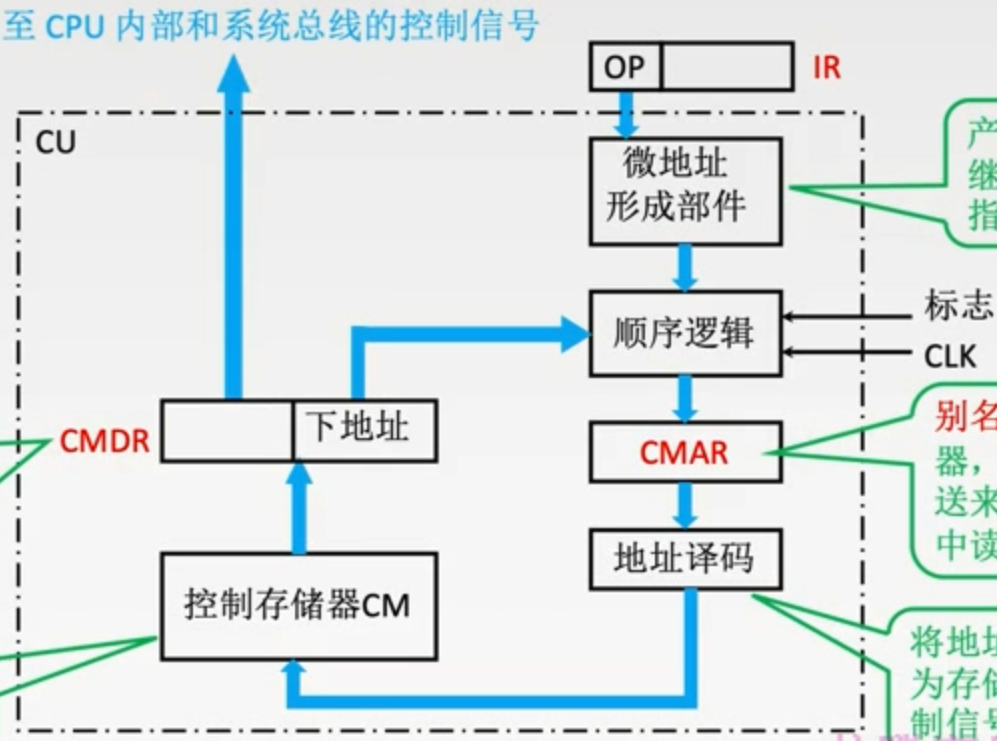
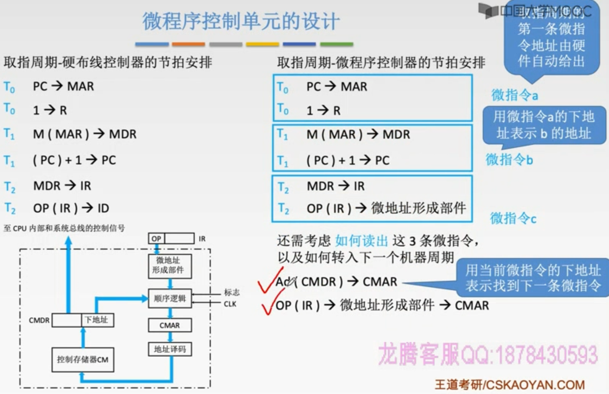
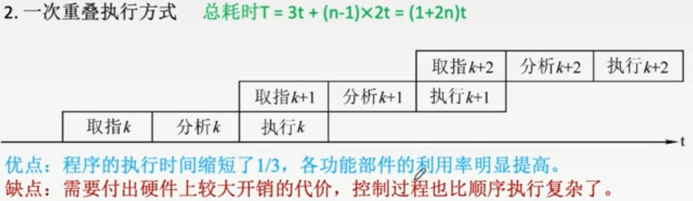
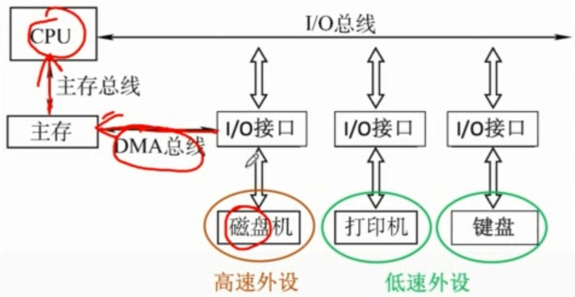

# 第五章：中央处理器

---

---

## 第一节：CPU的功能和结构

---

### 一、CPU的功能

#### (一) 指令控制

完成取指令、分析指令和执行指令的操作，即程序的顺序控制。

#### (二) 操作控制

一条指令的功能往往是由若干操作信号的组合来实现的。CPU管理并产生由内存取出的每条指令的操作信号，把各种操作信号送往相应的部件，从而控制这些部件按指令的要求进行动作。

#### (三) 时间控制

对各种操作加以时间上的控制。时间控制要为每条指令按时间顺序提供应有的控制信号。

#### (四) 数据加工

对数据进行算术和逻辑运算

#### (五) 中断处理

对计算机运行过程中出现的异常情况和特殊请求进行处理

---

### 二、运算器和控制器的功能

---

### 三、运算器的基本结构

#### (一) 算术逻辑单元

主要功能是进行算术/逻辑运算

#### (二) 通用寄存器组

用于存放操作数和各种地址信息

> 操作数包括：源操作数、目的操作数及中间结果

#### (三) 暂存寄存器

用于暂存从主存读来的数据

> 这个数据不能存放在通用寄存器中，否则会破坏其原有内容；
>
> 如：两个操作数分别来自主存和R0，最后结果存回R0，那么从主存中取来的操作数直接放入暂存器，就不会破坏运算前R0的内容。

#### (四) 累加寄存器

也属于通用寄存器，用于暂时存放ALU运算的结果信息，用于实现加法运算

#### (五) 程序状态字寄存器

保留由算术逻辑运算指令或测试指令的结果而建立的各种状态信息（也叫PSW）

> 如溢出标志(OP)、符号标志(SF)、零标志(ZF) 、进位标志(CF)等。
>
> PSW中的这些位参与并决定微操作的形成。

#### (六) 移位器

对运算结果进行移位运算

#### (七) 计数器

控制乘除运算的操作步数

---

### 五、控制器的基本结构

#### (一) 程序计数器

用于指出下一条指令在主存中的存放地址。

CPU就是根据PC中的内容去主存中取指令的。

> 因程序中指令（通常）是顺序执行的，所以很多CPU中的PC都有自增功能

#### (二) 指令寄存器

用于保存当前正在执行的那条指令

#### (三) 指令译码器

仅对操作码字段进行译码，向控制器提供特定的操作信号

#### (四) 微操作发生器

根据IR的内容（指令）、PSW的内容（状态信息）及时序信号，产生控制整个计算机系统所需的各种控制信号，其结构有组合逻辑型和存储逻辑型两种

#### (五) 时序系统

用于产生各种时序信号，它们都是由统一时钟（CLOCK）分频得到

#### (六) 存储器地址寄存器

用于存放所要访问的主存单元的地址

#### (七) 存储器数据寄存器

用于存放向主存写入的信息或从主存中读出的信息

> 现代CPU内部往往集成了MAR和MDR

---

### 六、数据通路的基本结构

:star:关于运算器相关的数据通路方式：

专用数据通路方式：

根据指令执行过程中的数据和地址的流动方向安排连接线路

> 这种方式性能较高，基本不存在数据冲突现象，但结构复杂，硬件量大，不易实现

CPU内部单总线方式：

将所有寄存器的输入端和输出端都连接到一条公共的通路上

结构简单，容易实现，但数据传输存在较多冲突的现象，性能较低

---

---

## 第二节：指令执行过程

---

### 一、指令周期的概念

> 一条指令的执行分为不同的阶段

#### (一) 指令周期概述

指令周期：CPU从主存中每取出并执行一条指令所需的全部时间

> 取指令需要**访存**比较慢，指令译码比较快，所以放在一个周期；
>
> 执行指令<u>可能访存也可能不访存</u>

#### (二) 指令周期划分

指令周期常常用若干**机器周期**来表示

> 机器周期又叫**CPU周期**
>
> 机器周期就相当于一个<u>较完整的工作单元</u>

一个机器周期又包含若干个**时钟周期**

> 也称为**节拍**、**T周期**或**CPU时钟周期**，它是CPU操作的**最基本单位**

#### (三) 指令周期举例

>每个指令周期内机器周期数可以不等，每个机器周期内的节拍数也可以不等

#### (四) 指令周期流程

如何确定CPU正处于哪个机器周期？

> 4个工作周期都可以有CPU访存操作，只是访存的目的不同
>
> 取指周期是为了**取指令**，间址周期是为了**取有效地址**，
> 执行周期是为了**取操作数**，中断周期是为了**保存程序断点**。

---

### 二、数据流

> 不同阶段要求依次访问的数据序列

#### (一) 取指周期

1. 当前**指令地址**送至**存储器地址寄存器**，记做: (PC)$\rarr$MAR
2. **CU**发出控制信号，经<u>控制总线</u>传到主存，这里是**读信号**，记做: 1$\rarr$R
3. 将**MAR**所指主存中的内容经<u>数据总线</u>送入**MDR**，记做：M(MAR)$\rarr$MDR
4. 将**MDR**中的内容(此时是**指令**)送入**IR**，记做: (MDR)$\rarr$IR
5. **CU**发出控制信号，形成下一条指令地址，记做: (PC)+1→PC

#### (二) 间址周期

> 1. 将指令的地址码送入MAR，记做: Ad(IR)$\rarr$MAR或Ad(MDR)$\rarr$MAR
> 2. CU发出控制信号，启动主存做读操作，记做: 1$\rarr$R
> 3. 将MAR所指主存中的内容经数据总线送入MDR，记做: M(MAR)$\rarr$MDR
> 4. 将有效地址送至指令的地址码字段，记做: (MDR)$\rarr$Ad(IR)

#### (三) 执行周期

执行周期的任务是根据IR中的指令字的操作码和操作数通过ALU操作产生执行结果。

不同指令的执行周期操作不同，因此没有统一的数据流向。

> 这里先不详细讨论

#### (四) 中断周期

中断：暂停当前任务去完成其他任务。

为了能够恢复当前任务，需要保存断点。

> 一般使用堆栈来**保存断点**，这里用SP表示栈顶地址，
> 假设SP指向栈顶元素，进栈操作是<u>先修改指针，后存入数据</u>
>
> 

1. **CU**控制将**SP**减1，修改后的地址送入MAR，记做: (SP) - 1$\rarr$SP，(SP)$\rarr$MAR
本质上是将**断点**存入某个存储单元，假设其地址为a，故可记做: a$\rarr$MAR
2. **CU**发出控制信号，启动主存做**写**操作，记做: 1$\rarr$W
3. 将断点(**PC**内容)送入MDR，记做: (PC) $\rarr$ MDR
4. **CU**控制将中断服务程序的入口地址（由向量地址形成部件产生）送入PC，记做：向量地址$\rarr$PC

---

### 三、指令执行方案

> 如何安排多条指令的执行

一个指令周期通常要包括几个时间段（执行步骤），每个步骤完成指令的一部分功能，几个依次执行的步骤完成这条指令的全部功能。

#### (一) 单指令周期

对所有指令都选用<u>相同的执行时间</u>来完成

特点：

- 指令间**串行**执行

优点：

- 控制电路方便

缺点：

- 快指令可能因慢指令而延长

#### (二) 多指令周期

对不同类型的指令选用不同的执行步骤来完成。

特点：

- 指令之间串行执行
- 可选用不同个数的时钟周期来完成不同指令的执行过程。

#### (三) 流水线方案

在每一个**时钟周期**启动一条指令，尽量让多条指令同时运行，但各自处在不同的执行步骤中。

指令之间**并行**执行。

---

---

## 第三节：数据通路的功能和基本结构

---

### 一、数据通路结构示意图

> 如何设置部件之间的连接路径

> 绿色的in和深蓝色的out指的是控制总线上发出的信号

> CPU内部**单总线**同一时刻只允许两个部件进行数据交换，独占了总线，
>
> **多总线**就可以解决这个问题，
>
> 当然也有专用数据通路

---

### 二、CPU内部单总线数据传输详解

> 描述指令执行过程中信号和数据在这些路径上的传输

> 单总线指的是**CPU内部**单总线，CPU内部连接各<u>寄存器</u>及<u>运算部件</u>之间的总线
>
> > 系统总线是指同一台计算机系统的**各部件**，如CPU、内存、通道和各类I/O接口间互相连接的总线
>
> 数据流通可分为三类：
>
> - 寄存器之间（CPU内部总线）
> - 寄存器与主存（系统总线）
> - 寄存器与ALU（CPU内部总线）
>
> > 内部总线也可以用来传输控制信号

- 寄存器之间的数据传送

  

  比如把PC内容送至MAR，实现传送操作的流程及控制信号为：

  | 数据流         | 信号与注释               |
  | -------------- | ------------------------ |
  | (PC)$\rarr$Bus | PCout有效，PC内容送总线  |
  | Bus$\rarr$MAR  | MARin有效，总线内容送MAR |

  > 也可写为：(PC)$\rarr$Bus$\rarr$MAR
  > 也有的教材写为：PC$\rarr$Bus$\rarr$MAR
  > 重要的是描述清楚**数据流向**

- 主存与CPU之间的数据传送

  

  > 注意，**MAR**、**MDR**与**主存**之间的数据通路也是由**控制信号**控制的

  比如CPU从主存读取指令，实现传送操作的流程及控制信号为：

  | 数据流                   | 信号与注释                               |
  | ------------------------ | ---------------------------------------- |
  | (PC)$\rarr$Bus$\rarr$MAR | PCout和MARin有效，现行指令地址$\rarr$MAR |
  | 1$\rarr$R                | CU发读命令(通过控制总线发出，图中未画出) |
  | MEM(MAR)$\rarr$MDR       | MDRinE有效                               |
  | MDR$\rarr$Bus$\rarr$IR   | MDRout和IRin有效，现行指令$\rarr$IR      |

- 执行算术或逻辑运算
  

  比如一条加法指令，微操作序列及控制信号为：

  | 数据流                          | 信号及注释                                                   |
  | ------------------------------- | ------------------------------------------------------------ |
  | Ad(IR)$\rarr$Bus$\rarr$MAR      | MDRout和MARin有效 或 AdIRout和MARin有效                      |
  | 1$\rarr$R                       | CU发读命令(通过控制总线发出，图中未画出)                     |
  | MEM(MAR)$\rarr$数据线$\rarr$MDR | MDRinE有效                                                   |
  | MDR$\rarr$Bus$\rarr$Y           | MDRout和Yin有效，操作数$\rarr$Y(暂存)                        |
  | (ACC)+(Y)$\rarr$Z               | ACCout和ALUin有效，CU向ALU发送加命令， 结果存放在暂存寄存器Z中 |
  | Z$\rarr$ACC                     | Zout和ACCin有效，结果$\rarr$ACC                              |

  > 暂存寄存器Y、Z与ALU之间有专用数据通路；如果CPU内部有双总线也可以不用暂存

> 例题：
>
> 
>
> 
>
> 1. 分析指令功能和指令周期
>
>    - 功能：((R~0~))+(R~1~)$\rarr$(R~0~)
>
>      > 这里，寄存器标识符可以理解成<u>指针</u>，指令后面可以直接写<u>指针</u>，
>      > 但在写表达式时，在**左侧**就需要额外加上一层**括号**了
>      >
>      > > 箭头**右侧**标识符会省略单层括号，也就是代表<u>指针</u>
>      > >
>      > > 但如果有括号了，就像上式那样，一般代表<u>寄存器内的地址对应的地址单元</u>
>
>    - 指令周期：取指、间址、执行
>
> 2. 写出各阶段的指令流程
>
>    - 取指：（公共操作）
>
>      | 时序 |          微操作           |     有效控制信号     |
>      | :--: | :-----------------------: | :------------------: |
>      |  1   |         (PC)→MAR          |     PCout, MARin     |
>      |  2   | M(MAR)→MDR (PC)+1→PC | MemR, MARout, MDRinE |
>      |  3   |         (MDR)→IR          |     MDRout, IRin     |
>      |  4   |         指令译码          |          -           |
>
>    - 间址：完成取数操作，被加数在主存中，加数已经放在寄存器R1中
>
>      | 时序 |   微操作   |     有效控制信号     |
>      | :--: | :--------: | :------------------: |
>      |  1   | (R~0~)→MAR |    R~0~out, MARin    |
>      |  2   | M(MAR)→MDR | MemR, MARout, MDRinE |
>      |  3   |  (MDR)→Y   |     MDRout, Yin      |
>
>    - 执行周期
>
>      | 时序 |    微操作    |             有效控制信号             |
>      | :--: | :----------: | :----------------------------------: |
>      |  1   | (R~1~)+(Y)→Z | R~1~out, ALUin, CU向ALU发ADD控制信号 |
>      |  2   |   (Z)→MDR    |             Zout, MDRin              |
>      |  3   | (MDR)→M(MAR) |         MemW, MDRout, MARout         |

---

### 三、专用通路结构

#### (一) 概览

#### (二) 通路运作方式

- 取指周期：

  

  | 微操作           | 有效控制信号       |
  | ---------------- | ------------------ |
  | (PC)$\rarr$MAR   | C~0~有效           |
  | (MAR)$\rarr$主存 | C~1~有效           |
  | 1$\rarr$R        | CU向主存发送读命令 |
  | M(MAR)$\rarr$MDR | C~2~有效           |
  | (MDR)$\rarr$IR   | C~3~有效           |
  | (PC)+1$\rarr$PC  |                    |
  | Op(IR)$\rarr$CU  | C~4~有效           |

- 例题：

  

  

  > 省略多路选择器或三态门，
  > 意思就是连接器件的信号线一般情况下同一时刻只能有一个有效

  - (1) 

    - d能自动“+1”，是PC
    - PC的内容送给了c，则c是MAR
    - b能直接给微操作发生器发送信号，是IR
    - a与主存直接相连，且是双向的，所以是MDR

  - (2)

    1. (PC)$\rarr$MAR

    2. M(MAR)$\rarr$MDR

       > 省略了MAR到主存，控制单元给主存读信号的过程

    3. (MDR)$\rarr$IR

    4. (PC)+1$\rarr$PC

    5. Op(IR)$\rarr$微操作发生器

  - (3)

    > 假设数据地址已经存放在了MAR中

    - 从主存中读数据到ACC

      1. M(MAR)$\rarr$MDR

      2. (MDR)$\rarr$ALU$\rarr$ACC

         > ALU不是寄存器，只是一个组合逻辑部件，在本次数据流通中是作为中转

    - ACC向主存中写数据

      1. (ACC)$\rarr$MDR
      2. (MDR)$\rarr$M(MAR)

  - (4)、(5)、(6)

    1. X$\rarr$MAR

       > X就是一个值，这里也可以使用Ad(IR)$\rarr$MAR

    2. M(MAR)$\rarr$MDR

    3. (MDR)$\rarr$ALU$\rarr$ACC

    4. Y$\rarr$MAR

    5. M(MAR)$\rarr$MDR

    6. (MDR)$\rarr$ALU, (ACC)$\rarr$ALU

    7. ALU$\rarr$ACC

       > 其实ALU下面应该有个暂存寄存器，信号稳定后在传输给ACC

    8. Z$\rarr$MAR

    9. (ACC)$\rarr$MDR

    10. (MDR)$\rarr$M(MAR)

---

---

## 第四节：:star:控制器的功能和工作原理

---

### 一、控制器设计思路

> 控制器如何指挥整个系统的工作

#### (一) 指令周期与相关寄存器

- 每个周期对应一个寄存器

#### (二) 微命令与微操作

CU发送**微命令**，就可以完成对应的**微操作**

- 微命令一般是指，什么**信号**有效

  > 如PC~out~、MAR~in~有效

- 微操作一般是指，数据的流向是怎样的

  > 如(PC)$\rarr$MAR

CU在一个**时钟节拍**下是可以发出**多个微命令**的

> 
>
> - 一个节拍内可以**并行**完成多个相容的微操作
>
> - 同一个微操作可能在不同指令的不同阶段被使用
>
> - 不同指令的执行周期所需必要节拍数各不相同，
>   为了简化设计，可以选择**定长指令周期**，以可能出现的最大节拍数为准
>
>   > 通常以**访存**所需节拍数为参考（因为访存比较慢）
>
>   > 若实际所需节拍数较少，可将微操作安排在机器周期末尾几个节拍上进行

#### (三) 设计控制器的核心思想

根据：

- 指令操作码

- 目前的机器周期

- 节拍信号

- 机器状态条件

  > 如PSW

即可确定现在这个节拍下应该发出哪些”微命令“

---

### 二、硬布线控制器

> 设计的核心思想就是上面记的

#### (一) 各信息的作用

指令操作码：

目前的机器周期：

节拍信号：

> 定长指令周期的话，节拍信号就都是m+1个

机器状态条件/标志：

> 总体：
>
> 

#### (二) 逻辑表达式的确定

>接下来要解决的就比如，什么时候发出C~1~信号呢？
>
>转化问题：C~1~的**逻辑表达式**是什么
>
>所有指令的取指周期，T~0~节拍下一定要完成(PC)→MAR，则可知C~1~=FE · T~0~
>
>
>
>

> 接下来再用更复杂的$M(MAR)\rarr MDR$举例

先给出$M(MAR)\rarr MDR$的逻辑表达式：
$$
FE\cdot T_1+IND\cdot T_1(ADD+STA+LDA+JMP+BAN)+EX\cdot T_1(ADD+LDA)
$$

再分析几个项：

- $FE\cdot T_1$

  

  > 仍然是在**取指**阶段，但是在第二个**节拍**

- $EX\cdot T_1(ADD+LDA)$

  

  > 在**执行**阶段，在第T~1~个**节拍**，**操作码**(操作码译码器)是加法或取数

:star:总结出**==设计步骤==**：

1. 分析每个阶段对应的微操作序列

   > 取指、间址、执行、中断；
   >
   > 确定哪些指令在什么阶段、在什么条件下会使用到某个微操作；
   >
   > 执行阶段较复杂，其他阶段较固定，所以CPU支持的指令越多，这个步骤越麻烦

2. 选择CPU的控制方式

   > 采用<u>定长</u>机器周期还是<u>不定长</u>机器周期？每个机器周期安排<u>几个节拍</u>？

3. 安排微操作时序

   > 在某个阶段中，每个节拍都干什么；
   >
   > 别忘了同一个节拍下是可以控制多个微操作的

4. 电路设计

   > 确定每个微命令对应的逻辑表达式，并用电路实现

#### (三) 设计举例

1. **<u>分析每个阶段对应的微操作序列</u>**

   - 取指周期(所有指令都一样)

   

   - 间址周期(所有指令都一样)

   

   - 执行周期(各不相同)

   > 下面举出若干个例子

   

   

   

   

   >A~0~代表符号位，绿色的，表示这是一个**机器状态条件**

   >罗列出所有指令在各个阶段的微操作序列，就可以知道在什么情况下需要使用这个微操作

   > 省略对中断周期的分析

2. **<u>选择CPU的控制方式</u>**

   - 假设采用定长机器周期，一个机器周期内安排3个节拍

3. **<u>安排微操作时序</u>**

   > 原则：
   >
   > - 微操作的**先后顺序**不得随意更改
   >
   > - **被控对象不同**的微操作尽量安排在**一个节拍**内完成
   >
   >   > 比如(PC)→MAR的被控对象是寄存器，1→R的被控对象是主存，不同，就可以安排在同一个节拍内完成
   >
   > - 占用时间较短的微操作尽量安排在一个节拍内完成，并允许有先后顺序
   >
   >   > 在CPU内部的寄存器之间的数据流通很快，可以快速进行相关微操作

   - 取指周期

     

     > 1和2被控对象不同，3和6互相不影响，4和5虽然有**前后依赖**关系，但执行时间都较短
     >
     > > 为啥不能把3和4也合并？因为3是从主存中取数据，用时较长，必须安排一个时钟周期

   - 间址周期

     

     > 3和4不能边起来，因为涉及到访存

   - 执行周期

     - 非访存指令

       - CLA：ACC清零

         

         >只需一条微指令，安排在最后一个节拍

       - COM：ACC取反

         > 每一条指令在执行周期内做的微操作各不相同，但所有的微操作都要安排好

       - 所有的：

         

     - 访存指令

       

       > 为什么要区分访存和非访存，因为访存的可能还涉及到**间址周期**

     - 转移指令

       

4. **<u>电路设计</u>**

   1. 列出操作时间表

      > 列出在取指、间址、执行、中断**周期**，T~0~、T~1~、T~2~**节拍**内有可能用到的所有**微操作**

   2. 写出**微操作命令**的最简**表达式**

   3. 画出逻辑图

   > 下面是这个例子中电路设计的具体步骤：
   >
   > 1. 操作时间表
   >
   >    - FE(取指)
   >
   >      
   >
   >      > 前6条是共有的。后两条是跟**间址特征**有关的，非访存和访存就有所不同了；
   >      > 当然访存指令包含的地址码也可能不需要间址，也可以直接进入**执行阶段**
   >
   >    - IND(间址)
   >
   >      
   >
   >      > 非访存指令肯定是用不到的，所以都空着；
   >      > 间址有可能是**多级**的，所以还要看IND这个状态条件 
   >
   >    - EX(执行)
   >
   >      
   >
   >      > 把**所有指令**在**同一个节拍**出现的**微操作**都放到对应节拍的那一行中
   >
   > 2. 写出微操作命令的最简表达式
   >
   >    
   >
   >    
   >
   >    > 在时间表中，找到一个**微操作**的<u>所有出现位置</u>

#### (四) 硬布线控制器的特点

- <u>指令越多</u>，设计和实现就越复杂，因此一般用于RISC

  > RISC：精简指令集系统

- 如果扩充一条新的指令，则控制器的设计可能需要很大改动，因此**扩充指令较困难**

- 使用纯硬件实现控制，**执行速度很快**，微操作控制信号由组合逻辑电路即时产生

---

### 三、微程序控制器

#### (一) 微程序设计思路

- 程序与指令

  - 程序由**指令序列**组成
  - 指令是对**程序执行步骤**的描述

- 微指令与微程序

  - 微指令是对**指令执行步骤**的描述

    >微命令与微操作一一对应，<u>微指令可能包含多个微操作</u>

  - 微程序由**微指令序列**组成

    > 一条指令对应一个微程序；所以可以说，指令是对微指令功能的“封装”

> 采用“存储程序”的思想，CPU出厂前将所有指令的“微程序”存入“控制器存储器”
>
> > 控制器内部的特殊的存储器
>
> **微指令**的基本格式：
>
> 
>
> > **操作控制**：微指令对应的<u>微操作</u>是什么
> >
> > **顺序控制**：指明下一条微指令的<u>地址</u>

#### (二) 微程序控制器基本结构

- 控制器存储器（CM）

  

  > 存放各指令对应的微程序，由ROM构成

- CMAR、地址译码器

  - CMAR别名$\mu PC$，是**微地址寄存器**，接收微地址形成部件送来的微地址，为在CM中读取微指令作准备
  - 地址译码器：将地址码转化为存储单元控制信号 

- CMDR

  - 别名$\mu IR$
  - 用于存放从CM中取出的**微指令**
  - 它的位数同微指令字长相等

- 微地址形成部件

  - 产生**初始微地址**和**后继微地址**，以保证微指令的连续执行

- 顺序逻辑

  - 控制微指令的具体执行顺序

  > 比如会根据**寻址特征**判断是否要**间址**，从而判断是否跳过间址周期

> 有些机器周期的微程序段是可以多条指令共享的，比如取指、间址、中断
>
> 

#### (三) 微程序执行

举例：

> Tips：
>
> - 如果某指令系统中有n条机器指令，则CM中**微程序段**的个数至少是n+1个
>
>   > 取指和执行必须有
>
>   > <u>一条指令对应一个微程序</u>，说法是对的；
>   >
>   > 但取指、间址、中断、执行确实可以再划分成一个微程序段

#### (四) 微指令的设计

##### 1、微指令的格式

> 相容型微命令：可以并行完成的微命令
>
> 互斥型微命令：不允许并行完成的微命令

- 水平型微指令

  

  > 为什么比较长？

  

  - 一条微指令能定义多个**可并行的微命令**
  - 优点：微程序短，执行速度快
  - 缺点：微指令长，编写微程序比较麻烦

- 垂直型微指令

  

  

  - 一条微指令只能定义**一个微命令**，由微操作码字段规定具体功能
  - 优点：微指令短、简单、规整，便于编写微程序
  - 缺点：微程序长，执行速度慢，工作效率低

- 混合型微指令

  - 在垂直型的基础上增加一些不太复杂的并行操作。
  - 微指令较短，仍便于编写；微程序也不长，执行速度加快。

##### 2、操作控制字段设计

> 采用水平型微指令

> 微指令的**编码方式**又称为微指令的**控制方式**，它是指如何对微指令的控制字段进行编码，以形成控制信号。编码的目标是在保证速度的情况下，尽量缩短微指令字长。

- 直接编码（直接控制）方式

  

  - 在微指令的操作控制字段中，**每一位代表一个微操作命令**
    某位为“1”表示该控制信号有效

  - 优点：简单、直观，执行速度**快**，操作**并行**性好。

  - 缺点：微**指令字长**过长，n个微命令就要求微指令的操作字段有n位，造成**控存容量**极大。

    > 怎么变短呢？下面这种方式就解决了这个问题

- 字段直接编码方式

  

  - 将微指令的控制字段分成若干“段”，每段经译码后发出控制信号

    > 分段原则：
    >
    > - **互斥性**微命令分在**同一段**内，**相容性**微命令分在**不同段内**。
    >
    > - 每个小段中包含的**信息位不能太多**，否则将增加译码线路的复杂性和译码时间。
    >
    > - 一般每个小段还要留出一个状态，表示本字段**不发出任何微命令**。
    >
    >   > 因此，当某字段的长度为3位时，最多只能表示7个互斥的微命令，
    >   > 通常用000表示不操作。

  - 优点：可以缩短微命令字长

  - 缺点：要通过译码电路后再发出微命令，因此比直接编码方式慢

  > 例题：
  >
  > 

- 字段间接编码方式

  

  - 一个字段的某些微命令需由另一个字段中的某些微命令来解释，

    > 由于不是靠字段直接译码发出的微命令，故称为字段间接编码，又称隐式编码。

  - 优点:可进一步缩短微指令字长。

  - 缺点:削弱了微指令的并行控制能力，故通常作为字段直接编码方式的一种辅助手段。

##### 3、微指令的地址形成方式

- 微指令的**下地址字段**指出

  - 微指令格式中设置一个下地址字段，由微指令的下地址字段直接指出后继微指令的地址

    > 这种方式又称为==断定方式==

- 根据机器指令的**操作码**形成

  - 当机器指令取至指令寄存器后，微指令的地址由操作码经微地址形成部件形成。

- **增量==计数器法==**

  - (CMAR) + 1 → CMAR

- 分支转移

  - 转移方式：指明判别条件
  - 转移地址：指明转移成功后的去向

  

- 通过测试网络

  

- 由硬件产生微程序入口地址

  - 第一条微指令地址：由专门硬件产生

    >用专门的硬件记录取指周期微程序首地址

  - 中断周期：由硬件产生中断周期微程序首地址

    > 用专门的硬件记录

> 例题：
>
> 

#### (五) 微程序控制单元的设计

##### 1、设计步骤

1. 分析每个阶段的**微操作序列**

2. 写出对应**机器指令的微操作**命令及节拍安排

   1. 写出每个周期所需要的微操作（参考硬布线）

   2. 补充微程序控制器特有的微操作

      1. 取指周期

         - Ad(CMDR)→CMAR

           > 每条微指令结束之后都要进行

         - OP(IR)→微地址形成部件→CMAR

           > 取指周期的最后一条微指令完成后，
           > 要根据指令操作码确定其执行周期的微程序首地址

      2. 执行周期

         - Ad(CMDR)→CMAR

           >每条微指令结束之后都要进行

3. 确定**微指令格式**

   - 根据微操作个数决定采用何种编码方式，以确定微指令的操作控制字段的位数。
   - 根据CM中存储的微指令总数，确定微指令的顺序控制字段的位数。
   - 最后按操作控制字段位数和顺序控制字段位数就可确定微指令字长。

4. 编写**微指令码点**

   - 根据操作控制字段每一位代表的微操作命令，编写每一条微指令的码点。

##### 2、举例

1. 分析每个阶段的**微操作序列**

2. 写出对应**机器指令的微操作**命令及节拍安排

   - 取指阶段：

     

     > 把**读取微指令**的操作并入
     >
     > 

##### 3、微程序设计分类

- 静态微程序设计和动态微程序设计
  - 静态：微程序无需改变， 采用ROM
  - 动态：通过改变**微指令**和**微程序**改变机器指令。有利于仿真，采用EPROM
- 毫微程序设计
  - 亳微程序设计：用**亳微程序**解释**微程序**

#### (六) 硬布线与微程序比较

----

---

## 第五节：指令流水线

---

> 为什么引入流水线结构？
>
> 有哪些结构？
>
> 会产生什么问题

### 一、基本概念和性能指标

#### (一) 指令流水的定义

##### 1、指令执行方式

- 顺序执行方式

  

- 一次重叠执行方式

  

- 二次重叠执行方式

  

  > 常常会将指令的执行过程划分成4或5个阶段

##### 2、流水线的表示方法

- 指令执行过程图

  

- 时空图

  

#### (二) 流水线的性能指标

##### 1、吞吐率

- 吞吐率是指在**单位时间**内流水线所完成的**任务**数量，或是输出结果的数量

> 计算举例：
>
> 
>
> 认为$\Delta t$是一个时钟周期，因为这里考虑的是最理想的状态

> 装入时间和排空时间：
>
> 

##### 2、加速比

- 完成同样一批任务， 不使用流水线所用的时间与使用流水线所用的时间之比

> 计算举例：
>
> 

##### 3、效率

- 流水线设备的利用率称为流水线的效率

  >在时空图上，流水线的效率定义为：
  >
  >完成n个任务占用的时空区有效面积
  >
  >与
  >n个任务所用的时间与k个流水段所围成的时空区总面积
  >
  >之比

> 计算举例：
>
> 
>
> 
>
> 

---

### 二、影响因素和分类

#### (一) 五段式指令流水线

> 精简指令集MIPS架构提出的

> 规定每条指令必须经过**五个阶段**
>
> > 尽管有的阶段什么也不做
>
> 规定每个阶段**耗时都和最长的保持一致**
>
> > 为此，需要添加**暂存寄存器**：（也叫锁存器）
> >
> > 
> >
> > <u>作用：保存本流水段执行结果，供给下一流水段在一定时间后使用</u>

各阶段解释：

- Instruction Fetch

  - 大多数情况下从***Instruction Cache***中就可以取到需要的指令，
    有时也是会访问**主存**的

- Instruction Decode

  - 指令译码

  - ==从**通用寄存器**中取出操作数，放到<u>锁存器</u>中==

    > 所需操作数如果在主存中，也会提前放入至**通用寄存器**内

- Execute

  - 执行
  - 运算结果有可能写回主存/Data Cache，也可能不需要，也可能直接写回通用寄存器

- Memory

  - 大多数情况下通过***Data Cache***中就可以达到<u>访问**主存**</u>的效果

    > Instruction Cache和Data Cache是两个独立的模块，因而对应的两个阶段也可以**并行**

    > 如果Cache没有命中，就会出现<u>断流</u>的情况，较复杂，这里不讨论

- Write Back

  - 将数据写回通用寄存器中

    > ID阶段可能会**读**通用寄存器，WB阶段可能会**写**通用寄存器，这就有可能引发冲突

#### (二) 影响流水线的因素

##### 1、结构相关（资源冲突）

- 概念：由于**多条指令**在同一时刻争用**同一资源**而形成的冲突称为结构相关

- 冲突的表现：

  

  > 这里是假设**指令**和**数据**都需要访问**主存**

- 解决办法：

  - 后一相关资源暂停一周期

  - **资源重复配置**：**数据**存储器+**指令**存储器

    > 使用数据和指令的 *Cache* 就是一种资源重复配置

##### 2、数据相关（数据冲突）

- 概念：数据相关指在一个程序中，存在必须等前一条指令执行完才能执行后一条指令的情况，
  则这两条指令即为**数据相关**。

- 冲突表现：

  

- 解决办法：

  - 把遇到数据相关的指令及其后续指令都暂停一至几个时钟周期，直到数据相关问题消失后再继续执行。

    > 可分为**硬件阻塞**(stall)和**软件插入**“NOP”两种方法。
    >
    > stall：
    >
    > 
    >
    > NOP：
    >
    > 
    >
    > > 具体要插入几条，是**编译器**完全的

  - 数据旁路技术/转发机制

    

    > 不再通过寄存器了，直接根据指令需求传递数据

  - 编译优化：通过编译器调整**指令顺序**来解决数据相关

    > 相关于把NOP换成有用的操作

##### 3、控制相关（控制冲突）

- 定义：当流水线遇到转移指令和其他**改变PC值**的指令而造成**断流**时，会引起控制相关。

- 冲突表现：

  

  > 我们主要探讨的是由**转移指令**导致的控制冲突

- 解决办法

  - **转移指令分支预测**。简单预测(永远猜ture或false)、动态预测(根据历史情况动态调整)
  - **预取**转移成功和不成功两个控制流方向上的目标指令
  - 加快和提前形成条件码
  - 提高转移方向的猜准率

#### (三) 流水线的分类

##### 1、流水线使用的级别不同

- 部件功能流水线

  - 部件功能级流水就是将复杂的**算术逻辑运算**组成**流水线**工作方式。

    > 例如，可将浮点加法操作分成求阶差、对阶、尾数相加以及结果规格化等4个子过程。

- 处理机级流水线

  - 处理机级流水是把一条**指令解释过程**分成多个**子过程**

    > 如前面提到的取指、译码、执行、访存及写回5个子过程。
    >
    > **指令流水线**就属于处理机级流水线

- 处理机间流水线

  - 处理机间流水是一种宏流水，其中每一个处理机完成某一专门任务，各个处理机所得到的结果需存放在与下一个处理机所共享的存储器中。

##### 2、流水线可以完成的功能

- 单功能流水线

  - 只能实现一种固定的**专门功能**的流水线

- 多功能流水线

  - 通过各段间的<u>不同连接方式</u>可以同时或不同时地实现**多种功能**的流水线

    >**指令流水线**就属于多功能流水线

##### 3、同一时间内各段之间的连接方式

- 静态流水线

  - 在**同一时间**内，流水线的各段只能按**同一种功能**的连接方式工作

    > 比如进行浮点数加法的时候就不能进行乘法类操作

- 动态流水线

  - 动态流水线指在同一时间内，
    当某些段正在实现某种运算时，另一些段却正在进行另一种运算。 

    > 这样对提高流水线的效率很有好处，但会使流水线控制变得很复杂。

##### 4、各个功能段之间是否有反馈信号

- 线性流水线

  - 从输入到输出，每个功能段只允许经过一次，不存在反馈电路

- 非线性流水线

  - 存在**反馈电路**，从输入到输出过程中，某些功能段将<u>数次通过</u>流水线，这种流水线适合进行线性递归的运算

    > 比如解决数据冲突时：
    >
    > 

    > 数次通过：比如用加法代替乘法时就可能数次通过

#### (四) 流水线的多发技术

##### 1、超标题技术

> 有点像**空分复用技术**

- 每个时钟周期内可**并发多条独立指令**
- 要配置**多个功能部件**
- 不能调整指令的**执行顺序**
- 通过**编译优化技术**，把可并行执行的指令搭配起来

##### 2、超流水技术

> 有点像**时分复用技术**

- 在**一个时钟周期**内再分段
- 在一个时钟周期内**一个功能部件使用多次**
- 不能调整指令的**执行顺序**
- 靠编译程序解决优化问题

##### 3、超长指令字

- 由**编译程序**挖掘出指令间潜在的**并行性**，将多条能**并行操作**的指令组合成一条具有**多个操作码**字段的<u>超长指令字</u>
- 采用**多个处理部件**

---

### 三、五段式指令流水线

> 承接上一点中对五段式指令流水线的简述

#### (一) 运算类指令的执行过程

> 运算类指令举例：
>
> 

1. IF：根据PC从指令Cache中取指令至IF段的**锁存器**

2. ID：取出操作数至ID段**锁存器**

3. EX：运算，将结果存入EX段**锁存器**

4. M：空段

   > 对于精简指令集来说运算指令的操作数一定来自于寄存器，结果一定存回寄存器，不会直接访问主存（也不会去访问Data Cache）

5. WB：将运算结果写回指定寄存器

   > 
   >
   > 数据直接这样流动到寄存器中

#### (二) LOAD指令的执行过程

> 指令举例：
>
> 

1. IF：根据PC从指令Cache中取指令至IF段的**锁存器**

2. ID：将**基址**寄存器的值放到**锁存器A**，将偏移量的值放到**imm**

3. EX：运算，得到**有效地址**EA

4. M：从**数据Cache**中取数并放入锁存器

   > 在RISC中只有“取数LOAD”和“存数STORE“指令才会直接访问主存
   >
   > > 其他的要么在寄存器中，要么是立即数

5. WB：将取出的数写回**寄存器**

#### (三) STORE指令的执行过程

> 指令举例：
>
> 

1. IF：根据PC从指令Cache中取指令至IF段的**锁存器**

2. ID：将**基址**寄存器的值放到**锁存器A**，将偏移量的值放到**imm**，<u>将要存的数放到B</u>

   > 注意这里三个寄存器都用到了
   >
   > 

3. EX：运算，得到**有效地址**。并将锁存器B的内容放到**锁存器Store**

   > 注意这里还要用到Store
   >
   > 

4. M：写入**数据Cache**

   > 直接存入Cache中就可以了，之后再同步到主存中

5. WB：空段

#### (四) 条件转移指令

> 指令举例：
>
> 
>
> 转移类指令通常采用相对寻址；偏移是相对于**下一条指令**的偏移

1. IF：根据PC从指令Cache中取指令至IF段的**锁存器**

2. ID：进行比较的两个数放入锁存器A、B；偏移量放入imm

3. EX：运算，比较两个数

4. M：将目标PC值写回PC

   > 注意，修改PC值的操作并不是放在WB阶段的，而是在M阶段
   >
   > > PC寄存器不属于通用寄存器
   >
   > 写回PC的功能段常被称为”WrPC段“，是相对于那5个阶段独立的。
   > 但其耗时比M段更短，在这类指令中M又没什么可做的，所以在这类指令中，可安排在M段时间内完成

5. WB：空段

#### (五) 无条件转移指令

> 指令举例：
>
> 
>
> 转移类指令通常采用相对寻址；偏移是相对于**下一条指令**的偏移

1. IF：根据PC从指令Cache中取指令至IF段的**锁存器**

2. ID：偏移量放入imm

3. EX：将目标PC写回PC

   > 在这类指令中，WrPC段的操作就放到EX中去了（反正EX也不干啥，而且WrPC耗时比EX短）
   >
   > > 为什么要尽早修改PC的值？
   > >
   > > 因为越早修改完，越有可能避免**控制冲突**
   > >
   > > 不过有时也会直接将WrPC段放到WB段

4. M：空段

5. WB：空段

> 例题：
>
> 
>
> - LOAD指令是在WB阶段才把取出来的数写回的
> - 由于数据相关，I3必须一直**占用IF段的锁存器**，I4就没法正常取指

---

---

---

# 第六章：总线

---

---

## 第一节：总线概述

---

### 一、基本概念

> 总线简图：
>
> 
>
> 每个总线可能包含很多**信号线**；
>
> > 比如下面这样的 4 根信号线
> >
> > 
> >
> > 同时只能有一个部件**发送**，但可以有多个部件**接收**

#### (一) 定义

- *总线*是一组能为多个部件**分时共享**的**公共**信息传送**线路**

  >共享是指总线上可以挂接多个部件，各个部件之间互相交换的信息都可以通过这组线路分时共享；
  >
  >分时是指同一时刻只允许有一个部件向总线发送信息，如果系统中有多个部件，则它们只能分时地向总线发送信息。

#### (二) 特性

- 机械特性：尺寸、形状、管脚数、排列顺序
- 电气特性：传输方式和有效的电平范围
- 功能特性：每根传输线的功能(地址、数据、控制)
- 时间特性：信号的时序关系

---

### 二、总线的分类及经典结构

#### (一) 分类

##### 1、按数据传输格式

- *串行总线*

  - 优点

    - 只需要一条传输线，成本低，节省空间

    - 抗干扰能力强

      > 广泛应用于长距离传输

  - 缺点

    - 在数据发送和接收的时候要进行拆卸和装配

    - 要考虑串行和并行的转换问题

      > 比如 USB 传输给 CPU 的时候

- *并行总线*

  - 优点

    - 总线的时序逻辑比较简单，电路实现比较容易

  - 缺点

    - 信号线数量多，占用空间；远距离传输成本高

    - 工作频率较高时，并行信号线之间有干扰

      > 所以无法持续提升工作效率

##### 2、按功能

> 所谓“功能”不同，也就是**连接的部件**不同

$\Rarr$*片内总线*：芯片内部的总线

> 比如 CPU 芯片内部寄存器与寄存器之间、寄存器与ALU之间的公共连接线。

$\Rarr$:star:*系统总线*：计算机系统内各功能部件之间相互连接的总线

> 系统总线按传输**信息内容**的不同，又可以分为以下三类
>
> 

- 数据总线(DB)

  - 传输各功能部件之间的**数据信息**，包括<u>指令和操作数</u>;
  - 位数(根数)与**机器字长**、**存储字长**有关
  - 可以**双向**传输。

  > 区分：
  >
  > 数据通路：数据流经的路径
  >
  > 数据总线、地址总线都可以成分其物理上的承载媒介

- 地址总线(AB)

  - 传输**地址信息**，包括<u>主存单元或 I/O 端口</u>的地址;

  - 位数(根数)与主存**地址空间**大小及**设备**数量有关;

  - 只能**单向**

    > 一定是由 CPU 出发，指明地址

- 控制总线(CB)

  - 每一根控制线传输**一个信号**

    > 控制总线中可以有多根控制线

  - 有出：CPU 送出控制命令
    有入：主存（或外设）返回给 CPU 的

  - 单根控制线是**单向**的，控制总线整体可以是**双向**的

$\Rarr$*通信总线*：通信总线是用于**计算机系统之间**或**计算机系统与其他系统** (如远程通信设备、测试设备) 之间**信息传送**的总线，通信总线也称为外部总线。

##### 3、按时序控制方式

..

#### (二) 系统总线的结构

##### 1、单总线结构

> 注：单总线并不是指只有一根信号线，系统总线按传送信息的不同可以细分为地址总线、数据总线和控制总线。

- 结构： CPU、主存、I/O设备 (通过I/O接口) 都连接在**一组总线**上

  > 允许I/O设备之间、I/O设备和CPU之间或I/O设备与主存之间直接交换信息。

- 优点：结构简单，成本低，易于接入新设备

- 缺点：带宽低、负载重；多个部件只能争用唯一的总线，且不支持**并发传送**操作

  > 因为都在一条总线上，高性能部件受低性能部件制约，会导致**性能浪费**

##### 2、双总线结构

> 理解通道：
>
> 可以把**通道**理解成一个*“小CPU”*，可以缓和速度问题；
>
> 通道是具有特殊功能的**处理器**，能对 I/O 设备进行统一管理；
>
> 通道程序放在**主存**中。

>支持突发(猝发)传送：
>
>送出一个地址，收到多个地址连续的数据。

- 结构：双总线结构有两条总线
  - 一条是**<u>主存总线</u>**， 用于CPU、主存和**通道**之间进行数据传送
  - 另一条是 I/O 总线，用于多个外部设备与**通道**之间进行数据传送
- 优点：将较低速的 I/O 设备从单总线上分离出来，实现存储器总线和 I/O 总线分离。
- 缺点：需要增加**通道**等硬件设备。

##### 3、三总线结构

> DMA 总线快于 I/O 总线，可以缓和 CPU 与磁盘之间的速度
>
> (DMA : ***Direct Memory Access***，直接内存访问)

- 结构：三总线结构是在计算机系统各部件之间采用3条各自独立的总线来构成信息通路，这3条总线分别为**主存总线**、**I/O 总线**和直接内存访问**DMA总线**。

- 优点：提高了I/O设备的性能，使其更快地响应命令，提高系统吞吐量。

- 缺点：系统工作效率较低。

  > 三条总线同时只能有一个总线在工作

> 扩展：四总线结构简介
>
> 
>
> - 桥接器：用于连接不同的总线，具有数据缓冲、转换和控制功能。
>
>   > 北桥芯片、南桥芯片
>
> - 靠近 CPU 的总线速度较快
>
> - 每级总线的设计遵循**总线标签**

---

### 三、性能指标

---

---

## 第二节：总线仲裁

---

> 解决多个设备争用总线的问题

### 一、集中仲裁方式

---

### 二、分布仲裁方式

---

---

## 第三节：总线操作和定时

---

> 占用总线的一对设备如何进行数据传输

### 一、总线传输的四个阶段

#### (一) 申请分配阶段

##### 1、传输请求

##### 2、总线仲裁

#### (二) 寻址阶段

#### (三) 传输阶段

#### (四) 结束阶段

---

### 二、定时

---

---

---

## 第四节：总线标准

---

> 规定了标准后，易于实现系统的模块化设计

---

---

---

# 第七章：输入输出系统

---

---

