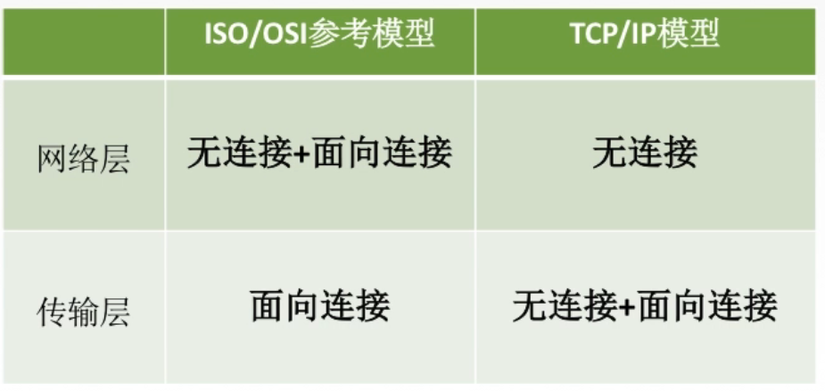

# 计算机网络体系结构

***

---

## 计算机网络概述

***

### 一、概念

#### (一)网络与计算机网络

> 计算机网络：<u>通信技术</u>与<u>计算机技术</u>结合的产物

#### (二)计网的概念

- *详述*：计算机网络是将一个个分散的，具有独立功能的**计算机系统**，通过**通信设备**与**线路**连接起来，由功能完善的**软件**，实现==资源共享==和==信息传递==的系统

	> 计算机系统（也叫端系统）包括了<u>手机端</u>、<u>电脑端</u>、......

	> 通信设备通常指**交换机**和**路由器**
	>
	> 线路就是连接<u>端系统</u>与<u>通信设备</u>的**介质**

	> 计算机系统、通信设备、线路相当于搭了一个<u>架子（拓扑结构）</u>，需要有**软件**才能实现相应的**功能**

- *概述*：总结起来，计算机网络是**互连**的、**自治**的计算机集合

	> 互连：互联互通（通过<u>通信链路</u>）
	>
	> 自治：无主从关系

***

### 二、功能

#### (一):star:==数据通信==

- 保证数据可以在信道上传输，保证<u>连通性</u>

#### (二)==资源共享==

- 硬件共享

  > 比如打印机

- 软件共享

- 数据共享（<u>最常用</u>）

  > 比如百度网盘

#### (三)分布式处理

- 多台计算机各自承担同一任务的不同部分

	> Hadoop平台

#### (四)提高可靠性

- 可以有<u>替代机</u>，在某台主机去世之后替代发挥作用

#### (五)负载均衡

- 分布式处理带来的效果

- 使计算机之间更加亲密

***

### 三、组成

#### (一) 组成部分

- *硬件*

  - 主机/端系统/计算机系统
  - 通信设备/交换设备
  - 通信链路/线路

- *软件*

  - 实现**资源共享**的软件
  - 方便用户使用的各种**工具软件**

  > 比如：
  >
  > 网络操作系统、邮件收发程序、FTP程序、聊天程序、......

- *协议*

  - 计算机网络的**核心**
  - 规定了网络<u>传输数据</u>时所遵循的<u>规范</u>

#### (二)工作方式

- *边缘部分*

  > 主机存在的部分（用户可以直接使用的主机）

  > 端系统之间通信的方式：C/S方式、P2P方式

- *核心部分*

  > 为边缘部分提供<u>连通性</u>和<u>交换</u>服务

  > 由大量的**网络**和连接这些网络的**路由器**的组成

  

#### (三):star:功能组成

- *通信子网*
  - 实现**数据通信**

- *资源子网*
  - 实现**资源共享**/数据处理

> 我们所说的分层正是按照`功能组成`来分的

***

### 四、分类

#### (一)按分布范围

- *广域网WAN*(***Wide Area Network***)：

  - 覆盖范围：几十千米到几千千米的区域，跨度大（跨国...）
  - 使用的是**交换技术**

  > 因特网的**核心部分**
  >
  > 各结点交换机一般都是<u>高速链路</u>，具有<u>较大的通信容量</u>

- *城域网MAN*(***Metropolitan***)：

  - 覆盖范围：5~50km，通常是在城市内

  - 主要使用**以太网技术**

    > 因而有时也常并入局域网的范围进行讨论

- *局域网LAN*(***Local***)：

  - 覆盖范围：几十米到几千米
  - 使用的是**广播技术**

  > 局域网在计算机配置的数量上没有太多限制，少则两台，多则几百台

  > 校园网一般是由多个LAN连接起来的（一个LAN覆盖一个教室/楼）

- *个人区域网PAN*(***Personal***)：

  - 覆盖范围：直径约10m，个人工作范围内的
  - 使用的是**无线技术**

  > 例如个人的电子设备（平板电脑、智能手机、......）

#### (二)按使用者

- *公用网*：电信公司出资建造的大型网络

  > 中国电信、中国移动... 提供的

  > 交钱就能用。也叫<u>公众网</u>

- *专用网*：为满足本单位业务需求而建造的网络

  > 政府、军队、银行...

#### (三)按交换技术

- *电路交换*
- *报文交换*
- *分组交换*

#### (四)按拓扑结构

> 之前说过的”<u>架子</u>“，抽象出来

- 总线型

- 星型

  > n个结点，n-1条链路

- 环型

- 网状型

  > 常用于**广域网**，比如因特网）

#### (五)按传输技术分

- 广播式网络：**所有主机共享**通信信道

- 点对点网络：每条物理线路连接**一对**计算机

  > 点对点网络使用分组**存储转发**和**路由选择**机制

***

### 五、标准化工作及相关组织

#### (一)标准化工作

- **计算机网格的标准化**对<u>计算机网络的发展和推广</u>起到了极为重要的作用

  > 要实现不同厂商硬件、软件之间的<u>相互连通</u>，必须遵从**统一的标准**

#### (二)标准的分类

- *法定标准*：由<u>权威机构</u>制定的、正式的、合法的标准

  > 比如**OSI标准**

- *事实标准*：某些公司的产品<u>在竞争中占据了主流</u>，时间长了这些产品中的协议和技术就成了标准

  > 比如***TCP/IP***

#### (三)制定标准

- *RFC*(***Request For Comments***)

  > 这是<u>因特网标准</u>的形式
  
  > 但<u>不是所有</u>RFC都能成为因特网标准

- :star:RFC上升为因特网正式标准的**四个阶段**

  1. 因特网草案(*Internet Draft*)

     > 这个阶段还不是RFC文档

     $\downarrow$

     $\downarrow RFC编辑审核$

     $\downarrow$

  2. 建议标准(*Proposed Standard*)

     > 从这个阶段开始成为RFC文档

     $\downarrow$
  
     $\downarrow根据建议进行修改、完善$
  
     $\downarrow$
  
  3. 草案标准(*Draft Standard*)
  
     > 现存这个阶段已经被取消了
     
     $\downarrow$
     
     $\downarrow 由IETF(the~Internet~Engineering~Task~Force)和$
     
     $\downarrow IAB(Internet~Architecture~Board)进行审核$
     
     $\downarrow$
     
  4. 因特网标准(*Internet Standard*)

#### (四)相关组织

- 国际标准化组织ISO(***International Standardization Organization***)

  > **OSI**(***Open System Interconnection***)参考模型
  >
  > **HDLC**(***High-level Data Link Control***)协议

- 国际电信联盟ITU(***International Telecommunication Union***)

  > 制定**通信规则**

- 电气电子工程师协会IEEE(***Institute of Electrical and Electronics Engineers***)

  > 学术机构
  >
  > **IEEE802**系列标准
  >
  > <u>5G</u>

- 互联网工程任务组IETF(***the Internet Engineering Task Force***)

  > 负责因特网<u>相关标准</u>的制定
  >
  > RFC XXXX(编号)

***

### 六、性能指标

#### (一)速率(Speed)

- ##### *概念*
  
  - 速率即**数据率**，或称**数据传输率**，或称**比特率**
  
    > 比特：数据传输的单位，表现为 1/0
  
  - 计算机网络中的速率是指连接到计算机网络上的**<u>主机</u>**在数字信道上**传送数据**的速率
  
- ##### *单位*

  - 速率的单位有 b/s，kb/s，Mb/s，Gb/s，Tb/s

  > 单位换算的问题：
  >
  > 

#### (二)带宽(Bandwidth)

- ##### *概念*

  - 原本表示通信线路允许通过的**信号频带宽度**

    > 最高频率与最低频率之差，单位是$Hz$

  - 在计算机网络中，带宽表示网络的<u>通信线路</u>所能**传送数据的能力**

    > 相当于数字信道所能传送的“**最高数据率**”

    > 也可以理解为网络设备所支持的最高速度，或者理解成数据的**发送速率**

- ##### *单位*
  
  - 速率的单位有 b/s，kb/s，Mb/s，Gb/s，Tb/s

> 用图来理解“带宽”：
>
> 
>
> 带宽变大，向链路上注入比特的能力就变强了，但比特在链路上的传输速率不变

#### (三)吞吐量(Throughput)

- ##### *概念*

  - 单位时间内**通过**某个网络（或信道、接口）的**数据量**
  - 吞吐量受网络**带宽**或**网络额定速率**的限制

- ##### *单位*

  - 速率的单位有 b/s，kb/s，Mb/s，Gb/s，Tb/s

#### (四)时延(Delay)

- *概念*

  - **数据**（报文/分组/比特流）从**网络**（或链路）的<u>一端传送到另一端</u>所需的时间
  - 也叫延迟或迟延

- ##### *分类*

  - **发送时延**（**传输时延**）

    - 从发送<u>分组</u>的<u>第一个比特</u>算起，到该分组的<u>最后一个比特</u>发送完毕所需的时间

    - $发送时延=\frac{数据长度}{信道带宽}$（严格来说信道带宽应该换成实际**发送速率**）

      > 高速链路中的“<u>高速</u>”指的就是**发送速率**（带宽）高，数据在<u>介质</u>上的传输速率基本不变

  - **传播时延**

    - <u>一个比特</u>从链路的<u>一端</u>传播到<u>另一端</u>所需的时间
      - $传播时延=\frac{信道长度}{电磁波在信道上的传播速率}$

  - **排队时延**

    - 分组在<u>输入</u>队列中<u>**排队**等待处理</u>、在<u>输出</u>队列中<u>**排队**等待转发</u>所需的时间

  - **处理时延**

    - **数据**在<u>交换结点</u>为<u>存储转发</u>而进行的一些必要的处理所花费的时间

      > 例如：分析分组首部、从分组中提取数据、差错检验、选择路由、......

#### (五)时延带宽积

- ##### *概念*

  - 指发送端发送的<u>第一个比特</u>到达<u>链路终点</u>时，发送端已经发出了<u>多少比特在链路上</u>

  - 又称为**以比特为单位的链路长度**

    > 即某段链路当前有多少比特，某段链路的容量

- ##### *计算*

  - $时延带宽积=传播时延\times信道带宽$

#### (六)往返时延(Round-Trip Time, RTT)

- ##### *概念*

  - 从发送方发送数据开始，到发送方收到接收方的确认，总共经历的时延

    > 接收方收到数据后立即发送确认

    > 从比特的角度来说，是从第一个比特被放到信道上开始，到接收到第一个比特的确认，总共经历的时间

- ##### *计算*

  

  > 不包括发送时延/传输时延

#### (七)利用率

- ##### *概念*

  - 信道上有百分之多少的时间是有数据通过的

- ##### *计算*

  

  > 时延与利用率的关系：
  >
  > 

---

---

## 计算机网络体系结构与参考模型

---

### 一、计算机网络分层结构

#### (一)为什么要分层

- 在计算机网络中要解决的问题很大，<u>分层可以化大为小</u>，更有利于解决问题

  > 例如发送文件前就要完成许多工作

#### (二)分层中的概念

##### 1、实体

- 在第 n 层活动的元素称为 **n 层实体**
- 处在同一层的实体互相称为**对等实体**

> :star:关于每一层的数据:star:
>
> - **服务数据单元**(SDU)：为完成用户所要求的功能而应传送的**数据**
>
> - **协议控制信息**(PCI)：控制<u>协议操作</u>的信息
>
> - **协议数据单元**(PDU)：对等层次之间传送的**数据单位**
>
>   > PDU=SDU+PCI
>
>   > 每一层的协议数据单元都有一个通俗的名称，例如：
>   >
>   > **物理层**的 PDU 称为**比特**
>   >
>   > **链路层**的 PDU 称为**帧**
>   >
>   > **网络层**的 PDU 称为**分组**
>   >
>   > **传输层**的 PDU 称为**报文**
>
> 

##### 2、==网络协议==

- 为进行网络中的**对等实体**数据交换而建立的规则、标准或约定，称为网络协议
- 协议是**水平**方向的，只有对等实体之间才有协议

> 协议的**三要素**：
>
> - 语法：规定传输数据的**格式**
> - 语义：规定所要完成的**功能**
> - 同步：规定各种操作的**顺序**

##### 3、==接口==

- 上下相邻两层之间交换信息的连接处，上层使用下层服务的入口，是一个系统的内部规定

> 接口也叫**服务访问点**，***Service Access Point***，***SAP***

> 仅仅在上下相邻两层之间才有接口，且下层通过接口<u>提供服务的具体细节</u>对上层完全屏蔽

##### 4、==服务==

- 下层为相邻上层提供的功能调用
- 服务是**垂直**方向的，上下相邻的两层之间，上级调用下级的服务，下级为上级提供服务

#### (三)分层的基本原则

- 各层之间**相互独立**，每层只实现一种相对独立的功能

- 每层之间**界面自然清晰**，易于理解，相互交流尽可能少

  > **接口**要说明上下两层之间如何服务

- 结构上可分割开，每层都采用**最合适的技术**实现

- 保持<u>下层对上层</u>的**独立性**，上层单向使用下层提供的服务

- 整个分层结构应该能促进**标准化工作**

> :star:总结：
>
> - <u>计算机网络体系结构</u>简称<u>网络体系结构</u>，是一种**分层结构**，是计算机网络的**各层及其协议**的集合
> - 分层结构是从**功能**上描述网络体系结构的，是**抽象**的，具体的<u>实现</u>要靠不同厂家的<u>硬件和软件</u>

---

### 二、ISO/OSI参考模型与TCP/IP模型

---

#### (一) OSI参考模型

##### 0、来源

- 为了解决计算机网络复杂的大问题，提出了按**功能**划分的分层结构
- 为了支持**异构网络系统**的互联互通，ISO提出了OSI参考模型

##### 1、通信子网

- 物理层：在**物理媒体**上实现比特流的**透明传输**

  >传输单位是**比特**

  > 透明传输：不管所传数据是什么样的**比特组合**，都应当能在链路上传送

  > 主要功能：
  >
  > - 定义接口特性
  > - 定义传输模式（单工、半双工、双工）
  > - 定义传输速率
  > - 比特同步
  > - 比特编码

- 数据链路层：把网络层传下来的数据报组装成帧

  > 传输单位是**帧**

  > 主要功能：
  >
  > - 成帧
  > - 差错控制
  > - 流量控制
  > - 介质访问控制

- 网络层：把**分组**从源端传到目的端，为分组交换网上的不同主机提供通信服务。

  > 传输单位是**数据报**

  > 主要功能：
  >
  > - 路由选择
  > - 流量控制
  > - 差错控制
  > - 拥塞控制
  >
  > 主要协议：IP、......

##### 2、资源子网

- 传输层：负责主机中**两个进程**的通信，即**<u>端到端</u>**的通信

  > 传输单位是**报文段**或**用户数据报**

  > 两**进程**之间叫做**端到端**。通信子网都是**点到点**的

  > 主要功能：
  >
  > - **可靠**传输和**不可靠**传输
  >
  > - **差错**控制
  >
  > - **流量**控制
  >
  > - **复用分用**
  >
  >   > 复用：多个应用层进程**同时**使用下面运输层的服务
  >   >
  >   > 分用：运输层把收到的信息**分别**交付给上面应用层中相应的进程
  >
  > 主要协议：TCP、UDP

  > 严格来说处于于资源子网与通信子网之间，是两个子网的接口

- 会话层：向表示层实体/用户进程提供**<u>建立连接</u>**并在连接上有序地**传输**数据

  > 主要功能：
  >
  > - 建立、管理、终止**会话**
  >
  > - 使用**校验点**，使会话在通信失效时从校验点/同步点恢复通信，实现数据同步
  >
  >   > 适合于传输大文件

- 表示层：处理在**两个通信系统**中**交换信息**的**<u>表示方式</u>**（**语法**和**语义**）

  > 主要功能：数据**格式变换**、数据**加密解密**、数据**压缩**和**恢复**

- 应用层：所有能和**用户**交互并产生网络**流量**的程序

  > 典型服务与协议：文件传输(FTP)、电子邮件(SMTP)、万维网(WWW)

> 图解OSI：
>
> 

#### (二) TCP/IP模型

##### 0、来源

- 先有**TCP/IP协议栈**
- 后有了TCP/IP模型的理论

##### 1、分层结构

- 网络接口层
- 网际层
- 传输层
- 应用层

#### (三) 两个模型对比

- 相同点

  - 分层
  - 基于独立的协议栈概念
  - 实现异构网络互联

- 不同点

  - OSI定义了**服务**、**协议**、**接口**

  - OSI参考模型先于协议，不偏向特定协议

  - TCP/IP设计之初就考虑到了**异构网互联**问题，将**IP**作为重要层次

  - 网络层和传输层的通信方式不同

    > 
    >
    > - 面向连接会分为三个阶段
    >   - 建立连接
    >   - 传输数据
    >   - 释放连接
    > - **IP**协议强调无连接
    > - 传输层强调**可靠传输**

#### (四) 五层参考模型

---

---

---

# 物理层

---

---

## 通信基础

---

---

---

## 传输介质

---

---

---

## 设备

---

---

---

---

---

# 数据链路层

---

---

## 组帧

---

---

---

## 差错控制

---

### 一、检错编码

---

### 二、纠错编码

#### (一) 海明码概述

<u>海明码</u>：发现**双比特错**，纠正**单比特错**

- ？？？

<u>工作原理</u>：“动一发向牵全身”

<u>工作流程</u>：

1. 确定校验码位数r
2. 确定校验码和数据的位置
3. 求出校验码的值
4. 检错并纠错.

#### (二) 确定校验码位数r

<u>海明不等式</u>：$2^r\ge k + r+1$

- r为冗余信息位，k为信息位

---

---

## 流量控制

---

---

---

## 介质访问控制

---

---

---

## 局域网

---

---

---

## 广域网

---

---

---

## 链路层设备

---

---

---

---

# 网络层

---

---

> :star:网络层概述
>
> - 主要任务是把**分组**从源端传到目的端，为分组交换网上的不同主机提供通信服务
>
> - 网络层的传输单位是**数据报**
>
>   > 数据报过大就会分片，分片之后的单位就是网络层的传输单元——分组
>
> - 路由选择与分组转发
>
> - 异构网络互联
>
> - 拥塞控制
>
>   > 解决方法：**开环**控制(静态，提前预知)和**闭环**控制(动态，运行后再处理)
>
> 

## 数据交换

---

---

---

## IP

---

### 一、IP数据报格式

#### (一) 概述

> 固定部分是每个数据报都要有的，格式一致；
>
> 可变部分可以没有

#### (二) 首部详解

> 首部的固定长度：20B(1Byte=8bit)

- **版本字段**：IP协议的版本，Ipv4/Ipv6

- **首部长度**：单位是4B，最小为5

  >比如最小值 $5\times4B=20B$，也就是固定部分的长度；
  >
  >满足IP数据报一定有首部的**固定部分**

- 区分服务：指示期望获得哪种类型的服务

  > 比如这个数据报想优先，这就是一种区分服务；
  >
  > 实际很少用，不用的时候这个字段就没什么意义

- **总长度**：首部长度+数据长度，单位是1B

- 分片相关：标识、标志、片偏移

- **生存时间**(TTL, Time To Live)：IP分组在网络中的寿命

  > 每经过一个路由器，TTL减1，变成0就丢弃；
  >
  > 这是为了防止无法交付的数据报无限制地在网络上传输，而占用网络资源

- **协议**：数据部分的协议

  > 也就是**<u>传输层报文段</u>**的协议
  >
  > 

- 首部检验和：只用于检验首部，用于检验数据报是否出错

  > 每经过一个路由器，就会重新计算

- **源地址、目的地址**：IPv4地址，32bit

- 可选字段：0~40B，用来支持排错、测量以及安全等措施

- 填充：全0，把首部补成4B的整数倍

---

### 二、IP数据报分片

---

#### (一) 最大传送单元MTU

- 链路层数据帧**可封装数据的上限**

  > 以太网的MTU是1500字节

- **整个IP分组**会作为链路层数据帧中的数据部分

  

  > 如果所传送的数据报长度超过某链路的MTU，就需要**<u>分片</u>**
  >
  > > 如果拒绝分片，就会返回<u>ICMP差错报文</u>
  >
  > （其实数据部分也不能过小）

#### (二) 分片方法

> 补充对于**首部字段**的讲解；
>
> 分片也会带有“同源”的首部字段

- **标识**：同一数据报的分片使用**同一标识**

- **标志**：记录分片相关信息

  > 
  >
  > DF=0时，MF才有意义

- **片偏移**:指出较长分组分片后，某片在原分组中的相对位置。<u>以8B位单位</u>。

  >数据$\times$8B 就是分片在原分组**数据部分**中的起始位置；
  >
  >除了最后一个分片，每个分片长度一定是8B的整数倍。

> 分片举例：先按MTU分，再补加
>
> 
>
> 

---

---

---

# 传输层

---

---

> :star:传输层概述
>
> 功能：
>
> - 传输层提供<u>**进程和进程之间**</u>的**逻辑**通信
>
>   > 网络层提供的是主机之间的通信
>
> - 复用和分用
>
>   > 复用：
>   >
>   > - 不同的进程可以使用**同一个传输层协议**
>   > - 应用层所有的应用进程都可以通过传输层再传输到网络层
>   >
>   > 分用：
>   >
>   > - 报文段可以包含**多个进程的数据**
>   > - 传输层从网络层收到数据后交付指明的应用进程
>
> - 对收到的报文进行差错检测
>
>   > 网络层的**数据部分**就是传输层的**报文段**，传输层检测后网络层就不必检测了，就只需要检测**IP数据报的头部**
>
> 传输层的两个协议：
>
> - TCP：**<u>面向连接</u>**的传输控制协议
>
>   > 必须建立连接和释放连接；
>   >
>   > 不提供**广播**或**多播**；
>   >
>   > 可靠的**面向连接**增加的开销：确认、流量控制、计时器及连接管理等；
>   >
>   > 时延大，适用于大文件
>
> - UDP：**<u>无连接</u>**的用户数据报协议
>
>   > 不可靠，无连接，时延小，适用于小文件
>   >
>   > > 比如QQ的一条短消息
>
> 传输层的寻址与端口：
>
> - 端口：**传输层的SAP**，标识主机中的应用进程
>
>   > 逻辑端口/软件端口
>   >
>   > > 路由器、交换机上的端口是硬件端口
>
> - 端口号：在本机内**唯一标识一个进程**
>
>   > 只有**本地意义**；
>   >
>   > 长度为**16bit**，能表示65536个不同的端口号
>
>   > 根据范围分类：
>   >
>   > - **服务端**使用的端口号
>   >
>   >   - **熟知端口号(0~1023)**
>   >
>   >     > 给TCP/IP最重要的应用程序，让所有用户都知道
>   >
>   >     > 
>   >
>   >   - 登记端口号(1024~49151)
>   >
>   >     >为没有熟知端口号的应用程序准备
>   >
>   > - **客户端**使用的端口号(49152~65535)
>   >
>   >   > 仅在客户进程运行时才**动态**选择
>   >   >
>   >   > > 操作系统管理的，用完可换
>
>   > **套接字Socket**：主机IP地址+端口号
>   >
>   > 一个套接字可以标识一个端点（网络中一个主机和它上面的进程）
